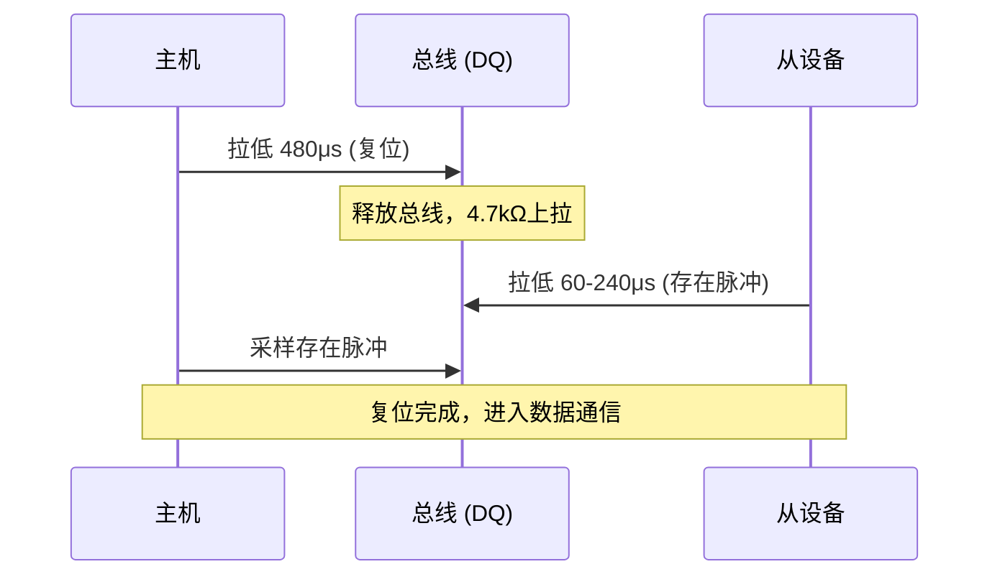
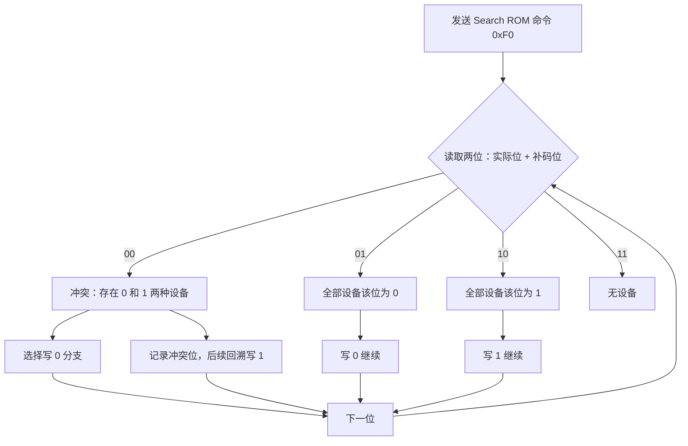
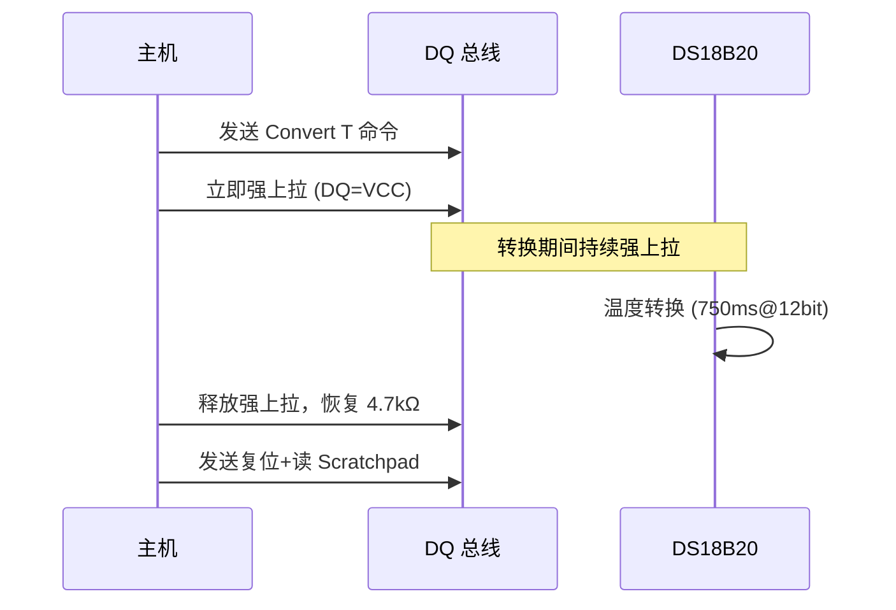

<span class="badge-i">[I]</span><span class="badge-e">[E]</span>

# 1-Wire 时序与搜索算法

<span class="red">1-Wire 的可靠性完全建立在精确的时隙控制之上，复位、写时隙、读时隙的每个微秒都关乎通信成败。</span> 搜索 ROM 算法则解决了一根总线上挂接多设备时的自动发现难题。

---

### 为什么需要 1-Wire

嵌入式系统中，<span class="red">某些场景对引脚数量的限制极端苛刻</span>——电子标签、温度探头、门禁卡等只需偶发通信，不值得占用两根甚至四根信号线。<br>
1-Wire 用**一根线**同时完成供电和数据传输，通过寄生电容储能机制让从设备在无外部电源时也能工作。<br>
这种极简架构在需要最低布线成本、最低接插件尺寸的领域中不可替代。


## 复位时隙

<span class="red">每次通信以主机发送 480μs 低电平复位脉冲开始，随后释放总线等待设备回复存在脉冲。</span>

### 时序参数



| 阶段 | 时长 | 电平 | 说明 |
|------|------|------|------|
| 复位低电平 | 480-960μs | 低 | 主机发送 |
| 等待恢复 | <15μs | 高 | 主机释放 |
| 存在脉冲 | 60-240μs | 低 | 设备回复 |
| 等待恢复 | >480μs | 高 | 设备释放 |

<span class="blue">易错点：复位低电平不足 480μs 时，设备可能不回复存在脉冲。总线电容大会拉长上升沿，需适当延长复位低电平时间。</span>

### 存在脉冲检测

主机在释放总线后 15-60μs 内采样 DQ，若读到低电平说明有设备在线。多个设备同时挂接时，所有设备都会回复存在脉冲，但电平不会冲突（都是拉低）。

---

## 写1/写0/读时隙

<span class="red">每个数据位占用一个时隙（time slot），写 1 和写 0 的槽宽不同，读时隙在槽内特定时刻采样。</span>

### 时隙对比

| 操作 | 主机动作 | 槽宽 | 关键时间 |
|------|----------|------|----------|
| 写 1 | 拉低 1-15μs 后释放 | 60-120μs | 槽内保持高电平 |
| 写 0 | 拉低 60μs | 60-120μs | 槽内保持低电平 |
| 读 1 | 拉低 1μs 后释放 | 60μs | 15μs 后采样高电平 |
| 读 0 | 拉低 1μs 后释放 | 60μs | 15μs 后采样低电平 |

主机在读时隙开始时拉低 DQ 1μs，随后释放。设备在槽内将 DQ 拉低（写 0）或保持释放（写 1）。主机在释放后 15μs 采样 DQ 电平，即为设备发送的位值。

<span class="blue">易错点：写 0 时主机必须在整个时隙（≥60μs）保持低电平，提前释放会被设备误认为写 1。</span>

---

## 搜索 ROM 算法

<span class="red">搜索 ROM（Search ROM）命令通过二叉树遍历，逐位识别总线上所有设备的 ROM-ID，是 1-Wire 多设备自动发现的核心算法。</span>

### 算法流程



### 冲突处理

当两位读取为 `00`（冲突）时，主机选择一个分支（如写 0），并记录冲突位的位置。完整遍历一条分支后，回溯到最后一个冲突位，选择另一个分支（写 1），继续遍历。 <br>
每发现一个完整 ROM-ID，算法回溯一次，直到所有冲突位都被处理完毕。

### 复杂度

N 个设备最多需要 `N × 64` 个时隙完成全部发现。实际中冲突位较少，通常远小于理论上限。

---

## 寄生电源模式的强上拉

<span class="red">DS18B20 温度转换期间电流可达 1.5mA，远超 4.7kΩ 上拉电阻在 5V 下的供电能力（约 1mA），必须启用强上拉。</span>

### 强上拉时序



### 电路实现

```c
// GPIO 控制强上拉示例（寄生电源模式）
void strong_pullup_enable(void)
{
    // DQ 设为推挽输出高电平
    gpio_set_direction(DQ_PIN, GPIO_OUTPUT);
    gpio_set_level(DQ_PIN, 1);
}

void strong_pullup_disable(void)
{
    // 恢复开漏输出，释放总线
    gpio_set_direction(DQ_PIN, GPIO_INPUT);
}
```

<span class="blue">易错点：强上拉期间不能进行任何 1-Wire 通信，主机必须保持 DQ 为高电平直到转换完成。</span>

---

## 代码：1-Wire bit-banging

<span class="red">无专用 1-Wire 外设时，可用 GPIO 软件模拟时序。关键在于严格控制延时精度。</span>

```c
#include <stdint.h>
#include <stdbool.h>

#define DQ_PIN  5
#define DQ_PORT GPIOA

// 微秒级延时（根据 CPU 频率校准）
static inline void delay_us(uint32_t us)
{
    // ARM Cortex-M: 72MHz 时约 72 个时钟周期/us
    volatile uint32_t cycles = us * 72 / 5;
    while (cycles--) __asm volatile("nop");
}

// 复位 + 检测存在脉冲
bool onewire_reset(void)
{
    bool present = false;
    
    // 主机拉低 480μs
    gpio_set_output(DQ_PORT, DQ_PIN, 0);
    delay_us(480);
    gpio_set_input(DQ_PORT, DQ_PIN);  // 释放
    delay_us(70);  // 等待设备响应
    
    // 采样：低电平 = 存在
    present = !gpio_read(DQ_PORT, DQ_PIN);
    delay_us(410);  // 等待总线恢复
    
    return present;
}

// 写一位
void onewire_write_bit(bool bit)
{
    if (bit) {
        // 写 1：拉低 1-15μs 后释放
        gpio_set_output(DQ_PORT, DQ_PIN, 0);
        delay_us(6);
        gpio_set_input(DQ_PORT, DQ_PIN);
        delay_us(64);  // 槽剩余时间
    } else {
        // 写 0：拉低 60μs
        gpio_set_output(DQ_PORT, DQ_PIN, 0);
        delay_us(60);
        gpio_set_input(DQ_PORT, DQ_PIN);
        delay_us(10);  // 恢复时间
    }
}

// 读一位
bool onewire_read_bit(void)
{
    bool bit;
    
    // 主机拉低 1μs 后释放
    gpio_set_output(DQ_PORT, DQ_PIN, 0);
    delay_us(1);
    gpio_set_input(DQ_PORT, DQ_PIN);
    delay_us(14);  // 等待设备驱动总线
    
    bit = gpio_read(DQ_PORT, DQ_PIN);
    delay_us(45);  // 槽剩余时间
    
    return bit;
}

// 写字节（LSB first）
void onewire_write_byte(uint8_t data)
{
    for (int i = 0; i < 8; i++) {
        onewire_write_bit(data & 0x01);
        data >>= 1;
    }
}

// 读字节
uint8_t onewire_read_byte(void)
{
    uint8_t data = 0;
    for (int i = 0; i < 8; i++) {
        data >>= 1;
        if (onewire_read_bit()) data |= 0x80;
    }
    return data;
}
```

### 延时精度要求

| 时隙 | 容差 | 说明 |
|------|------|------|
| 复位低电平 | ±30μs | 不能低于 480μs |
| 写 1 低电平 | ±1μs | 1-15μs 均可 |
| 写 0 低电平 | ±5μs | 必须 ≥60μs |
| 读采样时刻 | ±2μs | 释放后 15μs |

<span class="blue">易错点：使用系统滴答（SysTick）延时时，中断可能抢占并延长实际延时。1-Wire bit-banging 应关闭中断或使用硬件定时器。</span>

---

## 小节

- 复位时隙 480μs 低电平是所有通信的前提，存在脉冲确认设备在线。
- 写 1 拉低 1-15μs，写 0 拉低 60μs，读时隙在释放后 15μs 采样。
- 搜索 ROM 算法通过二叉树遍历自动发现总线上所有设备。
- 寄生电源的强上拉是温度转换成功的关键，不可省略。
- GPIO bit-banging 对延时精度要求极高，中断抢占会导致通信失败。

---

## 历史演进与发展趋势

1-Wire 总线由 Dallas Semiconductor（现 Maxim Integrated）于 1990 年推出，初衷是为 iButton 电子密钥提供极简的物理连接方式。单线通信的概念在当时极具颠覆性——仅用一根信号线即可完成供电和数据传输，大幅降低了接插件成本。1993 年，Dallas 发布了 DS1990 iButton 系列，将 1-Wire 推向工业和门禁市场。2000 年后，随着嵌入式温度传感器 DS18B20 的普及，1-Wire 进入消费电子领域。2007 年 Maxim 收购 Dallas 后持续维护协议规范。现代 1-Wire 生态中，OWFS（1-Wire File System）项目为 Linux 提供了完善的软件支持，使开发者能像操作文件一样读写 1-Wire 设备。尽管高速场景已被 I2C/SPI 取代，1-Wire 在低成本温度监测和电子标签领域仍不可替代。

---

## 本章小结

| 要点 | 内容 |
|------|------|
| 物理层 | 单线（DQ）+ 地线，寄生供电或外部供电，开漏输出 + 4.7kΩ 上拉 |
| 通信原理 | 复位脉冲 + 存在脉冲，写 1/写 0 时隙通过拉低时长区分 |
| 搜索算法 | 64-bit ROM ID 二进制搜索，利用冲突位逐步缩小范围 |
| 典型应用 | 温度传感器 DS18B20、iButton 电子标签、OWFS Linux 文件系统 |

## 练习

1. 1-Wire 总线上的从设备如何在不使用独立 VCC 引脚的情况下获得工作电源？请解释寄生供电（Parasite Power）的工作原理。
2. 1-Wire 搜索算法（Search ROM）如何在不知道任何从设备 ROM ID 的情况下，逐步枚举出总线上的所有设备？请描述二进制搜索的过程。
3. 在 Linux 系统中使用 OWFS 挂载 1-Wire 总线后，`/mnt/1wire/` 目录下的子目录和文件分别代表什么？如何用 `cat` 命令读取温度传感器的当前温度？
