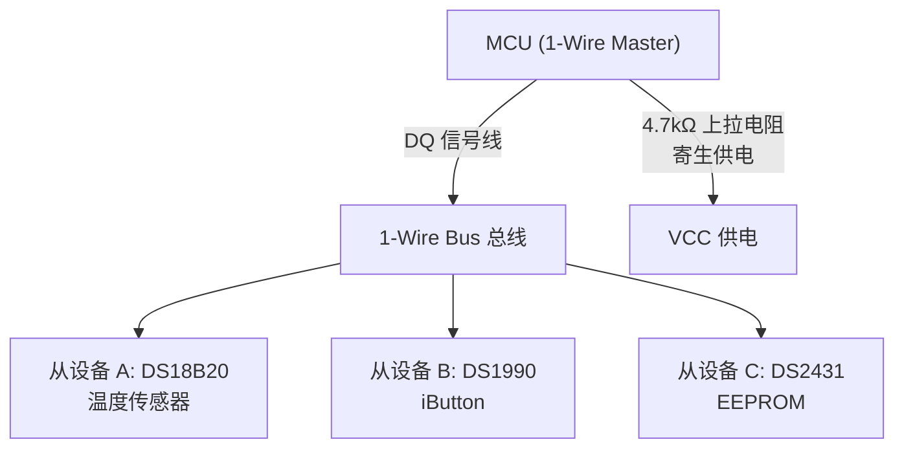

<span class="badge-e">[E]</span>

# 1-Wire 实战与 Linux 生态

<span class="red">Linux 内核的 w1-gpio 驱动将 1-Wire 总线抽象为 sysfs 接口，用户空间可直接读取温度而无需 bit-banging，是嵌入式项目快速集成的最佳路径。</span>

---

### 为什么需要 1-Wire

嵌入式系统中，<span class="red">某些场景对引脚数量的限制极端苛刻</span>——电子标签、温度探头、门禁卡等只需偶发通信，不值得占用两根甚至四根信号线。<br>
1-Wire 用**一根线**同时完成供电和数据传输，通过寄生电容储能机制让从设备在无外部电源时也能工作。<br>
这种极简架构在需要最低布线成本、最低接插件尺寸的领域中不可替代。


## Linux w1-gpio 驱动

<span class="red">w1-gpio 驱动利用 GPIO 的 open-drain 模式模拟 1-Wire 时序，将总线上的每个设备自动注册为独立 sysfs 节点。</span>

### 设备树配置

```dts
w1: w1-gpio {
    compatible = "w1-gpio";
    gpios = <&gpio0 4 GPIO_ACTIVE_HIGH>;  // GPIO0_4 作为 DQ
    pinctrl-names = "default";
    pinctrl-0 = <&w1_pins>;
    status = "okay";
};
```

w1-gpio 驱动会自动探测总线上的 1-Wire 设备，并在 `/sys/bus/w1/devices/` 下创建以 ROM-ID 命名的目录。对于寄生电源设备，驱动不支持自动强上拉，需要外部电路配合或改用 w1-gpio-pullup 驱动。

<span class="blue">易错点：w1-gpio 的 GPIO 必须配置为开漏输出（open-drain），推挽模式会在主机释放总线时与设备输出冲突，导致电平异常。</span>

### 内核配置

启用 w1-gpio 需要开启以下内核选项：

```
CONFIG_W1=y                    # 1-Wire 核心
CONFIG_W1_MASTER_GPIO=y        # GPIO 主控
CONFIG_W1_SLAVE_THERM=y        # 温度传感器从设备
```



---

## sysfs 接口

<span class="red">每个 1-Wire 设备在 sysfs 中拥有独立目录，温度传感器通过 w1_slave 文件暴露原始数据。</span>

### 目录结构

```
/sys/bus/w1/devices/
├── w1_bus_master1/          # 总线控制器
├── 28-0000072431ff/         # DS18B20 (Family=0x28)
│   └── w1_slave             # 温度原始数据
└── 10-0000085a4ab5/         # DS18S20 (Family=0x10)
    └── w1_slave
```

### 温度读取

```bash
# 1-Wire Linux 子系统命令示例
$ cat /sys/bus/w1/devices/28-0000072431ff/w1_slave
4b 01 4b 46 7f ff 05 10 6a : crc=6a YES
4b 01 4b 46 7f ff 05 10 6a : t=20687
```

`t=20687` 表示 20687 / 1000 = 20.687°C。前两行是 9 字节 Scratchpad 的十六进制转储，crc 验证通过显示 YES。

### 编程读取

```c
#include <stdio.h>
#include <stdlib.h>
#include <string.h>

float read_temp(const char *device_id)
{
    char path[128];
    snprintf(path, sizeof(path), "/sys/bus/w1/devices/%s/w1_slave", device_id);

    FILE *fp = fopen(path, "r");
    if (!fp) return -999.0f;

    char line[256];
    float temp = -999.0f;
    while (fgets(line, sizeof(line), fp)) {
        if (strstr(line, "crc=") && strstr(line, "YES")) {
            // 读取下一行获取温度
            if (fgets(line, sizeof(line), fp)) {
                char *p = strstr(line, "t=");
                if (p) temp = atoi(p + 2) / 1000.0f;
            }
            break;
        }
    }
    fclose(fp);
    return temp;
}
```

---

## 多设备挂接

<span class="red">1-Wire 总线支持多设备并联，Linux w1-gpio 驱动自动发现总线上的所有设备，每设备独立目录。</span>

### 自动发现机制

w1-gpio 驱动在加载时执行一次 Search ROM 遍历，将发现的设备注册到 sysfs。插入新设备后，可通过写入 `w1_bus_master1/w1_master_search` 触发重新搜索：

```bash
# 1-Wire Linux 子系统命令示例
echo 0 > /sys/bus/w1/devices/w1_bus_master1/w1_master_search
```

### 设备数量限制

1-Wire 总线的设备数量受限于上拉电阻驱动能力和总线电容。标准负载（100μA 待机电流）下，4.7kΩ 上拉可支持约 10 个设备。使用有源上拉（MOSFET）可扩展到数十个设备。

| 拓扑 | 最大设备数 | 最大距离 |
|------|-----------|----------|
| 线性 | ~10 | 100m |
| 星型（短支线） | ~5 | 主干 50m |
| 有源上拉 | ~50 | 300m |

---

## 常见坑点

<span class="red">1-Wire 的可靠性对物理层极为敏感，上拉电阻、线缆长度和电容是三个最常见的故障源。</span>

### GPIO 上拉电阻

GPIO 内部上拉电阻通常为 20-50kΩ，阻值过大导致总线高电平建立时间（RC 充电）过长，超过时隙允许窗口。1-Wire 必须使用外部 4.7kΩ 上拉电阻。

<span class="blue">易错点：忘记连接外部上拉电阻，仅用 GPIO 内部上拉，会导致随机通信失败，尤其在总线电容较大时。</span>

### 长距离传输

总线长度超过 30 米时，线缆分布电容（约 50pF/m）导致上升沿变缓。100 米总线电容约 5000pF，与 4.7kΩ 上拉的 RC 时间常数为 23.5μs，远超过读时隙的 15μs 采样窗口。

解决方案：
- 降低上拉电阻（如 1kΩ），但会增加功耗
- 使用有源上拉（MOSFET 快速充电）
- 使用中继器或 1-Wire 延长器芯片（如 DS2409）

### 寄生电源可靠性

寄生电源模式的 DS18B20 在温度转换期间需要强上拉。Linux w1-gpio 驱动默认不支持强上拉，解决方案包括：
- 使用 w1-gpio-pullup 驱动（带强上拉 GPIO 控制）
- 外部 VCC 供电（改为外部供电模式）
- 修改驱动源码添加强上拉支持

---

## 1-Wire vs I2C/SPI 选型表

<span class="red">1-Wire 不是 I2C/SPI 的替代品，而是在极简布线场景下的专用方案。</span>

| 场景 | 推荐总线 | 原因 |
|------|----------|------|
| 单点温度测量 | 1-Wire | 仅需 2 根线 |
| 多点温度（>5） | I2C | 速率更高，多设备更稳定 |
| 高速数据采集 | SPI | 速率可达 MHz 级 |
| 长距离户外测温 | 1-Wire + 有源上拉 | 支持 100m+ |
| 电池供电 | 1-Wire | 待机功耗极低 |

类比：1-Wire 像一根绳子挂多个铃铛（串在一起，拉一下就响），I2C 像总线站台（每站有编号，广播到站），SPI 像光纤直连（速度快但一对一）。

---

## 小节

- Linux w1-gpio 驱动将 GPIO 模拟为 1-Wire 总线，sysfs 接口简化温度读取。
- 每个设备独立 sysfs 目录，ROM-ID 作为唯一标识。
- 外部 4.7kΩ 上拉是必须的，GPIO 内部上拉阻值过大。
- 长距离传输需关注总线电容，有源上拉是解决之道。
- 1-Wire 适用于极简布线场景，速率和多设备支持不如 I2C/SPI。
- w1-gpio 驱动的内核配置需开启 CONFIG_W1、CONFIG_W1_MASTER_GPIO 和对应从设备驱动。

---

## 历史演进与发展趋势

1-Wire 总线由 Dallas Semiconductor（现 Maxim Integrated）于 1990 年推出，初衷是为 iButton 电子密钥提供极简的物理连接方式。单线通信的概念在当时极具颠覆性——仅用一根信号线即可完成供电和数据传输，大幅降低了接插件成本。1993 年，Dallas 发布了 DS1990 iButton 系列，将 1-Wire 推向工业和门禁市场。2000 年后，随着嵌入式温度传感器 DS18B20 的普及，1-Wire 进入消费电子领域。2007 年 Maxim 收购 Dallas 后持续维护协议规范。现代 1-Wire 生态中，OWFS（1-Wire File System）项目为 Linux 提供了完善的软件支持，使开发者能像操作文件一样读写 1-Wire 设备。尽管高速场景已被 I2C/SPI 取代，1-Wire 在低成本温度监测和电子标签领域仍不可替代。

---

## 本章小结

| 要点 | 内容 |
|------|------|
| 物理层 | 单线（DQ）+ 地线，寄生供电或外部供电，开漏输出 + 4.7kΩ 上拉 |
| 通信原理 | 复位脉冲 + 存在脉冲，写 1/写 0 时隙通过拉低时长区分 |
| 搜索算法 | 64-bit ROM ID 二进制搜索，利用冲突位逐步缩小范围 |
| 典型应用 | 温度传感器 DS18B20、iButton 电子标签、OWFS Linux 文件系统 |

## 练习

1. 1-Wire 总线上的从设备如何在不使用独立 VCC 引脚的情况下获得工作电源？请解释寄生供电（Parasite Power）的工作原理。
2. 1-Wire 搜索算法（Search ROM）如何在不知道任何从设备 ROM ID 的情况下，逐步枚举出总线上的所有设备？请描述二进制搜索的过程。
3. 在 Linux 系统中使用 OWFS 挂载 1-Wire 总线后，`/mnt/1wire/` 目录下的子目录和文件分别代表什么？如何用 `cat` 命令读取温度传感器的当前温度？
