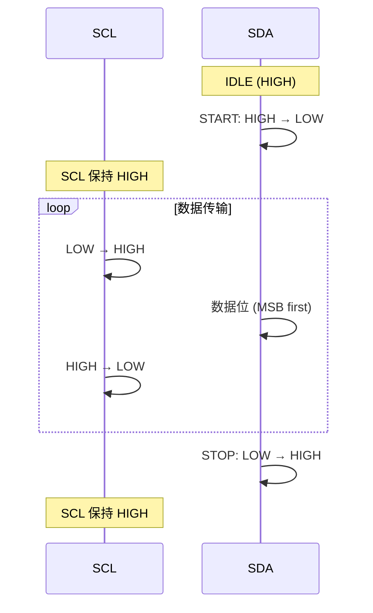
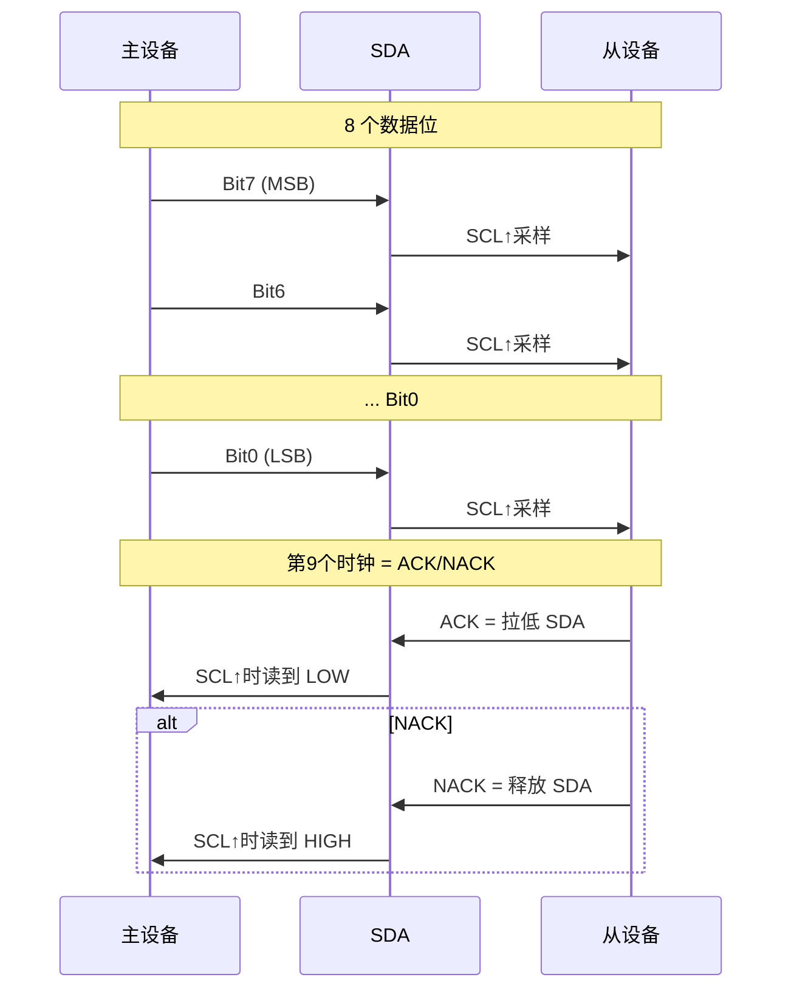
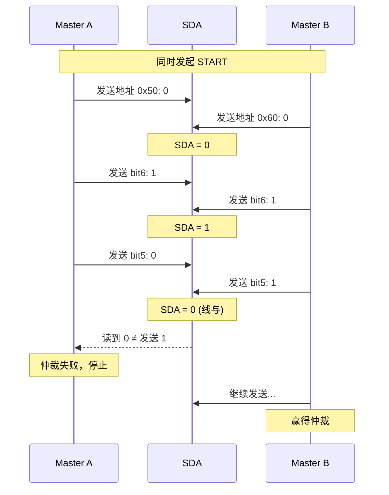

# I2C 时序与起始停止条件

<span class="badge-i">[I]</span>

---

### START、STOP 与 Repeated START 条件

<span class="red">I2C 通信的边界由 SDA 边沿与 SCL 电平的组合定义</span>，
不是简单的"高变低"。
<br>
所有数据传输都以 START（S）开始，以 STOP（P）结束。
<br>

| 条件 | SCL 状态 | SDA 变化 | 作用 |
|------|----------|----------|------|
| START | 高电平 | SDA 从高→低 | 启动新传输 |
| STOP | 高电平 | SDA 从低→高 | 结束传输，释放总线 |
| Repeated START | 高电平 | SDA 从高→低 | 不释放总线，继续新传输 |



<span class="blue">关键认知：START 和 STOP 都是 SCL 为高时 SDA 的跳变；
<br>
数据位在 SCL 为高期间必须稳定，SCL 为低期间允许变化。</span>
<br>

Repeated START（Sr）的独特价值：
<br>
主设备发送 Sr 后无需发送 STOP，可直接发起新的寻址或读写方向切换。
<br>
这在"先写寄存器地址、再读数据"的场景中至关重要。
<br>

---

### 字节传输：8 位数据 + ACK/NACK

每个字节固定 8 位，MSB（最高位）先发送。
<br>
发送完 8 个数据位后，第 9 个时钟周期用于应答。
<br>



<span class="green">ACK（Acknowledge，应答）</span>：从设备在第 9 个 SCL 周期拉低 SDA，
<br>
表示"我收到了，请继续"。
<br>
<span class="green">NACK（Not Acknowledge）</span>：从设备释放 SDA（高电平），
<br>
表示"我没收到/地址不对/数据满了/请求终止"。
<br>

ACK 字段解析：
<br>
- 地址帧后的 ACK：从设备存在且已唤醒
<br>
- 数据帧后的 ACK：写入成功/读取继续
<br>
- 主设备发出的 NACK：告诉从设备"这是最后一字节，别发了"
<br>

---

### 时钟同步与 Clock Stretching

<span class="red">Clock Stretching（时钟延展）</span>是从设备主动控制传输节奏的机制。
<br>
从设备在需要更多处理时间时，将 SCL 拉低，强制主设备等待。
<br>
主设备的 SCL 也是开漏输出，所以从设备拉低 SCL 后，
<br>
主设备无法将 SCL 拉高，只能等待从设备释放。
<br>

典型场景：
<br>
- EEPROM 写入一页数据后需要 5ms 内部烧录，期间拉低 SCL
<br>
- 传感器 ADC 转换未完成，请求延时
<br>

```c
// 软件模拟 I2C 读取 ACK 时需处理 clock stretching
uint8_t i2c_wait_ack(void) {
    uint8_t timeout = 0;
    SDA_SET_INPUT();           // 释放 SDA，让从设备驱动
    SCL_SET_HIGH();
    delay_us(5);
    while (SCL_READ() == 0) {  // 从设备拉低了 SCL？等待
        timeout++;
        if (timeout > 200) {   // 超时 ~10ms
            i2c_stop();
            return 1;          // ACK 失败
        }
        delay_us(50);
    }
    uint8_t ack = SDA_READ();  // SCL 为高时采样 SDA
    SCL_SET_LOW();
    return ack;
}
```

<span class="blue">易错点：部分主设备（如某些 FPGA IP）不支持 clock stretching，
<br>
强行驱动 SCL 会无视从设备的拉低请求，导致数据错乱。</span>
<br>

---

### 多主仲裁机制

I2C 支持多主设备共存，仲裁通过 <span class="red">线与逻辑</span> 实现。
<br>
两个主设备同时发送数据时，各自在每个 SCL 周期回读 SDA。
<br>
若回读值与发送值不一致，该主设备即仲裁失败，立即停止发送。
<br>

仲裁流程：
<br>
1. 主设备 A 发送 1（释放 SDA），主设备 B 发送 0（拉低 SDA）
<br>
2. 总线 SDA = 0（线与结果）
<br>
3. 主设备 A 回读到 0，与发送的 1 不符 → 仲裁失败，退出发送
<br>
4. 主设备 B 回读到 0，与发送的 0 一致 → 继续发送
<br>

由于地址和数据都是 MSB 先发送，
<br>
优先级高的设备（地址数值更小）天然赢得仲裁。
<br>
这类似于 CAN 总线的"显性位优先"机制。
<br>



<span class="blue">关键认知：仲裁只发生在地址阶段，
<br>
数据传输阶段不应有多主并发（总线协议不允许）。</span>
<br>

---

### 代码：软件模拟 I2C（GPIO Bit-Banging）

裸机平台或没有硬件 I2C 控制器时，可用 GPIO 软件模拟。
<br>
核心思路：精确控制 SDA/SCL 的高低电平和延时。
<br>

```c
#include <stdint.h>

#define SDA_PORT    GPIOA
#define SDA_PIN     GPIO_PIN_9
#define SCL_PORT    GPIOA
#define SCL_PIN     GPIO_PIN_8

#define SDA_HIGH()  HAL_GPIO_WritePin(SDA_PORT, SDA_PIN, GPIO_PIN_SET)
#define SDA_LOW()   HAL_GPIO_WritePin(SDA_PORT, SDA_PIN, GPIO_PIN_RESET)
#define SCL_HIGH()  HAL_GPIO_WritePin(SCL_PORT, SCL_PIN, GPIO_PIN_SET)
#define SCL_LOW()   HAL_GPIO_WritePin(SCL_PORT, SCL_PIN, GPIO_PIN_RESET)
#define SDA_READ()  HAL_GPIO_ReadPin(SDA_PORT, SDA_PIN)

static inline void delay_us(uint32_t us) {
    for (volatile uint32_t i = 0; i < us * 8; i++);  // 粗略延时，需校准
}

// START 条件：SCL=1 时 SDA 从高→低
void i2c_start(void) {
    SDA_HIGH();  SCL_HIGH();  delay_us(5);
    SDA_LOW();   delay_us(5);
    SCL_LOW();   delay_us(5);
}

// STOP 条件：SCL=1 时 SDA 从低→高
void i2c_stop(void) {
    SDA_LOW();   SCL_LOW();   delay_us(5);
    SCL_HIGH();  delay_us(5);
    SDA_HIGH();  delay_us(5);
}

// 发送 1 字节
void i2c_send_byte(uint8_t data) {
    for (int i = 0; i < 8; i++) {
        if (data & 0x80) SDA_HIGH();  // MSB first
        else             SDA_LOW();
        delay_us(5);
        SCL_HIGH();  delay_us(5);
        SCL_LOW();   delay_us(5);
        data <<= 1;
    }
}

// 接收 1 字节，ack=1 发送 ACK，ack=0 发送 NACK
uint8_t i2c_recv_byte(uint8_t ack) {
    uint8_t data = 0;
    SDA_HIGH();  // 释放 SDA，让从设备驱动
    for (int i = 0; i < 8; i++) {
        data <<= 1;
        SCL_HIGH();  delay_us(5);
        if (SDA_READ()) data |= 0x01;
        SCL_LOW();   delay_us(5);
    }
    if (ack) SDA_LOW();  // ACK
    else     SDA_HIGH(); // NACK
    delay_us(5);
    SCL_HIGH();  delay_us(5);
    SCL_LOW();   delay_us(5);
    return data;
}
```

<span class="blue">软件模拟的局限性：
<br>
1. 速率受限于 GPIO 翻转速度和延时精度
<br>
2. 无硬件仲裁保护，多主场景不可靠
<br>
3. 中断延迟可能导致时序违例</span>
<br>

<span class="purple">扩展：Linux 内核的 i2c-gpio 驱动就是用 GPIO 模拟 I2C，
<br>
通过设备树配置 sda/scl 引脚即可生成 /dev/i2c-X 设备节点。</span>
<br>

---

**学习路径提示**：
<br>
- <span class="badge-i">[I]</span> 读者：掌握 START/STOP 的精确时序定义，
<br>
  ACK/NACK 是理解后续读写流程的基础。
<br>
- 关注 clock stretching 对固件的影响——某些从设备会静默拖慢总线。

### 为什么需要 I2C

嵌入式系统中，<span class="red">传感器、EEPROM、RTC</span> 等外设数量动辄十几个。<br>
如果每个外设都用独立的数据+时钟线连接主控，引脚资源很快耗尽。<br>
SPI 虽快但每条从设备独占一条 CS 线，布线复杂。<br>
I2C（Inter-Integrated Circuit，集成电路互连总线）用 **两条线** 连接 **多个设备**，<br>
节省引脚、简化 PCB 走线，是低速外设通信的首选方案。

---

## 历史演进与发展趋势

I2C 由 Philips（现 NXP）于 1982 年发明，最初用于电视机内部芯片间的通信，目的是减少 PCB 走线数量。1992 年发布 1.0 规范，定义了 100kHz 标准模式和 400kHz 快速模式。2000 年推出 3.4MHz 高速模式（Hs），通过电流源上拉大幅压缩上升时间。2006 年 Fast-mode Plus（Fm+，1MHz）发布，2012 年推出 Ultra Fast-mode（UFm，5MHz，单向推挽）。2014 年后，I2C 与 SMBus（Intel 1995 年推出的系统管理总线）深度兼容，成为服务器、笔记本电池管理的标准。MIPI I3C 作为 I2C 的精神继承者于 2016 年发布，在保留两线架构的基础上引入动态地址和高达 12.5MHz 的 SDR 速率，正在逐步取代传统 I2C。

---

## 本章小结

| 要点 | 内容 |
|------|------|
| 物理层 | SDA + SCL 双线，开漏输出 + 上拉电阻，线与逻辑实现仲裁 |
| 时序 | START（SCL 高时 SDA 下降沿）+ STOP（SCL 高时 SDA 上升沿） |
| 寻址 | 7-bit 或 10-bit 从地址，广播地址 0x00，ACK/NACK 确认机制 |
| 速度模式 | Standard 100kHz / Fast 400kHz / Fm+ 1MHz / Hs 3.4MHz |
| 调试工具 | 逻辑分析仪、i2cdetect/i2cdump/i2cset/i2cget 命令行工具 |

## 练习

1. I2C 采用开漏输出（Open-Drain）而非推挽输出（Push-Pull）的根本原因是什么？开漏输出如何实现多设备共用一条总线的线与逻辑？
2. 标准模式（100kHz）和快速模式（400kHz）下，上拉电阻的典型取值分别是多少？如果总线电容过大（如 PCB 走线过长），为什么会导致通信失败？
3. I2C 的 7 位地址和 10 位地址有什么区别？在什么场景下必须使用 10 位地址？请写出 10 位地址传输的时序步骤。
