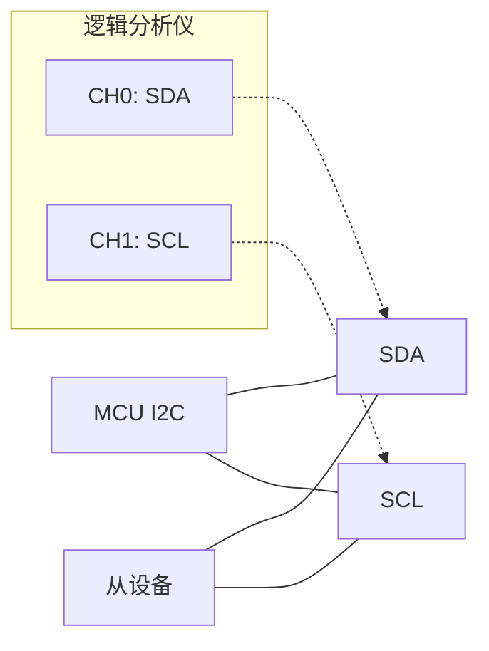

# I2C 故障排查与工具

<span class="badge-e">[E]</span>

---

### 总线挂死检测与恢复

<span class="red">总线挂死（Bus Stuck）</span>是 I2C 最常见的现场故障。
<br>
典型表现：SDA 或 SCL 被某个设备持续拉低，主设备无法发起 START。
<br>

挂死原因分类：
<br>
| 类型 | 表现 | 根因 |
|------|------|------|
| SDA stuck low | SDA=0, SCL可拉高 | 从设备死机未释放SDA |
| SCL stuck low | SCL=0 | 从设备clock stretching超时 |
| 双 stuck | SDA=SCL=0 | 设备断电时开漏输出异常 |

检测方法：
<br>
主设备尝试发送 START，发送后读取 SDA。
<br>
若 SDA 仍为低，说明总线被占用。
<br>

恢复方法——9 个时钟脉冲法：
<br>
主设备将 SCL 手动翻转 9 个周期（或更多），
<br>
强迫从设备完成当前字节传输并释放 SDA。
<br>
之后发送 STOP 条件，总线恢复正常。
<br>

```c
// 总线恢复：发送 9 个 SCL 脉冲 + STOP
void i2c_bus_recovery(void) {
    SDA_SET_OUTPUT();
    SDA_HIGH();
    for (int i = 0; i < 9; i++) {
        SCL_HIGH();  delay_us(5);
        SCL_LOW();   delay_us(5);
        if (SDA_READ()) break;  // SDA 已释放，提前结束
    }
    i2c_stop();
}
```

<span class="blue">易错点：9 个时钟不一定够——
<br>
从设备可能在等第 10 个时钟（ACK 位）。
<br>
一般发送 9~16 个时钟直到 SDA 释放。
</span>
<br>

---

### i2cdetect 完整输出解读

`i2cdetect` 扫描 I2C 总线上所有设备，输出地址矩阵。
<br>

```bash
# 命令说明
$ i2cdetect -y 1
     0  1  2  3  4  5  6  7  8  9  a  b  c  d  e  f
00:          -- -- -- -- -- -- -- -- -- -- -- -- --
10: -- -- -- -- -- -- -- -- -- -- -- -- -- -- -- --
20: -- -- -- -- -- -- -- -- -- -- -- -- -- -- -- --
30: -- -- -- -- -- -- -- -- -- -- -- -- 3c -- -- --
40: -- -- -- -- -- -- -- -- -- -- -- -- -- -- -- --
50: 50 -- -- -- -- -- -- -- -- -- -- -- -- -- -- --
60: -- -- -- -- -- -- -- -- UU -- -- -- -- -- -- --
70: -- -- -- -- -- -- -- --
```

输出符号含义：
<br>
| 符号 | 含义 |
|------|------|
| `--` | 该地址无设备响应 |
| `XX` | 检测到设备，地址为十六进制 |
| `UU` | 地址被内核驱动占用，用户空间不可访问 |

解读示例：
<br>
- `0x3c`：检测到 OLED 显示屏（SSD1306 常用地址）
<br>
- `0x50`：检测到 EEPROM（AT24Cxx 常用地址）
<br>
- `0x68` 位置的 `UU`：RTC 芯片（如 DS3231）被内核 rtc-ds1307 驱动绑定
<br>

<span class="blue">关键认知：`UU` 表示该设备已被内核驱动认领，
<br>
用 i2cget/i2cset 访问会报错"Device or resource busy"。
</span>
<br>

---

### i2cdump / i2cget / i2cset 命令

**i2cget**：读取单个寄存器
<br>

```bash
# 从总线 1、设备 0x50 的寄存器 0x10 读取 1 字节
$ i2cget -y 1 0x50 0x10
0xa5
```

**i2cset**：写入单个寄存器
<br>

```bash
# 向总线 1、设备 0x50 的寄存器 0x10 写入 0x55
$ i2cset -y 1 0x50 0x10 0x55
```

**i2cdump**：批量读取所有寄存器
<br>

```bash
# 以字节模式读取设备 0x50 的全部 256 字节
$ i2cdump -y 1 0x50
     0  1  2  3  4  5  6  7  8  9  a  b  c  d  e  f
00: XX XX XX XX XX XX XX XX XX XX XX XX XX XX XX XX
10: 55 XX XX XX XX XX XX XX XX XX XX XX XX XX XX XX
```

<span class="green">`-y` 参数</span>表示跳过确认提示，脚本中常用。
<br>
<span class="green">`i2cset` 的 `i` 模式</span>（`i2cset -y 1 0x50 0x00 i`）
<br>
表示自动递增寄存器地址，适合连续写入。
<br>

---

### 逻辑分析仪抓取

Saleae Logic / PulseView 是 I2C 调试的利器。
<br>
接线只需将探针挂到 SDA 和 SCL 上，设置采样率 ≥ 4× 总线速率。
<br>



波形解读要点：
<br>
| 特征 | 正常波形 | 异常波形 |
|------|----------|----------|
| START | SCL=1 时 SDA↓ | SCL 抖动时 SDA 变化 |
| 数据位 | SCL=1 时 SDA 稳定 | SCL=1 时 SDA 跳变 |
| ACK | SCL 第9周期 SDA=0 | SDA 保持高（无设备响应） |
| STOP | SCL=1 时 SDA↑ | SDA 先变高后 SCL 才变高 |

常见问题波形：
<br>
- **ACK 缺失**：8 数据位后第 9 个时钟 SDA 仍高 → 地址错误或设备未上电
<br>
- **SDA 缓慢上升**：上拉电阻太大或总线电容过高
<br>
- **SCL 毛刺**：GPIO 模拟 I2C 时开关模式切换不及时
<br>

<span class="blue">关键认知：逻辑分析仪能直接看到 ACK/NACK，
<br>
比软件打印日志更直观地定位"是主设备发错还是设备没回"。
</span>
<br>

---

### 常见故障速查表

| 故障现象 | 可能原因 | 排查方法 |
|----------|----------|----------|
| i2cdetect 扫描无结果 | 设备未上电、地址不对、SDA/SCL 接反 | 测电压、查原理图 |
| ACK 缺失 | 从设备地址错误、从设备死机、总线速度过高 | 用逻辑分析仪抓地址帧 |
| 地址冲突 | 两个设备同地址 | 改 A0/A1/A2 引脚电平或换器件 |
| 数据读写错乱 | 时钟太快、上拉不匹配、信号完整性差 | 降速到 100kHz 测试 |
| 间歇性失败 | 中断干扰软件模拟时序、clock stretching 未处理 | 用硬件 I2C 或关中断模拟 |
| 总线挂死 | 从设备异常拉低 SDA | 发送 9 个 SCL 脉冲恢复 |

<span class="red">地址冲突</span>是最隐蔽的故障：
<br>
多个设备共享同一地址时，
<br>
从设备都会 ACK，但数据会冲突（线与结果不可预期）。
<br>
部分芯片有地址引脚（A0/A1/A2），通过接地/接 VCC 组合设定地址。
<br>

<span class="blue">易错点：速度不匹配——
<br>
主设备 400kHz，从设备只支持 100kHz，
<br>
会导致从设备采样错位，数据随机出错。
</span>
<br>

<span class="purple">扩展：Linux 内核的 i2c-stub 驱动可以虚拟一个 I2C 设备，
<br>
用于在用户空间测试驱动逻辑而无需真实硬件。
</span>
<br>

---

**学习路径提示**：
<br>
- <span class="badge-e">[E]</span> 读者：遇到 I2C 问题，先用 i2cdetect 确认设备是否在线，
<br>
  再用逻辑分析仪抓波形，最后看 ACK/时序。
<br>
- 总线挂死不要慌，9 个 SCL 脉冲 + STOP 是标准恢复流程。

### 为什么需要 I2C

嵌入式系统中，<span class="red">传感器、EEPROM、RTC</span> 等外设数量动辄十几个。<br>
如果每个外设都用独立的数据+时钟线连接主控，引脚资源很快耗尽。<br>
SPI 虽快但每条从设备独占一条 CS 线，布线复杂。<br>
I2C（Inter-Integrated Circuit，集成电路互连总线）用 **两条线** 连接 **多个设备**，<br>
节省引脚、简化 PCB 走线，是低速外设通信的首选方案。

---

## 历史演进与发展趋势

I2C 由 Philips（现 NXP）于 1982 年发明，最初用于电视机内部芯片间的通信，目的是减少 PCB 走线数量。1992 年发布 1.0 规范，定义了 100kHz 标准模式和 400kHz 快速模式。2000 年推出 3.4MHz 高速模式（Hs），通过电流源上拉大幅压缩上升时间。2006 年 Fast-mode Plus（Fm+，1MHz）发布，2012 年推出 Ultra Fast-mode（UFm，5MHz，单向推挽）。2014 年后，I2C 与 SMBus（Intel 1995 年推出的系统管理总线）深度兼容，成为服务器、笔记本电池管理的标准。MIPI I3C 作为 I2C 的精神继承者于 2016 年发布，在保留两线架构的基础上引入动态地址和高达 12.5MHz 的 SDR 速率，正在逐步取代传统 I2C。

---

## 本章小结

| 要点 | 内容 |
|------|------|
| 物理层 | SDA + SCL 双线，开漏输出 + 上拉电阻，线与逻辑实现仲裁 |
| 时序 | START（SCL 高时 SDA 下降沿）+ STOP（SCL 高时 SDA 上升沿） |
| 寻址 | 7-bit 或 10-bit 从地址，广播地址 0x00，ACK/NACK 确认机制 |
| 速度模式 | Standard 100kHz / Fast 400kHz / Fm+ 1MHz / Hs 3.4MHz |
| 调试工具 | 逻辑分析仪、i2cdetect/i2cdump/i2cset/i2cget 命令行工具 |

## 练习

1. I2C 采用开漏输出（Open-Drain）而非推挽输出（Push-Pull）的根本原因是什么？开漏输出如何实现多设备共用一条总线的线与逻辑？
2. 标准模式（100kHz）和快速模式（400kHz）下，上拉电阻的典型取值分别是多少？如果总线电容过大（如 PCB 走线过长），为什么会导致通信失败？
3. I2C 的 7 位地址和 10 位地址有什么区别？在什么场景下必须使用 10 位地址？请写出 10 位地址传输的时序步骤。
