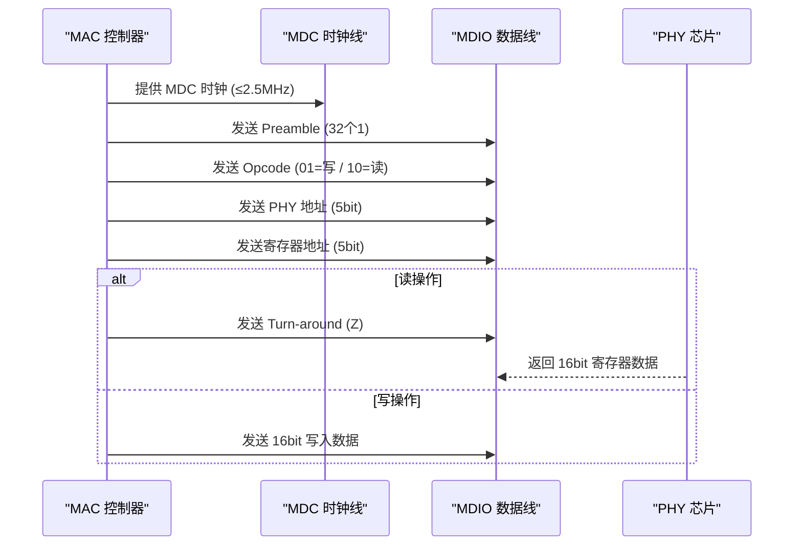

<span class="badge-b">[B]</span><span class="badge-i">[I]</span>

# MDIO 基础认知与 MII 接口

<span class="red">MDIO（Management Data Input/Output）是 IEEE 802.3 定义的以太网 PHY 管理接口，通过两根线完成 PHY 寄存器的读写，是调试以太网链路问题的必备工具。</span>

类比：MDIO 就像电视遥控器——电视机（MAC）通过红外线（MDC/MDIO）告诉机顶盒（PHY）切换频道（配置寄存器），而真正的音视频数据通过 HDMI（MII/RGMII）传输。

---

## 为什么需要 MDIO

<span class="red">以太网 PHY 芯片负责物理层信号编解码、自动协商、链路检测等功能，MAC 需要通过 MDIO 读写 PHY 内部寄存器完成配置和状态监控。</span>

### PHY 的职责

PHY（Physical Layer Transceiver）是 OSI 第一层设备，功能包括：
- 数据编解码：Manchester / 4B/5B / 8B/10B / PAM5
- 自动协商：与对方协商速率和双工模式
- 链路检测：监控载波信号，上报 link up/down
- 错误统计：CRC 错误、帧对齐错误计数

MAC（Media Access Control）是 OSI 第二层设备，负责帧封装、寻址、CRC 校验。MAC 与 PHY 之间通过 MII 系列接口传输数据，通过 MDIO 管理 PHY。

### 管理接口的必要性

PHY 上电后有默认配置，但以下场景需要动态管理：
- 强制 100M/全双工（禁用自动协商）
- 读取链路状态（link up/down、速率、双工）
- 读取错误计数器诊断链路质量
- 配置 LED 指示灯模式
- 关闭/开启节能模式
- 配置 RGMII 内部延迟参数



---

## MDIO/MDC 信号

<span class="red">MDIO 是双向数据线，MDC 是时钟线，两根线共同构成类似 I2C 的串行管理总线，最大时钟频率 2.5MHz。</span>

### 信号定义

| 信号 | 方向 | 作用 |
|------|------|------|
| MDC | MAC→PHY | 时钟，最大 2.5MHz |
| MDIO | 双向 | 数据，Open-drain |

MDIO 为开漏输出，需要上拉电阻（通常 1.5kΩ）。MDC 由 MAC 产生，PHY 在 MDC 上升沿采样 MDIO，下降沿驱动 MDIO。

### 时序参数

| 参数 | 最小值 | 最大值 |
|------|--------|--------|
| MDC 周期 | 400ns | - |
| MDIO 建立时间 | 10ns | - |
| MDIO 保持时间 | 10ns | - |
| 帧间隔 | 10ns | - |

### 与 I2C 的异同

| 特性 | MDIO | I2C |
|------|------|-----|
| 信号线 | 2（MDC+MDIO） | 2（SCL+SDA） |
| 时钟源 | 主设备 | 主设备 |
| 地址宽度 | 5 bit PHY + 5 bit Reg | 7/10 bit |
| 数据宽度 | 16 bit | 8 bit |
| 速率 | ≤2.5MHz | ≤3.4MHz |
| 应用领域 | 以太网 PHY | 通用外设 |

---

## MII 寄存器空间

<span class="red">IEEE 802.3 定义了 32 个基本寄存器（地址 0-31），所有 PHY 必须实现寄存器 0-6，其余为厂商自定义。</span>

### 基本寄存器表

| 地址 | 寄存器 | 作用 |
|------|--------|------|
| 0 | Control | 复位、自协商使能、速率/双工强制 |
| 1 | Status | 能力、链路状态、自协商完成 |
| 2 | PHY ID 1 | OUI 高 16 位 |
| 3 | PHY ID 2 | OUI 低 6 位 + Model + Revision |
| 4 | Auto-Neg Adv |  advertise 能力 |
| 5 | Auto-Neg Link |  链接伙伴能力 |
| 6 | Auto-Neg Exp |  自协商扩展状态 |
| 17/18 | Status 2 / Ext Status | 扩展状态 |

### 寄存器 0（Control）关键位

| 位 | 名称 | 作用 |
|----|------|------|
| 15 | Reset | 写 1 复位 PHY，自动清零 |
| 12 | Auto-Neg Enable | 1=启用自动协商 |
| 9 | Restart Auto-Neg | 写 1 重启协商 |
| 13 | Speed Select (LSB) | 与 bit 6 组成速率选择 |
| 6 | Speed Select (MSB) | 00=10M, 01=100M, 10=1000M |
| 8 | Duplex Mode | 1=全双工 |

### 寄存器 1（Status）关键位

| 位 | 名称 | 作用 |
|----|------|------|
| 5 | Auto-Neg Complete | 自协商完成 |
| 2 | Link Status | 1=链路建立，0=断开 |
| 3 | Auto-Neg Ability | PHY 支持自协商 |
| 4 | Remote Fault | 远端故障检测 |

---

## Clause 22 vs Clause 45

<span class="red">IEEE 802.3 定义了两种 MDIO 帧格式：Clause 22 用于 10/100/1000M 以太网，Clause 45 用于 10G+ 和更复杂的寄存器寻址。</span>

### 帧格式差异

| 特性 | Clause 22 | Clause 45 |
|------|-----------|-----------|
| 数据宽度 | 16 bit | 16 bit |
| 寄存器地址 | 5 bit（0-31） | 16 bit（通过两次访问） |
| 设备类型 | PHY 地址（0-31） | Device 地址（0-31） |
| 适用速率 | ≤1G | 10G+ |
| Preamble | 32 位 | 32 位（可配置缩短） |

Clause 45 通过两次帧访问实现 16 位寄存器寻址：第一次写入目标寄存器地址，第二次读写数据。Clause 22 一次帧即可完成寄存器访问。

<span class="purple">扩展：Clause 22 的 5 位 PHY 地址限制最多 32 个 PHY，Clause 45 扩展了 Device 类型字段，支持 PCS、PMA、ANEG 等不同子层的管理。现代交换机芯片通过 Clause 45 管理内部 SerDes 和 PCS 子层。</span>

---

## PHY ID 读取

<span class="red">寄存器 2 和 3 组成 32 位 PHY ID，包含厂商 OUI（Organizationally Unique Identifier）、芯片型号和版本号，用于内核驱动匹配。</span>

### ID 结构

```
Reg 2: OUI[21:6]        (16 bit)
Reg 3: OUI[5:0] + Model (6+6 bit) + Revision (4 bit)
```

| 厂商 | OUI | 常见型号 |
|------|-----|----------|
| Realtek | 0x001cc0 | RTL8211E, RTL8211F |
| Micrel | 0x000885 | KSZ9031, KSZ8081 |
| Marvell | 0x005043 | 88E1512, 88E1545 |
| Texas Instruments | 0x080028 | DP83867, DP83822 |
| Intel | 0x001b21 | I210, I225 |

Linux 内核的 PHY 驱动通过 phy_id 和 phy_id_mask 匹配设备：

```c
// 功能说明
static struct phy_driver rtl8211e_driver = {
    .phy_id     = 0x001cc915,
    .phy_id_mask= 0x001fffff,
    .name       = "RTL8211E Gigabit Ethernet",
    ...
};
```

---

## 小节

- MDIO 是 MAC 管理 PHY 的专用接口，2 线（MDC+MDIO）类似 I2C。
- 寄存器 0-6 是 IEEE 强制实现的，其余为厂商扩展。
- Clause 22 用于千兆以下，Clause 45 用于万兆和更复杂寻址。
- PHY ID 由 OUI+Model+Revision 组成，驱动匹配的依据。
- MII/MDIO 是理解以太网硬件生态的基础，后续章节将深入寄存器读写和链路调试。

---

## 历史演进与发展趋势

MDIO（Management Data Input/Output）伴随 IEEE 802.3u 快速以太网标准于 1995 年诞生，与 MII（Media Independent Interface）一起解决了 MAC 层与 PHY 层的寄存器访问问题。2000 年前后，随着千兆以太网普及，GMII/RGMII 等简化接口相继推出，MDIO 的时钟频率从 2.5MHz 提升到 25MHz（Clause 45）。2005 年后，10G/40G/100G 以太网引入更复杂的 PCS/PMA 层，MDIO 的寄存器空间从 5 位扩展到 16 位。Linux 内核从 2.6 版本开始内置 `mdio_bus` 子系统，2015 年后 Device Tree 成为描述 PHY 连接的标准方式。现代交换机芯片集成数十个 PHY，MDIO 多路复用器和 GPIO-bitbang 方案成为常态，而 netlink-based mdio 工具正在替代传统 ioctl 接口。

---

## 本章小结

| 要点 | 内容 |
|------|------|
| 接口定义 | MDC（时钟，≤2.5MHz）+ MDIO（双向数据），配合 MII/RMII/RGMII |
| 帧格式 | Preamble + Start + Opcode + PHY Addr + Reg Addr + Turn-around + Data |
| 寄存器空间 | Clause 22（5-bit 地址，32 个寄存器）/ Clause 45（16-bit 地址扩展） |
| Linux 生态 | mdio_bus 子系统、phy_device 结构体、Device Tree phy-handle 绑定 |

## 练习

1. MDIO 接口使用哪两根信号线？MDC 和 MDIO 的方向分别是什么？MDIO 的数据帧格式中，Opcode 字段的 01 和 10 分别代表什么操作？
2. 为什么 MII 接口有 16 根数据线而 RMII 只有 10 根？RGMII 又是如何通过双边沿采样将数据线进一步减少到 12 根的？请对比三者的应用场景。
3. 在 Linux 内核中，`mdio_bus` 子系统如何将 PHY 设备注册为 `struct phy_device`？`phydev->drv` 指针在什么时机被填充？Device Tree 中的 `phy-handle` 属性起什么作用？
