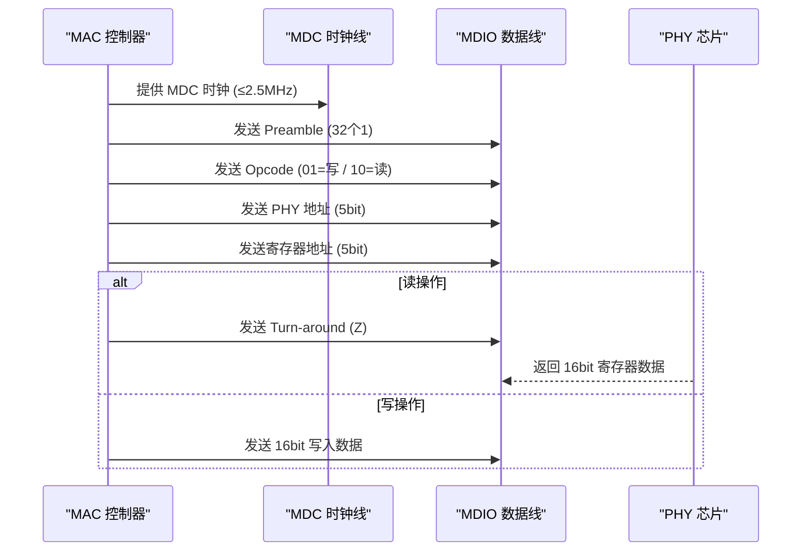

<span class="badge-e">[E]</span>

# MDIO 实战与以太网生态

<span class="red">设备树中的 phy 节点连接 MAC 和 PHY，RGMII/SGMII/RMII 接口选择决定引脚数量和布线复杂度，而 PHY Strapping 引脚和状态轮询机制是链路稳定运行的保障。</span>

---

### 为什么需要 MDIO

以太网 PHY 芯片包含大量可配置寄存器——自协商使能、速率选择、环回测试、LED 控制等。<br>
<span class="red">如果没有统一的管理接口</span>，每个厂商都需要私有的 GPIO 序列来配置 PHY，驱动开发沦为重复的体力活。<br>
MDIO（Management Data Input/Output）作为 IEEE 802.3 标准的一部分，用 **两根线（MDC 时钟 + MDIO 数据）** 统一了所有 PHY 的寄存器访问方式，<br>
使 MAC 层驱动可以通用地探测、配置和监控任何兼容 PHY。


## 设备树 phy 节点

<span class="red">设备树通过 phy-handle 属性将 MAC 节点与 PHY 节点关联，mdio 子节点描述总线上的 PHY 地址和配置。</span>

### 典型节点示例

```dts
&gmac0 {
    phy-handle = <&phy0>;
    phy-mode = "rgmii-id";    // rgmii + internal delay
    snps,axi-config = <&gmac0_axi_config>;
    status = "okay";
};

mdio {
    compatible = "snps,dwmac-mdio";
    #address-cells = <1>;
    #size-cells = <0>;

    phy0: ethernet-phy@0 {
        reg = <0>;            // PHY 地址 = 0
        device_type = "ethernet-phy";
        max-speed = <1000>;   // 最大 1000M
    };
};
```

### fixed-link 模式

MAC 与 PHY 之间无需 MDIO 管理（如 SFP 光模块直连），使用 fixed-link 描述静态链路参数：

```dts
&gmac0 {
    fixed-link {
        speed = <1000>;
        full-duplex;
        pause;
    };
};
```

<span class="blue">易错点：fixed-link 模式下内核不会 probe PHY 驱动，也不会执行自动协商，所有链路参数完全依赖设备树声明。若实际链路不支持声明的参数，网络将无法通信。</span>



---

## RGMII/SGMII/RMII 接口对比

<span class="red">MII 接口衍生出多种变体，核心区别在于数据位宽、时钟方式和引脚数量。</span>

| 接口 | 数据位宽 | 引脚数 | 速率 | TX/RX 时钟 | 延迟 |
|------|----------|--------|------|------------|------|
| MII | 4 bit | 16 | 100M | 独立 | 无 |
| RMII | 2 bit | 8 | 100M | 共享 50MHz | 无 |
| RGMII | 4 bit DDR | 12 | 1G | 共享 125MHz | 需 1.5-2ns |
| SGMII | 1 lane SerDes | 2 | 1G | 内嵌时钟 | 无 |
| XFI | 1 lane SerDes | 2 | 10G | 内嵌时钟 | 无 |

### RGMII 延迟要求

RGMII 在时钟边沿同时翻转数据和时钟，为避免亚稳态，要求时钟相对数据延迟 1.5-2ns。延迟可由 MAC 端（TX）、PHY 端（RX）或两者同时提供。设备树 `phy-mode` 值决定延迟源：

| 值 | TX 延迟 | RX 延迟 |
|----|---------|---------|
| rgmii | 无 | 无 |
| rgmii-id | MAC 内部 | PHY 内部 |
| rgmii-txid | MAC 内部 | 无 |
| rgmii-rxid | 无 | PHY 内部 |

<span class="blue">易错点：rgmii-id 模式下若 MAC 和 PHY 同时添加内部延迟，总延迟超过 2ns 会导致采样失败，症状为 ping 不通但 link up。</span>

### MII 系列接口的演进

MII（Media Independent Interface）最初为 100M 以太网设计，需要 16 根线。随着速率提升，引脚数量成为瓶颈。RGMII 将时钟频率翻倍（DDR）并将引脚缩减到 12 根，SGMII 进一步用 SerDes 差分对替代并行总线，仅需 2 根线即可实现千兆。

---

## 千兆以太网 PHY 实战

<span class="red">RTL8211E 和 KSZ9031 是嵌入式领域最常见的千兆 PHY，理解其配置差异是调试网口的基础。</span>

### RTL8211E

| 参数 | 值 |
|------|----|
| 接口 | RGMII/GMII/MII/RMII |
| 自动 MDI-X | 支持 |
| LED 模式 | 可配置 |
| 节能模式 | 支持 |
| Strapping 引脚 | RXD3/RXD4/LED0 |

RTL8211E 的 RXD3 引脚在上电采样期作为 PHY 地址选择，RXD4 作为自动协商使能选择。Strapping 完成后，引脚恢复正常数据功能。

### KSZ9031

| 参数 | 值 |
|------|----|
| 接口 | RGMII |
| RGMII 延迟 | 可编程 0-1.38ns |
| 驱动强度 | 可配置 |
| Strapping 引脚 | LED0/LED1/LED2 |

KSZ9031 支持通过寄存器动态调整 RGMII 延迟，无需依赖 Strapping 引脚。内核驱动通常通过 phydev->interface 匹配设备树 phy-mode，自动配置 PHY 延迟。

### PHY 驱动匹配

Linux 内核启动时扫描 mdio 总线，读取每个地址的寄存器 2/3 获取 PHY ID，与已注册驱动的 phy_id_mask 匹配。匹配成功后调用驱动的 probe 函数完成初始化。

---

## PHY Strapping 引脚

<span class="red">PHY 上电瞬间通过采样特定引脚电平确定 PHY 地址、接口模式和自动协商配置，这些引脚称为 Strapping 引脚。</span>

### 典型 Strapping 配置

| 引脚 | 功能 | 上拉 | 下拉 |
|------|------|------|------|
| RXD3 | PHY 地址 bit 0 | 地址 +=1 | 地址 +=0 |
| RXD4 | Auto-Neg 使能 | 启用 | 禁用 |
| LED0 | 接口模式 | RGMII | MII |
| LED1 | 速率选择 | 1000M | 100M |

### 调试技巧

若设备树配置的 PHY 地址与 Strapping 结果不符，mdiobus 会 probe 失败。读取 Strapping 后的实际地址：

```bash
# 扫描所有 PHY 地址，读取寄存器 2（PHY ID 1）
for addr in $(seq 0 31); do
    val=$(mdio bus0 $addr 2 2>/dev/null)
    if [ "$val" != "0xffff" ] && [ -n "$val" ]; then
        echo "PHY found at address $addr: ID1=0x$val"
    fi
done
```

<span class="blue">易错点：Strapping 引脚通常与数据引脚复用，上拉/下拉电阻必须足够强（1kΩ 级别），否则数据信号可能干扰 Strapping 采样结果。</span>

---

## 中断 vs 轮询

<span class="red">PHY 链路状态变化可通过中断通知内核，也可由内核定时轮询。中断方式实时性好，轮询方式兼容性强。</span>

### PHY 中断机制

PHY 的 INT 引脚连接到 SoC GPIO，链路状态变化（link up/down、速率变化）触发中断。内核 PHY 子系统在中断处理函数中读取寄存器状态并通知网络栈。

```dts
phy0: ethernet-phy@0 {
    reg = <0>;
    interrupt-parent = <&gpio0>;
    interrupts = <10 IRQ_TYPE_LEVEL_LOW>;  // GPIO0_10 低电平触发
};
```

### 轮询机制

无中断引脚或中断不可靠时，PHY 子系统创建状态机定时器，默认 1 秒轮询一次链路状态。可通过 sysfs 调整轮询间隔：

```bash
echo 100 > /sys/class/net/eth0/mdio_bus/phy0/polling_interval  # 100ms
```

| 方式 | 延迟 | CPU 占用 | 适用场景 |
|------|------|----------|----------|
| 中断 | <1ms | 极低 | PHY 有 INT 引脚 |
| 轮询 1s | 0-1s | 低 | 通用默认 |
| 轮询 100ms | 0-100ms | 中 | 对链路变化敏感 |

<span class="blue">结论：优先使用 PHY 中断，轮询仅作为 fallback。频繁轮询在高负载下会增加 CPU 开销。</span>

### 中断触发源

PHY 中断可配置触发事件，常见选项包括：
- 链路状态变化（Link Status Change）
- 自动协商完成（Auto-Neg Complete）
- 远端故障（Remote Fault）
- 能量检测（Energy Detect）

通过写入 PHY 中断使能寄存器（通常为寄存器 18/19 或厂商自定义）配置触发源。

---

## 小节

- 设备树 phy-handle 连接 MAC 和 PHY，fixed-link 用于无 MDIO 场景。
- RGMII 需要 1.5-2ns 时钟延迟，phy-mode 决定延迟由 MAC 还是 PHY 提供。
- RTL8211E 和 KSZ9031 是嵌入式千兆 PHY 的主流选择。
- Strapping 引脚在上电时决定 PHY 地址和模式，必须匹配设备树配置。
- PHY 中断优于轮询，但轮询是可靠的 fallback 方案。
- 双工不匹配和 RGMII 延迟配置错误是现场最常见的以太网调试问题。

---

## 本章小结

| 要点 | 内容 |
|------|------|
| 接口定义 | MDC（时钟，≤2.5MHz）+ MDIO（双向数据），配合 MII/RMII/RGMII |
| 帧格式 | Preamble + Start + Opcode + PHY Addr + Reg Addr + Turn-around + Data |
| 寄存器空间 | Clause 22（5-bit 地址，32 个寄存器）/ Clause 45（16-bit 地址扩展） |
| Linux 生态 | mdio_bus 子系统、phy_device 结构体、Device Tree phy-handle 绑定 |

## 练习

1. MDIO 接口使用哪两根信号线？MDC 和 MDIO 的方向分别是什么？MDIO 的数据帧格式中，Opcode 字段的 01 和 10 分别代表什么操作？
2. 为什么 MII 接口有 16 根数据线而 RMII 只有 10 根？RGMII 又是如何通过双边沿采样将数据线进一步减少到 12 根的？请对比三者的应用场景。
3. 在 Linux 内核中，`mdio_bus` 子系统如何将 PHY 设备注册为 `struct phy_device`？`phydev->drv` 指针在什么时机被填充？Device Tree 中的 `phy-handle` 属性起什么作用？
