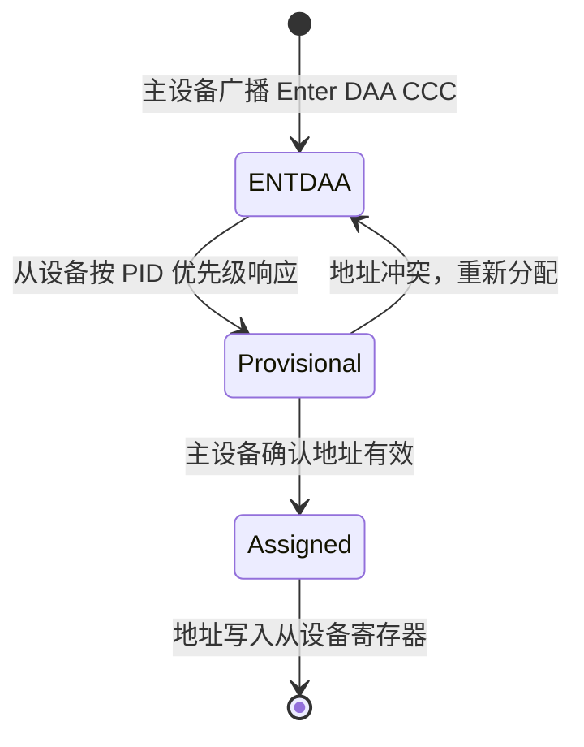

# MIPI-I3C 基础认知

[I]

---

### 为什么需要 I3C

I2C 诞生于 1982 年，面对现代传感器集群已显疲态。
 
智能手机里摄像头、指纹、气压计、加速度计……十几个传感器共享总线，
 
I2C 的 400kHz 严重拖慢启动速度和数据吞吐。
 

I2C 的 5 大局限：
 

| 局限 | I2C 现状 | 影响 |
|------|----------|------|
| 速度低 | 最高 3.4MHz，常用 400kHz | 传感器初始化慢、数据帧大时卡顿 |
| 无中断 | 只能靠主设备轮询 | 功耗高、响应延迟大 |
| 无热插拔 | 地址固定，启动时扫描 | 动态更换传感器需要重启 |
| 无动态地址 | 7 位硬编码地址冲突风险 | 多厂商器件地址撞车 |
| 功耗高 | 开漏上拉电阻持续耗电 | 可穿戴/IoT 电池寿命短 |

I3C（Improved Inter-Integrated Circuit）由 MIPI 联盟于 2016 年发布，
 
目标：向后兼容 I2C，同时解决上述痛点。
 

类比：I2C 是老式单车道县道，I3C 是双向四车道省道——
 
保留了原有路标让老车（I2C 设备）也能走，
 
但新车（I3C 设备）可以走专用快车道、用 ETC（中断）免停车缴费。
 

---

### 两线向后兼容

I3C 物理层沿用 SDA + SCL 双线架构，
 
I2C 设备可直接挂到 I3C 总线上正常工作。
 

兼容性细节：
 

| 特性 | I2C 设备在 I3C 总线 | I3C 原生设备 |
|------|---------------------|--------------|
| SDA/SCL | 支持 | 支持 |
| 开漏输出 | 必须（I2C 设备） | SDR 模式用开漏，HDR 模式用推挽 |
| 上拉电阻 | 需要（I2C 设备段） | I3C 内置电流源上拉 |
| 速度 | ≤400kHz（受 I2C 设备限制） | 12.5MHz SDR / 25MHz+ HDR |
| 动态地址 | 不支持 | 支持 |
| 中断 | 不支持（除非用 GPIO） | 内置 In-Band Interrupt |

关键认知：混合总线上 I3C 主设备会自动识别 I2C 设备，
 
与其通信时降速到 I2C 模式，用静态地址访问。

 

---

### 动态地址分配

动态地址分配（DAA，Dynamic Address Assignment）是 I3C 最核心的创新。
 
设备不需要硬件地址引脚，启动时由主设备统一分配地址。
 

DAA 流程步骤：
 
1. 主设备广播 `ENTDAA`（Enter Dynamic Address Assignment）CCC 命令
 
2. 所有未分配地址的从设备进入 DAA 状态
 
3. 从设备按 48 位 Provisional ID（PID）优先级依次发送 PID
 
4. 主设备分配动态地址（7 位），从设备确认
 
5. 若有从设备未分配，重复步骤 3~4
 

PID 组成：
 
| 位域 | 宽度 | 含义 |
|------|------|------|
| Vendor ID | 15 位 | MIPI 分配的厂商 ID |
| Part ID | 21 位 | 器件型号 |
| Instance ID | 4 位 | 同型号多实例区分 |
| Reserved | 8 位 | 保留 |

关键认知：PID 类似 MAC 地址，全球唯一，
 
彻底避免了 I2C 时代多厂商地址撞车的问题。

 

---

### CCC 命令集

CCC（Common Command Codes，公共命令码）是 I3C 主设备控制从设备的统一指令集。
 
所有 I3C 设备必须支持部分 CCC，其余可选。
 

| CCC 命令 | 编码 | 广播/定向 | 作用 |
|----------|------|-----------|------|
| ENEC | 0x00 | 广播 | 启用事件（中断上报） |
| DISEC | 0x01 | 广播 | 禁用事件 |
| ENTDAA | 0x07 | 广播 | 进入动态地址分配 |
| RSTDAA | 0x06 | 广播 | 重置动态地址，回到初始状态 |
| SETDASA | 0x87 | 定向 | 将静态 I2C 地址设为动态地址 |
| SETNEWDA | 0x88 | 定向 | 给从设备分配新动态地址 |
| GETPID | 0x8C | 定向 | 读取从设备的 48 位 PID |
| GETBCR | 0x8E | 定向 | 读取总线特性寄存器 |
| GETDCR | 0x8F | 定向 | 读取设备特性寄存器 |

BCR（Bus Characteristics Register）描述从设备的总线能力，
 
如是否支持 HDR、是否支持离线、是否有中断能力等。
 
DCR（Device Characteristics Register）描述设备类型，
 
如传感器、EEPROM、桥接器等。
 

关键认知：CCC 命令本身在 SDR 模式下传输，
 
是所有 I3C 设备必须支持的"最小公约数"。

 

---

### 与 I2C/SPI 的选型对比

| 维度 | I2C | I3C | SPI |
|------|-----|-----|-----|
| 信号线 | 2 | 2（兼容 I2C） | 4+ |
| 最大速率 | 3.4MHz | ~33MHz HDR | ~100MHz |
| 动态地址 | 无 | 有（DAA） | 无（片选线） |
| 中断 | 无（需 GPIO） | In-Band Interrupt | 无（需 GPIO） |
| 热插拔 | 不支持 | 支持 | 不支持 |
| 功耗 | 中（上拉耗电） | 低（推挽+时钟停振） | 中 |
| 向后兼容 | - | 兼容 I2C | 不兼容 |
| 典型场景 | 通用传感器 | 手机传感器集群 | Flash、显示屏 |

选型决策：
 
- 全新设计、传感器数量多、需要中断 → I3C
 
- 已有大量 I2C 设备、成本敏感 → 继续 I2C
 
- 带宽优先、大数据量 → SPI 或 I3C HDR
 

扩展：MIPI 联盟正在推进 I3C 标准化，
 
目前已有 STM32MP1、i.MX 8、Snapdragon 等 SoC 支持 I3C 主控制器。

 

---

**学习路径提示**：
 
- [I] 读者：理解 I3C = "I2C 的超集 + 动态地址 + 中断 + 高速模式"，
 
  DAA 和 CCC 是其区别于 I2C 的核心机制。
 
- 向后兼容是 I3C 的最大优势，允许逐步升级而非推倒重来。

---

## 历史演进与发展趋势

MIPI I3C 由 MIPI Alliance 于 2016 年正式发布，是对 I2C 的全面现代化重构。I2C 在 30 多年发展中积累了诸多局限：静态地址冲突、速度天花板、功耗无法优化。MIPI I3C 保留了 SDA/SCL 双线的物理兼容性，但引入动态地址分配（DAA）、带内中断（IBI）和高达 12.5MHz 的 SDR 模式。2017 年，HDR（High Data Rate）模式加入，通过推挽驱动实现 33.3Mbps 的双倍数据速率。2019 年 I3C Basic 子集发布，降低授权门槛以加速生态普及。2021 年后，高通、联发科等手机 SoC 广泛集成 I3C 控制器，传感器集线器（Sensor Hub）成为 I3C 的主战场。未来 I3C 有望统一移动设备中所有低速传感器接口，彻底取代 I2C + GPIO 中断的碎片化方案。

---

## 本章小结

| 要点 | 内容 |
|------|------|
| 核心改进 | 动态地址分配 DAA、带内中断 IBI、高达 12.5MHz SDR 速率 |
| HDR 模式 | 推挽驱动实现双倍数据速率，SDR→DDR→TSP/TSL 渐进加速 |
| 向后兼容 | 同一总线混合挂载 I3C 设备和 I2C 传统设备 |
| 应用场景 | 移动设备传感器集线器、摄像头模组、统一低速外设接口 |

## 练习

1. MIPI I3C 相比传统 I2C 有哪些核心改进？动态地址分配（DAA）如何解决 I2C 静态地址冲突的问题？
2. I3C 的 HDR（High Data Rate）模式如何实现 33.3Mbps 的传输速率？推挽驱动在 HDR 模式下扮演什么角色？
3. 在嵌入式 Linux 中，如何配置 I3C 控制器的 Device Tree 节点？I3C 总线上的 I2C 从设备是否需要独立的驱动绑定？
