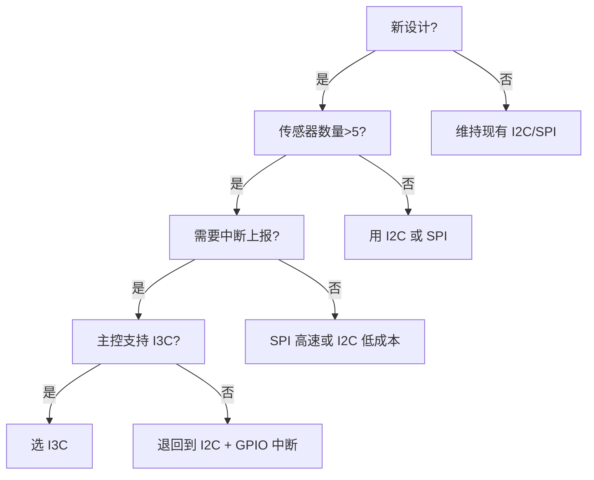
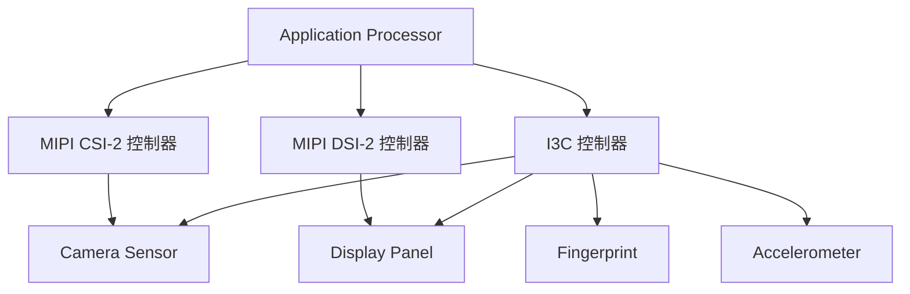
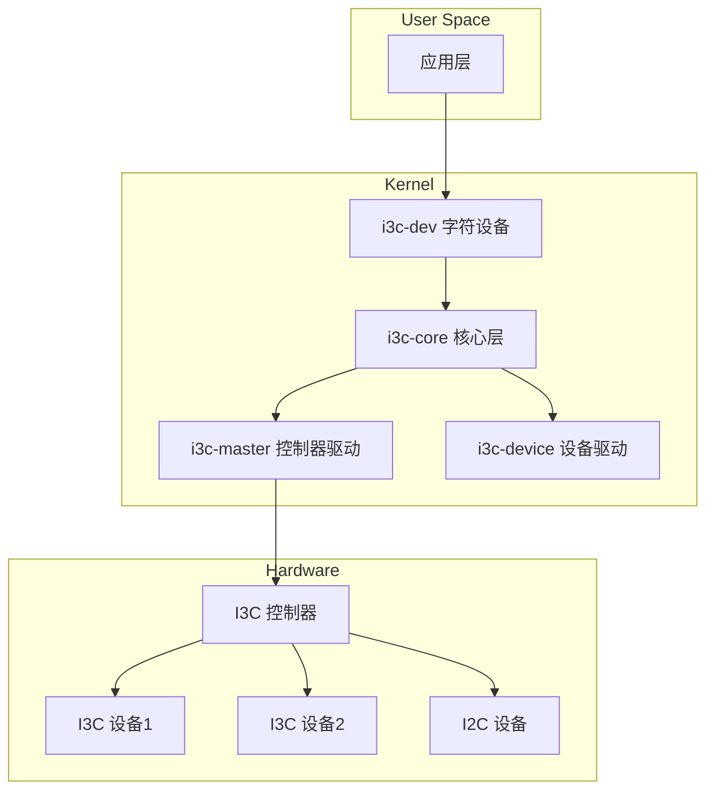

# I3C 嵌入式实战与对比

<span class="badge-e">[E]</span>

---

### I3C vs I2C/SPI 选型决策矩阵

<span class="red">选型不能只看速率，要综合考虑生态、成本、功耗和生态成熟度</span>。
<br>

| 决策因子 | I3C 优势场景 | I2C 优势场景 | SPI 优势场景 |
|----------|--------------|--------------|--------------|
| 传感器数量 | >8 个，需动态管理 | <5 个，地址固定 | 少量高速设备 |
| 中断需求 | 需要 In-Band Interrupt | 轮询即可 | 独立 GPIO 中断 |
| 数据带宽 | 10~33 Mbps 足够 | <1 Mbps | >50 Mbps |
| 功耗预算 | 极低功耗、电池供电 | 中等 | 中等 |
| 向后兼容 | 需兼容现有 I2C 设备 | 纯 I2C 生态 | 无兼容需求 |
| 主控支持 | 有 I3C 控制器（STM32MP1、i.MX 8） | 所有 MCU 都有 | 所有 MCU 都有 |
| 芯片成本 | 传感器略贵 | 最便宜 | Flash 很便宜 |

决策树：
<br>


<span class="blue">关键认知：2025 年 I3C 传感器价格仍比 I2C 贵 20~50%，
<br>
只有传感器数量多且对中断和功耗敏感时，I3C 的综合成本才更优。
</span><br>

---

### 温度传感器实战

对比同厂商的 I2C 与 I3C 温度传感器方案：
<br>

| 特性 | I2C TMP117 | I3C TMP139 |
|------|------------|------------|
| 精度 | ±0.1°C | ±0.1°C |
| 转换时间 | 15.5ms | 15.5ms |
| 读取协议 | I2C 地址 + 寄存器 | DAA 动态地址 + CCC |
| 中断方式 | ALERT GPIO 引脚 | In-Band Interrupt |
| 功耗 | 3.5µA | 2.1µA |
| 引脚数 | 4 (VDD/GND/SDA/SCL + ALERT) | 4 (VDD/GND/SDA/SCL，中断内置) |

I3C 版本省掉了 ALERT GPIO 引脚，中断走 SDA 线内嵌传输。
<br>
这意味着：PCB 布线少一根线，软件不用维护单独的 GPIO 中断处理。
<br>

代码对比（伪代码）：<br>

```c
// I2C TMP117：需要单独 GPIO 中断
void tmp117_alert_handler(void) {
    uint8_t temp[2];
    i2c_read(TMP117_ADDR, 0x00, temp, 2);  // 轮询寄存器
    process_temperature(temp);
}

// I3C TMP139：IBI 自动触发
void i3c_ibi_handler(uint8_t dev_addr) {
    if (dev_addr == tmp139_da) {
        uint8_t temp[2];
        i3c_read(dev_addr, 0x00, temp, 2);  // 直接读取
        process_temperature(temp);
    }
}
```

<span class="blue">易错点：IBI 不是"免费"的——从设备拉低 SDA 后，
<br>
主设备需要回读 BCR 确认中断源，然后发送定向读取命令。
<br>
总线开销比纯 GPIO 中断大，但省了引脚。
</span><br>

---

### 与 MIPI CSI/DSI 的协同

MIPI 联盟定义了完整的手机接口栈：<br>

| 接口 | 用途 | 物理层 | I3C 角色 |
|------|------|--------|----------|
| CSI-2 | 摄像头数据 | D-PHY/C-PHY | I3C 控制传感器寄存器 |
| DSI-2 | 显示屏数据 | D-PHY/C-PHY | I3C 控制显示屏配置 |
| I3C | 传感器控制 | SDA/SCL | 统一控制总线 |

手机摄像头模组的典型连接：<br>
- CSI-2：传输图像数据流（Gbps 级）
<br>
- I3C：配置摄像头传感器寄存器、读取中断状态
<br>
- 传统方案用 I2C 控制，但速率限制初始化时间
<br>

统一总线的好处：<br>
- 同一套 I3C 总线可以挂接摄像头传感器、显示屏、指纹识别
<br>
- 各设备按需申请中断，主控统一调度
<br>
- 动态地址分配让模组厂商无需担心地址冲突
<br>



<span class="purple">扩展：MIPI 正在推进 A-PHY，用同一对差分线同时传输 CSI/DSI 数据和 I3C 控制信号，
<br>
进一步减少线束。</span><br>

---

### Linux I3C 子系统

Linux 内核 4.19+ 引入 I3C 子系统，架构如下：<br>



关键组件：<br>
- **i3c-master**：SoC 控制器驱动，处理底层时序
<br>
- **i3c-dev**：用户空间接口，类似 i2c-dev
<br>
- **i3c-core**：DAA 管理、CCC 命令分发、设备生命周期
<br>

用户空间访问：<br>

```bash
# I3C 设备树节点示例
&i3c1 {
    status = "okay";
    i2c-scl-frequency = <400000>;  // I2C 兼容速度

    sensor@8 {
        compatible = "vendor,sensor";
        reg = <0x08>;  // 动态分配后的地址
        assigned-address = <0x08>;
    };
};
```

<span class="blue">关键认知：Linux I3C 子系统在总线注册时自动执行 DAA，
<br>
设备树中只需声明 I2C 兼容设备，I3C 设备由内核动态发现。</span><br>

---

### I3C 生态现状与芯片支持表

| SoC/平台 | I3C 支持 | 最高模式 | 备注 |
|----------|----------|----------|------|
| STM32MP1 | 是 | SDR + DDR | STM32Cube HAL 封装完善 |
| NXP i.MX 8M Plus | 是 | SDR + DDR | Linux 主线支持 |
| NXP i.MX 93 | 是 | SDR + DDR + TSP | 新一代全面支持 |
| Qualcomm Snapdragon 8 Gen 2+ | 是 | 全模式 | 手机平台主推 |
| MediaTek Dimensity 9000+ | 是 | 全模式 | 手机传感器集群 |
| Raspberry Pi 5 | 否 | - | 无 I3C 控制器 |
| ESP32 系列 | 否 | - | 尚无 I3C 支持计划 |

传感器芯片：<br>
| 厂商 | 型号 | 类型 | I3C 特性 |
|------|------|------|----------|
| Bosch | BMI323 | IMU | SDR, IBI |
| STMicro | LSM6DSV16X | IMU | SDR, DDR, IBI |
| Texas | TMP139 | 温度 | SDR, IBI |
| ON Semi | AR0822 | 摄像头 | SDR, 通过 I3C 配置 |

<span class="purple">扩展：MIPI 联盟每年更新 I3C 规范，v1.1 增加了 HDR-BT 和更高功率模式，<br>
v1.1.1 针对汽车电子扩展了功能安全特性。</span><br>

---

**学习路径提示**：<br>
- <span class="badge-e">[E]</span> 读者：选型 I3C 前先确认主控 SoC 是否支持，<br>
  传感器芯片的 I3C 支持情况比 I2C 少得多。<br>
- 手机/可穿戴是当前 I3C 的主战场，工业控制仍以 I2C/SPI 为主。

---

## 历史演进与发展趋势

MIPI I3C 由 MIPI Alliance 于 2016 年正式发布，是对 I2C 的全面现代化重构。I2C 在 30 多年发展中积累了诸多局限：静态地址冲突、速度天花板、功耗无法优化。MIPI I3C 保留了 SDA/SCL 双线的物理兼容性，但引入动态地址分配（DAA）、带内中断（IBI）和高达 12.5MHz 的 SDR 模式。2017 年，HDR（High Data Rate）模式加入，通过推挽驱动实现 33.3Mbps 的双倍数据速率。2019 年 I3C Basic 子集发布，降低授权门槛以加速生态普及。2021 年后，高通、联发科等手机 SoC 广泛集成 I3C 控制器，传感器集线器（Sensor Hub）成为 I3C 的主战场。未来 I3C 有望统一移动设备中所有低速传感器接口，彻底取代 I2C + GPIO 中断的碎片化方案。

---

## 本章小结

| 要点 | 内容 |
|------|------|
| 核心改进 | 动态地址分配 DAA、带内中断 IBI、高达 12.5MHz SDR 速率 |
| HDR 模式 | 推挽驱动实现双倍数据速率，SDR→DDR→TSP/TSL 渐进加速 |
| 向后兼容 | 同一总线混合挂载 I3C 设备和 I2C 传统设备 |
| 应用场景 | 移动设备传感器集线器、摄像头模组、统一低速外设接口 |

## 练习

1. MIPI I3C 相比传统 I2C 有哪些核心改进？动态地址分配（DAA）如何解决 I2C 静态地址冲突的问题？
2. I3C 的 HDR（High Data Rate）模式如何实现 33.3Mbps 的传输速率？推挽驱动在 HDR 模式下扮演什么角色？
3. 在嵌入式 Linux 中，如何配置 I3C 控制器的 Device Tree 节点？I3C 总线上的 I2C 从设备是否需要独立的驱动绑定？
