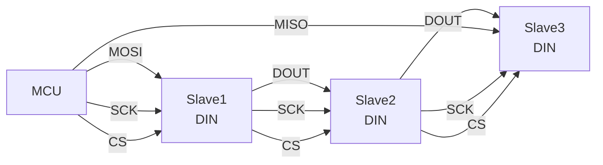
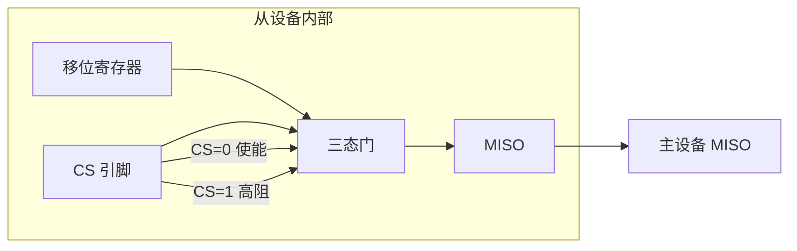
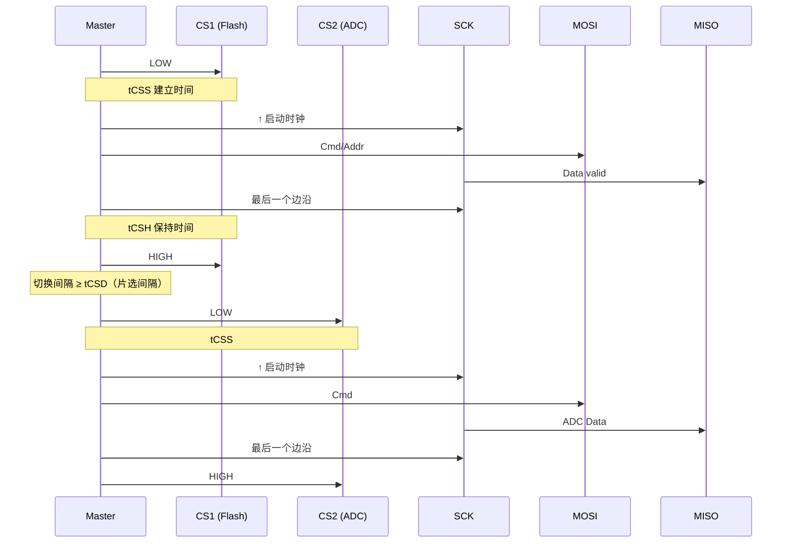

# SPI 片选与多从设备

<span class="badge-i">[I]</span> <span class="badge-e">[E]</span>

---

### 独立 CS 控制

<span class="red">片选（Chip Select，CS/SS）是 SPI 选择目标从设备的唯一手段</span>。
<br>
每增加一个从设备，就需要增加一条独立的 CS 线。
<br>

GPIO CS vs 硬件 CS：
<br>

| 方式 | 实现 | 优点 | 缺点 |
|------|------|------|------|
| GPIO CS | 软件控制 GPIO 高低 | 灵活、可任意扩展 | 有软件延迟、CS 边沿不精确 |
| 硬件 NSS | SPI 控制器自动驱动 | 时序精确、无软件开销 | 通常只有 1~2 路，扩展难 |

GPIO CS 的典型时序控制：<br>

```c
// 软件 CS：GPIO 控制
#define CS_FLASH_LOW()   HAL_GPIO_WritePin(GPIOA, GPIO_PIN_4, GPIO_PIN_RESET)
#define CS_FLASH_HIGH()  HAL_GPIO_WritePin(GPIOA, GPIO_PIN_4, GPIO_PIN_SET)
#define CS_ADC_LOW()     HAL_GPIO_WritePin(GPIOB, GPIO_PIN_0, GPIO_PIN_RESET)
#define CS_ADC_HIGH()    HAL_GPIO_WritePin(GPIOB, GPIO_PIN_0, GPIO_PIN_SET)

void spi_transfer_flash(uint8_t *tx, uint8_t *rx, uint16_t len) {
    CS_FLASH_LOW();
    HAL_SPI_TransmitReceive(&hspi1, tx, rx, len, 100);
    CS_FLASH_HIGH();
}
```

<span class="blue">关键认知：CS 变低到第一个 SCK 边沿需要满足 tCSS（建立时间），
<br>
CS 变高前需要满足 tCSH（保持时间）。
<br>
GPIO 翻转太快可能导致违反建立时间——如果主控 SPI 速率极高，
<br>
需要在 CS 拉低后加一小段延时再启动 SCK。
</span><br>

CS 扩展方案：<br>
- 74HC138 译码器：3 根 GPIO → 8 路 CS
<br>
- GPIO 扩展器：MCP23S17（SPI 转 16 路 GPIO）
<br>
- 菊花链：共享一条 CS 线（见下节）
<br>

---

### 菊花链拓扑

<span class="red">菊花链（Daisy Chain）</span>让多个从设备共用一条 CS 线，
<br>
通过级联移位寄存器的方式传输数据。
<br>



工作原理：<br>
- 数据从 MOSI 进入 Slave1 的 DIN
<br>
- Slave1 的 DOUT 接 Slave2 的 DIN，形成移位链
<br>
- 所有设备共用 SCK 和 CS
<br>
- 发送 N 字节 = 依次穿过 N 个设备
<br>

典型应用：<br>
- LED 驱动器级联（74HC595 移位寄存器）
<br>
- ADC 多通道级联（ADS131M04）
<br>
- 多路 DAC 输出
<br>

延迟代价：<br>
- N 个设备级联时，命令需要 N 个时钟周期才能到达最后一个设备
<br>
- 读取最后一个设备的数据也需要 N 个周期移回主设备
<br>
- 适合配置类操作，不适合高频实时数据
<br>

<span class="blue">关键认知：菊花链 = "一条 CS 管所有，数据排队进"，
<br>
省引脚但增加延迟，适合对时序不敏感的控制场景。
</span><br>

---

### MISO 三态门

<span class="red">多从设备共用 MISO 线时，未被选中的从设备必须释放总线</span>。
<br>
SPI 从设备通常在内部用三态门控制 MISO 输出。
<br>

```
CS = 0（选中）：MISO = 内部移位寄存器输出
CS = 1（未选中）：MISO = 高阻态（Hi-Z，相当于断开）
```



如果没有三态门（如某些低成本移位寄存器），
<br>
未选中设备的 MISO 会保持最后一状态，与选中设备冲突。
<br>
解决方案：<br>
- 选带三态输出的器件
<br>
- MISO 线上加隔离电阻（几十欧姆）
<br>
- 每个从设备 MISO 经独立逻辑门汇总到主设备
<br>

<span class="blue">易错点：两个从设备同时被 CS 选中时，
</br>
MISO 线电平冲突，数据完全错乱。
</br>
软件必须保证同一时刻只有一个 CS 有效。</span><br>

---

### 多从设备切换时序

完整的多从设备读写时序：<br>



时序参数约束：<br>
| 参数 | 典型值 | 含义 |
|------|--------|------|
| tCSS | 5~20ns | CS 变低到 SCK 第一个边沿 |
| tCSH | 5~20ns | SCK 最后一个边沿到 CS 变高 |
| tCSD | 50~100ns | 两个 CS 切换的间隔 |
| tRDL | 0 | CS 变高到同一设备下次 CS 变低的间隔 |

<span class="blue">关键认知：CS 高电平期间从设备必须将 MISO 置高阻，
<br>
主设备可以安全驱动下一个从设备。</span><br>

---

### 代码：多从设备轮询

```c
#include "stm32f4xx_hal.h"

#define NUM_SLAVES  3

GPIO_TypeDef *CS_PORTS[NUM_SLAVES] = {GPIOA, GPIOB, GPIOC};
uint16_t CS_PINS[NUM_SLAVES] = {GPIO_PIN_4, GPIO_PIN_0, GPIO_PIN_13};

void cs_select(uint8_t slave_id) {
    for (uint8_t i = 0; i < NUM_SLAVES; i++) {
        HAL_GPIO_WritePin(CS_PORTS[i], CS_PINS[i], GPIO_PIN_SET);
    }
    if (slave_id < NUM_SLAVES) {
        HAL_GPIO_WritePin(CS_PORTS[slave_id], CS_PINS[slave_id], GPIO_PIN_RESET);
        delay_us(1);  // tCSS，视速率调整
    }
}

void cs_release(uint8_t slave_id) {
    delay_us(1);  // tCSH
    HAL_GPIO_WritePin(CS_PORTS[slave_id], CS_PINS[slave_id], GPIO_PIN_SET);
    delay_us(5);  // tCSD，设备切换间隔
}

// 轮询读取 3 个 ADC 通道
void poll_all_adc(uint16_t *results) {
    for (uint8_t i = 0; i < NUM_SLAVES; i++) {
        uint8_t tx[2] = {0x01, 0x80};  // 启动转换命令
        uint8_t rx[2] = {0};
        
        cs_select(i);
        HAL_SPI_TransmitReceive(&hspi1, tx, rx, 2, 100);
        cs_release(i);
        
        results[i] = ((rx[0] & 0x03) << 8) | rx[1];
    }
}
```

<span class="blue">关键认知：多从设备切换的核心开销是 tCSD（片选间隔），
<br>
频繁切换时总线有效带宽会大幅下降。
<br>
大数据量传输建议连续完成一个设备再切下一个。</span><br>

---

**学习路径提示**：<br>
- <span class="badge-i">[I]</span> 读者：理解 GPIO CS 的灵活性和时序开销。
<br>
- <span class="badge-e">[E]</span> 读者：多从设备设计时务必检查每个器件的 MISO 是否为三态输出，
<br>
  否则会出现总线冲突。

### 为什么需要 SPI

<span class="red">I2C 节省引脚但牺牲了带宽</span>。<br>
当外设需要高速流式传输时——Flash 烧录、显示屏刷新、ADC 采样——400kHz 的 I2C 成为瓶颈。<br>
SPI（Serial Peripheral Interface，串行外设接口）用 **四根线** 换取 **全双工高速传输**。<br>
时钟由主设备单方面驱动，无需等待从设备 ACK，协议开销接近零。

---

## 历史演进与发展趋势

SPI 由 Motorola 于 1980 年代早期发明，最初用于 68000 系列处理器与外设的通信。与 I2C 不同，SPI 从一开始就是为高速点对点传输设计的，没有标准化组织的束缚，因此各家厂商实现存在差异（时钟相位/极性）。1990 年代，SPI 成为 Flash 存储器（NOR/NAND）的标准接口。2000 年后，显示屏控制器（ILI9341 等）广泛采用 SPI，推动了 Quad SPI（QSPI）的发展——用 4 根数据线并行传输，速率突破 100Mbps。2012 年 JEDEC 发布 xSPI 标准（JESD251），统一了 Octal SPI（8 线）的时序规范。Linux 内核的 `spidev` 驱动和 Device Tree 绑定使 SPI 设备树描述标准化。现代嵌入式系统中，SPI 仍是 Flash、显示屏、ADC 的首选高速接口，QSPI/Octal SPI 正在向 400Mbps+ 演进。

---

## 本章小结

| 要点 | 内容 |
|------|------|
| 四线架构 | SCK + MOSI + MISO + CS，全双工同步通信 |
| 时钟模式 | CPOL（空闲电平）+ CPHA（采样边沿）组合成 4 种模式 |
| 片选机制 | CS 低电平有效，多从设备需三态门避免 MISO 冲突 |
| Linux 子系统 | spidev 用户态接口、spi_sync/spi_async 传输 API |
| 扩展接口 | QSPI（4 线数据）、Octal SPI（8 线数据）、DUAL/QUAD 读模式 |

## 练习

1. SPI 的四种时钟模式（Mode 0/1/2/3）分别由 CPOL 和 CPHA 的什么组合决定？请画出每种模式的时钟波形和数据采样时刻。
2. 在单主多从的 SPI 拓扑中，为什么未被选中的从设备必须将 MISO 置为高阻态（High-Z）？如果两个从设备同时驱动 MISO 会发生什么？
3. QSPI（Quad SPI）相比标准 SPI 增加了哪些信号线？为什么 NOR Flash 普遍采用 QSPI 接口？Octal SPI 又将数据线扩展到了多少根？
