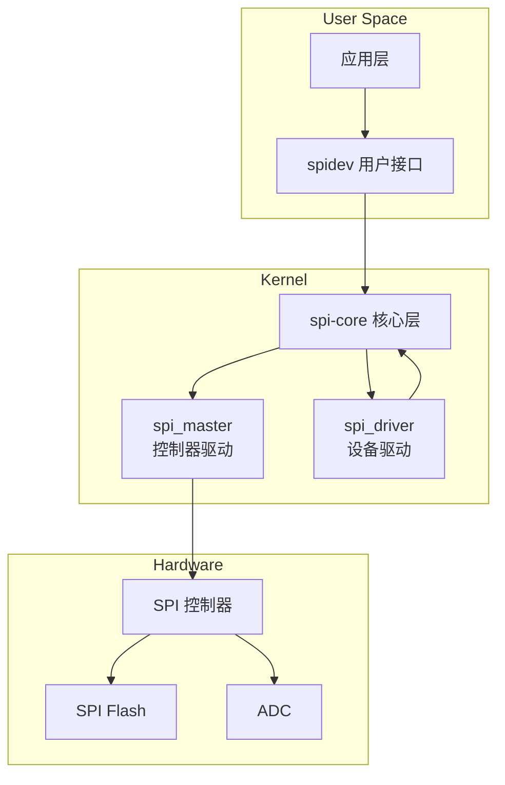

# SPI Linux 子系统与调试

<span class="badge-e">[E]</span>

---

### Linux SPI 子系统架构

<span class="red">Linux SPI 子系统采用分层架构</span>，
用户空间通过统一接口访问不同硬件控制器。
<br>



核心组件：
<br>
- **spi_master**：代表一个 SPI 控制器（总线），负责底层时序
<br>
- **spi_device**：代表总线上的一个从设备，绑定 CS 和配置参数
</br>
- **spi_driver**：设备驱动（如 Flash 驱动、显示屏驱动），实现具体协议
</br>
- **spi-core**：设备匹配、传输调度、总线锁定
</br>

注册流程：
<br>
1. 平台驱动注册 spi_master（控制器初始化）
<br>
2. 设备树解析生成 spi_device（从设备描述）
</br>
3. spi-core 匹配 spi_device 和 spi_driver
</br>
4. 驱动 probe() 中调用 spi_sync() 进行数据传输
</br>

<span class="blue">关键认知：spi_master 是"总线"，spi_device 是"设备"，
<br>
一个 master 可以挂多个 device，靠 CS 区分。</span><br>

---

### 设备树配置

设备树描述 SPI 总线和从设备：
<br>

```dts
// 总线节点
&spi0 {
    status = "okay";
    pinctrl-names = "default";
    pinctrl-0 = <&spi0_pins>;
    
    cs-gpios = <&gpio1 4 GPIO_ACTIVE_LOW>,   // CS0: GPIO1_4
               <&gpio1 5 GPIO_ACTIVE_LOW>;   // CS1: GPIO1_5
    
    flash@0 {
        compatible = "jedec,spi-nor";
        reg = <0>;                    // CS0
        spi-max-frequency = <50000000>; // 50MHz
        spi-cpol = <0>;
        spi-cpha = <0>;
    };
    
    adc@1 {
        compatible = "vendor,my-adc";
        reg = <1>;                    // CS1
        spi-max-frequency = <1000000>; // 1MHz
        spi-cpol = <0>;
        spi-cpha = <1>;
    };
};
```

设备树属性解析：
<br>
| 属性 | 含义 |
|------|------|
| `cs-gpios` | 软件 CS 的 GPIO 列表，按 reg 索引 |
| `reg` | 设备在总线上的索引，对应 cs-gpios 位置 |
| `spi-max-frequency` | 该设备支持的最高速率 |
| `spi-cpol` | 时钟极性，0=低空闲，1=高空闲 |
| `spi-cpha` | 时钟相位，0=首边沿采样，1=次边沿采样 |
| `compatible` | 驱动匹配字符串 |

`spidev` 节点（用户空间直接访问）：
<br>

```dts
spidev@0 {
    compatible = "spidev";
    reg = <0>;
    spi-max-frequency = <1000000>;
    status = "okay";
};
```

<span class="blue">关键认知：设备树中 `spi-max-frequency` 是"上限"，
</br>
实际速率由驱动根据设备和控制器能力协商确定。</span><br>

---

### spidev 设备

<span class="red">spidev 是 Linux 提供的用户空间 SPI 通用接口</span>，
<br>
将 SPI 总线暴露为 `/dev/spidevX.Y` 字符设备。
</br>

| 设备节点 | 含义 |
|----------|------|
| /dev/spidev0.0 | SPI0 总线，CS0 设备 |
| /dev/spidev0.1 | SPI0 总线，CS1 设备 |
| /dev/spidev1.0 | SPI1 总线，CS0 设备 |

ioctl 接口：<br>

```c
#include <fcntl.h>
#include <unistd.h>
#include <linux/spi/spidev.h>
#include <sys/ioctl.h>

int fd = open("/dev/spidev0.0", O_RDWR);

// 配置模式
uint8_t mode = SPI_MODE_0;
ioctl(fd, SPI_IOC_WR_MODE, &mode);

// 配置位宽
uint8_t bits = 8;
ioctl(fd, SPI_IOC_WR_BITS_PER_WORD, &bits);

// 配置速率
uint32_t speed = 1000000;
ioctl(fd, SPI_IOC_WR_MAX_SPEED_HZ, &speed);

// 单条消息传输
struct spi_ioc_transfer tr = {
    .tx_buf = (unsigned long)tx_buf,
    .rx_buf = (unsigned long)rx_buf,
    .len = len,
    .speed_hz = speed,
    .delay_usecs = 0,
    .bits_per_word = bits,
};
ioctl(fd, SPI_IOC_MESSAGE(1), &tr);
```

<span class="green">SPI_IOC_MESSAGE(N)</span>支持一次 ioctl 传输 N 条消息，
</br>
消息之间 CS 可以保持不变（靠 `.cs_change` 控制）。
</br>
这在"发送命令 + 读取数据"的场景中很有用。
</br>

---

### spidev_test 完整命令与输出解读

`spidev_test` 是 Linux 源码 `tools/spi/` 下的测试工具。
</br>

```bash
# 回环测试（MOSI 接 MISO）
$ ./spidev_test -D /dev/spidev0.0 -v
spi mode: 0x0
bits per word: 8
max speed: 500000 Hz (500 KHz)
00 01 02 03 04 05 06 07 08 09 0A 0B 0C 0D 0E 0F
10 11 12 13 14 15 16 17 18 19 1A 1B 1C 1D 1E 1F
```

常用参数：
</br>
| 参数 | 作用 |
|------|------|
| `-D` | 设备路径 |
| `-s` | 速率（Hz） |
| `-m` | 模式（0~3） |
| `-b` | 位宽 |
| `-v` | 打印收发数据 |
| `-n` | 传输字节数 |
| `-H` | CS 高电平有效 |

输出解读：
</br>
- `spi mode: 0x0` → SPI_MODE_0（CPOL=0, CPHA=0）
</br>
- `max speed: 500000 Hz` → 实际协商后的速率
</br>
- 16 进制数据 → 发送的递增序列和回读数据，一致说明通路正常
</br>

调试场景：
</br>
- 数据全 0x00：MISO 未接或从设备未输出
</br>
- 数据全 0xFF：MISO 被上拉或从设备输出高阻
</br>
- 数据错位：CPOL/CPHA 不匹配
</br>

---

### 代码：spi_sync / spi_async 关键链路

内核驱动的 SPI 传输接口：</br>

```c
#include <linux/spi/spi.h>

// 同步传输：阻塞等待完成
int spi_sync(struct spi_device *spi, struct spi_message *message);

// 异步传输：提交后立即返回，完成后回调
int spi_async(struct spi_device *spi, struct spi_message *message);
```

构建 spi_message：</br>

```c
// Flash 读取示例：发送 0x03 + 24位地址，然后读取数据
static int flash_read(struct spi_device *spi, u32 addr, u8 *buf, size_t len)
{
    u8 tx[4] = {0x03, (addr >> 16) & 0xFF, 
                (addr >> 8) & 0xFF, addr & 0xFF};
    
    struct spi_transfer t[2] = {
        {
            .tx_buf = tx,
            .len = 4,
            .cs_change = 0,       // 保持 CS 低
        },
        {
            .rx_buf = buf,
            .len = len,
            .cs_change = 1,       // 完成后释放 CS
        },
    };
    
    struct spi_message m;
    spi_message_init(&m);
    spi_message_add_tail(&t[0], &m);
    spi_message_add_tail(&t[1], &m);
    
    return spi_sync(spi, &m);
}
```

<span class="blue">关键认知：spi_sync() 在原子上下文不可调用（可能睡眠），
</br>
中断上下文中用 spi_async() + 完成回调。</span><br>

异步传输完整链路：</br>

```c
static void flash_read_complete(void *context)
{
    struct completion *done = context;
    complete(done);  // 唤醒等待线程
}

static int flash_read_async(struct spi_device *spi, u32 addr, u8 *buf, size_t len)
{
    struct completion done;
    struct spi_message m;
    // ... 构建 message ...
    
    init_completion(&done);
    m.complete = flash_read_complete;
    m.context = &done;
    
    int ret = spi_async(spi, &m);
    if (ret) return ret;
    
    wait_for_completion(&done);  // 等待完成回调
    return m.status;
}
```

<span class="blue">关键认知：spi_async 的 complete 回调在中断上下文执行，
</br>
不能睡眠，通常只做 completion 唤醒或标志位置位。</span><br>

---

**学习路径提示**：
<br>
- <span class="badge-e">[E]</span> 读者：设备树是 Linux SPI 的入口，
</br>
  `cs-gpios` + `spi-max-frequency` 是调试最常出问题的两个属性。
</br>
- 用户空间用 spidev，内核空间用 spi_sync/spi_async，
</br>
  消息分段（.cs_change=0）是原子操作多段传输的关键。

### 为什么需要 SPI

<span class="red">I2C 节省引脚但牺牲了带宽</span>。<br>
当外设需要高速流式传输时——Flash 烧录、显示屏刷新、ADC 采样——400kHz 的 I2C 成为瓶颈。<br>
SPI（Serial Peripheral Interface，串行外设接口）用 **四根线** 换取 **全双工高速传输**。<br>
时钟由主设备单方面驱动，无需等待从设备 ACK，协议开销接近零。

---

## 历史演进与发展趋势

SPI 由 Motorola 于 1980 年代早期发明，最初用于 68000 系列处理器与外设的通信。与 I2C 不同，SPI 从一开始就是为高速点对点传输设计的，没有标准化组织的束缚，因此各家厂商实现存在差异（时钟相位/极性）。1990 年代，SPI 成为 Flash 存储器（NOR/NAND）的标准接口。2000 年后，显示屏控制器（ILI9341 等）广泛采用 SPI，推动了 Quad SPI（QSPI）的发展——用 4 根数据线并行传输，速率突破 100Mbps。2012 年 JEDEC 发布 xSPI 标准（JESD251），统一了 Octal SPI（8 线）的时序规范。Linux 内核的 `spidev` 驱动和 Device Tree 绑定使 SPI 设备树描述标准化。现代嵌入式系统中，SPI 仍是 Flash、显示屏、ADC 的首选高速接口，QSPI/Octal SPI 正在向 400Mbps+ 演进。

---

## 本章小结

| 要点 | 内容 |
|------|------|
| 四线架构 | SCK + MOSI + MISO + CS，全双工同步通信 |
| 时钟模式 | CPOL（空闲电平）+ CPHA（采样边沿）组合成 4 种模式 |
| 片选机制 | CS 低电平有效，多从设备需三态门避免 MISO 冲突 |
| Linux 子系统 | spidev 用户态接口、spi_sync/spi_async 传输 API |
| 扩展接口 | QSPI（4 线数据）、Octal SPI（8 线数据）、DUAL/QUAD 读模式 |

## 练习

1. SPI 的四种时钟模式（Mode 0/1/2/3）分别由 CPOL 和 CPHA 的什么组合决定？请画出每种模式的时钟波形和数据采样时刻。
2. 在单主多从的 SPI 拓扑中，为什么未被选中的从设备必须将 MISO 置为高阻态（High-Z）？如果两个从设备同时驱动 MISO 会发生什么？
3. QSPI（Quad SPI）相比标准 SPI 增加了哪些信号线？为什么 NOR Flash 普遍采用 QSPI 接口？Octal SPI 又将数据线扩展到了多少根？
