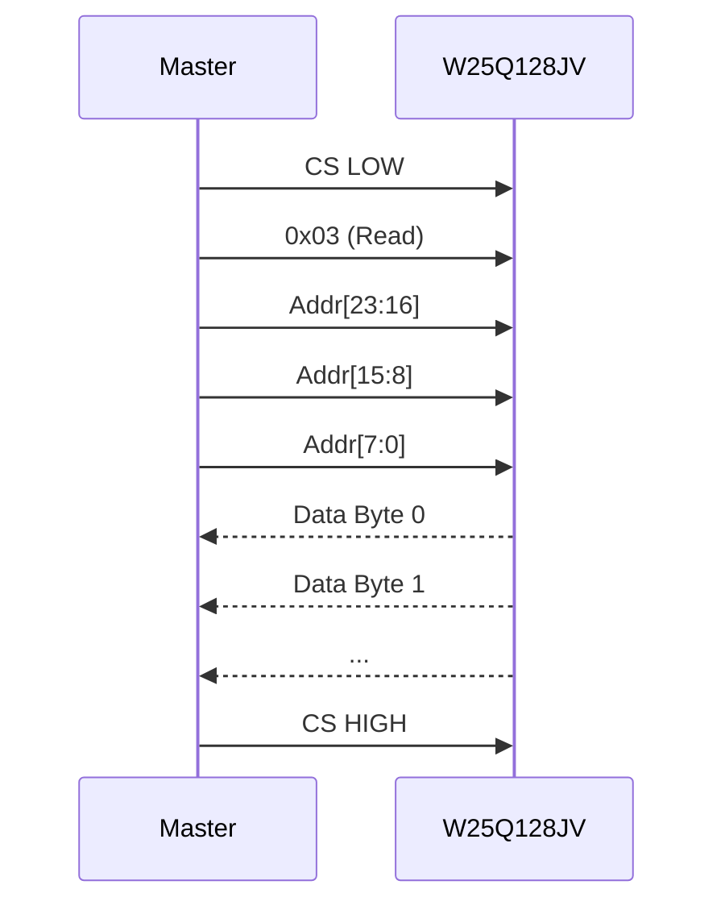
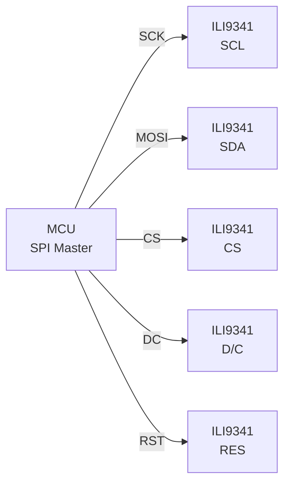

# SPI 实战：Flash 与显示屏

<span class="badge-e">[E]</span> <span class="badge-m">[M]</span>

---

### W25Q128JV 命令码表

<span class="red">W25Q128JV 是 128Mbit SPI NOR Flash，命令驱动型操作</span>。
<br>
所有操作都以单字节命令码开始，后跟地址或数据。
<br>

| 命令码 | 名称 | 功能 | 地址位 | 空时钟 | 数据方向 |
|--------|------|------|--------|--------|----------|
| 0x9F | JEDEC ID | 读取厂商 ID + 器件 ID | 0 | 0 | 主←从 |
| 0x03 | Read Data | 标准读取 | 24 | 0 | 主←从 |
| 0x0B | Fast Read | 快速读取（更高时钟） | 24 | 8 | 主←从 |
| 0x02 | Page Program | 页编程（写入） | 24 | 0 | 主→从 |
| 0x20 | Sector Erase | 4KB 扇区擦除 | 24 | 0 | 主→从 |
| 0xC7 | Chip Erase | 全片擦除 | 0 | 0 | 主→从 |
| 0x05 | Read Status Reg1 | 读状态寄存器 | 0 | 0 | 主←从 |
| 0x06 | Write Enable | 写使能 | 0 | 0 | 主→从 |
| 0x75 | Erase/Program Suspend | 擦写挂起 | 0 | 0 | 主→从 |
| 0x7A | Erase/Program Resume | 擦写恢复 | 0 | 0 | 主→从 |

读取 JEDEC ID 时序：
<br>
```
CS↓ [0x9F] [ID7~0] [ID15~8] [ID23~16] [ID31~24] CS↑
       ↓      ↓        ↓         ↓          ↓
    命令   Mfg ID   Mem Type   Capacity  保留

例：Winbond 0xEF, Type 0x40, Capacity 0x18 = 128Mbit
```

页编程时序：
<br>
```
CS↓ [0x06] CS↑   ← Write Enable
CS↓ [0x02] [A23~16] [A15~8] [A7~0] [D0] [D1] ... [Dn] CS↑
       ↓      ↓        ↓       ↓      ↓    ↓        ↓
    命令   地址高    地址中   地址低  数据  数据 ... 数据
```



状态寄存器（0x05 读取）位定义：
<br>
| 位 | 名称 | 含义 |
|----|------|------|
| 0 | BUSY | 1=正在擦写，0=空闲 |
| 1 | WEL | 1=写使能已开启 |
| 2~6 | BP0~BP4 | 块保护位 |
| 7 | SRP | 状态寄存器保护 |

<span class="blue">关键认知：Flash 写入前必须先擦除（全 1 → 写 0），
</br>
擦除后必须轮询 BUSY 位确认完成才能进行下一步操作。</span><br>

---

### ILI9341 显示屏接线

ILI9341 是 240×320 像素的 TFT LCD 控制器，</br>
通过 SPI 接口接收命令和像素数据。
</br>



引脚说明：</br>
| 引脚 | 功能 | 说明 |
|------|------|------|
| SCL | SPI 时钟 | 接主设备 SCK |
| SDA | SPI 数据 | 接主设备 MOSI（半双工，无 MISO） |
| CS | 片选 | 低有效 |
| D/C | 数据/命令选择 | 低=命令，高=数据 |
| RES | 复位 | 低有效 |

ILI9341 的 SPI 通常工作在 Mode 0：</br>
- CPOL=0, CPHA=0
</br>
- 速率可达 10~30MHz（取决于屏和接线质量）
</br>

DC 引脚是 SPI 显示屏特有的：</br>
- 发送命令前拉低 DC，然后发命令字节
</br>
- 发送数据前拉高 DC，然后发像素数据
</br>
- 命令控制显示参数（分辨率、方向、伽马等）
</br>
- 数据是 RGB565 像素值
</br>

常用命令：</br>
| 命令 | 值 | 作用 |
|------|-----|------|
| SWRESET | 0x01 | 软件复位 |
| SLPOUT | 0x11 | 退出睡眠 |
| DISPON | 0x29 | 显示开启 |
| CASET | 0x2A | 设置列地址范围 |
| PASET | 0x2B | 设置页地址范围 |
| RAMWR | 0x2C | 写入显存 |
| MADCTL | 0x36 | 扫描方向控制 |

初始化流程：</br>
```
RES 拉低 10ms → 拉高 120ms 等待复位
→ SWRESET (0x01) → 延时 5ms
→ SLPOUT (0x11) → 延时 120ms
→ 配置 MADCTL、帧率、伽马等参数
→ DISPON (0x29)
```

<span class="blue">关键认知：ILI9341 的 SPI 是"写-only"（主设备到屏），
</br>
没有 MISO 回读，读显存需要通过其他接口或不需要读。</span><br>

---

### QSPI 扩展

<span class="red">QSPI（Quad SPI）</span>用 4 根数据线（IO0~IO3）同时传输，
</br>
速率是标准 SPI 的 4 倍。
</br>

| 模式 | 数据线 | 命令期 | 地址期 | 数据期 | 理论速率 |
|------|--------|--------|--------|--------|----------|
| Standard SPI | 1 | 1线 | 1线 | 1线 | 1× |
| Dual Output | 2 | 1线 | 1线 | 2线 | 2× |
| Dual I/O | 2 | 1线 | 2线 | 2线 | 2×+ |
| Quad Output | 4 | 1线 | 1线 | 4线 | 4× |
| Quad I/O | 4 | 1线 | 4线 | 4线 | 4×+ |

W25Q128JV 的 QSPI 命令：</br>
| 命令码 | 模式 | 说明 |
|--------|------|------|
| 0x6B | Quad Output Fast Read | 命令+地址用 1线，数据用 4线 |
| 0xEB | Quad I/O Fast Read | 命令用 1线，地址+数据用 4线，空时钟 6 |
| 0x38 | Quad Page Program | 命令用 1线，数据用 4线写入 |
| 0xB7 | Enter QPI Mode | 进入 4线命令模式 |

QSPI 需要专用的 QSPI 控制器（不是普通 SPI 软件模拟能做到的），
</br>
STM32、i.MX、ESP32 等 SoC 都内置 QSPI 接口，可直接外接 QSPI Flash。
</br>

```mermaid
flowchart LR
    MCU["QSPI Controller"] --
CLK--> Flash["QSPI Flash"]
    MCU --IO0--> Flash
    MCU --IO1--> Flash
    MCU --IO2--> Flash
    MCU --IO3--> Flash
    MCU --CS--> Flash
    Note over MCU,Flash: 4线并行传输
```

<span class="blue">关键认知：QSPI 的 Quad I/O 模式地址也用 4 线发，
</br>
配合 80MHz 时钟，实际读取速率可达 40MB/s 以上。</span><br>

---

### Octal SPI

<span class="red">Octal SPI（OSPI，8 线 SPI）</span>是 QSPI 的进一步扩展，
</br>
用 8 根数据线 + DDR 模式，速率可达数百 MB/s。
</br>

典型应用：</br>
- 大容量 NOR Flash（如 Macronix 256MB+）
</br>
- HyperRAM / HyperFlash（Cypress/Infineon）
</br>
- 替代并行 NOR，节省引脚同时保持带宽
</br>

参数对比：</br>
| 接口 | 数据线 | 时钟 | DDR | 理论速率 | 典型用途 |
|------|--------|------|-----|----------|----------|
| SPI | 1 | 50MHz | 否 | 6.25MB/s | 小容量配置 |
| Dual SPI | 2 | 80MHz | 否 | 20MB/s | 中等容量 |
| QSPI | 4 | 80MHz | 否 | 40MB/s | 大容量 Flash |
| QSPI DDR | 4 | 80MHz | 是 | 80MB/s | 高带宽存储 |
| OSPI | 8 | 200MHz | 是 | 400MB/s | XIP 执行 |

XIP（Execute In Place）是 OSPI 的关键场景：</br>
- 代码直接存储在 OSPI Flash 中，SoC 通过内存映射直接取指执行
</br>
- 无需先将代码加载到 RAM
</br>
- 启动速度更快，BOM 成本更低
</br>

<span class="purple">扩展：i.MX RT 系列 MCU 的 FlexSPI 接口支持最多 8 线 + DDR，
</br>
是 OSPI XIP 方案的标杆实现。</span><br>

---

### 代码：Flash 读取 + 显示驱动

完整示例：从 W25Q128JV 读取图像数据，通过 SPI 发送到 ILI9341 显示。
</br>

```c
#include "stm32f4xx_hal.h"

#define FLASH_CS_PIN    GPIO_PIN_4
#define FLASH_CS_PORT   GPIOA
#define LCD_CS_PIN      GPIO_PIN_12
#define LCD_CS_PORT     GPIOB
#define LCD_DC_PIN      GPIO_PIN_13
#define LCD_DC_PORT     GPIOB

#define FLASH_CMD_READ  0x03
#define LCD_CMD_RAMWR   0x2C

// Flash 读取
void flash_read(uint32_t addr, uint8_t *buf, uint16_t len) {
    uint8_t tx[4] = {FLASH_CMD_READ,
                     (addr >> 16) & 0xFF,
                     (addr >> 8) & 0xFF,
                     addr & 0xFF};
    
    HAL_GPIO_WritePin(FLASH_CS_PORT, FLASH_CS_PIN, GPIO_PIN_RESET);
    HAL_SPI_Transmit(&hspi1, tx, 4, 100);
    HAL_SPI_Receive(&hspi1, buf, len, 1000);
    HAL_GPIO_WritePin(FLASH_CS_PORT, FLASH_CS_PIN, GPIO_PIN_SET);
}

// LCD 写命令
void lcd_write_cmd(uint8_t cmd) {
    HAL_GPIO_WritePin(LCD_DC_PORT, LCD_DC_PIN, GPIO_PIN_RESET);  // D/C = 命令
    HAL_GPIO_WritePin(LCD_CS_PORT, LCD_CS_PIN, GPIO_PIN_RESET);
    HAL_SPI_Transmit(&hspi2, &cmd, 1, 100);
    HAL_GPIO_WritePin(LCD_CS_PORT, LCD_CS_PIN, GPIO_PIN_SET);
}

// LCD 写数据
void lcd_write_data(uint8_t *data, uint16_t len) {
    HAL_GPIO_WritePin(LCD_DC_PORT, LCD_DC_PIN, GPIO_PIN_SET);    // D/C = 数据
    HAL_GPIO_WritePin(LCD_CS_PORT, LCD_CS_PIN, GPIO_PIN_RESET);
    HAL_SPI_Transmit(&hspi2, data, len, 1000);
    HAL_GPIO_WritePin(LCD_CS_PORT, LCD_CS_PIN, GPIO_PIN_SET);
}

// 设置 LCD 写入窗口
void lcd_set_window(uint16_t x0, uint16_t y0, uint16_t x1, uint16_t y1) {
    lcd_write_cmd(0x2A);  // CASET
    uint8_t col[4] = {x0 >> 8, x0 & 0xFF, x1 >> 8, x1 & 0xFF};
    lcd_write_data(col, 4);
    
    lcd_write_cmd(0x2B);  // PASET
    uint8_t row[4] = {y0 >> 8, y0 & 0xFF, y1 >> 8, y1 & 0xFF};
    lcd_write_data(row, 4);
}

// 从 Flash 读取图像并显示到 LCD
void display_image_from_flash(uint32_t flash_addr) {
    uint8_t pixel_buf[240 * 2];  // 一行 240 像素，RGB565 = 2字节/像素
    
    lcd_set_window(0, 0, 239, 319);
    lcd_write_cmd(LCD_CMD_RAMWR);  // 0x2C
    HAL_GPIO_WritePin(LCD_DC_PORT, LCD_DC_PIN, GPIO_PIN_SET);
    HAL_GPIO_WritePin(LCD_CS_PORT, LCD_CS_PIN, GPIO_PIN_RESET);
    
    for (uint16_t row = 0; row < 320; row++) {
        flash_read(flash_addr + row * 480, pixel_buf, 480);
        HAL_SPI_Transmit(&hspi2, pixel_buf, 480, 1000);
    }
    
    HAL_GPIO_WritePin(LCD_CS_PORT, LCD_CS_PIN, GPIO_PIN_SET);
}
```

<span class="blue">关键认知：不同外设通常用不同 SPI 总线或至少不同 CS，
</br>
上图用了 hspi1（接 Flash）和 hspi2（接 LCD），避免速率模式冲突。</span><br>

---

**学习路径提示**：
<br>
- <span class="badge-e">[E]</span> 读者：Flash 操作的核心是"命令+地址+数据"三段式，
</br>
  写操作必须遵循"使能→编程→轮询 BUSY"流程。
</br>
- <span class="badge-m">[M]</span> 读者：QSPI/OSPI 是高带宽存储的演进方向，
</br>
  XIP 执行让代码无需加载到 RAM 即可运行，是资源受限系统的关键方案。

### 为什么需要 SPI

<span class="red">I2C 节省引脚但牺牲了带宽</span>。<br>
当外设需要高速流式传输时——Flash 烧录、显示屏刷新、ADC 采样——400kHz 的 I2C 成为瓶颈。<br>
SPI（Serial Peripheral Interface，串行外设接口）用 **四根线** 换取 **全双工高速传输**。<br>
时钟由主设备单方面驱动，无需等待从设备 ACK，协议开销接近零。

---

## 本章小结

| 要点 | 内容 |
|------|------|
| 四线架构 | SCK + MOSI + MISO + CS，全双工同步通信 |
| 时钟模式 | CPOL（空闲电平）+ CPHA（采样边沿）组合成 4 种模式 |
| 片选机制 | CS 低电平有效，多从设备需三态门避免 MISO 冲突 |
| Linux 子系统 | spidev 用户态接口、spi_sync/spi_async 传输 API |
| 扩展接口 | QSPI（4 线数据）、Octal SPI（8 线数据）、DUAL/QUAD 读模式 |

## 练习

1. SPI 的四种时钟模式（Mode 0/1/2/3）分别由 CPOL 和 CPHA 的什么组合决定？请画出每种模式的时钟波形和数据采样时刻。
2. 在单主多从的 SPI 拓扑中，为什么未被选中的从设备必须将 MISO 置为高阻态（High-Z）？如果两个从设备同时驱动 MISO 会发生什么？
3. QSPI（Quad SPI）相比标准 SPI 增加了哪些信号线？为什么 NOR Flash 普遍采用 QSPI 接口？Octal SPI 又将数据线扩展到了多少根？
