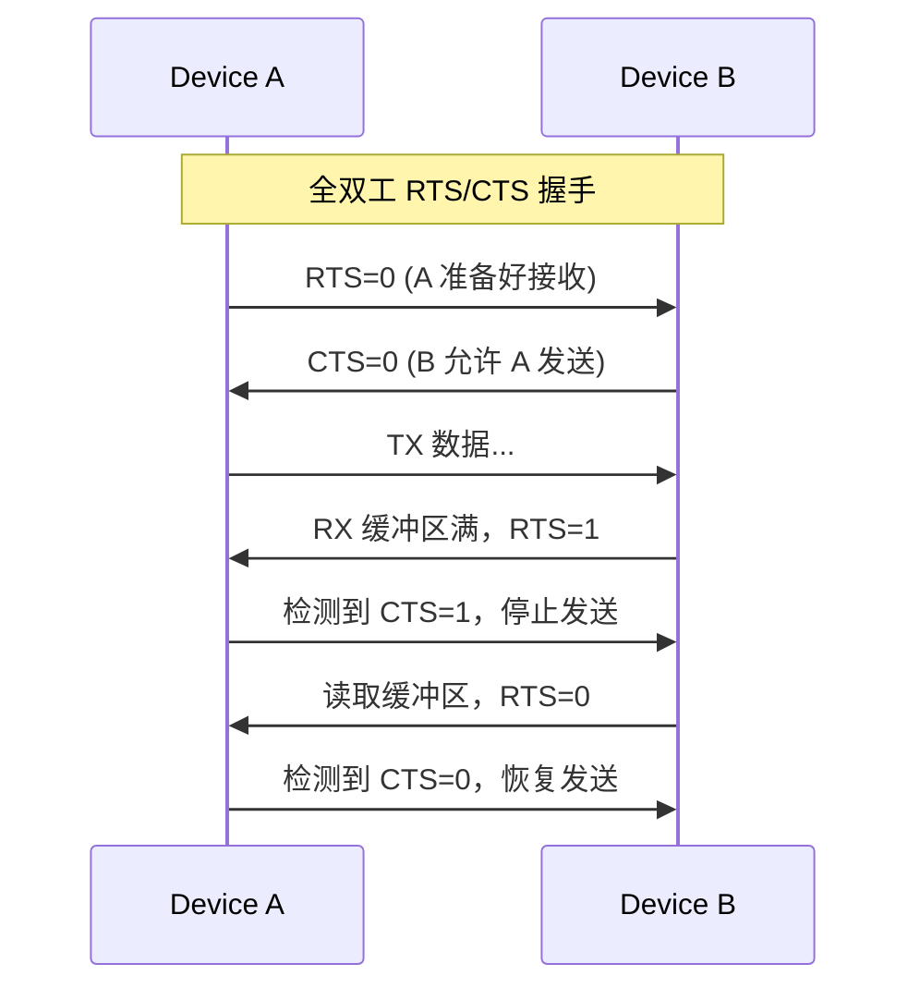

<span class="badge-i">[I]</span>

# UART 波特率与流控

<span class="red">波特率误差和流控机制是 UART 稳定通信的两根支柱：误差过大会导致帧错误，无流控会在高速或大数据量时丢字节。</span> 本章从数学推导、硬件握手、软件协议到 FIFO 缓冲，系统讲解 UART 的速率与流量控制机制。

---

### 为什么需要 UART

<span class="red">嵌入式系统调试和低速异步通信</span>是最常见的开发需求之一。<br>
同步总线（I2C/SPI）需要共享时钟信号，长距离传输时时钟偏移导致数据错误。<br>
UART（Universal Asynchronous Receiver/Transmitter）仅需 **两根线（TX+RX）** 即可实现全双工通信，<br>
无需时钟线、无需地址寻址、协议极简，是调试串口、GPS 模组、蓝牙透传模块的首选接口。


## 波特率误差容忍

<span class="red">UART 接收端在每个位周期的中心点采样，允许最大半位周期的偏移，由此推导出 ±1.5% 的误差上限。</span>

### 误差推导过程

一个 8N1 帧包含 10 个位周期（1 起始 + 8 数据 + 1 停止）。接收端在起始位下降沿后等待 1.5 个位周期采样 D0，之后每 1 个位周期采样后续位。 <br>
D7 的采样时刻距离起始沿为 `1.5 + 7 = 8.5` 个位周期。若发送端和接收端波特率存在差异，到 D7 采样时刻的累积偏移为 `8.5 × error`。 <br>
为保证采样点仍在 D7 的有效窗口内，需满足： <br>
`8.5 × error < 0.5` → `error < 5.88%`。 <br>
但这只是理论极限，实际还需考虑时钟抖动、信号边沿畸变、收发器延迟等因素，工程上通常要求 `error < ±1.5%`，留有充足余量。

### 更严格的约束

对于 9 位数据 + 2 位停止位的配置（11 位帧），D8 的采样时刻距离起始沿为 `1.5 + 8 = 9.5` 个位周期，理论误差上限进一步降低为 `0.5 / 9.5 = 5.26%`。高波特率（如 921600bps）下，收发器延迟（约 1μs）占一个位周期（1.08μs）的比例更大，实际可容忍误差会进一步缩小。

### 温度与晶振漂移

陶瓷振荡器温漂约 ±0.5%，RC 振荡器温漂可达 ±2%~±5%。若系统使用内部 RC 振荡器且工作温度范围宽，波特率误差可能超过容忍极限。 <br>
<span class="blue">结论：对可靠性要求高的应用，必须使用外部晶振或陶瓷谐振器，并避免使用内部 RC 作为 UART 时钟源。</span>

### 波特率自适应

部分高级 UART 支持自动波特率检测（Auto Baud Rate Detection）。接收端通过测量起始位和第一个数据位的宽度来推算对方波特率，常用于未知波特率的设备对接场景。 <br>
<span class="purple">扩展：STM32 的 USART 支持多种自动波特率检测模式，包括测量起始位宽度、测量两个下降沿间距等，检测完成后自动更新 BRR 寄存器。</span>

---

## 硬件流控 RTS/CTS

<span class="red">硬件流控通过额外的 RTS（Request To Send）和 CTS（Clear To Send）信号线实现收发双方的速率匹配。</span>

### 信号线定义

| 信号 | 方向 | 作用 |
|------|------|------|
| RTS | 本机输出 | 告诉对方"本机可以接收" |
| CTS | 本机输入 | 对方告诉本机"可以发送" |

全双工通信时双方各自拉低 RTS 表示准备好接收，对方检测到 CTS 为低后才启动发送。

### 握手时序图



### 注意事项

- RTS/CTS 为低电平有效（negative logic），即逻辑 0 表示"有效/允许"。
- 部分 USB 转串口芯片（如 CH340、FT232）的 RTS/CTS 引脚可通过软件控制，但默认状态可能不确定。
- <span class="blue">易错点：忘记连接 RTS/CTS 却启用了硬件流控，会导致发送端永远等待 CTS 而卡死。</span>

### RS-232 中的流控引脚

RS-232 标准定义了完整的 9 引脚接口（DB-9），除 TX/RX/RTS/CTS 外还包括 DTR、DSR、DCD、RI 等调制解调器控制信号。现代嵌入式系统中，通常仅使用 TX/RX/GND 三根线，或加上 RTS/CTS 共五根线。

---

## 软件流控 XON/XOFF

<span class="red">软件流控不占用额外信号线，通过在数据流中插入特殊字符 XON（0x11）和 XOFF（0x13）实现暂停/恢复。</span>

### 协议细节

- XOFF（0x13，DC3）：接收方发送，要求对方暂停发送。
- XON（0x11，DC1）：接收方发送，通知对方恢复发送。
- 流控字符本身不参与应用层数据传输，由驱动层透明处理。

### 优缺点

| 优点 | 缺点 |
|------|------|
| 不占用额外 GPIO | 增加传输延迟（至少 1 字节） |
| 兼容只有 TX/RX 的线缆 | 二进制数据可能误触发流控字符 |
| 软件实现简单 | 高速场景下反应不够及时 |

<span class="blue">易错点：传输二进制文件时，若数据中恰好出现 0x11 或 0x13，会被驱动误认为流控指令而中断传输。</span> 解决方式：使用硬件流控，或在软件层对 0x11/0x13 进行转义（如 SLIP 协议）。

### SLIP 转义

SLIP（Serial Line Internet Protocol）在发送数据时，将 0x11、0x13 和帧结束符 0xC0 转义为两字节序列，避免与流控字符冲突：

| 原始字节 | 转义序列 |
|----------|----------|
| 0xC0 | 0xDB 0xDC |
| 0xDB | 0xDB 0xDD |

---

## FIFO 与超时中断

<span class="red">FIFO（First-In-First-Out）缓冲区减少 CPU 中断频率，超时中断则解决"少量数据长时间等待"的问题。</span>

### UART16550 FIFO 深度

经典 UART16550A 提供 16 字节发送 FIFO 和 16 字节接收 FIFO。现代芯片（如 STM32、AM335x）的 FIFO 深度可达 64 字节甚至 128 字节。 <br>
FIFO 触发级别可配置：接收 FIFO 达到 1/4/8/14 字节时触发中断，发送 FIFO 低于相同阈值时触发中断。

### 接收超时机制

当接收 FIFO 中有数据但长时间（如 4 个字符周期）未收到新字节时，触发接收超时中断（RTO, Receiver Time Out）。 <br>
这一机制确保了"少量零散数据"也能被及时处理，不会因为 FIFO 未达到触发阈值而永远等待。

| 场景 | 无 FIFO（8250） | 有 FIFO 无超时 | 有 FIFO+超时 |
|------|---------------|---------------|--------------|
| 连续大数据流 | 每字节中断 | FIFO 满后中断 | FIFO 满或超时中断 |
| 零星单字节 | 每字节中断 | 可能永远等待 | 超时后中断 |
| CPU 负载 | 极高 | 中等 | 最低 |

<span class="blue">结论：现代 UART 应用应始终启用 FIFO 和超时中断，除非在极端低功耗场景下需要最小化唤醒次数。</span>

---

## Linux termios 配置

<span class="red">termios 结构体是 Linux 下配置 UART 参数的标准接口，涵盖波特率、数据位、校验、流控、超时等全部选项。</span>

```c
#include <stdio.h>
#include <stdlib.h>
#include <string.h>
#include <unistd.h>
#include <fcntl.h>
#include <errno.h>
#include <termios.h>

int uart_init(const char *device, speed_t baudrate)
{
    int fd = open(device, O_RDWR | O_NOCTTY | O_NDELAY);
    if (fd < 0) {
        perror("open");
        return -1;
    }

    struct termios tty;
    memset(&tty, 0, sizeof(tty));

    if (tcgetattr(fd, &tty) != 0) {
        perror("tcgetattr");
        close(fd);
        return -1;
    }

    // 输入输出波特率
    cfsetospeed(&tty, baudrate);
    cfsetispeed(&tty, baudrate);

    // 8 数据位，无校验，1 停止位
    tty.c_cflag &= ~PARENB;        // 无校验
    tty.c_cflag &= ~CSTOPB;        // 1 停止位
    tty.c_cflag &= ~CSIZE;
    tty.c_cflag |= CS8;             // 8 数据位
    tty.c_cflag |= CREAD | CLOCAL;  // 启用接收，忽略调制解调器控制线

    // 禁用硬件流控
    tty.c_cflag &= ~CRTSCTS;

    // 禁用软件流控
    tty.c_iflag &= ~(IXON | IXOFF | IXANY);

    // 原始模式：不处理输入输出
    tty.c_lflag &= ~(ICANON | ECHO | ECHOE | ISIG);
    tty.c_oflag &= ~OPOST;

    // 读取超时配置：至少 1 字节，超时 0.5 秒
    tty.c_cc[VMIN]  = 1;
    tty.c_cc[VTIME] = 5;

    if (tcsetattr(fd, TCSANOW, &tty) != 0) {
        perror("tcsetattr");
        close(fd);
        return -1;
    }

    tcflush(fd, TCIOFLUSH);
    return fd;
}

int main(void)
{
    int fd = uart_init("/dev/ttyS0", B115200);
    if (fd < 0) return EXIT_FAILURE;

    const char *msg = "Hello UART\n";
    write(fd, msg, strlen(msg));

    char buf[64];
    int n = read(fd, buf, sizeof(buf));
    if (n > 0) {
        buf[n] = '\0';
        printf("recv: %s\n", buf);
    }

    close(fd);
    return EXIT_SUCCESS;
}
```

### 关键标志说明

| 标志 | 作用 | 置位/清零 |
|------|------|-----------|
| CREAD | 启用接收器 | 置位 |
| CLOCAL | 忽略调制解调器状态 | 置位 |
| CRTSCTS | 硬件流控 | 清零（禁用） |
| IXON/IXOFF | 软件流控 | 清零（禁用） |
| ICANON | 规范模式 | 清零（原始模式） |
| ECHO | 回显输入 | 清零 |
| VMIN | 最小读取字节数 | 1 |
| VTIME | 超时时间（×100ms） | 5 |

<span class="blue">易错点：`tcsetattr` 使用 `TCSANOW` 立即生效，但某些参数（如波特率）需要 `TCSAFLUSH` 排空缓冲区后才生效。调试时建议先 `tcflush` 再 `tcsetattr`。</span>

### 波特率常数映射

| 常数 | 波特率 | 常数 | 波特率 |
|------|--------|------|--------|
| B9600 | 9600 | B57600 | 57600 |
| B19200 | 19200 | B115200 | 115200 |
| B38400 | 38400 | B921600 | 921600 |

---

## 小节

- 波特率误差累积在帧末尾最敏感，工程上要求 ±1.5% 以内。
- 硬件流控 RTS/CTS 可靠但占用 GPIO，软件流控 XON/XOFF 省线但存在二进制数据冲突风险。
- FIFO 降低中断频率，超时中断确保零星数据不滞留。
- Linux termios 是配置 UART 的事实标准，理解 c_cflag/c_iflag/c_lflag/c_cc 各司其职。
- 实际项目中，波特率配置应优先选用芯片手册推荐的"零误差"组合，减少运行时调试成本。

---

## 历史演进与发展趋势

UART（Universal Asynchronous Receiver/Transmitter）的历史可追溯至 1960 年代的电传打字机（Teletype）接口，是计算机串行通信的鼻祖。1970 年代，RS-232 标准（EIA-232）定义了 UART 的电气规范，成为调制解调器和终端的标准连接方式。1980 年代，8250/16450/16550 等 UART 芯片使 PC 串口标准化。1990 年代 USB 兴起后，传统 RS-232 端口逐渐从 PC 消失，但 FT232、CP2102 等 USB-to-UART 桥接芯片让 UART 在嵌入式领域焕发新生。2000 年后，UART 成为嵌入式调试的标配——几乎每个 MCU 的启动日志都通过 UART 输出。2010 年后，蓝牙模块（HC-05）、GPS 模组、LoRa 无线模块仍沿用 UART 接口。未来，虽然高速场景被 USB 取代，但 UART 凭借极简的 2 线设计和无需时钟同步的优势，仍将是嵌入式调试和低速外设通信的核心接口。

---

## 本章小结

| 要点 | 内容 |
|------|------|
| 异步通信 | TX + RX 双线，无共享时钟，依赖双方一致的波特率 |
| 帧格式 | 起始位(低) + 数据位(5-9bit) + 校验位(可选) + 停止位(高) |
| 流控 | RTS/CTS 硬件流控 vs XON/XOFF 软件流控 |
| Linux 终端 | tty 子系统、termios 配置、stty 命令行工具 |
| 扩展 | RS-485 半双工差分、IrDA 红外、USB-to-UART 桥接 |

## 练习

1. UART 通信中，为什么波特率的误差不能超过约 2%？如果发送端和接收端的波特率相差 5%，会发生什么类型的错误？
2. RTS/CTS 硬件流控与 XON/XOFF 软件流控有什么区别？在高吞吐量场景下，为什么硬件流控更可靠？
3. 在 Linux 中，`/dev/ttyUSB0` 和 `/dev/ttyS0` 分别对应什么类型的 UART 设备？`stty` 命令如何设置波特率为 115200、8 位数据、无校验、1 位停止位？
