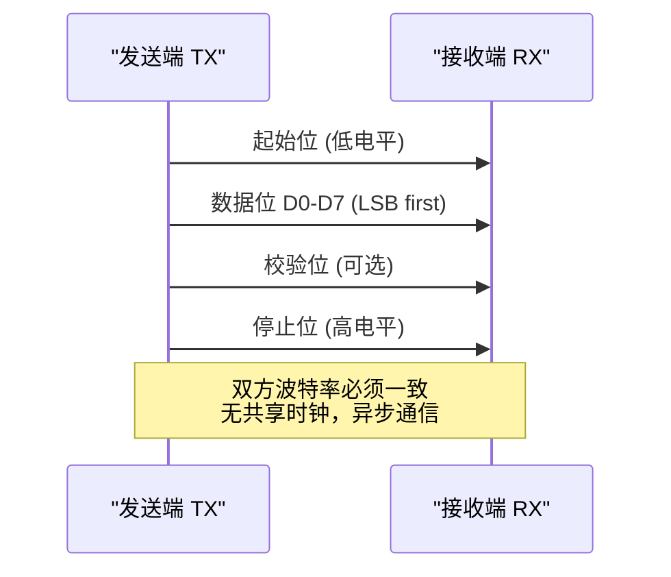

<span class="badge-e">[E]</span>

# UART 扩展与前沿

<span class="red">UART 的经典设计经过数十年演进，衍生出 RS-485 工业总线、USB 虚拟串口、红外通信、无线模组接口等多种形式，至今仍是物联网和工业自动化领域不可替代的底层协议。</span>

---

### 为什么需要 UART

<span class="red">嵌入式系统调试和低速异步通信</span>是最常见的开发需求之一。<br>
同步总线（I2C/SPI）需要共享时钟信号，长距离传输时时钟偏移导致数据错误。<br>
UART（Universal Asynchronous Receiver/Transmitter）仅需 **两根线（TX+RX）** 即可实现全双工通信，<br>
无需时钟线、无需地址寻址、协议极简，是调试串口、GPS 模组、蓝牙透传模块的首选接口。


## RS-485 半双工

<span class="red">RS-485 通过差分信号和半双工架构将 UART 的传输距离扩展到 1200 米，支持总线上挂接最多 32 个标准负载设备。</span>

### 方向切换时序

RS-485 使用一对差分线（A/B），同一时刻只能发送或接收，方向由 DE（Driver Enable）和 RE（Receiver Enable）引脚控制。DE 和 RE 通常短接为一根方向控制线：

| 方向控制 | DE | RE | 状态 |
|----------|----|----|------|
| 发送 | 1 | 1 | 驱动器启用，接收器禁用 |
| 接收 | 0 | 0 | 驱动器禁用，接收器启用 |

发送完成到切换接收的延迟必须覆盖最后一个位的传输时间。以 9600bps 为例，1 位约 104μs，方向切换延迟应 ≥ 1 位周期。自动方向控制的收发器（如 MAX485 的自动方向版本）内部检测 TX 电平变化，省去外部 GPIO 控制。

### 终端电阻与偏置

总线两端各接 120Ω 终端电阻，消除信号反射。长距离或设备较少时，需在总线一端或两端添加上下拉偏置电阻，确保空闲时 A>B 差分电压 ≥ 200mV，避免噪声误触发。

<span class="blue">易错点：忘记在总线末端加终端电阻，导致信号反射产生误码，症状为"近距离正常，远距离乱码"。</span>

### 全双工 RS-422

RS-422 使用两对差分线（TX+/TX-、RX+/RX-），支持全双工通信，但只能点对点或一主多从（广播）。RS-485 是 RS-422 的半双工多节点扩展。RS-422 的接收器输入阻抗更高，同一发送器可驱动 10 个接收器。

### 工业应用：Modbus-RTU

Modbus-RTU 是 RS-485 总线上最常用的应用层协议。主站通过功能码（如 0x03 读保持寄存器）轮询从站，从站响应数据。帧格式为：从站地址 + 功能码 + 数据 + CRC16。



---

## USB CDC-ACM

<span class="red">USB CDC-ACM（Communication Device Class - Abstract Control Model）将 UART 封装在 USB 协议中，PC 端呈现为虚拟串口 /dev/ttyACM*，无需安装专用驱动。</span>

### 描述符结构

CDC-ACM 设备需要两组接口：

| 接口 | 类型 | 端点 | 作用 |
|------|------|------|------|
| Interface 0 | Communication | INT IN | 控制命令（SetLineCoding 等） |
| Interface 1 | Data | BULK IN/OUT | 实际数据传输 |

PC 通过控制接口发送 `SET_LINE_CODING` 请求设置波特率、数据位、停止位、校验位，设备响应后按新参数转发到物理 UART。

### 波特率虚拟化

CDC-ACM 的波特率对 USB 吞吐量无实际影响。USB Full-Speed 的 BULK 端点带宽约 1MB/s，远大于任何 UART 波特率。PC 端设置 921600 波特率时，实际瓶颈在设备端的 UART 硬件，而非 USB 总线。

<span class="purple">扩展：CH340、CP2102、FT232RL 等芯片内部将 USB 数据流转换为 TTL UART 信号，是开发板和调试器的标配组件。其中 FT232 支持 MPSSE 模式，可通过软件模拟 SPI/I2C/JTAG。</span>

---

## IrDA 红外通信

<span class="red">IrDA（Infrared Data Association）将 UART 的电平信号调制为 38kHz 红外载波，实现短距离无线点对点通信。</span>

### 调制机制

逻辑 0 发送 3/16 位周期的红外脉冲，逻辑 1 不发送脉冲。接收端通过红外接收头解调，还原为 TTL 电平。这种编码方式称为 RZI（Return to Zero Inverted）。

| 参数 | 典型值 |
|------|--------|
| 载波频率 | 38 kHz |
| 调制占空比 | 3/16 位周期 |
| 通信距离 | 1 cm ~ 1 m |
| 典型速率 | 9600 ~ 115200 bps |

IrDA 仅支持点对点，且收发双方必须对准，抗遮挡能力差。现代手机已淘汰 IrDA，但在遥控器、红外打印、旧式 PDA 同步中仍有应用。

### IrDA 栈层次

| 层 | 协议 | 作用 |
|----|------|------|
| 物理层 | IrPHY | 38kHz RZI 调制 |
| 链路层 | IrLAP | 设备发现、连接建立 |
| 传输层 | IrLMP | 多路复用 |
| 应用层 | IrCOMM / OBEX | 串口仿真、文件传输 |

---

## UART 在 BLE/LoRa 模组中的应用

<span class="red">几乎所有无线透传模组（蓝牙 BLE、Wi-Fi、LoRa、NB-IoT）都将 UART 作为与主控 MCU 的默认接口，通过 AT 指令或二进制协议进行配置和数据交换。</span>

### 典型模组接口

| 模组 | UART 速率 | 协议 | 供电 |
|------|-----------|------|------|
| HC-05/06（蓝牙） | 9600 | AT 指令 | 3.3V |
| ESP-01S（Wi-Fi） | 115200 | AT 指令 | 3.3V |
| SX1278（LoRa） | 9600 | 二进制 | 3.3V |
| BC95（NB-IoT） | 9600 | AT 指令 | 3.3V |

### 设计要点

- 模组上电时 UART 波特率固定，发送 AT 指令后可动态修改。
- 部分模组（如 ESP8266）启动阶段会打印大量日志到 UART，主控若在此期间发送数据可能导致模组进入异常状态。
- 3.3V 模组与 5V MCU 之间需电平转换，否则可能损坏模组 RX 引脚。
- <span class="blue">易错点：BLE 模组深度休眠后，首次 UART 数据可能被丢弃，需先发唤醒脉冲或查询连接状态后再发业务数据。</span>

---

## 多路 UART 扩展：SC16IS752

<span class="red">当 MCU 的硬件 UART 数量不足时，可通过 I2C/SPI 转 UART 芯片扩展多路串口，NXP SC16IS752 是工业级方案的典型代表。</span>

### 芯片特性

| 参数 | 规格 |
|------|------|
| 接口 | I2C 或 SPI |
| UART 通道 | 2 路 |
| FIFO 深度 | 64 字节 TX/RX |
| 硬件流控 | 支持 RTS/CTS |
| 中断输出 | 开漏 INT 引脚 |
| 波特率 | 最高 5 Mbps |

### 典型连接

```
MCU (I2C) ---+-- SC16IS752 --- UART A (接 GPS)
             +-- SC16IS752 --- UART B (接 4G 模组)
```

MCU 通过 I2C 读写 SC16IS752 的内部寄存器，配置波特率和 FIFO 阈值。当有数据到达时，SC16IS752 拉低 INT 引脚触发 MCU 中断，MCU 再读取接收 FIFO。

<span class="blue">结论：SC16IS752 的 I2C 接口速率（400kHz）足以支撑两路 115200bps UART 同时满载运行，因为实际业务负载通常远低于理论峰值。</span>

### 寄存器映射

SC16IS752 的寄存器按通道分组，通过 I2C 子地址选择通道 A 或 B。关键寄存器包括：

| 寄存器 | 地址 | 作用 |
|--------|------|------|
| THR/RHR | 0x00 | 发送/接收保持寄存器 |
| IER | 0x01 | 中断使能 |
| FCR | 0x02 | FIFO 控制 |
| LCR | 0x03 | 线路控制（数据位/校验/停止位） |
| MCR | 0x04 | 调制解调器控制（RTS/CTS 使能） |
| SPR | 0x07 | 暂存寄存器（软件测试用） |
| TLR | 0x07 (MCR[7]=1) | 触发级别 |

---

## 小节

- RS-485 是 UART 的工业级扩展，差分+半双工实现千米级传输。
- USB CDC-ACM 将 UART 封装为虚拟串口，PC 端零驱动，是开发板的标准配置。
- IrDA 利用红外载波实现短距无线，已被蓝牙替代但在遥控领域存活。
- BLE/LoRa 模组几乎都以 UART 作为主机接口，AT 指令是最通用的配置方式。
- I2C/SPI 转 UART 芯片解决 GPIO 数量不足问题，SC16IS752 是成熟方案。
- UART 的持久生命力在于其极简的物理层和庞大的软件生态，未来仍将是低速串行通信的首选。

---

## 本章小结

| 要点 | 内容 |
|------|------|
| 异步通信 | TX + RX 双线，无共享时钟，依赖双方一致的波特率 |
| 帧格式 | 起始位(低) + 数据位(5-9bit) + 校验位(可选) + 停止位(高) |
| 流控 | RTS/CTS 硬件流控 vs XON/XOFF 软件流控 |
| Linux 终端 | tty 子系统、termios 配置、stty 命令行工具 |
| 扩展 | RS-485 半双工差分、IrDA 红外、USB-to-UART 桥接 |

## 练习

1. UART 通信中，为什么波特率的误差不能超过约 2%？如果发送端和接收端的波特率相差 5%，会发生什么类型的错误？
2. RTS/CTS 硬件流控与 XON/XOFF 软件流控有什么区别？在高吞吐量场景下，为什么硬件流控更可靠？
3. 在 Linux 中，`/dev/ttyUSB0` 和 `/dev/ttyS0` 分别对应什么类型的 UART 设备？`stty` 命令如何设置波特率为 115200、8 位数据、无校验、1 位停止位？
