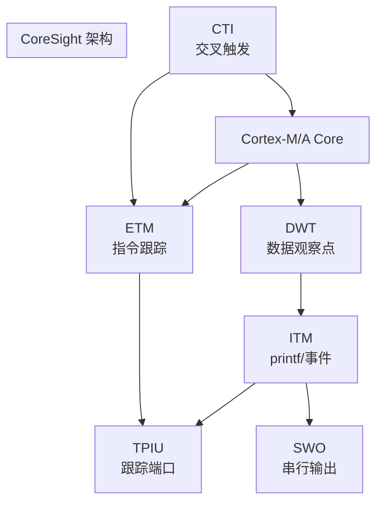

# CoreSight 与 ETM 基础认知 [E→M]

[I] [M]

> **本章学习目标**：
003e - 理解 CoreSight 作为 ARM 调试和跟踪架构的核心组件
003e - 掌握 ETM（Embedded Trace Macrocell） 的指令流跟踪机制
003e - 了解 ITM/SWO/TPIU 在实时调试中的协同工作

---

## CoreSight 的诞生：ARM 的调试生态系统

---

### <strong>为什么需要 CoreSight：调试不止于断点</strong>

CoreSight由 ARM 在 2004 年推出，
是 ARM 处理器的调试和跟踪架构。

传统调试（JTAG/SWD）的局限：
003cbr>
* 断点调试干扰执行：停下来看状态，破坏了时序
003cbr>
* 多核协调困难：不知道各核的精确执行时序
003cbr>
* 实时系统无法打断：汽车 ABS、飞控系统不能停
003cbr>

CoreSight 提供"不打断的调试"：ETM 实时跟踪指令流，ITM 输出 printf 日志，CTI 实现多核交叉触发。整个系统运行不被打断。
003cbr>

类比：CoreSight 如同"体育比赛的实时数据分析系统"——不需要暂停比赛（打断程序），通过高速摄像头（ETM）和传感器（ITM）实时采集数据，赛后分析。
003cbr>

---

### <strong>CoreSight 组件：调试的"瑞士军刀"</strong>

| 组件 | 全称 | 功能 | 输出 |
| --- | --- | --- | --- |
| ETM | Embedded Trace Macrocell | 指令/数据流跟踪 | 跟踪数据 |
| ITM | Instrumentation Trace Macrocell | 软件 printf，事件 | SWO/TPIU |
| DWT | Data Watchpoint and Trace | 数据观察点，性能计数 | ITM |
| TPIU | Trace Port Interface Unit | 跟踪端口输出 | 并行/串行 |
| SWO | Serial Wire Output | 串行线输出 | 1-bit 线 |
| CTI | Cross Trigger Interface | 多核交叉触发 | 内部 |

---

### <strong>ETM：不打断的指令流跟踪</strong>

ETMv4是 ARMv8-A 的跟踪宏单元：
003cbr>
* 实时记录每条指令的执行地址和分支结果
003cbr>
* 4-bit 压缩跟踪数据（P-header, I-header, E-header）
003cbr>
* 支持分支广播（Branch Broadcast），减少压缩率波动
003cbr>
* 跟踪端口宽度 1/2/4/8/16-bit，速率与 CPU 同频
003cbr>

| 事件 | ETM 输出 | 说明 |
| --- | --- | --- |
| 顺序执行 | 省略 | 从地址推断 |
| 分支跳转 | 地址 + 方向 | 记录目标地址 |
| 异常 | 异常类型 + 地址 | 记录入口 |
| 数据访问 | 可选 | 记录数据地址/值 |

ETM 的数据量：顺序执行时不输出数据，只在分支/异常时输出。这大大减少了跟踪带宽需求。典型压缩率 1:20~1:100。
003cbr>

---

## 本章小结

| 概念 | 一句话总结 |
| --- | --- |
| CoreSight | ARM 调试跟踪架构，不打断执行 |
| ETM | 指令流实时跟踪，分支压缩 |
| ITM | 软件 printf，事件输出 |
| DWT | 数据观察点，性能计数 |
| TPIU | 跟踪端口接口，并行/串行输出 |
| SWO | 串行线输出，1-bit |
| CTI | 多核交叉触发 |

---

## 练习

1. ETM 如何实现"不打断执行"的调试？和断点调试有什么区别？
2. 为什么 ETM 只在分支时输出数据，顺序执行时不输出？这基于什么假设？
3. 设计一个多核调试场景：4 核 Cortex-A55，要求同时跟踪所有核的指令流，画出 CoreSight 组件连接拓扑。

---

## 历史演进与发展趋势

CoreSight技术起源于 ARM 对嵌入式调试与跟踪基础设施的系统化需求。2004 年 ARM 发布 CoreSight 架构 v1.0，将此前分散的 ETM（Embedded Trace Macrocell）、ITM（Instrumentation Trace Macrocell）等调试组件纳入统一的 SoC 级调试框架。2008 年 CoreSight v2.0 引入跟踪漏斗（Funnel）与跟踪端口接口（TPIU），支持多核处理器同时输出跟踪数据。2012 年后，随着 Cortex-M 系列在物联网领域的普及，CoreSight 简化为 MTB（Micro Trace Buffer）等低成本方案，使调试能力下沉至资源受限的 MCU。
 

未来趋势：CoreSight 将与 ARMv8-M 的安全扩展深度整合；跟踪数据的实时压缩与 AI 辅助分析也在成为新的技术演进方向。
 