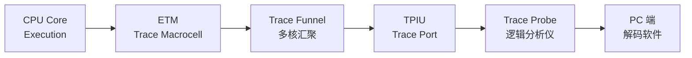

# ETM 跟踪配置与解码 [E→M]

> **本章学习目标**：
> - 理解 <span class="red">ETM 触发条件</span>的配置寄存器与事件组合逻辑
> - 掌握 Trace 端口的时钟/数据宽度与引脚分配
> - 了解 ETM 跟踪数据的解码流程与性能分析方法

---


---

## 需求分析：为什么需要 ETM

---

### <strong>为什么 ETM 成为行业刚需</strong>

<span class="red">ETM 跟踪配置与解码</span>是高性能嵌入式调试的核心技能。为何传统断点调试无法满足多核实时系统的分析需求？因为断点会改变程序时序，且无法捕捉中断嵌套与缓存未命中等瞬态事件。
<br>

<span class="blue">为何需要 ETM：ETM 通过硬件压缩跟踪流，在不中断程序执行的情况下记录指令流、数据访问与分支决策，是唯一能在全速运行中还原程序执行路径的技术手段。</span>
<br>


### <strong>ETM 数据流</strong>



## ETM 触发条件

---

### <strong>ETM 事件资源与组合</strong>

<span class="badge-e">E</span><br>
<span class="red">ETM（Embedded Trace Macrocell）</span> 是 ARM CoreSight 架构中的指令跟踪组件，通过配置触发条件实现精确的程序流捕获。<br>

<span class="blue">ETM 触发如同"高速公路的区间测速"——你可以设定"在地址 A 到地址 B 之间"才记录车辆（指令），其他路段不拍照。</span><br>

**表 2-1：ETM 事件资源**

| 资源 | 数量 | 功能 | 典型用途 |
| --- | --- | --- | --- |
| Address Comparator | 8 | 地址比较 | 断点触发、范围跟踪 |
| Data Comparator | 4 | 数据值比较 | 变量值跟踪 |
| Context ID Comparator | 1 | 进程 ID 比较 | OS 任务切换跟踪 |
| Counter | 2 | 事件计数 | 周期性采样 |
| Sequencer | 1 | 状态序列器 | 复杂条件链 |
| External Input | 4 | 外部信号输入 | 跨核触发 |

<span class="orange"><strong>1. 触发条件配置</strong></span><br>
* 单个触发：Address Comparator = 目标地址，触发时启动/停止跟踪。
* 范围触发：两个 Address Comparator 定义范围，仅在此范围内记录。
* 组合触发：Counter + Comparator，每 N 次触发才记录一次。

```c
// ETM 触发条件配置伪代码
// 文件：etm_trigger_config.c

// 配置 Address Comparator 0 匹配 0x08001234
ETM_ACVR0 = 0x08001234;          // Address Comparator Value
ETM_ACTR0 = 0x1;                 // 使能，匹配时触发

// 配置 Counter 0：每 1000 个事件触发一次
ETM_CNTRLDVR0 = 1000;
ETM_CNTENR0 = 0x1;               // 使能计数器

// 配置 ViewInst 事件：AC0 匹配 且 Counter0 归零
ETM_VIEWEVENT = (AC0_HIT & CNT0_ZERO);
```

---

## Trace 端口配置

---

### <strong>TPIU 与 Trace 引脚</strong>

<span class="badge-e">E</span><br>
<span class="red">Trace 端口</span> 通过 TPIU（Trace Port Interface Unit）输出 ETM/ITM 数据，支持并行（Trace Port Mode）或串行（SWO）两种模式。<br>

**表 2-2：Trace 端口模式对比**

| 模式 | 数据线 | 时钟 | 最大带宽 | 连接器 |
| --- | --- | --- | --- | --- |
| SWO | 1 | SWCLK | ~1 MB/s | 标准 SWD |
| 2-bit TRACE | 2 | TRACECLK | ~100 MB/s | 20-pin Cortex |
| 4-bit TRACE | 4 | TRACECLK | ~200 MB/s | 20-pin Cortex |
| 8-bit TRACE | 8 | TRACECLK | ~400 MB/s | MIPI-60 |
| 16-bit TRACE | 16 | TRACECLK | ~800 MB/s | MIPI-60 |

<span class="orange"><strong>2. TPIU 配置代码</strong></span><br>

```c
// TPIU 并行 Trace 端口配置
// 文件：tpiu_config.c

#define TPIU_BASE       0xE0040000
#define TPIU_SSPSR      (TPIU_BASE + 0x000)  // 支持的端口大小
#define TPIU_CSPSR      (TPIU_BASE + 0x004)  // 当前端口大小
#define TPIU_ACPR       (TPIU_BASE + 0x010)  // 异步时钟分频
#define TPIU_SPPR       (TPIU_BASE + 0x0F0)  // 协议选择

void TPIU_Config_4bit_TRACE(void) {
    // 选择并行 Trace 模式
    *(volatile uint32_t *)TPIU_SPPR = 0x0;   // Parallel Trace Mode
    
    // 配置 4-bit 端口
    *(volatile uint32_t *)TPIU_CSPSR = (1 << 3);  // Port size = 4
    
    // 配置 TRACECLK 分频（TRACECLK = HCLK / 2）
    // 假设 HCLK = 168 MHz，TRACECLK = 84 MHz
    // 最大数据率 = 84 MHz × 4 bit = 336 Mbps
}
```

---

## 解码分析

---

### <strong>ETM 数据包类型</strong>

<span class="badge-e">E</span><br>
<span class="red">ETM 输出</span> 为高度压缩的指令流，需通过解码器还原程序执行路径。<br>

**表 2-3：ETM 数据包类型**

| 包类型 | 说明 | 用途 |
| --- | --- | --- |
| Branch Address | 跳转目标地址 | 恢复非顺序执行 |
| A-Sync | 同步对齐 | 解码器状态对齐 |
| I-Sync | 指令同步 | 周期性同步点 |
| P-header | 周期计数 | 时序分析 |
| Context ID | 进程标识 | OS 调度跟踪 |
| VMID | 虚拟机 ID | Hypervisor 跟踪 |

<span class="orange"><strong>3. 解码流程</strong></span><br>
* 步骤1：捕获原始 Trace 数据（.trc 文件或实时流）。
* 步骤2：同步对齐（A-Sync + I-Sync 恢复状态）。
* 步骤3：地址重建（Branch Address + 线性指令计数）。
* 步骤4：与 ELF 符号表匹配，还原函数名与行号。
* 步骤5：分析：覆盖率、热点函数、中断延迟、分支预测效率。

<span class="blue">ETM 解码如同"拼图复原"——压缩的 Trace 数据是"碎纸片"，ELF 文件是"原图参考"，解码器是"拼图者"，最终还原出完整的程序执行画卷。</span><br>

<span class="orange"><strong>4. 工具链</strong></span><br>
* ARM DS-5 / Keil MDK：集成 Trace 分析与解码。
* OpenOCD + sigrok：开源 Trace 捕获与解码。
* Lauterbach TRACE32：专业级 Trace 分析工具。

---

## 本章小结

| 小节 | 核心要点 |
| --- | --- |
| ETM 触发条件 | 8 地址比较器+4 数据比较器+2 计数器+序列器，事件组合逻辑 |
| Trace 端口配置 | TPIU 并行/串行模式，2/4/8/16-bit 数据线，SWO 单线 |
| 解码分析 | A-Sync/I-Sync/Branch Address 三类包，ELF 符号匹配，覆盖率分析 |

---

## 练习

1. **触发设计**：配置 ETM 仅在函数 `critical_section()`（地址 0x0800A000~0x0800B000）内记录指令流，忽略其他区域。写出寄存器配置序列。

2. **带宽计算**：某 Cortex-M7 系统 HCLK=480 MHz，使用 4-bit TRACE 端口，TRACECLK=HCLK/4。计算最大理论 Trace 带宽。若平均每 4 条指令产生 1 个 Branch Address 包（2 Byte），最大可跟踪的指令速率是多少？

3. **解码分析**：某 ETM Trace 捕获文件显示 `I-Sync` 后紧跟大量 `P-header`，但 `Branch Address` 极少。分析目标程序的特征（顺序执行为主还是分支密集）。


---

## 历史演进与发展趋势

<span class="red">ETM</span>（Embedded Trace Macrocell）的发展历史始于 ARM7TDMI 时代的调试需求。早期调试器仅能通过 JTAG 断点与单步执行观察程序状态，无法捕捉实时执行流。2000 年代，ARM 引入 ETM 作为硬件跟踪单元，通过专用引脚输出指令与数据访问的压缩跟踪数据。ETM v3.0 支持程序流跟踪与数据跟踪；ETM v4.0 针对 Cortex-R 系列引入分支历史与异常跟踪；ETM v4.x 针对 Cortex-A 系列支持多核并发跟踪。跟踪数据的压缩算法从简单的 Branch Address 压缩演进至高级指令匹配与周期精确跟踪。
<br>

<span class="blue">未来趋势：ETM 跟踪数据量持续增长，片上 SRAM 缓冲与片外高速接口（HSSTP）的协同将成为主流；跟踪数据的智能过滤与 AI 辅助分析也在探索中。</span>
<br>