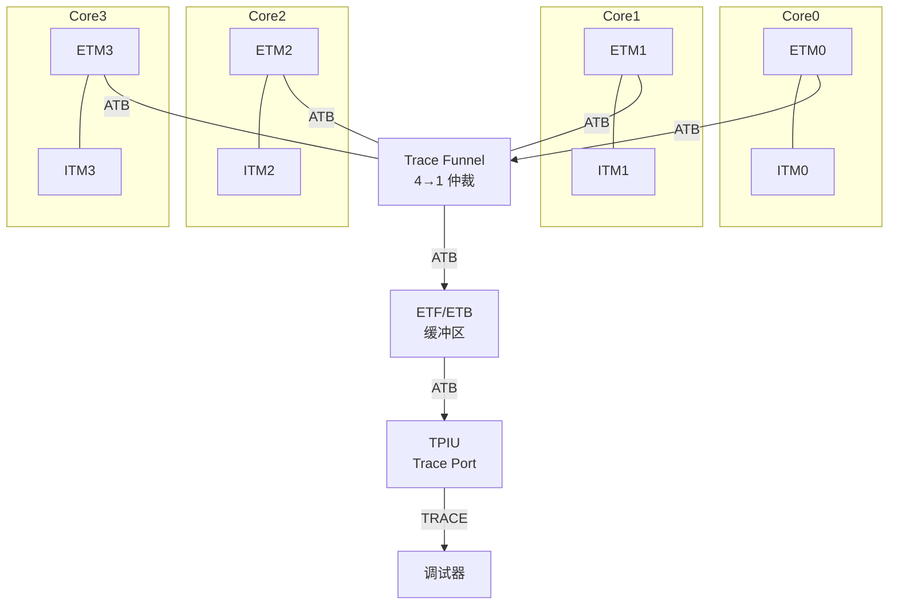

# CoreSight 嵌入式实战 [E]

> **本章学习目标**：
> - 理解 <span class="red">多核跟踪</span>的拓扑结构与 Trace Funnel 仲裁机制
> - 掌握 CoreSight 组件（CTI/ETB/TPIU）的互联关系与寄存器配置
> - 了解调试器选择（J-Link vs ULINK vs DSTREAM）的功能差异

---


---

## 需求分析：为什么需要 CoreSight 嵌入式实战

---

### <strong>为什么 CoreSight 嵌入式实战 成为行业刚需</strong>

<span class="red">CoreSight 嵌入式实战</span>是将片上调试资源转化为可度量、可复现调试能力的关键环节。为何购买高端开发板后仍无法获取跟踪数据？因为 CoreSight 组件的启用涉及调试器固件、IDE 配置、目标芯片熔丝位与跟踪端口引脚复用等多个前置条件。
<br>

<span class="blue">实战的必要性：仅了解 ETM/ITM 的理论结构不足以在板级调试中使用；必须掌握 OpenOCD 脚本配置、SWO 波特率计算、TPIU 端口引脚复用解除等工程细节，才能打通从芯片到 PC 的完整跟踪链路。</span>
<br>

## 多核跟踪

---

### <strong>多核 Trace 拓扑</strong>

<span class="badge-e">E</span><br>
<span class="red">多核跟踪</span> 要求将多个核心的 ETM/ITM 数据流汇聚至单一 Trace 端口输出，通过 Trace Funnel 实现仲裁与合并。
<br>



<span class="blue">Trace Funnel 如同"多车道收费站"——四条 ETM 数据流像四条车道涌来，Funnel 负责按优先级或轮询方式放行，最终汇入一条出口（TPIU）。</span><br>

**表 4-1：多核 Trace 组件**

| 组件 | 功能 | 位置 | 连接关系 |
| --- | --- | --- | --- |
| ETMx | 每核指令跟踪 | 核心内部 | 输出 ATB 至 Funnel |
| ITMx | 每核软件跟踪 | 核心内部 | 输出 ATB 至 Funnel |
| CTIx | 交叉触发 | 每核一个 | 连接 DAP 与核心 |
| Funnel | 数据流仲裁 | SoC 全局 | 4~8 个 ATB Slave |
| ETF | 嵌入式 Trace FIFO | SoC 全局 | ATB 缓冲 |
| ETB | 嵌入式 Trace Buffer | SoC 全局 | SRAM 缓冲 |
| TPIU | 物理端口输出 | SoC 全局 | 并行/串行 Trace |

<span class="orange"><strong>1. Trace Funnel 仲裁</strong></span><br>
* 固定优先级：Slave Port 0 优先级最高，依次递减。
* 轮询（Round Robin）：各端口轮流获得发送权。
* 可配置权重：通过 FUNNEL_CTRL 寄存器设置各端口带宽占比。

<span class="orange"><strong>2. Funnel 配置代码</strong></span><br>

```c
// CoreSight Trace Funnel 配置
// 文件：cs_funnel_config.c

#define FUNNEL_BASE     0xE0043000
#define FUNNEL_CTRL     (FUNNEL_BASE + 0x000)
#define FUNNEL_PRI      (FUNNEL_BASE + 0x004)

void Funnel_Config(void) {
    // 使能所有 Slave Port
    *(volatile uint32_t *)FUNNEL_CTRL = 0x000003FF;  // Port 0~9 使能
    
    // 设置轮询优先级：Port0 > Port1 > Port2 > Port3
    *(volatile uint32_t *)FUNNEL_PRI = 0x00000000;   // 固定优先级模式
    
    // 或配置为轮询模式
    // *(volatile uint32_t *)FUNNEL_PRI = 0x80000000;
}
```

---

## CoreSight 组件互联

---

### <strong>ATB 总线与组件寄存器</strong>

<span class="badge-e">E</span><br>
<span class="red">CoreSight 组件</span> 通过 ATB（Advanced Trace Bus）互联，每个组件有标准的 4KB 寄存器空间。
<br>

**表 4-2：CoreSight 组件寄存器基址**

| 组件 | 典型基址 | 发现方式 |
| --- | --- | --- |
| ROM Table | 0xE00FF000 | 固定，DAP 访问入口 |
| DAP | 0xE00FD000 | ROM Table 条目 0 |
| CTI0 | 0xE0042000 | ROM Table 扫描 |
| CTI1 | 0xE0043000 | ROM Table 扫描 |
| Funnel | 0xE0043000 | ROM Table 扫描 |
| ETF | 0xE0044000 | ROM Table 扫描 |
| TPIU | 0xE0045000 | ROM Table 扫描 |

<span class="orange"><strong>3. ROM Table 扫描代码</strong></span><br>

```c
// CoreSight ROM Table 扫描
// 文件：cs_romtable_scan.c

#define ROMTABLE_BASE   0xE00FF000
#define ROMENTRY0       (ROMTABLE_BASE + 0x000)
#define ROMENTRYn(n)    (ROMTABLE_BASE + 0x000 + 4*(n))

void Scan_ROM_Table(void) {
    int i = 0;
    while (1) {
        uint32_t entry = *(volatile uint32_t *)ROMENTRYn(i);
        
        // bit0 = 0 表示条目有效
        if ((entry & 0x1) == 0) {
            uint32_t addr = ROMTABLE_BASE + (entry & 0xFFFFF000);
            uint32_t id = *(volatile uint32_t *)(addr + 0xFF8);  // PIDR2
            
            printf("ROM Entry %d: Addr=0x%08X, Class=%02X\n",
                   i, addr, (id >> 4) & 0xF);
        }
        
        // bit1 = 1 表示最后一个条目
        if (entry & 0x2) break;
        i++;
    }
}
```

<span class="orange"><strong>4. CTI 交叉触发配置</strong></span><br>
* CTI 连接调试事件（断点、观察点）与外部信号（IRQ、GPIO）。
* 可实现"Core0 断点触发 Core1 停止"的跨核同步调试。

```c
// CTI 交叉触发：Core0 断点 → Core1 停止
// 文件：cs_cti_config.c

#define CTI0_BASE       0xE0042000
#define CTI1_BASE       0xE0043000
#define CTI_INEN0       0x020
#define CTI_OUTEN0      0x0A0
#define CTI_APPPULSE    0x01C

void CTI_Cross_Trigger_Config(void) {
    // Core0 CTI：断点事件映射到 Channel 0
    *(volatile uint32_t *)(CTI0_BASE + CTI_INEN0) = 0x1;  // Trigger 0 → Channel 0
    
    // Core0 CTI：Channel 0 输出到 Trigger 0
    *(volatile uint32_t *)(CTI0_BASE + CTI_OUTEN0) = 0x1;
    
    // Core1 CTI：Channel 0 输入映射到停止核心
    *(volatile uint32_t *)(CTI1_BASE + CTI_INEN0) = 0x1;
}
```

---

## 调试器选择

---

### <strong>主流调试器功能对比</strong>

<span class="badge-e">E</span><br>
<span class="red">调试器选择</span> 需综合考虑 Trace 带宽、多核支持、价格与软件生态。
<br>

**表 4-3：调试器功能对比**

| 调试器 | 厂商 | Trace 带宽 | 多核 | SWO | ETM | 价格区间 | 适用场景 |
| --- | --- | --- | --- | --- | --- | --- | --- |
| J-Link Ultra+ | SEGGER | ~100 MB/s | 是 | 是 | 4-bit | $1K~2K | 开发/量产 |
| ULINKpro | Keil/ARM | ~150 MB/s | 是 | 是 | 4-bit | $2K~3K | Keil MDK |
| DSTREAM | ARM | ~800 MB/s | 是 | 是 | 16-bit | $5K+ | DS-5/高端 |
| TRACE32 | Lauterbach | ~1 GB/s | 是 | 是 | 32-bit | $10K+ | 汽车/航空 |
| ST-Link V3 | ST | ~50 MB/s | 否 | 是 | 无 | $50 | 入门/教育 |

<span class="orange"><strong>5. 选择决策矩阵</strong></span><br>
* 仅需 JTAG/SWD + 串口打印：ST-Link / CMSIS-DAP（$50 以下）。
* 需要 4-bit ETM + 多核：J-Link Ultra+ / ULINKpro（$1K~3K）。
* 需要 16-bit+ 高速 Trace + 复杂触发：DSTREAM / TRACE32（$5K+）。

<span class="blue">调试器如同"相机"——入门手机（ST-Link）能拍照但细节有限，单反（J-Link）画质好功能全，专业电影机（TRACE32）拍大片但价格昂贵。</span><br>

---

## 本章小结

| 小节 | 核心要点 |
| --- | --- |
| 多核跟踪 | Trace Funnel 4→1 仲裁，ETFx 缓冲，TPIU 物理输出，ATB 总线互联 |
| CoreSight 组件互联 | ROM Table 扫描发现组件，CTI 交叉触发跨核同步，标准 4KB 寄存器空间 |
| 调试器选择 | J-Link 性价比最优，DSTREAM 高端，TRACE32 专业级，ST-Link 入门 |

---

## 练习

1. **拓扑设计**：设计一个 4 核 Cortex-A53 的 CoreSight Trace 拓扑，要求每核 ETM 独立输出，通过 Funnel 汇聚至 8-bit TPIU。画出组件连接图并标注 ATB 流向。

2. **CTI 配置**：编写 CTI 配置代码，实现：Core0 的硬件断点触发时，同时停止 Core1 和 Core2，但 Core3 继续运行。

3. **选型决策**：某项目预算 5000 元，需调试双核 Cortex-M7 + 4-bit ETM Trace + RTT。对比 J-Link Ultra+、ULINKpro 和 DSTREAM，给出最优选型及理由。


---

## 历史演进与发展趋势

<span class="red">CoreSight 嵌入式实战</span>的技术体系伴随 ARM 调试接口的演进逐步成型。2000 年代早期，开发者依赖厂商专用调试器（如 ARM Multi-ICE），硬件昂贵且兼容性差。2005 年 OpenOCD 项目诞生后，FT2232、J-Link 等低成本适配器可通过 GDB 远程协议连接 ARM 处理器。2010 年代，CMSIS-DAP 标准统一了调试器固件，使 ST-Link、NXP LPC-Link 等板载调试器可直接用于跨厂商开发。近年来，JTAG 实战已从单纯的断点调试扩展至 RTOS 线程 awareness、Trace 数据捕获与自动化 CI 测试，成为嵌入式 DevOps 的关键环节。
<br>

<span class="blue">未来趋势：开源调试工具链（OpenOCD、pyOCD）对 CoreSight 的支持将持续增强；云端远程调试与 CI/CD 流水线中的自动化跟踪分析也在成为新的实践方向。</span>
<br>