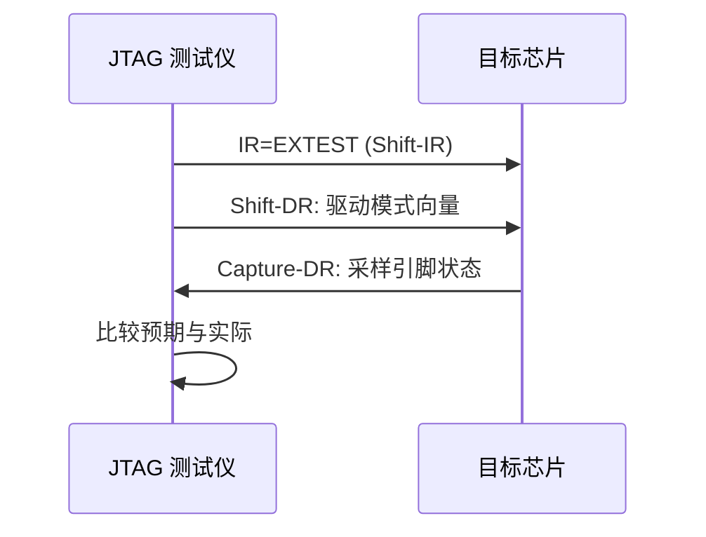
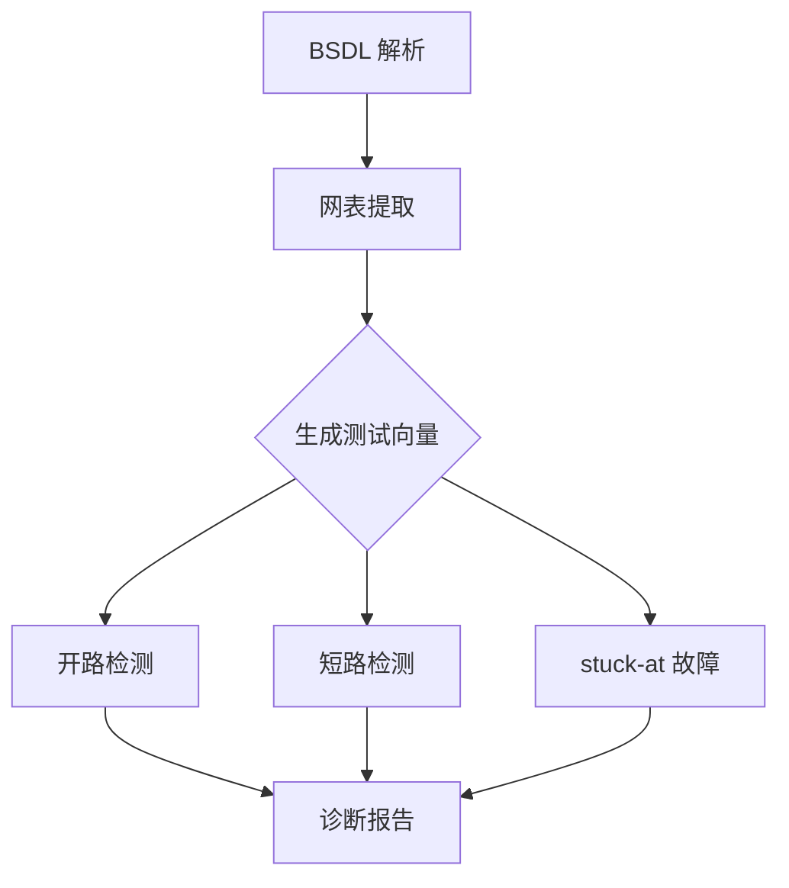

# JTAG 边界扫描实战 [I]

> **本章学习目标**：
> - 理解 <span class="red">BSDL 文件</span> 的结构与边界扫描单元描述语法
> - 掌握 EXTEST/SAMPLE 指令的测试流程与寄存器操作
> - 了解边界扫描测试的故障覆盖范围与局限性

---


---

## 需求分析：为什么需要 JTAG 边界扫描

---

### <strong>为什么 JTAG 边界扫描 成为行业刚需</strong>

<span class="red">JTAG 边界扫描实战</span>回应了复杂 PCB 的可测试性需求。为何传统 ICT（In-Circuit Test）在 BGA 与细间距封装面前失效？因为探针无法接触封装底部的焊球引脚，内层走线更是完全不可达。
<br>

<span class="blue">为何需要边界扫描：通过在芯片内部嵌入边界扫描寄存器，JTAG 可在无需物理探针的情况下读取/控制每个引脚状态，实现 BGA 焊球开路、短路、虚焊的自动化检测，大幅降低量产测试成本与返修周期。</span>
<br>

## BSDL 文件

---

### <strong>BSDL 语法结构</strong>

<span class="badge-i">I</span><br>
<span class="red">BSDL（Boundary-Scan Description Language）</span> 是 IEEE 1149.1 标准定义的 VHDL 子集，用于描述芯片的边界扫描特性。<br>

<span class="blue">BSDL 如同芯片的"体检报告"——详细列出每个引脚的边界扫描单元类型、方向与关联寄存器位置，让测试设备知道"从哪里进针"。</span><br>

```
-- BSDL 片段示例
-- 器件：Xilinx XC7Z020
entity xc7z020 is
    generic (PHYSICAL_PIN_MAP : string := "CSG484");
    port (
        TCK    : in bit;
        TMS    : in bit;
        TDI    : in bit;
        TDO    : out bit;
        MIO0   : inout bit;
        MIO1   : inout bit;
        ...
    );
    use STD_1149_1_2001.all;
    attribute COMPONENT_CONFORMANCE of xc7z020 : entity is "STD_1149_1_2001";
    attribute PIN_MAP of xc7z020 : entity is PHYSICAL_PIN_MAP;
    
    -- 引脚映射
    constant CSG484 : PIN_MAP_STRING := 
        "MIO0 : AC18, " &
        "MIO1 : AA17, " &
        ...
    
    -- 边界扫描寄存器描述
    attribute BOUNDARY_LENGTH of xc7z020 : entity is 3400;
    attribute BOUNDARY_REGISTER of xc7z020 : entity is
        "0   (BC_1, MIO0, input, X)," &
        "1   (BC_1, MIO0, output2, X)," &
        "2   (BC_1, MIO1, input, X)," &
        ...
end xc7z020;
```

**表 2-1：BSDL 关键属性**

| 属性 | 说明 | 示例 |
| --- | --- | --- |
| BOUNDARY_LENGTH | 边界扫描寄存器总长度 | 3400 |
| BOUNDARY_REGISTER | 每个单元的位置、类型、引脚、方向 | (BC_1, MIO0, input, X) |
| INSTRUCTION_OPCODE | 指令编码 | EXTEST=0000, SAMPLE=0001 |
| IDCODE_REGISTER | 器件 ID 码 | 0x4BA00477 |
| USERCODE_REGISTER | 用户可编程码 | 32-bit |

<span class="orange"><strong>1. 边界扫描单元类型</strong></span><br>
* BC_1：基本单元，支持输入/输出/双向。<br>
* BC_2：增强单元，支持内部逻辑观测。<br>
* BC_3：仅观测单元，无输出控制。<br>
* BC_4：差分对专用单元。<br>

<span class="orange"><strong>2. 单元方向定义</strong></span><br>
* input：纯输入引脚，仅含输入扫描单元。<br>
* output2：推挽输出，含输出控制+数据单元。<br>
* output3：三态输出，含输出使能+数据单元。<br>
* bidir：双向引脚，含输入+输出+使能三个单元。<br>

---

## EXTEST/SAMPLE 指令

---

### <strong>EXTEST 外部测试</strong>

<span class="badge-i">I</span><br>
<span class="red">EXTEST（External Test）</span> 是边界扫描最核心的指令，用于测试芯片引脚与 PCB 互连。<br>



**表 2-2：EXTEST 测试流程**

| TAP 状态 | 操作 | 数据流 |
| --- | --- | --- |
| Shift-IR | 加载 EXTEST 指令 | TDI → IR |
| Shift-DR | 写入驱动向量 | TDI → BSR (输出单元) |
| Capture-DR | 采样引脚状态 | BSR (输入单元) → TDO |
| Shift-DR | 读取采样结果 | BSR → TDO |

<span class="orange"><strong>3. SAMPLE 指令</strong></span><br>
* SAMPLE 在不影响正常功能的情况下，捕获引脚的实时状态。<br>
* 用于在线调试，观测芯片与外部世界的交互。<br>
* 操作流程：Shift-IR(SAMPLE) → Capture-DR → Shift-DR(读取)。<br>

---

## 边界扫描测试

---

### <strong>测试流程图</strong>

<span class="badge-i">I</span><br>
<span class="red">边界扫描测试</span> 遵循"互连开路/短路检测"→"功能簇测试"→"上电自检"的三阶段流程。<br>



**表 2-3：故障覆盖范围**

| 故障类型 | 可检测 | 说明 |
| --- | --- | --- |
| 开路（Open） | 是 | 引脚未连接 |
| 短路（Short） | 是 | 引脚间意外连接 |
| Stuck-at-0/1 | 是 | 引脚固定电平 |
| 翻转延迟 | 否 | 需功能测试 |
| 模拟参数 | 否 | 需专用测试 |
| 内部逻辑 | 否 | 需 BIST/ATPG |

<span class="blue">边界扫描如同"针床测试"的数字化替代——无需物理探针接触每个焊点，通过 JTAG 链串行扫描即可检测绝大部分互连故障。</span><br>

---

## 本章小结

| 小节 | 核心要点 |
| --- | --- |
| BSDL 文件 | VHDL 子集，BOUNDARY_REGISTER 描述单元位置/类型/方向，INSTRUCTION_OPCODE 定义指令码 |
| EXTEST/SAMPLE | EXTEST 驱动+采样检测互连，SAMPLE 在线观测不影响功能 |
| 边界扫描测试 | 开路/短路/stuck-at 三类故障，数字化针床替代，内部逻辑不覆盖 |

---

## 练习

1. **BSDL 解析**：某 BSDL 中 BOUNDARY_REGISTER 第 100 位为 `(BC_1, GPIO5, bidir, X)`。分析该引脚在 EXTEST 模式下需要几个扫描单元，各自功能是什么。

2. **EXTEST 向量**：设计一个 4 引脚互连网络的 EXTEST 测试向量，检测所有可能的开路与短路故障。给出最小测试向量数。

3. **故障诊断**：某边界扫描测试报告 PinA=0 但预期=1。列出 3 个可能的物理层原因及进一步定位方法。


---

## 历史演进与发展趋势

<span class="red">JTAG 边界扫描</span>技术起源于 1980 年代末的板级测试需求。1990 年 IEEE 1149.1 标准发布，定义了边界扫描寄存器（BSR）与 TAP 状态机的基本架构。2000 年代，JTAG 从单纯的板级互连测试扩展至芯片内部调试，成为 FPGA 配置、Flash 烧录与处理器调试的通用接口。Xilinx、Altera 等 FPGA 厂商将 JTAG 作为核心配置与调试通道；ARM 也将 JTAG 纳入嵌入式调试器接口选项。近年来，随着 BGA 封装与多层 PCB 的普及，边界扫描作为无需物理探针的测试方法，在量产测试与返修诊断中的价值愈发凸显。
<br>

<span class="blue">未来趋势：IEEE 1149.1 与 1149.7（cJTAG）标准将长期共存；边界扫描在 5G 基站、汽车电子等高复杂度板级系统中的测试覆盖率要求持续提升。</span>
<br>