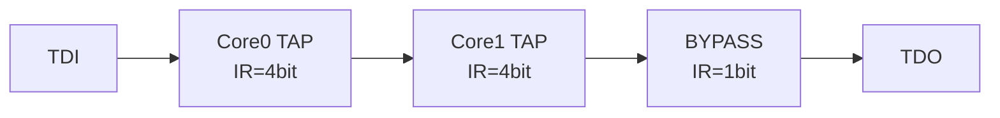

# JTAG 调试与 Flash 烧录 [I→E]

> **本章学习目标**：
> - 理解 <span class="red">OpenOCD</span> 的配置文件结构与接口定义
> - 掌握 NOR/NAND Flash 的烧录流程与命令序列
> - 了解多核调试的 JTAG 链配置与 core 切换方法

---


---

## 需求分析：为什么需要 JTAG 调试与 Flash 烧录

---

### <strong>为什么 JTAG 调试与 Flash 烧录 成为行业刚需</strong>

<span class="red">JTAG 调试与 Flash 烧录</span>是嵌入式开发中最基础也是最核心的工程能力。为何在芯片焊接至 PCB 后仍能通过 4~5 根线完成固件烧录与全功能调试？因为 JTAG TAP 控制器内建于芯片本身，不依赖外部存储器或 BootROM 状态。
<br>

<span class="blue">为何依赖 JTAG：在 BootROM 损坏、系统无法启动或需要单步调试 Bootloader 的场景中，JTAG 是唯一能从复位向量开始接管 CPU 的调试通道；同时，JTAG 也是量产阶段批量烧录 Flash 的标准工业接口。</span>
<br>

## OpenOCD 配置

---

### <strong>OpenOCD 架构与配置文件</strong>

<span class="badge-i">I</span><br>
<span class="red">OpenOCD（Open On-Chip Debugger）</span> 是开源的 JTAG/SWD 调试服务器，通过 Telnet/GDB 接口与上位机交互。
<br>

<span class="blue">OpenOCD 如同调试世界的"翻译官"——一边是人类的 GDB 命令，另一边是芯片的 JTAG 比特流，中间的 cfg 文件是"外交辞令手册"。</span><br>

**表 3-1：OpenOCD 配置文件层级**

| 文件类型 | 功能 | 示例 |
| --- | --- | --- |
| interface/xxx.cfg | 调试适配器配置 | interface/ftdi/olimex-arm-usb-ocd-h.cfg |
| target/xxx.cfg | 目标芯片配置 | target/stm32f4x.cfg |
| board/xxx.cfg | 板级配置（组合） | board/stm32f4discovery.cfg |
| flash/xxx.cfg | Flash 驱动 | flash/nor/stm32f2x.cfg |

<span class="orange"><strong>1. 接口配置文件</strong></span><br>
* 定义调试适配器的 USB VID/PID、JTAG 引脚映射、时钟频率。
* 常用适配器：J-Link、ST-Link、CMSIS-DAP、FT2232H。

---

### <strong>典型 cfg 文件示例</strong>

<span class="badge-e">E</span><br>

```tcl
# OpenOCD 配置文件示例
# 文件：openocd_stm32f4.cfg
# 适用：STM32F407 + ST-Link V2

# 1. 选择调试适配器
source [find interface/stlink.cfg]

# 2. 配置传输层
transport select hla_swd

# 3. 选择目标芯片
source [find target/stm32f4x.cfg]

# 4. 可选：配置工作区域（用于下载算法）
$_TARGETNAME configure -work-area-phys 0x20000000 -work-area-size 0x10000

# 5. 可选：Flash 烧录配置
flash bank $_FLASHNAME stm32f2x 0x08000000 0x100000 0 0 $_TARGETNAME
```

<span class="orange"><strong>2. 关键配置指令</strong></span><br>
* `adapter speed 4000`：设置 JTAG/SWD 时钟频率（kHz）。
* `transport select`：选择传输层（jtag/swd/hla_jtag/hla_swd）。
* `reset_config srst_only`：仅使用 SRST 复位。
* `gdb_port 3333`：设置 GDB 监听端口。

---

## Flash 烧录

---

### <strong>NOR Flash 烧录流程</strong>

<span class="badge-i">I</span><br>
<span class="red">Flash 烧录</span> 涉及擦除、编程、校验三个阶段，OpenOCD 提供内置命令与外部算法两种方式。
<br>

**表 3-2：OpenOCD Flash 命令**

| 命令 | 功能 | 示例 |
| --- | --- | --- |
| flash probe 0 | 探测 Flash 信息 | flash bank 0 的型号/大小 |
| flash erase_sector 0 0 15 | 擦除扇区 0~15 | 按扇区擦除 |
| flash write_image | 写入镜像文件 | flash write_image erase firmware.bin 0x08000000 |
| flash verify_image | 校验镜像 | 与文件比对 CRC |
| flash erase_check 0 | 检查擦除状态 | 确认全 0xFF |

<span class="orange"><strong>3. 完整烧录命令序列</strong></span><br>

```bash
# OpenOCD Flash 烧录命令序列
# 通过 Telnet (端口 4444) 或 GDB 发送

> reset init                    # 复位并初始化
> halt                          # 停止 CPU
> flash probe 0                 # 探测 Flash
> stm32f4x mass_erase 0         # 整片擦除
> flash write_image erase /path/to/firmware.bin 0x08000000
> flash verify_image /path/to/firmware.bin 0x08000000
> reset run                     # 复位运行
```

<span class="orange"><strong>4. NAND Flash 特殊处理</strong></span><br>
* NAND 需处理坏块管理（BBM），烧录时跳过标记坏块。
* OOB（Out Of Band）区用于 ECC 与坏块标记，需保留。
* 常用命令：`nand probe 0`、`nand erase 0 0x8000000`、`nand write_image file.bin 0`。

---

## 多核调试

---

### <strong>JTAG 链配置</strong>

<span class="badge-e">E</span><br>
<span class="red">多核调试</span> 通过 JTAG 链上的 TAP（Test Access Port）遍历实现 core 切换。
<br>



<span class="blue">多核 JTAG 链如同"串联灯泡"——电流（TDI）依次流过每个灯泡（TAP），哪个亮取决于前面开关（IR 值）的导通状态。</span><br>

**表 3-3：多核调试配置**

| 芯片 | 核心数 | TAP 链顺序 | OpenOCD 配置 |
| --- | --- | --- | --- |
| ARM Cortex-A9 | 2 | DAP → Core0 → Core1 | target/omap4430.cfg |
| ARM Cortex-A15 | 4 | DAP → Core0~3 | target/exynos5250.cfg |
| Xilinx Zynq | 2 | DAP → Core0 → Core1 | target/zynq_7000.cfg |

<span class="orange"><strong>5. Core 切换命令</strong></span><br>

```tcl
# OpenOCD 多核切换
# 文件：openocd_multicore.tcl

# 查看所有核心
targets

# 切换到 Core 0
targets zynq.cpu.0
halt

# 切换到 Core 1
targets zynq.cpu.1
halt
reg pc

# 并行恢复所有核心
targets zynq.cpu.0
resume
targets zynq.cpu.1
resume
```

<span class="orange"><strong>6. SMP 调试模式</strong></span><br>
* OpenOCD 支持 SMP（Symmetric Multi-Processing）模式，将多核视为一个整体。
* 命令：`target smp zynq.cpu.0 zynq.cpu.1`
* 断点自动同步至所有核心，resume 同时恢复所有核心。

---

## 本章小结

| 小节 | 核心要点 |
| --- | --- |
| OpenOCD 配置 | interface→target→board 三层 cfg，adapter speed/transport/select |
| Flash 烧录 | probe→erase→write_image→verify_image→reset，NAND 需处理坏块 |
| 多核调试 | TAP 链遍历，targets 切换，SMP 模式同步断点与恢复 |

---

## 练习

1. **配置编写**：为 STM32F103 + J-Link 编写一个完整的 OpenOCD cfg 文件，支持 SWD 接口，时钟 4 MHz，GDB 端口 3333。

2. **烧录脚本**：编写一个 OpenOCD 烧录脚本，将 u-boot.bin（256KB）烧录至 NOR Flash 起始地址，并自动校验。

3. **多核调试**：某 Zynq-7000 双核系统，Core0 运行 Linux，Core1 运行裸机 RTOS。设计 OpenOCD 调试方案，要求可独立 attach 任一核心并设置断点。


---

## 历史演进与发展趋势

<span class="red">JTAG 调试与 Flash 烧录</span>的技术演进伴随嵌入式系统存储介质的变化。1990 年代，JTAG 主要用于边界扫描测试，Flash 编程通过专用编程器完成。2000 年代初，Flash 存储器（NOR/NAND）在嵌入式系统中普及，JTAG 接口被扩展为在线烧录通道，无需拆卸芯片即可更新固件。OpenOCD 项目于 2005 年启动，将 JTAG 调试与 Flash 烧录统一于开源框架，支持数百种目标芯片。2010 年代，JTAG 进一步支持 QSPI Flash 与 eMMC 的烧录，成为从原型到量产的全生命周期调试接口。
<br>

<span class="blue">未来趋势：JTAG 烧录将更多与 DFU（Device Firmware Update）和 OTA 升级协同；在 BootROM 安全启动场景中，JTAG 烧录权限将受熔丝位严格管控。</span>
<br>