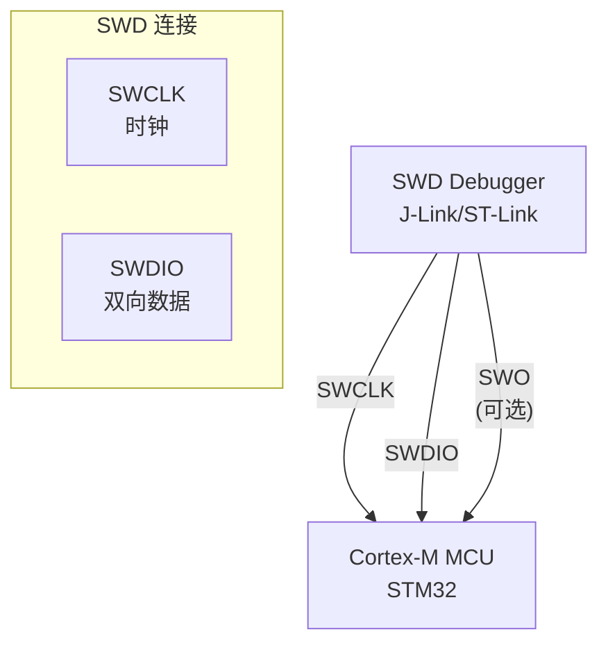
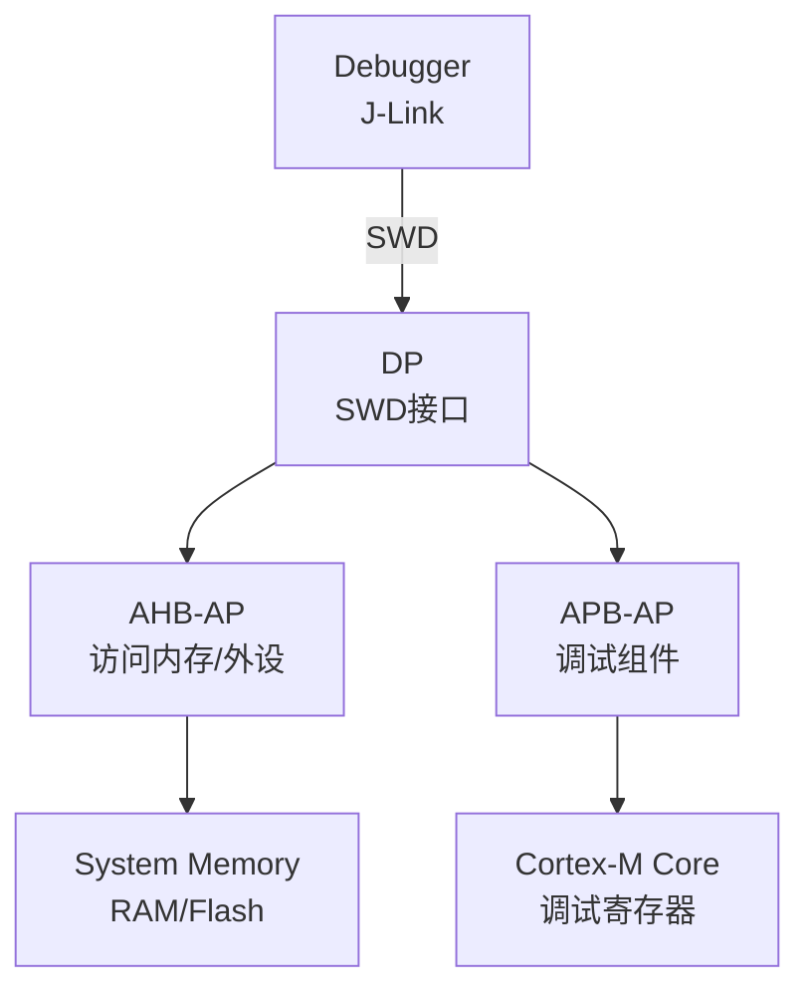

# SWD 基础认知与 2-pin 调试 [B→I]

[I] [M]

> **本章学习目标**：
> - 理解 SWD（Serial Wire Debug） 从 JTAG 简化的设计动机
> - 掌握 DAP（Debug Access Port） 的 DP/AP 架构
> - 了解 SWD 在 Cortex-M 调试中的典型连接

---

## SWD 的诞生：JTAG 的"瘦身版"

---

### <strong>为什么需要 SWD：引脚永远不够用</strong>

SWD由 ARM 在 2004 年随 Cortex-M3 一同推出。

JTAG 的 4~5 根线对 MCU 来说太奢侈：
 
* 引脚资源紧张：小型 MCU（如 STM32F030，20-pin）每根线都宝贵
 
* PCB 面积：调试接口占用的空间不容忽视
 
* 成本：每多一根线 = 连接器成本 + 走线成本 + 测试成本
 

SWD 用 2 根线（SWCLK + SWDIO）替代 JTAG 的 4~5 根线，同时保留完整的调试功能（单步、断点、内存读写、Flash 下载）。
 

类比：SWD 如同"手机的 Type-C 接口"——以前充电+耳机+数据需要 3 个接口，现在 1 个 Type-C 全搞定。SWD 把 JTAG 的 TCK+TMS+TDI+TDO 压缩到 2 根线。
 

---

### <strong>SWD 的物理层：2 线 + 可选 SWO</strong>

SWD使用 2~3 根线：

| 信号 | 方向 | 说明 |
| --- | --- | --- |
| SWCLK | 主机→目标 | 时钟（10~100MHz） |
| SWDIO | 双向 | 数据输入/输出（双向复用） |
| SWO | 目标→主机 | 可选，串行线输出（ITM 跟踪） |

SWDIO 的双向复用：每个时钟周期先传输请求包头（主机→目标），然后目标响应（目标→主机）。通过方向切换实现单线双向通信。
 

---

### <strong>DAP 架构：DP + AP 的分层设计</strong>

Debug Access Port分为两层：

| 层级 | 全称 | 功能 |
| --- | --- | --- |
| DP | Debug Port | 物理层接口，SWD/JTAG 协议解析 |
| AP | Access Port | 访问片上资源（AHB-AP、APB-AP） |

DP 负责物理层协议转换（SWD 帧解析），AP 负责实际资源访问。多核 SoC 可以有多个 AP（每个核一个），共享同一个 DP。
 

---

## 本章小结

| 概念 | 一句话总结 |
| --- | --- |
| SWD | ARM 2004 年，2 线调试接口，替代 JTAG |
| SWCLK | 时钟信号 |
| SWDIO | 双向数据 |
| SWO | 可选，串行线输出，ITM 跟踪 |
| DP | Debug Port，物理层协议解析 |
| AP | Access Port，访问片上资源 |
| AHB-AP | 通过 AHB 总线访问内存和外设 |

---

## 练习

1. SWD 的 SWDIO 如何实现双向通信？画出读写时序。
2. 为什么 SWD 比 JTAG 更适合 Cortex-M 调试？列出 SWD 的所有优势。
3. 在 STM32 上配置 SWD + SWO（ITM printf），写出相关的 GPIO 配置和 ITM 初始化代码。

---

## 历史演进与发展趋势

SWD（Serial Wire Debug）的发展历史始于 ARM 对低成本调试接口的需求。2004 年，ARM 在 Cortex-M3 中首次引入 SWD，用 2 根信号线（SWDIO + SWCLK）替代 JTAG 的 4~5 根线，同时保留完整的调试功能。2008 年后，SWD 与 JTAG 的映射机制（SWJ-DP）使调试器可在同一物理接口上动态切换协议。2010 年代，SWD 成为 Cortex-M 系列 MCU 的事实标准调试接口，几乎所有 ARM MCU（STM32、NRF52、LPC 等）均优先支持 SWD。近年来，SWD 的串行线查看器（SWV）与 SWO 单线输出功能进一步扩展了其在实时跟踪中的应用边界。
 

未来趋势：SWD 将继续作为资源受限 MCU 的首选调试接口；与 cJTAG（IEEE 1149.7）的融合也在探索中，以实现引脚数与调试能力的更优平衡。
 