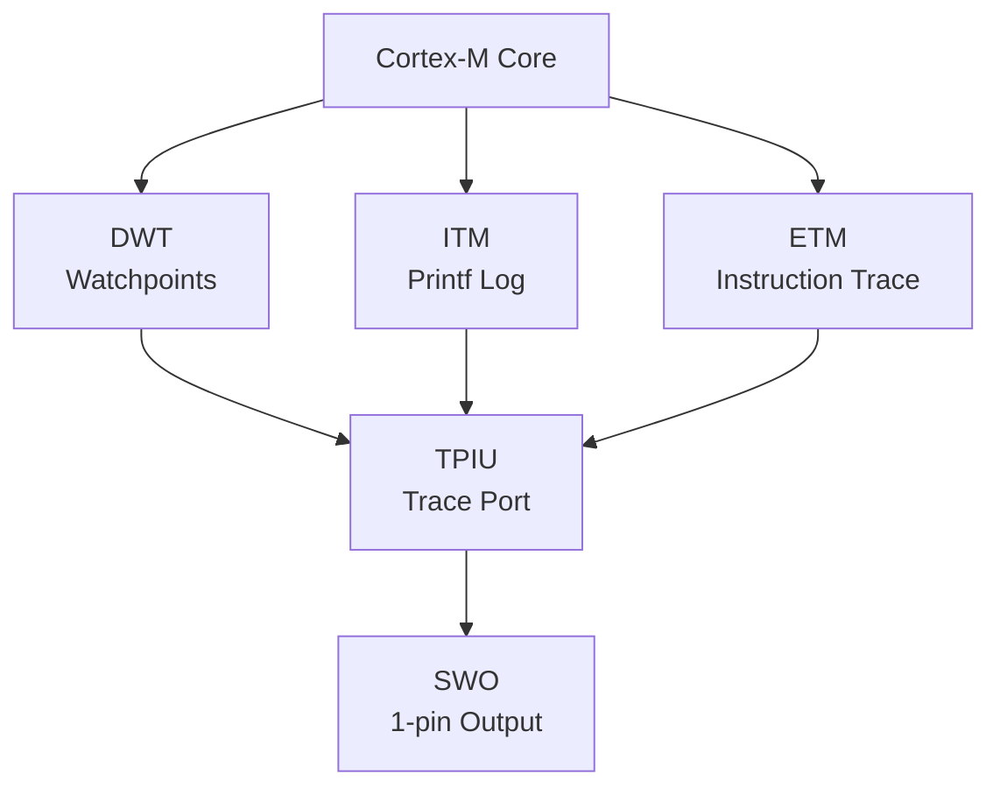

# Cortex-M 调试实战 [I→E]

> **本章学习目标**：
> - 理解 <span class="red">断点/观察点</span> 的硬件实现与数量限制
> - 掌握 ITM printf 的端口配置与数据输出方法
> - 了解 SEGGER RTT 实时传输的缓冲区设计与性能优势

---


---

## 需求分析：为什么需要 Cortex-M 调试

---

### <strong>为什么 Cortex-M 调试 成为行业刚需</strong>

<span class="red">Cortex-M 调试实战</span>回应了 MCU 软件开发中的可观测性需求。为何 printf 调试在时序敏感的外设驱动中不可靠？因为串口输出引入毫秒级延迟，会改变中断响应时序与 DMA 传输节奏。
<br>

<span class="blue">为何需要硬件调试：DWT 的数据观察点能在不中断程序的情况下捕获内存访问异常；ITM 的 SWO 输出延迟仅为微秒级，适合实时日志；ETM 的指令跟踪则能在全速运行中还原崩溃现场。只有综合运用 CoreSight 组件，才能建立 MCU 软件的可观测体系。</span>
<br>


### <strong>Cortex-M 调试组件架构</strong>



## 断点/观察点

---

### <strong>FPB 与 DWT 硬件单元</strong>

<span class="badge-i">I</span><br>
<span class="red">Cortex-M 断点与观察点</span> 由 FPB（Flash Patch and Breakpoint）和 DWT（Data Watchpoint and Trace）单元硬件实现。
<br>

<span class="blue">FPB 如同"公路检查站"——在特定地址（PC）设置岗哨，CPU 经过时自动停下。DWT 如同"仓库监控"——监测特定内存地址的读写，一旦有人动货立即报警。</span><br>

**表 3-1：Cortex-M 调试资源对比**

| 资源 | Cortex-M0/M0+ | Cortex-M3/M4 | Cortex-M7 | Cortex-M33 |
| --- | --- | --- | --- | --- |
| 硬件断点 | 0~4 | 6 | 8 | 8 |
| 观察点 | 0~2 | 4 | 4 | 4 |
| FPB 比较器 | 0~2 | 6 | 8 | 8 |
| DWT 比较器 | 0~2 | 4 | 4 | 4 |
| ITM 端口 | 无 | 32 | 32 | 32 |
| ETM | 无 | 有 | 有 | 有 |

<span class="orange"><strong>1. 断点配置代码</strong></span><br>

```c
// Cortex-M 硬件断点配置（通过 DAP）
// 文件：cortex_m_breakpoint.c

#define FPB_BASE        0xE0002000
#define FPB_CTRL        (FPB_BASE + 0x000)
#define FPB_REMAP       (FPB_BASE + 0x004)
#define FPB_COMP0       (FPB_BASE + 0x008)
#define FPB_COMPn(n)    (FPB_BASE + 0x008 + 4*(n))

void fpb_set_breakpoint(uint8_t comp_id, uint32_t addr) {
    // 启用 FPB
    *(volatile uint32_t *)FPB_CTRL = 0x3;  // ENABLE + KEY
    
    // 配置比较器：地址 + 使能
    // 最低 2 bit 必须为 0（4 字节对齐），bit 0=1 表示使能
    *(volatile uint32_t *)FPB_COMPn(comp_id) = (addr & ~0x3) | 0x1;
}

void fpb_disable_breakpoint(uint8_t comp_id) {
    *(volatile uint32_t *)FPB_COMPn(comp_id) = 0;
}
```

<span class="orange"><strong>2. 观察点配置</strong></span><br>
* DWT_COMPn：比较的内存地址。
* DWT_MASKn：比较掩码（屏蔽低位地址位）。
* DWT_FUNCTIONn：触发条件（读/写/读写）。

```c
// 数据观察点配置
#define DWT_BASE        0xE0001000
#define DWT_CTRL        (DWT_BASE + 0x000)
#define DWT_COMP0       (DWT_BASE + 0x020)
#define DWT_MASK0       (DWT_BASE + 0x024)
#define DWT_FUNCTION0   (DWT_BASE + 0x028)

void dwt_set_watchpoint(uint32_t addr, uint8_t size, uint8_t type) {
    // type: 1=读, 2=写, 3=读写
    *(volatile uint32_t *)DWT_COMP0 = addr;
    *(volatile uint32_t *)DWT_MASK0 = size;        // 0=1B, 1=2B, 2=4B...
    *(volatile uint32_t *)DWT_FUNCTION0 = 0x400 | type;  // DATAVSIZE=Word
}
```

---

## ITM printf

---

### <strong>ITM 端口配置与初始化</strong>

<span class="badge-e">E</span><br>
<span class="red">ITM（Instrumentation Trace Macrocell）</span> 是 Cortex-M3/M4/M7 的调试组件，通过 SWO 引脚输出 32 路软件跟踪数据。
<br>

**表 3-2：ITM 关键寄存器**

| 寄存器 | 地址 | 功能 |
| --- | --- | --- |
| ITM_TER0 | 0xE0000E00 | 端口 0~31 使能 |
| ITM_TPR | 0xE0000E40 | 端口权限 |
| ITM_TCR | 0xE0000E80 | 控制寄存器（全局使能） |
| ITM_PORTn | 0xE0000000 + 4*n | 端口 n 数据写入 |

<span class="orange"><strong>3. ITM 初始化代码</strong></span><br>

```c
// ITM printf 初始化与输出
// 文件：itm_printf.c

#include <core_cm4.h>  // CMSIS

void ITM_Init(void) {
    // 1. 启用 DWT/ITM 跟踪（DEMCR.TRCENA）
    CoreDebug->DEMCR |= CoreDebug_DEMCR_TRCENA_Msk;
    
    // 2. 配置 TPIU 用于 SWO
    // TPIU_SPPR = 0x2 (NRZ 编码)
    *((volatile uint32_t *)0xE00400F0) = 0x2;
    
    // 3. 配置 SWO 分频（CoreClock / SWO_Baud）
    // 假设 Core=168MHz, SWO=2MHz, 分频=84-1=83
    *((volatile uint32_t *)0xE0040010) = 83;
    
    // 4. 使能 ITM 全局
    ITM->TCR = ITM_TCR_ITMENA_Msk;
    
    // 5. 使能端口 0
    ITM->TER[0] = 0x1;
}

void ITM_SendChar(char ch) {
    if (ITM->TCR & ITM_TCR_ITMENA_Msk) {
        while (ITM->PORT[0].u32 == 0);  // 等待端口空闲
        ITM->PORT[0].u8 = ch;
    }
}

int _write(int file, char *ptr, int len) {
    for (int i = 0; i < len; i++)
        ITM_SendChar(ptr[i]);
    return len;
}
```

<span class="orange"><strong>4. OpenOCD ITM 捕获</strong></span><br>

```bash
# OpenOCD 配置 SWO 捕获
> tpiu config internal /tmp/swo.log uart off 168000000 2000000
> itm ports on
# 读取 ITM 输出
$ tail -f /tmp/swo.log
Hello from ITM printf!
```

---

## RTT 实时传输

---

### <strong>SEGGER RTT 缓冲区设计</strong>

<span class="badge-e">E</span><br>
<span class="red">RTT（Real-Time Transfer）</span> 是 SEGGER 的调试传输技术，通过在目标内存中维护环形缓冲区实现"零开销"日志输出。
<br>

**表 3-3：RTT 与 ITM/SWO 对比**

| 特性 | RTT | ITM/SWO |
| --- | --- | --- |
| 所需引脚 | JTAG/SWD 已有引脚 | 需 SWO 引脚 |
| 速率 | ~2 MB/s | ~1 MB/s |
| 目标支持 | 所有 Cortex-M | 仅 M3/M4/M7 |
| 缓冲区 | 目标 RAM 中 | ITM 内部 FIFO |
| 中断 | 非阻塞写 | 非阻塞写 |
| 调试器依赖 | J-Link/Ozone | 任何支持 SWO 的调试器 |

<span class="blue">RTT 如同"快递柜"——快递员（调试器）定期来取件，寄件人（CPU）把包裹扔进柜子即可继续干活，无需等待。</span><br>

<span class="orange"><strong>5. RTT 初始化代码</strong></span><br>

```c
// SEGGER RTT 使用示例
// 文件：rtt_log.c

#include "SEGGER_RTT.h"

void RTT_Init(void) {
    SEGGER_RTT_Init();
    
    // 配置上行缓冲区 0（终端输出）
    SEGGER_RTT_ConfigUpBuffer(0, "Terminal", &_up_buffer[0],
                              RTT_BUFFER_SIZE,
                              SEGGER_RTT_MODE_NO_BLOCK_SKIP);
}

void RTT_Printf(const char *fmt, ...) {
    va_list args;
    char buffer[128];
    
    va_start(args, fmt);
    vsnprintf(buffer, sizeof(buffer), fmt, args);
    va_end(args);
    
    SEGGER_RTT_WriteString(0, buffer);
}

// 使用
RTT_Printf("CPU Load: %d%%\n", cpu_load);
```

---

## 本章小结

| 小节 | 核心要点 |
| --- | --- |
| 断点/观察点 | FPB_COMP 地址+使能，DWT_COMP/MASK/FUNCTION 读写触发，M3/M4 有 6/4 个 |
| ITM printf | 32 端口，TER/TPR/TCR 配置，SWO 分频，OpenOCD tpiu config 捕获 |
| RTT 实时传输 | SEGGER 环形缓冲，目标 RAM 中，~2MB/s，非阻塞写，J-Link 专用 |

---

## 练习

1. **断点管理**：某 Cortex-M4 程序在 0x08001234 处设置硬件断点，随后在同一地址尝试设置第二个断点。分析会发生什么，并给出正确的多断点管理策略。

2. **ITM 配置**：Cortex-M4 内核时钟 168 MHz，目标 SWO 输出 1 Mbps。计算 TPIU 分频寄存器值，并写出完整的 ITM 初始化序列。

3. **RTT 集成**：将 SEGGER RTT 集成到一个现有嵌入式项目（使用 printf 输出日志）。描述替换步骤及 RTT 缓冲区大小对性能的影响。


---

## 历史演进与发展趋势

<span class="red">Cortex-M 调试实战</span>的方法论伴随 ARM MCU 生态的扩张而成熟。2004 年 Cortex-M3 发布后，开发者最初仅能通过 JTAG/SWD 进行基础断点调试。2008 年后，ITM/SWO 与 DWT 的引入使 printf 调试与性能计数成为可能。2010 年代，RTOS（FreeRTOS、RT-Thread）在 Cortex-M 上的普及催生了线程感知调试（Thread-Aware Debugging）需求，OpenOCD 与 GDB 随后支持 RTOS 线程列表显示。近年来，自动化测试框架（如 CMocka、Unity）与硬件在环（HIL）测试的结合，使 Cortex-M 调试从人工单步执行向持续集成流水线演进。
<br>

<span class="blue">未来趋势：Cortex-M 调试将与安全扩展（TrustZone）深度结合；片上调试组件的功耗优化也在使调试能力常驻运行，支撑现场远程诊断。</span>
<br>