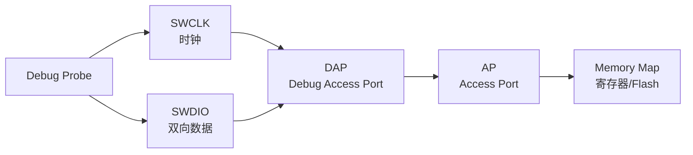

# SWD 嵌入式实战 [I]

> **本章学习目标**：
> - 掌握 STM32 的 <span class="red">SWD 调试配置</span>与引脚映射
> - 理解低功耗模式下的调试保持与唤醒策略
> - 了解安全调试（TrustZone/RDP）的等级与解锁方法

---


---

## 需求分析：为什么需要 SWD 嵌入式实战

---

### <strong>为什么 SWD 嵌入式实战 成为行业刚需</strong>

<span class="red">SWD 嵌入式实战</span>是将 2-pin 调试接口转化为完整调试能力的关键环节。为何仅有 SWDIO 与 SWCLK 两根线却能实现与 JTAG 等效的功能？因为 SWD 采用请求-应答协议，通过 DAP（Debug Access Port）抽象层将复杂的调试寄存器访问序列封装为高效的串行帧。
<br>

<span class="blue">实战的必要性：SWD 的 2 线优势在引脚极度受限的封装（如 WLCSP、QFN-20）中尤为突出；同时，SWO 单线跟踪功能只能在 SWD 模式下启用，是 Cortex-M 实时日志输出的唯一硬件通道。掌握 SWD 实战意味着在资源与功能之间取得最优平衡。</span>
<br>


### <strong>SWD 2-pin 架构</strong>



## STM32 调试配置

---

### <strong>SWD 引脚映射与复用</strong>

<span class="badge-i">I</span><br>
<span class="red">STM32</span> 的 SWD 接口固定映射到特定 GPIO，通常为 PA13（SWDIO）和 PA14（SWCLK），部分系列支持 SWO（PB3）。
<br>

**表 4-1：STM32 SWD 引脚定义**

| 引脚 | 信号 | 复用功能 | 说明 |
| --- | --- | --- | --- |
| PA13 | SWDIO | JTMS/SWDIO | 双向数据线 |
| PA14 | SWCLK | JTCK/SWCLK | 时钟输入 |
| PA15 | JTAG_TDI | JTDI | JTAG 模式专用 |
| PB3 | SWO/JTDO | JTDO/SWO | 跟踪输出 |
| PB4 | JTAG_TRST | NJTRST | JTAG 复位 |

<span class="blue">SWD 引脚如同"万能钥匙孔"——平时可以做 GPIO（普通门把手），调试时切换为 SWD（专用钥匙孔），但一旦被焊死（熔丝锁定），钥匙就插不进去了。</span><br>

<span class="orange"><strong>1. 调试配置代码</strong></span><br>

```c
// STM32 SWD 引脚配置（确保调试引脚不被复用）
// 文件：stm32_swd_config.c

void SWD_Pin_Config(void) {
    // 使能 GPIOA 时钟
    RCC->AHB1ENR |= RCC_AHB1ENR_GPIOAEN;
    
    // PA13 (SWDIO) 与 PA14 (SWCLK) 保持默认 AF0 (SYS_AF)
    // 无需额外配置，上电即为调试功能
    
    // 若其他代码将 PA13/PA14 配置为 GPIO，需恢复：
    GPIOA->MODER &= ~(GPIO_MODER_MODER13 | GPIO_MODER_MODER14);
    // MODER=10 = Alternate Function
    GPIOA->MODER |= (GPIO_MODER_MODER13_1 | GPIO_MODER_MODER14_1);
    
    // 选择 AF0 (SYS_AF)
    GPIOA->AFR[1] &= ~(GPIO_AFRH_AFRH5 | GPIO_AFRH_AFRH6);
}
```

---

## 低功耗调试

---

### <strong>调试保持与唤醒</strong>

<span class="badge-i">I</span><br>
<span class="red">低功耗调试</span> 需在 Sleep/Stop/Standby 模式下保持调试连接，并在唤醒后继续追踪。<br>

**表 4-2：STM32 低功耗模式与调试**

| 模式 | 内核状态 | 调试保持 | 唤醒后调试 |
| --- | --- | --- | --- |
| Sleep | WFI/WFE | 自动保持 | 立即恢复 |
| Stop | 时钟门控 | DBGMCU_CR 配置 | 需重新初始化时钟 |
| Standby | 内核断电 | 不支持 | 复位后重新连接 |

<span class="orange"><strong>2. Stop 模式调试配置</strong></span><br>

```c
// STM32 Stop 模式下的调试保持
// 文件：lowpower_debug.c

#include <stm32f4xx_hal.h>

void Enter_Stop_With_Debug(void) {
    // 1. 使能调试在 Stop 模式保持
    DBGMCU->CR |= DBGMCU_CR_DBG_STOP;
    
    // 2. 配置唤醒源（如 EXTI 按键）
    HAL_PWR_EnableWakeUpPin(PWR_WAKEUP_PIN1);
    
    // 3. 进入 Stop 模式
    HAL_PWR_EnterSTOPMode(PWR_LOWPOWERREGULATOR_ON, PWR_STOPENTRY_WFI);
    
    // 4. 唤醒后：重新配置系统时钟
    SystemClock_Config();
    
    // 5. 调试连接自动恢复（若 DBG_STOP 已使能）
}
```

<span class="orange"><strong>3. 调试器配置</strong></span><br>
* 使用 `monitor sleep` 命令让 OpenOCD 在目标睡眠时保持连接。
* 配置 `poll_period` 为较长间隔（如 1000 ms），减少空闲时功耗。

---

## 安全调试

---

### <strong>读保护等级与解锁</strong>

<span class="badge-i">I</span><br>
<span class="red">STM32 安全调试</span> 通过 RDP（Readout Protection）等级控制 Flash 读取与调试接口访问权限。
<br>

**表 4-3：RDP 等级定义**

| 等级 | 说明 | 调试接口 | Flash 读取 | 降级 |
| --- | --- | --- | --- | --- |
| Level 0 | 无保护 | 完全开放 | 允许 | — |
| Level 1 | 基本保护 | 有限制 | 禁止外部读取 | 可降级到 0 |
| Level 2 | 永久保护 | 完全禁用 | 禁止 | 不可降级 |

<span class="orange"><strong>4. RDP 配置与解锁</strong></span><br>

```bash
# OpenOCD 读取/修改 RDP
# 读取当前 RDP 等级
> stm32f4x options_read 0

# Level 1 → Level 0（解锁）
# 注意：会擦除整个 Flash！
> stm32f4x unlock 0

# Level 0 → Level 1（上锁）
> flash protect 0 0 11 off
> stm32f4x options_write 0 0xFFFAAEC1
```

<span class="blue">RDP 如同保险箱的密码锁——Level 0 是"开着门"，Level 1 是"关着门但知道密码能打开"，Level 2 是"焊死门，谁也进不去"。</span><br>

<span class="orange"><strong>5. TrustZone 调试（Cortex-M33）</strong></span><br>
* DAUTHCTRL 寄存器控制 Secure/Non-secure 世界的调试权限。
* 需设置 SDEN（Secure Debug Enable）与 SPIDEN（Secure Privileged Debug Enable）。
* 安全调试仅在设备出厂调试阶段启用，量产后关闭。

---

## 本章小结

| 小节 | 核心要点 |
| --- | --- |
| STM32 调试配置 | PA13/PA14 默认 SWD，AF0 复用，避免被 GPIO 配置覆盖 |
| 低功耗调试 | Sleep 自动保持，Stop 需 DBGMCU_CR，Standby 不支持 |
| 安全调试 | RDP 三级保护，Level1 可解锁（擦 Flash），Level2 永久 |

---

## 练习

1. **引脚冲突**：某 STM32F4 项目将 PA13 配置为 GPIO_Output 驱动 LED，导致 SWD 无法连接。给出 2 种恢复调试连接的方法。

2. **低功耗设计**：某传感器节点需进入 Stop 模式，但调试时频繁断开。设计调试友好的 Stop 模式进入/退出流程（含时钟恢复）。

3. **安全分析**：某产品量产时误设为 RDP Level 2，现需现场升级固件。分析可行的升级路径（如有），并给出避免此类问题的生产流程建议。


---

## 历史演进与发展趋势

<span class="red">SWD 嵌入式实战</span>的技术积累始于 2010 年代低成本 Cortex-M 开发板的普及。早期开发者依赖 Keil ULINK 等昂贵调试器；2012 年后，ST-Link/V2 的板载集成与开源固件（如 Black Magic Probe）使 SWD 调试成本降至 10 美元以下。2015 年，CMSIS-DAP 标准统一了调试器固件接口，使任何具备 USB 功能的 MCU 均可自制 SWD 调试器。近年来，Raspberry Pi Pico 等开发板甚至可用作 SWD 调试器（picoprobe），进一步降低了实战门槛。SWD 实战工具的发展历史体现了嵌入式开发民主化的趋势。SWD 实战已从专业工程师技能转变为嵌入式爱好者的入门必修课。
<br>

<span class="blue">未来趋势：SWD 实战工具将更加多样化；基于浏览器的 WebUSB 调试器与云端 GDB 服务器也在探索中，有望实现零安装的浏览器内调试体验。</span>
<br>