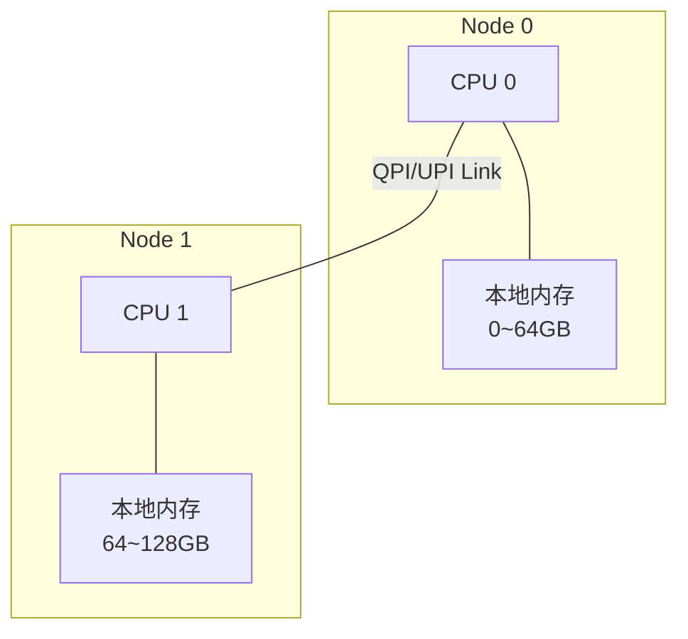
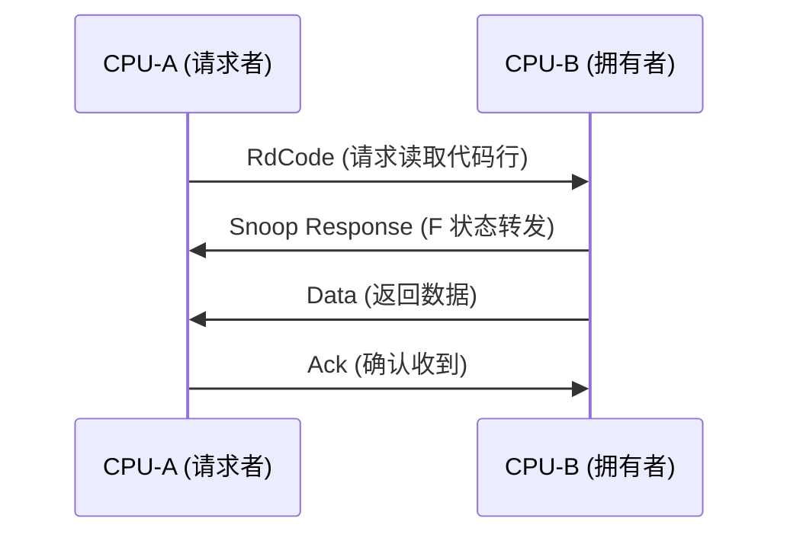

# NUMA 内存访问 [E]

> **本章学习目标**：
> - 理解本地内存与远程内存的拓扑差异与访问延迟
> - 掌握 QPI/UPI 缓存一致性协议的工作原理
> - 了解 Snoop 机制在跨节点数据共享中的作用

---

---

### <strong>QPI/OPI的技术背景与需求动机</strong>

为什么Intel必须放弃FSB而引入QPI？在多核时代，多个CPU核心和内存控制器共享FSB总线，带宽被迅速耗尽且延迟居高不下。QPI以点对点全双工互联取代共享总线，每个CPU拥有独立内存通道，CPU之间通过QPI直接通信，消除了FSB的瓶颈。
 

---

## 本地内存 vs 远程内存

---

### <strong>NUMA 拓扑结构</strong>

E 
NUMA（Non-Uniform Memory Access）架构中，每个 CPU 拥有直连的本地内存节点，跨节点访问需通过互联总线。 

NUMA 的本质是用拓扑距离换取扩展性——每个节点内部保持高速访问，节点之间接受延迟惩罚。 

---

### <strong>延迟差异与量化</strong>

E 
内存访问延迟在本地与远程之间存在数量级差异，直接影响应用性能。 

**表 3-1：本地 vs 远程内存延迟对比**

| 访问类型 | 典型延迟 | 相对倍数 | 瓶颈环节 |
| --- | --- | --- | --- |
| L1 Cache Hit | 1~2 ns | 1× | 片上 SRAM |
| L2 Cache Hit | 3~5 ns | 2× | 片上 SRAM |
| L3 Cache Hit | 10~20 ns | 8× | 共享 LLC |
| 本地内存访问 | 60~80 ns | 40× | 内存控制器+DRAM |
| 跨节点内存访问 | 120~150 ns | 80× | QPI/UPI 传输+远端控制器 |
| 跨 2 跳内存访问 | 200~250 ns | 130× | 多跳路由+中间节点转发 |

<strong>1. 本地访问路径</strong> 
* CPU → 本地内存控制器 → DDR 通道 → DRAM 芯片。 
* 无需跨 QPI/UPI 总线，延迟最低。 

<strong>2. 远程访问路径</strong> 
* CPU-A → 本地内存控制器 → 发现未命中 → 发送 Snoop 请求 → QPI/UPI → CPU-B 内存控制器 → DRAM → 数据返回。 
* 涉及两次缓存一致性协议交互，延迟翻倍。 

类比：本地内存如同家中书架，伸手即取；远程内存如同图书馆藏书，需发邮件请求并等待寄送。 

---

## QPI 缓存一致性

---

### <strong>MESIF 协议</strong>

E 
MESIF是 Intel 为 QPI 设计的缓存一致性协议，在经典的 MESI 基础上增加了 Forward（F）状态。 

**表 3-2：MESIF 状态定义**

| 状态 | 名称 | 可读 | 可写 | 含义 |
| --- | --- | --- | --- | --- |
| M | Modified | 是 | 是 | 独占且脏，需写回内存 |
| E | Exclusive | 是 | 是 | 独占且干净 |
| S | Shared | 是 | 否 | 多副本共享 |
| I | Invalid | 否 | 否 | 无效 |
| F | Forward | 是 | 否 | 共享副本中的代表，负责响应请求 |

F 状态的引入解决了多副本时"谁来响应"的问题，避免所有 S 状态节点同时响应造成总线风暴。 

---

### <strong>跨节点一致性消息</strong>

E 
QPI 缓存一致性通过四类消息实现：请求、监听、响应、写回。 

<strong>1. 请求阶段（Request Phase）</strong> 
* 请求者通过 QPI 发送请求消息，携带目标物理地址与请求类型（读/写/升级）。 
* 请求类型编码：RdCode（指令读取）、RdData（数据读取）、RdInvOwn（读取并失效他者）。 

<strong>2. 监听阶段（Snoop Phase）</strong> 
* 所有节点接收请求后，检查本地 L3/目录缓存是否包含该地址。 
* 若命中，返回 Snoop 响应，指示当前状态（M/E/S/F/I）。 

<strong>3. 响应阶段（Response Phase）</strong> 
* 拥有数据的节点（M/E/F 状态）通过 Data Response 返回数据。 
* 若数据不在任何缓存中，由目标内存节点从 DRAM 读取后返回。 

---

## Snoop 机制

---

### <strong>Snoop 过滤与优化</strong>

E 
Snoop 机制是缓存一致性的核心，但无差别的广播监听会严重消耗 QPI 带宽。 
Intel 引入了多种优化机制降低 Snoop 开销。 

<strong>1. 源监听过滤（Source Snoop Filter）</strong> 
* 每个节点维护一个目录缓存（Directory Cache），记录哪些地址被哪些远程节点缓存。 
* 请求只需发送给"可能拥有数据"的节点，而非广播至全网。 

<strong>2.  home 节点代理（Home Agent）</strong> 
* 内存地址按哈希或固定映射分配到某个 Home Agent。 
* 所有对该地址的请求首先发送至 Home Agent，由其决定数据所在位置。 

<strong>3. 监听响应聚合</strong> 
* 多个节点对同一请求的 Snoop 响应可在交换机中聚合，减少返回消息数。 
* 仅返回"有无数据"的二元结果，不返回完整缓存状态向量。 

---

### <strong>Snoop 对性能的影响</strong>

E 
Snoop 开销在高并发共享数据场景中可能成为瓶颈。 

**表 3-3：Snoop 开销量化**

| 场景 | Snoop 消息数 | QPI 占用 | 延迟影响 |
| --- | --- | --- | --- |
| 本地私有数据访问 | 0 | 0% | 无 |
| 两节点共享只读 | 2 | 5% | +20 ns |
| 四节点共享读写 | 6 | 15% | +80 ns |
| 全节点广播失效 | 8 | 25% | +120 ns |

在多路服务器中，Snoop 消息可占据 QPI 带宽的 20%~30%，合理的线程绑定与内存分配策略至关重要。 

---

## 技术演进与发展历史

QPI（QuickPath Interconnect）的提出标志着Intel处理器互联架构的根本性变革。2008年以前，Intel x86平台长期依赖FSB（Front Side Bus）作为CPU与北桥芯片的共享总线，随着多核处理器普及，FSB成为严重的带宽瓶颈。2008年，Intel随Nehalem架构（Core i7）同步推出QPI，采用20对差分线的点对点全双工互联，彻底取代FSB。此后，QPI历经1.0（4.8 GT/s）、1.1（6.4 GT/s）、2.0（8.0 GT/s）等版本演进。2017年，Intel在Skylake-SP平台以UPI（Ultra Path Interconnect）取代QPI，进一步提升速率和可靠性。OPI（On-Package Interconnect）则是Intel面向低功耗平台的片内内存扩展接口，于Atom/Celeron产品线中广泛应用，代表了低成本封装互联的技术演进方向。

 

---

## 本章小结

| 小节 | 核心要点 |
| --- | --- |
| 本地 vs 远程内存 | 本地访问 60~80 ns，远程 120~150 ns，跨 2 跳 200~250 ns |
| QPI 缓存一致性 | MESIF 协议，F 状态解决多副本响应问题，三阶段消息交互 |
| Snoop 机制 | 目录过滤+Home Agent+响应聚合，降低广播开销 |

---

---

## 练习

1. **延迟计算**：某四路 NUMA 服务器中，CPU0 访问 CPU3 的内存需经过 2 跳 QPI 路由。若本地内存延迟 70 ns，每跳 QPI 增加 50 ns，计算总延迟。若该内存页通过 `numactl --membind=0` 绑定到本地，延迟变为多少？

2. **协议分析**：在 MESIF 协议中，某 Cache Line 处于 S 状态的节点收到 RdData 请求，应如何响应？F 状态的节点收到同一请求，又有何不同？

3. **性能优化**：某数据库应用在两路服务器上运行，发现 QPI 带宽利用率高达 40%。给出 3 个软件层优化建议（从线程绑定、内存分配、数据分区角度）。
