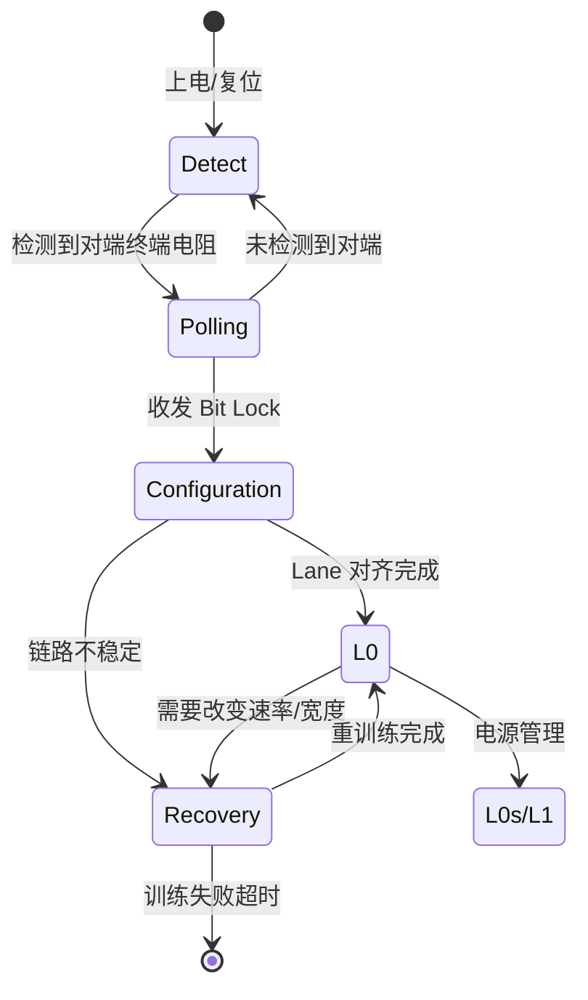

# PCIe物理层与链路训练

<span class="badge-i">[I]</span> <span class="badge-e">[E]</span>


<span class="red">核心概念</span> PCIe 物理层负责电气传输和链路初始化，其核心状态机 LTSSM（Link Training and Status State Machine）管理从设备检测到链路就绪的全过程，包括速率协商和通道宽度协商。

---

### 为什么需要 PCIe

<span class="red">传统 PCI/ISA 并行总线的引脚数量随带宽线性增长</span>，2000 年代已无法满足高速外设的需求。<br>
并行信号间的串扰、时钟偏移和引脚数量爆炸使并行总线走到尽头。<br>
PCIe（PCI Express）用 **高速串行差分对** 替代并行总线，每对 Lane 独立传输，<br>
通过增加 Lane 数量（x1/x4/x8/x16）弹性扩展带宽，同时保持向后兼容的协议分层。


## 物理层：LTSSM状态机

<span class="red">核心概念</span> LTSSM 是 PCIe 链路训练的灵魂，定义了 Detect、Polling、Configuration、Recovery、L0 等状态，每个状态有明确的进入条件和退出条件。



---

Detect 状态是最初的状态，发送端通过改变共模电压检测对端是否存在终端电阻。
<br>
如果对端有 50Ω 终端到地，电压变化会被感知；
<br>
如果链路断开或对端未上电，发送端超时后回退或报错。

---

Polling 状态的目标是建立 Bit Lock 和 Symbol Lock。
<br>
Bit Lock 指接收端 PLL 锁定到发送端比特流频率；
<br>
Symbol Lock 指接收端能正确识别 8b/10b 或 128b/130b 的符号边界。
<br>
这一步通过发送连续的 TS1/TS2（Training Sequence）有序集实现。

---

Configuration 状态协商链路宽度和通道极性反转（Polarity Inversion）、
<br>
通道反转（Lane Reversal）。
<br>
例如 x4 链路可能实际只连了 2 条 Lane，LTSSM 会降级到 x2 运行。
<br>
这种降级是自动的，不需要软件介入。

---

## 链路训练：TS1与TS2有序集

<span class="red">核心概念</span> TS1 和 TS2 是 PCIe 链路训练专用的有序集（Ordered Set），承载速率、宽度、链路编号等协商信息。

| 字段 | TS1 位宽 | TS2 位宽 | 说明 |
|------|---------|---------|------|
| Symbol 0-4 | K28.5 | K28.5 | COMMA 对齐标识 |
| Symbol 5-7 | TS1 ID | TS2 ID | 0x1E / 0x2D |
| Symbol 8 | Lane Number | Lane Number | 物理 Lane 编号 |
| Symbol 9 | Link Number | Link Number | 链路编号 |
| Symbol 10 | N_FTS | N_FTS | 退出 L0s 所需 FTS 数 |
| Symbol 11 | Data Rate ID | Data Rate ID | 支持的速率位图 |
| Symbol 12-13 | Training Control | Training Control | 环回、禁用加扰等 |
| Symbol 14-15 | TS ID | TS ID | 厂商自定义 |

---

Symbol 11 的 Data Rate ID 是关键协商字段：
<br>
bit0=2.5 GT/s 支持，bit1=5 GT/s 支持，bit2=8 GT/s 支持，
<br>
bit3=16 GT/s 支持，bit4=32 GT/s 支持，bit5=64 GT/s 支持。
<br>
双方交换位图后取交集，从最低公共速率开始训练，成功后可选升级。

---

链路编号（Link Number）和通道编号（Lane Number）用于多端口设备（如 Switch）
<br>
区分不同下游端口和 Lane 映射关系。
<br>
上游端口收到 TS1/TS2 后，根据这些编号决定如何路由和响应。

---

## 速率协商：2.5到32 GT/s

<span class="red">核心概念</span> PCIe 的速率演进从 1.0 的 2.5 GT/s 到 6.0 的 64 GT/s（PAM4），每一代都在提升线路速率，同时引入更高效的编码机制。

| 版本 | 线路速率 | 编码方式 | 单 Lane 带宽 | 发布时间 |
|------|---------|---------|-------------|---------|
| PCIe 1.x | 2.5 GT/s | 8b/10b | ~250 MB/s | 2003 |
| PCIe 2.x | 5 GT/s | 8b/10b | ~500 MB/s | 2007 |
| PCIe 3.x | 8 GT/s | 128b/130b | ~1 GB/s | 2010 |
| PCIe 4.x | 16 GT/s | 128b/130b | ~2 GB/s | 2017 |
| PCIe 5.x | 32 GT/s | 128b/130b | ~4 GB/s | 2019 |
| PCIe 6.x | 64 GT/s | PAM4 + FEC | ~8 GB/s | 2022 |

---

速率协商发生在 LTSSM 的 Recovery 状态。
<br>
如果双方都支持更高速率，会在链路稳定后进入 Recovery.Speed 子状态，
<br>
尝试切换到更高一档速率。
<br>
如果切换失败（误码率过高），则回退到上一档速率继续运行。

---

PCIe 3.0 引入的 128b/130b 编码是分水岭：
<br>
相比 8b/10b，它的开销从 20% 降到 1.5%，但时钟恢复更困难，
<br>
因为不再有足够的边沿密度。解决方案是加扰（Scrambling）和更精密的 CDR（Clock Data Recovery，时钟数据恢复）电路。

---

## 通道数：x1到x16

<span class="red">核心概念</span> PCIe 支持 x1/x2/x4/x8/x16 多种通道配置，通道数通过 LTSSM 的 Configuration 状态协商，硬件可以降级到实际连通的 Lane 数。

| 配置 | 单向带宽 (PCIe 3.0) | 双向带宽 | 典型应用 |
|------|-------------------|---------|---------|
| x1 | 1 GB/s | 2 GB/s | WiFi/BT/低速外设 |
| x4 | 4 GB/s | 8 GB/s | NVMe SSD、千兆网卡 |
| x8 | 8 GB/s | 16 GB/s | 显卡、RAID 控制器 |
| x16 | 16 GB/s | 32 GB/s | 高端显卡 |

---

嵌入式主板上最常见的配置是 x1 和 x4：
<br>
NVMe BGA SSD 通常焊 x4 接口，跑满 4 GB/s（PCIe 3.0）或 8 GB/s（PCIe 4.0）；
<br>
WiFi 6 模组通常只需 x1，因为理论速率 9.6 Gbps 远不到 x1 的带宽上限。

---

<span class="blue">结论/易错点</span> 通道宽度降级后，带宽等比例下降，但链路仍能正常工作。
<br>
某 x4 NVMe SSD 只插了 x1 插槽，性能会从 3.5 GB/s 跌到 1 GB/s 以下。
<br>
排查这类问题的最好工具是 `lspci -vvv` 看 Link Capabilities 和 Link Status 中的 Negotiated Link Width。

---

## 代码：Linux PCIe AER

<span class="red">核心概念</span> AER（Advanced Error Reporting，高级错误报告）是 PCIe 的可选扩展，用于报告和记录链路层、事务层的错误事件，Linux 内核提供完整的 AER 驱动支持。

```c
#include <linux/aer.h>

/* 启用设备的 AER 能力 */
static void enable_aer(struct pci_dev *dev)
{
    u32 reg32;
    int pos;

    pos = pci_find_ext_capability(dev, PCI_EXT_CAP_ID_ERR);
    if (!pos)
        return;

    /* 读取 Uncorrectable Error Status */
    pci_read_config_dword(dev, pos + PCI_ERR_UNCOR_STATUS, &reg32);
    dev_info(&dev->dev, "AER Uncorrectable Status: 0x%08x\n", reg32);

    /* 清除所有已报告的错误 */
    pci_write_config_dword(dev, pos + PCI_ERR_UNCOR_STATUS, reg32);

    /* 启用所有不可纠正错误的报告 */
    pci_write_config_dword(dev, pos + PCI_ERR_UNCOR_SEVER, 0xFFFFFFFF);

    /* 启用 Correctable Error 报告 */
    pci_read_config_dword(dev, pos + PCI_ERR_COR_STATUS, &reg32);
    pci_write_config_dword(dev, pos + PCI_ERR_COR_STATUS, reg32);
    pci_write_config_dword(dev, pos + PCI_ERR_COR_MASK, 0);
}
```

---

不可纠正错误（Uncorrectable Error）包括：
<br>
Data Link Protocol Error、Surprise Down Error、Poisoned TLP、
<br>
Completion Timeout、Completer Abort、Unexpected Completion、Receiver Overflow、
<br>
Malformed TLP、ECRC Error、Unsupported Request。

---

可纠正错误（Correctable Error）包括：
<br>
Receiver Error（物理层误码）、Bad TLP（LCRC 校验失败）、
<br>
Bad DLLP（DLLP CRC 失败）、Replay Timeout、Replay Num Rollover。

---

<span class="purple">扩展</span> PCIe 5.0 引入了 BER（Bit Error Rate，误码率）要求 10^-12，比 PCIe 4.0 的 10^-15 放宽了，
<br>
因为 32 GT/s 信号完整性更难保证。
<br>
补偿措施是更强大的 FEC（Forward Error Correction，前向纠错）和 Retimer 芯片，
<br>
长距离走线（>12 inch）必须加 Retimer 重建信号。

---

## 本章小结

| 要点 | 内容 |
|------|------|
| 分层架构 | 事务层（TLP）+ 数据链路层（DLLP）+ 物理层（LTSSM） |
| 链路训练 | Detect → Polling → Configuration → L0，TS1/TS2 有序集交换 |
| 配置空间 | Type 0（Endpoint）/ Type 1（Switch），256B/4KB 头部 + BAR |
| DMA 机制 | Bus Mastering、MSI/MSI-X 中断、IOMMU 地址翻译保护 |
| 演进 | Gen1 2.5GT/s → Gen5 32GT/s → Gen6 64GT/s PAM4，CXL 共存 |

## 练习

1. PCIe 的 TLP（Transaction Layer Packet）头部包含哪些关键字段？请解释 Requester ID、Tag 和 Length 字段的作用。
2. PCIe 链路训练（Link Training）的目的是什么？TS1/TS2 有序集（Ordered Sets）在链路建立过程中分别传输哪些信息？
3. BAR（Base Address Register）的作用是什么？为什么需要 6 个 BAR？Type 0 和 Type 1 配置空间头部有什么区别？
