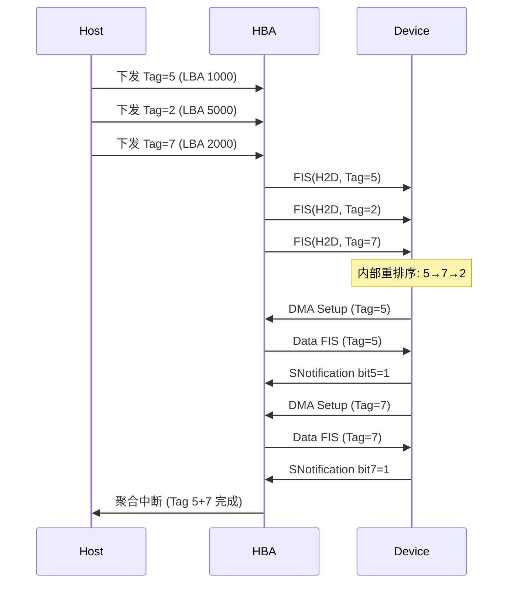

# NCQ原生命令队列

<span class="badge-i">[I]</span> <span class="badge-e">[E]</span>


<span class="red">核心概念</span> NCQ（Native Command Queuing，原生命令队列）是 SATA 2.0 引入的核心特性，允许硬盘内部对多个待执行的读写命令重新排序，以最小化磁头移动距离，提升随机 I/O 性能。

---

## 为什么需要NCQ

<span class="red">核心概念</span> 机械硬盘最慢的不是数据传输，而是磁头寻道。
如果命令按到达顺序执行，磁头可能在盘片上来回跳动，浪费大量时间。

NCQ 的核心思想是**电梯调度算法**：<br>
假设磁头当前在 100 号柱面，待处理的请求分布在 50、120、150、80。<br>
不排序的执行路径是 100→50→120→150→80，总移动 270 柱面；<br>
排序后的路径是 100→120→150→80→50，总移动 120 柱面。
<br>
优化幅度在碎片化严重的老磁盘上可达 30-50%。

---

电梯算法的类比很直观：写字楼电梯不会按照按钮按下的顺序停靠，
<br>
而是先一路向上处理所有上行请求，再折返向下。
<br>
NCQ 就是硬盘内部的电梯调度器，只不过调度对象是 LBA（Logical Block Addressing，逻辑块寻址）地址。

---

## NCQ机制：32级队列深度与标签管理

<span class="red">核心概念</span> NCQ 允许最多 32 个命令同时处于待执行状态，每个命令分配一个 0-31 的 Tag，硬盘内部根据物理位置重新排序后乱序完成。

| 组件 | 说明 | 位宽 |
|------|------|------|
| Tag | 命令唯一标识 | 5-bit (0-31) |
| FPDMA Queued Cmd | 带 Tag 的读写命令 | 0x60h/0x61h |
| SActive | 已发出的 Tag 位图 | 32-bit |
| SNotification | 完成的 Tag 位图 | 32-bit |

---

主机发送 NCQ 命令时，在 ATA 命令寄存器中写入 Tag 和 FPDMA 命令码（0x60 读 / 0x61 写）。
<br>
硬盘收到后把命令放入内部队列，立即返回一个 R_OK 确认（不等待执行完成）。
<br>
主机通过 SActive 位图跟踪哪些 Tag 已经发出但尚未完成。

---

当硬盘完成某个命令后，通过 SNotification 位图通知主机对应的 Tag。
<br>
主机可以一次性收到多个完成的通知，然后批量处理完成回调。
<br>
这种"发命令→乱序执行→批量完成"的流水线和 NVMe 的思想一脉相承。

---

<span class="blue">结论/易错点</span> NCQ 只对机械硬盘有意义，因为 SSD 没有磁头，内部 LBA→物理地址的映射由 FTL 管理，
<br>
对 SATA SSD 开启 NCQ 反而可能因命令重排序引入额外的延迟。
<br>
Linux 的 `libata` 对 SSD 通常禁用 NCQ（或限制队列深度为 1），这是有意为之。

---

## FIS结构：Register FIS / DMA Setup FIS / Data FIS

<span class="red">核心概念</span> FIS 是 SATA 层的数据包，NCQ 场景下涉及的 FIS 类型更丰富，每个都有特定的字段布局和传输时机。

**Register FIS – Host to Device** (5 DW)：<br>
bit0-7 是 ATA 命令码（0x60/0x61），bit8-15 是 Feature，bit16-47 是 LBA，
<br>
bit48-55 是 Device 寄存器，bit56-63 是 Feature(Exp)，bit64-95 是 LBA(Exp)，
<br>
bit96-111 是 Sector Count，bit112-119 是 Tag（5-bit）。

---

**DMA Setup FIS – Device to Host** (7 DW)：<br>
设备通知主机 DMA 传输参数，包含 DMA Buffer Identifier（64-bit）和 DMA Buffer Offset，
<br>
以及 Transfer Count。NCQ 模式下，这个 FIS 用来确认设备准备好接收或发送数据。

---

**Data FIS** (变长)：<br>
实际传输数据的 FIS，每个 Data FIS 最多携带 8 KiB  payload。
<br>
多个 Data FIS 可以连续发送，直到 Sector Count 减到 0。
<br>
Data FIS 的 FIS Type 字段固定为 0x46。

---

<span class="green">术语</span> **FPDMA**（First-party DMA，第一方 DMA）是 NCQ 的核心传输模式。
<br>
传统 PIO（Programmed I/O）模式下，CPU 逐字节搬运数据；
<br>
FPDMA 模式下，硬盘通过 DMA Setup FIS 告诉主机数据在内存中的位置，DMA 控制器直接搬运，CPU 零介入。

---

## 乱序完成与中断聚合

<span class="red">核心概念</span> NCQ 的乱序完成需要主机具备正确的 Tag 匹配逻辑，同时为了减少中断风暴，SATA 支持中断聚合（Interrupt Coalescing）。



---

中断聚合的基本策略是：不每完成一个命令就发一次中断，
<br>
而是等待一个时间窗口或累计一定数量的完成后，再统一触发中断。
<br>
这对高并发随机读非常有效，能把中断频率从数千次/秒降到几十次/秒。

---

AHCI 的 Port 寄存器中有 `IS`（Interrupt Status）和 `IE`（Interrupt Enable），
<br>
配合 `CI`（Command Issue）和 `SNTF`（SNotification）位图，
<br>
驱动可以批量扫描完成的 Tag，一次性提交上层回调。

---

## 代码：AHCI Command List结构

<span class="red">核心概念</span> AHCI 的 Command List 是内存中的环形数组，每个条目是 32-byte 的 Command Header，指向可变长度的 Command Table。

```c
/* AHCI Command Header, 32 bytes */
struct ahci_cmd_hdr {
    uint16_t opts;          /* 0-15: Command FIS length, ATAPI, Write, Prefetch, Reset, BIST, Clear, R, PMP */
    uint16_t status;        /* 0-15: Physical Region Descriptor Table Length */
    uint32_t tbl_addr;      /* Command Table Base Address (lower 32-bit) */
    uint32_t tbl_addr_hi;   /* Command Table Base Address (upper 32-bit) */
    uint32_t reserved[4];   /* Reserved */
} __attribute__((packed));

/* Command Table 包含 FIS + ATAPI cmd + PRD 列表 */
struct ahci_cmd_table {
    uint8_t  cfis[64];      /* Command FIS (up to 64 bytes) */
    uint8_t  acmd[16];      /* ATAPI Command (up to 16 bytes) */
    uint8_t  reserved[48];  /* Reserved */
    struct ahci_prd prd[0]; /* PRD 列表，变长数组 */
} __attribute__((packed));

/* Physical Region Descriptor */
struct ahci_prd {
    uint32_t dba;           /* Data Base Address (lower) */
    uint32_t dba_hi;        /* Data Base Address (upper) */
    uint32_t reserved;      /* Reserved */
    uint32_t dbc:22;        /* Data Byte Count (0-based) */
    uint32_t reserved2:9;
    uint32_t i:1;           /* Interrupt on Completion */
} __attribute__((packed));
```

---

Command Header 的 `opts` 字段中，bit0-4 是 CFIS 长度（以 DW 为单位），
<br>
bit6 是 Write 方向（1=写设备，0=读设备），bit7 是 Prefetch 使能。
<br>
PRD 表描述物理内存的散集列表，每个 PRD 最大支持 4 MiB（22-bit Byte Count + 1），
<br>
大数据块传输需要多个 PRD 条目链接。

---

<span class="purple">扩展</span> 现代 Linux 内核的 `libata` 驱动对 NCQ 的支持非常成熟。
<br>
`ata_qc_new_init()` 分配新的 queued command，`ata_bmdma_start()` 启动 DMA 引擎，
<br>
`ahci_interrupt()` 处理完成中断并扫描 SNotification。
<br>
在驱动层面，`sata_pmp`（Port Multiplier）和 `sata_ncq` 是两个独立的 Kconfig 选项，可以按需裁剪。

---

## 历史演进与发展趋势

SATA（Serial ATA）由 Intel、APT、Dell、IBM、Maxtor 和 Seagate 于 2000 年联合制定，替代了 1986 年诞生的并行 ATA（PATA/IDE）接口。SATA 1.0 提供 1.5Gbps，2004 年 SATA 2.0 翻倍至 3Gbps 并引入 NCQ（Native Command Queuing），2009 年 SATA 3.0 达 6Gbps。AHCI（Advanced Host Controller Interface）作为 SATA 的软件接口标准于 2004 年发布，统一了不同厂商的驱动模型。然而，SATA/AHCI 的设计根植于机械硬盘时代——单队列、高延迟、CPU 中断开销大。2011 年 NVMe 协议基于 PCIe 发布，专为 NAND Flash 的并行特性设计，多队列架构使 IOPS 提升数十倍。2015 年后，消费级 PC 和服务器全面转向 NVMe SSD，SATA 逐渐退居大容量冷存储和入门级设备的边缘市场。

---

## 本章小结

| 要点 | 内容 |
|------|------|
| 物理层 | 7 针细线，差分信号，点对点拓扑替代 PATA 并行总线 |
| AHCI 接口 | 统一的主机控制器驱动模型，Port Multiplier 扩展多设备 |
| NCQ 优化 | Tagged Command Queueing，机械硬盘按磁头位置重排序请求 |
| NVMe 替代 | PCIe 原生接口、多队列并行、μs 级延迟，全面超越 AHCI |

## 练习

1. AHCI 接口相比 IDE 模式的 ATA 接口有哪些核心改进？Port Multiplier 和 NCQ 分别解决了什么问题？
2. NCQ（Native Command Queueing）如何优化机械硬盘的访问延迟？请描述 Tagged Command Queueing 的工作流程和调度策略。
3. 为什么 NVMe 协议在 SSD 时代全面替代了 AHCI？从队列深度、延迟路径和中断机制三个维度对比两者的差异。
