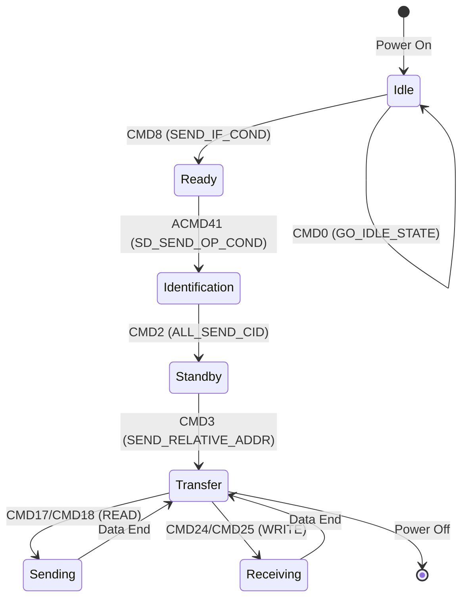

# SD命令协议与状态机

<span class="badge-i">[I]</span> <span class="badge-e">[E]</span>


<span class="red">核心概念</span> SD 协议的核心是一套命令-响应交互机制。主机通过 CMD 线发送 48-bit 命令帧，卡返回不同长度的响应帧，双方在状态机的约束下完成初始化、读写和数据传输。

---

### 为什么需要 SD 协议

<span class="red">嵌入式系统需要可移动、低功耗、小体积的存储方案</span>，传统硬盘和 NOR Flash 都无法同时满足这三个条件。<br>
SD（Secure Digital）卡基于 NAND Flash，用标准化接口封装了复杂的闪存管理逻辑——坏块管理、ECC、磨损均衡都由卡内控制器完成。<br>
对外呈现为简单的块设备接口，使嵌入式开发者无需理解 NAND Flash 的物理特性即可使用大容量存储。


## 命令格式：48-bit帧结构

<span class="red">核心概念</span> 每条 SD 命令都是一个固定 48-bit 的帧，由 Start bit、Direction bit、Command Index、Argument、CRC 和 Stop bit 组成。

| 字段 | 位宽 | 说明 |
|------|------|------|
| Start | 1 | 固定为 0，标识帧起始 |
| Direction | 1 | 1=主机→卡，0=卡→主机（响应时用） |
| Command Index | 6 | 命令编号，如 CMD0=0, CMD17=17 |
| Argument | 32 | 命令参数，含义因命令而异 |
| CRC7 | 7 | 前 40 bit 的 CRC 校验 |
| Stop | 1 | 固定为 1，标识帧结束 |

---

Start bit 和 Stop bit 用来标识帧边界，Direction bit 区分命令与响应。
<br>
CRC7 覆盖从 Start bit 到 Argument 的全部 40 bit，主机和卡各自校验。
<br>
如果 CRC 错误，卡会丢弃该命令，主机通常会在超时后重试。

---

<span class="blue">结论/易错点</span> Argument 虽然是 32-bit，但不同命令只用其中部分字段。
<br>
例如 CMD3（GET_RELATIVE_ADDR）的 Argument 全为 0，卡的 RCA（Relative Card Address，相对卡地址）在响应中返回。
<br>
初学者常误以为 Argument 要填 RCA，实际上 RCA 是卡的输出。

---

## 响应类型：R1/R2/R3/R6/R7

<span class="red">核心概念</span> 卡对命令的回应称为 Response，根据命令不同分为 R1、R2、R3、R6、R7 五种类型，长度从 48-bit 到 136-bit 不等。

| 类型 | 长度 | 典型命令 | 关键字段 |
|------|------|---------|---------|
| R1 | 48-bit | CMD0, CMD17 | Card Status 32-bit |
| R2 | 136-bit | CMD2, CMD10 | CID 或 CSD 寄存器 |
| R3 | 48-bit | ACMD41 | OCR 寄存器 32-bit |
| R6 | 48-bit | CMD3 | RCA + Card Status |
| R7 | 48-bit | CMD8 | 电压信息 + 校验模式 |

---

R1 是最常见的响应，32-bit Card Status 中包含各种状态标志：
<br>
READY_FOR_DATA、CURRENT_STATE、ERROR 等。
<br>
主机每发一条命令都会收到 R1，通过解析状态位判断卡是否准备好接受下一步操作。

---

R2 用于读取 CID（Card Identification，卡识别寄存器）和 CSD（Card-Specific Data，卡特定数据寄存器）。
<br>
这两个寄存器共 128 bit，因此 R2 长度扩展到 136 bit（加 8 bit 帧头尾）。
<br>
CID 包含制造商 ID、产品序列号；CSD 包含容量、速度、电压范围等核心参数。

---

<span class="green">术语</span> **OCR**（Operation Conditions Register，操作条件寄存器）是卡告诉主机自己支持哪些电压范围。
<br>
ACMD41 返回的 R3 中，OCR 的 bit30 是忙标志（BUSY），bit31 是上电完成标志（CARD_POWER_UP）。
<br>
主机必须轮询直到 BUSY=0，否则后续命令会被卡拒绝。

---

## 初始化流程：状态机推进

<span class="red">核心概念</span> SD 卡上电后处于 Idle 状态，必须通过一组固定顺序的命令才能进入 Transfer 状态，准备读写。



---

CMD0 是软复位命令，Argument 全 0，卡收到后重置状态机到 Idle。
<br>
CMD8 是 SD 2.0 引入的电压检测命令，主机发送支持电压和校验模式，
<br>
卡原样返回则证明双方电压匹配且协议版本兼容。

---

ACMD41 是初始化阶段最关键的命令，用于反复查询卡是否准备好。
<br>
它前面必须带 CMD55（APP_CMD），这是 SD 协议区分标准命令和应用命令的机制。
<br>
ACMD41 的 HCS（Host Capacity Support）位告诉卡主机是否支持 SDHC/SDXC。

---

CMD2 让卡发送 CID，进入 Identification 状态。
<br>
CMD3 让卡生成并返回 RCA，进入 Standby 状态。
<br>
此后主机用 RCA 作为目标地址与特定卡通信，总线上可以挂多张卡。

---

## 读写命令：单块与多块

<span class="red">核心概念</span> 数据读写由 CMD17（单块读）、CMD18（多块读）、CMD24（单块写）、CMD25（多块写）完成，数据通过 DAT0-DAT3 并行传输。

| 命令 | 类型 | Argument | 数据流向 |
|------|------|----------|---------|
| CMD17 | 单块读 | 32-bit 块地址 | 卡→主机 |
| CMD18 | 多块读 | 32-bit 起始地址 | 卡→主机 |
| CMD24 | 单块写 | 32-bit 块地址 | 主机→卡 |
| CMD25 | 多块写 | 32-bit 起始地址 | 主机→卡 |

---

多块传输需要用 CMD12（STOP_TRANSMISSION）终止，
<br>
或者提前发送 ACMD23（SET_WR_BLK_ERASE_COUNT）设置预擦除块数。
<br>
ACMD23 能显著提升连续写入性能，因为它让卡提前准备擦除操作，避免写入时等待。

---

<span class="blue">结论/易错点</span> CMD18/CMD25 的多块传输如果不发 CMD12 停止，
<br>
卡会持续等待数据直到超时，导致总线挂死。
<br>
Linux mmc 驱动的标准做法是在请求边界自动插入 STOP 命令。

---

## 代码：SD初始化流程

<span class="red">核心概念</span> 以下代码演示裸机环境中 SD 卡初始化的标准流程，涵盖 Idle→Transfer 的完整状态推进。

```c
#include <stdint.h>

#define CMD0    0
#define CMD8    8
#define CMD55   55
#define CMD2    2
#define CMD3    3
#define ACMD41  41

#define R1_READY        (1 << 8)   /* READY_FOR_DATA */
#define R1_ILLEGAL_CMD  (1 << 2)   /* ILLEGAL_COMMAND */

struct sd_resp {
    uint32_t r1;
    uint32_t r3;
    uint16_t rca;
};

/* 发送命令并等待响应 */
int sd_send_cmd(uint8_t idx, uint32_t arg, struct sd_resp *resp);

int sd_init_card(void)
{
    struct sd_resp resp;
    int retry;
    int err;

    /* Step 1: CMD0 软复位，进入 Idle */
    err = sd_send_cmd(CMD0, 0, &resp);
    if (err)
        return err;

    /* Step 2: CMD8 检测电压兼容性 (SD 2.0+) */
    err = sd_send_cmd(CMD8, 0x1AA, &resp);
    if (err && (resp.r1 & R1_ILLEGAL_CMD))
        return -1; /* SD 1.x 或 MMC，需另分支处理 */

    /* Step 3: ACMD41 轮询直到卡就绪 */
    retry = 1000;
    do {
        sd_send_cmd(CMD55, 0, &resp);      /* 前缀 CMD55 */
        sd_send_cmd(ACMD41, 0x40300000, &resp); /* HCS=1, 3.3V */
        retry--;
    } while ((resp.r3 >> 31) == 0 && retry > 0);

    if (retry == 0)
        return -2; /* 上电超时 */

    /* Step 4: CMD2 获取 CID */
    err = sd_send_cmd(CMD2, 0, &resp);
    if (err)
        return err;

    /* Step 5: CMD3 获取 RCA，进入 Standby */
    err = sd_send_cmd(CMD3, 0, &resp);
    if (err)
        return err;
    resp.rca = (resp.r1 >> 16) & 0xFFFF;

    /* 此后可用 RCA 发 CMD7 进入 Transfer 状态 */
    return 0;
}
```

---

上述代码中 `0x40300000` 是 ACMD41 的关键参数：
<br>
bit30=HCS（支持高容量），bit20-23=OCR 电压窗口（3.2V-3.4V）。
<br>
轮询上限 1000 次对应约 1 秒超时，足以覆盖最坏情况下的 NAND 初始化。

---

<span class="purple">扩展</span> 实际 Linux 内核驱动中，初始化流程由 `mmc_sd_init_card()` 实现，
<br>
位于 `drivers/mmc/core/sd.c`，配合 `mmc_claim_host()` 做并发保护。
<br>
驱动还会处理 SDHC/SDXC 的块地址转换（byte→sector address），这是裸机代码容易遗漏的细节。

---

## 历史演进与发展趋势

SD（Secure Digital）卡源于 1999 年松下、东芝和 SanDisk 联合推出的 MMC（MultiMediaCard）标准。2000 年 SD 卡协会（SDA）成立，在 MMC 基础上增加写保护开关和 DRM 安全机制。2003 年 SDIO 规范发布，允许 SD 接口扩展 WiFi、GPS 等外设。2006 年 SDHC（High Capacity）突破 2GB 容量限制，2009 年 SDXC 引入 exFAT 支持 2TB。2010 年 UHS-I 将总线速度提升至 104MB/s，2013 年 UHS-II 增加第二排针脚实现 312MB/s，2017 年 UHS-III 达 624MB/s。2018 年后，SD Express 将 PCIe/NVMe 协议映射到 SD 引脚上，速率突破 985MB/s。eMMC（embedded MMC）于 2006 年成为手机存储标准，UFS（Universal Flash Storage）于 2011 年发布，用 M-PHY 替代并行总线，成为高端智能手机的标配。未来 SD Express 和 UFS 将继续并存，分别服务于可移动存储和嵌入式存储场景。

---

## 本章小结

| 要点 | 内容 |
|------|------|
| 协议家族 | SDSC / SDHC / SDXC / SDUC，容量从 2GB 到 128TB |
| 命令协议 | 48-bit 命令帧，CMD + ARG + CRC7，状态机驱动 |
| SDIO 扩展 | 保留 SD 物理层，通过 CMD52/CMD53 读写 I/O 寄存器扩展 WiFi/GPS |
| 热插拔 | CD 引脚检测插入、WP 引脚写保护、电源时序防浪涌 |
| 速度演进 | UHS-I 104MB/s → UHS-II 312MB/s → SD Express 985MB/s PCIe |

## 练习

1. SD 卡的命令帧格式中，CMD 字段、ARG 字段和 CRC 字段各占多少位？请描述一个典型的读单块命令（CMD17）的完整时序。
2. SDIO 接口如何在保持 SD 协议兼容的同时扩展 WiFi 等外设功能？SDIO 命令（CMD52/CMD53）与普通 SD 命令有什么区别？
3. SD 卡的热插拔检测机制是如何工作的？CD（Card Detect）和 WP（Write Protect）引脚在物理层和驱动层分别如何处理？
