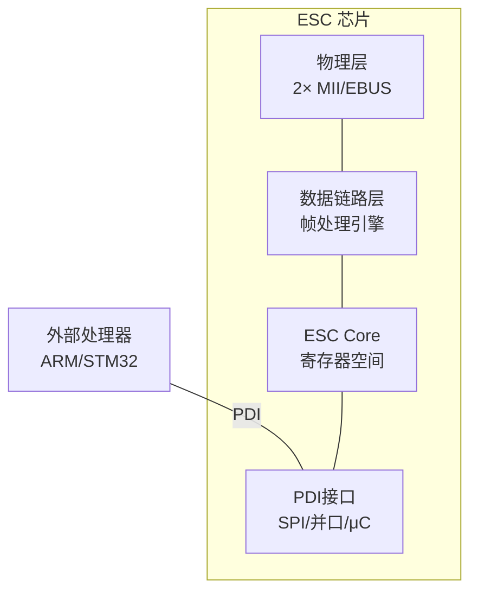
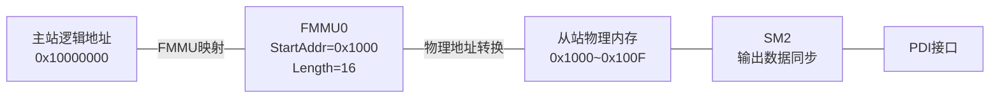

# EtherCAT ESC 芯片与从站配置 [E]

> **本章学习目标**：
> - 理解 ESC（EtherCAT Slave Controller） 的寄存器架构与接口类型
> - 掌握 EEPROM 配置数据的组织结构与加载机制
> - 了解过程数据映射（PDM）的同步管理单元（SM）与现场总线内存管理单元（FMMU）

---

---

### <strong>EtherCAT的技术背景与需求动机</strong>

为什么工业自动化需要EtherCAT而非标准以太网？标准以太网的TCP/IP协议栈处理延迟通常在毫秒级，且从站需要完整接收帧后才能处理，无法满足伺服控制等微秒级周期任务。EtherCAT的"飞读飞写"机制让从站硬件在帧经过时实时读写数据，将周期时间压缩至亚毫秒级。
 

---

## ESC 寄存器

---

### <strong>ESC 内部架构</strong>

E 
ESC 是 EtherCAT 从站的核心芯片，负责处理 EtherCAT 数据帧、管理过程数据接口（PDI）与外部处理器通信。 

ESC 如同从站的"心脏"——PHY 是四肢（连接总线），DL 是神经系统（帧处理），PDI 是语言中枢（与外部 CPU 对话）。 

**表 2-1：ESC 关键寄存器**

| 寄存器 | 地址 | 功能 | 访问 |
| --- | --- | --- | --- |
| TYPE | 0x0000 | ESC 类型/版本 | RO |
| STATION ADDRESS | 0x0010 | 站点别名（由主站配置） | RW |
| DL STATUS | 0x0110 | 数据链路状态（链路断开/环路端口） | RO |
| AL STATUS | 0x0130 | 应用层状态（Init/PreOp/SafeOp/Op） | RW |
| AL STATUS CODE | 0x0134 | 状态转换错误码 | RW |
| SM0~SM15 | 0x0800~0x08FF | 同步管理器配置 | RW |
| FMMU0~FMMU15 | 0x0600~0x06FF | 现场总线内存管理单元 | RW |

<strong>1. 站点地址</strong> 
* 0x0010：站点别名寄存器，由主站在启动阶段通过广播写配置。 
* 也可通过 ESC 的 EEPROM 加载固定别名。 

<strong>2. 状态寄存器</strong> 
* AL STATUS 反映从站当前运行状态：Init(0x01)、Pre-Operational(0x02)、Safe-Operational(0x04)、Operational(0x08)。 
* 状态转换由主站通过状态机命令请求，从站确认后更新 AL STATUS。 

---

## EEPROM 配置

---

### <strong>EEPROM 内容结构</strong>

E 
ESC EEPROM 存储从站的配置数据，ESC 上电后自动加载至内部寄存器。 

**表 2-2：EEPROM 标准结构**

| 字地址 | 内容 | 说明 |
| --- | --- | --- |
| 0x0000 | PDI Control | PDI 接口类型与配置 |
| 0x0001 | PDI Config | 中断/看门狗配置 |
| 0x0002~0x0003 | Vendor ID | 制造商标识 |
| 0x0004~0x0005 | Product Code | 产品代码 |
| 0x0006~0x0007 | Revision | 硬件版本 |
| 0x0008~0x0009 | Serial Number | 序列号 |
| 0x000A | Bootstrap Mailbox | 引导邮箱 SM 配置 |
| 0x000B~0x000E | Standard Mailbox | 标准邮箱 SM 配置 |
| 0x000F | Mailbox Protocol | 支持的邮箱协议 |
| 0x0010~0x0011 | Size | EEPROM 有效数据长度 |
| 0x0012~0x0013 | Version | EEPROM 格式版本 |

<strong>3. PDI Control 字段</strong> 
* Bit 0~2：PDI 接口类型（0=无，1=SPI，4=μC 8位并口，5=μC 16位并口，7=AXI）。 
* Bit 3：看门狗配置使能。 
* Bit 4~7：保留。 

<strong>4. 自动加载机制</strong> 
* ESC 上电后，若检测到 EEPROM 存在，自动读取前 14 个字（0x0000~0x000D）加载至寄存器。 
* 加载完成后，ESC 进入 INIT 状态，等待主站配置。 

---

## 过程数据映射

---

### <strong>SM 与 FMMU 协同</strong>

E 
过程数据映射（PDM） 通过同步管理器（SM）与 FMMU 将主站的逻辑地址映射到从站的物理内存。 

**表 2-3：FMMU 寄存器配置**

| 寄存器 | 偏移 | 说明 |
| --- | --- | --- |
| FMMU0_LSTART_adr | 0x0600 | 逻辑起始地址 |
| FMMU0_LLENGTH | 0x0604 | 映射长度 |
| FMMU0_LSTART_bit | 0x0606 | 起始位偏移 |
| FMMU0_PHYS_adr | 0x0608 | 物理起始地址 |
| FMMU0_PHYS_bit | 0x060A | 物理起始位偏移 |
| FMMU0_TYPE | 0x060B | 映射类型（读/写/双向） |
| FMMU0_ACTIVATE | 0x060C | 激活位 |

<strong>5. SM 寄存器配置</strong> 

| 寄存器 | 偏移 | 说明 |
| --- | --- | --- |
| SM0_PDI_ctrl | 0x0800 | PDI 控制方式 |
| SM0_PDI_start | 0x0802 | 物理起始地址 |
| SM0_length | 0x0804 | 缓冲区长度 |
| SM0_ctrl | 0x0805 | 控制状态 |
| SM0_activate | 0x0806 | 激活与重复标志 |
| SM0_PDI_status | 0x0807 | PDI 状态 |

FMMU 如同"地址翻译官"——将主站的"普通话"（逻辑地址）翻译成从站的"方言"（物理地址），SM 则是"邮局分拣员"——确保数据按正确节奏进出。 

<strong>6. PDM 映射表示例</strong> 

| 逻辑地址 | FMMU | 物理地址 | 长度 | 方向 | 说明 |
| --- | --- | --- | --- | --- | --- |
| 0x1000 | FMMU0 | 0x1000 | 16 Byte | 输出 | 电机控制命令 |
| 0x1010 | FMMU1 | 0x1100 | 16 Byte | 输入 | 电机反馈状态 |
| 0x1020 | FMMU2 | 0x1200 | 32 Byte | 双向 | 参数读写区 |

---

## 技术演进与发展历史

EtherCAT的发展历史与工业以太网对实时性和低成本的追求密不可分。2003年，德国Beckhoff公司为解决传统工业现场总线带宽不足、从站硬件复杂的问题，提出了EtherCAT（Ethernet for Control Automation Technology）技术方案，并将其提交至EtherCAT技术组（ETG）。2005年，EtherCAT正式成为IEC 61158标准的一部分。其核心创新在于"飞读飞写"（Processing on the Fly）机制：以太网帧遍历各从站时，从站仅在帧经过时提取或插入数据，无需完整接收和重组帧，从而将节点周期缩短至微秒级。此后，EtherCAT迅速在半导体设备、机器人、包装机械等领域普及，截至2020年代，全球EtherCAT节点数已超过数千万。

 

---

## 本章小结

| 小节 | 核心要点 |
| --- | --- |
| ESC 寄存器 | TYPE/AL STATUS/SM/FMMU 四大类，PDI 接口与外部处理器交互 |
| EEPROM 配置 | 标准 16-bit 字结构，上电自动加载，PDI Control 决定接口类型 |
| 过程数据映射 | FMMU 逻辑→物理地址转换，SM 同步管理，PDI 数据交换 |

---

---

## 练习

1. **寄存器分析**：某 ESC 芯片 TYPE=0x0500，分析其型号与支持的 PDI 接口类型。

2. **EEPROM 设计**：为一款基于 SPI PDI 的 EtherCAT 从站设计 EEPROM 配置（Vendor ID=0x1234，Product Code=0x5678，PDI=SPI）。写出前 8 个字的值。

3. **PDM 计算**：主站通过 FMMU0 将逻辑地址 0x2000~0x200F 映射到从站物理地址 0x1000。写出 FMMU0_LSTART_adr、FMMU0_LLENGTH、FMMU0_PHYS_adr 的配置值。
