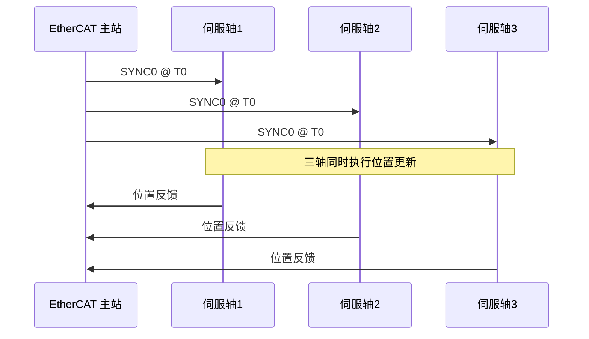

# DC 分布时钟实现 [E→M]

> **本章学习目标**：
> - 理解 <span class="red">DC（Distributed Clock）</span> 同步精度的量化指标与测试方法
> - 掌握漂移补偿（Drift Compensation）的 PI 控制算法
> - 了解多轴同步（Multi-axis Sync）的系统级误差来源与消除策略

---


---

### <strong>EtherCAT的技术背景与需求动机</strong>

<span class="red">为什么</span>工业自动化需要EtherCAT而非标准以太网？标准以太网的TCP/IP协议栈处理延迟通常在毫秒级，且从站需要完整接收帧后才能处理，无法满足伺服控制等微秒级周期任务。EtherCAT的"飞读飞写"机制让从站硬件在帧经过时实时读写数据，将周期时间压缩至亚毫秒级。
<br>

---

## DC 同步精度

---

### <strong>同步精度定义与测量</strong>

<span class="badge-e">E</span><br>
<span class="red">DC 同步精度</span> 指 EtherCAT 网络中各从站本地时钟与参考时钟（通常是第一个 DC 从站或主站）的偏差。<br>

**表 3-1：DC 同步精度等级**

| 等级 | 精度范围 | 应用场景 | 实现要求 |
| --- | --- | --- | --- |
| 标准 | < 1 μs | 一般工业控制 | DC 使能，无额外补偿 |
| 高精度 | < 100 ns | CNC 加工 | 漂移补偿 + 抖动滤波 |
| 超高精度 | < 10 ns | 半导体运动控制 | 专用硬件 + 温度补偿 |

<span class="blue">DC 同步如同交响乐团——GrandMaster 是指挥，各从站是乐手，10 ns 精度意味着所有人同时拉弓的误差小于光走 3 米的距离。</span><br>

<span class="orange"><strong>1. 系统时间寄存器</strong></span><br>
* ESC 内部 64-bit 系统时间计数器，分辨率 1 ns，基于本地时钟。<br>
* 主站定期广播 ARMW（Auto-Repeat Memory Write）帧，写入参考时间。<br>
* 从站比较本地时间与参考时间，计算偏差。<br>

<span class="orange"><strong>2. 精度测量方法</strong></span><br>
* 硬件测量：使用示波器监测各从站 SYNC 输出引脚，测量上升沿时间差。<br>
* 软件测量：读取 ESC 的 0x092C（System Time Difference）寄存器，统计分布。<br>

---

## 漂移补偿

---

### <strong>漂移来源与 PI 补偿算法</strong>

<span class="badge-e">E</span><br>
<span class="red">时钟漂移</span> 源于晶振频率差异与温度变化，DC 通过 PI（比例-积分）控制算法持续补偿。<br>

**表 3-2：漂移来源与影响**

| 来源 | 典型漂移率 | 影响 | 补偿方式 |
| --- | --- | --- | --- |
| 晶振初始偏差 | ±20 ppm | 20 μs/s 累积 | PI 补偿 |
| 温度变化 | ±50 ppm/℃ | 温升 10℃ → 500 μs 偏差 | 温度补偿+PI |
| 老化 | ±3 ppm/年 | 长期缓慢偏移 | 定期校准 |
| 电源波动 | ±5 ppm | 瞬态抖动 | 电源滤波 |

<span class="orange"><strong>3. PI 控制算法</strong></span><br>

```c
// DC 漂移补偿 PI 控制算法
// 文件：ecat_dc_pi.c

#define DC_Kp  0x1000   // 比例系数
#define DC_Ki  0x0C00   // 积分系数

typedef struct {
    int64_t error;        // 当前偏差 (ns)
    int64_t integral;     // 积分累积
    int32_t drift;        // 输出漂移补偿值
} dc_pi_t;

void dc_pi_update(dc_pi_t *pi, int64_t measured_diff) {
    // 测量偏差 = 本地时间 - 参考时间
    pi->error = measured_diff;
    
    // 积分项累积
    pi->integral += pi->error;
    
    // 限幅保护
    if (pi->integral > DC_INTEGRAL_MAX)
        pi->integral = DC_INTEGRAL_MAX;
    if (pi->integral < -DC_INTEGRAL_MAX)
        pi->integral = -DC_INTEGRAL_MAX;
    
    // PI 输出：drift = Kp*error + Ki*integral
    pi->drift = (DC_Kp * pi->error + DC_Ki * pi->integral) >> 16;
    
    // 写入 ESC 漂移补偿寄存器 0x0920
    esc_write32(ESC_REG_DCSPEED, pi->drift);
}
```

<span class="blue">PI 控制如同开车修正方向——P 项是"看到偏离立即打方向盘"（比例响应），I 项是"持续偏离则越打越多"（累积修正）。</span><br>

<span class="orange"><strong>4. 补偿周期</strong></span><br>
* 标准周期：每 1~10 ms 执行一次 PI 更新。<br>
* 高精度场景：每 100 μs 更新一次，配合硬件滤波。<br>
* 补偿值写入 ESC 的 DCSPEED 寄存器，调整本地时钟频率。<br>

---

## 多轴同步

---

### <strong>系统级同步误差分析</strong>

<span class="badge-m">M</span><br>
<span class="red">多轴同步</span> 要求所有伺服轴在同一 SYNC 时刻执行位置/速度更新，误差需控制在纳米级（直线电机）或微弧度级（转台）。<br>

**表 3-3：多轴同步误差来源**

| 误差来源 | 典型值 | 消除策略 |
| --- | --- | --- |
| SYNC 信号抖动 | ±10 ns | 硬件数字滤波 |
| 电缆长度差异 | 5 ns/m | 等长布线或软件补偿 |
| ESC 处理延迟 | 30~100 ns | 选择 Cut-through ESC |
| 伺服环路延迟 | 50~200 μs | 预测控制+前馈补偿 |
| 机械背隙 | 1~10 μm | 双编码器+预紧 |

<span class="orange"><strong>5. 等时同步模式（FreeRun vs DC Mode）</strong></span><br>
* FreeRun：各轴独立运行，无全局同步，适合独立轴。<br>
* DC Mode：所有轴共享参考时钟，SYNC 信号对齐，适合插补运动。<br>
* SYNC 周期：通常 250 μs、500 μs 或 1 ms，由主站统一配置。<br>



<span class="orange"><strong>6. 补偿算法进阶</strong></span><br>
* 前馈补偿：根据轨迹速度预计算位置增量，提前写入伺服。<br>
* 振动抑制：在 SYNC 周期内插入微振动补偿脉冲。<br>
* 温度补偿：监测电机/编码器温度，实时修正热膨胀误差。<br>

---

## 技术演进与发展历史

EtherCAT的发展历史与工业以太网对实时性和低成本的追求密不可分。2003年，德国Beckhoff公司为解决传统工业现场总线带宽不足、从站硬件复杂的问题，提出了EtherCAT（Ethernet for Control Automation Technology）技术方案，并将其提交至EtherCAT技术组（ETG）。2005年，EtherCAT正式成为IEC 61158标准的一部分。其核心创新在于"飞读飞写"（Processing on the Fly）机制：以太网帧遍历各从站时，从站仅在帧经过时提取或插入数据，无需完整接收和重组帧，从而将节点周期缩短至微秒级。此后，EtherCAT迅速在半导体设备、机器人、包装机械等领域普及，截至2020年代，全球EtherCAT节点数已超过数千万。

<br>

---

## 本章小结

| 小节 | 核心要点 |
| --- | --- |
| DC 同步精度 | 标准<1μs，高精度<100ns，64-bit 系统时间+ARMW 广播同步 |
| 漂移补偿 | PI 控制算法（Kp*error + Ki*integral），补偿周期 1~10ms |
| 多轴同步 | SYNC0 全局对齐，误差源分析，FreeRun vs DC Mode |

---


---


## 练习

1. **精度计算**：某 EtherCAT 网络使用 20 ppm 晶振，无补偿运行 1 小时后，理论最大时间偏差是多少？若目标精度 < 100 ns，PI 补偿的最小更新频率应为多少？

2. **PI 调参**：某 DC 补偿系统 Kp=0x1000，Ki=0x0800，初始误差 500 ns。计算前 3 个周期的 drift 输出值（假设误差线性递减）。

3. **多轴设计**：设计一个 6 轴 CNC 的 EtherCAT 同步方案，要求插补周期 250 μs，同步精度 < 50 ns。列出硬件选型（ESC 型号、晶振精度）与软件配置要点。
