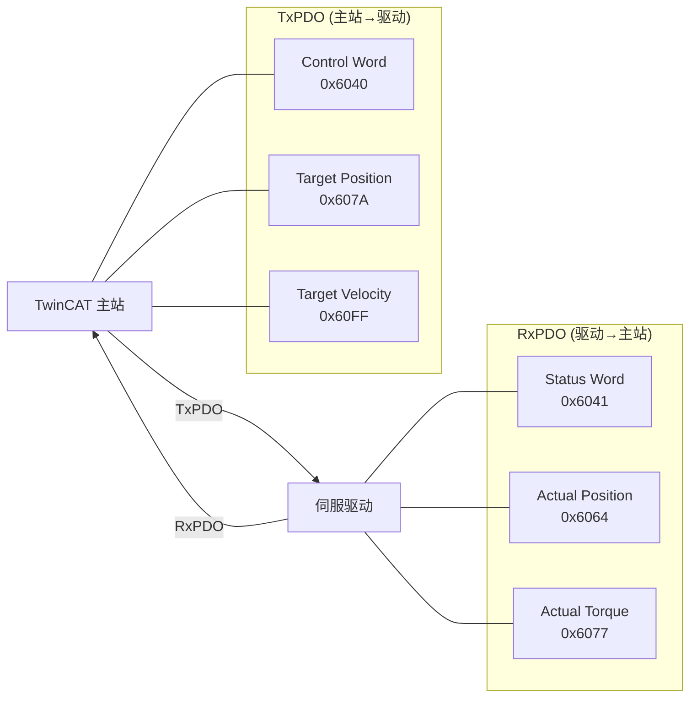

# EtherCAT 嵌入式实战 [E]

> **本章学习目标**：
> - 掌握 Beckhoff TwinCAT 的扫描配置流程与从站拓扑识别
> - 理解 EtherCAT 从站开发套件（如 ET1100）的评估流程
> - 了解伺服驱动 PDO 映射的配置与调试方法

---


---

### <strong>EtherCAT的技术背景与需求动机</strong>

<span class="red">为什么</span>工业自动化需要EtherCAT而非标准以太网？标准以太网的TCP/IP协议栈处理延迟通常在毫秒级，且从站需要完整接收帧后才能处理，无法满足伺服控制等微秒级周期任务。EtherCAT的"飞读飞写"机制让从站硬件在帧经过时实时读写数据，将周期时间压缩至亚毫秒级。
<br>

---

## TwinCAT 配置

---

### <strong>TwinCAT 扫描与从站识别</strong>

<span class="badge-e">E</span><br>
<span class="red">TwinCAT</span> 是 Beckhoff 的 EtherCAT 主站开发环境，支持从站自动扫描、配置生成与实时控制。
<br>

<span class="blue">TwinCAT 如同 EtherCAT 网络的"CT扫描仪"——插上电缆后自动识别网络拓扑、读取从站ESI（EtherCAT Slave Information），生成配置树。</span><br>

**表 4-1：TwinCAT 扫描配置步骤**

| 步骤 | 操作 | 界面位置 | 说明 |
| --- | --- | --- | --- |
| 1 | I/O Devices → Scan | TwinCAT System Manager | 自动发现 EtherCAT 适配器 |
| 2 | Scan Box 1/2/3... | 右键点击 EtherCAT 主站 | 逐个扫描从站 |
| 3 | 确认 ESI 匹配 | 弹窗提示 | 检查从站描述文件一致性 |
| 4 | 配置 PDO | 从站树 → PDOs | 勾选需映射的过程数据 |
| 5 | 分配变量 | PDO → PLC 变量 | 将 PDO 链接至 PLC 变量 |
| 6 | Activate Configuration | 工具栏 | 下载配置至实时核 |

<span class="orange"><strong>1. 扫描结果解读</strong></span><br>
* 扫描后 System Manager 显示从站链拓扑，每个从站显示产品代码、修订号与配置状态。
<br>
* 绿色：配置匹配；黄色：ESI 版本差异；红色：未找到 ESI 或配置不匹配。
<br>

<span class="orange"><strong>2. 从站状态诊断</strong></span><br>
* Online 标签页实时显示从站状态（Init/PreOp/SafeOp/Op）。
<br>
* CoE (CANopen over EtherCAT) 对象字典可直接在线读写，用于调试参数。
<br>

---

## 从站开发套件

---

### <strong>ET1100 评估板使用</strong>

<span class="badge-e">E</span><br>
<span class="red">ET1100</span> 是 Beckhoff 的 EtherCAT 从站控制器评估芯片，配套评估板（如 FB1111-0141）用于快速原型验证。
<br>

**表 4-2：ET1100 评估板硬件资源**

| 资源 | 规格 | 用途 |
| --- | --- | --- |
| ET1100 | 3-port ESC | 2×EBUS + 1×MII |
| PDI | SPI / 并口 | 连接外部 μC |
| EEPROM | 24C32 | 存储配置数据 |
| SYNC 输出 | 2 路 | DC 同步信号 |
| LEDs | 4 路 | 状态指示 |
| GPIO | 16 路 | 数字 I/O 测试 |

<span class="orange"><strong>3. 评估流程</strong></span><br>
* 步骤1：连接评估板至 TwinCAT 主站，确认扫描识别。
<br>
* 步骤2：通过 TwinCAT 的 EEPROM 烧录工具写入自定义配置。
<br>
* 步骤3：连接外部 MCU（如 STM32），实现 PDI 通信与应用逻辑。
<br>
* 步骤4：验证 PDO 映射、DC 同步与状态机转换。
<br>

---

## 伺服驱动 PDO 映射

---

### <strong>CiA402 伺服驱动配置</strong>

<span class="badge-e">E</span><br>
<span class="red">伺服驱动 PDO 映射</span> 遵循 CiA402（IEC 61800-7-201）标准，定义控制字、状态字、位置/速度/力矩指令。
<br>



**表 4-3：CiA402 关键 PDO 对象**

| 对象 | 索引 | 子索引 | 方向 | 说明 |
| --- | --- | --- | --- | --- |
| Control Word | 0x6040 | 0x00 | TxPDO | 伺服控制命令 |
| Status Word | 0x6041 | 0x00 | RxPDO | 伺服状态反馈 |
| Target Position | 0x607A | 0x00 | TxPDO | 目标位置 (inc) |
| Actual Position | 0x6064 | 0x00 | RxPDO | 实际位置 (inc) |
| Target Velocity | 0x60FF | 0x00 | TxPDO | 目标速度 (inc/s) |
| Actual Velocity | 0x606C | 0x00 | RxPDO | 实际速度 (inc/s) |
| Modes of Operation | 0x6060 | 0x00 | TxPDO | 运行模式 (PP/PV/TQ) |
| Error Code | 0x603F | 0x00 | RxPDO | 故障码 |

<span class="orange"><strong>4. PDO 映射配置步骤</strong></span><br>

```
TwinCAT 中 PDO 映射配置：
1. 展开从站 → Process Data → Outputs/Inputs
2. 右键 → "Add New Item" → 选择索引/子索引
3. 勾选 "PDO Assignment" 中的条目
4. 链接至 PLC 变量（右键 → "Change Link..."）
5. 激活配置并测试
```

<span class="orange"><strong>5. Control Word 位定义</strong></span><br>

| Bit | 名称 | 0→1 触发 | 说明 |
| --- | --- | --- | --- |
| 0 | Switch On | 伺服上电 | 使能驱动器 |
| 1 | Enable Voltage | 允许电压输出 | 与 Bit0 配合 |
| 2 | Quick Stop | 快速停止 | 0=激活快速停止 |
| 3 | Enable Operation | 允许运行 | 进入 Operation Enable |
| 4~6 | Operation Mode Specific | 模式相关 | 如 PP 模式的发送新位置 |
| 7 | Fault Reset | 故障复位 | 0→1 清除故障 |

<span class="blue">Control Word 如同汽车的点火钥匙——Bit0 是"插入钥匙"，Bit3 是"踩下油门"，Bit7 是"故障时重启"。</span><br>

---

## 技术演进与发展历史

EtherCAT的发展历史与工业以太网对实时性和低成本的追求密不可分。2003年，德国Beckhoff公司为解决传统工业现场总线带宽不足、从站硬件复杂的问题，提出了EtherCAT（Ethernet for Control Automation Technology）技术方案，并将其提交至EtherCAT技术组（ETG）。2005年，EtherCAT正式成为IEC 61158标准的一部分。其核心创新在于"飞读飞写"（Processing on the Fly）机制：以太网帧遍历各从站时，从站仅在帧经过时提取或插入数据，无需完整接收和重组帧，从而将节点周期缩短至微秒级。此后，EtherCAT迅速在半导体设备、机器人、包装机械等领域普及，截至2020年代，全球EtherCAT节点数已超过数千万。

<br>

---

## 本章小结

| 小节 | 核心要点 |
| --- | --- |
| TwinCAT 配置 | Scan→识别ESI→配置PDO→分配变量→Activate，绿黄红三色状态 |
| 从站开发套件 | ET1100 3-port ESC，EBUS+MII，SPI/并口PDI，EEPROM烧录 |
| 伺服驱动 PDO | CiA402 标准，Control/Status Word，位置/速度/力矩映射，TxPDO/RxPDO |

---


---


## 练习

1. **TwinCAT 操作**：描述在 TwinCAT 中为一个新扫描到的伺服驱动从站配置 PDO 映射的完整步骤（从扫描到激活）。

2. **PDO 设计**：某伺服驱动需支持位置模式（PP），要求 TxPDO 包含 Control Word + Target Position + Profile Velocity，RxPDO 包含 Status Word + Actual Position + Following Error Actual。写出各对象的索引与子索引组合。

3. **状态机调试**：某伺服上电后 Control Word=0x0006，Status Word=0x0231。分析当前伺服状态，并写出进入 Operational 状态所需的 Control Word 序列。
