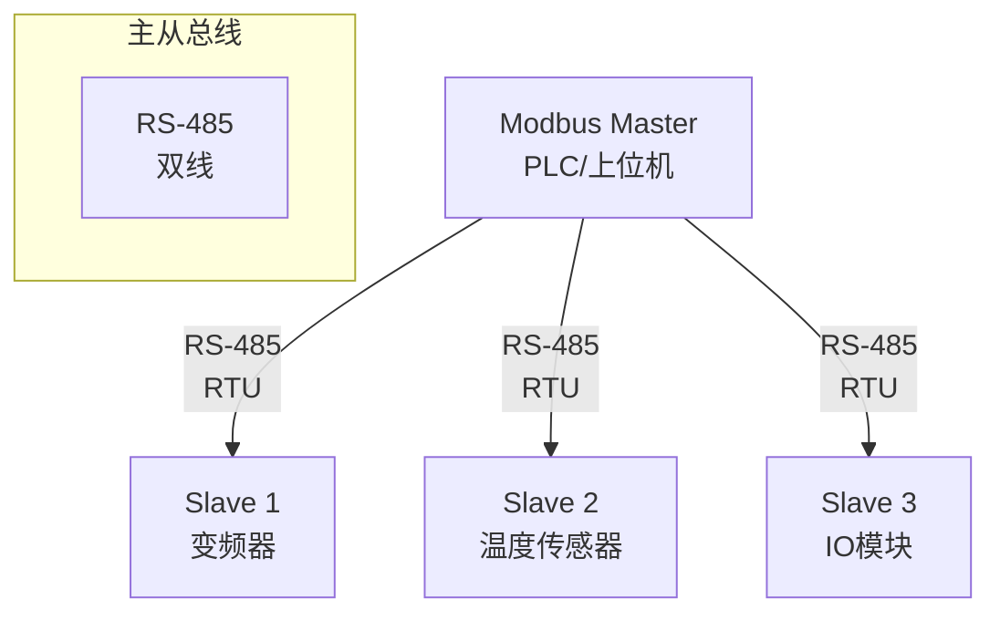

# Modbus 基础认知与寄存器映射 [B→I]

<span class="badge-i">[I]</span> <span class="badge-e">[E]</span>


> **本章学习目标**：
> - 理解 <span class="red">Modbus</span> 从 Modicon PLC 演进的开放协议历史
> - 掌握 RTU/ASCII/TCP 三种帧格式与 CRC/LRC 校验
> - 了解线圈、离散输入、保持寄存器、输入寄存器的映射关系

---

## Modbus 的诞生：工业自动化的"通用语言"

---

### <strong>为什么需要 Modbus：PLC 通信的开放标准</strong>

<span class="red">Modbus</span>由 <span class="green">Modicon（现为 Schneider Electric）</span>在 <span class="green">1979 年</span>发布，
定位是 PLC 的开放通信协议。

在 Modbus 出现之前，PLC 通信是私有协议：
<br>
* <span class="green">各厂商各自为政</span>：Allen-Bradley、Siemens、Mitsubishi 互不兼容
<br>
* <span class="green">集成成本高</span>：不同品牌的 PLC 和传感器无法直接通信
<br>
* <span class="green">维护困难</span>：不同系统需要不同的调试工具和知识
<br>

<span class="blue">Modbus 是工业领域最开放的协议：协议规范免费公开、实现简单（基于 UART）、不依赖特定硬件。</span>
<br>

<span class="blue">类比：Modbus 如同"工业界的英语"——无论你来自哪个国家（厂商），只要会说 Modbus，就能和其他设备交流。</span>
<br>

---

### <strong>Modbus 的三种帧格式：RTU、ASCII、TCP</strong>

<span class="red">Modbus</span>支持三种传输模式：

| 模式 | 介质 | 帧格式 | 校验 | 效率 | 典型场景 |
| --- | --- | --- | --- | --- | --- |
| RTU | RS-485 | 二进制 | CRC16 | 最高 | 工业现场 |
| ASCII | RS-232 | ASCII 字符 | LRC | 低 | 调试/诊断 |
| TCP | 以太网 | MBAP 头 + PDU | TCP CRC | 中 | 跨网络 |



<span class="blue">RTU 帧格式：[Slave ID][Function Code][Data][CRC16]。Slave ID = 0 表示广播，1~247 为有效地址。</span>
<br>

---

### <strong>Modbus 寄存器映射：四种数据类型</strong>

<span class="red">Modbus</span>定义了四种数据类型：

| 类型 | 功能码 | 访问 | 大小 | 用途 |
| --- | --- | --- | --- | --- |
| 线圈（Coil） | 01, 05, 15 | 读写 | 1 bit | 开关量输出 |
| 离散输入（Discrete Input） | 02 | 只读 | 1 bit | 开关量输入 |
| 保持寄存器（Holding Register） | 03, 06, 16 | 读写 | 16 bit | 模拟量输出、配置参数 |
| 输入寄存器（Input Register） | 04 | 只读 | 16 bit | 模拟量输入 |

```text
Modbus 地址空间（常见约定）：

线圈：        00001~09999  →  功能码 01/05/15
离散输入：    10001~19999  →  功能码 02
输入寄存器：  30001~39999  →  功能码 04
保持寄存器：  40001~49999  →  功能码 03/06/16

注意：地址 40001 对应 PDU 中的地址 0x0000（减 1）
```

---

## 本章小结

| 概念 | 一句话总结 |
| --- | --- |
| Modbus | 1979 年 Modicon 发布的开放 PLC 协议 |
| RTU | 二进制帧，RS-485，CRC16，效率最高 |
| TCP | MBAP 头 + PDU，以太网传输 |
| 线圈 | 1-bit 读写，开关量输出 |
| 保持寄存器 | 16-bit 读写，配置和模拟量 |
| 输入寄存器 | 16-bit 只读，模拟量输入 |

---


## 练习

1. Modbus RTU 的 CRC16 覆盖哪些字节？从机收到 CRC 错误后应该怎么响应？
2. 一个温度传感器的测量值放在输入寄存器 30001（值 0~4095 对应 0~100°C），写出读取它的 RTU 帧。
3. Modbus TCP 的 MBAP 头中的 Transaction ID 有什么作用？为什么需要它？
