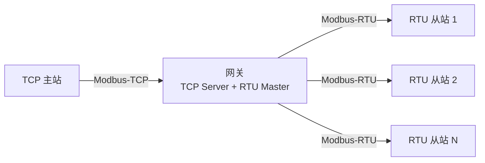
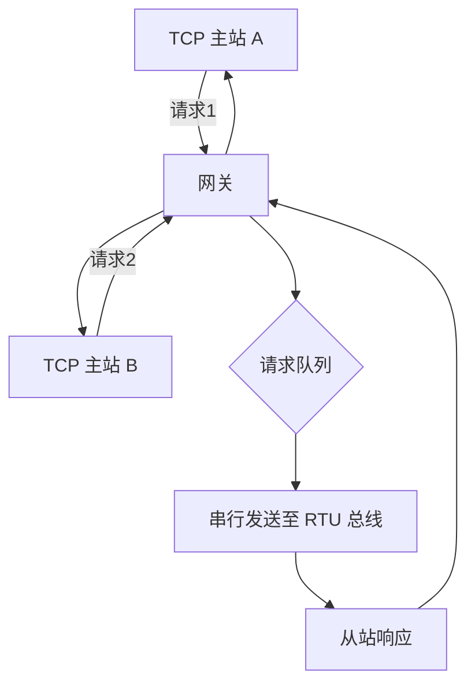

# Modbus-TCP 与网关 [I]

> **本章学习目标**：
> - 理解 MBAP 头 的结构与事务标识的作用
> - 掌握 TCP/RTU 网关的协议转换机制与数据流
> - 了解 Modbus 多主通信的会话管理与并发策略

---

## MBAP 头解析

---

### <strong>MBAP 结构</strong>

I 
MBAP（Modbus Application Protocol Header） 是 Modbus-TCP 特有的 7 字节头部，封装在 TCP 载荷中。
 

MBAP 如同快递单的条形码——Transaction ID 是包裹追踪号，Protocol ID 是快递公司代码，Length 是包裹重量，Unit ID 是最终收件人分机号。 

**表 3-1：MBAP 头结构**

| 字段 | 长度 | 说明 |
| --- | --- | --- |
| Transaction ID | 2 byte | 事务标识，请求与响应配对 |
| Protocol ID | 2 byte | 固定 0x0000 = Modbus |
| Length | 2 byte | 后续字节数（含 Unit ID） |
| Unit ID | 1 byte | 从站地址（网关场景下转发） |

<strong>1. Transaction ID</strong> 
* 由客户端生成，通常递增。
 
* 支持异步多请求，客户端通过 Transaction ID 匹配响应。
 
* 范围 0x0000~0xFFFF，溢出后回绕。
 

<strong>2. Protocol ID</strong> 
* 固定为 0x0000，标识 Modbus 协议。
 
* 保留用于未来扩展，当前所有实现必须发送 0x0000。
 

<strong>3. Length</strong> 
* 以字节为单位，计算范围为 Unit ID + PDU（功能码 + 数据）。
 
* 例如：读 4 个寄存器的请求，Length = 1 + 1 + 4 = 6。
 

<strong>4. Unit ID</strong> 
* 目标从站地址，与 RTU 的地址域语义相同。
 
* 直连从站时，Unit ID 通常与 TCP 连接一一对应。
 
* 通过网关时，Unit ID 指示网关后的目标 RTU 从站。
 

---

## TCP/RTU 网关

---

### <strong>网关协议转换</strong>

I 
Modbus 网关 连接 TCP 主站与 RTU 从站，负责 MBAP 剥离/添加、CRC 计算与总线仲裁。
 

网关如同双语翻译官——听懂了 TCP 主站的"英语"（MBAP 封装），转成 RTU 从站能理解的"方言"（CRC 校验帧），再将回复翻译回去。 

**表 3-2：网关协议转换映射**

| 方向 | TCP 侧操作 | RTU 侧操作 | 说明 |
| --- | --- | --- | --- |
| 请求下行 | 接收 MBAP+PDU | 添加 CRC，转为 RTU 帧 | 剥离 MBAP |
| 响应上行 | 添加 MBAP 头 | 验证 CRC，提取 PDU | 计算新 Transaction ID |
| 多主仲裁 | TCP 连接队列 | RTU 总线串行化 | 并发请求排队 |

<strong>1. 请求帧转换</strong> 
* TCP 接收：Transaction ID + Protocol ID + Length + Unit ID + PDU。
 
* 网关处理：记录 Transaction ID ↔ Unit ID 映射，剥离 MBAP。
 
* RTU 发送：Unit ID（作为地址）+ PDU + CRC16。
 

<strong>2. 响应帧转换</strong> 
* RTU 接收：地址 + PDU + CRC（网关验证）。
 
* 网关处理：查找原始 Transaction ID，构造 MBAP 头。
 
* TCP 发送：Transaction ID + 0x0000 + Length + Unit ID + PDU。
 

---

## 多主通信

---

### <strong>多主会话管理</strong>

I 
多主通信 指多个 TCP 客户端同时访问同一网关或从站，需解决并发冲突。
 

**表 3-3：多主并发策略**

| 策略 | 机制 | 优点 | 缺点 |
| --- | --- | --- | --- |
| 请求队列 | FIFO 排队 | 简单无冲突 | 延迟累积 |
| 连接池 | 每主站独占连接 | 隔离性好 | 资源消耗大 |
| 请求合并 | 合并相同读请求 | 减少总线负载 | 实时性下降 |
| 优先级调度 | 紧急请求插队 | 关键响应快 | 实现复杂 |

<strong>3. 超时管理</strong> 
* 网关维护每个请求的定时器，超时未响应则向 TCP 客户端返回异常。
 
* RTU 超时通常设为 1~3 秒，TCP 超时略大于 RTU 超时。
 
* 超时后需清空 RTU 总线，防止从站响应污染后续请求。
 

---

## 技术演进与发展历史

Modbus的发展历史可追溯至1979年，当时Modicon公司（现为Schneider Electric旗下）为其可编程逻辑控制器（PLC）设计了Modbus串行通信协议。Modbus的简洁性使其迅速成为工业自动化领域事实上的标准——仅需读写寄存器这一核心抽象，即可覆盖绝大多数传感器、执行器和控制器的交互需求。1990年代，Modbus TCP将协议映射到以太网层，摆脱了RS-485的物理束缚。2004年，Modbus-IDA组织成立，负责协议的维护与推广。2006年，Modbus成为GB/T标准。此后，Modbus RTU与Modbus TCP长期并存：RTU继续在成本敏感的串口设备中占据主导，TCP则在网络化、分布式系统中广泛应用。近年来，Modbus与MQTT、OPC UA等上层协议的网关转换方案日益成熟，赋予这一经典协议在工业物联网时代的持续生命力。

 

---

## 本章小结

| 小节 | 核心要点 |
| --- | --- |
| MBAP 头解析 | Transaction ID 配对，Length 含 Unit ID，Protocol ID 固定 0x0000 |
| TCP/RTU 网关 | MBAP↔CRC 双向转换，Transaction ID 映射表，请求排队串行化 |
| 多主通信 | FIFO/连接池/合并/优先级四种策略，超时管理与总线恢复 |

---

## 练习

1. **MBAP 构造**：构造一个读取 Unit ID=0x03、起始地址 0x0000、8 个保持寄存器的 Modbus-TCP 请求帧（Transaction ID=0x0001）。

2. **网关转换**：某网关收到上述 TCP 请求，写出其向 RTU 从站发送的完整帧（含 CRC16 计算过程）。

3. **并发设计**：两个 TCP 主站同时向网关发送读请求（目标不同从站）。设计网关的处理流程，包括队列管理、超时处理与响应路由。
