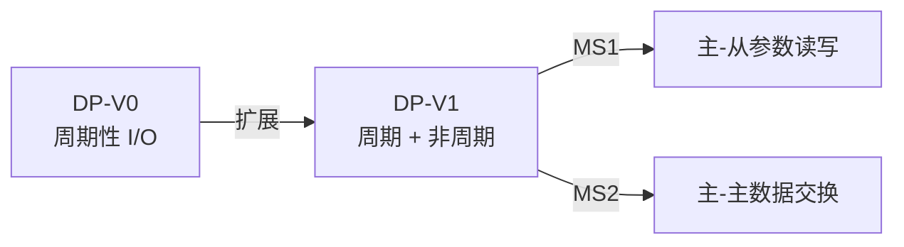
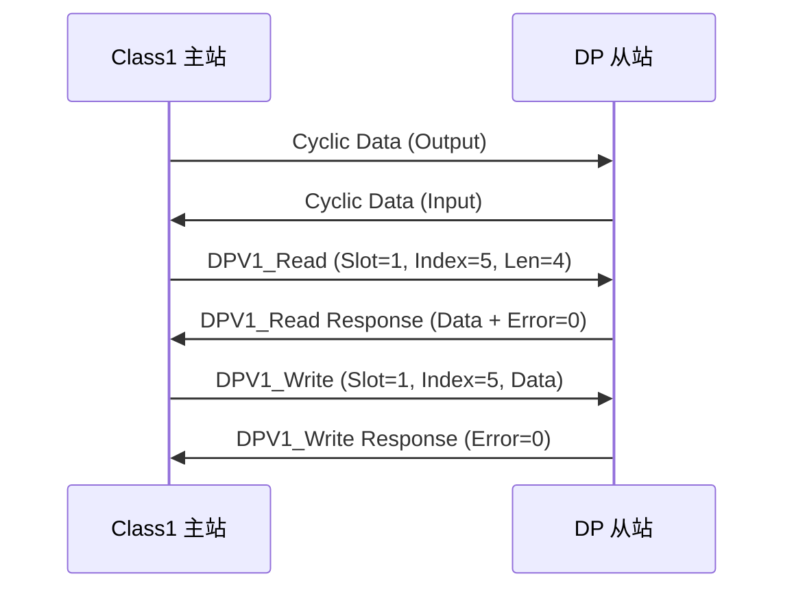

# PROFIBUS DP-V1 非周期通信 [E]

> **本章学习目标**：
> - 理解 MS1/MS2 通信 的两种非周期服务模式
> - 掌握参数读写（Read/Write）的报文结构与寻址方式
> - 了解报警处理的触发条件与响应机制

---

---

### <strong>PROFIBUS的技术背景与需求动机</strong>

为什么德国工业界要推动PROFIBUS标准化？1980年代末，工厂自动化领域存在数十种互不兼容的现场总线，设备互换性差、维护成本高。德国联邦科技部联合主要工业厂商统一制定PROFIBUS规范，将分散的通信需求收敛为DP（工厂自动化）、PA（过程自动化）两大分支，降低了全行业的集成门槛。
 

---

## MS1/MS2 通信

---

### <strong>DP-V0 与 DP-V1 的演进</strong>

E 
PROFIBUS DP-V1 在 DP-V0 周期数据交换的基础上，增加了非周期通信（Acyclic Communication）能力。 

类比：DP-V0 如同定期发工资——每月固定日期发固定金额；DP-V1 如同临时报销——员工按需提交申请，财务不定期处理。 

**表 2-1：MS1 vs MS2 对比**

| 特性 | MS1 | MS2 |
| --- | --- | --- |
| 通信方向 | 主站 ↔ 从站 | 主站 ↔ 主站 |
| 服务类型 | 参数读写、诊断、报警 | 数据交换、变量访问 |
| 触发方式 | 主站主动请求 | 对等请求/响应 |
| 实时性 | 非周期，可延迟 | 非周期，可延迟 |
| 寻址方式 | 从站地址 + 插槽 + 索引 | 链路地址 + 变量名 |
| 典型应用 | 参数配置、故障诊断 | 主站间数据共享 |

<strong>1. MS1 服务模型</strong> 
* 基于主-从架构，Class 1 主站（控制主站）发起非周期请求。 
* 从站在完成当前周期数据交换后，插空处理非周期请求。 
* 使用 DPV1_Read 和 DPV1_Write 服务访问从站参数。 

<strong>2. MS2 服务模型</strong> 
* 基于主-主架构，Class 2 主站（配置/诊断主站）访问 DLM（Data Link Layer Manager）。 
* 支持变量读取（MSAC_C2 Read）与写入（MSAC_C2 Write）。 
* 需先建立 MS2 连接，完成后释放连接。 

---

## 参数读写

---

### <strong>DPV1_Read / DPV1_Write 报文</strong>

E 
DPV1_Read 和 DPV1_Write 是 MS1 非周期通信的核心服务，支持按插槽（Slot）和索引（Index）访问从站内部数据。 

**表 2-2：DPV1_Read 请求/响应结构**

| 字段 | 请求 | 响应 | 长度 |
| --- | --- | --- | --- |
| Function Num | 0x5E (Read) | 0x5E | 1 B |
| Slot Number | 目标插槽 | 同请求 | 1 B |
| Index | 目标索引 | 同请求 | 1 B |
| Length | 请求读取长度 | 实际返回长度 | 1 B |
| Data | — | 读取数据 | N B |
| Error Decode | — | 0=OK | 1 B |
| Error Code 1 | — | 错误码 | 1 B |
| Error Code 2 | — | 扩展错误 | 1 B |

<strong>3. 寻址机制</strong> 
* Slot：标识从站内的功能模块，如 Slot 0 = 设备管理，Slot 1~N = I/O 模块。 
* Index：模块内的参数索引，如 Index 0 = 模块头信息，Index 1~255 = 具体参数。 
* 这种 Slot+Index 寻址方式类似文件系统的"目录+文件"。 

<strong>4. 读写时序</strong> 

非周期请求穿插在周期数据交换的间隙中，不破坏实时性。 

---

## 报警处理

---

### <strong>报警模型</strong>

E 
DP-V1 报警 机制允许从站主动向主站报告异常事件，无需主站轮询。 

**表 2-3：报警类型**

| 报警类型 | 代码 | 说明 | 典型场景 |
| --- | --- | --- | --- |
| 诊断报警 | 0x01 | 设备故障 | 模块离线、短路 |
| 过程报警 | 0x02 | 工艺超限 | 温度/压力越限 |
| 拆卸报警 | 0x03 | 模块拔出 | 热插拔检测 |
| 插入报警 | 0x04 | 模块插入 | 新模块上线 |
| 状态报警 | 0x05 | 状态变化 | 模式切换 |

<strong>5. 报警报文结构</strong> 
* Alarm_Type：报警类别。 
* Slot_Number：报警源插槽。 
* Specifier：报警序列号与确认标志。 
* Diagnosis：诊断数据（用户自定义）。 

<strong>6. 报警确认流程</strong> 
* 从站发送 Alarm 报文 → 主站接收并记录 → 主站发送 Alarm_Ack 确认 → 从站清除报警状态。 
* 若主站未确认，从站周期性重发（间隔指数退避）。 

---

## 技术演进与发展历史

PROFIBUS的发展历史是德国工业界推动现场总线标准化的典型范例。1987年，德国联邦科技部联合Bosch、Siemens等25家企业启动现场总线研究项目。1991年，PROFIBUS FMS（Fieldbus Message Specification）发布，面向复杂通信任务。1993年，PROFIBUS DP（Decentralized Peripherals）问世，专为工厂自动化高速周期性数据交换设计，迅速取代FMS成为主流。1998年，PROFIBUS PA（Process Automation）加入，支持本质安全区和过程仪表。此后，PROFIBUS-DP扩展出DP-V0（基本功能）、DP-V1（非周期性参数读写）和DP-V2（等时同步与从站间直接通信）三个版本。2006年，PROFIBUS国际组织（PI）推动PROFINET作为其以太网继承者，但PROFIBUS-DP凭借庞大的存量装机量，至今仍在全球工厂自动化中发挥着不可替代的作用。

 

---

## 本章小结

| 小节 | 核心要点 |
| --- | --- |
| MS1/MS2 通信 | MS1 主-从参数读写，MS2 主-主数据交换，DP-V1 扩展非周期能力 |
| 参数读写 | Slot+Index 寻址，DPV1_Read/Write 服务，穿插于周期交换间隙 |
| 报警处理 | 诊断/过程/拆卸/插入/状态五类报警，Alarm+Ack 确认机制 |

---

---

## 练习

1. **服务区分**：某主站需读取从站温度模块（Slot=2）的校准参数（Index=10），应使用 MS1 还是 MS2？写出完整的请求帧结构。

2. **时序分析**：DP-V1 网络波特率 1.5 Mbps，周期轮询时间 2 ms，非周期请求 128 Byte。计算非周期请求插入周期帧间的理论等待时间。

3. **报警设计**：设计一个从站温度越限报警机制：设定阈值 80℃，实测值超过阈值时触发过程报警。写出报警报文的关键字段值。
