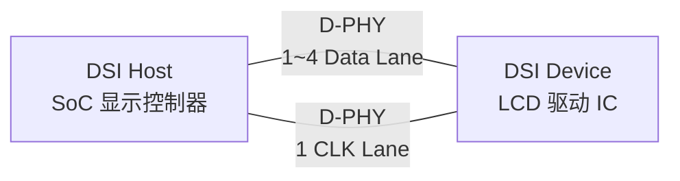
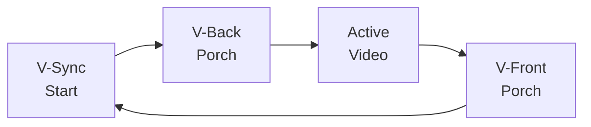

# MIPI-DSI 显示接口 [I]

> **本章学习目标**：
> - 理解 <span class="red">MIPI-DSI</span> 的两种工作模式（命令模式/视频模式）的电气差异
> - 掌握 DCS 命令集的核心指令与 LCD 初始化序列
> - 了解 DSI 显示时序的帧结构与 RGB 数据包组织

---

## DSI 命令模式与视频模式

---

### <strong>DSI 链路架构</strong>

<span class="badge-i">I</span><br>
<span class="red">MIPI-DSI（Display Serial Interface）</span> 是 MIPI 联盟定义的高速串行显示接口，通过 D-PHY 物理层连接主控制器与 LCD 面板。<br>



<span class="blue">DSI 如同视频会议的专线——CLK Lane 是"心跳节拍"，Data Lane 是"图像数据流"，多条 Lane 并行提升带宽。</span><br>

<span class="orange"><strong>1. 命令模式（Command Mode）</strong></span><br>
* 类似 CPU 访问显存，主控通过 DSI 发送 DCS 命令读写 LCD 寄存器。<br>
* 显示数据写入 LCD 内部 GRAM（Graphic RAM），由 LCD 驱动 IC 自主刷新。<br>
* 适合静态界面或低功耗场景（如智能手表）。<br>

<span class="orange"><strong>2. 视频模式（Video Mode）</strong></span><br>
* 类似 VGA/HDMI 的实时像素流，主控持续发送 RGB 像素数据。<br>
* LCD 无内部大容量 GRAM，像素数据直接驱动像素阵列。<br>
* 适合视频播放、动态 UI（如手机、平板）。<br>

**表 2-1：两种模式对比**

| 特性 | 命令模式 | 视频模式 |
| --- | --- | --- |
| 数据流 | 命令+数据突发 | 连续像素流 |
| LCD GRAM | 需要 | 不需要 |
| 功耗 | 低（可停时钟） | 高（持续传输） |
| 带宽需求 | 低 | 高 |
| 应用场景 | 静态 UI、低功耗 | 视频、动态游戏 |
| 主控复杂度 | 中（需管理 GRAM） | 低（纯数据流） |

---

## DCS 命令集

---

### <strong>显示命令集核心指令</strong>

<span class="badge-i">I</span><br>
<span class="red">DCS（Display Command Set）</span> 是 MIPI 联盟定义的标准 LCD 控制命令集，统一了不同厂商的初始化流程。<br>

**表 2-2：DCS 核心命令表**

| 命令 | 代码 | 参数 | 功能 |
| --- | --- | --- | --- |
| Soft Reset | 0x01 | 无 | 复位 LCD 控制器 |
| Sleep In | 0x10 | 无 | 进入睡眠模式 |
| Sleep Out | 0x11 | 无 | 退出睡眠模式 |
| Display Off | 0x28 | 无 | 关闭显示 |
| Display On | 0x29 | 无 | 开启显示 |
| Set Column Address | 0x2A | SC[15:0], EC[15:0] | 设置列范围 |
| Set Page Address | 0x2B | SP[15:0], EP[15:0] | 设置行范围 |
| Write Memory Start | 0x2C | 像素数据 | 写入 GRAM |
| Read Memory Start | 0x2E | — | 读取 GRAM |
| Set Pixel Format | 0x3A | 1 Byte | 16/18/24 bit |
| Set Tear On | 0x35 | 1 Byte | 使能撕裂效应输出 |

<span class="orange"><strong>3. 初始化序列示例</strong></span><br>

```c
// DSI LCD 初始化序列（命令模式）
// 文件：dsi_lcd_init.c

void dsi_lcd_init(void) {
    // 1. 软件复位
    dsi_dcs_write(0x01, NULL, 0);
    mdelay(5);
    
    // 2. 退出睡眠
    dsi_dcs_write(0x11, NULL, 0);
    mdelay(120);   // 等待 LCD 电源稳定
    
    // 3. 设置像素格式 24bpp
    uint8_t pixel_fmt = 0x77;  // RGB 888
    dsi_dcs_write(0x3A, &pixel_fmt, 1);
    
    // 4. 设置显示窗口（全屏 1080x1920）
    uint8_t col_addr[] = {0x00, 0x00, 0x04, 0x37};  // 0~1087
    uint8_t row_addr[] = {0x00, 0x00, 0x07, 0x7F};  // 0~1919
    dsi_dcs_write(0x2A, col_addr, 4);
    dsi_dcs_write(0x2B, row_addr, 4);
    
    // 5. 开显示
    dsi_dcs_write(0x29, NULL, 0);
}
```

---

## 显示时序

---

### <strong>DSI 数据包结构</strong>

<span class="badge-i">I</span><br>
<span class="red">DSI 数据包</span> 分为短包（Short Packet，4 Byte）与长包（Long Packet，6~65541 Byte）两种格式。<br>

**表 2-3：DSI 数据包头结构**

| 字段 | 短包 | 长包 | 说明 |
| --- | --- | --- | --- |
| Data Identifier | 1 B | 1 B | VC[1:0] + DT[5:0] |
| Word Count | — | 2 B | 数据负载长度 |
| Data | 2 B | N B | 命令/像素数据 |
| ECC | 1 B | 1 B | 纠错码 |
| Checksum | — | 2 B | 负载 CRC |

<span class="blue">DSI 数据包如同信封——短包是明信片（简洁，4 Byte），长包是挂号信（可装大量数据，需校验）。</span><br>

<span class="orange"><strong>4. 视频模式时序</strong></span><br>



* 水平同步（H-Sync）：每行开始。
* 垂直同步（V-Sync）：每帧开始。
* 消隐期（Blanking）：不传输有效像素，可插入命令包。

**表 2-4：1080p60 视频模式 DSI 时序**

| 参数 | 值 | 说明 |
| --- | --- | --- |
| 分辨率 | 1920×1080 | 全高清 |
| 刷新率 | 60 Hz | |
| 颜色深度 | 24 bit | RGB888 |
| 每帧像素 | 2,073,600 | 1920×1080 |
| 每帧数据 | 6,220,800 Byte | ×3 Byte |
| 有效带宽 | ~373 MB/s | 含消隐期 |
| 所需 Lane | 4 | 4×1Gbps D-PHY |

---

## 本章小结

| 小节 | 核心要点 |
| --- | --- |
| DSI 两种模式 | 命令模式（GRA M+低功耗）vs 视频模式（实时流+高带宽） |
| DCS 命令集 | 0x01/0x10/0x11/0x28/0x29 等核心指令，初始化序列标准 |
| 显示时序 | 短包/长包格式，V/H Sync+Blanking，1080p60 需 4 Lane |

---

## 练习

1. **模式选择**：某智能手表显示屏 240×280，静态 UI 为主。分析应选择命令模式还是视频模式，从功耗与带宽角度论证。

2. **命令构造**：构造一个 DCS 命令序列，将 LCD 显示窗口设置为从 (100,200) 到 (400,600) 的子区域，并写入一帧 RGB565 数据。

3. **带宽计算**：某 2K 屏分辨率 2560×1440，刷新率 120Hz，RGB888。计算所需 DSI Lane 数（单 Lane 速率上限 1.5 Gbps）。


---

## 历史演进与发展趋势

<span class="red">MIPI-DSI</span>的发展历史与智能手机显示屏分辨率提升同步。2005 年 MIPI Alliance 发布 DSI 1.0，定义了基于 D-PHY 的高速差分对物理层与包格式。2010 年前后，720p 屏幕普及推动 DSI 进入单通道 1Gbps 时代；2014 年 DSI 1.2 引入双通道与压缩传输（DSC），支持 2K 分辨率。2020 年代，DSI 与 DSC 1.2 结合，为 4K 车载显示屏与折叠屏手机提供带宽与功耗的最优平衡。
<br>

<span class="blue">未来趋势：DSI 将继续与 VESA DSC 压缩技术深度结合；在车载领域，DSI 有望成为替代 LVDS 的主流显示接口标准。</span>
<br>