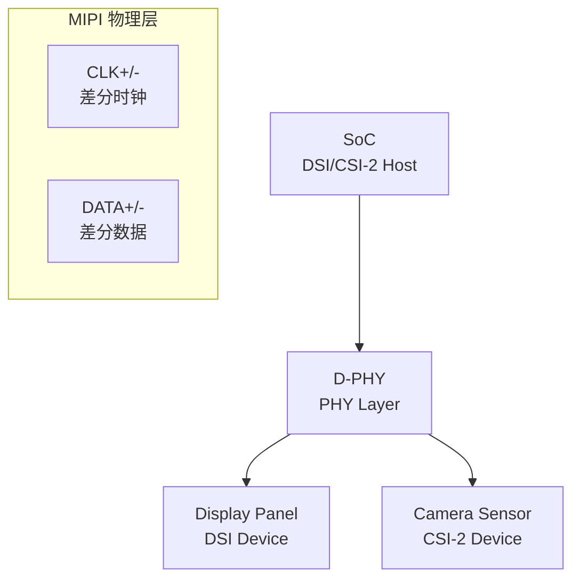

# MIPI 嵌入式实战 [I]

> **本章学习目标**：
> - 掌握 DSI LCD 的初始化序列与 GPIO 复位时序
> - 理解 CSI-2 摄像头的硬件连接与 D-PHY 速率配置
> - 了解 D-PHY 信号调节参数对眼图与 EMI 的影响

---


---

## 需求分析：为什么需要 MIPI 嵌入式实战

---

### <strong>为什么 MIPI 嵌入式实战 成为行业刚需</strong>

<span class="red">MIPI 嵌入式实战</span>是将 DSI/CSI-2 协议转化为可量产显示与摄像系统的必经阶段。为何 MIPI 链路在理论上简单，但在板级调试中频繁出现黑屏、花屏或图像撕裂？因为 MIPI 的高速差分信号对阻抗匹配、时钟对齐与初始化时序极为敏感。
<br>

<span class="blue">实战的必要性：MIPI 的高速模式（HS）与低功耗模式（LP）切换涉及复杂的时序要求；只有借助逻辑分析仪抓取 LP 初始化序列，并通过设备树精确配置 D-PHY 参数，才能确保链路稳定工作。</span>
<br>


### <strong>MIPI 链路拓扑</strong>



## DSI LCD 初始化

---

### <strong>上电与复位时序</strong>

<span class="badge-i">I</span><br>
<span class="red">DSI LCD 初始化</span> 需严格遵守上电顺序，错误的时序可能导致 LCD 驱动 IC 锁死或损坏。<br>

**表 4-1：典型 LCD 上电时序**

| 阶段 | 信号 | 电压 | 延迟要求 |
| --- | --- | --- | --- |
| 1 | IOVCC | 1.8V | 先于 AVDD 上电 |
| 2 | RESET | 低电平 | 持续 ≥ 10 ms |
| 3 | RESET 释放 | 高电平 | 等待 ≥ 5 ms |
| 4 | AVDD | 2.8V | IOVCC 稳定后 |
| 5 | AVDD 稳定 | — | 等待 ≥ 20 ms |
| 6 | DSI 命令 | — | 发送初始化序列 |

<span class="blue">LCD 上电如同火箭发射——燃料（电源）必须按严格顺序加注，点火（复位释放）时机不可提前或延后。<br>

<span class="orange"><strong>1. 初始化代码</strong></span><br>

```c
// DSI LCD 初始化（Linux DRM 框架）
// 文件：panel-xxx.c

static int panel_prepare(struct drm_panel *panel) {
    struct panel_ctx *ctx = container_of(panel, struct panel_ctx, panel);
    
    // 1. 使能 IOVCC (1.8V)
    regulator_enable(ctx->iovcc);
    usleep_range(1000, 2000);
    
    // 2. 拉低 RESET ≥ 10ms
    gpiod_set_value(ctx->reset, 1);
    msleep(10);
    
    // 3. 释放 RESET，等待 ≥ 5ms
    gpiod_set_value(ctx->reset, 0);
    msleep(5);
    
    // 4. 使能 AVDD (2.8V)
    regulator_enable(ctx->avdd);
    msleep(20);
    
    // 5. 发送 DSI 初始化命令序列
    mipi_dsi_dcs_write_seq(dsi, init_seq, ARRAY_SIZE(init_seq));
    
    return 0;
}
```

---

## CSI-2 摄像头

---

### <strong>硬件连接与接口配置</strong>

<span class="badge-i">I</span><br>
<span class="red">CSI-2 摄像头</span> 的硬件设计涉及 D-PHY 走线、电源去耦与 I2C 控制接口。<br>

**表 4-2：CSI-2 硬件设计要点**

| 参数 | 要求 | 说明 |
| --- | --- | --- |
| D-PHY 差分阻抗 | 100 Ω ± 10% | 单端 50 Ω |
| 对内长度匹配 | ± 5 mil | 线对内部等长 |
| 对间长度匹配 | ± 20 mil | 不同 Lane 间等长 |
| CLK-Data 延迟 | Data 领先 CLK ≤ 2 mm | 源同步时序 |
| 电源去耦 | 每电源引脚 0.1 μF + 1 μF | 抑制高频噪声 |
| I2C 上拉 | 1.8V，2.2 kΩ | 摄像头控制总线 |

<span class="orange"><strong>2. D-PHY 速率配置</strong></span><br>
* 速率 = (分辨率宽 × 高 × 色深 × 帧率) / (Lane 数 × 效率)。<br>
* D-PHY v1.2 单 Lane 最高 1.5 Gbps，v2.0 最高 2.5 Gbps。<br>
* 速率通过 I2C 写入摄像头寄存器（如 0x0304~0x0305）配置。<br>

```c
// 摄像头 MIPI 速率配置
// 文件：sensor_mipi_config.c

void sensor_set_mipi_rate(struct v4l2_subdev *sd, u32 lane_rate) {
    // lane_rate 单位: Mbps
    // 计算分频系数，写入 PLL 寄存器
    u16 pll_multiplier = lane_rate / 12;  // 假设输入时钟 12 MHz
    
    i2c_write_reg(sd, 0x0304, (pll_multiplier >> 8) & 0xFF);
    i2c_write_reg(sd, 0x0305, pll_multiplier & 0xFF);
    
    // 更新 Lane 数
    i2c_write_reg(sd, 0x0114, 0x03);  // 4 Lane
}
```

---

## D-PHY 调节

---

### <strong>信号完整性优化</strong>

<span class="badge-i">I</span><br>
<span class="red">D-PHY 信号调节</span> 通过调整驱动强度、预加重、端接电阻等参数优化眼图与 EMI。<br>

**表 4-3：D-PHY 调节参数**

| 参数 | 调节范围 | 影响 | 优化方向 |
| --- | --- | --- | --- |
| 驱动电流 | 1~4 mA | 信号幅度 | 幅度不足→增大；EMI超标→减小 |
| 预加重 | 0~3 dB | 高频分量 | 长走线→增大；短走线→关闭 |
| 端接电阻 | 80~120 Ω | 反射抑制 | 阻抗不匹配→调节至100Ω |
| 共模电压 | 200~400 mV | 眼图高度 | 接收端裕量不足→增大 |
| 摆率 | 可控 | 上升/下降时间 | EMI→降低摆率；高速→提高摆率 |

<span class="blue">D-PHY 调节如同音响均衡器——驱动电流是"音量"，预加重是"高音增强"，端接电阻是"房间吸音"。<br>

<span class="orange"><strong>3. 眼图测量标准</strong></span><br>
* D-PHY 眼图测试需满足 MIPI 联盟 CTS（Compliance Test Specification）。<br>
* 关键指标：眼高 ≥ 70 mV，眼宽 ≥ 0.7 UI，抖动 < 0.3 UI。<br>
* 使用示波器+差分探头测量，触发源为 CLK Lane。<br>

---

## 本章小结

| 小节 | 核心要点 |
| --- | --- |
| DSI LCD 初始化 | IOVCC→RESET→AVDD 严格时序，10ms低电平复位，DSI命令序列发送 |
| CSI-2 摄像头 | 100Ω差分阻抗，±5mil等长，I2C配置PLL分频系数，Lane数寄存器 |
| D-PHY 调节 | 驱动电流/预加重/端接电阻/共模电压四参数，眼图CTS标准 |

---

## 练习

1. **时序设计**：某 LCD 要求 RESET 低电平 ≥ 20 ms，AVDD 稳定后 ≥ 30 ms 才能发命令。写出满足要求的 GPIO 控制序列（含延迟）。

2. **走线计算**：某 4-Lane CSI-2 设计，Data0 走线 35 mm，Data1 走线 38 mm，CLK 走线 40 mm。分析各线对长度匹配是否符合要求，给出调整建议。

3. **眼图优化**：某 D-PHY 眼图测试显示眼宽仅 0.5 UI（要求 0.7 UI）。列出 3 个可能的硬件层原因及对应的调节参数。


---

## 历史演进与发展趋势

<span class="red">MIPI 嵌入式实战</span>的技术积累始于 2010 年代 Android 智能手机的 Linux 内核移植。早期 DSI 与 CSI-2 驱动由芯片厂商私有实现，缺乏统一框架。随着 Linux V4L2 与 DRM/KMS 子系统的成熟，MIPI 显示与摄像头驱动逐步纳入标准化管道。设备树（DeviceTree）成为描述 MIPI 链路拓扑的核心机制，D-PHY 控制器、DSI/CSI-2 主机、面板/传感器设备均通过设备树节点关联。近年来，MIPI 调试工具（如逻辑分析仪与示波器协议解码插件）的普及进一步降低了实战门槛。其发展历史与 Android/Linux 生态的成熟密不可分。
<br>

<span class="blue">未来趋势：MIPI 实战将更加依赖设备树与内核子系统的标准化配置；用户态的 libcamera 与 KMS 工具链也在降低 MIPI 开发的上手难度。</span>
<br>