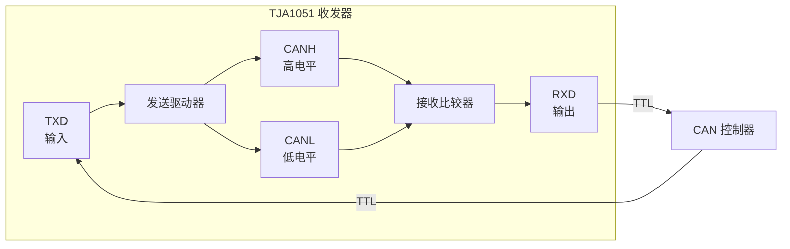
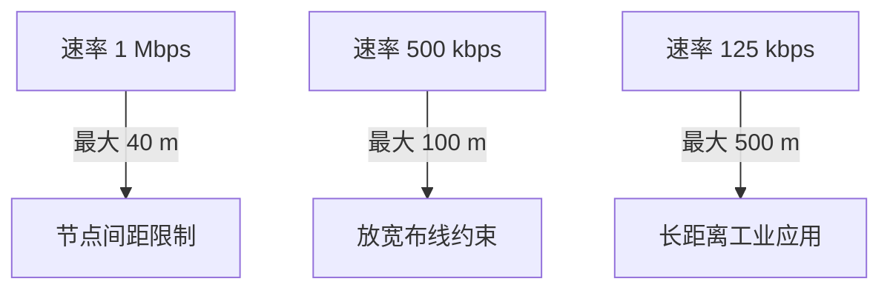

# CAN 物理层与收发器 [I]

> **本章学习目标**：
> - 理解CAN 收发器的内部结构与信号转换机制
> - 掌握终端电阻的阻抗匹配原理与总线拓扑约束
> - 了解共模电压的产生原因及其对通信可靠性的影响

---

## CAN 收发器（TJA1051）

---

### <strong>收发器内部架构</strong>

I 
CAN 收发器是 CAN 控制器与物理总线之间的桥梁，负责 TTL/CMOS 电平与差分总线电平的相互转换。 
以 NXP TJA1051 为例，其内部包含发送驱动器、接收比较器、故障保护逻辑与模式控制四部分。 

收发器的本质是一个双向电平转换器+总线驱动器，其电气性能直接决定总线速率与节点数上限。 

**表 2-1：TJA1051 关键电气参数**

| 参数 | 符号 | 最小值 | 典型值 | 最大值 | 单位 |
| --- | --- | --- | --- | --- | --- |
| 供电电压 | VCC | 4.5 | 5.0 | 5.5 | V |
| 显性输出 CANH | VOH | 3.0 | 3.5 | 4.5 | V |
| 显性输出 CANL | VOL | 0.5 | 1.5 | 2.0 | V |
| 隐性输出 CANH/CANL | Vrecessive | 2.0 | 2.5 | 3.0 | V |
| 差分输出显性 | Vdiff | 1.5 | 2.0 | 3.0 | V |
| 差分输出隐性 | Vdiff | -0.5 | 0 | 0.05 | V |
| 传播延迟 | tpd | — | 70 | 120 | ns |
| 待机电流 | ICC_stb | — | 5 | 15 | μA |

<strong>1. 发送驱动器</strong> 
* 将 TXD 端的 TTL 信号转换为 CANH/CANL 差分信号。 
* 显性位（Dominant）：CANH ≈ 3.5V，CANL ≈ 1.5V，差分 ≈ 2V。 
* 隐性位（Recessive）：CANH ≈ CANL ≈ 2.5V，差分 ≈ 0V。 

<strong>2. 接收比较器</strong> 
* 检测 CANH-CANL 的差分电压，与阈值（约 0.9V）比较。 
* 差分 > 0.9V → 输出显性（RXD=低）；差分 < 0.5V → 输出隐性（RXD=高）。 

<strong>3. 故障保护</strong> 
* TXD 显性超时保护：TXD 长时间低电平时自动关断驱动器，防止总线死锁。 
* 总线短路保护：CANH 对电源/地短路时，限制输出电流，避免器件烧毁。 

---

## 终端电阻

---

### <strong>阻抗匹配原理</strong>

I 
终端电阻的作用是消除总线末端的信号反射，确保差分信号完整传输。 
CAN 总线特性阻抗约为 120Ω，因此终端电阻标准值为 120Ω。 

类比：终端电阻如同长跑赛道的终点缓冲带——吸收跑到终点的动能，防止运动员反弹回来撞到后续选手。 

<strong>1. 单终端 vs 双终端</strong> 
* 标准拓扑：总线两端各接一个 120Ω 电阻，并联后总线直流电阻约 60Ω。 
* 短距离/低速场景：可仅在一端接 120Ω，但抗反射能力减弱。 

<strong>2. 终端电阻位置</strong> 
* 必须放置在总线物理两端，而非任意节点处。 
* 星型拓扑（Stub）过长时，信号在 Stub 末端反射，应在星型中心接终端电阻。 

**表 2-2：总线拓扑与终端电阻配置**

| 拓扑 | 总线长度 | 终端电阻数量 | 阻值配置 | 适用场景 |
| --- | --- | --- | --- | --- |
| 干线型 | < 40 m | 2 | 120Ω ×2 | 标准车载网络 |
| 干线型 | 40~100 m | 2 | 120Ω ×2 | 低速/节点少 |
| 星型 | — | 1 | 120Ω ×1 | 诊断接口 |
| 双分叉 | — | 2 | 120Ω ×2 | 主干+分支结构 |

---

### <strong>总线长度与速率约束</strong>

I 
总线长度与通信速率成反比，受限于信号传播延迟与位定时参数。 

**表 2-3：CAN 速率与总线长度对应关系**

| 波特率 | 最大总线长度 | 最大节点数 | 位时间 | 采样点 |
| --- | --- | --- | --- | --- |
| 1 Mbps | 40 m | 30 | 1 μs | 75%~87.5% |
| 500 kbps | 100 m | 32 | 2 μs | 75%~87.5% |
| 250 kbps | 250 m | 64 | 4 μs | 75%~87.5% |
| 125 kbps | 500 m | 64 | 8 μs | 75%~87.5% |
| 50 kbps | 1 km | 64 | 20 μs | 75%~87.5% |
| 20 kbps | 2.5 km | 64 | 50 μs | 75%~87.5% |

<strong>3. 位定时参数</strong> 
* 每个位时间分为同步段（SYNC_SEG）、传播段（PROP_SEG）、相位缓冲段 1/2（PHASE_SEG1/2）。 
* 采样点位于 PHASE_SEG1 结束处，通常为位时间的 75%~87.5%。 

---

## 共模电压

---

### <strong>共模电压的来源与影响</strong>

I 
共模电压（Vcm）是 CANH 与 CANL 对地的平均电压，即 Vcm = (CANH + CANL) / 2。 
理想情况下，隐性位的 Vcm 约为 2.5V；显性位时因 CANH 升高、CANL 降低，Vcm 可能偏离。 

共模电压如同水面高度——理想状态是平静的湖面，但风浪（噪声）会使其起伏，过高或过低都会淹没信号。 

**表 2-4：共模电压参数**

| 参数 | 最小值 | 典型值 | 最大值 | 单位 |
| --- | --- | --- | --- | --- |
| 隐性位共模电压 | -2.0 | 2.5 | +7.0 | V |
| 显性位共模电压 | -2.0 | 2.5 | +7.0 | V |
| 共模电压漂移速率 | — | — | 1.0 | V/μs |
| 收发器共模范围 | -12 | — | +12 | V |

<strong>1. 直流共模偏移</strong> 
* 由收发器供电差异、总线偏置电阻不对称引起。 
* 严重偏移会导致接收端比较器阈值漂移，产生误码。 

<strong>2. 交流共模噪声</strong> 
* 由电机、点火线圈、逆变器等设备产生的电磁干扰引起。 
* 共模扼流圈（Common Mode Choke）可抑制高频共模噪声。 

<strong>3. 地电位差</strong> 
* 长距离布线时，不同节点的地电位可能存在数伏差异。 
* CAN 总线采用差分传输的目的正是抑制地电位差的影响，但需在收发器共模范围内。 

---

## 技术演进与发展历史

CAN总线的发展历史可追溯至20世纪80年代。1986年，德国Bosch公司为解决汽车内部线束过多、通信可靠性低下的痛点，率先提出了CAN协议的概念。1991年，CAN 2.0规范正式发布，并迅速被 Mercedes-Benz W140 等高端车型采用。此后，CAN从汽车行业扩展至工业自动化、轨道交通、医疗设备等领域，逐步演化出CANopen、DeviceNet等上层协议。2012年，Bosch推出CAN FD（Flexible Data-rate），将数据段速率提升至8 Mbps，有效载荷扩展至64字节，标志着CAN技术进入新的演进阶段。如今，CAN FD与经典CAN并存，共同支撑着全球数十亿节点的实时通信需求。

 

---

## 本章小结

| 小节 | 核心要点 |
| --- | --- |
| CAN 收发器 | TJA1051 实现 TTL↔差分转换，显性/隐性差分电压 2V/0V，带故障保护 |
| 终端电阻 | 120Ω ×2 消除反射，拓扑决定配置，速率与总线长度成反比 |
| 共模电压 | 理想 2.5V，地电位差与噪声是主要干扰源，差分传输提供抑制能力 |

---

## 练习

1. **电气计算**：某 CAN 总线两端各接 120Ω 终端电阻，总线供电 5V。计算总线空闲时的直流电流。若某节点短路将 CANH 拉到 0V，总线差分电压变为多少？

2. **拓扑设计**：某车间需部署 20 个 CAN 节点，总线长度 80 m，要求速率 250 kbps。设计总线拓扑并计算终端电阻配置。

3. **故障排查**：某 CAN 网络偶发帧错误，示波器显示隐性位共模电压在 4V~5V 之间波动。列出 3 个可能原因及排查步骤。
