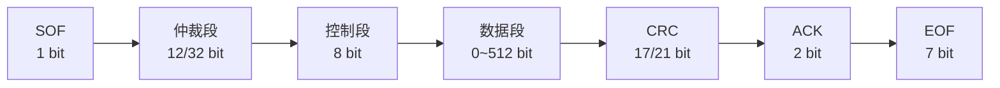
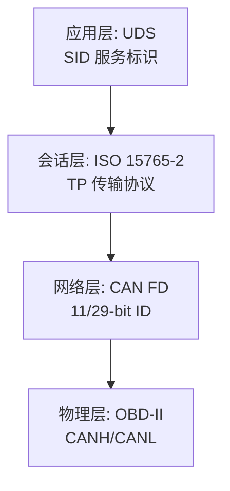

# CAN FD 与诊断 [I→E]

> **本章学习目标**：
> - 理解CAN FD 帧格式与传统 CAN 的关键差异
> - 掌握 DLC 编码规则与数据长度映射关系
> - 了解 OBD-II 诊断接口的物理层与协议栈

---

## CAN FD 帧格式

---

### <strong>从 CAN 到 CAN FD 的演进</strong>

I 
CAN FD（CAN with Flexible Data-rate）是 Bosch 在 2012 年发布的 CAN 升级版，核心改进是支持可变数据速率与更长数据域。
 

类比：传统 CAN 是限速 60km/h 的国道，CAN FD 是高速+城区双速公路——仲裁段限速 60km/h（保证兼容性），数据段可飙至 120km/h。 

**表 3-1：CAN vs CAN FD 对比**

| 特性 | CAN 2.0B | CAN FD |
| --- | --- | --- |
| 最大速率（仲裁段） | 1 Mbps | 1 Mbps |
| 最大速率（数据段） | 1 Mbps | 8 Mbps |
| 数据域长度 | 0~8 byte | 0~64 byte |
| CRC 位数 | 15 bit | 17/21 bit |
| CRC 填充规则 | 固定 | 动态填充位 |
| 帧结束 | 7 个隐性位 | 7 个隐性位 |
| 兼容性 | — | 可与 CAN 2.0 共存 |

<strong>1. 双速机制（Dual Bit Rate）</strong> 
* 仲裁段（ID + RTR + IDE）沿用传统 CAN 速率（≤1 Mbps），确保多主仲裁正确性。 
* 数据段（DLC + Data + CRC）切换至高速率（最高 8 Mbps），缩短数据传输时间。 

<strong>2. 更长的数据域</strong> 
* CAN FD 支持 0~64 byte 数据，是 CAN 2.0 的 8 倍。 
* 长数据域减少了协议开销占比，提升有效带宽利用率。 

---

### <strong>CAN FD 帧结构详解</strong>

E 
CAN FD 帧由起始位、仲裁段、控制段、数据段、CRC 段、ACK 段与帧结束组成。
 

<strong>1. 控制段新字段</strong> 
* **FDF（FD Format）**：隐性位表示 CAN FD 帧，显性位表示传统 CAN 帧。 
* **BRS（Bit Rate Switch）**：隐性位表示数据段切换至高速率，显性位表示保持原速率。 
* **ESI（Error State Indicator）**：隐性位表示发送节点处于被动错误状态。 

<strong>2. 填充位规则变化</strong> 
* 传统 CAN：每 5 个连续同极性位插入 1 个反向填充位。 
* CAN FD：CRC 段采用固定填充位（Stuff Bit Counter + 奇偶校验），增强错误检测能力。 

---

## DLC 编码

---

### <strong>DLC 与数据长度映射</strong>

I 
DLC（Data Length Code）是 CAN/CAN FD 帧中用于指示数据域长度的 4-bit 字段。
 

**表 3-2：DLC 编码与数据长度映射**

| DLC | 传统 CAN 数据长度 | CAN FD 数据长度 | 备注 |
| --- | --- | --- | --- |
| 0 | 0 byte | 0 byte | 无数据 |
| 1 | 1 byte | 1 byte | — |
| 2 | 2 byte | 2 byte | — |
| 3 | 3 byte | 3 byte | — |
| 4 | 4 byte | 4 byte | — |
| 5 | 5 byte | 5 byte | — |
| 6 | 6 byte | 6 byte | — |
| 7 | 7 byte | 7 byte | — |
| 8 | 8 byte | 8 byte | 传统 CAN 最大 |
| 9 | — | 12 byte | CAN FD 扩展 |
| 10 | — | 16 byte | CAN FD 扩展 |
| 11 | — | 20 byte | CAN FD 扩展 |
| 12 | — | 24 byte | CAN FD 扩展 |
| 13 | — | 32 byte | CAN FD 扩展 |
| 14 | — | 48 byte | CAN FD 扩展 |
| 15 | — | 64 byte | CAN FD 最大 |

CAN FD 的 DLC 编码采用非线性步进，小数据包保持高粒度，大数据包以更大步长扩展，平衡编码效率与灵活性。 

---

## OBD-II 诊断

---

### <strong>OBD-II 物理接口</strong>

I 
OBD-II（On-Board Diagnostics II）是汽车标准化诊断接口，统一采用 16-pin D-Sub 连接器。
 

**表 3-3：OBD-II 引脚定义**

| 引脚 | 信号 | 说明 |
| --- | --- | --- |
| 2 | J1850 Bus+ | SAE J1850 PWM/VPW 总线正 |
| 4 | Chassis GND | 车身地 |
| 5 | Signal GND | 信号地 |
| 6 | CAN-H | ISO 15765-4 CAN 高 |
| 7 | K-Line | ISO 9141-2 / ISO 14230 (KWP2000) |
| 10 | J1850 Bus- | SAE J1850 PWM 总线负 |
| 14 | CAN-L | ISO 15765-4 CAN 低 |
| 16 | Battery+ | 常电 12V |

<strong>1. 引脚标准化</strong> 
* 引脚 4/5/16 为必接电源/地，其余引脚因协议而异。 
* 现代车辆主要使用引脚 6/14（CAN-H/CAN-L）进行诊断通信。 

---

### <strong>诊断协议栈</strong>

E 
UDS（Unified Diagnostic Services）是当前主流诊断协议，基于 ISO 14229 标准，运行于 CAN/CAN FD 之上。
 

<strong>2. UDS 服务请求格式</strong> 
* 请求帧：SID（1 byte）+ 子功能/参数（N byte）。 
* 响应帧：正向响应 = Request SID + 0x40 + 数据；负向响应 = 0x7F + SID + NRC。 

**表 3-4：常用 UDS 服务**

| SID | 服务名 | 功能 |
| --- | --- | --- |
| 0x10 | Diagnostic Session Control | 切换诊断会话（默认/扩展/编程） |
| 0x11 | ECU Reset | 复位 ECU |
| 0x22 | Read Data By Identifier | 按 DID 读取数据 |
| 0x2E | Write Data By Identifier | 按 DID 写入数据 |
| 0x34 | Request Download | 请求下载数据（刷写） |
| 0x3E | Tester Present | 保持会话活跃 |

<strong>3. 多帧传输</strong> 
* ISO 15765-2（ISO-TP）定义了 CAN 上的分段传输协议。 
* 单帧（SF）：数据 ≤ 7 byte（CAN）/ ≤ 63 byte（CAN FD）。 
* 首帧（FF）+ 连续帧（CF）+ 流控帧（FC）：用于长数据传输。 

---

## 技术演进与发展历史

CAN总线的发展历史可追溯至20世纪80年代。1986年，德国Bosch公司为解决汽车内部线束过多、通信可靠性低下的痛点，率先提出了CAN协议的概念。1991年，CAN 2.0规范正式发布，并迅速被 Mercedes-Benz W140 等高端车型采用。此后，CAN从汽车行业扩展至工业自动化、轨道交通、医疗设备等领域，逐步演化出CANopen、DeviceNet等上层协议。2012年，Bosch推出CAN FD（Flexible Data-rate），将数据段速率提升至8 Mbps，有效载荷扩展至64字节，标志着CAN技术进入新的演进阶段。如今，CAN FD与经典CAN并存，共同支撑着全球数十亿节点的实时通信需求。

 

---

## 本章小结

| 小节 | 核心要点 |
| --- | --- |
| CAN FD 帧格式 | 双速机制（仲裁≤1M，数据≤8M），64 byte 数据域，FDF/BRS/ESI 新字段 |
| DLC 编码 | 0~8 线性映射，9~15 非线性扩展至 12/16/20/24/32/48/64 byte |
| OBD-II 诊断 | 16-pin 接口，引脚 6/14 为 CAN，UDS 基于 ISO-TP 多帧传输 |

---

## 练习

1. **帧结构分析**：某 CAN FD 帧 BRS=1，数据段速率 4 Mbps，数据长度 32 byte。计算该帧数据段的传输时间，并与传统 CAN（1 Mbps，8 byte）对比效率提升倍数。

2. **DLC 编码**：设计一个 CAN FD 帧发送 20 byte 数据，DLC 应设为多少？若误设为 DLC=8，接收端会怎样处理？

3. **诊断实战**：使用 UDS 服务 0x22 读取 ECU 的 VIN 码（DID=0xF190，17 byte）。写出完整的 ISO-TP 多帧请求/响应序列（假设使用 CAN FD，单帧可携带 63 byte payload）。
