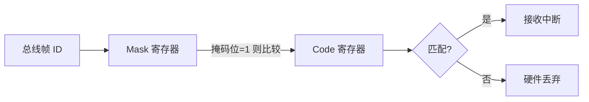
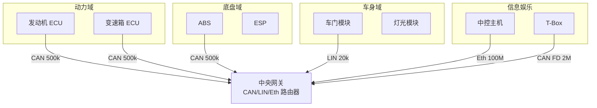

# CAN 嵌入式实战 [I]

> **本章学习目标**：
> - 掌握 Linux <span class="red">SocketCAN</span> 的接口配置与 can-utils 工具链
> - 理解 CAN 报文过滤的硬件掩码机制与软件实现
> - 了解汽车网关设计的拓扑结构与路由策略

---

## SocketCAN 配置

---

### <strong>接口启用与参数设置</strong>

<span class="badge-i">I</span><br>
<span class="red">SocketCAN</span>是 Linux 内核的 CAN 网络子系统，将 CAN 设备抽象为网络接口，支持标准 BSD Socket API。
<br>

<span class="blue">SocketCAN 的设计哲学是"CAN 即网络"——用熟悉的 ifconfig/ip 工具管理 CAN 接口，用 socket() 读写 CAN 帧。</span><br>

**表 4-1：CAN 接口常用配置命令**

| 命令 | 作用 | 示例 |
| --- | --- | --- |
| ip link set can0 up type can bitrate 500000 | 启动接口并设置波特率 | 500 kbps 标准 CAN |
| ip link set can0 up type can bitrate 500000 dbitrate 2000000 fd on | 启用 CAN FD | 仲裁 500k，数据 2M |
| cansend can0 123#DEADBEEF | 发送标准帧 | ID=0x123，数据 4 byte |
| candump can0 | 接收并打印所有帧 | 实时监听 |
| cansniffer can0 | 交互式帧分析 | 高亮变化字段 |

<span class="orange"><strong>1. 接口启动流程</strong></span><br>

```bash
# 加载 CAN 驱动（通常内核已内置）
modprobe can
modprobe can_raw
modprobe vcan          # 虚拟 CAN 用于测试

# 创建虚拟 CAN 接口（测试环境）
ip link add dev vcan0 type vcan
ip link set vcan0 up

# 配置真实 CAN 接口
ip link set can0 down
ip link set can0 up type can bitrate 500000 \
    sample-point 0.875 sjw 1
```

<span class="orange"><strong>2. 位定时参数计算</strong></span><br>

```bash
# 使用 can-calc-bit-timing 自动计算
$ can-calc-bit-timing can0 500000
Bit timing parameters:
  Nominal bitrate: 500000
  Sample point:    87.5%
  TSEG1: 14, TSEG2: 2, SJW: 1, BRP: 2
```

---

## CAN 报文过滤

---

### <strong>硬件过滤机制</strong>

<span class="badge-i">I</span><br>
<span class="red">CAN 控制器硬件过滤</span>通过接收掩码（Mask）与接收码（Code）寄存器实现，仅让匹配的 ID 通过中断通知 CPU。
<br>



<span class="blue">硬件过滤的本质是"按位与掩码后比较"——Mask 决定哪些位参与匹配，Code 决定匹配目标值。</span><br>

<span class="orange"><strong>1. 过滤规则代码</strong></span><br>

```c
// Linux SocketCAN 软件过滤示例
// 文件：can_filter.c

#include <linux/can.h>
#include <linux/can/raw.h>

int setup_filter(int sock) {
    struct can_filter rfilter[2];
    
    // 仅接收 ID = 0x123 的标准帧
    rfilter[0].can_id   = 0x123;
    rfilter[0].can_mask = CAN_SFF_MASK;  // 11-bit 标准帧全匹配
    
    // 接收 ID 0x200~0x2FF 范围内的标准帧
    rfilter[1].can_id   = 0x200;
    rfilter[1].can_mask = 0x700;        // 仅比较高 3 bit
    
    setsockopt(sock, SOL_CAN_RAW, CAN_RAW_FILTER,
               &rfilter, sizeof(rfilter));
    return 0;
}
```

<span class="orange"><strong>2. 过滤策略设计</strong></span><br>
* 精确匹配：Mask=0x7FF，Code=目标 ID，仅接收单一 ID。<br>
* 范围匹配：Mask 屏蔽低位，接收连续 ID 块。<br>
* 广播接收：Mask=0，接收所有帧（默认状态）。<br>

---

## 汽车网关设计

---

### <strong>网关拓扑结构</strong>

<span class="badge-i">I</span><br>
<span class="red">汽车网关</span>是连接不同总线域（动力域、底盘域、车身域、信息娱乐域）的核心交换节点。
<br>



<span class="blue">网关的核心职责是"域隔离+安全审计+协议转换"——动力域的紧急制动信号不应被信息娱乐域的蓝牙流量阻塞。</span><br>

**表 4-2：网关路由策略**

| 策略 | 说明 | 应用场景 |
| --- | --- | --- |
| 透明转发 | 按 ID 映射直接转发 | 同类型总线互联 |
| 协议转换 | CAN↔LIN 帧格式转换 | 跨域通信 |
| 速率转换 | CAN 500k ↔ CAN FD 2M | 新旧系统兼容 |
| 防火墙过滤 | 按 ID 白名单拦截 | 安全域隔离 |
| 信号聚合 | 多帧合并为单帧 | 减少总线负载 |

<span class="orange"><strong>1. 路由表配置</strong></span><br>

```bash
# 假设网关基于 Linux + SocketCAN + iptables
# 将 can0 (动力域) 的 ID 0x100~0x1FF 转发至 can1 (底盘域)

# 使用 can-gw 内核模块
echo 100 > /sys/class/net/can0/br_forward_mask
echo 1FF > /sys/class/net/can0/br_forward_code
ip link set can0 type can gateway can1
```

<span class="orange"><strong>2. 安全隔离</strong></span><br>
* 关键信号（如制动、转向）设置只读路由，禁止外部域写入。<br>
* 诊断接口（OBD）通过独立网关访问，与动力域物理隔离。<br>

---

## 技术演进与发展历史

CAN总线的发展历史可追溯至20世纪80年代。1986年，德国Bosch公司为解决汽车内部线束过多、通信可靠性低下的痛点，率先提出了CAN协议的概念。1991年，CAN 2.0规范正式发布，并迅速被 Mercedes-Benz W140 等高端车型采用。此后，CAN从汽车行业扩展至工业自动化、轨道交通、医疗设备等领域，逐步演化出CANopen、DeviceNet等上层协议。2012年，Bosch推出CAN FD（Flexible Data-rate），将数据段速率提升至8 Mbps，有效载荷扩展至64字节，标志着CAN技术进入新的演进阶段。如今，CAN FD与经典CAN并存，共同支撑着全球数十亿节点的实时通信需求。

<br>

---

## 本章小结

| 小节 | 核心要点 |
| --- | --- |
| SocketCAN 配置 | ip link 启停接口，can-calc-bit-timing 计算位定时，cansend/candump 收发 |
| CAN 报文过滤 | Mask+Code 硬件过滤，setsockopt 软件过滤，精确/范围/广播三种策略 |
| 汽车网关设计 | 域隔离+协议转换+安全审计，路由表配置，关键信号只读保护 |

---


## 练习

1. **接口配置**：写出在 Linux 上配置 can0 为 CAN FD 模式（仲裁 500k，数据 2M）的完整命令序列，并说明各参数含义。

2. **过滤设计**：某车身域节点需接收以下三类帧：ID=0x200（车门状态）、ID=0x210~0x21F（车窗控制）、ID=0x300（灯光）。设计一组 can_filter 规则，使用最少数量的过滤器。

3. **网关设计**：设计一个连接动力域 CAN 500k 与信息娱乐域 CAN FD 2M 的网关路由表。要求：动力域的制动信号（ID=0x110）单向转发至娱乐域；娱乐域的诊断请求（ID=0x700）禁止进入动力域。
