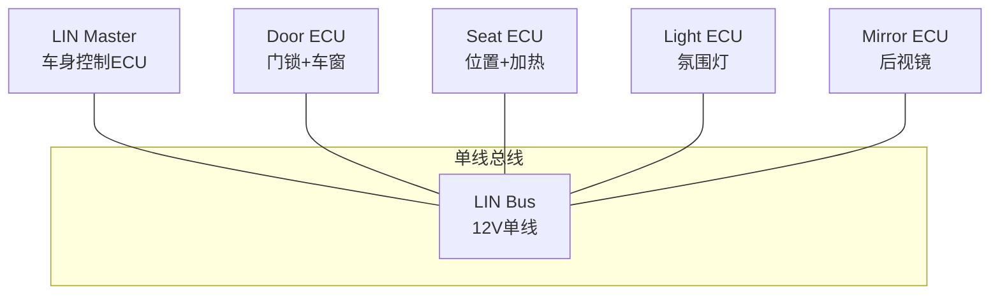
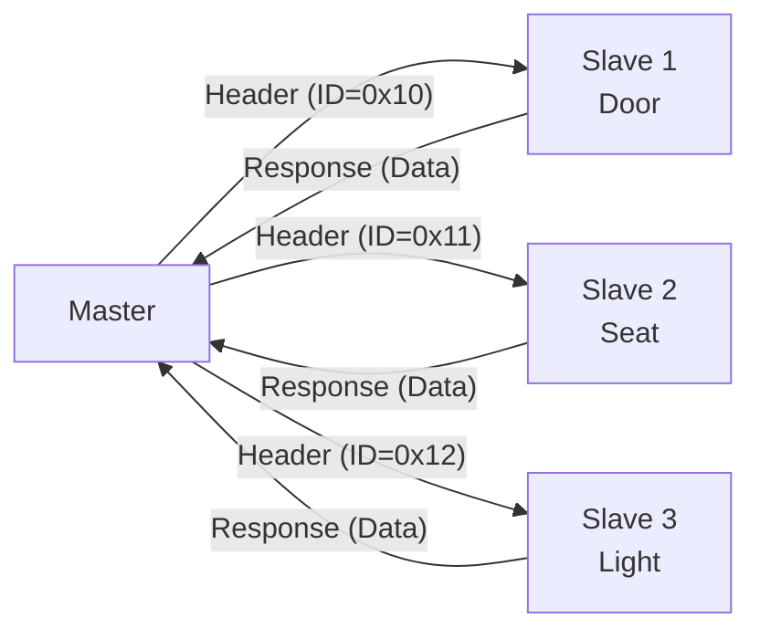

# LIN 总线基础认知与单主架构 [B→I]

<span class="badge-i">[I]</span> <span class="badge-e">[E]</span>


> **本章学习目标**：
> - 理解 <span class="red">LIN（Local Interconnect Network）</span> 的低成本设计哲学
> - 掌握 单主多从架构 与调度表机制
> - 了解 LIN 在车身电子中的典型应用场景

---

## LIN 的诞生：比 CAN 更便宜的车内总线

---

### <strong>为什么需要 LIN：CAN 太贵的地方用 LIN</strong>

<span class="red">LIN</span>由 Motorola、Volkswagen、BMW 等联盟在 <span class="green">1999 年</span>发布，
定位是 CAN 的补充而非替代。

在汽车中，CAN 的成本对某些场景来说过高：
<br>
* <span class="green">车门模块</span>：门锁、车窗、后视镜、灯光——每个车门一个 ECU，成本敏感
<br>
* <span class="green">座椅控制</span>：位置记忆、加热、通风——功能简单，不需要 CAN 的速率
<br>
* <span class="green">灯光系统</span>：氛围灯、阅读灯——低速开关信号
<br>

<span class="blue">LIN 比 CAN 便宜 50%：单线（非差分）、最高 20Kbps、基于 UART/SCI 硬件（几乎所有 MCU 都支持）、从机不需要晶振（用 RC 振荡器，靠主机同步）。</span>
<br>

<span class="blue">类比：LIN 如同"小区内部对讲系统"——不需要宽带（CAN），也不需要复杂的路由器（网关），一根电话线+简单的对讲机（单主多从）就能满足门房、保安、清洁工之间的通信需求。</span>
<br>

---

### <strong>LIN 的物理层：单线 +  UART</strong>

<span class="red">LIN</span>使用单线通信，基于 UART/SCI 硬件：

| 参数 | 值 | 说明 |
| --- | --- | --- |
| 信号线 | 1 根 | LIN 总线（复用 UART TX/RX） |
| 速率 | 1~20 Kbps | 典型 9.6K/19.2Kbps |
| 电压 | 12V（汽车电池） | 逻辑 0 = 接近 0V，逻辑 1 = 电池电压 |
| 拓扑 | 单主多从 | 1 个主机 + 最多 15 个从机 |
| 从机时钟 | ±14% 容差 | 不需要晶振，节省成本 |



<span class="blue">LIN 从机的低成本秘诀：从机不需要晶振，靠检测主机发送的 Break 字段（13 个显性位）来同步自身 RC 振荡器，允许 ±14% 的时钟偏差。</span>
<br>

---

### <strong>LIN 帧格式：Break + Sync + ID + Data + Checksum</strong>

<span class="red">LIN 帧</span>格式：

```text
Break [13 bit显性] + Sync [0x55] + ID [6 bit] + Data [0~8 byte] + Checksum [1 byte]

Break: 13 个显性位（正常 UART 起始位是 1 个显性位），用于唤醒和同步
Sync:  0x55 (01010101b)，从机用它来校准波特率
ID:    6-bit 标识符 + 2-bit 奇偶校验
Data:  0~8 byte 数据
Checksum: 经典校验和或增强校验和（含 ID）
```

---

## LIN 调度表：主机的轮询节奏

---

### <strong>为什么用调度表：确定性轮询</strong>

<span class="red">LIN 主机</span>通过调度表（Schedule Table）轮询从机：
<br>
* 调度表定义了每个帧的发送时隙
<br>
* 每个时隙包含 ID、延迟、从机响应
<br>
* 主机按表轮询，从机被动响应
<br>



---

## 技术演进与发展历史

LIN总线的诞生源于汽车电子对低成本通信方案的迫切需求。1990年代末，汽车车身领域大量使用独立的开关和传感器，若全部采用CAN总线将导致成本过高。1999年，BMW、Volkswagen、Audi、Volvo等车企联合成立了LIN协会（LIN Consortium），旨在定义一种基于UART/SCI的低成本串行通信协议。2002年，LIN 1.3规范发布；2006年升级至LIN 2.1，增加了诊断功能和节点配置能力。此后，LIN成为车身控制模块（BCM）、车门、座椅、灯光等子系统的标准选择，与CAN形成互补。2020年后，LIN 2.2A及后续版本进一步增强了睡眠管理和自动波特率检测能力，持续服务于汽车低成本通信场景。

<br>

---

## 本章小结

| 概念 | 一句话总结 |
| --- | --- |
| LIN | 1999 年发布的低成本汽车总线，CAN 的补充 |
| 单线 | 12V 单线通信，基于 UART |
| Break | 13 个显性位，唤醒+同步 |
| 调度表 | 主机轮询从机的时序表 |
| 从机无时钟 | RC 振荡器，±14% 容差 |
| 校验和 | 经典（仅数据）或增强（含 ID） |

---


## 练习

1. 为什么 LIN 从机不需要晶振？Break 字段如何实现时钟同步？
2. 设计一个车门 LIN 网络的调度表：门锁（10ms）、车窗（20ms）、后视镜（50ms）。
3. LIN 的校验和为什么要区分经典和增强两种？各适合什么场景？
