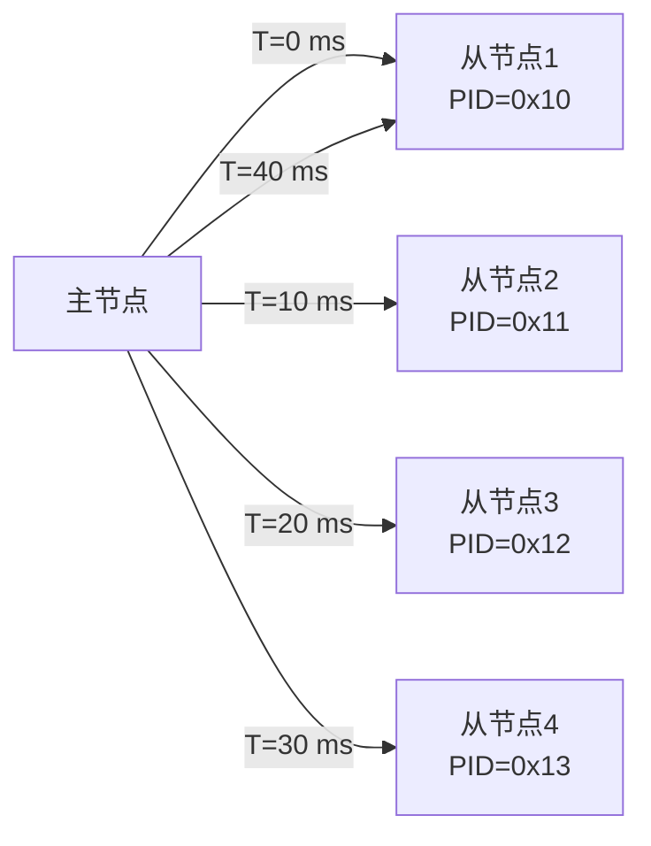
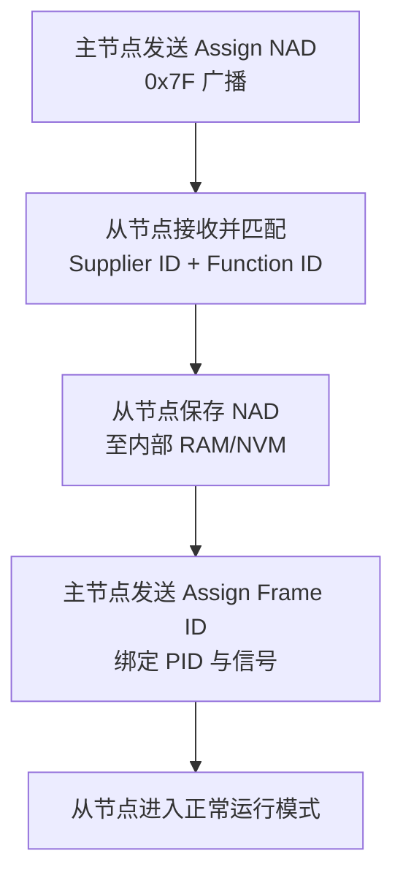

# LIN 调度表与诊断 [I]

> **本章学习目标**：
> - 理解LIN 调度表的设计原则与轮询机制
> - 掌握诊断帧（0x3C/0x3D）的传输协议与节点配置流程
> - 了解 LIN 诊断命令集与错误处理机制

---

## 调度表设计

---

### <strong>调度表基本概念</strong>

I 
LIN 调度表是主节点控制总线访问的核心机制，按固定周期轮询各从节点。
 

类比：LIN 调度表如同列车时刻表——每列火车（帧）在固定时刻出发，每个车站（从节点）按时刻表停靠，无票（无响应）则跳过。 

<strong>1. 调度表结构</strong> 
* 调度表由若干"表项（Entry）"组成，每个表项包含延迟时间与关联帧。
 
* 表项延迟定义了从上一帧结束到本帧开始的时间间隔。
 
* 调度表循环执行，周期称为"主时间基（Major Time Base）"。
 

**表 3-1：调度表示例**

| 表项 | 延迟 (ms) | 关联帧 PID | 帧长度 | 说明 |
| --- | --- | --- | --- | --- |
| 1 | 5 | 0x10 | 2 byte | 车门开关状态 |
| 2 | 5 | 0x11 | 2 byte | 车窗位置 |
| 3 | 10 | 0x12 | 4 byte | 环境光传感器 |
| 4 | 5 | 0x13 | 1 byte | 座椅加热状态 |
| 5 | 15 | 0x3C | 8 byte | 诊断请求 |

<strong>2. 调度表类型</strong> 
* **循环调度表（Cyclic）**：无限循环，用于正常运行。
 
* **事件触发调度表（Event-triggered）**：仅在状态变化时插入额外帧。
 
* **诊断调度表（Diagnostic）**：包含 0x3C/0x3D 诊断帧，用于配置与故障排查。
 

---

### <strong>主节点轮询机制</strong>

I 
主节点轮询遵循"发布-订阅"模型，主节点发布帧头，拥有该 PID 的从节点填充数据。
 

<strong>3. 无条件帧</strong> 
* 每个表项固定对应一个从节点，无论是否有数据变化都轮询。
 
* 实现简单，但总线利用率低，适合周期型传感器数据。
 

<strong>4. 事件触发帧</strong> 
* 多个从节点共享一个 PID，仅数据变化的节点响应。
 
* 若多个节点同时响应导致冲突，主节点切换为"冲突解决调度表"，逐一单独轮询。
 

---

## 诊断帧（0x3C/0x3D）

---

### <strong>诊断帧定义</strong>

I 
LIN 诊断帧使用保留 PID 0x3C（请求）与 0x3D（响应），承载 UDS 或 LIN 专用诊断命令。
 

**表 3-2：诊断帧结构**

| 字段 | 诊断请求帧 (0x3C) | 诊断响应帧 (0x3D) |
| --- | --- | --- |
| 首字节 | NAD（节点地址） | NAD |
| 字节 1~2 | PCI + SID | PCI + RSID |
| 字节 3~7 | 诊断数据 | 响应数据 |

<strong>1. NAD（Node Address for Diagnosis）</strong> 
* 功能寻址：NAD = 0x7F，广播至所有节点。
 
* 物理寻址：NAD = 0x01~0x7E，指向特定节点。
 

<strong>2. PCI（Protocol Control Information）</strong> 
* 单帧（SF）：PCI = 0x00~0x06，低 4 位表示数据长度。
 
* 首帧（FF）：PCI = 0x10~0x16，携带总数据长度的高 4 位。
 
* 连续帧（CF）：PCI = 0x20~0x2F，序列号。
 

---

### <strong>诊断命令表</strong>

I 
LIN 诊断命令基于 UDS 子集，涵盖节点配置、读取故障码、数据读写等功能。
 

**表 3-3：常用 LIN 诊断命令**

| SID | 服务名 | 功能 | 典型 NAD |
| --- | --- | --- | --- |
| 0xB0 | Assign NAD | 分配节点地址 | 0x7F 广播 |
| 0xB1 | Assign Frame ID | 分配帧标识符 | 目标节点 |
| 0xB2 | Read by Identifier | 按标识符读取 | 目标节点 |
| 0xB3 | Conditional Change NAD | 条件变更 NAD | 目标节点 |
| 0xB4 | Data Dump | 数据转储 | 目标节点 |
| 0xB5 | Assign NAD via SNPD | 通过 SNPD 分配 | 0x7F |
| 0xB6 | Save Configuration | 保存配置至 NVM | 目标节点 |
| 0xB7 | Assign Frame ID Range | 批量分配帧 ID | 目标节点 |

LIN 诊断的核心价值是"免拆线配置"——生产线上的节点通过总线完成地址分配与功能绑定，无需人工拨码。 

---

## 节点配置

---

### <strong>节点配置流程</strong>

I 
LIN 节点配置是生产与维护阶段的核心操作，通过诊断帧完成 NAD 分配、帧 ID 绑定与参数校准。
 

<strong>1. NAD 分配</strong> 
* 新节点出厂时 NAD = 0x00（未配置）。
 
* 主节点广播 Assign NAD（SID=0xB0），携带 Supplier ID 与 Function ID。
 
* 匹配的从节点将 NAD 保存至非易失存储器。
 

<strong>2. 帧 ID 绑定</strong> 
* Assign Frame ID（SID=0xB1）将 PID 与节点的信号映射表关联。
 
* 每个从节点最多绑定 16 个无条件帧 PID。
 

<strong>3. 配置持久化</strong> 
* Save Configuration（SID=0xB6）将当前配置写入 NVM。
 
* 掉电后重新上电，节点从 NVM 加载 NAD 与帧 ID 表。
 

---

## 技术演进与发展历史

LIN总线的诞生源于汽车电子对低成本通信方案的迫切需求。1990年代末，汽车车身领域大量使用独立的开关和传感器，若全部采用CAN总线将导致成本过高。1999年，BMW、Volkswagen、Audi、Volvo等车企联合成立了LIN协会（LIN Consortium），旨在定义一种基于UART/SCI的低成本串行通信协议。2002年，LIN 1.3规范发布；2006年升级至LIN 2.1，增加了诊断功能和节点配置能力。此后，LIN成为车身控制模块（BCM）、车门、座椅、灯光等子系统的标准选择，与CAN形成互补。2020年后，LIN 2.2A及后续版本进一步增强了睡眠管理和自动波特率检测能力，持续服务于汽车低成本通信场景。

 

---

## 本章小结

| 小节 | 核心要点 |
| --- | --- |
| 调度表设计 | 循环/事件触发/诊断三种类型，主节点按表项轮询从节点 |
| 诊断帧 0x3C/0x3D | NAD+PCI+SID 结构，支持 UDS 子集命令，单/多帧传输 |
| 节点配置 | Assign NAD 广播分配地址，Assign Frame ID 绑定 PID，Save Configuration 持久化 |

---

## 练习

1. **调度表设计**：为某车门 LIN 网络设计调度表，包含 4 个从节点（车门开关、车窗、后视镜、门锁），要求总线负载率不超过 40%，轮询周期 50 ms。

2. **诊断通信**：主节点需读取从节点（NAD=0x05）的供应商 ID（DID=0x0100）。写出完整的单帧请求与响应序列（PCI+SID+DID）。

3. **配置流程**：某 LIN 网络有 3 个未配置节点，供应商 ID 分别为 0x1234、0x5678、0x9ABC。设计主节点的批量配置流程，使用 Assign NAD 与 Save Configuration 完成初始化。
