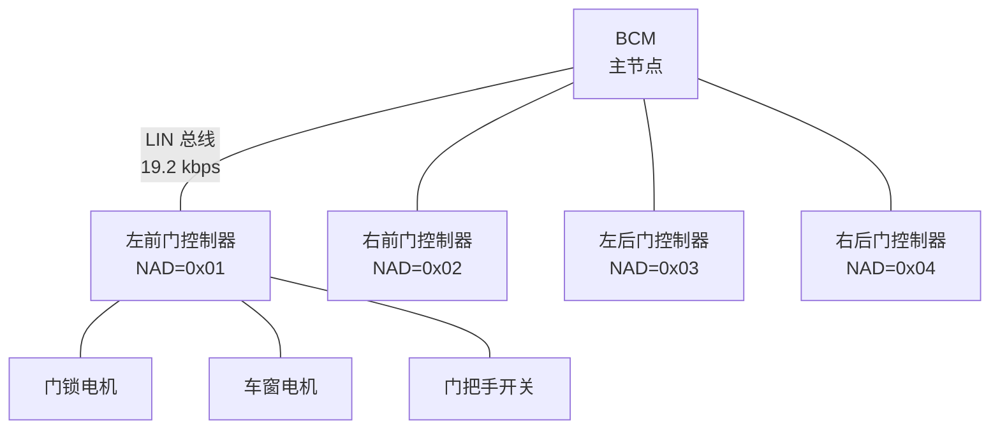

# LIN 嵌入式实战 [I]

> **本章学习目标**：
> - 掌握 NXP S32K 系列 MCU 的<span class="red">LIN 模块配置</span>流程
> - 理解车门模块 LIN 网络的拓扑设计与信号分配
> - 了解故障注入测试的方法与故障诊断策略

---

## S32K LIN 配置

---

### <strong>LPUART 与 LIN 模式启用</strong>

<span class="badge-i">I</span><br>
<span class="red">S32K 系列 MCU</span>通过 LPUART（Low Power UART）模块支持 LIN 协议，需配置波特率、帧格式与中断使能。
<br>

**表 4-1：S32K LIN 关键寄存器**

| 寄存器 | 地址偏移 | 功能 |
| --- | --- | --- |
| LPUART_BAUD | 0x00 | 波特率配置（SBR+OSR） |
| LPUART_CTRL | 0x08 | 发送/接收/中断使能 |
| LPUART_DATA | 0x0C | 数据寄存器 |
| LPUART_STAT | 0x04 | 状态标志（TX/RX/Idle） |
| LPUART_MATCH | 0x10 | 自动匹配地址 |

<span class="orange"><strong>1. 初始化代码</strong></span><br>

```c
// S32K LIN 初始化代码
// 文件：s32k_lin_init.c
// 目标：配置 LPUART 为 LIN 模式，19.2 kbps

void S32K_LIN_Init(void) {
    // 1. 时钟使能
    PCC->PCCn[PCC_LPUART0_INDEX] = PCC_PCCn_PCS(1)  // SOSCDIV2_CLK
                                 | PCC_PCCn_CGC(1); // 时钟门控使能

    // 2. 引脚复用
    PORTC->PCR[6] = PORT_PCR_MUX(2);  // PTB2 = LPUART0_RX
    PORTC->PCR[7] = PORT_PCR_MUX(2);  // PTB3 = LPUART0_TX

    // 3. 波特率计算: 80MHz / (52 * 1) / 80 = 19.2 kbps
    LPUART0->BAUD = LPUART_BAUD_SBR(52)
                  | LPUART_BAUD_OSR(79)   // 过采样率 = 80
                  | LPUART_BAUD_BOTHEDGE(1);

    // 4. LIN 模式使能 (Break 检测 + 空闲线检测)
    LPUART0->STAT |= LPUART_STAT_LBKDE(1);  // LIN Break 检测使能

    // 5. 使能收发
    LPUART0->CTRL = LPUART_CTRL_TE(1)    // 发送使能
                  | LPUART_CTRL_RE(1)    // 接收使能
                  | LPUART_CTRL_RIE(1);  // 接收中断使能
}
```

<span class="orange"><strong>2. Break 字段发送</strong></span><br>

```c
// 发送 LIN Break 字段 (13 位显性 + 1 位隐性)
void LIN_SendBreak(void) {
    // 写入 BREAK 字符，硬件自动生成 13 位显性电平
    LPUART0->CTRL |= LPUART_CTRL_SBK(1);  // 置位 Send Break
    while (!(LPUART0->STAT & LPUART_STAT_TDRE(1))); // 等待发送完成
    LPUART0->CTRL &= ~LPUART_CTRL_SBK(1); // 清除 SBK，自动插入定界符
}
```

---

## 车门模块 LIN 网络

---

### <strong>网络拓扑与信号分配</strong>

<span class="badge-i">I</span><br>
<span class="red">车门模块 LIN 网络</span>是典型的车身域应用，主节点为 BCM（Body Control Module），从节点包括各车门控制器。
<br>



<span class="blue">车门 LIN 网络的核心设计原则是"低成本+高可靠"——用单线总线替代多根硬线，减少线束重量与连接器数量。</span><br>

**表 4-2：车门模块信号分配**

| PID | 信号名 | 方向 | 数据长度 | 更新周期 |
| --- | --- | --- | --- | --- |
| 0x10 | 左前门状态 | 从→主 | 2 byte | 50 ms |
| 0x11 | 右前门状态 | 从→主 | 2 byte | 50 ms |
| 0x20 | 左前门锁命令 | 主→从 | 1 byte | 事件触发 |
| 0x21 | 右前门锁命令 | 主→从 | 1 byte | 事件触发 |
| 0x30 | 左前窗位置 | 从→主 | 1 byte | 100 ms |
| 0x3C | 诊断请求 | 主→从 | 8 byte | 按需 |
| 0x3D | 诊断响应 | 从→主 | 8 byte | 按需 |

<span class="orange"><strong>1. 门锁控制时序</strong></span><br>
* BCM 检测到遥控钥匙信号 → 发送 PID=0x20，Data[0]=0x01（开锁）。
<br>
* 左前门控制器接收 → 驱动门锁电机 200 ms → 回传 PID=0x10，Data[0]=0x01（已开锁）。
<br>

<span class="orange"><strong>2. 车窗防夹保护</strong></span><br>
* 车窗上升过程中，从节点监测电机电流。
<br>
* 电流突增（遇障碍物）→ 立即反转电机 100 ms → 上报事件 PID=0x30。
<br>

---

## 故障注入

---

### <strong>故障注入测试方法</strong>

<span class="badge-i">I</span><br>
<span class="red">故障注入</span>是验证 LIN 网络容错性的系统性方法，通过人为制造故障验证节点恢复能力。
<br>

**表 4-3：故障注入测试矩阵**

| 故障类型 | 注入方法 | 预期行为 | 检测手段 |
| --- | --- | --- | --- |
| 短路到地 | 将 LIN 线拉低 | 总线静默，所有节点进入 Sleep | 示波器+电流表 |
| 短路到电源 | 将 LIN 线接 12V | 总线锁死显性，通信中断 | 电压测量 |
| 节点掉线 | 断开某从节点电源 | 主节点检测无响应，记录故障码 | 逻辑分析仪 |
| 位错误 | 发送错误 PID 校验 | 从节点丢弃帧，请求重传 | 帧计数器 |
| 超时 | 延长帧间隔 > TFrame_Max | 接收节点触发帧超时错误 | 超时定时器 |
| 串扰 | 并行布置干扰线 | 偶发位翻转，校验和检测 | 误码率统计 |

<span class="orange"><strong>1. 帧发送代码</strong></span><br>

```c
// LIN 帧发送（主节点）
// 文件：s32k_lin_master.c

void LIN_SendFrame(uint8_t pid, uint8_t *data, uint8_t len) {
    uint8_t i;
    uint8_t checksum;

    // 1. 发送 Break
    LIN_SendBreak();

    // 2. 发送 Sync 字节
    LPUART0->DATA = 0x55;
    while (!(LPUART0->STAT & LPUART_STAT_TDRE(1)));

    // 3. 发送 PID (含校验位)
    LPUART0->DATA = LIN_CalcPID(pid);
    while (!(LPUART0->STAT & LPUART_STAT_TDRE(1)));

    // 4. 发送数据
    for (i = 0; i < len; i++) {
        LPUART0->DATA = data[i];
        while (!(LPUART0->STAT & LPUART_STAT_TDRE(1)));
    }

    // 5. 发送校验和
    checksum = LIN_CalcChecksum(pid, data, len);
    LPUART0->DATA = checksum;
}
```

<span class="orange"><strong>2. 故障诊断策略</strong></span><br>
* 主节点维护每个从节点的"响应计数器"，连续 3 次无响应标记为故障。
<br>
* 故障节点通过诊断帧 0x3C 读取内部错误寄存器，定位具体故障源。
<br>
* 非关键节点故障时，主节点屏蔽该节点调度表项，继续运行其余节点。
<br>

---

## 技术演进与发展历史

LIN总线的诞生源于汽车电子对低成本通信方案的迫切需求。1990年代末，汽车车身领域大量使用独立的开关和传感器，若全部采用CAN总线将导致成本过高。1999年，BMW、Volkswagen、Audi、Volvo等车企联合成立了LIN协会（LIN Consortium），旨在定义一种基于UART/SCI的低成本串行通信协议。2002年，LIN 1.3规范发布；2006年升级至LIN 2.1，增加了诊断功能和节点配置能力。此后，LIN成为车身控制模块（BCM）、车门、座椅、灯光等子系统的标准选择，与CAN形成互补。2020年后，LIN 2.2A及后续版本进一步增强了睡眠管理和自动波特率检测能力，持续服务于汽车低成本通信场景。

<br>

---

## 本章小结

| 小节 | 核心要点 |
| --- | --- |
| S32K LIN 配置 | LPUART 时钟/引脚/波特率初始化，Break 字段硬件生成，SBK 位控制 |
| 车门模块网络 | BCM 主节点+4 车门从节点，门锁/车窗/诊断信号分配，事件触发优化 |
| 故障注入 | 短路/掉线/位错误/超时/串扰五类故障，响应计数器+诊断帧定位 |

---


## 练习

1. **波特率配置**：S32K 使用 48 MHz 系统时钟，目标 LIN 波特率 19.2 kbps。计算 LPUART_BAUD 寄存器中 SBR 与 OSR 的合理取值组合。

2. **帧设计**：为某车门从节点设计一帧 "车窗状态" 信号（PID=0x30），包含：窗位置（0~100%，1 byte）、防夹触发标志（1 bit）、电机故障标志（1 bit）。写出帧的数据字节布局。

3. **故障排查**：某 LIN 网络偶发帧丢失，示波器显示 Break 字段长度仅 10 bit。分析可能原因并给出修复方案。
