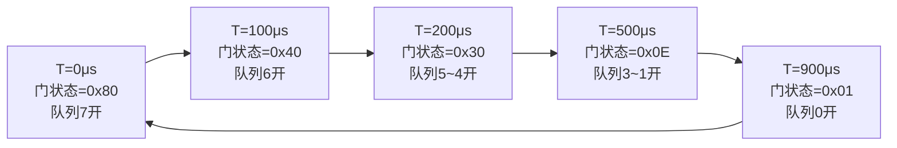

# Qbv 门控调度实现 [E]

> **本章学习目标**：
> - 理解 <span class="red">Gate Control List（GCL）</span> 的配置语法与执行机制
> - 掌握时间片轮转调度与优先级队列的协同工作方式
> - 了解 Linux 内核中 tc-taprio 的实现原理

---

## Gate Control List 配置

---

### <strong>GCL 基本概念</strong>

<span class="badge-e">E</span><br>
<span class="red">GCL（Gate Control List）</span> 是 802.1Qbv 定义的门控调度核心数据结构，由一系列（时间偏移，门状态）二元组组成。<br>

<span class="blue">GCL 如同电梯运行程序——每个楼层对应一个时间点，电梯门在指定楼层按预设状态（开/关）运行，乘客（数据帧）只能在门开时进入。</span><br>



<span class="orange"><strong>1. GCL 条目结构</strong></span><br>
* 时间偏移（Offset）：相对于周期起始的纳秒级偏移量。<br>
* 门状态（Gate States）：8-bit 掩码，每 bit 对应一个队列的开关状态（1=开，0=关）。<br>
* 条目总数：受硬件限制，通常为 16~1024 条。<br>

**表 2-1：GCL 配置示例**

| 条目 | 偏移 (μs) | 门状态 (hex) | 开放队列 | 说明 |
| --- | --- | --- | --- | --- |
| 0 | 0 | 0x80 | 7 | ADAS 紧急控制 |
| 1 | 50 | 0xC0 | 7,6 | 控制+传感器 |
| 2 | 150 | 0x40 | 6 | 传感器数据 |
| 3 | 350 | 0x3F | 5~0 | 普通流量 |
| 4 | 950 | 0x01 | 0 | 后台任务 |

---

### <strong>Linux tc-taprio 配置</strong>

<span class="badge-e">E</span><br>
<span class="red">tc-taprio</span> 是 Linux 内核中实现 802.1Qbv 的 qdisc（队列规则）。<br>

<span class="orange"><strong>2. 基础配置命令</strong></span><br>

```bash
# tc-taprio 配置示例
# 网卡 eth0，周期 1ms，8 个队列

tc qdisc replace dev eth0 parent root handle 100 taprio \
  map 0 1 2 3 4 5 6 7 7 7 7 7 7 7 7 7 \
  queues 1@0 1@1 1@2 1@3 1@4 1@5 1@6 1@7 \
  base-time 0 \
  sched-entry S 80 50000 \    # 0~50μs: 队列7开
  sched-entry S 40 50000 \    # 50~100μs: 队列6开
  sched-entry S 20 100000 \   # 100~200μs: 队列5开
  sched-entry S 10 200000 \   # 200~400μs: 队列4开
  sched-entry S 08 200000 \   # 400~600μs: 队列3开
  sched-entry S 04 200000 \   # 600~800μs: 队列2开
  sched-entry S 02 100000 \   # 800~900μs: 队列1开
  sched-entry S 01 100000     # 900~1000μs: 队列0开
```

<span class="orange"><strong>3. 配置参数解析</strong></span><br>
* `map`：skb->priority 到队列号的映射，16 个优先级等级。<br>
* `queues`：定义每个硬件队列关联的软件队列数。<br>
* `base-time`：调度周期的起始时间戳（通常为 0，即立即开始）。<br>
* `sched-entry`：每条格式为 `S <gate-state> <duration-ns>`。<br>

---

## 时间片轮转

---

### <strong>时间片划分原理</strong>

<span class="badge-e">E</span><br>
<span class="red">时间片轮转（Time-Sliced Round Robin）</span> 是 Qbv 的核心调度策略，将总周期切分为多个等长或不等长的时间片。<br>

**表 2-2：时间片设计原则**

| 原则 | 说明 | 影响 |
| --- | --- | --- |
| 时隙长度 ≥ 最大帧传输时间 | 防止帧被截断 | 最小粒度 125 μs（千兆网） |
| 高优先级队列时隙靠前 | 降低关键流量等待时间 | 端到端延迟优化 |
| 相邻时隙间留 Guard Band | 防止跨时隙冲突 | 带宽损失约 2%~5% |
| 周期为各流量更新周期的 GCD | 保证所有流量至少被服务一次 | 周期通常 1~10 ms |

<span class="orange"><strong>4. 最大帧传输时间计算</strong></span><br>
* 千兆以太网最大帧（1522 Byte）传输时间 = 1522 × 8 / 1Gbps = 12.176 μs。<br>
* 实际考虑 IFG（Inter-Frame Gap）与前导码，总时间约 12.5 μs。<br>
* 但 Guard Band 通常按 125 μs 设计，为突发预留余量。<br>

---

## 优先级队列

---

### <strong>硬件队列与软件队列映射</strong>

<span class="badge-e">E</span><br>
<span class="red">优先级队列</span> 是 Qbv 与标准 QoS 的交汇点，802.1p 优先级（PCP）决定帧进入哪个硬件队列。<br>

**表 2-3：PCP 到队列映射**

| PCP (802.1p) | 优先级 | 典型用途 | Qbv 队列 |
| --- | --- | --- | --- |
| 7 | 网络控制 | 路由协议、网管 | 7 |
| 6 | 语音 | 实时控制信号 | 6 |
| 5 | 视频 | 摄像头/雷达数据 | 5 |
| 4 | 受限视频 | 地图/导航 | 4 |
| 3 | 关键数据 | 车辆状态 | 3 |
| 2 | 尽力数据 | 信息娱乐 | 2 |
| 1 | 背景数据 | 日志上传 | 1 |
| 0 | 默认 | 未分类流量 | 0 |

<span class="orange"><strong>5. 队列间关系</strong></span><br>
* 标准 QoS：低优先级队列仅在高优先级队列为空时才能发送。<br>
* Qbv 模式下：门控状态优先于优先级，即使队列 7 有帧，若当前门控关闭队列 7，则必须等待至下一周期。<br>
* 混合模式：门控开放期间，内部仍按优先级调度。<br>

---

## 技术演进与发展历史

TSN（Time-Sensitive Networking）的发展历史根植于工业以太网的确定性需求演进。2005年，IEEE 802.1音频视频桥接（AVB）工作组成立，旨在为音视频流传输提供低延迟保障。2012年，AVB正式更名为TSN，并将目标扩展至工业自动化、汽车网络和关键基础设施。此后，IEEE相继发布了802.1Qbv（门控调度）、802.1Qbu（帧抢占）、802.1AS（时间同步）等关键标准。2016年后，TSN逐步与OPC UA融合，成为工业4.0通信架构的核心支柱。近年来，汽车领域对确定性以太网的需求推动了100BASE-T1和1000BASE-T1与TSN的结合，TSN正从实验室走向大规模产业化部署。

<br>

---

## 本章小结

| 小节 | 核心要点 |
| --- | --- |
| GCL 配置 | (偏移, 门状态) 二元组链表，tc-taprio sched-entry 语法，16~1024 条目 |
| 时间片轮转 | 周期切分，Guard Band 防截断，最大帧传输时间决定最小粒度 |
| 优先级队列 | 8 级 802.1p PCP 映射，门控优先于 QoS，混合模式内部仍按优先级 |

---


## 练习

1. **GCL 设计**：某工业网络周期 2 ms，要求：队列7（控制）每周期至少 200 μs，队列6（视频）至少 400 μs，其余队列共享剩余时间。设计 GCL 并计算 Guard Band 开销占比。

2. **tc-taprio 配置**：写出上述 GCL 的完整 tc-taprio 配置命令，假设使用网卡 eth1，base-time 为当前时间下一个整秒。

3. **冲突分析**：某 Qbv 调度表中，队列7 的时隙长度为 100 μs，而某控制帧传输需 12.5 μs。若该时隙内队列7 有 10 个待发送帧，会发生什么？给出 2 种解决方案。
