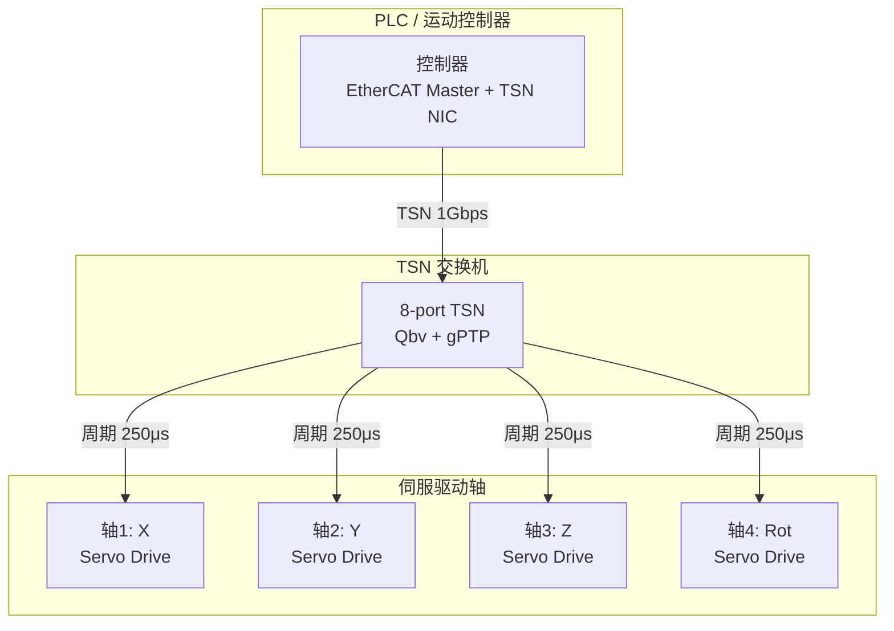

# TSN 嵌入式实战 [E→M]

> **本章学习目标**：
> - 掌握 TSN 交换机的硬件配置与 <span class="red">Linux TSN 工具</span> 链使用
> - 理解 tc-taprio 内核实现与配置脚本编写
> - 了解工业控制中 TSN 的典型案例与性能指标

---

## TSN 交换机配置

---

### <strong>硬件交换机配置接口</strong>

<span class="badge-e">E</span><br>
<span class="red">TSN 交换机</span> 的配置通常通过硬件寄存器、EEPROM 或管理接口（SPI/I2C/MDIO）完成。<br>

**表 4-1：TSN 交换机关键寄存器**

| 寄存器 | 偏移 | 功能 | 典型值 |
| --- | --- | --- | --- |
| GCL_BASE | 0x1000 | GCL 条目基地址 | 0x0000 |
| GCL_ENTRY_CTRL | 0x1004 | 条目控制（有效/无效） | 0x01 |
| GCL_TIME_OFFSET | 0x1008 | 时间偏移（ns） | 0~999999 |
| GCL_GATE_STATE | 0x100C | 门状态掩码 | 0x80~0x01 |
| CYCLE_TIME | 0x2000 | 周期长度（ns） | 1000000 |
| BASE_TIME_NS | 0x2004 | 周期起始纳秒 | 0 |
| BASE_TIME_S | 0x2008 | 周期起始秒 | 0 |

<span class="orange"><strong>1. 寄存器配置流程</strong></span><br>
* 停止当前调度（写 GCL_CTRL=0）。<br>
* 依次写入 GCL 条目（时间偏移+门状态）。<br>
* 写入周期参数（Cycle Time + Base Time）。<br>
* 启动调度（写 GCL_CTRL=1）。<br>

```c
// 简化的 TSN 交换机寄存器配置
// 文件：tsn_switch_cfg.c

void tsn_switch_config(struct tsn_gcl *gcl, int num_entries) {
    int i;
    
    // 停止调度
    writel(0x00, SWITCH_BASE + GCL_CTRL);
    
    // 写入 GCL 条目
    for (i = 0; i < num_entries; i++) {
        writel(gcl[i].time_offset, SWITCH_BASE + GCL_TIME_OFFSET + i*16);
        writel(gcl[i].gate_state,  SWITCH_BASE + GCL_GATE_STATE  + i*16);
        writel(0x01,              SWITCH_BASE + GCL_ENTRY_CTRL + i*16);
    }
    
    // 设置周期参数
    writel(1000000, SWITCH_BASE + CYCLE_TIME);   // 1ms
    writel(0,       SWITCH_BASE + BASE_TIME_NS);
    
    // 启动调度
    writel(0x01, SWITCH_BASE + GCL_CTRL);
}
```

---

## Linux TSN 工具

---

### <strong>tc-taprio 高级配置</strong>

<span class="badge-e">E</span><br>
<span class="red">tc-taprio</span> 是 Linux 内核中实现 802.1Qbv 的核心 qdisc，支持动态门控列表更新。<br>

**表 4-2：tc-taprio 常用命令**

| 命令 | 作用 | 示例 |
| --- | --- | --- |
| tc qdisc replace | 替换/创建 taprio 规则 | 见下方完整命令 |
| tc qdisc show | 查看当前配置 | tc qdisc show dev eth0 |
| tc qdisc delete | 删除 taprio | tc qdisc del dev eth0 root |
| ip link set txqueuelen | 调整队列深度 | ip link set eth0 txqueuelen 100 |

<span class="orange"><strong>2. 完整配置脚本</strong></span><br>

```bash
#!/bin/bash
# tsn_setup.sh - TSN 网络配置脚本
# 适用：车载以太网 TSN 终端节点

IFACE="eth0"
CYCLE_TIME="1000000"  # 1ms

# 加载必要内核模块
modprobe sch_taprio
modprobe ptp

# 配置 PTP 硬件时钟（PHC）
phc_ctl /dev/ptp0 set 0

# 设置网卡队列数
ethtool -L ${IFACE} tx 8 rx 8

# 替换根 qdisc 为 taprio
tc qdisc replace dev ${IFACE} parent root handle 100 taprio \
  map 0 1 2 3 4 5 6 7 7 7 7 7 7 7 7 7 \
  queues 1@0 1@1 1@2 1@3 1@4 1@5 1@6 1@7 \
  base-time 0 \
  sched-entry S 80 100000 \    # 队列7: 控制 (0~100μs)
  sched-entry S 40 200000 \    # 队列6: 传感器 (100~300μs)
  sched-entry S 20 200000 \    # 队列5: 视频 (300~500μs)
  sched-entry S 10 200000 \    # 队列4: 地图 (500~700μs)
  sched-entry S 0E 200000 \    # 队列3~1: 普通 (700~900μs)
  sched-entry S 01 100000     # 队列0: 后台 (900~1000μs)

# 设置 socket 优先级映射
ip link set ${IFACE} type can txqueuelen 100

# 验证配置
tc qdisc show dev ${IFACE}
echo "TSN configuration applied to ${IFACE}"
```

<span class="orange"><strong>3. 实时性能验证</strong></span><br>

```bash
# 使用 sockperf 测试时延
sockperf sr --tcp -i 192.168.1.10 -p 11111 &
sockperf pp --tcp -i 192.168.1.10 -p 11111 -t 10 -m 100

# 使用 ptp4l 验证时间同步
ptp4l -i eth0 -m -S  # 软件时间戳模式
```

---

## 工业控制案例

---

### <strong>案例：多轴运动控制</strong>

<span class="badge-m">M</span><br>
<span class="red">多轴运动控制</span> 是 TSN 在工业领域的典型应用，要求各轴的控制周期严格同步，抖动 < 50 μs。<br>



**表 4-3：多轴控制 TSN 参数**

| 参数 | 要求值 | 说明 |
| --- | --- | --- |
| 控制周期 | 250 μs | 每轴位置/速度更新 |
| 端到端延迟 | < 100 μs | 控制器→驱动器 |
| 时间同步精度 | < 1 μs | gPTP 同步 |
| 帧丢失率 | < 10⁻⁹ | 可靠性要求 |
| 带宽/轴 | 10 Mbps | 位置+速度+力矩 |
| 总带宽 | 80 Mbps | 4 轴 × 20 Mbps |

<span class="orange"><strong>4. 调度表设计</strong></span><br>
* 周期 250 μs，划分为 4 个 50 μs 时隙 + 50 μs Guard Band。<br>
* 每个时隙服务一个轴的控制帧，严格按轴号顺序排列。<br>
* 轴1：0~50 μs，轴2：50~100 μs，轴3：100~150 μs，轴4：150~200 μs。<br>
* 剩余 50 μs 用于诊断与配置流量。<br>

<span class="orange"><strong>5. 性能指标验证</strong></span><br>
* 使用示波器测量同步信号（SYNC）与数据帧到达时间的偏差。<br>
* 统计 10⁶ 个周期的延迟分布，确认 99.999% 的帧延迟 < 100 μs。<br>
* 注入 50% 背景流量，验证控制帧延迟无显著恶化。<br>

---

## 技术演进与发展历史

TSN（Time-Sensitive Networking）的发展历史根植于工业以太网的确定性需求演进。2005年，IEEE 802.1音频视频桥接（AVB）工作组成立，旨在为音视频流传输提供低延迟保障。2012年，AVB正式更名为TSN，并将目标扩展至工业自动化、汽车网络和关键基础设施。此后，IEEE相继发布了802.1Qbv（门控调度）、802.1Qbu（帧抢占）、802.1AS（时间同步）等关键标准。2016年后，TSN逐步与OPC UA融合，成为工业4.0通信架构的核心支柱。近年来，汽车领域对确定性以太网的需求推动了100BASE-T1和1000BASE-T1与TSN的结合，TSN正从实验室走向大规模产业化部署。

<br>

---

## 本章小结

| 小节 | 核心要点 |
| --- | --- |
| TSN 交换机配置 | GCL 寄存器写入，Cycle Time/Base Time 设置，启动/停止控制 |
| Linux TSN 工具 | tc-taprio qdisc，ptp4l 时间同步，sockperf 性能验证 |
| 工业控制案例 | 250 μs 周期多轴同步，50 μs 时隙/轴，gPTP < 1 μs 精度 |

---


## 练习

1. **寄存器计算**：某 TSN 交换机 GCL 深度为 64 条，每条 16 Byte。计算 GCL 占用的寄存器地址空间大小。若周期为 1 ms，最多支持多少个不等长时隙？

2. **脚本编写**：编写一个完整的 tsn_setup.sh 脚本，为 4 轴运动控制系统配置 taprio：周期 250 μs，4 个控制队列各 50 μs，1 个诊断队列 50 μs。

3. **性能分析**：某工业网络采用 TSN 后，控制帧平均延迟从 800 μs 降至 80 μs，但偶发 200 μs 尖峰。分析可能原因并给出 3 个优化方向。
