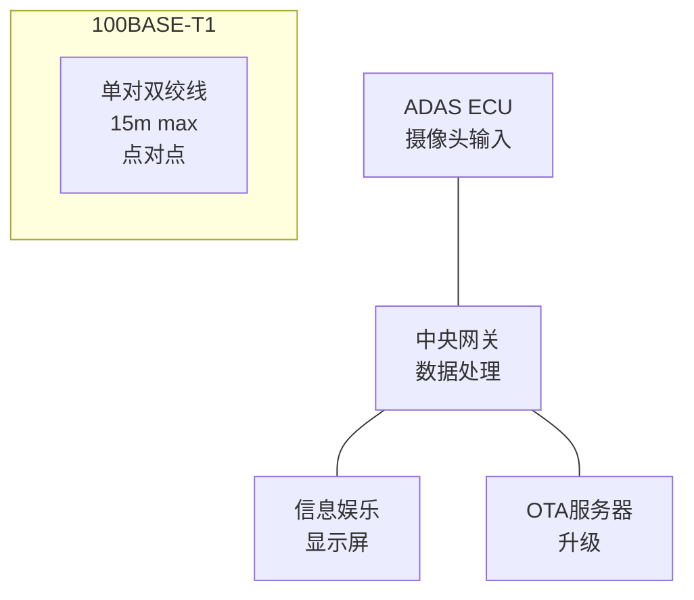

# 车载以太网基础认知与 100BASE-T1 [I→E]

[I] [E]

> **本章学习目标**：
> - 理解 车载以太网 从传统以太网演进的动机
> - 掌握 100BASE-T1（BroadR-Reach） 的单对双绞线物理层
> - 了解车载以太网在 ADAS 和信息娱乐中的典型应用

---

## 车载以太网的诞生：汽车也需要"宽带"

---

### <strong>为什么需要车载以太网：CAN/LIN 的带宽不够</strong>

车载以太网由 Broadcom 在 2011 年推出 BroadR-Reach，
后被 IEEE 标准化为 100BASE-T1。

传统车载总线无法满足新需求：
 
* ADAS 摄像头：4 个 200 万像素摄像头，每帧 5MB，30fps → 600MB/s
 
* 信息娱乐：4K 屏幕、多声道音频、OTA 升级
 
* 诊断：DoIP（Diagnostic over IP）需要 TCP/IP
 

100BASE-T1 用 1 对双绞线实现 100Mbps，比标准以太网少 2 对线，线束减重 30%，成本降低 80%。
 

类比：车载以太网如同"从拨号上网升级到光纤入户"——以前的车载网络（CAN 1Mbps）只能传文字消息；车载以太网（100Mbps~1Gbps）可以传高清视频、在线地图、实时导航。
 

---

### <strong>100BASE-T1 的物理层：单对双绞线 + PAM3</strong>

100BASE-T1使用 100Mbps 单对双绞线：

| 参数 | 100BASE-T1 | 标准 100BASE-TX | 差异 |
| --- | --- | --- | --- |
| 线对数 | 1 | 2 | 线束减重 |
| 编码 | PAM3 | 4B/5B + MLT-3 | 更高效率 |
| 速率 | 100 Mbps | 100 Mbps | 相同 |
| 距离 | 15m | 100m | 车内距离短 |
| 连接器 | 小型化 | RJ45 | 适应汽车振动 |

PAM3（3-level Pulse Amplitude Modulation）：用 3 种电平（-1, 0, +1）编码数据，每符号 1.5 bit，66.7MHz 符号率即可达到 100Mbps。
 

---

### <strong>1000BASE-T1：千兆车载以太网</strong>

1000BASE-T1由 IEEE 802.3bp 定义：
 
* 1 对双绞线，1Gbps
 
* PAM3 编码，750MHz 符号率
 
* 用于激光雷达、高分辨率摄像头
 

| 标准 | 速率 | 用途 |
| --- | --- | --- |
| 100BASE-T1 | 100 Mbps | ADAS、信息娱乐、诊断 |
| 1000BASE-T1 | 1 Gbps | 激光雷达、多摄像头 |
| 2.5GBASE-T1 | 2.5 Gbps | 高带宽骨干网 |
| 10GBASE-T1 | 10 Gbps | 自动驾驶中央计算 |

---

## 本章小结

| 概念 | 一句话总结 |
| --- | --- |
| 车载以太网 | 汽车专用以太网，100BASE-T1 起步 |
| 100BASE-T1 | 单对双绞线，100Mbps，PAM3 编码 |
| PAM3 | 3 电平调制，每符号 1.5 bit |
| 1000BASE-T1 | 单对双绞线，1Gbps |
| DoIP | Diagnostic over IP，诊断走以太网 |

---

## 练习

1. 为什么车载以太网用 PAM3 而不是标准以太网的 4B/5B + MLT-3？
2. 100BASE-T1 的单对双绞线如何实现全双工通信？
3. 设计一个 ADAS 网络拓扑：4 个 100BASE-T1 摄像头 + 1 个 1000BASE-T1 激光雷达 + 中央网关。
