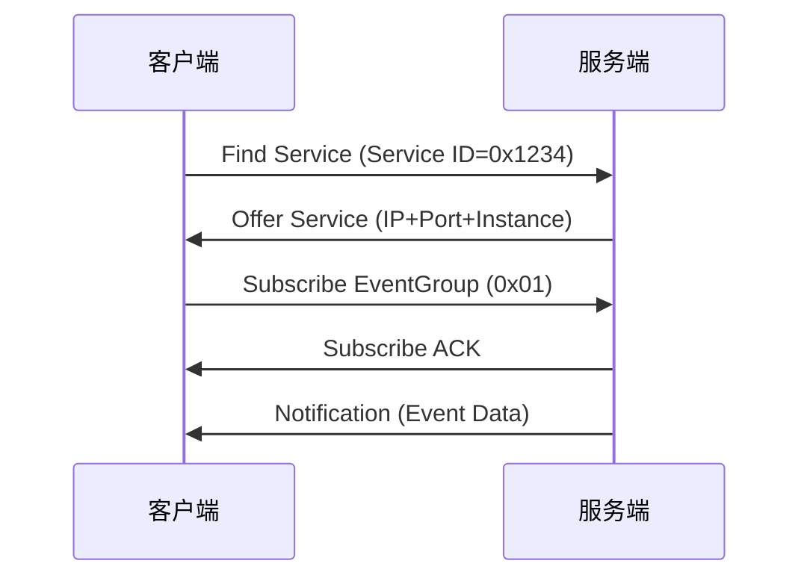
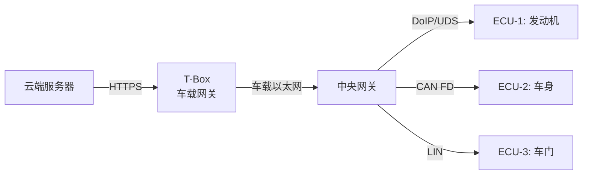

# 车载以太网实战 [I→E]

> **本章学习目标**：
> - 理解 <span class="red">SOME/IP 协议</span> 的服务发现与远程调用机制
> - 掌握 DoIP 诊断协议的命令格式与会话管理
> - 了解 OTA 升级的数据流与安全保障

---

## SOME/IP 协议

---

### <strong>SOME/IP 报文格式</strong>

<span class="badge-i">I</span><br>
<span class="red">SOME/IP（Scalable service-Oriented Middleware over IP）</span> 是车载以太网的核心应用层协议，用于服务发现（SD）与远程过程调用（RPC）。<br>

<span class="blue">类比：SOME/IP 如同餐厅的点餐系统——服务发现是"查找菜单"（SD），远程调用是"下单+上菜"（Request+Response）。</span><br>

**表 3-1：SOME/IP 报文头结构**

| 字段 | 偏移 | 长度 | 说明 |
| --- | --- | --- | --- |
| Message ID | 0 | 32 bit | Service ID (16) + Method ID (16) |
| Length | 4 | 32 bit | 后续字节数（不含本字段） |
| Request ID | 8 | 32 bit | Client ID (16) + Session ID (16) |
| Protocol Version | 12 | 8 bit | 固定 0x01 |
| Interface Version | 13 | 8 bit | 服务接口版本 |
| Message Type | 14 | 8 bit | REQUEST/RESPONSE/NOTIFY/FIRE_FORGET |
| Return Code | 15 | 8 bit | OK/UNKNOWN_SERVICE/... |
| Payload | 16 | N byte | 序列化数据 |

<span class="orange"><strong>1. Message ID 编码</strong></span><br>
* Method ID 最高位为 0 表示方法调用，为 1 表示事件（Event）。<br>
* 例如：Service ID=0x1234，Method ID=0x0001 → Message ID=0x12340001。<br>

<span class="orange"><strong>2. Message Type</strong></span><br>
* REQUEST（0x00）：请求，期待响应。<br>
* FIRE_AND_FORGET（0x01）：请求，不期待响应。<br>
* NOTIFICATION（0x02）：事件通知，服务端主动推送。<br>
* RESPONSE（0x80）：对 REQUEST 的响应。<br>

---

### <strong>服务发现（SD）</strong>

<span class="badge-e">E</span><br>
<span class="red">SOME/IP SD</span> 负责在车载网络中自动发现可用服务，替代静态配置。<br>



<span class="orange"><strong>3. SD 报文格式</strong></span><br>
* 基于 UDP，目标端口 30490（Multicast）。<br>
* Flags：Reboot、Unicast、Multicast 标志位。<br>
* Entries：Offer Service、Subscribe EventGroup、Stop Offer 等。<br>

---

## DoIP 诊断

---

### <strong>DoIP 协议栈</strong>

<span class="badge-i">I</span><br>
<span class="red">DoIP（Diagnostic over IP）</span> 是基于车载以太网的诊断协议，替代传统 CAN 诊断。<br>

**表 3-2：DoIP 协议栈**

| 层级 | 协议 | 说明 |
| --- | --- | --- |
| 应用层 | UDS | ISO 14229 统一诊断服务 |
| 传输层 | DoIP | ISO 13400 诊断 over IP |
| 网络层 | TCP/UDP | 车辆发现用 UDP，诊断用 TCP |
| 物理层 | 100/1000BASE-T1 | 车载以太网 |

<span class="orange"><strong>1. DoIP 报文头</strong></span><br>
* 版本（2 byte）：0x0002 = ISO 13400-2:2019。<br>
* 类型（2 byte）：0x0001=车辆识别请求，0x8001=诊断消息。<br>
* 长度（4 byte）：后续 payload 长度。<br>

---

### <strong>诊断会话管理</strong>

<span class="badge-e">E</span><br>
<span class="red">DoIP 诊断</span> 通过 TCP 连接承载 UDS 会话，支持更高的数据吞吐。<br>

**表 3-3：DoIP 命令示例**

| 方向 | 类型值 | Payload | 说明 |
| --- | --- | --- | --- |
| 请求→车辆 | 0x0001 | VIN 或 EID | 车辆识别请求 |
| 车辆→请求 | 0x0004 | VIN+LA+DoIP版本 | 车辆识别响应 |
| 请求→车辆 | 0x8001 | SA+TA+UDS数据 | 诊断消息发送 |
| 车辆→请求 | 0x8002 | SA+TA+UDS响应 | 诊断消息确认 |

<span class="orange"><strong>2. 诊断消息格式</strong></span><br>

```bash
# DoIP 诊断消息示例（十六进制）
# 版本  类型    长度      SA   TA   UDS-SID  UDS-Data
02 00  80 01  00 00 00 08  0E 00  10  01     # 会话控制（默认→扩展）
```

* SA（Source Address）：诊断仪地址，如 0x0E。<br>
* TA（Target Address）：ECU 逻辑地址，如 0x00~0xFF。<br>

<span class="orange"><strong>3. 连接生命周期</strong></span><br>
* 发现阶段：UDP 广播车辆识别请求，获取 VIN 与逻辑地址。<br>
* 连接阶段：TCP 三次握手建立诊断会话。<br>
* 诊断阶段：双向 UDS 数据交换。<br>
* 断开阶段：TCP 四次挥手或 DoIP 路由激活超时。<br>

---

## OTA 升级

---

### <strong>OTA 数据流</strong>

<span class="badge-i">I</span><br>
<span class="red">OTA（Over-The-Air）升级</span> 通过车载以太网将固件包下载至车辆各 ECU。<br>



<span class="blue">OTA 数据流如同物流系统——云端是发货仓，T-Box 是区域中转站，中央网关是分拣中心，各 ECU 是最终收件人。</span><br>

<span class="orange"><strong>1. 下载阶段</strong></span><br>
* T-Box 通过 4G/5G 从云端下载加密固件包，存储于本地大容量存储。<br>
* 使用断点续传，支持差分升级（Delta Update），减少流量消耗。<br>

<span class="orange"><strong>2. 分发阶段</strong></span><br>
* 中央网关解析固件包头部，按目标 ECU 地址分发至对应总线域。<br>
* 车载以太网承载大容量固件（如 ADAS 域控制器），CAN FD/LIN 承载小容量固件。<br>

<span class="orange"><strong>3. 刷写阶段</strong></span><br>
* 目标 ECU 进入 Bootloader 模式，擦除旧固件，写入新固件。<br>
* 每块数据写入后回传 CRC 校验，全部完成后验证签名。<br>

---

### <strong>安全保障</strong>

<span class="badge-e">E</span><br>
<span class="red">OTA 安全</span> 是车载系统的生命线，涉及身份认证、数据加密与防回滚。<br>

**表 3-4：OTA 安全机制**

| 机制 | 实现方式 | 目的 |
| --- | --- | --- |
| 身份认证 | X.509 证书 + TLS 1.3 | 确认云端合法性 |
| 固件加密 | AES-256-GCM | 传输与存储加密 |
| 签名验证 | RSA-4096 / ECDSA-P384 | 确认固件来源可信 |
| 防回滚 | 安全计数器（Monotonic Counter） | 禁止刷写旧版本 |
| 安全启动 | Secure Boot Chain | 仅执行合法固件 |

<span class="orange"><strong>4. 安全启动链</strong></span><br>
* BootROM 验证 Bootloader 签名 → Bootloader 验证应用固件签名。<br>
* 任何验证失败即进入安全模式，禁止车辆启动相关功能。<br>

---

## 技术演进与发展历史

车载以太网的演进是汽车网络带宽需求爆炸式增长的直接结果。传统CAN/LIN总线仅能满足车身控制需求，而ADAS、信息娱乐和OTA升级则需要百兆乃至千兆级带宽。2011年，BMW、Broadcom、NXP等公司联合成立了OPEN联盟（One-Pair Ether-Net Alliance），推动100BASE-T1单对线以太网标准化。2016年，IEEE 802.3bp正式发布1000BASE-T1标准，将车载以太网速率提升至1 Gbps。此后，10BASE-T1S（多-drop）和Multi-Gigabit Automotive Ethernet相继问世。如今，车载以太网已取代MOST和FlexRay，成为新一代汽车骨干网络的核心技术，并与TSN结合以保障关键流量的实时性。

<br>

---

## 本章小结

| 小节 | 核心要点 |
| --- | --- |
| SOME/IP 协议 | Message ID+Type+Payload，SD 自动发现服务，RPC 远程调用 |
| DoIP 诊断 | ISO 13400 over TCP/UDP，SA/TA 路由，UDS 诊断承载 |
| OTA 升级 | 云端→T-Box→网关→ECU 四级分发，AES+RSA+Secure Boot 安全链 |

---


## 练习

1. **SOME/IP 编码**：某服务 Service ID=0x5678，Method ID=0x0003（事件）。构造完整的 SOME/IP 通知报文头（Protocol Version=1，Interface Version=2）。

2. **DoIP 通信**：诊断仪需读取某 ECU（TA=0x42）的 DTC 列表。写出完整的 DoIP 会话建立流程（从车辆识别到 UDS 0x19 服务请求）。

3. **OTA 安全**：设计一个 OTA 差分升级方案，原固件 64MB，新固件 64.5MB，差异约 2MB。描述差分包生成、传输、校验与回滚保护机制。
