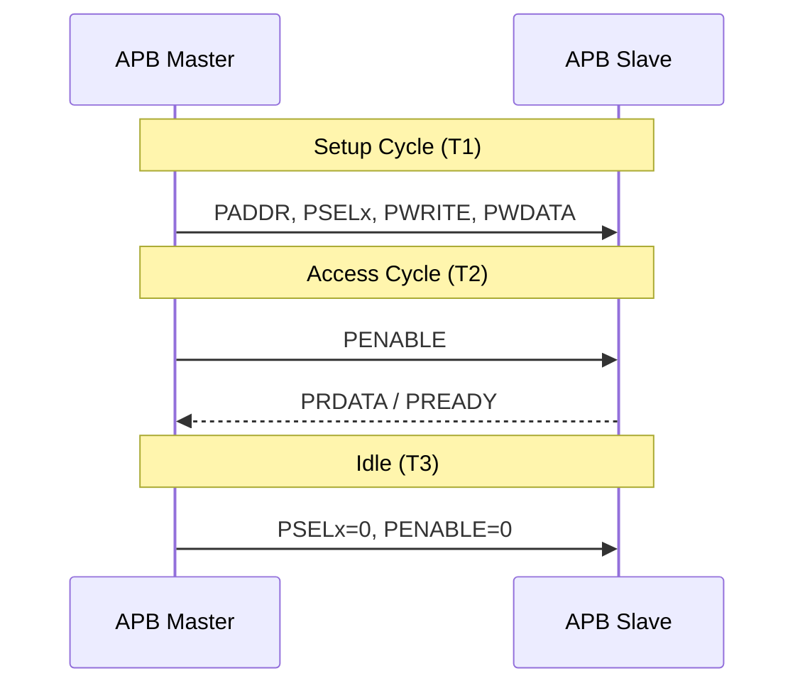
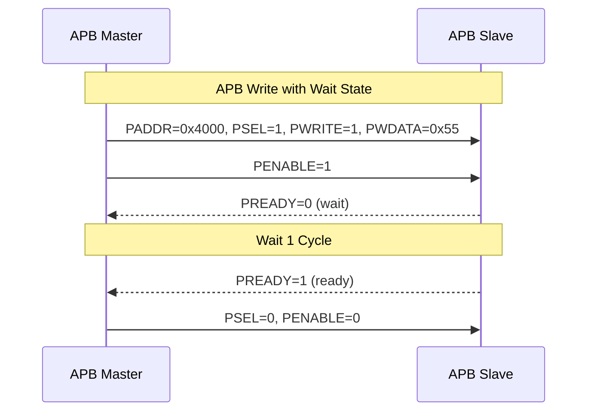
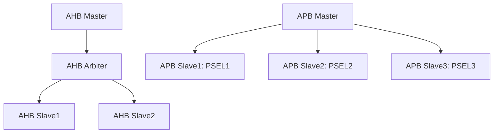
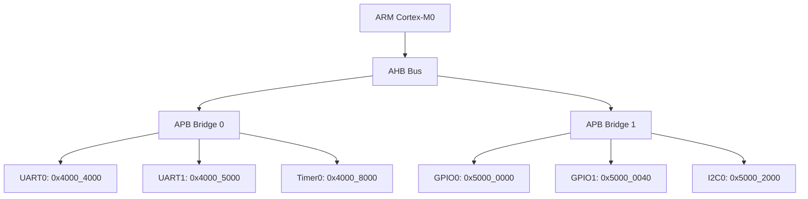

# APB基础认知与传输时序

<span class="badge-b">[B]</span> <span class="badge-i">[I]</span>

---

### 为什么APB是"小区信箱"

手机SoC里有CPU、GPU、NPU、ISP... <br>
这些高速模块跑在数百MHz甚至GHz，通过AXI互连。<br>
但SoC里还有UART、Timer、GPIO、I2C这些"慢吞吞"的外设，<br>
它们不需要高带宽，只需要简单的寄存器读/写。<br>

<span class="red">APB（Advanced Peripheral Bus）</span>就是专门为这些低速外设设计的总线。<br>
它不像AXI那样支持乱序突发、多 outstanding；<br>
APB的哲学是：简单、低速、够用就好。<br>

类比：小区信箱——<br>
快递员（总线主机）把包裹（数据）投到信箱（外设寄存器），<br>
住户（外设）按需取用。信箱不需要高速公路的吞吐量，<br>
只需要"有/无"两种状态，简单、便宜、够用。<br>

---

### APB信号定义

APB采用<span class="green">主从架构（Master-Slave）</span>，主机发起请求，从机被动响应。<br>
所有信号均为单向，无三态线，适合FPGA和ASIC实现。<br>

| 信号 | 方向 | 位宽 | 功能 |
|------|------|------|------|
| PCLK | 输入 | 1 | 总线时钟，上升沿采样 |
| PRESETn | 输入 | 1 | 异步复位，低电平有效 |
| PADDR | 输出 | 32 | 传输目标地址 |
| PSELx | 输出 | 1 | 从机选择（每个从机一根） |
| PENABLE | 输出 | 1 | 传输使能，区分Setup与Access阶段 |
| PWRITE | 输出 | 1 | 1=写，0=读 |
| PWDATA | 输出 | 32 | 写数据 |
| PRDATA | 输入 | 32 | 读数据 |
| PREADY | 输入 | 1 | 从机就绪，可插入等待周期 |
| PSLVERR | 输入 | 1 | 传输错误（APB3起） |

<span class="blue">关键认知：APB2仅9根信号（无PREADY/PSLVERR），APB3加入等待和错误响应，APB4加入保护/写掩码。</span><br>
每个APB从机有独立的PSELx选择线，译码逻辑由APB桥接器实现。<br>

---

### 传输时序：Setup→Access→Idle

APB每次传输固定至少2个周期：Setup + Access。<br>
从机可通过PREADY拉低延长Access阶段。<br>



典型读操作流程：<br>
T1（Setup）：主机送出地址和PSEL，进入Setup。<br>
T2（Access）：主机拉高PENABLE，从机返回PRDATA和PREADY。<br>
T3（Idle）：主机拉低PSEL/PENABLE，总线回到Idle。<br>

写操作与读的区别仅在T1——PWRITE=1且PWDATA有效，T2从机无需返回PRDATA。<br>



<span class="blue">易错点：PENABLE必须在PSEL有效的第二个周期拉高，不可与PSEL同拍拉高。这是APB与Wishbone的本质差异。</span><br>

---

### APB4/APB5新增信号

APB4针对安全外设和字节掩码做了增强：<br>

| 信号 | 版本 | 功能 |
|------|------|------|
| PPROT | APB4 | 保护类型（特权/安全/指令数据） |
| PSTRB | APB4 | 写字节掩码（4位对应32位数据的每个字节） |
| PAUSER | APB5 | 地址用户扩展 |
| PWUSER | APB5 | 写数据用户扩展 |
| PRUSER | APB5 | 读数据用户扩展 |
| PWAKEUP | APB5 | 低功耗唤醒请求 |

PPROT的3位分别定义访问属性：<br>

| 位 | 名称 | 0 | 1 |
|----|------|---|---|
| [0] | 特权级 | Normal | Privileged |
| [1] | 安全域 | Secure | Non-secure |
| [2] | 数据类型 | Data | Instruction |

<span class="purple">扩展：TrustZone系统必须实现PPROT。APB5的PWAKEUP信号支持Q-channel低功耗接口，外设可请求系统唤醒。</span><br>

PSTRB字节掩码示例：<br>

```
32位写数据：0x1234_5678
PSTRB = 4'b1101 → 写入 byte3, byte2, byte0；byte1保持不变
PSTRB = 4'b0001 → 仅写入 byte0 = 0x78
```

---

### 与AHB的关键差异

APB和AHB同属AMBA家族，但设计目标截然不同：<br>

| 维度 | APB | AHB |
|------|-----|-----|
| 流水线 | 无 | 有（地址/数据重叠） |
| 突发传输 | 不支持 | 支持（增量/回环） |
| 每拍周期 | 固定2+周期 | 1周期（无等待时） |
| 总线宽度 | 32/64位 | 32/64/128/256位 |
| 从机数量 | 通常<16 | 可挂多个从机 |
| 典型主频 | ~33MHz | ~100MHz+ |
| 仲裁 | 无需（单主机） | 需要仲裁器 |
| 适用场景 | 寄存器访问 | DMA、存储器 |

<span class="blue">易错点：APB不是AHB的"慢速版"，而是完全不同的协议——AHB是流水线共享总线，APB是非流水线选通总线。</span><br>



---

### Cortex-M中的APB应用

ARM Cortex-M系列把APB用到了极致：<br>



寄存器映射示例（LPC1768）：<br>

```c
#define UART0_BASE   0x4000C000
#define UART0_DLL   (*(volatile uint32_t *)(UART0_BASE + 0x00))  // 分频低字节
#define UART0_DLM   (*(volatile uint32_t *)(UART0_BASE + 0x04))  // 分频高字节
#define UART0_LCR   (*(volatile uint32_t *)(UART0_BASE + 0x0C))  // 线控制
#define UART0_THR   (*(volatile uint32_t *)(UART0_BASE + 0x00))  // 发送保持
```

<span class="red">核心概念：Cortex-M把低速外设全部挂在APB上，通过桥接器与AHB/AXI隔离时钟域。</span><br>
地址按4KB对齐分配，每个外设获得独立的PSELx选择线。<br>
APB桥接器负责把AHB的流水线事务转为APB的两周期事务。<br>

---

**学习路径提示**：<br>
- <span class="badge-b">[B]</span> 读者：理解片上总线就是SoC的"道路系统"，APB是通向低速外设的小路。读/写各需2个时钟周期。<br>
- <span class="badge-i">[I]</span> 读者：关注APB3/4/5的信号演进，理解PSTRB和PPROT在TrustZone中的作用。

---

## 本章小结

| 要点 | 内容 |
|------|------|
| 总线定位 | APB 是 AMBA 低速外设总线，通过 APB Bridge 挂载于 AHB/AXI 之下 |
| 信号极简 | PADDR、PWRITE、PSEL、PENABLE、PRDATA/PWDATA、PREADY |
| 两周期模型 | Setup 阶段置 PSEL，Enable 阶段置 PENABLE，完成一次访问 |
| 低功耗特性 | 外设时钟可门控，无传输时总线处于静态低功耗状态 |

## 练习

1. APB 为什么要采用两周期访问模型？单周期模型会带来什么实现风险？
2. 对比 APB3 与 APB2 的信号差异：PREADY 和 PSLVERR 分别解决了什么痛点？
3. 在 AHB-to-APB Bridge 中，如何将 AHB 的单周期地址相位映射为 APB 的两周期 Setup/Enable？
