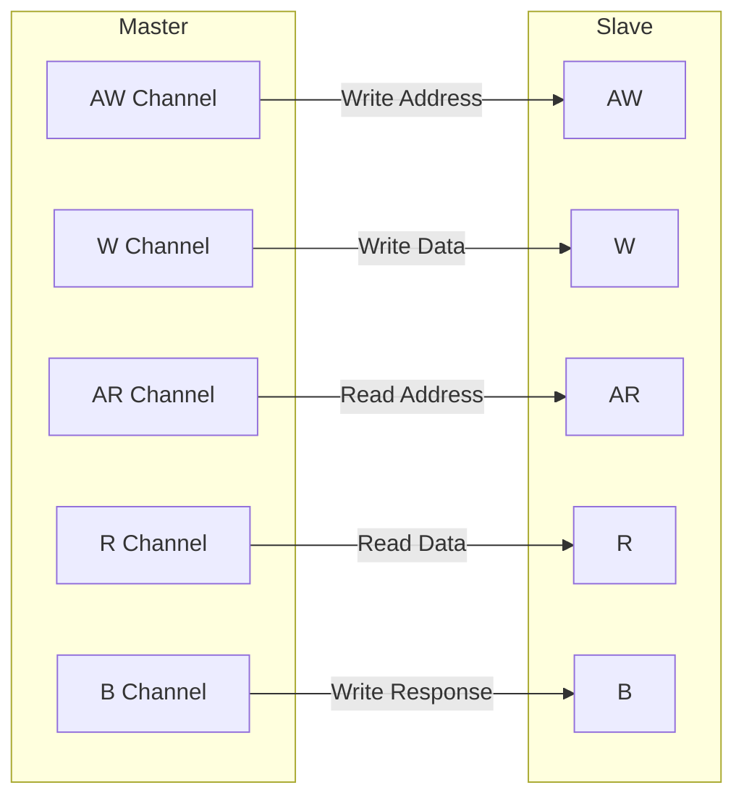
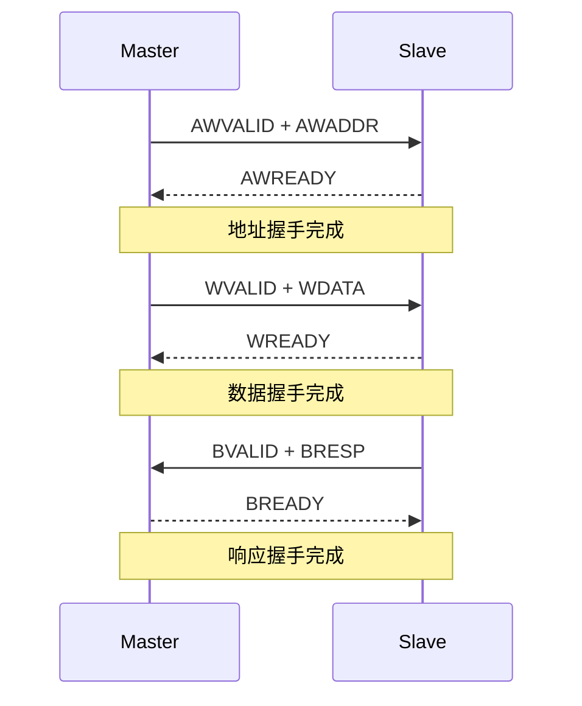

# AXI协议基础与五通道架构

[I]

---

为什么片上互连需要从 AXI 的一致性扩展走向 CHI？ 当 SoC 从单芯片多 Cluster 扩展到多芯片/机架级部署时，AXI 的 snoop 广播机制面临带宽与扇出爆炸。设计者需要一种基于包交换、支持目录过滤、可扩展至百核以上的互连协议。CHI 通过请求/响应/数据分离的 Flit 格式与分层拓扑，将一致性域从片上推向系统级。AXI5 则在非一致性路径上补全原子操作与资源分区，共同构成 ARM 基础设施战略的互连双翼。 
### AXI的定位

AXI（Advanced eXtensible Interface）是AMBA3引入的高性能片上互连协议， 
核心思想：把读写交易的地址、数据、响应完全分离到独立通道。 

与AHB的差异： 
- AHB是共享总线，同一时刻只有一个master在传地址 
- AXI是交叉开关（crossbar），五个通道可以并行跑 

类比：AHB像单车道马路，AXI像五车道分离式高架—— 
去程地址、去程数据、返程地址、返程数据、返程确认各自一条道，互不堵车。 

---

### 五通道详解

| 通道 | 方向 | 作用 | 关键信号 |
|------|------|------|----------|
| AW | M→S | 写地址 | AWADDR, AWID, AWLEN, AWSIZE, AWBURST |
| W | M→S | 写数据 | WDATA, WSTRB, WLAST, WID |
| B | S→M | 写响应 | BRESP, BID |
| AR | M→S | 读地址 | ARADDR, ARID, ARLEN, ARSIZE, ARBURST |
| R | S→M | 读数据 | RDATA, RRESP, RLAST, RID |

易错点：写响应B通道不是可选的，AXI规定每笔写交易必须收到BRESP才算完成。 

---

### 握手机制

AXI 每个通道独立握手，使用 VALID/READY 双信号握手： 
- VALID 由发送方拉高，表示"数据有效" 
- READY 由接收方拉高，表示"我能收" 
- 两者同时为高时，时钟上升沿完成一次传输 

VALID/READY 握手的关键规则： 
1. VALID 一旦拉高，必须保持到 READY 为高后才能拉低 
2. READY 可以等 VALID 也可以不等（先READY后VALID叫"提前开门"） 
3. 不允许 VALID 等 READY 超过一个必要周期而降低 

---

### 关键信号字段解析

#### AxID[3:0] — 交易标识

AxID 是 AXI 乱序完成的灵魂，每笔交易带一个ID， 
slave 返回响应时也带同样的ID，master靠ID匹配哪笔交易完成了。 

| 信号 | 宽度 | 含义 |
|------|------|------|
| AWID/ARID | 配置决定 | 写/读交易ID |
| BID/RID | 同AWID/ARID | 响应返回的ID |

#### AxADDR[31:0] — 起始地址

突发传输的起始字节地址。 
注意：AXI4支持64位地址（AXI4 扩展为AxADDR[63:0]）。 

#### AxLEN[7:0] — 突发长度

AXI3：AxLEN[3:0]，突发长度 = AxLEN + 1，范围1~16拍 
AXI4：AxLEN[7:0]，突发长度 = AxLEN + 1，范围1~256拍 

#### AxSIZE[2:0] — 每拍数据宽度

| AxSIZE | 每拍字节数 |
|--------|----------|
| 0b000 | 1 Byte |
| 0b001 | 2 Bytes |
| 0b010 | 4 Bytes |
| 0b011 | 8 Bytes |
| 0b100 | 16 Bytes |
| 0b101 | 32 Bytes |
| 0b110 | 64 Bytes |
| 0b111 | 128 Bytes |

总传输字节数 = (AxLEN + 1) × (2^AxSIZE) 

#### AxBURST[1:0] — 突发类型

| 编码 | 类型 | 说明 |
|------|------|------|
| 0b00 | FIXED | 固定地址，FIFO队列专用 |
| 0b01 | INCR | 递增地址，常规内存访问 |
| 0b10 | WRAP | 回环地址，cache line填充 |
| 0b11 | Reserved | 保留 |

---

### AXI4新增信号

AXI4 在 AXI3 基础上新增了若干信号， 
其中QoS和Region信号对系统级性能调优至关重要。 

| 新增信号 | 方向 | 作用 |
|----------|------|------|
| AxQOS[3:0] | M→S | 服务质量优先级，0~15，越大越优先 |
| AxREGION[3:0] | M→S | 地址区域标识，用于物理地址到 slave 的映射 |
| AxUSER | M→S | 用户自定义扩展，厂商可自由定义 |
| AxLOCK | M→S | 原子访问指示（AXI3原有但AXI4简化为1bit） |
| AxCACHE[3:0] | M→S | 缓存策略提示（Bufferable/Cacheable等） |
| AxPROT[2:0] | M→S | 保护类型（特权/安全/指令数据） |

易错点：AxCACHE 只是"提示"，slave可以选择忽略。 
真正决定缓存行为的，是系统级的MMU配置和slave自身的实现。 

---

### AXI4-Lite 与 AXI4 的差异

| 特性 | AXI4 | AXI4-Lite |
|------|------|-----------|
| 突发传输 | 支持1~256拍 | 仅单拍（AxLEN固定为0） |
| ID信号 | 支持多ID乱序 | 无ID，顺序完成 |
| 数据宽度 | 32/64/128/256... | 32/64 bit |
| 锁传输 | 支持 | 不支持 |
| 应用场景 | DDR、DMA、高性能互联 | 寄存器映射外设、控制接口 |

扩展：AXI4-Lite 虽然简单，但在Zynq、Cortex-M这类系统中， 
90%的外设控制端口都是AXI4-Lite，因为寄存器访问本来就是单拍。 

---

**学习路径提示**： 
- [I] 读者：记住五通道的名字和方向，理解VALID/READY握手规则。 
- 重点掌握AxLEN、AxSIZE、AxBURST三个字段，它们是后续突发传输计算的基石。 

---

## 历史演进与发展趋势

AXI5 与 ACE（AXI Coherency Extensions）代表了 ARM 从单芯片一致性到系统级一致性的战略跨越。2011 年，随着 Cortex-A15 引入 big.LITTLE 架构，多簇（Cluster）处理器之间共享数据的需求催生了 ACE 协议，它在 AXI4 基础上新增 snoop 通道（AC/CR/CD），使外部主设备能够监听并维护缓存一致性。2013 年，面向服务器与网络基础设施的 ACE-Lite 发布，允许 I/O 主设备参与一致性域而无需完整缓存。2015 年 AMBA 5 将 ACE 演进为 CHI（Coherent Hub Interface），同时推出 AXI5 作为非一致性互连的顶峰规范。AXI5 继承了 AXI4 的全部优势，并新增原子事务、MPAM 资源分区和扩展用户信号，为 PCIe/CCIX 等片外一致性协议提供统一的片上接口。ACE 与 CHI 的协同，使 ARM 生态实现了从 Cortex-A 手机 SoC 到 Neoverse 数据中心处理器的一致性全覆盖，成为片上互连技术发展的前沿标杆。

---

## 本章小结

| 要点 | 内容 |
|------|------|
| AXI5 演进 | 新增原子操作、MPAM 内存分域、Trace 标签，面向基础设施级互连 |
| ACE 定位 | 在 AXI4 基础上扩展 Snoop 通道，实现多 Cluster 缓存一致性 |
| CHI 升级 | AMBA 5 CHI 将请求/响应/数据分离为独立包格式，支持机架级互连 |
| 一致性域 | Inner Shareable、Outer Shareable、Non-Shareable 三级域划分 |

## 练习

1. ACE 的 AC/CR/CD Snoop 通道如何与 AXI 原有五通道协同工作？画出 Cache Line 失效的完整序列图。
2. AXI5 的原子操作相比 AXI4 的 Locked 传输在实现上有何优势？为什么服务器 CPU 需要这一特性？
3. CHI 协议采用基于包的 Flit 传输而非 AXI 的信号级握手，这种设计如何支持更大规模的互连拓扑？
