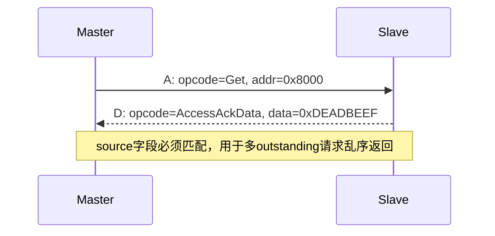
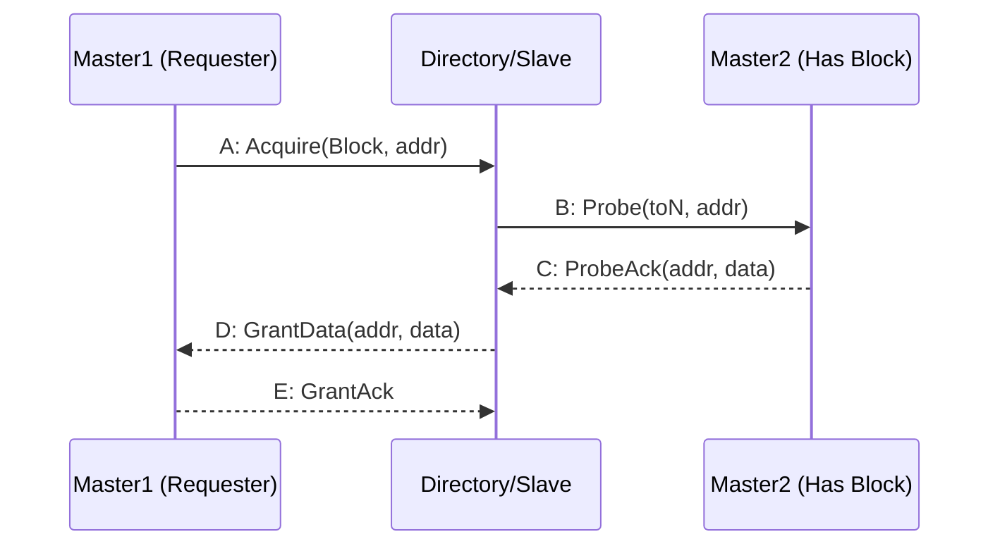
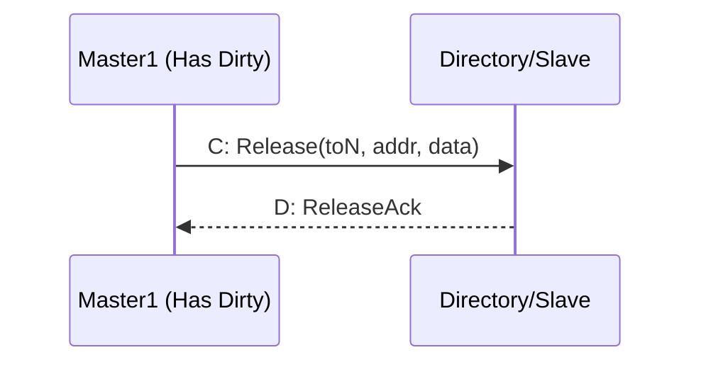
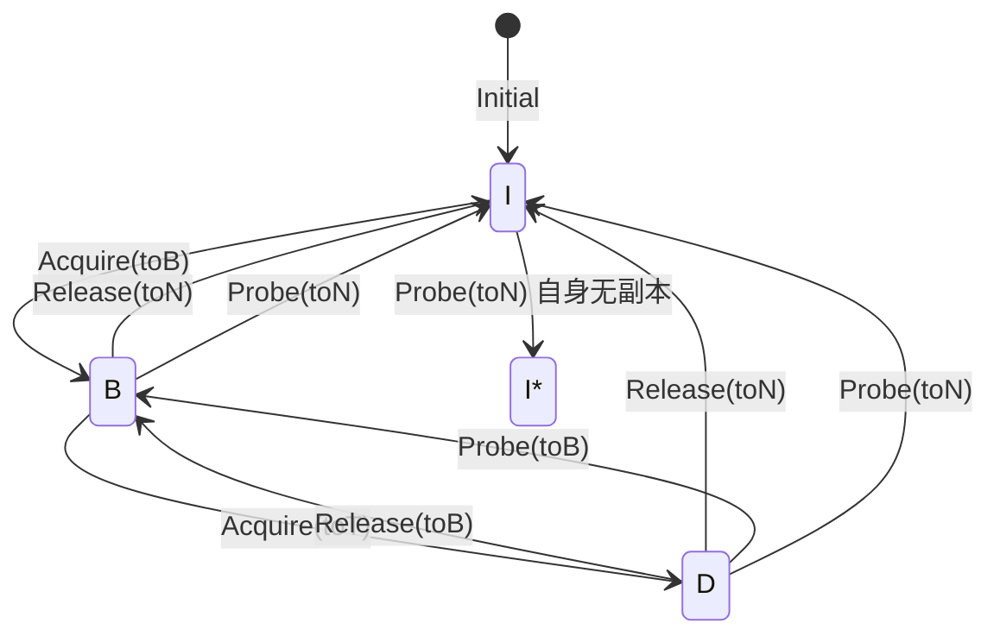

# TileLink通道与缓存一致性

<span class="badge-i">[I]</span> <span class="badge-e">[E]</span>

---

<span class="red">为什么片上互连需要从 AXI 的一致性扩展走向 CHI？</span> 当 SoC 从单芯片多 Cluster 扩展到多芯片/机架级部署时，AXI 的 snoop 广播机制面临带宽与扇出爆炸。设计者需要一种基于包交换、支持目录过滤、可扩展至百核以上的互连协议。CHI 通过请求/响应/数据分离的 Flit 格式与分层拓扑，将一致性域从片上推向系统级。AXI5 则在非一致性路径上补全原子操作与资源分区，共同构成 ARM 基础设施战略的互连双翼。<br>
### 五通道：A/B/C/D/E

TileLink的精髓在于通道化设计，每条通道有固定方向：

| 通道 | 方向 | 功能 | TL-UL | TL-UH | TL-C |
|------|------|------|-------|-------|------|
| A | Master→Slave | 请求发起 | 有 | 有 | 有 |
| B | Slave→Master | 探针/转发 | 无 | 无 | 有 |
| C | Master→Slave | 释放/响应 | 无 | 无 | 有 |
| D | Slave→Master | 响应/授权 | 有 | 有 | 有 |
| E | Master→Slave | 最终确认 | 无 | 无 | 有 |

类比：五通道像餐厅的点餐流水线——
<br>
A通道：顾客下单（Master发起请求）。
<br>
B通道：厨房询问其他分店库存（Slave探查其他Master缓存）。
<br>
C通道：分店释放库存（Master交出缓存副本）。
<br>
D通道：厨房上菜（Slave返回数据/授权）。
<br>
E通道：顾客确认收到（Master完成握手）。
<br>

<span class="blue">关键认知：TL-UL只有A+D两通道，TL-C才需要全部五通道。通道越多，面积越大，一致性越强。</span><br>

---

### TL-UL事务：Get/PutFull/PutPartial

TL-UL是最简单的消息集，只有4个opcode：

| opcode | 名称 | 方向 | 功能 |
|--------|------|------|------|
| 0 | PutFullData | A→D | 全字写（mask全1） |
| 1 | PutPartialData | A→D | 部分写（mask可部分置0） |
| 4 | Get | A→D | 读请求 |
| 0 | AccessAck | D→A | 写完成响应 |
| 4 | AccessAckData | D→A | 读数据响应 |

TL-UL读事务流程：
<br>
1. Master在A通道发送Get消息（address, source, size, mask）
<br>
2. Slave在D通道返回AccessAckData（data, source匹配）
<br>
3. 握手完成，无后续状态
<br>



<span class="blue">易错点：source字段是请求ID，不是设备ID。Master可同时发多个outstanding请求，靠source区分返回数据归属。</span><br>

---

### TL-C事务：Acquire/Release/Probe/Grant

TL-C在TL-UL基础上增加了缓存一致性事务：

| opcode | 通道 | 名称 | 功能 |
|--------|------|------|------|
| 6 | A | Acquire | 请求获取缓存权限 |
| 7 | C | Release | 主动释放缓存块 |
| 5 | C | ProbeAck | 响应探针，交出数据 |
| 6 | B | Probe | 要求交出缓存副本 |
| 4/5 | D | Grant/GrantData | 授权访问/附带数据 |
| 0 | E | GrantAck | 确认收到授权 |

完整一致性消息流程（Acquire读独享）：



TL-C写回流程（Release写回脏数据）：



<span class="red">核心概念：TL-C用"目录式（Directory-based）"一致性，由中心目录管理每个缓存块的状态，而非广播侦听。 Acquire-Probe-Grant三步完成权限转移。</span><br>

---

### 目录式一致性 vs 侦听式Snooping

| 维度 | 目录式（TileLink/CHI） | 侦听式（MOESI/MESI） |
|------|----------------------|---------------------|
| 状态查询 | 查目录表 | 广播到所有缓存 |
| 可扩展性 | 好（O(N)存储） | 差（O(N²)广播） |
| 延迟 | 多一跳（查目录） | 单跳（直连广播） |
| 适用场景 | 多核/众核 | 双核/四核 |
| 典型实现 | TileLink TL-C、ARM CHI | x86 MESIF、ARM AMBA ACE |

目录表存储结构（每个缓存块一行）：
<br>

| 字段 | 位宽 | 说明 |
|------|------|------|
| Block Address | 48 | 缓存块基地址 |
| State | 3 | 全局状态（I/B/T/D等） |
| Sharers | N | N位向量，表示哪些Master共享 |
| Owner | log₂N | 当前独占者（Dirty时） |

<span class="blue">结论：目录式用存储换带宽，侦听式用带宽换延迟。8核以上几乎必选目录式。</span><br>

---

### 状态机：Invalid→Branch→Trunk→Dirty

TileLink缓存状态比传统MOESI更抽象，聚焦"权限"而非"数据是否最新"：

| 状态 | 可读 | 可写 | 含义 |
|------|------|------|------|
| Invalid (I) | 否 | 否 | 无有效副本 |
| Invalidated (I*) | 否 | 否 | 刚被无效化，待确认 |
| Branch (B) | 是 | 否 | 只读共享（可有多份） |
| Trunk (T) | 是 | 否 |  trunk节点，负责转发 |
| Dirty (D) | 是 | 是 | 独占且已修改 |



状态转换驱动规则：
<br>
- Acquire(toB)：获得读权限，进入Branch状态。<br>
- Acquire(toT)：获得读写权限，进入Dirty状态。<br>
- Probe(toN)：交出所有权限，退回Invalid。<br>
- Release(toN/B)：主动降级，交出权限。<br>

<span class="purple">扩展："Trunk"是TileLink特有的中间态，表示该节点是其他Branch的上级，负责协调下级缓存。这在多级缓存中尤其重要。</span><br>

---

### 代码：Rocket Chip TileLink Bundle

以下是用Chisel定义的TL-UL Bundle（Chisel是Scala-embedded HDL）：

```scala
// TL-UL A通道Bundle
class TLBundleA(param: TLBundleParameters) extends Bundle {
  val opcode  = UInt(3.W)           // 操作码
  val param   = UInt(3.W)           // 缓存参数
  val size    = UInt(param.sizeBits.W)   // log2(字节数)
  val source  = UInt(param.sourceBits.W)   // 源ID
  val address = UInt(param.addressBits.W)  // 目标地址
  val mask    = UInt(param.dataBits/8.W)   // 字节掩码
  val data    = UInt(param.dataBits.W)     // 写数据
  val corrupt = Bool()              // 数据损坏标记
}

// TL-UL D通道Bundle
class TLBundleD(param: TLBundleParameters) extends Bundle {
  val opcode  = UInt(3.W)
  val param   = UInt(2.W)
  val size    = UInt(param.sizeBits.W)
  val source  = UInt(param.sourceBits.W)
  val sink    = UInt(param.sinkBits.W)     // 目的ID（TL-C用）
  val denied  = Bool()              // 请求被拒绝
  val data    = UInt(param.dataBits.W)
  val corrupt = Bool()
}

// 完整TileLink接口（TL-C）
class TLBundle(val params: TLBundleParameters) extends Bundle {
  val a = Decoupled(new TLBundleA(params))  // Master->Slave
  val b = Flipped(Decoupled(new TLBundleB(params)))  // Slave->Master
  val c = Decoupled(new TLBundleC(params))  // Master->Slave
  val d = Flipped(Decoupled(new TLBundleD(params)))  // Slave->Master
  val e = Decoupled(new TLBundleE(params))  // Master->Slave
}
```

<span class="blue">易错点：Decoupled表示ready/valid握手，Flipped翻转方向。TileLink所有通道均用ready/valid流控，无固定时钟拍。</span><br>

---

**学习路径提示**：<br>
- <span class="badge-i">[I]</span> 读者：掌握TL-UL的4个opcode和A/D握手流程，source字段是多outstanding的关键。<br>
- <span class="badge-e">[E]</span> 读者：深入理解目录式一致性的状态机，对比MESI和TileLink状态差异。

---

## 历史演进与发展趋势

AXI5 与 ACE（AXI Coherency Extensions）代表了 ARM 从单芯片一致性到系统级一致性的战略跨越。2011 年，随着 Cortex-A15 引入 big.LITTLE 架构，多簇（Cluster）处理器之间共享数据的需求催生了 ACE 协议，它在 AXI4 基础上新增 snoop 通道（AC/CR/CD），使外部主设备能够监听并维护缓存一致性。2013 年，面向服务器与网络基础设施的 ACE-Lite 发布，允许 I/O 主设备参与一致性域而无需完整缓存。2015 年 AMBA 5 将 ACE 演进为 CHI（Coherent Hub Interface），同时推出 AXI5 作为非一致性互连的顶峰规范。AXI5 继承了 AXI4 的全部优势，并新增原子事务、MPAM 资源分区和扩展用户信号，为 PCIe/CCIX 等片外一致性协议提供统一的片上接口。ACE 与 CHI 的协同，使 ARM 生态实现了从 Cortex-A 手机 SoC 到 Neoverse 数据中心处理器的一致性全覆盖，成为片上互连技术发展的前沿标杆。

---

## 本章小结

| 要点 | 内容 |
|------|------|
| AXI5 演进 | 新增原子操作、MPAM 内存分域、Trace 标签，面向基础设施级互连 |
| ACE 定位 | 在 AXI4 基础上扩展 Snoop 通道，实现多 Cluster 缓存一致性 |
| CHI 升级 | AMBA 5 CHI 将请求/响应/数据分离为独立包格式，支持机架级互连 |
| 一致性域 | Inner Shareable、Outer Shareable、Non-Shareable 三级域划分 |

## 练习

1. ACE 的 AC/CR/CD Snoop 通道如何与 AXI 原有五通道协同工作？画出 Cache Line 失效的完整序列图。
2. AXI5 的原子操作相比 AXI4 的 Locked 传输在实现上有何优势？为什么服务器 CPU 需要这一特性？
3. CHI 协议采用基于包的 Flit 传输而非 AXI 的信号级握手，这种设计如何支持更大规模的互连拓扑？
