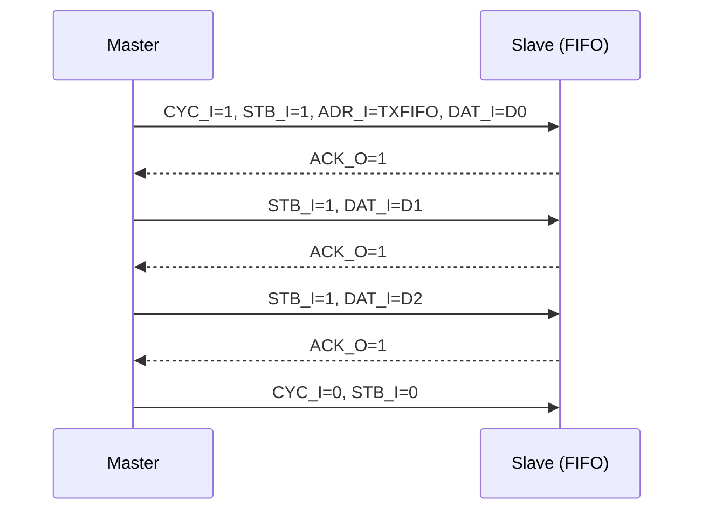
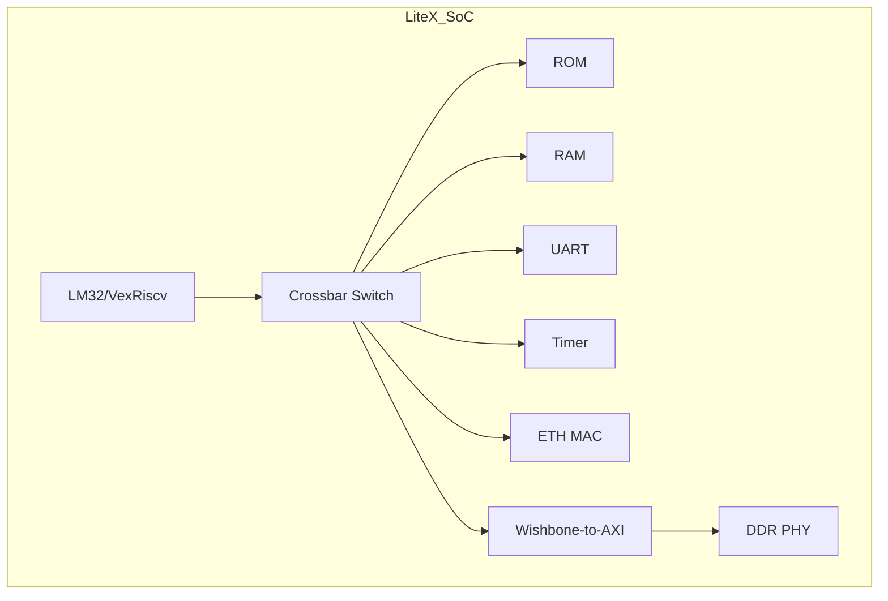

# Wishbone实战与FPGA应用

<span class="badge-i">[I]</span>

---

<span class="red">为什么片上互连需要从 AXI 的一致性扩展走向 CHI？</span> 当 SoC 从单芯片多 Cluster 扩展到多芯片/机架级部署时，AXI 的 snoop 广播机制面临带宽与扇出爆炸。设计者需要一种基于包交换、支持目录过滤、可扩展至百核以上的互连协议。CHI 通过请求/响应/数据分离的 Flit 格式与分层拓扑，将一致性域从片上推向系统级。AXI5 则在非一致性路径上补全原子操作与资源分区，共同构成 ARM 基础设施战略的互连双翼。<br>
### RTL从机模板

以下是一个完整的Wishbone B.4从机模板，实现4个32位寄存器，支持字节掩码：

```verilog
module wb_slave_template (
    input         CLK_I,
    input         RST_I,
    input  [31:0] ADR_I,
    input  [31:0] DAT_I,
    output reg [31:0] DAT_O,
    input         WE_I,
    input  [3:0]  SEL_I,
    input         STB_I,
    output reg    ACK_O,
    input         CYC_I,
    output reg    ERR_O
);

    reg [31:0] reg0, reg1, reg2, reg3;
    wire [3:0] addr_idx = ADR_I[5:2];

    // 状态机
    localparam ST_IDLE = 1'b0;
    localparam ST_ACK  = 1'b1;
    reg state;

    always @(posedge CLK_I) begin
        if (RST_I) begin
            state  <= ST_IDLE;
            ACK_O  <= 1'b0;
            ERR_O  <= 1'b0;
            DAT_O  <= 32'h0;
            reg0   <= 32'h0;
            reg1   <= 32'h0;
            reg2   <= 32'h0;
            reg3   <= 32'h0;
        end else begin
            case (state)
                ST_IDLE: begin
                    ACK_O <= 1'b0;
                    ERR_O <= 1'b0;
                    if (CYC_I && STB_I) begin
                        state <= ST_ACK;
                        if (addr_idx > 4'd3) begin
                            ERR_O <= 1'b1;
                            ACK_O <= 1'b1;
                        end else begin
                            ACK_O <= 1'b1;
                            if (WE_I) begin
                                // 字节掩码写
                                case (addr_idx)
                                    4'd0: begin
                                        if (SEL_I[0]) reg0[7:0]   <= DAT_I[7:0];
                                        if (SEL_I[1]) reg0[15:8]  <= DAT_I[15:8];
                                        if (SEL_I[2]) reg0[23:16] <= DAT_I[23:16];
                                        if (SEL_I[3]) reg0[31:24] <= DAT_I[31:24];
                                    end
                                    4'd1: begin
                                        if (SEL_I[0]) reg1[7:0]   <= DAT_I[7:0];
                                        if (SEL_I[1]) reg1[15:8]  <= DAT_I[15:8];
                                        if (SEL_I[2]) reg1[23:16] <= DAT_I[23:16];
                                        if (SEL_I[3]) reg1[31:24] <= DAT_I[31:24];
                                    end
                                    4'd2: begin
                                        if (SEL_I[0]) reg2[7:0]   <= DAT_I[7:0];
                                        if (SEL_I[1]) reg2[15:8]  <= DAT_I[15:8];
                                        if (SEL_I[2]) reg2[23:16] <= DAT_I[23:16];
                                        if (SEL_I[3]) reg2[31:24] <= DAT_I[31:24];
                                    end
                                    4'd3: begin
                                        if (SEL_I[0]) reg3[7:0]   <= DAT_I[7:0];
                                        if (SEL_I[1]) reg3[15:8]  <= DAT_I[15:8];
                                        if (SEL_I[2]) reg3[23:16] <= DAT_I[23:16];
                                        if (SEL_I[3]) reg3[31:24] <= DAT_I[31:24];
                                    end
                                endcase
                            end else begin
                                case (addr_idx)
                                    4'd0: DAT_O <= reg0;
                                    4'd1: DAT_O <= reg1;
                                    4'd2: DAT_O <= reg2;
                                    4'd3: DAT_O <= reg3;
                                endcase
                            end
                        end
                    end
                end
                ST_ACK: begin
                    ACK_O <= 1'b0;
                    ERR_O <= 1'b0;
                    state <= ST_IDLE;
                end
            endcase
        end
    end

endmodule
```

<span class="blue">易错点：B.3版本无SEL_I，写操作必须全字更新；B.4版本SEL_I允许部分字节写，但多数旧IP忽略该信号。</span><br>

---

### 块传输模式

Wishbone B.3起支持<span class="green">块传输（Block Transfer）</span>，即固定地址或增量地址的突发传输。

固定地址块传输（适合FIFO）：
<br>
Master保持ADR_I不变，连续拉高STB_I，Slave每拍回ACK_O。
<br>
用于访问UART TXFIFO——地址不动，数据流水写入。
<br>



增量地址块传输（适合RAM）：
<br>
Master每拍自动递增ADR_I，Slave逐地址响应。
<br>
地址增量由Master控制，协议本身不规定步长。
<br>

| 模式 | ADR_I行为 | 典型场景 |
|------|----------|----------|
| 单周期 | 每拍独立 | 寄存器访问 |
| 固定地址块 | 保持不变 | FIFO、流缓冲 |
| 增量地址块 | 每拍递增 | SRAM、Flash |
| 回环突发 | 按模递增 | DMA缓存行填充 |

---

### TAG信号扩展

Wishbone预留3组TAG信号用于用户自定义扩展：

| TAG | 信号名 | 方向 | 用途 |
|-----|--------|------|------|
| TGA | ADR_TAG | 输入 | 地址标签（如虚拟地址标志） |
| TGD | DATA_TAG | 双向 | 数据标签（如ECC校验位） |
| TGC | CYC_TAG | 输入 | 周期标签（如传输优先级） |

典型应用：给数据加ECC
<br>

```verilog
module wb_slave_with_ecc (
    // ... 标准Wishbone信号 ...
    input  [6:0] TGD_I,   // 输入数据ECC
    output [6:0] TGD_O    // 输出数据ECC
);
    wire [6:0] calc_ecc;
    ecc_generator ecc_gen(.data(DAT_O), .ecc(calc_ecc));
    assign TGD_O = calc_ecc;
    // 读数据时同时返回ECC
endmodule
```

<span class="purple">扩展：TAG机制是Wishbone灵活性的体现——不修改协议核心，只通过附加信号扩展功能。</span><br>

---

### OpenCores IP库

OpenCores维护了大量Wishbone接口的开源IP核：

| IP核 | 功能 | 语言 | 成熟度 |
|------|------|------|--------|
| uart16550 | 兼容16550 UART | Verilog | 高 |
| simple_spi | SPI主控制器 | Verilog | 高 |
| sdram_controller | SDRAM接口 | Verilog | 中 |
| vga_lcd | VGA显示控制器 | VHDL | 中 |
| ac97 | AC97音频控制器 | Verilog | 低 |
| ethernet_mac | 10/100M以太网MAC | Verilog | 高 |

获取方式：
<br>

```bash
# OpenCores使用SVN管理
co svn://opencores.org/ocsvn/uart16550/trunk uart16550
cd uart16550/rtl/verilog
# 典型结构：wb_uart16550.v 是顶层，带Wishbone接口
```

<span class="blue">关键认知：OpenCores IP的Wishbone接口通常自包含——无需额外总线基础设施，直接例化即可工作。</span><br>

---

### LiteX框架集成

LiteX是FPGA SoC构建框架（Python-based），用Wishbone作为内部总线主干：
<br>



LiteX自动生成Wishbone互连的Python代码：
<br>

```python
from litex.soc.integration.soc_core import SoCCore
from litex.soc.cores.uart import UARTWishboneBridge
from litex.soc.interconnect import wishbone

# 创建Wishbone总线
wb_bus = wishbone.Interface(data_width=32, address_width=30)

# 添加UART到Wishbone总线
self.submodules.uart = UARTWishboneBridge(
    platform.request("serial"),
    clk_freq=sys_clk_freq,
    baudrate=115200
)
self.bus.add_slave("uart", self.uart.wb, region=SoCRegion(
    origin=0x90000000, size=0x1000
))
```

<span class="blue">结论：LiteX用Python描述SoC架构，自动生成Wishbone交叉开关和地址解码器——把硬件设计变成了脚本配置。</span><br>

---

### cocotb验证环境

cocotb是Python-based的HDL验证框架，适合写Wishbone testbench：

```python
# AXI5_ACE 代码示例
import cocotb
from cocotb.clock import Clock
from cocotb.triggers import RisingEdge, Timer
from cocotb_bus.drivers import BusDriver

class WishboneMaster(BusDriver):
    _signals = ["CLK_I", "RST_I", "ADR_I", "DAT_I", "DAT_O",
                "WE_I", "SEL_I", "STB_I", "ACK_O", "CYC_I", "ERR_O"]

    def __init__(self, entity, name, clock):
        BusDriver.__init__(self, entity, name, clock)
        self.bus.CYC_I.setimmediatevalue(0)
        self.bus.STB_I.setimmediatevalue(0)

    async def write(self, addr, data, sel=0xF):
        await RisingEdge(self.clock)
        self.bus.ADR_I.value = addr
        self.bus.DAT_I.value = data
        self.bus.WE_I.value = 1
        self.bus.SEL_I.value = sel
        self.bus.CYC_I.value = 1
        self.bus.STB_I.value = 1
        await RisingEdge(self.clock)
        while not self.bus.ACK_O.value:
            await RisingEdge(self.clock)
        self.bus.CYC_I.value = 0
        self.bus.STB_I.value = 0
        return True

    async def read(self, addr):
        await RisingEdge(self.clock)
        self.bus.ADR_I.value = addr
        self.bus.WE_I.value = 0
        self.bus.CYC_I.value = 1
        self.bus.STB_I.value = 1
        await RisingEdge(self.clock)
        while not self.bus.ACK_O.value:
            await RisingEdge(self.clock)
        data = int(self.bus.DAT_O.value)
        self.bus.CYC_I.value = 0
        self.bus.STB_I.value = 0
        return data

@cocotb.test()
async def test_wb_slave(dut):
    clock = Clock(dut.CLK_I, 10, units="ns")
    cocotb.start_soon(clock.start())
    dut.RST_I.value = 1
    await Timer(100, units="ns")
    dut.RST_I.value = 0

    wb = WishboneMaster(dut, "", dut.CLK_I)
    await wb.write(0x00, 0xDEADBEEF)
    result = await wb.read(0x00)
    assert result == 0xDEADBEEF, f"Read {hex(result)}, expected 0xDEADBEEF"

```

<span class="blue">易错点：cocotb的BusDriver假设信号名与Wishbone标准一致，如果RTL用了不同命名，需自定义_signal_dict映射。</span><br>

---

**学习路径提示**：<br>
- <span class="badge-i">[I]</span> 读者：从OpenCores下载uart16550，用cocotb写读/写寄存器的testbench。<br>
- 进阶练习：在LiteX中集成一个自定义Wishbone IP，观察生成的交叉开关Verilog代码。

---

## 历史演进与发展趋势

AXI5 与 ACE（AXI Coherency Extensions）代表了 ARM 从单芯片一致性到系统级一致性的战略跨越。2011 年，随着 Cortex-A15 引入 big.LITTLE 架构，多簇（Cluster）处理器之间共享数据的需求催生了 ACE 协议，它在 AXI4 基础上新增 snoop 通道（AC/CR/CD），使外部主设备能够监听并维护缓存一致性。2013 年，面向服务器与网络基础设施的 ACE-Lite 发布，允许 I/O 主设备参与一致性域而无需完整缓存。2015 年 AMBA 5 将 ACE 演进为 CHI（Coherent Hub Interface），同时推出 AXI5 作为非一致性互连的顶峰规范。AXI5 继承了 AXI4 的全部优势，并新增原子事务、MPAM 资源分区和扩展用户信号，为 PCIe/CCIX 等片外一致性协议提供统一的片上接口。ACE 与 CHI 的协同，使 ARM 生态实现了从 Cortex-A 手机 SoC 到 Neoverse 数据中心处理器的一致性全覆盖，成为片上互连技术发展的前沿标杆。

---

## 本章小结

| 要点 | 内容 |
|------|------|
| AXI5 演进 | 新增原子操作、MPAM 内存分域、Trace 标签，面向基础设施级互连 |
| ACE 定位 | 在 AXI4 基础上扩展 Snoop 通道，实现多 Cluster 缓存一致性 |
| CHI 升级 | AMBA 5 CHI 将请求/响应/数据分离为独立包格式，支持机架级互连 |
| 一致性域 | Inner Shareable、Outer Shareable、Non-Shareable 三级域划分 |

## 练习

1. ACE 的 AC/CR/CD Snoop 通道如何与 AXI 原有五通道协同工作？画出 Cache Line 失效的完整序列图。
2. AXI5 的原子操作相比 AXI4 的 Locked 传输在实现上有何优势？为什么服务器 CPU 需要这一特性？
3. CHI 协议采用基于包的 Flit 传输而非 AXI 的信号级握手，这种设计如何支持更大规模的互连拓扑？
