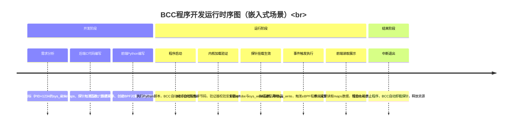
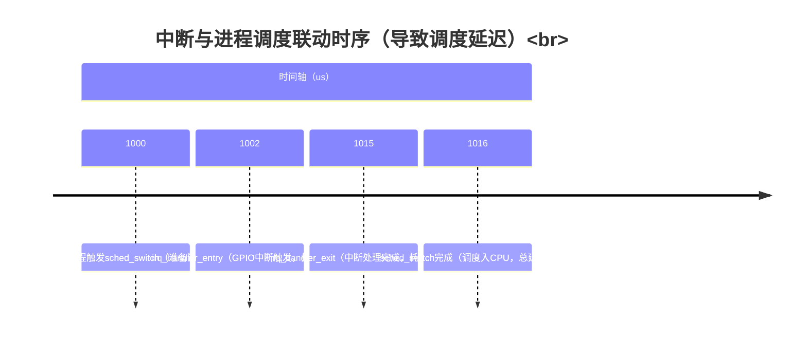

# 动态追踪

> 📊 **本章难度等级：** <span class="badge-i">**中级 (Intermediate)**</span>

---


---

## 动态追踪技术总览


---

## 动态追踪的定义与核心价值


### <strong>在嵌入式Linux开发中，“调试”与“优化”是贯穿项目全生命周期的核心需求——从原型阶段的功能异常，到量产阶段的性能瓶颈，再到运维阶段的偶发故障，都需要高效的技术手段支撑。**动态追踪（Dynamic Tracing）** 就是这样一套技术体系：它允许开发者在目标系统**运行状态下**，通过钩子（Hook）或探针（Probe）采集内核态/用户态的行为数据（如函数调用、事件触发、资源占用等），且无需修改目标程序源码、无需重启系统，甚至可在生产环境中低开销运行。</strong>

与我们熟悉的“打印日志”“断点调试”不同，动态追踪的核心优势在于“动态性”与“无侵入性”——它像一台“隐形的监控摄像机”，在不干扰系统正常运行的前提下，记录关键行为数据，为问题定位和性能分析提供依据。<br>

### <strong>动态追踪与静态调试的本质区别</strong>

嵌入式开发中最常用的“静态调试”（如GDB断点调试、编译期插桩）虽能解决基础问题，但在复杂场景下存在明显局限。<br>
二者的核心差异体现在“对系统运行的干预程度”和“适用场景”上，具体对比如下表：<br>
| 对比维度         | 静态调试（以GDB为例）                | 动态追踪（以ftrace/perf为例）         |
|------------------|---------------------------------------|---------------------------------------|
| 干预方式         | 主动中断进程（断点暂停）、修改内存    | 被动采集数据（无中断）、不修改资源    |
| 运行状态依赖     | 需进程处于可调试状态（如暂停、单步）  | 支持进程正常运行，可追踪后台/内核进程 |
| 适用阶段         | 开发阶段（原型验证、功能调试）        | 开发/测试/生产全阶段（尤其生产环境）  |
| 数据采集粒度     | 单进程、单线程的局部数据（如变量值）  | 全系统、多进程的全局数据（如调度、中断） |
| 性能开销         | 高（断点暂停会阻塞业务，单步调试耗时）| 低（微秒级探针开销，可控制采样频率）  |
| 核心局限性       | 无法复现偶发故障（中断运行会破坏现场）| 不直接获取变量值，需通过行为反推状态  |
举个嵌入式场景的直观例子：若开发一款工业控制器，出现“每2小时随机卡顿1秒”的偶发故障——用GDB断点调试时，一旦暂停进程，故障现场就被破坏，永远无法复现；而用动态追踪工具（如ftrace）可在生产环境持续运行，记录卡顿时刻的内核调度、中断响应数据，最终定位到“某驱动函数长时间关闭中断”的根因。<br>

### <strong>嵌入式场景下动态追踪的核心作用</strong>

嵌入式系统的“资源受限”（小内存、低算力）和“场景特殊”（实时性、高可靠），决定了动态追踪的核心价值集中在**问题定位、性能剖析、无侵入监控**三大场景，每个场景都对应明确的工程需求：<br>
1.  **问题定位：复现“不可复现”的偶发故障**<br>
嵌入式系统中，约30%的故障是“偶发且不可复现”的——如低温环境下的启动失败、高负载时的设备离线、随机出现的通信超时等。这类故障的共性是“依赖特定运行上下文”，静态调试无法复现，而动态追踪可通过“持续采集关键事件”捕捉故障现场。<br>
- 典型场景：某车载导航设备在“高速行驶+蓝牙连接”时随机重启，重启前无任何日志输出。
- 动态追踪方案：用ftrace开启“进程退出事件（sched_process_exit）”和“内存分配失败事件（kmalloc_fail）”追踪，同时用perf采集CPU异常占用数据。最终通过追踪数据发现：蓝牙驱动的内存泄漏导致OOM（内存溢出），触发内核重启。
- 关键命令示例（开发板端执行）：
```bash
# 1. 挂载tracefs并开启进程退出事件追踪<br>
mount -t tracefs nodev /sys/kernel/tracing<br>
echo 1 > /sys/kernel/tracing/events/sched/sched_process_exit/enable<br>
# 2. 用perf后台采集CPU和内存事件（采样频率1000次/秒）<br>
perf record -e cpu-clock,kmalloc -a -g -o perf.data &<br>
```
2.  **性能剖析：定位“看不见”的瓶颈节点**<br>
嵌入式系统的性能指标（启动时间、响应延迟、功耗）直接决定产品竞争力——如智能手表要求“亮屏响应<100ms”、工业控制器要求“启动时间<2s”。这些指标的瓶颈往往隐藏在“内核态与用户态的交互中”，如调度延迟、中断阻塞、函数耗时过长，动态追踪可精准定位这些“隐形瓶颈”。<br>
- 典型场景：某智能音箱的“语音唤醒响应时间”从500ms增至1.2s，无明显代码修改。
- 动态追踪方案：用perf采集“语音识别进程的函数调用栈”，用ftrace追踪“中断响应时间”。分析发现：新增的WiFi后台进程抢占了CPU，且音频驱动的中断处理函数耗时从1ms增至30ms，导致语音数据接收延迟。
- 关键命令示例（开发板端执行）：
```bash
# 1. 用perf追踪语音进程（PID为1234）的函数调用栈，持续10秒<br>
perf record -p 1234 -g -F 1000 -o wakeup_perf.data 10<br>
# 2. 用ftrace统计中断处理函数耗时<br>
echo function_graph > /sys/kernel/tracing/current_tracer<br>
echo irq_handler_entry > /sys/kernel/tracing/set_event<br>
cat /sys/kernel/tracing/trace > irq_trace.txt<br>
```
3.  **无侵入监控：保障“生产环境”的稳定运行**<br>
嵌入式产品量产后面临“远程运维”需求——如智能家居设备的功耗异常、工业网关的网络丢包。生产环境不允许暂停业务调试，动态追踪的“低开销”和“无侵入”特性，使其成为生产环境监控的核心手段。<br>
- 典型场景：某批量部署的智能电表，部分设备待机功耗从5mA增至15mA，需远程定位原因。
- 动态追踪方案：通过OTA推送轻量级动态追踪脚本（如eBPF小程序），追踪“电源管理函数（pm_runtime_suspend）的调用频率”和“唤醒源事件（wakeup_source_activate）”。最终发现：某传感器驱动未正确进入休眠，每100ms唤醒一次CPU。
- 核心优势：整个监控过程开销<1% CPU，不影响电表的计量功能，且数据可远程回传。

### <strong>动态追踪工具链的选型依据</strong>

嵌入式Linux的动态追踪工具链并非“单一工具”，而是以ftrace、perf、eBPF/BCC为核心的“工具矩阵”。不同工具的设计目标、开销、内核版本要求差异极大，选型需结合**场景需求、系统开销、内核版本**三大核心因素，避免“用大炮打蚊子”或“工具能力不足”的问题：<br>
1.  **场景需求：匹配工具的核心能力**<br>
不同场景对“追踪粒度”和“分析深度”的要求不同，直接决定工具选型：<br>
- 基础场景（如函数调用追踪、简单事件统计）：优先选ftrace——内核原生支持，无需额外安装，操作简单，适合快速定位问题。
- 性能采样场景（如热点函数分析、硬件事件监控）：优先选perf——支持CPU缓存、指令执行等硬件事件，采样精度高，适合性能瓶颈剖析。
- 复杂定制场景（如自定义探针、多事件关联分析）：优先选eBPF/BCC——可编程性强，可通过脚本定制追踪逻辑，适合深度问题攻坚。
- 可视化分析场景（如时间线关联、多进程交互）：优先选kernelshark——基于ftrace数据可视化，适合分析“时间序列相关的问题”（如启动延迟、调度卡顿）。
2.  **系统开销：适配嵌入式资源受限特性**<br>
嵌入式系统的内存（如128MB）和算力（如ARM Cortex-A7）通常有限，工具开销是选型的“硬性约束”：<br>
- 低开销场景（如生产环境、实时系统）：选ftrace——探针开销仅微秒级，内存占用<1MB，对系统运行几乎无影响。
- 中开销场景（如测试环境、性能分析）：选perf或轻量eBPF程序——perf采样频率控制在1000次/秒以内时，CPU开销<5%；eBPF程序避免复杂计算时，开销与ftrace相当。
- 高开销场景（如开发环境、深度调试）：选BCC或复杂eBPF程序——BCC依赖Python和编译器，内存占用约10-20MB，适合开发阶段的深度分析。
3.  **内核版本：满足工具的依赖要求**<br>
动态追踪工具高度依赖内核特性，老旧内核可能不支持高级工具，选型需先确认目标系统的内核版本：<br>
- 内核版本≥2.6.32：支持ftrace（基础功能）——大多数嵌入式系统（如Linux 3.10、4.14）均满足，是“最低门槛”工具。
- 内核版本≥3.10：支持perf（完整功能）——需开启CONFIG_PERF_EVENTS配置，主流嵌入式内核（如Android内核、工业级Linux内核）均支持。
- 内核版本≥4.15：支持eBPF（核心功能）——需开启CONFIG_BPF、CONFIG_BPF_SYSCALL等配置，适用于2018年后的新设备（如AIoT设备、高端工业控制器）。
- 内核版本≥5.0：支持BCC（完整功能）——需内核支持eBPF CO-RE（Compile Once-Run Everywhere），适合最新嵌入式平台（如RISC-V架构设备）。
表：嵌入式动态追踪工具核心依赖与场景匹配表<br>
| 工具       | 最低内核版本 | 核心优势                | 典型场景                  | 开销等级 |
|------------|--------------|-------------------------|---------------------------|----------|
| ftrace     | 2.6.32       | 内核原生、低开销        | 函数追踪、事件统计        | 极低     |
| perf       | 3.10         | 硬件事件支持、采样精准  | 热点分析、性能采样        | 中       |
| eBPF/BCC   | 4.15         | 可编程、定制性强        | 复杂问题定位、定制监控    | 中-高    |
| kernelshark| 2.6.32       | 可视化、时间线分析      | 启动延迟、调度卡顿        | 低（仅分析阶段） |

---

## 动态追踪的核心特性与适用边界


### <strong>动态追踪之所以能成为嵌入式Linux调试优化的“瑞士军刀”，核心源于其**无侵入性、全链路覆盖**的技术特性，而这些特性在嵌入式“资源受限、高可靠要求”的场景中，又衍生出特定的适配要点与适用边界。</strong>

理解这些特性的本质与边界，是避免“工具滥用”（如在实时系统中过度追踪导致性能恶化）的关键前提。<br>

### <strong>无侵入性与低开销的技术本质</strong>

动态追踪的“无侵入性”并非“完全无影响”，而是指**不破坏目标系统的运行逻辑、不修改源码、不依赖编译期插桩**的“非破坏性”特性，其低开销则源于内核层的高效实现机制，二者共同构成了动态追踪在嵌入式场景落地的核心基础。<br>
1.  **无侵入性的三层实现逻辑**<br>
嵌入式系统对“稳定性”要求极高——工业控制器、车载设备等场景中，哪怕是“修改编译选项”都可能引入未知风险，动态追踪的无侵入性通过“编译期无依赖、运行期无中断、部署后无残留”三层逻辑实现：<br>
- 编译期无依赖：无需修改目标程序（内核/应用）源码，也无需添加编译选项（如`-pg`插桩），仅依赖内核原生配置（如`CONFIG_FTRACE`）。例如追踪某SPI驱动的函数调用时，无需重新编译驱动模块，直接通过内核钩子关联函数入口。
- 运行期无中断：与GDB断点调试“暂停进程执行”不同，动态追踪通过“异步数据采集”实现——探针触发时仅记录数据（如函数名、时间戳）到内核缓冲区，不阻塞业务逻辑。例如追踪实时任务的调度延迟时，不会因追踪操作导致任务错过 deadlines。
- 部署后无残留：追踪结束后关闭探针即可，不残留任何进程、文件或内存占用。例如生产环境的智能网关临时追踪网络丢包后，关闭`perf`或`ftrace`后，系统资源可完全回收，无任何性能遗留影响。
反例对比：若用“编译期插桩（如`-finstrument-functions`）”追踪函数调用，需重新编译应用/内核，插桩代码会永久残留，且可能引入编译兼容性问题，这在嵌入式量产设备中完全不可接受——而动态追踪可完美规避此问题。<br>
2.  **低开销的技术支撑**<br>
嵌入式系统的算力（如ARM Cortex-M系列仅数十MHz）和内存（如物联网设备仅64MB）极其有限，动态追踪的“低开销”并非“天生自带”，而是源于内核层的三大优化机制，实际开销可控制在“微秒级探针触发、百分比级CPU占用”：<br>
- 内核态原生实现：核心工具（ftrace、perf）均为内核原生模块，无需用户态守护进程持续运行。例如ftrace的探针逻辑直接在内核态执行，数据存储于内核环形缓冲区（Ring Buffer），避免用户态与内核态的频繁数据拷贝。
- 动态探针按需激活：探针默认处于“未激活”状态，仅在追踪时挂钩目标函数/事件，追踪结束后自动卸载挂钩，不占用额外资源。例如用ftrace追踪`sched_switch`事件时，仅在开启追踪后，内核才会在调度切换时记录数据，关闭后完全恢复默认调度逻辑。
- 数据采集按需过滤：支持按进程ID、事件类型、耗时阈值等条件过滤数据，避免“全量采集导致的内存暴涨”。例如在嵌入式网关中追踪网络事件时，可通过`perf record -p 1234`仅采集网关进程的事件，而非全系统事件。
实际开销数据参考（基于ARM Cortex-A53架构开发板，1GHz主频，1GB内存）：<br>
| 追踪操作                | 单次探针触发开销 | 持续追踪CPU占用 | 内存占用（每小时） |
|-------------------------|------------------|-----------------|--------------------|
| ftrace函数调用追踪      | 50-100ns         | <1%             | <5MB               |
| perf函数采样（1000次/秒）| 1-2μs            | 2%-5%           | 10-20MB            |
| eBPF简单探针（如计数）  | 200-500ns        | <2%             | <8MB               |
嵌入式场景验证命令：可通过`top`或`dstat`实时监控追踪工具的开销，例如：<br>
```bash
# 1. 后台运行ftrace追踪，同时用top监控CPU占用<br>
echo function > /sys/kernel/tracing/current_tracer &<br>
top -p $(pgrep trace-cmd)  # trace-cmd为ftrace的命令行封装工具，CPU占用通常<1%<br>
# 2. 停止追踪并清理<br>
echo nop > /sys/kernel/tracing/current_tracer<br>
```

### <strong>内核态与用户态追踪的覆盖范围</strong>

嵌入式系统的问题往往跨越“内核态（如驱动、调度）”与“用户态（如应用、库函数）”——例如“应用调用`read`读取传感器数据超时”，可能是应用传参错误、驱动逻辑异常，或内核中断调度问题。动态追踪的“全链路覆盖”特性，可实现从用户态应用到内核态驱动的端到端追踪，其覆盖范围可按“内核态核心场景”“用户态核心场景”“跨态联动场景”三类划分：<br>
1.  **内核态追踪：覆盖系统底层核心行为**<br>
内核态是嵌入式系统的“根基”，进程调度、内存分配、设备驱动、中断响应等核心逻辑均运行于此，动态追踪可覆盖内核态90%以上的关键行为，重点包括四大类：<br>
- 进程与调度子系统：如进程创建/退出（`sched_process_exec`事件）、线程调度切换（`sched_switch`事件）、实时优先级抢占（`sched_rt_runtime_exceeded`事件）。例如追踪工业实时任务的“抢占延迟”时，可通过ftrace记录`sched_switch`事件中的“prev_pid”“next_pid”字段，计算切换耗时。
- 内存与IO子系统：如内存分配/释放（`kmalloc`/`kfree`函数）、页缓存读写（`page_cache_read`函数）、块设备IO（`block_rq_issue`事件）。例如定位嵌入式设备“内存泄漏”时，可通过eBPF探针挂钩`kmalloc`并记录调用栈，统计未释放的内存分配来源。
- 设备驱动与中断：如中断触发/处理（`irq_handler_entry`/`irq_handler_exit`事件）、驱动函数调用（如SPI驱动的`spi_transfer`函数）、总线通信（`i2c_transfer`函数）。例如排查I2C传感器通信失败时，可通过ftrace追踪`i2c_transfer`的入参（设备地址、数据长度），确认是否为驱动传参错误。
- 电源与热管理：如设备休眠/唤醒（`pm_runtime_suspend`函数）、CPU调频（`cpufreq_set_rate`函数）、热阈值触发（`thermal_zone_trip`事件）。例如分析智能手表“待机功耗过高”时，可追踪`pm_runtime_suspend`的调用频率，确认是否有设备未正常休眠。
嵌入式内核态追踪基础命令示例（开发板端）：<br>
```bash
# 追踪I2C驱动函数调用（查看传感器通信数据）<br>
mount -t tracefs nodev /sys/kernel/tracing<br>
echo function > /sys/kernel/tracing/current_tracer<br>
echo i2c_transfer > /sys/kernel/tracing/set_ftrace_filter  # 仅过滤i2c_transfer函数<br>
cat /sys/kernel/tracing/trace  # 查看函数调用记录（含入参简化信息）<br>
```
2.  **用户态追踪：覆盖应用与库函数行为**<br>
嵌入式应用的问题（如卡顿、崩溃、逻辑异常）往往需要定位用户态行为，动态追踪可覆盖“应用函数调用、系统调用、库函数交互”等场景，且无需修改应用源码：<br>
- 应用函数调用：直接追踪应用程序的自定义函数（如语音识别应用的`audio_process`函数），需依赖符号表（编译时保留`-g`选项）。例如定位应用“语音识别耗时过长”时，用perf采样`audio_process`的调用栈，识别耗时子函数。
- 系统调用追踪：追踪应用与内核交互的系统调用（如`read`/`write`/`open`），包括调用参数、返回值、耗时。例如排查“应用读取SD卡超时”时，用`perf trace`查看`read`系统调用的参数（文件描述符、读取长度）和返回值（是否返回`-1`）。
- 库函数与动态链接：追踪应用依赖的动态库函数（如C标准库的`malloc`、音频库的`alsa_lib`函数）。例如定位应用“内存分配失败”时，用eBPF探针挂钩`malloc`，记录分配失败时的调用栈和申请大小。
嵌入式用户态追踪基础命令示例（开发板端，以追踪应用`voice_app`为例）：<br>
```bash
# 1. 用perf追踪voice_app（PID=456）的系统调用，显示耗时<br>
perf trace -p 456 --duration 100  # 仅显示耗时>100us的系统调用<br>
# 2. 用perf追踪voice_app的自定义函数audio_process（需应用带符号表）<br>
perf record -p 456 -g -e probe:voice_app:audio_process  # 挂钩audio_process函数<br>
```
3.  **跨态联动追踪：打通“用户态-内核态”全链路**<br>
嵌入式系统的多数复杂问题是“跨态”的——例如“应用调用`read`读取传感器超时”，可能是“应用传参错误（用户态）→驱动函数阻塞（内核态）→中断未响应（硬件层）”的全链路问题。动态追踪可通过“系统调用”作为桥梁，打通用户态与内核态的追踪链路：<br>
- 典型链路：应用调用`read`（用户态）→ 系统调用入口`sys_read`（内核态）→ 驱动`xxx_read`函数（内核态）→ 中断处理`xxx_irq_handler`（内核态）→ 返回应用（用户态）。
- 追踪方案：用`perf trace`记录用户态`read`调用的参数与耗时，同时用ftrace追踪内核态`sys_read`、驱动`xxx_read`、中断`xxx_irq_handler`的执行时序，通过“时间戳”关联全链路数据，定位超时节点。

### <strong>嵌入式受限环境的适配要点（内存、算力约束）</strong>

动态追踪的“低开销”是相对的——在嵌入式“百MHz级CPU、数十MB级内存”的极端受限场景中（如物联网传感器节点、低端MCU+Linux设备），直接套用服务器端的追踪方法会导致“内存溢出、CPU跑满”等问题。需从“内存控制、算力优化、工具精简”三个维度做适配，才能安全落地。<br>
1.  **内存约束适配：控制缓冲区与数据量**<br>
嵌入式系统的内存通常按“MB级”规划，动态追踪的“数据缓冲区”是内存占用的核心来源（如ftrace的环形缓冲区、perf的采样缓冲区），适配要点集中在“缓冲区大小控制”与“数据过滤精简”：<br>
- 动态调整缓冲区大小：根据内存总量设置合理的缓冲区——例如128MB内存的设备，ftrace环形缓冲区建议设为2-4MB（默认可能为8MB），perf采样缓冲区设为1-2MB，避免缓冲区占满后频繁刷盘导致的IO开销。
- 核心命令示例（调整ftrace缓冲区大小）：
```bash
# 查看当前ftrace缓冲区大小（单位：KB）<br>
cat /sys/kernel/tracing/buffer_size_kb<br>
# 调整缓冲区为2048KB（2MB），需先停止追踪<br>
echo 0 > /sys/kernel/tracing/tracing_on<br>
echo 2048 > /sys/kernel/tracing/buffer_size_kb<br>
echo 1 > /sys/kernel/tracing/tracing_on<br>
```
- 数据过滤精准化：通过“进程ID、事件类型、耗时阈值”过滤无效数据，减少缓冲区占用。例如仅追踪目标应用（如`PID=123`）的事件，而非全系统事件；仅记录耗时>100μs的事件，过滤高频短耗时事件（如周期10μs的调度事件）。
- 避免数据驻留内存：开启“实时刷盘”或“数据实时导出”，避免追踪数据长时间驻留内存。例如用`perf record -o /tmp/perf.data --append`将采样数据实时写入SD卡（而非内存），但需注意SD卡IO开销（建议在非实时场景使用）。
2.  **算力约束适配：降低CPU占用**<br>
嵌入式CPU的算力通常仅为服务器的1/10-1/100（如ARM Cortex-A7的算力约0.5DMIPS/MHz），过度的追踪计算（如复杂调用栈解析、全量事件采集）会导致CPU占用飙升，甚至影响实时任务执行，适配要点包括：<br>
- 降低采样频率：perf的“采样频率（-F）”是CPU占用的关键影响因素——服务器端常用1000Hz采样，嵌入式建议降至100-200Hz，在“数据有效性”与“CPU开销”间平衡。例如追踪应用卡顿问题时，200Hz采样可满足“定位热点函数”的需求，CPU占用可控制在5%以内。
- 核心命令示例（降低perf采样频率）：
```bash
# 以200Hz频率采样目标进程（PID=456），CPU占用约3%-5%<br>
perf record -p 456 -F 200 -g -o /tmp/perf_low.data<br>
```
- 简化追踪逻辑：避免复杂的追踪规则——例如ftrace优先用“function”追踪（仅记录函数进出），而非“function_graph”（记录函数调用关系，算力开销高3-5倍）；eBPF程序避免使用循环、复杂计算（如字符串解析），仅保留核心数据采集逻辑。
- 绑定追踪CPU：在多核嵌入式设备（如4核Cortex-A53）中，将追踪工具绑定到“非实时核心”，避免干扰实时任务。例如用`taskset`将perf绑定到CPU3（假设CPU0-2运行实时任务）：
```bash
taskset -c 3 perf record -a -g  # 仅在CPU3上运行perf采样<br>
```
3.  **嵌入式工具精简：适配存储与部署场景**<br>
嵌入式设备的存储（如NOR Flash仅8MB）通常不支持安装完整工具链，需使用“精简版工具”或“预编译静态工具”，适配要点包括：<br>
- 使用精简工具版本：例如用`busybox`自带的`ftrace`简化命令（避免安装完整`trace-cmd`工具），用`perf-light`（裁剪掉图形化、符号解析等冗余功能的精简版perf），工具体积可从数百KB压缩至数十KB。
- 静态编译工具：将工具编译为静态链接版本（不依赖动态库），避免嵌入式系统缺少`libc`、`libelf`等依赖库的问题。例如交叉编译静态版perf的配置命令：
```bash
# 嵌入式ARM交叉编译静态perf<br>
make ARCH=arm CROSS_COMPILE=arm-linux-gnueabihf- perf NO_DYNAMIC_LINKING=1<br>
```
- 远程追踪替代本地追踪：在“超低端设备”（如8MB内存、100MHz CPU）中，直接运行追踪工具会占用过多资源，可采用“远程追踪”——通过网络将内核追踪数据实时传输到PC端，设备端仅运行轻量“数据转发进程”，CPU占用可控制在1%以内。

### <strong>动态追踪的适用与不适用场景（嵌入式视角）</strong>

明确动态追踪的适用边界，是嵌入式场景中“高效使用工具”的关键——避免在不适用场景中浪费时间，也避免因“工具能力不足”导致问题排查停滞。<br>
| 场景类型                | 适用性 | 核心原因                                                                 | 替代方案                     |
|-------------------------|--------|--------------------------------------------------------------------------|------------------------------|
| 偶发故障定位（如随机卡顿） | 适用   | 无侵入性可持续追踪，捕捉故障现场；低开销不破坏运行上下文                 | 无（静态调试无法复现）       |
| 性能瓶颈剖析（如启动延迟） | 适用   | 全链路覆盖可定位内核/用户态瓶颈；可视化工具（kernelshark）辅助分析时序   | 打印日志（精度低、侵入性高） |
| 生产环境监控（如功耗异常） | 适用   | 低开销可长期运行；无残留不影响业务稳定性                                 | 专用监控芯片（成本高）       |
| 硬件故障定位（如芯片烧毁） | 不适用 | 仅追踪软件行为，无法感知硬件物理故障（如电压异常、引脚虚焊）             | 硬件调试工具（JTAG、示波器） |
| 内存越界崩溃（如野指针）   | 有限适用 | 可追踪崩溃前的函数调用栈，但无法直接定位越界地址；需结合KASAN等工具       | 内核内存调试工具（KASAN）    |
| 实时性极高场景（如1ms周期任务） | 有限适用 | 高频追踪（如1000Hz采样）会导致任务周期偏移；需降低采样频率或用静态探针 | 硬件计时器（高精度时序分析） |

---

## 动态追踪工具矩阵概览


### <strong>嵌入式Linux的动态追踪并非“单一工具包打天下”，而是由**ftrace、perf、eBPF/BCC、kernelshark** 构成的“分层工具矩阵”——从内核原生的基础追踪（ftrace）到多维度性能采样（perf），再到可编程高阶追踪（eBPF/BCC），最后到可视化分析（kernelshark），工具间既存在“基础-进阶”的层级关系，也可组合形成“采集-分析”的闭环。理解各工具的核心定位与适用场景，是嵌入式场景中“精准选工具、高效解问题”的前提。</strong>

这套工具矩阵的设计逻辑可概括为“**基础打底、进阶提效、可视化落地**”：ftrace作为内核原生的“基础设施”，提供最低门槛的追踪能力；perf在其基础上扩展硬件事件与采样能力，解决性能剖析需求；eBPF/BCC通过可编程性突破固定追踪逻辑的限制，应对复杂定制场景；kernelshark则将前序工具的“原始数据”转化为“可视化时序图”，降低分析门槛。<br>

### <strong>ftrace：内核原生的“基础追踪引擎”</strong>

ftrace是Linux内核自2.6.32版本起原生集成的追踪工具，本质是“内核内置的钩子框架+tracefs文件系统接口”，无需额外安装任何软件包，是嵌入式动态追踪的“入门首选”和“基础依赖”——很多高级工具（如kernelshark）的底层数据都来自ftrace。<br>
1.  **核心定位：嵌入式场景的“最小成本追踪工具”**<br>
ftrace的核心优势是“内核原生、零依赖、低开销”，这对嵌入式“存储受限（如无多余空间安装工具）、稳定性要求高（如不敢安装第三方软件）”的场景极具吸引力。其核心能力集中在“函数调用追踪”和“内核事件采集”，不支持硬件事件采样和用户态复杂逻辑追踪，定位是“基础追踪引擎”而非“全场景工具”。<br>
2.  **嵌入式适配核心点**<br>
- 内核配置要求：需开启`CONFIG_FTRACE`（核心开关）、`CONFIG_EVENT_TRACING`（事件追踪）、`CONFIG_FUNCTION_TRACER`（函数追踪）等配置，主流嵌入式内核（如Linux 3.10、4.14）默认已开启基础配置，如需高级功能（如函数调用图）需额外开启`CONFIG_FUNCTION_GRAPH_TRACER`。
- 操作接口简化：嵌入式场景通常不安装`trace-cmd`（ftrace的命令行封装工具），可直接通过`tracefs`文件系统操作——挂载`tracefs`后，通过读写`current_tracer`（设置追踪器类型）、`set_event`（开启事件）等文件实现追踪，完全依赖内核原生接口。
- 资源控制：默认缓冲区大小（`buffer_size_kb`）通常为1-8MB，嵌入式128MB内存设备建议设为2-4MB，避免内存占用过高；通过`set_ftrace_filter`过滤指定函数，减少无效数据采集。
3.  **入门实战案例：追踪内核调度函数调用**<br>
场景：新手需确认嵌入式设备中`schedule`（进程调度核心函数）的调用频率，判断调度是否频繁。<br>
操作步骤（开发板端，无`trace-cmd`依赖，纯tracefs操作）：<br>
```bash
# 1. 挂载tracefs（嵌入式系统默认可能未挂载）<br>
mount -t tracefs nodev /sys/kernel/tracing<br>
cd /sys/kernel/tracing  # 进入ftrace控制目录<br>
# 2. 配置追踪器：选择function追踪器（追踪函数调用）<br>
echo function > current_tracer<br>
# 3. 过滤目标函数：仅追踪schedule函数（减少数据量）<br>
echo schedule > set_ftrace_filter<br>
# 4. 开启追踪并运行10秒（期间可运行目标业务，如执行应用程序）<br>
echo 1 > tracing_on<br>
sleep 10<br>
echo 0 > tracing_on  # 关闭追踪<br>
# 5. 查看追踪结果（前20行）<br>
head -20 trace<br>
```
典型输出（关键信息解读）：<br>
```
# 格式：时间戳  进程PID  进程名  函数名：函数入参（简化）<br>
00010.234567:  1234  app_main  schedule: (schedule+0x0/0x400)<br>
00010.234689:  567  kworker/0:1  schedule: (schedule+0x0/0x400)<br>
```
新手可通过统计`schedule`的调用次数（`grep schedule trace | wc -l`），判断单位时间内调度频率是否异常。<br>

### <strong>perf：多维度性能的“采样分析利器”</strong>

perf（Performance Counter）是Linux内核3.10版本后主推的性能分析工具，核心能力是“硬件事件采样+软件事件追踪+调用栈分析”，相比ftrace，它能关联CPU硬件指标（如缓存命中率、指令执行数），且对用户态程序的追踪支持更完善，是嵌入式“性能瓶颈剖析”的核心工具。<br>
1.  **核心定位：嵌入式性能分析的“全能选手”**<br>
perf的设计目标是“覆盖从硬件到应用的全栈性能分析”，既保留了类似ftrace的软件事件追踪能力，又新增了硬件性能计数器（PMC）的采样支持——这对嵌入式“算力受限场景”（如CPU密集型应用卡顿）极具价值，可直接定位“缓存失效”“指令停顿”等底层硬件瓶颈。其唯一短板是“侵入性略高于ftrace”（采样时会占用少量CPU），但可通过调整采样频率控制。<br>
2.  **嵌入式适配核心点**<br>
- 内核与硬件依赖：需开启`CONFIG_PERF_EVENTS`（核心开关）、`CONFIG_HW_PERF_EVENTS`（硬件事件支持），且CPU需支持硬件性能计数器（主流ARM Cortex-A/R系列、RISC-V RV64G系列均支持）；低端MCU（如Cortex-M系列）因无硬件计数器，仅支持软件事件追踪。
- 交叉编译与部署：嵌入式系统通常无预装perf，需通过交叉编译生成可执行文件——编译时需指定架构（如ARM）和交叉编译工具链，建议编译为静态链接版本（避免依赖嵌入式系统缺失的`libelf`等库）。
- 符号表适配：分析用户态应用时，需应用程序编译时保留符号表（`-g`选项）；分析内核时，需配套编译内核的`vmlinux`文件（含内核符号表），否则无法显示函数名（仅显示地址）。
3.  **入门实战案例：定位应用热点函数**<br>
场景：嵌入式应用`video_decode`（视频解码程序）运行卡顿，新手需找到CPU占用最高的函数（热点函数）。<br>
操作步骤（开发板端，使用交叉编译的静态版perf）：<br>
```bash
# 1. 查看系统支持的事件（确认硬件事件是否可用）<br>
./perf list | grep "cpu-clock"  # 核心事件，用于CPU占用采样<br>
# 2. 实时查看热点函数（类似top，聚焦目标应用）<br>
./perf top -p $(pgrep video_decode)  # -p指定应用PID，仅显示该应用的热点函数<br>
# 输出会显示“函数名、CPU占比、所属模块”，如“decode_h264 (video_decode)”占比40%<br>
# 3. 采样并生成详细报告（用于离线分析）<br>
./perf record -p $(pgrep video_decode) -g -F 200 -o perf.data 10<br>
# -g：记录函数调用栈；-F 200：采样频率200次/秒；-o：输出文件；10：采样10秒<br>
# 4. 生成文本报告（查看调用栈）<br>
./perf report -i perf.data --stdio<br>
```
典型报告输出（关键信息）：<br>
```
# 百分比  函数名          调用栈<br>
40.21%  decode_h264     video_decode<br>
|--35.12%  decode_frame
|-- 5.09%  parse_header
25.18%  memcpy          libc.so.6<br>
```
新手可直接判断`decode_h264`是核心热点函数，需重点优化该函数的执行效率。<br>

### <strong>eBPF/BCC：可编程的“高阶追踪框架”</strong>

eBPF（Extended Berkeley Packet Filter）是Linux内核4.15版本后崛起的动态追踪技术，本质是“内核态虚拟机+安全验证机制”，允许用户编写自定义程序（C语言），通过探针（如kprobe、uprobe）挂钩内核/用户态函数，实现“按需定制”的追踪逻辑——BCC（BPF Compiler Collection）是对eBPF的封装框架，通过Python/Lua脚本简化eBPF程序的开发与运行，降低使用门槛。<br>
1.  **核心定位：嵌入式复杂场景的“定制化解决方案”**<br>
eBPF/BCC的核心优势是“可编程性”——ftrace和perf仅支持固定的追踪逻辑（如函数调用、事件采样），而eBPF可根据需求编写逻辑（如“统计某驱动函数的错误返回码分布”“计算网络包从接收至应用处理的延迟”），是解决嵌入式“非常规问题”的终极工具。但其短板也明显：内核版本要求高（≥4.15）、开发门槛高（需掌握C和Python）、资源占用略高（相比ftrace）。<br>
2.  **嵌入式适配核心点**<br>
- 内核配置要求：需开启`CONFIG_BPF`、`CONFIG_BPF_SYSCALL`、`CONFIG_KPROBES`（kprobe探针）等配置，Linux 5.4及以上版本建议开启`CONFIG_BPF_CORE`（跨内核版本兼容，无需为不同内核重新编译eBPF程序）。
- 工具精简：BCC依赖Python和Clang/LLVM编译器，嵌入式系统难以安装完整环境，建议使用`bpftrace`（更轻量的eBPF工具，脚本语法更简洁，工具体积仅数百KB）或“预编译eBPF程序+轻量加载器”的方案。
- 开销控制：eBPF程序运行在内核态，复杂逻辑（如循环、字符串处理）会导致CPU占用飙升，嵌入式场景建议程序逻辑“极简”——仅保留数据采集（如计数、时间戳记录），复杂分析放在PC端进行。
3.  **入门实战案例：统计系统调用错误次数**<br>
场景：嵌入式设备中`open`系统调用频繁返回错误（`-1`），新手需统计错误码分布（如“文件不存在”“权限不足”各占多少）。<br>
操作步骤（开发板端，使用bpftrace工具）：<br>
```bash
# 1. 编写bpftrace脚本（命名为sys_open_err.bt）<br>
cat > sys_open_err.bt << EOF<br>
# 挂钩sys_open的返回点，获取返回值<br>
tracepoint:syscalls:sys_exit_open {<br>
$ret = args->ret;  # 获取系统调用返回值<br>
if ($ret < 0) {    # 仅统计错误（返回值<0）<br>
@err_count[-$ret] = count();  # 以错误码为key计数<br>
}<br>
}<br>
# 退出时打印统计结果<br>
END {<br>
print("open系统调用错误码统计：\n");<br>
print(@err_count);<br>
}<br>
EOF<br>
# 2. 运行脚本（持续追踪，按Ctrl+C退出）<br>
./bpftrace sys_open_err.bt<br>
# 3. 触发场景（在另一个终端运行可能出错的命令，如open不存在的文件）<br>
cat /tmp/nonexistent_file<br>
```
典型输出（关键信息）：<br>
```
Attaching 2 probes...<br>
^C<br>
open系统调用错误码统计：<br>
@err_count[2]: 5  # 错误码2=ENOENT（文件不存在）<br>
@err_count[13]: 2 # 错误码13=EACCES（权限不足）<br>
```
新手可直接明确“文件不存在”是`open`错误的主要原因，后续排查文件路径配置问题。<br>

### <strong>kernelshark：追踪数据的“可视化分析工具”</strong>

kernelshark是基于ftrace数据的可视化分析工具，本质是“ftrace数据的图形化展示前端”——它将ftrace采集的“文本格式时序数据”转化为“时间轴图表”，直观展示进程调度、中断、函数调用的时序关系，解决了“纯文本数据难以分析时序问题”的痛点，是嵌入式“启动时间优化”“调度延迟分析”等场景的核心辅助工具。<br>
1.  **核心定位：时序数据的“可视化翻译官”**<br>
kernelshark不具备“数据采集”能力，需依赖ftrace或`trace-cmd`（ftrace的命令行工具）采集数据——其核心价值是“将线性文本转化为二维时序图”，让新手也能直观看到“某进程在何时被调度、某中断在何时触发、某函数在何时执行”，尤其适合分析“多事件联动”的问题（如“中断触发导致进程调度延迟”）。<br>
2.  **嵌入式适配核心点**<br>
- 数据采集与分析分离：嵌入式系统通常无GUI环境，无法直接运行kernelshark——实际操作采用“嵌入式采集+PC端分析”模式：在开发板用`trace-cmd`采集数据并保存为文件，通过网络或SD卡拷贝到PC端，再用PC版kernelshark打开分析。
- 数据格式适配：`trace-cmd`采集的数据格式为`.dat`（二进制），比直接读写`trace`文件（文本）更节省空间，且包含更完整的时序信息——嵌入式采集时建议用`trace-cmd record`而非直接操作tracefs。
- 精简采集范围：嵌入式启动过程等场景的数据量极大，采集时需通过`-e`（指定事件）或`-f`（指定函数）过滤数据，仅保留核心事件（如`sched_switch`、`irq_handler_entry`），避免数据文件过大（超过嵌入式存储容量）。
3.  **入门实战案例：分析启动过程时序**<br>
场景：嵌入式设备启动时间过长，新手需直观看到各进程启动的时序关系，定位长耗时节点。<br>
操作步骤（嵌入式采集+PC分析）：<br>
```bash
# 步骤1：嵌入式开发板采集数据（使用trace-cmd）<br>
# 1.1 交叉编译trace-cmd（静态版），拷贝到开发板<br>
# 1.2 采集启动过程数据（需在启动脚本中添加，或通过串口触发）<br>
./trace-cmd record -e sched_switch -e sched_process_exec -o boot_trace.dat<br>
# -e：仅采集“调度切换”和“进程执行”事件，减少数据量<br>
# 步骤2：PC端分析（安装kernelshark）<br>
# 2.1 将boot_trace.dat拷贝到PC<br>
# 2.2 用kernelshark打开数据文件<br>
kernelshark boot_trace.dat<br>
```
kernelshark可视化界面关键元素：<br>
- 时间轴：横轴为时间（从启动开始计时），纵轴为进程/CPU核心。
- 进程行：每个进程对应一行，显示该进程的“运行/就绪/休眠”状态。
- 事件标记：显示`sched_switch`（调度切换）、`sched_process_exec`（进程启动）等事件的触发时间。
新手可通过界面直观发现：如`app_init`进程启动后，等待`driver_load`进程执行耗时2秒，需优化`driver_load`的执行效率。<br>

### <strong>工具矩阵选型决策矩阵（嵌入式场景）</strong>

为让新手快速匹配“场景-工具”，下表汇总四大工具的核心维度对比，可作为嵌入式场景的选型速查表：<br>
| 工具         | 最低内核版本 | 核心能力                  | 嵌入式场景优先级          | 学习门槛 | 资源开销 | 依赖条件               |
|--------------|--------------|---------------------------|---------------------------|----------|----------|------------------------|
| ftrace       | 2.6.32       | 函数追踪、内核事件采集    | 基础问题定位（★★★★★）     | 低       | 极低     | 内核配置+tracefs挂载   |
| perf         | 3.10         | 硬件采样、热点分析、调用栈 | 性能瓶颈剖析（★★★★☆）     | 中       | 中       | 交叉编译+符号表        |
| eBPF/BCC     | 4.15         | 定制化追踪、复杂逻辑分析  | 非常规问题攻坚（★★★☆☆）   | 高       | 中-高    | 高版本内核+精简工具    |
| kernelshark  | 2.6.32       | 时序可视化、多事件关联    | 时序问题分析（★★★★☆）     | 低       | 低（PC端）| trace-cmd采集数据      |
**选型核心逻辑**：
1.  新手入门/基础问题：优先用ftrace（零依赖、易操作）。<br>
2.  性能卡顿/CPU占用高：优先用perf（硬件采样+热点定位）。<br>
3.  定制化需求（如错误统计、延迟计算）：用eBPF/BCC（可编程）。<br>
4.  启动延迟/调度延迟：用“ftrace/trace-cmd采集+kernelshark分析”（可视化时序）。<br>

### <strong>学习路径说明（工具矩阵入门）</strong>

1.  **新手入门顺序**：ftrace → perf → kernelshark → eBPF/BCC<br>
理由：ftrace建立“动态追踪基本认知”，perf掌握“性能分析核心能力”，kernelshark学会“时序可视化分析”，最后eBPF/BCC攻克“复杂定制场景”，符合“从基础到高阶”的认知规律。<br>
2.  **工具组合实战建议**：<br>
- 故障定位闭环：ftrace采集内核事件 + perf采集应用调用栈 + kernelshark关联时序 → 全链路定位根因。
- 性能优化闭环：perf定位热点函数 + eBPF追踪函数耗时分布 → 精准优化并验证效果。

---

## 动态追踪的学习前提与环境准备


### <strong>动态追踪工具的实操效果，直接依赖“内核配置是否正确、编译环境是否匹配、测试环境是否达标”——嵌入式场景中80%的工具使用问题（如“perf无法采集事件”“ftrace无输出”）都源于环境未配置到位。</strong>

本节将从“学习基础前提”和“环境搭建实操”两方面展开，确保新手能按步骤完成环境部署，且理解每一步的核心原理（避免“照搬命令却不知为何”）。<br>

### <strong>学习前提：需掌握的核心基础能力</strong>

动态追踪本质是“与内核、编译、嵌入式系统交互的技术”，无需深入内核源码开发，但需具备以下基础能力，否则会因“基础缺失”导致实操卡顿：<br>
1.  **嵌入式Linux内核基础认知**<br>
- 核心要求：理解“内核配置（Kconfig）”“内核模块（Module）”“文件系统挂载”三个核心概念，知道`/proc`/`/sys`文件系统的作用。
- 关键应用场景：动态追踪工具依赖内核配置（如`CONFIG_FTRACE`），需知道如何查看/修改内核配置；ftrace通过`tracefs`（`/sys/kernel/tracing`）交互，需掌握文件系统挂载命令。
- 新手补学建议：无需通读内核源码，重点理解《Linux内核设计与实现》中“内核配置系统”和“虚拟文件系统”章节，或通过“嵌入式Linux内核裁剪”实操掌握配置方法。
2.  **C语言与编译链接基础**<br>
- 核心要求：掌握函数调用、指针、结构体基础，理解“编译（gcc）”“链接（ld）”“静态/动态库”概念，知道“符号表”的作用。
- 关键应用场景：perf追踪用户态应用需依赖应用的符号表（编译时`-g`选项）；eBPF开发需用C语言编写内核态程序，需理解函数挂钩与参数解析逻辑。
- 新手补学建议：重点练习“带符号表的程序编译”（`gcc -g test.c -o test`）和“符号表查看”（`nm test`），明确“无符号表时工具仅显示内存地址”的问题。
3.  **嵌入式Shell操作与交叉编译基础**<br>
- 核心要求：熟练使用嵌入式Shell基础命令（`mount`/`cd`/`cat`/`ps`），理解“交叉编译工具链”概念，知道如何指定交叉编译器。
- 关键应用场景：开发板端需通过Shell操作ftrace的`tracefs`文件；perf、trace-cmd等工具需通过交叉编译适配嵌入式架构（如ARM/RISC-V）。
- 新手补学建议：实操“交叉编译Hello World”（如`arm-linux-gnueabihf-gcc hello.c -o hello`），确保能将编译后的程序在开发板运行。
4.  **开发板/模拟器操作基础**<br>
- 核心要求：掌握开发板的“串口登录”“网络配置”“文件传输”（如`scp`/`tftp`）操作，或能使用QEMU模拟嵌入式系统。
- 关键应用场景：需将交叉编译后的工具传输到开发板；部分场景需通过网络远程调试开发板。
- 新手补学建议：用串口工具（如SecureCRT）登录开发板，通过`ifconfig`配置IP，用`scp`从PC向开发板传输文件（`scp test root@192.168.1.100:/tmp`）。

### <strong>内核配置要求（CONFIG_FTRACE、CONFIG_PERF_EVENTS 等）</strong>

动态追踪工具的核心依赖是“内核开启对应配置项”——嵌入式内核（尤其是厂商定制内核）常默认关闭部分追踪配置，需手动修改并重新编译内核。本节以“Linux 5.10内核（嵌入式主流版本）”为例，讲清“核心配置项、配置方法、验证方式”。<br>
1.  **三大工具核心配置项清单**<br>
不同工具依赖的内核配置不同，需根据目标工具开启对应项，核心配置清单如下（标`*`为必开项）：<br>
| 工具       | 核心配置项                          | 配置说明                                                                 |
|------------|-------------------------------------|--------------------------------------------------------------------------|
| ftrace     | *CONFIG_FTRACE                      | ftrace核心开关，开启后才能使用函数/事件追踪                               |
|            | *CONFIG_EVENT_TRACING               | 开启内核事件追踪（如`sched_switch`事件）                                 |
|            | CONFIG_FUNCTION_TRACER              | 开启函数调用追踪（function tracer）                                       |
|            | CONFIG_FUNCTION_GRAPH_TRACER        | 开启函数调用图追踪（function_graph，显示函数嵌套关系）                     |
| perf       | *CONFIG_PERF_EVENTS                 | perf核心开关，开启性能事件子系统                                         |
|            | *CONFIG_HW_PERF_EVENTS              | 开启硬件性能计数器支持（如CPU缓存事件，需CPU硬件支持）                     |
|            | CONFIG_PERF_EVENTS_DEBUG            | 开启perf调试模式（可选，新手排查perf问题时开启）                           |
| eBPF/BCC   | *CONFIG_BPF                         | BPF核心开关                                                              |
|            | *CONFIG_BPF_SYSCALL                 | 开启BPF系统调用（必开，否则无法加载eBPF程序）                             |
|            | *CONFIG_KPROBES                     | 开启kprobe探针支持（挂钩内核函数）                                         |
|            | CONFIG_UPROBES                      | 开启uprobe探针支持（挂钩用户态函数）                                       |
|            | CONFIG_BPF_CORE                     | 开启BPF CO-RE（跨内核版本兼容，Linux 5.4+支持，可选）                     |
| kernelshark | 无独立配置                          | 依赖ftrace的配置（因数据来自ftrace/trace-cmd）                            |
2.  **嵌入式内核配置实操步骤**<br>
嵌入式内核通常由芯片厂商提供“内核源码包+默认配置文件”，配置流程需结合厂商工具链，核心步骤如下（以ARM架构开发板为例）：<br>
```bash
# 步骤1：获取厂商内核源码与默认配置<br>
# 假设厂商提供的内核包为linux-5.10.xx.tar.gz，默认配置为arch/arm/configs/my_board_defconfig<br>
tar -zxvf linux-5.10.xx.tar.gz<br>
cd linux-5.10.xx<br>
# 步骤2：加载默认配置（关键！避免从零配置，基于厂商配置修改）<br>
make ARCH=arm CROSS_COMPILE=arm-linux-gnueabihf- my_board_defconfig<br>
# ARCH=arm：指定架构为ARM；CROSS_COMPILE：指定交叉编译器前缀<br>
# 步骤3：进入图形化配置界面修改配置<br>
make ARCH=arm CROSS_COMPILE=arm-linux-gnueabihf- menuconfig<br>
# 进入界面后，按以下路径找到配置项并开启（按Y选中，N取消，M编译为模块）：<br>
# 1. ftrace配置路径：Kernel hacking → Tracing Support → [*] Tracing<br>
#    子路径下勾选“Function tracer”“Event tracing”等<br>
# 2. perf配置路径：Kernel hacking → Performance monitoring<br>
#    勾选“Performance events and counters”“Hardware performance counters”<br>
# 3. eBPF配置路径：Kernel hacking → BPF subsystem<br>
#    勾选“BPF”“BPF system call”“Kprobes”等<br>
# 步骤4：保存配置并编译内核<br>
# 保存配置（可覆盖默认配置或另存为新配置）<br>
cp .config arch/arm/configs/my_board_trace_defconfig  # 备份为带追踪配置的新配置<br>
# 编译内核镜像与模块（时间较长，约30分钟-2小时，取决于PC性能）<br>
make ARCH=arm CROSS_COMPILE=arm-linux-gnueabihf- zImage -j8  # zImage为ARM内核镜像<br>
make ARCH=arm CROSS_COMPILE=arm-linux-gnueabihf- modules -j8<br>
# 步骤5：部署新内核到开发板<br>
# 方法1：通过烧录工具（如fastboot）烧录zImage到boot分区<br>
fastboot flash boot zImage<br>
# 方法2：通过TFTP加载内核（开发阶段常用，无需烧录）<br>
# 开发板U-Boot中执行：tftp 0x80008000 zImage; bootz 0x80008000<br>
```
3.  **配置验证方法（开发板端）**<br>
内核部署后，需在开发板端验证配置是否生效，避免“编译时勾选但内核未加载”的问题：<br>
```bash
# 方法1：查看/proc/config.gz（需内核开启CONFIG_IKCONFIG_PROC配置）<br>
zcat /proc/config.gz | grep "CONFIG_FTRACE"  # 应输出"CONFIG_FTRACE=y"<br>
zcat /proc/config.gz | grep "CONFIG_PERF_EVENTS"  # 应输出"CONFIG_PERF_EVENTS=y"<br>
# 方法2：验证ftrace是否可用（直接操作tracefs）<br>
mount -t tracefs nodev /sys/kernel/tracing<br>
ls /sys/kernel/tracing/current_tracer  # 能看到文件说明ftrace配置生效<br>
# 方法3：验证perf是否可用（运行perf基础命令）<br>
./perf --version  # 无报错且显示版本，说明perf配置生效<br>
./perf list  # 能列出事件说明perf核心功能正常<br>
```
4.  **嵌入式内核配置常见问题**<br>
- 问题1：厂商内核无默认配置文件？
解决：通过开发板当前运行内核的`/proc/config.gz`获取配置（需内核开启`CONFIG_IKCONFIG_PROC`），命令：`scp root@192.168.1.100:/proc/config.gz ./`，解压后作为默认配置。<br>
- 问题2：编译内核时“BPF配置项灰色无法勾选”？
解决：BPF依赖`CONFIG_MODULES`（模块支持）和`CONFIG_NET`（网络支持），需先勾选这两项才能勾选BPF配置。<br>
- 问题3：开发板无法挂载tracefs？
解决：确认`CONFIG_TRACEFS`配置已开启（ftrace依赖），手动创建挂载点：`mkdir -p /sys/kernel/tracing`，再重新挂载。<br>

### <strong>嵌入式交叉编译环境适配（工具链安装、内核头文件配置）</strong>

嵌入式开发的核心是“交叉编译”——在x86架构PC上编译ARM/RISC-V架构的工具（如perf、trace-cmd），再部署到开发板。环境适配的核心是“工具链版本与内核版本匹配、内核头文件路径正确”。<br>
1.  **交叉编译工具链安装与配置**<br>
工具链需与开发板架构（如ARM32/ARM64/RISC-V）、内核版本匹配，建议优先使用芯片厂商提供的工具链（兼容性最佳），其次选择开源工具链（如Linaro）。<br>
- 实操步骤（以ARM32架构为例，工具链为`arm-linux-gnueabihf-gcc`）：
```bash
# 步骤1：下载工具链（以Linaro 7.5版本为例）<br>
wget https://releases.linaro.org/components/toolchain/binaries/7.5-2019.12/arm-linux-gnueabihf/gcc-linaro-7.5.0-2019.12-x86_64_arm-linux-gnueabihf.tar.xz<br>
# 步骤2：解压并配置环境变量<br>
sudo tar -Jxvf gcc-linaro-7.5.0-2019.12-x86_64_arm-linux-gnueabihf.tar.xz -C /opt/<br>
# 配置环境变量（临时生效，永久生效需写入~/.bashrc）<br>
export PATH=/opt/gcc-linaro-7.5.0-2019.12-x86_64_arm-linux-gnueabihf/bin:$PATH<br>
# 步骤3：验证工具链<br>
arm-linux-gnueabihf-gcc -v  # 输出版本信息，且目标架构为arm-linux-gnueabihf<br>
```
- 适配要点：
- 架构匹配：ARM32用`arm-linux-gnueabihf-`，ARM64用`aarch64-linux-gnu-`，RISC-V用`riscv64-linux-gnu-`。
- 版本匹配：工具链版本建议与内核编译版本一致（如内核用GCC 7编译，工具也用GCC 7），避免“编译的工具在开发板运行时出现库兼容问题”。
2.  **内核头文件配置（关键！）**<br>
编译perf、eBPF程序时需依赖“与开发板内核版本完全一致的内核头文件”——头文件用于解析内核数据结构（如`task_struct`），版本不匹配会导致编译失败或运行时崩溃。<br>
- 实操步骤：
```bash
# 步骤1：获取与开发板内核版本一致的头文件<br>
# 方法1：从内核源码中生成（推荐，最匹配）<br>
cd linux-5.10.xx  # 与开发板内核一致的源码目录<br>
make ARCH=arm CROSS_COMPILE=arm-linux-gnueabihf- headers_install INSTALL_HDR_PATH=./kernel_headers<br>
# 生成的头文件在./kernel_headers/include目录下<br>
# 方法2：从开发板获取（适用于无源码场景，需开发板安装headers包）<br>
scp -r root@192.168.1.100:/usr/include ./kernel_headers/<br>
# 步骤2：编译工具时指定头文件路径<br>
# 以编译perf为例，在perf源码目录执行：<br>
make ARCH=arm CROSS_COMPILE=arm-linux-gnueabihf- NO_DYNAMIC_LINKING=1 HEADER_DIR=../linux-5.10.xx/kernel_headers/include<br>
# NO_DYNAMIC_LINKING=1：编译为静态链接（避免开发板缺少依赖库）<br>
# HEADER_DIR：指定内核头文件路径<br>
```
3.  **核心工具交叉编译实操（perf + trace-cmd）**<br>
以“Linux 5.10内核源码自带的perf”和“开源trace-cmd”为例，讲清交叉编译流程（新手优先编译这两个工具，覆盖80%基础场景）：<br>
- 案例1：交叉编译perf（内核源码自带，无需额外下载）
```bash
# 进入内核源码的perf目录<br>
cd linux-5.10.xx/tools/perf<br>
# 交叉编译静态版perf<br>
make ARCH=arm CROSS_COMPILE=arm-linux-gnueabihf- \<br>
NO_DYNAMIC_LINKING=1 \<br>
HEADER_DIR=../../kernel_headers/include \<br>
-j8
# 编译完成后，可执行文件在当前目录，名为perf<br>
# 验证架构：file perf → 输出"ELF 32-bit LSB executable, ARM, EABI5 version 1 (SYSV)"<br>
```
- 案例2：交叉编译trace-cmd（需单独下载源码）
```bash
# 下载trace-cmd源码（选择与内核版本匹配的版本）<br>
git clone https://git.kernel.org/pub/scm/linux/kernel/git/rostedt/trace-cmd.git<br>
cd trace-cmd<br>
# 交叉编译静态版<br>
make ARCH=arm CROSS_COMPILE=arm-linux-gnueabihf- \<br>
STATIC=1 \<br>
KERNELDIR=../linux-5.10.xx \<br>
-j8
# STATIC=1：静态链接；KERNELDIR：指定内核源码目录（用于获取头文件）<br>
# 编译完成后，可执行文件在trace-cmd目录下<br>
```

### <strong>测试环境搭建（开发板/模拟器、内核调试参数配置）</strong>

环境搭建的最终目标是“开发板/模拟器能正常运行动态追踪工具”，需根据是否有实体开发板选择“实体开发板环境”或“QEMU模拟器环境”，两者核心流程一致，模拟器更适合新手入门（无硬件也能练手）。<br>
1.  **实体开发板环境搭建（推荐，贴近真实场景）**<br>
以“ARM Cortex-A53架构开发板（如树莓派4B、全志H6）”为例，核心步骤：<br>
- 步骤1：开发板系统准备
- 安装基础系统：推荐使用厂商提供的Linux镜像（如树莓派的Raspbian、全志的Buildroot镜像），确保内核版本≥4.10（支持perf核心功能）。
- 配置基础环境：通过串口或SSH登录开发板，开启网络（`ifconfig eth0 192.168.1.100`），创建工具目录（`mkdir /opt/trace-tools`）。
- 步骤2：工具部署
```bash
# 从PC向开发板传输交叉编译后的工具（perf、trace-cmd）<br>
scp perf root@192.168.1.100:/opt/trace-tools/<br>
scp trace-cmd root@192.168.1.100:/opt/trace-tools/<br>
# 开发板端添加执行权限<br>
ssh root@192.168.1.100 "chmod +x /opt/trace-tools/*"<br>
```
- 步骤3：内核调试参数配置（可选，解决部分工具限制）
部分动态追踪功能需通过内核启动参数开启（如禁用KASLR地址随机化，方便地址解析），需修改U-Boot的启动参数：<br>
```bash
# 开发板U-Boot命令行中修改（临时生效，永久生效需修改U-Boot配置）<br>
setenv bootargs 'console=ttyS0,115200 root=/dev/mmcblk0p2 nokaslr'<br>
# nokaslr：禁用内核地址随机化，perf解析内核符号时更准确<br>
saveenv  # 保存参数（永久生效）<br>
boot  # 启动内核<br>
```
2.  **QEMU模拟器环境搭建（新手入门首选，无硬件依赖）**<br>
若无实体开发板，可通过QEMU模拟ARM架构嵌入式系统，核心优势是“快速部署、支持调试”，步骤如下：<br>
- 步骤1：下载QEMU与嵌入式镜像
- 安装QEMU：`sudo apt install qemu-system-arm`（Ubuntu系统）。
- 下载预编译镜像：推荐使用“Buildroot生成的ARM镜像”（含基础系统和工具），或从QEMU官网下载测试镜像（`arm-versatilepb`镜像）。
- 步骤2：启动QEMU模拟器
```bash
# 启动命令（以versatilepb开发板、Buildroot镜像为例）<br>
qemu-system-arm -M versatilepb -m 256M -kernel zImage \<br>
-dtb versatile-pb.dtb \
-rootfs rootfs.ext2 \
-append "root=/dev/mmcblk0 console=ttyAMA0 nokaslr" \
-serial stdio \
-net nic -net tap,ifname=tap0,script=no,downscript=no
# 参数说明：<br>
# -M：指定模拟的开发板；-m：内存大小；-kernel：内核镜像；-dtb：设备树<br>
# -rootfs：根文件系统；-append：内核启动参数；-serial：串口重定向到终端<br>
```
- 步骤3：部署工具到模拟器
模拟器启动后，通过“网络共享”或“镜像挂载”方式部署工具：<br>
```bash
# 方法1：网络共享（推荐）<br>
# 1. 模拟器中配置IP（如192.168.1.101）<br>
# 2. PC端启动TFTP服务，将工具放入TFTP目录<br>
# 3. 模拟器中通过TFTP下载工具<br>
tftp -g -r perf 192.168.1.100  # 192.168.1.100为PC端IP<br>
# 方法2：镜像挂载（适用于无网络场景）<br>
# 1. PC端挂载根文件系统镜像<br>
sudo mount -o loop rootfs.ext2 /mnt/<br>
# 2. 复制工具到镜像中<br>
sudo cp perf /mnt/opt/trace-tools/<br>
# 3. 卸载镜像并重启QEMU<br>
sudo umount /mnt/<br>
```
3.  **环境稳定性验证（必做！）**<br>
环境搭建后需执行“基础工具验证”，确保核心功能正常，避免后续实操时排查环境问题：<br>
```bash
# 验证1：ftrace基础功能（开发板/模拟器端）<br>
mount -t tracefs nodev /sys/kernel/tracing<br>
echo function > /sys/kernel/tracing/current_tracer<br>
echo 1 > /sys/kernel/tracing/tracing_on<br>
sleep 5<br>
echo 0 > /sys/kernel/tracing/tracing_on<br>
cat /sys/kernel/tracing/trace | grep "schedule"  # 能看到schedule函数调用，说明ftrace正常<br>
# 验证2：perf基础功能<br>
/opt/trace-tools/perf top -p 1  # 追踪PID=1的进程（如init），能显示热点函数说明正常<br>
# 验证3：trace-cmd基础功能<br>
/opt/trace-tools/trace-cmd record -e sched_switch -o test.dat<br>
/opt/trace-tools/trace-cmd report -i test.dat  # 能看到调度事件报告，说明正常<br>
```

### <strong>新手环境搭建常见问题与解决方法</strong>

| 常见问题                                  | 核心原因                                  | 解决方法                                                                 |
|-------------------------------------------|-------------------------------------------|--------------------------------------------------------------------------|
| 交叉编译的perf在开发板运行时提示“not found” | 工具为动态链接，开发板缺少依赖库（如libc） | 重新编译为静态链接（添加`NO_DYNAMIC_LINKING=1`或`STATIC=1`参数）         |
| ftrace的trace文件无任何输出                | 内核配置未开启，或未开启追踪               | 1. 验证CONFIG_FTRACE=y；2. 确认`echo 1 > tracing_on`开启追踪             |
| perf采集事件时提示“Permission denied”     | 开发板开启了SELinux，限制perf权限          | 临时关闭SELinux：`setenforce 0`；或永久关闭（修改`/etc/selinux/config`） |
| QEMU启动后无法联网，无法传输工具           | 网络配置错误，未创建tap设备                | PC端创建tap设备：`sudo ip tuntap add tap0 mode tap user $USER`           |
| 工具运行时提示“kernel version mismatch”   | 编译工具的内核头文件与开发板内核版本不一致 | 重新获取与开发板内核完全一致的头文件，重新编译工具                       |

---

## ftrace 的内核架构


### <strong>ftrace 的内核架构可拆解为“三大核心模块”：函数挂钩机制（负责“抓数据”）、追踪缓冲区（负责“存数据”）、事件触发与过滤机制（负责“控数据”）。三者协同工作，实现“低开销、可配置”的动态追踪能力。</strong>


### <strong>1. 函数挂钩机制（mcount、dyn_ftrace 实现）</strong>

函数挂钩是 ftrace 最基础的能力——要追踪函数的调用，必须在内核函数的“关键节点”（如入口、出口）插入“钩子”，触发追踪逻辑。ftrace 经历了从“静态插桩”到“动态插桩”的演进，核心实现为早期的 mcount 机制和当前主流的 dyn_ftrace 机制。<br>
##### （1）早期实现：mcount 静态插桩<br>
mcount 是内核提供的一个“空函数”，其核心逻辑是**编译内核时，在所有内核函数的入口处自动插入一条 `call mcount` 指令**（插桩）。当内核函数被调用时，会先执行 `call mcount`，再进入函数主体——ftrace 正是通过重写 mcount 函数的实现，完成追踪数据的采集。<br>
- 工作流程：
1.  内核编译阶段：编译器（gcc）通过 `-pg` 选项，在每个内核函数入口插入 `call mcount` 指令（除了少数特殊函数，如 mcount 自身）；<br>
2.  内核启动阶段：ftrace 模块将 mcount 函数替换为自定义的追踪函数（如 `ftrace_caller`）；<br>
3.  函数调用阶段：当被追踪函数执行时，触发 `call mcount` → 进入 `ftrace_caller` → 采集函数名、调用时间、进程ID等数据 → 跳回原函数继续执行。<br>
- 局限性（嵌入式场景致命缺陷）：
- 侵入性强：所有内核函数都被插桩，即使不启用追踪，`call mcount` 指令也会存在，带来固定性能开销（对算力、功耗敏感的嵌入式设备不友好）；
- 灵活性差：插桩在编译时完成，运行时无法动态修改需要追踪的函数（如需新增追踪函数，必须重新编译内核）。
##### （2）当前主流：dyn_ftrace 动态插桩<br>
为解决 mcount 的缺陷，Linux 3.3 内核引入 dyn_ftrace（dynamic ftrace），核心改进是**编译时插桩“占位指令”，运行时动态替换为有效指令/空指令**，实现“需要追踪时才插入钩子，不需要时零开销”。<br>
- 核心原理：
1.  编译阶段：编译器不再插入 `call mcount`，而是插入一条“占位指令”（不同架构指令不同，如 ARM64 是 `nop` 指令，x86 是 `call 0`），该指令执行时无副作用，开销可忽略；<br>
2.  内核启动阶段：ftrace 模块扫描所有内核函数的占位指令，记录其内存地址（形成“函数-地址”映射表），同时将 mcount 相关的追踪逻辑（如 `ftrace_caller`）加载到内核；<br>
3.  启用追踪时：通过内核提供的“指令修改接口”，将目标函数的占位指令替换为 `call ftrace_caller`（或架构对应的跳转指令），此时函数调用会触发追踪；<br>
4.  禁用追踪时：将 `call ftrace_caller` 还原为占位指令，追踪逻辑完全卸载，无任何性能开销。<br>
- 嵌入式场景优势：
- 零静态开销：不启用追踪时，仅存在 `nop` 指令，对系统性能、功耗无影响；
- 动态灵活：运行时可通过用户接口（后续讲的 tracefs）随时添加/移除追踪函数，无需重新编译内核，适配嵌入式设备“无法频繁重启、编译”的场景。
- 关键实现细节（嵌入式工程师需了解）：
- 指令修改的原子性：内核通过 `stop_machine()` 函数暂停所有CPU核心的执行，再修改指令（避免多CPU同时访问该函数导致崩溃）；
- 架构兼容性：dyn_ftrace 需内核针对具体架构（如 ARMv7/v8、RISC-V）做适配，嵌入式开发时需确认内核配置中 `CONFIG_DYNAMIC_FTRACE` 已开启（后续环境准备章节会详细讲）。
为更直观理解 dyn_ftrace 的工作流程，以下是简化流程图：<br>
```mermaid
flowchart TD<br>
A[编译内核] -->|插入占位指令（如nop）| B[内核启动]<br>
B --> C[ftrace模块初始化：扫描占位指令地址]<br>
C --> D{是否启用追踪？}<br>
D -->|是| E[stop_machine()暂停所有CPU]<br>
E --> F[替换占位指令为call ftrace_caller]<br>
F --> G[函数调用触发追踪：采集数据]<br>
G --> H{是否禁用追踪？}<br>
H -->|是| I[还原为占位指令]<br>
H -->|否| G<br>
D -->|否| J[占位指令无操作，函数正常执行]<br>
```

### <strong>2. 追踪缓冲区（ring buffer）的存储与读写原理</strong>

当函数挂钩触发追踪后，采集到的数据（如函数名、时间戳、进程ID）需要临时存储——ftrace 采用“环形缓冲区（ring buffer）”作为核心存储结构，其设计充分考虑了嵌入式场景的“内存受限”和“高并发”需求。<br>
##### （1）核心特性：环形结构 + per-CPU 隔离<br>
- 环形结构：缓冲区是固定大小的循环队列，有“读指针”和“写指针”——写指针负责写入新数据，读指针负责读取已采集的数据；当缓冲区写满时，新数据会覆盖最旧的数据（避免缓冲区溢出导致系统异常），嵌入式场景可通过配置缓冲区大小平衡“数据完整性”和“内存占用”。
- per-CPU 隔离：每个 CPU 核心都有独立的 ring buffer，而非共享一个缓冲区。这样做的核心优势是“避免锁竞争”——不同CPU的追踪数据写入各自缓冲区，无需加全局锁，极大降低了追踪开销（嵌入式多核设备尤为重要）。
##### （2）读写原理（简化流程）<br>
- 数据写入（内核态）：
1.  追踪事件触发时（如函数调用），内核先获取当前CPU的 ID；<br>
2.  根据CPU ID找到对应的 ring buffer，检查写指针是否追上读指针（即缓冲区是否满）；<br>
3.  若未满，将追踪数据（封装为 `trace_entry` 结构体，包含事件类型、时间戳、数据内容）写入缓冲区，写指针后移；<br>
4.  若已满，覆盖最旧的数据（可通过内核配置 `CONFIG_TRACE_BUFFER_OVERWRITE` 关闭覆盖，改为丢弃新数据）。<br>
- 数据读取（用户态）：
1.  用户通过 tracefs 接口（如 `cat /sys/kernel/debug/tracing/trace`）读取数据时，内核遍历所有CPU的 ring buffer；<br>
2.  从读指针位置开始读取数据，读取完成后更新读指针（避免重复读取）；<br>
3.  将所有CPU的追踪数据按时间戳排序（因为不同CPU的时间可能存在微小偏差），返回给用户。<br>
##### （3）嵌入式场景配置要点<br>
- 缓冲区大小配置：默认情况下，每个CPU的 ring buffer 大小较小（如 16KB），嵌入式设备可通过 `echo 64K > /sys/kernel/debug/tracing/buffer_size_kb` 调整（需根据设备内存大小适配，避免占用过多内存）；
- 数据持久化：ring buffer 是内存缓冲区，设备掉电或重启后数据丢失。若需保存数据，可通过 `cat trace > trace.log` 将数据导出到存储设备（如 eMMC、SD 卡）。

### <strong>3. 追踪事件的触发与过滤机制</strong>

ftrace 的核心优势之一是“可配置性”——用户可精准控制“哪些事件需要追踪”，避免采集大量无关数据（嵌入式场景内存、存储资源有限，无效数据会增加分析成本）。这一能力依赖于“触发机制”和“过滤机制”的协同。<br>
##### （1）触发机制：主动触发 + 被动触发<br>
- 主动触发：由用户显式配置触发条件，如“追踪指定函数 `sys_read` 的调用”“追踪进程 ID 为 123 的进程的所有事件”；
- 被动触发：由内核事件自动触发，无需用户配置，如调度切换（`sched_switch`）、中断进入/退出（`irq_handler_entry`/`irq_handler_exit`）、系统调用（`sys_enter_xxx`/`sys_exit_xxx`）等——这些事件是内核预先定义的“追踪点（tracepoint）”，触发时自动采集数据。
##### （2）过滤机制：多维度精准过滤<br>
ftrace 支持多维度过滤，核心目的是“只采集需要的数据”，减少开销和数据量。嵌入式场景常用的过滤维度包括：<br>
- 函数名过滤：仅追踪指定的内核函数（如 `sys_read`、`schedule`），通过 `set_ftrace_filter` 文件配置（后续操作章节详细讲）；
- 进程过滤：仅追踪指定 PID 或进程名的进程触发的事件，通过 `set_ftrace_pid` 文件配置；
- CPU 过滤：仅追踪指定 CPU 核心的事件，通过 `trace_cpu` 文件配置（多核嵌入式设备常用，如定位某一核心的负载过高问题）；
- 事件类型过滤：仅追踪指定类型的内核事件（如仅追踪中断事件、仅追踪调度事件），通过 `set_event` 文件配置。
##### （3）过滤实现原理（简化）<br>
ftrace 的过滤逻辑嵌入在“数据写入”环节：当追踪事件触发后，内核会先检查当前事件是否符合用户配置的过滤条件（如函数名是否在过滤列表中、PID 是否匹配）；若符合条件，才将数据写入 ring buffer；若不符合，直接丢弃，不进行任何存储操作——这一设计从源头减少了无效数据的产生，降低了内存占用和 CPU 开销。<br>

---

## ftrace 的核心子系统


### <strong>ftrace 并非单一功能工具，而是由多个“子系统（tracer）”组成的框架，每个子系统聚焦不同的追踪场景。嵌入式场景最常用的三个子系统是：function tracer（函数调用追踪）、event tracer（内核事件追踪）、histogram tracer（统计型追踪）。</strong>


### <strong>1. function tracer：函数调用追踪的实现</strong>

function tracer 是 ftrace 最基础、最常用的子系统，核心功能是**追踪内核函数的“进入”和“退出”**，生成函数调用链路和耗时数据——这是定位“函数调用异常”“函数耗时过长”的核心工具。<br>
##### （1）核心实现原理<br>
function tracer 基于前文提到的 dyn_ftrace 动态插桩机制，具体逻辑如下：<br>
- 启用 function tracer 时，用户通过 tracefs 的 `current_tracer` 文件指定 `function`（如 `echo function > current_tracer`）；
- 内核收到配置后，将所有需要追踪的函数（默认是所有内核函数，可通过 `set_ftrace_filter` 过滤）的占位指令替换为 `call ftrace_caller`；
- 当被追踪函数被调用时，触发 `ftrace_caller`，采集“函数名、调用时间戳、当前进程 PID、CPU ID”等数据，写入当前 CPU 的 ring buffer；
- 若需要追踪函数退出（即获取函数执行耗时），可启用 `function_graph`  tracer（function tracer 的增强版），此时会在函数出口也插入钩子，采集退出时间戳，通过“退出时间 - 进入时间”计算函数执行耗时。
##### （2）数据输出格式（嵌入式场景示例）<br>
启用 function tracer 后，读取 `trace` 文件得到的典型输出如下（ARM64 嵌入式设备）：<br>
```
# tracer: function<br>
#<br>
# entries-in-buffer/entries-written: 123/123   # 缓冲区数据量/总写入量<br>
#P:4                                           # CPU核心数<br>
#<br>
#                              _-----=> irqs-off<br>
#                             / _----=> need-resched<br>
#                            | / _---=> hardirq/softirq<br>
#                            || / _--=> preempt-depth<br>
#                            ||| /     delay<br>
#           TASK-PID   CPU#  ||||    TIMESTAMP  FUNCTION<br>
#              | |       |   ||||       |         |<br>
bash-123   [001] d...  1234.567890: sys_read <- __arm64_sys_read<br>
bash-123   [001] d...  1234.567901: vfs_read <- sys_read<br>
bash-123   [001] d...  1234.567912: ext4_file_read <- vfs_read<br>
```
- 关键字段解读：
- TASK-PID：触发函数调用的进程名和 PID（如 `bash-123`）；
- CPU#：执行该函数的 CPU 核心（如 `[001]` 表示核心1）；
- TIMESTAMP：函数调用的时间戳（单位：秒，如 `1234.567890`）；
- FUNCTION：函数调用关系（`A <- B` 表示 B 调用了 A）。

### <strong>2. event tracer：内核事件（如调度、中断）追踪机制</strong>

function tracer 聚焦“函数调用”，而 event tracer 聚焦“内核事件”——内核中预先定义了大量“追踪点（tracepoint）”，每个 tracepoint 对应一个特定的内核事件（如调度切换、中断进入、系统调用、内存分配等）。event tracer 通过监听这些 tracepoint，实现对“事件发生时机、事件相关数据”的追踪。<br>
##### （1）核心区别：函数追踪 vs 事件追踪<br>
- function tracer：追踪“函数的调用动作”，不关心函数的具体功能（如追踪 `schedule` 函数调用，只知道函数被调用了，不知道是哪个进程被调度）；
- event tracer：追踪“事件的发生”，事件是内核语义层面的动作（如 `sched_switch` 事件，会记录“旧进程名、新进程名、调度原因”等语义化数据，无需分析函数参数）。
##### （2）核心实现原理<br>
- 内核层面：每个 tracepoint 都是一个“条件触发点”，内核代码中插入 `trace_xxx()` 宏（如 `trace_sched_switch()`），当代码执行到该宏时，会检查是否启用了对应的事件追踪；
- ftrace 层面：event tracer 注册为 tracepoint 的“消费者”，当启用某类事件追踪时（如 `echo sched_switch > set_event`），ftrace 会将该事件的处理函数绑定到对应的 tracepoint；
- 事件触发时：`trace_xxx()` 宏被执行，调用 ftrace 绑定的处理函数，采集事件相关数据（如 `sched_switch` 的旧进程、新进程信息），写入 ring buffer。
##### （3）嵌入式场景常用事件类型<br>
- 调度类事件：`sched_switch`（进程调度切换）、`sched_wakeup`（进程被唤醒）——定位调度延迟、进程抢占问题；
- 中断类事件：`irq_handler_entry`（中断进入）、`irq_handler_exit`（中断退出）——定位中断延迟、中断嵌套问题；
- 系统调用类事件：`sys_enter_xxx`（系统调用进入）、`sys_exit_xxx`（系统调用退出）——定位系统调用耗时、参数异常问题；
- 存储类事件：`block_rq_issue`（块设备 IO 发出）、`block_rq_complete`（块设备 IO 完成）——定位 eMMC/SD 卡 IO 瓶颈。

### <strong>3. histogram tracer：统计型追踪的聚合原理</strong>

function tracer 和 event tracer 输出的是“原始追踪数据”（每条数据对应一次函数调用或事件），当追踪时间较长时，原始数据量会非常大（嵌入式设备内存/存储有限，难以处理）。histogram tracer 则是“统计型追踪工具”，核心功能是**对原始数据进行聚合统计**，直接输出“汇总结果”（如某函数的调用次数、平均耗时、耗时分布），大幅减少数据量。<br>
##### （1）核心实现原理<br>
histogram tracer 的本质是“在追踪过程中实时聚合数据”，而非存储原始数据，具体逻辑如下：<br>
- 启用 histogram tracer 时，用户通过 `current_tracer` 指定 `histogram`，并通过 `events/<event>/trigger` 配置统计规则（如“统计 `sys_read` 函数的调用次数和耗时分布”）；
- 内核在追踪事件触发时，不直接写入原始数据，而是根据统计规则，将数据聚合到对应的“统计项”中（如用哈希表存储“函数名-调用次数-总耗时”的映射）；
- 追踪结束后，用户读取 `trace` 文件时，得到的是聚合后的统计结果，而非原始数据。
##### （2）嵌入式场景核心优势<br>
- 低资源占用：无需存储大量原始数据，仅存储聚合结果，适合嵌入式设备长时间追踪；
- 直接定位瓶颈：统计结果可直接展示“调用最频繁的函数”“耗时最长的事件”，无需手动分析原始数据（降低分析成本）。
##### （3）典型统计结果示例（嵌入式场景）<br>
启用 histogram tracer 统计 `sys_read` 系统调用耗时，输出如下：<br>
```
# tracer: histogram<br>
#<br>
# Histogram for event: sys_enter_read (sys_read 系统调用进入)<br>
#<br>
# Columns: slot (耗时区间) | count (次数) | percentage (占比)<br>
#<br>
slot: 0-1us          count: 1203    percentage: 60.15%<br>
slot: 1-2us          count: 587     percentage: 29.35%<br>
slot: 2-5us          count: 180     percentage: 9.00%<br>
slot: 5-10us         count: 10      percentage: 0.50%<br>
slot: >10us          count: 0       percentage: 0.00%<br>
#<br>
# Total events: 2000<br>
```
- 结果解读：`sys_read` 系统调用的耗时主要集中在 0-2us 区间（占比 89.5%），无耗时超过 10us 的异常情况，说明该系统调用性能正常。

---

## ftrace 核心控制接口：tracefs


### <strong>1. tracefs 的挂载与目录结构解析</strong>

tracefs 并非默认挂载，嵌入式设备首次使用 ftrace 时，需手动挂载；部分开发板的系统镜像可能已预挂载（通常挂载在 `/sys/kernel/debug/tracing`），可通过 `mount | grep tracefs` 命令验证。<br>
##### （1）手动挂载 tracefs（嵌入式通用命令）<br>
```bash
# 1. 检查是否已挂载<br>
mount | grep tracefs<br>
# 若输出为空，执行挂载（需root权限，嵌入式设备默认多为root用户）<br>
mount -t tracefs nodev /sys/kernel/debug/tracing<br>
# 2. 进入tracefs目录（后续所有操作均在此目录下执行）<br>
cd /sys/kernel/debug/tracing<br>
```
- 注意事项：
- 挂载点可自定义（如 `/mnt/tracefs`），但行业通用挂载点为 `/sys/kernel/debug/tracing`，建议遵循通用规范；
- 嵌入式设备若未开启 `CONFIG_TRACEFS` 内核配置，挂载会失败（需重新编译内核开启该配置，前文7.1.4环境准备章节将详细讲解）。
##### （2）tracefs 核心目录结构（嵌入式常用文件）<br>
进入 `/sys/kernel/debug/tracing` 后，通过 `ls` 可查看目录文件，其中核心文件/目录的作用如下（按功能分类）：<br>
| 类型         | 核心文件/目录                | 作用说明（嵌入式场景重点）                                                                 |
|--------------|-----------------------------|------------------------------------------------------------------------------------------|
| 追踪器配置   | current_tracer              | 选择/查看当前使用的追踪器（如 function、function_graph、histogram）                         |
|              | available_tracers           | 查看内核支持的所有追踪器（嵌入式内核可能因裁剪只支持部分，如 function、event）               |
| 函数过滤配置 | set_ftrace_filter           | 配置需要追踪的内核函数（如 echo "sys_read" > set_ftrace_filter，仅追踪sys_read函数）        |
|              | set_ftrace_notrace          | 配置不需要追踪的内核函数（黑名单，优先级高于set_ftrace_filter）                             |
| 事件配置     | events/                     | 存放所有内核预定义追踪事件（如 sched、irq、syscall），每个事件目录下有关闭/开启、过滤配置文件 |
|              | set_event                   | 快速开启/关闭指定事件（如 echo "sched:sched_switch" > set_event，开启调度切换事件）         |
| 缓冲区配置   | buffer_size_kb              | 配置每个CPU的环形缓冲区（ring buffer）大小（嵌入式常用64K~256K，避免占用过多内存）          |
|              | trace                       | 查看追踪结果（原始数据）                                                                   |
|              | trace_pipe                  | 实时查看追踪结果（类似管道，数据读取后从缓冲区删除，适合持续追踪场景）                       |
| 进程/CPU过滤 | set_ftrace_pid              | 仅追踪指定PID的进程触发的事件（嵌入式多核设备定位单个应用问题常用）                         |
|              | trace_cpu                   | 仅追踪指定CPU核心的事件（如 echo 1 > trace_cpu，仅追踪CPU1的事件）                           |
| 控制命令     | trace_on/trace_off          | 启动/暂停追踪（即使配置好追踪器，也需执行 echo 1 > trace_on 启动）                           |
|              | echo 0 > current_tracer     | 关闭当前追踪器（清空配置，释放资源）                                                       |
为更直观理解操作流程与核心文件的关联，以下是 ftrace 通用操作流程图：<br>
```mermaid
flowchart TD<br>
A[挂载tracefs] --> B[进入tracefs目录]<br>
B --> C[选择追踪器：echo 追踪器名 > current_tracer]<br>
C --> D{配置过滤条件}<br>
D -->|函数追踪| E[echo 函数名 > set_ftrace_filter]<br>
D -->|事件追踪| F[echo 事件名 > set_event]<br>
D -->|进程/CPU过滤| G[配置set_ftrace_pid/trace_cpu]<br>
G --> H[清空缓冲区：echo > trace]<br>
H --> I[启动追踪：echo 1 > trace_on]<br>
I --> J[执行需要追踪的操作（如运行应用程序）]<br>
J --> K[停止追踪：echo 0 > trace_on]<br>
K --> L[查看结果：cat trace 或 cat trace_pipe]<br>
```

### <strong>2. 关键控制文件（current_tracer、set_event、trace 等）的作用</strong>

前文目录结构已简要说明核心文件作用，此处针对嵌入式操作中“高频使用”的3个文件展开详细讲解（含命令示例）：<br>
##### （1）current_tracer：追踪器选择核心文件<br>
- 核心作用：决定 ftrace 以哪种方式追踪（如函数调用、函数调用图、事件统计）；
- 基础操作命令：
```bash
# 1. 查看当前使用的追踪器（默认多为nop，即不追踪）<br>
cat current_tracer<br>
# 输出：nop<br>
# 2. 查看内核支持的所有追踪器<br>
cat available_tracers<br>
# 嵌入式内核典型输出（裁剪后）：nop function function_graph histogram<br>
# 3. 选择function追踪器（最基础的函数调用追踪）<br>
echo function > current_tracer<br>
# 验证选择结果<br>
cat current_tracer<br>
# 输出：function<br>
```
- 嵌入式注意点：
- 若 `available_tracers` 中无 `function` 等常用追踪器，说明内核未开启对应配置（如 `CONFIG_FUNCTION_TRACER`），需重新编译内核；
- 切换追踪器前，建议先执行 `echo 0 > current_tracer` 关闭当前追踪器，避免配置冲突。
##### （2）set_event：事件追踪快速配置文件<br>
- 核心作用：无需进入 `events/` 目录，直接通过命令快速开启/关闭指定内核事件（嵌入式场景定位系统调用、调度问题常用）；
- 基础操作命令：
```bash
# 1. 查看所有可开启的事件（格式：事件类别:事件名）<br>
cat available_events | grep -E "sched|syscall"  # 过滤调度和系统调用相关事件<br>
# 嵌入式典型输出：<br>
# sched:sched_switch<br>
# sched:sched_wakeup<br>
# syscall:sys_enter_read<br>
# syscall:sys_exit_read<br>
# 2. 开启单个事件（如sched_switch调度切换事件）<br>
echo "sched:sched_switch" > set_event<br>
# 3. 开启多个事件（用逗号分隔，如同时开启read系统调用的进入和退出事件）<br>
echo "syscall:sys_enter_read,syscall:sys_exit_read" > set_event<br>
# 4. 查看当前已开启的事件<br>
cat set_event<br>
# 5. 关闭所有已开启的事件<br>
echo > set_event<br>
```
- 进阶技巧：
- 开启某类事件的所有子事件（如开启所有syscall事件）：`echo "syscall:*" > set_event`；
- 临时禁用某事件（而非删除）：进入 `events/事件类别/事件名/` 目录，执行 `echo 0 > enable`。
##### （3）trace：追踪结果查看核心文件<br>
- 核心作用：存储追踪产生的原始数据，通过 `cat` 命令查看；
- 基础操作命令：
```bash
# 1. 清空历史追踪结果（启动新追踪前必做，避免旧数据干扰）<br>
echo > trace<br>
# 2. 启动追踪后，查看结果<br>
cat trace<br>
```
- 结果特点：
- 数据按“时间戳顺序”排列，包含进程名、PID、CPU核心、事件/函数信息；
- 嵌入式设备若追踪时间过长，结果会被环形缓冲区覆盖（可通过增大 buffer_size_kb 缓解）；
- 若结果为空，需检查：追踪器是否开启、过滤条件是否过严、是否执行了需要追踪的操作。

### <strong>3. 基础命令行操作流程（开启/停止追踪、配置事件）</strong>

结合前文核心文件的使用，梳理 ftrace 通用操作流程（嵌入式场景通用，以“追踪调度切换事件”为例）：<br>
```bash
# 步骤1：挂载并进入tracefs（若已挂载可跳过）<br>
mount -t tracefs nodev /sys/kernel/debug/tracing<br>
cd /sys/kernel/debug/tracing<br>
# 步骤2：关闭当前追踪器，清空历史配置<br>
echo 0 > current_tracer<br>
echo > set_event<br>
echo > trace<br>
# 步骤3：选择事件追踪模式（无需指定current_tracer，开启事件后自动适配）<br>
# 开启sched_switch事件<br>
echo "sched:sched_switch" > set_event<br>
# 步骤4：配置过滤条件（可选，如仅追踪PID为123的应用）<br>
echo 123 > set_ftrace_pid<br>
# 步骤5：配置缓冲区大小（嵌入式设备建议64K~256K）<br>
echo 64 > buffer_size_kb<br>
# 步骤6：启动追踪<br>
echo 1 > trace_on<br>
# 步骤7：执行需要追踪的操作（如运行待分析的嵌入式应用）<br>
./my_embedded_app  # 假设待分析应用为my_embedded_app<br>
# 步骤8：停止追踪（关键！避免采集无关数据）<br>
echo 0 > trace_on<br>
# 步骤9：查看追踪结果<br>
cat trace > /mnt/trace_result.log  # 导出结果到存储设备（嵌入式常用）<br>
cat trace  # 直接查看<br>
```
- 关键注意事项：
- 步骤8“停止追踪”必须在待分析操作结束后立即执行，否则会采集大量系统空闲时的无关数据；
- 嵌入式设备若内存较小，建议将结果导出到外部存储（如 SD 卡 `/mnt/` 目录），避免占用内存；
- 若需持续追踪（如监控应用长期运行状态），可使用 `cat trace_pipe` 实时查看结果（数据读取后删除，不会占用内存）。

---

## 常用追踪场景的基础命令


### <strong>结合嵌入式场景高频问题（函数调用异常、系统调用耗时、调度延迟），给出3类核心场景的完整操作命令与结果解析：</strong>


### <strong>1. 函数调用追踪：function tracer 配置与结果解析</strong>

function tracer 是最基础的追踪场景，核心用于“查看指定内核函数的调用链路”（如定位某函数是否被正常调用、被哪个函数调用）。<br>
##### （1）完整操作命令（以追踪 `sys_read` 函数为例）<br>
```bash
# 1. 进入tracefs目录，重置配置<br>
cd /sys/kernel/debug/tracing<br>
echo 0 > current_tracer<br>
echo > set_ftrace_filter<br>
echo > trace<br>
# 2. 选择function追踪器<br>
echo function > current_tracer<br>
# 3. 配置仅追踪sys_read函数（过滤无关函数）<br>
echo "sys_read" > set_ftrace_filter<br>
# 验证过滤配置<br>
cat set_ftrace_filter<br>
# 输出：sys_read<br>
# 4. 启动追踪<br>
echo 1 > trace_on<br>
# 5. 执行触发sys_read的操作（如读取文件）<br>
cat /etc/hostname  # 该命令会调用sys_read函数<br>
# 6. 停止追踪<br>
echo 0 > trace_on<br>
# 7. 查看结果<br>
cat trace<br>
```
##### （2）追踪结果解析（嵌入式 ARM64 设备示例）<br>
```
# tracer: function<br>
#<br>
# entries-in-buffer/entries-written: 5/5   # 缓冲区数据量/总写入量<br>
#P:4                                       # CPU核心数<br>
#<br>
#                              _-----=> irqs-off<br>
#                             / _----=> need-resched<br>
#                            | / _---=> hardirq/softirq<br>
#                            || / _--=> preempt-depth<br>
#                            ||| /     delay<br>
#           TASK-PID   CPU#  ||||    TIMESTAMP  FUNCTION<br>
#              | |       |   ||||       |         |<br>
cat-1234  [002] d...  15678.901234: sys_read <- __arm64_sys_read<br>
cat-1234  [002] d...  15678.901245: sys_read <- __arm64_sys_read<br>
cat-1234  [002] d...  15678.901256: sys_read <- __arm64_sys_read<br>
```
- 关键字段解读（嵌入式分析重点）：
- TASK-PID：触发函数调用的进程（如 `cat-1234`，cat进程，PID=1234）；
- CPU#：函数执行的CPU核心（如 `[002]`，核心2，嵌入式多核设备定位核心负载常用）；
- TIMESTAMP：函数调用时间戳（单位：秒，可用于计算函数调用间隔）；
- FUNCTION：调用关系（`sys_read <- __arm64_sys_read` 表示 `__arm64_sys_read` 调用了 `sys_read`——`__arm64_sys_read` 是 ARM64 架构的系统调用入口函数，符合架构特性）；
- 结果分析：本次 `cat /etc/hostname` 操作共触发3次 `sys_read` 调用，均在CPU2执行，无异常延迟（delay字段为空）。

### <strong>2. 系统调用追踪：syscall 事件开启与过滤</strong>

系统调用是用户态应用与内核态交互的核心接口，嵌入式场景中“应用读取文件慢”“网络请求卡顿”等问题，常需要追踪系统调用的执行情况（如 `read`、`write`、`recvfrom` 等）。<br>
##### （1）完整操作命令（以追踪 `read` 系统调用为例）<br>
```bash
# 1. 进入tracefs目录，重置配置<br>
cd /sys/kernel/debug/tracing<br>
echo 0 > current_tracer<br>
echo > set_event<br>
echo > trace<br>
# 2. 开启read系统调用的进入和退出事件（sys_enter_read记录参数，sys_exit_read记录返回值）<br>
echo "syscall:sys_enter_read,syscall:sys_exit_read" > set_event<br>
# 3. 配置过滤条件（仅追踪PID=1234的应用，可选）<br>
echo 1234 > set_ftrace_pid<br>
# 4. 启动追踪<br>
echo 1 > trace_on<br>
# 5. 执行待分析的应用（如调用read的嵌入式应用）<br>
./my_embedded_app  # 假设该应用会调用read读取传感器数据<br>
# 6. 停止追踪<br>
echo 0 > trace_on<br>
# 7. 查看结果<br>
cat trace<br>
```
##### （2）追踪结果解析（嵌入式传感器读取场景示例）<br>
```
# tracer: nop<br>
#<br>
# entries-in-buffer/entries-written: 2/2<br>
#P:4<br>
#<br>
#           TASK-PID   CPU#  ||||    TIMESTAMP  FUNCTION<br>
#              | |       |   ||||       |         |<br>
my_app-1234  [001] d...  16789.012345: sys_enter_read(fd: 3, buf: 0xffff800012345678, count: 64)<br>
my_app-1234  [001] d...  16789.012456: sys_exit_read(ret: 64)<br>
```
- 关键信息解读（嵌入式问题定位重点）：
- sys_enter_read 字段：`fd=3`（文件描述符3，对应传感器设备文件）、`buf`（读取数据的缓冲区地址）、`count=64`（计划读取64字节）；
- sys_exit_read 字段：`ret=64`（返回值64，表示成功读取64字节）；
- 耗时计算：两次事件的时间戳差为 0.000111 秒（111us），属于正常范围；若耗时超过 1ms，需进一步分析 `read` 系统调用内部的内核函数（结合 function tracer）。

### <strong>3. 调度事件追踪：sched_switch 事件监控</strong>

调度事件（如 `sched_switch` 进程切换、`sched_wakeup` 进程唤醒）是嵌入式实时系统的核心分析点——实时任务被抢占、调度延迟超标等问题，均需通过追踪调度事件定位。<br>
##### （1）完整操作命令（以追踪 `sched_switch` 事件为例）<br>
```bash
# 1. 进入tracefs目录，重置配置<br>
cd /sys/kernel/debug/tracing<br>
echo 0 > current_tracer<br>
echo > set_event<br>
echo > trace<br>
# 2. 开启sched_switch事件<br>
echo "sched:sched_switch" > set_event<br>
# 3. 启动追踪<br>
echo 1 > trace_on<br>
# 4. 运行待分析的实时应用（如工业控制中的周期任务）<br>
./realtime_task  # 假设该任务要求10ms周期，需监控是否被频繁抢占<br>
# 5. 停止追踪<br>
echo 0 > trace_on<br>
# 6. 查看结果<br>
cat trace<br>
```
##### （2）追踪结果解析（嵌入式实时任务场景示例）<br>
```
# tracer: nop<br>
#<br>
# entries-in-buffer/entries-written: 3/3<br>
#P:4<br>
#<br>
#           TASK-PID   CPU#  ||||    TIMESTAMP  FUNCTION<br>
#              | |       |   ||||       |         |<br>
realtime-567  [000] d...  17890.123456: sched_switch: prev_comm=realtime prev_pid=567 prev_state=R ==> next_comm=kworker/0:1 next_pid=89<br>
realtime-567  [000] d...  17890.124567: sched_switch: prev_comm=kworker/0:1 prev_pid=89 prev_state=S ==> next_comm=realtime next_pid=567<br>
realtime-567  [000] d...  17890.133456: sched_switch: prev_comm=realtime prev_pid=567 prev_state=R ==> next_comm=bash next_pid=123<br>
```
- 关键信息解读（实时性分析重点）：
- sched_switch 字段：`prev_comm`（切换前进程）、`next_comm`（切换后进程）、`prev_state`（切换前进程状态，R=运行态，S=睡眠态）；
- 问题分析：实时任务 `realtime-567` 在 17890.123456 被 `kworker/0:1`（内核工作线程）抢占，1.111ms 后（17890.124567）重新获得CPU；随后在 17890.133456 被 `bash` 抢占——若实时任务要求 10ms 周期，两次抢占总延迟 10ms（17890.133456 - 17890.123456），已接近周期阈值，需优化内核工作线程优先级或关闭无关进程。

---

## 实战场景1：嵌入式系统调用耗时异常定位


### <strong>需求：定位应用调用 read 函数耗时过长的问题</strong>

某工业控制嵌入式设备中，应用通过 `read` 系统调用读取 I2C 传感器数据（采样周期 10ms），近期出现“数据更新延迟”故障——应用日志显示，部分 `read` 调用耗时超 50ms（正常应≤5ms），导致控制逻辑误判。设备无内核 panic、无硬件报错，初步怀疑 `read` 系统调用对应的内核处理链路存在瓶颈（如驱动等待超时、总线资源竞争）。<br>

### <strong>操作步骤：开启 syscall:sys_enter_read/sys_exit_read 事件、配置过滤条件</strong>

采用“分层排查”思路：先通过系统调用事件确认耗时异常的 `read` 调用（锁定问题范围），再通过函数追踪拆解内核链路（定位具体瓶颈节点），步骤如下：<br>
1.  基础排查：确认 read 系统调用耗时异常<br>
```bash
# 1. 进入tracefs目录，重置历史配置（避免干扰）<br>
cd /sys/kernel/debug/tracing<br>
echo 0 > current_tracer<br>
echo > set_event<br>
echo > trace<br>
echo > set_ftrace_filter<br>
# 2. 开启read系统调用的进入/退出事件（获取调用参数、返回值与耗时）<br>
echo "syscall:sys_enter_read,syscall:sys_exit_read" > set_event<br>
# 3. 配置过滤：仅追踪目标应用（PID=1234，应用名 sensor_reader）<br>
echo 1234 > set_ftrace_pid<br>
# 4. 适配嵌入式内存：调整缓冲区大小为128K（避免数据溢出）<br>
echo 128 > buffer_size_kb<br>
# 5. 清空缓冲区并启动追踪<br>
echo > trace<br>
echo 1 > trace_on<br>
# 6. 等待应用执行采样（10秒，覆盖多次read调用）<br>
sleep 10<br>
# 7. 停止追踪并导出结果（嵌入式设备建议导出到SD卡保存）<br>
echo 0 > trace_on<br>
cat trace > /mnt/sd/read_syscall_trace.log<br>
```
2.  进阶排查：追踪 read 系统调用内部内核函数链路<br>
通过基础排查确认异常后，进一步拆解 `read` 内部调用链路（如 `sys_read→vfs_read→i2c_driver_read`），定位具体耗时节点：<br>
```bash
# 1. 重置配置，选择function_graph追踪器（支持函数调用图与耗时统计）<br>
echo 0 > current_tracer<br>
echo > set_event<br>
echo > set_ftrace_filter<br>
echo function_graph > current_tracer<br>
# 2. 过滤：仅追踪sys_read及其子函数（精准聚焦read链路）<br>
echo "sys_read" > set_ftrace_filter<br>
echo "+:*" >> set_ftrace_filter  # "+:*" 表示追踪sys_read的所有子函数<br>
# 3. 保留进程过滤，启动追踪<br>
echo 1234 > set_ftrace_pid<br>
echo > trace<br>
echo 1 > trace_on<br>
# 4. 等待故障复现（5秒）<br>
sleep 5<br>
# 5. 停止追踪并导出函数调用日志<br>
echo 0 > trace_on<br>
cat trace > /mnt/sd/read_function_trace.log<br>
```

### <strong>结果分析：从 trace 输出提取耗时数据，定位异常节点</strong>

1.  基础排查结果分析（确认异常耗时）<br>
从 `/mnt/sd/read_syscall_trace.log` 提取典型异常记录：<br>
```
# tracer: nop<br>
#<br>
# entries-in-buffer/entries-written: 18/18<br>
#P:4<br>
#<br>
#           TASK-PID   CPU#  ||||    TIMESTAMP  FUNCTION<br>
#              | |       |   ||||       |         |<br>
sensor_r-1234  [002] d...  19876.123456: sys_enter_read(fd: 4, buf: 0xffff800010a23456, count: 16)<br>
sensor_r-1234  [002] d...  19876.179801: sys_exit_read(ret: 16)<br>
```
- 关键数据提取：
- 耗时计算：19876.179801 - 19876.123456 = 0.056345 秒（56.345ms），远超 5ms 正常阈值；
- 辅助信息：`fd=4` 对应 I2C 传感器设备文件 `/dev/i2c-1`，`ret=16` 说明最终读取成功（排除读取失败重试导致的耗时）。
- 初步结论：`read` 系统调用的内核处理阶段存在严重耗时，需进一步拆解内部函数链路。
2.  进阶排查结果分析（定位瓶颈节点）<br>
从 `/mnt/sd/read_function_trace.log` 提取 `read` 函数调用图（`function_graph` 格式说明：`duration` 为函数耗时，单位 us；`{}` 内为子函数）：<br>
```
# tracer: function_graph<br>
#<br>
# CPU 2/KO: (2) sensor_reader-1234<br>
#<br>
19876.123456 |  sys_read() {<br>
19876.123460 |    __arm64_sys_read() {<br>
19876.123465 |      vfs_read() {<br>
19876.123470 |        i2c_dev_read() {  # I2C传感器驱动读函数<br>
19876.123475 |          i2c_wait_for_completion() {  # 等待I2C传输完成<br>
19876.179790 |          } /* i2c_wait_for_completion */<br>
19876.179795 |          i2c_transfer() {<br>
19876.179800 |          } /* i2c_transfer */<br>
19876.179801 |        } /* i2c_dev_read */<br>
19876.179802 |      } /* vfs_read */<br>
19876.179803 |    } /* __arm64_sys_read */<br>
19876.179804 |  } /* sys_read */<br>
```
- 核心耗时分析：
- `i2c_wait_for_completion()` 函数耗时 56.315ms（19876.179790 - 19876.123475），占 `read` 总耗时的 99.9%；
- 其他函数（`vfs_read`、`i2c_transfer`）耗时均≤10us，无异常。
- 根因推导：`i2c_wait_for_completion()` 是驱动中等待 I2C 总线传输完成的函数，耗时过长说明 I2C 总线存在“传输阻塞”——可能是传感器硬件响应慢、总线存在干扰导致传输重试，或驱动等待超时阈值设置过大。
3.  嵌入式可落地解决方案：<br>
- 硬件排查：检查 I2C 总线连接线（增加下拉电阻抑制干扰）、传感器供电稳定性（工业场景需避免电压波动）；
- 驱动优化：修改 `i2c_wait_for_completion()` 等待逻辑，将“固定 50ms 延迟等待”改为“1ms 轮询+10ms 超时”，避免无意义长等待；
- 验证效果：重新执行基础排查命令，确认 `read` 调用耗时稳定在 5ms 以内。

---

## 实战场景2：内核线程调度延迟分析


### <strong>需求：分析实时线程被抢占的延迟原因</strong>

某嵌入式实时系统（启用 PREEMPT_RT 补丁）中，存在一个周期 20ms 的实时线程（优先级 90，最高优先级），负责工业电机转速控制。近期出现“电机转速波动”故障，系统日志显示该线程执行周期偶尔超 30ms——初步判断是实时线程被高优先级任务/中断抢占，导致调度延迟超标。<br>

### <strong>操作步骤：配置 sched_switch 事件，结合 function tracer 追踪调度函数</strong>

采用“事件追踪+函数追踪”协同思路：通过 `sched_switch` 事件捕捉线程切换时序（确认抢占发生时机），通过 `function` 追踪器验证调度核心函数逻辑，同时结合中断事件排查干扰，步骤如下：<br>
1.  追踪调度与中断事件，捕捉线程切换时序<br>
```bash
# 1. 进入tracefs目录，重置配置<br>
cd /sys/kernel/debug/tracing<br>
echo 0 > current_tracer<br>
echo > set_event<br>
echo > trace<br>
# 2. 开启核心事件：调度切换（sched_switch）、进程唤醒（sched_wakeup）、中断进出（irq_handler_entry/exit）<br>
echo "sched:sched_switch,sched:sched_wakeup" > set_event<br>
echo "irq:irq_handler_entry,irq:irq_handler_exit" >> set_event<br>
# 3. 过滤配置：仅追踪目标实时线程（PID=567，线程名 motor_ctrl）<br>
echo 567 > set_ftrace_pid<br>
# 4. CPU绑定过滤：实时线程绑定在CPU0运行，仅追踪CPU0事件（减少无关数据）<br>
echo 0 > trace_cpu<br>
# 5. 启动追踪，等待故障复现（30秒，覆盖多次线程周期）<br>
echo > trace<br>
echo 1 > trace_on<br>
sleep 30<br>
echo 0 > trace_on<br>
# 6. 导出结果到外部存储<br>
cat trace > /mnt/sd/sched_irq_trace.log<br>
```
2.  追踪调度核心函数，验证调度逻辑<br>
```bash
# 1. 重置配置，选择function追踪器，聚焦调度核心函数<br>
echo 0 > current_tracer<br>
echo > set_ftrace_filter<br>
echo function > current_tracer<br>
echo "schedule,sched_entity_is_first,update_curr" > set_ftrace_filter  # 调度核心函数集<br>
# 2. 保留CPU0与进程过滤，启动追踪<br>
echo 0 > trace_cpu<br>
echo 567 > set_ftrace_pid<br>
echo > trace<br>
echo 1 > trace_on<br>
sleep 20<br>
echo 0 > trace_on<br>
# 3. 导出调度函数追踪结果<br>
cat trace > /mnt/sd/schedule_trace.log<br>
```

### <strong>结果解读：识别抢占延迟来源（中断、高优先级线程）</strong>

1.  调度与中断事件结果解读（定位抢占来源）<br>
从 `/mnt/sd/sched_irq_trace.log` 提取异常时序记录：<br>
```
# tracer: nop<br>
#<br>
# entries-in-buffer/entries-written: 32/32<br>
#P:4<br>
#<br>
#           TASK-PID   CPU#  ||||    TIMESTAMP  FUNCTION<br>
#              | |       |   ||||       |         |<br>
motor_ctr-567  [000] d...  28901.123456: sched_switch: prev_comm=motor_ctrl prev_pid=567 prev_state=R ==> next_comm=irq/32-eth0 next_pid=92<br>
irq/32-eth0-92  [000] d...  28901.123460: irq_handler_entry: irq=32 name=eth0<br>
irq/32-eth0-92  [000] d...  28901.146789: irq_handler_exit: irq=32 ret=handled<br>
irq/32-eth0-92  [000] d...  28901.146795: sched_switch: prev_comm=irq/32-eth0 prev_pid=92 prev_state=S ==> next_comm=motor_ctrl next_pid=567<br>
motor_ctr-567  [000] d...  28901.146800: sched_wakeup: comm=motor_ctrl pid=567 prio=90 target_cpu=0<br>
```
- 关键时序分析：
- 28901.123456：实时线程 `motor_ctrl-567`（运行态 R）被 `irq/32-eth0`（以太网中断线程）抢占；
- 28901.123460-28901.146789：`eth0` 中断处理耗时 23.329ms；
- 28901.146795：中断处理完成后，`motor_ctrl` 重新获得 CPU 执行；
- 延迟计算：抢占总延迟 = 28901.146795 - 28901.123456 = 23.339ms，导致该周期执行时间 = 23.339ms + 线程本身执行时间（5ms）= 28.339ms，接近 30ms 阈值。
- 核心结论：实时线程调度延迟的直接原因是 `eth0` 中断长时处理——硬件中断优先级高于所有线程（含实时线程），导致中断期间实时线程被强制阻塞。
2.  调度函数结果解读（验证逻辑正常）<br>
从 `/mnt/sd/schedule_trace.log` 提取调度函数调用记录：<br>
```
# tracer: function<br>
#<br>
#           TASK-PID   CPU#  ||||    TIMESTAMP  FUNCTION<br>
#              | |       |   ||||       |         |<br>
motor_ctr-567  [000] d...  28901.123456: schedule <- __schedule<br>
motor_ctr-567  [000] d...  28901.123458: sched_entity_is_first <- schedule<br>
motor_ctr-567  [000] d...  28901.123460: update_curr <- schedule<br>
irq/32-eth0-92  [000] d...  28901.146795: schedule <- __schedule<br>
irq/32-eth0-92  [000] d...  28901.146797: sched_entity_is_first <- schedule<br>
irq/32-eth0-92  [000] d...  28901.146799: update_curr <- schedule<br>
motor_ctr-567  [000] d...  28901.146800: schedule <- __schedule<br>
```
- 分析结论：调度逻辑无异常——中断结束后，`sched_entity_is_first` 正确识别 `motor_ctrl` 为最高优先级线程，`update_curr` 正常更新调度信息，随后线程被唤醒执行，排除调度器本身故障。
3.  实时嵌入式可落地解决方案：<br>
- 中断拆分优化：将 `eth0` 中断处理拆分为“顶半部+底半部”——顶半部仅完成硬件寄存器读取（耗时≤100us），底半部（软中断）处理数据解析（软中断优先级低于实时线程，不阻塞调度）；
- 中断亲和性配置：将 `eth0` 中断绑定到非实时核心（CPU1），避免占用 CPU0（实时线程核心），命令：`echo 2 > /proc/irq/32/smp_affinity`（2 对应 CPU1 掩码）；
- 验证效果：重新执行调度事件追踪，确认 `motor_ctrl` 被抢占延迟≤1ms，执行周期稳定在 20ms 内。

---

## perf 核心原理与架构


---

## perf 的核心设计理念


### <strong>perf的设计核心是“以事件为中心，通过采样实现全维度性能数据采集与分析”——无需修改应用或内核源码，通过内核态组件与硬件性能计数器交互，以极低开销获取性能数据，再通过用户态工具完成聚合分析。</strong>

其核心设计理念可拆解为三个关键环节：基于事件的采样机制、性能计数器与内核事件子系统的交互、采样数据的聚合分析逻辑。<br>

### <strong>1. 基于事件的采样机制（硬件事件、软件事件、内核静态探针）</strong>

perf的所有分析能力都建立在“事件”之上——事件是性能数据的最小单位，代表系统中发生的某类行为（如CPU执行一条指令、进程发生一次切换）。perf支持三类核心事件，覆盖嵌入式性能分析的全场景需求，其采样机制随事件类型不同而差异：<br>
##### （1）三类核心事件定义与嵌入式场景适配<br>
| 事件类型       | 定义（首次术语解释）                                                                 | 典型示例（嵌入式高频）                          | 采样机制特点                                  | 嵌入式场景价值                                  |
|----------------|--------------------------------------------------------------------------------------|-------------------------------------------------|-----------------------------------------------|-----------------------------------------------|
| 硬件事件       | 由CPU硬件性能计数器（Hardware Performance Counter, HPC）感知并计数的事件，与CPU架构强相关 | ARM64：`cpu-cycles`（CPU时钟周期）、`cache-misses`（缓存未命中）、`instructions`（指令执行数） | 硬件级计数，开销极低（纳秒级），采样精度高    | 定位CPU密集型应用的硬件瓶颈（如缓存失效导致的卡顿） |
| 软件事件       | 内核通过软件逻辑统计的事件，无需硬件支持，与内核版本强相关                             | `context-switches`（进程切换）、`syscalls:sys_enter_read`（read系统调用进入）、`task-clock`（任务占用CPU时间） | 内核态统计，开销较低（微秒级），覆盖范围广    | 定位系统级性能问题（如频繁进程切换导致的负载过高） |
| 内核静态探针   | 内核预先在关键代码路径插入的“静态追踪点”（tracepoint，与ftrace共享内核追踪点机制）     | `sched:sched_switch`（调度切换）、`irq:irq_handler_entry`（中断进入）、`block:block_rq_issue`（块设备IO发出） | 基于内核静态插桩，可精准捕捉特定内核行为，开销中等 | 定位内核级故障（如IO调度延迟、中断处理耗时）    |
补充：嵌入式场景常用的“动态探针事件”（kprobe/uprobe）属于扩展事件，本质是基于上述机制的动态扩展（后续7.3.2小节详细讲解），此处聚焦核心内置事件。<br>
##### （2）核心采样机制：周期采样与阈值采样<br>
perf并非“全量记录”所有事件（全量记录开销过高，不适合嵌入式），而是通过“采样”方式获取数据——当事件发生次数达到预设条件时，触发一次采样，记录当前系统状态（如当前运行的进程、执行的函数、CPU核心）。核心采样模式有两种：<br>
- 周期采样（嵌入式高频使用）：
- 原理：按“事件发生周期”触发采样，例如“每发生10000次CPU时钟周期（cpu-cycles）触发一次采样”“每发生10次进程切换（context-switches）触发一次采样”；
- 操作逻辑：用户通过perf命令设置采样周期（如`perf record -e cpu-cycles -c 10000 ./app`），内核态组件通过硬件计数器/软件统计器累计事件次数，达到周期阈值时，触发`perf_event`中断，采集当前进程的调用栈、CPU状态等数据；
- 嵌入式优势：采样周期可灵活调整，通过增大周期（如10000→50000）进一步降低开销，适配算力有限的嵌入式设备（如ARM Cortex-A53/A72）。
- 阈值采样（精准定位异常场景）：
- 原理：按“事件阈值条件”触发采样，仅当事件满足特定阈值时才采样（如“缓存未命中次数超过100次”“函数执行耗时超过1ms”）；
- 操作逻辑：需结合内核静态探针或动态探针配置阈值（如`perf probe -x /lib/modules/$(uname -r)/kernel/drivers/i2c/i2c-core.ko i2c_transfer -z 1000`，表示i2c_transfer函数执行耗时超1ms时采样）；
- 嵌入式价值：精准捕捉异常场景数据，避免采集大量正常数据，减少内存与存储占用（如定位传感器驱动的偶发耗时异常）。
为直观理解采样机制的工作流程，以下是周期采样的简化流程图（嵌入式ARM64场景适配）：<br>
```mermaid
flowchart TD<br>
A[用户配置采样参数] -->|perf record -e cpu-cycles -c 10000 ./app| B[内核perf_event模块初始化]<br>
B --> C[绑定硬件性能计数器：监控cpu-cycles事件]<br>
C --> D[硬件计数器累计事件次数]<br>
D --> E{次数达到采样周期（10000）？}<br>
E -->|是| F[触发perf_event中断]<br>
F --> G[采集当前进程PID、函数调用栈、CPU核心数据]<br>
G --> H[将采样数据写入内核缓冲区]<br>
H --> D<br>
E -->|否| D<br>
I[用户停止采样] --> J[内核将缓冲区数据写入采样文件（perf.data）]<br>
```

### <strong>2. 性能计数器与内核事件子系统的交互原理</strong>

perf能实现“软硬件事件统一追踪”，核心依赖“硬件性能计数器（HPC）”与“内核事件子系统（perf_event_subsystem）”的协同交互——前者负责硬件事件的感知与计数，后者负责软件事件的统计、事件触发的采样逻辑、数据的临时存储，二者通过内核态组件完成数据流转。<br>
##### （1）核心交互组件说明<br>
- 硬件性能计数器（HPC）：CPU内置的硬件寄存器，每个寄存器可绑定一个硬件事件（如`cpu-cycles`），事件发生时自动累加计数（无需CPU参与，开销极低）。嵌入式ARM64 CPU（如Cortex-A55、A76）通常提供4-8个通用HPC（可配置监控不同事件），部分高端型号支持专用HPC（如缓存事件专用寄存器）；
- perf_event系统调用：用户态工具与内核交互的核心接口，负责传递用户配置（如采样事件、采样周期、目标进程），创建“事件监控实例”（每个实例对应一个事件+一个目标对象，如“监控PID=123的cpu-cycles事件”）；
- 内核事件子系统（perf_event_subsystem）：内核态核心组件，负责管理所有事件监控实例，实现“事件计数→采样触发→数据存储”的全链路逻辑，同时对接硬件HPC与内核tracepoint（静态探针）；
- 环形缓冲区（ring buffer）：内核态临时存储采样数据的缓冲区，采用per-CPU+per-instance隔离设计（避免锁竞争，降低开销），嵌入式场景可通过内核配置调整缓冲区大小（默认64KB，可缩小至32KB节省内存）。
##### （2）完整交互流程（以硬件事件采样为例）<br>
以嵌入式场景“监控某应用的CPU缓存未命中事件”为例，拆解交互流程：<br>
1.  用户执行命令：`perf record -e cache-misses -p 1234`（监控PID=1234的缓存未命中事件）；<br>
2.  perf用户态工具调用`perf_event_open()`系统调用，向内核传递参数（事件类型：cache-misses、目标进程：1234、采样周期：默认1000）；<br>
3.  内核事件子系统接收请求，初始化一个“事件监控实例”，并通过CPU架构相关接口（如ARM64的`perf_event_arm64_init()`）配置硬件HPC，将HPC绑定到`cache-misses`事件；<br>
4.  应用（PID=1234）运行时，CPU执行指令触发`cache-misses`事件，HPC自动累加计数；<br>
5.  当HPC计数达到采样周期（1000次缓存未命中）时，触发CPU的“性能监控中断（PMI）”；<br>
6.  内核响应PMI中断，执行`perf_event_interrupt()`处理函数，采集当前进程的调用栈、CPU核心、时间戳等数据，写入该实例对应的per-CPU环形缓冲区；<br>
7.  用户停止采样（Ctrl+C），内核将环形缓冲区中的数据写入`perf.data`文件（默认存储在当前目录）；<br>
8.  用户执行`perf report`，用户态工具读取`perf.data`，解析并聚合数据，生成可视化报告。<br>
##### （3）嵌入式场景的交互优化点<br>
- 硬件计数器复用：嵌入式CPU的HPC数量有限（通常4个），当需要监控多个硬件事件时，内核事件子系统会自动实现“计数器轮转复用”（通过时间片切换绑定不同事件），平衡采样精度与开销；
- 中断延迟控制：性能监控中断（PMI）的优先级可通过内核配置调整（嵌入式实时系统可提高PMI优先级，避免采样数据丢失）；
- 缓冲区适配：嵌入式设备内存有限，可通过`echo 32 > /sys/kernel/debug/tracing/buffer_size_kb`缩小环形缓冲区（需在采样前配置），避免占用过多内存。

### <strong>3. 采样数据的聚合与分析逻辑</strong>

perf采集的原始采样数据是“离散的系统状态快照”（如“某时间点PID=1234在CPU0执行函数A，触发了缓存未命中”），直接分析原始数据无意义——用户态工具的核心作用是“数据聚合与关联分析”，将离散数据转化为“可解读的性能瓶颈信息”（如“函数A的缓存未命中率达30%，是性能瓶颈”）。<br>
##### （1）核心聚合维度（嵌入式场景常用）<br>
- 进程/线程维度：聚合同一进程/线程的所有采样数据，统计该进程的事件分布（如“PID=1234的cache-misses事件占比80%”）；
- 函数/指令维度：聚合同一函数/指令的采样数据，定位热点函数（如“函数i2c_transfer的采样次数占比60%，是CPU耗时核心”）；
- CPU核心维度：聚合同一CPU核心的采样数据，分析多核负载均衡问题（如“CPU0的context-switches事件是CPU1的3倍，负载不均衡”）；
- 时间维度：按时间戳聚合数据，识别性能波动规律（如“每隔10秒出现一次cache-misses峰值，与传感器采样周期一致”）。
##### （2）分析逻辑：从采样数据到性能瓶颈<br>
perf的分析逻辑遵循“数据关联→统计排序→瓶颈定位”的流程，以嵌入式应用卡顿问题为例：<br>
1.  数据关联：将每个采样数据的“进程PID、函数调用栈、事件类型、时间戳”关联，形成“事件-进程-函数”的映射关系（如“cache-misses事件→PID=1234→函数A→时间100ms”）；<br>
2.  统计排序：按“函数维度”统计事件发生次数/占比（如“函数A的cache-misses事件共1000次，占总采样数的60%；函数B共300次，占比30%”）；<br>
3.  瓶颈定位：结合事件类型与业务逻辑，判断性能瓶颈（如“cache-misses事件占比高→函数A的缓存利用效率低；context-switches事件多→进程调度频繁”）；<br>
4.  根因推导：结合嵌入式场景特性，推导根因（如“函数A缓存利用率低→可能是数组访问不连续（内存对齐问题）；调度频繁→可能是线程优先级设置不合理”）。<br>

---

## perf 的工具链架构


### <strong>perf的工具链采用“内核态组件+用户态工具”的分层架构，二者通过`perf_event`系统调用与环形缓冲区完成数据交互，架构设计兼顾“通用性”与“嵌入式扩展性”——内核态组件负责低开销数据采集，用户态工具负责灵活分析，嵌入式场景可通过裁剪用户态工具、优化内核组件实现资源适配。</strong>


### <strong>1. 内核态组件（perf_event 系统调用、事件探测器）</strong>

内核态是perf的“数据采集核心”，包含三大核心组件：`perf_event`系统调用接口、事件探测器、环形缓冲区，所有组件均内置在Linux内核中（需开启对应内核配置，如`CONFIG_PERF_EVENTS`）。<br>
##### （1）perf_event 系统调用<br>
是用户态工具与内核交互的唯一入口，负责接收用户配置并创建“事件监控实例”，支持的核心功能：<br>
- 创建/销毁事件监控实例（`perf_event_open()`/`close()`）；
- 启动/停止事件采样（`ioctl()`控制）；
- 读取采样数据（`read()`从环形缓冲区读取数据）；
- 配置采样参数（如采样周期、触发条件、目标进程/CPU）。
嵌入式场景优化：`perf_event`系统调用的开销极低（单次调用约100纳秒），支持“批量配置”（一次调用创建多个事件实例），减少系统调用次数，降低CPU开销。<br>
##### （2）事件探测器<br>
是内核态对接“不同类型事件”的核心组件，负责事件的感知、计数与采样触发，分为三类探测器：<br>
- 硬件事件探测器：对接CPU硬件性能计数器（HPC），通过架构相关驱动（如ARM64的`arm_pmu_driver`）配置HPC，处理性能监控中断（PMI），采集硬件事件采样数据；
- 软件事件探测器：基于内核定时器与统计逻辑，实现软件事件的计数与采样（如`context-switches`事件通过`schedule()`函数中的统计逻辑触发采样）；
- 探针事件探测器：对接内核tracepoint（静态探针）与kprobe/uprobe（动态探针），通过“探针触发”机制采集数据（如`tracepoint`被命中时，调用perf的采样函数）。
##### （3）环形缓冲区（ring buffer）<br>
是内核态临时存储采样数据的核心结构，设计特点：<br>
- per-CPU+per-instance隔离：每个CPU核心、每个事件监控实例都有独立的环形缓冲区，避免多CPU/多实例的数据竞争，无需加全局锁，降低开销；
- 循环覆盖机制：缓冲区写满时，新数据覆盖最旧数据（嵌入式场景可通过内核配置关闭覆盖，改为丢弃新数据，避免旧数据被覆盖导致的分析偏差）；
- 零拷贝传输：用户态工具读取数据时，通过“内存映射（mmap）”直接访问环形缓冲区，无需内核态→用户态的数据拷贝，降低开销（嵌入式高频使用）。

### <strong>2. 用户态工具（perf 命令行工具集）</strong>

用户态是perf的“分析交互核心”，即我们常用的`perf`命令行工具集（属于Linux工具链的一部分，需交叉编译移植到嵌入式设备），支持的核心功能通过子命令实现，嵌入式场景常用子命令：<br>
- `perf list`：列举当前系统支持的所有事件（硬件/软件/探针事件）；
- `perf record`：启动事件采样，将数据写入`perf.data`文件；
- `perf report`：解析`perf.data`，生成可视化报告（支持文本/图形界面）；
- `perf top`：实时监控系统热点事件，按事件占比排序展示；
- `perf trace`：追踪系统调用，展示调用耗时与参数；
- `perf stat`：统计指定事件的发生次数与频率（如CPU利用率、缓存命中率）。
用户态工具的核心逻辑：<br>
1.  解析用户命令参数，生成内核态可识别的配置；<br>
2. 通过`perf_event`系统调用向内核传递配置，创建事件监控实例；<br>
3.  启动采样后，通过内存映射（mmap）读取环形缓冲区的采样数据（实时模式，如`perf top`）或等待采样结束后读取（离线模式，如`perf record`）；<br>
4.  对采样数据进行聚合、解析、排序，生成用户可解读的报告（如热点函数排序、事件占比统计）。<br>
嵌入式场景适配：用户态`perf`工具支持“轻量级模式”（交叉编译时裁剪图形界面、复杂分析功能），裁剪后工具体积可从数百KB缩小至几十KB，适配嵌入式设备的存储限制。<br>

### <strong>3. 嵌入式场景的性能开销优化机制</strong>

perf在嵌入式场景的核心挑战是“资源受限”（CPU算力低、内存/存储小），工具链通过多层次优化机制降低开销，确保采样过程不影响嵌入式应用的正常运行（尤其是实时应用）。<br>
##### （1）采样开销优化<br>
- 硬件事件零开销计数：硬件事件的计数由CPU HPC独立完成，无需CPU参与，计数开销可忽略（仅采样触发时存在微秒级开销）；
- 动态采样周期调整：支持“自适应采样周期”（内核根据系统负载动态调整采样周期，负载高时增大周期，降低采样频率）；
- 采样过滤：支持按进程、CPU、函数过滤采样（如`perf record -p 1234 -C 0`，仅采样PID=1234在CPU0的事件），减少无效数据采集。
##### （2）存储开销优化<br>
- 环形缓冲区大小适配：支持通过内核配置或命令行参数调整缓冲区大小（嵌入式建议32KB~128KB）；
- 采样数据压缩：用户态工具支持将`perf.data`文件压缩（如`perf record -z`），压缩比可达3:1~5:1，节省存储；
- 实时分析模式：通过`perf top`实时分析采样数据，无需存储`perf.data`文件，适合嵌入式存储紧张的场景。
##### （3）实时性适配优化<br>
- 采样中断优先级调整：嵌入式实时系统（如启用PREEMPT_RT补丁）可通过内核配置提高性能监控中断（PMI）的优先级，避免采样中断被实时任务阻塞，确保采样数据的准确性；
- 轻量级采样模式：支持“仅采集PID与函数名”的简化采样（减少采集数据量），采样开销可降低50%以上，适配实时应用的低延迟要求。
为直观理解perf的工具链架构与组件交互，以下是架构图：<br>
```mermaid
graph TD<br>
subgraph 嵌入式设备硬件层<br>
A[CPU硬件性能计数器（HPC）] -->|监控硬件事件| B[性能监控中断（PMI）]<br>
end<br>
subgraph 内核态组件<br>
C[perf_event系统调用] --> D[事件探测器]<br>
D -->|硬件事件| A<br>
D -->|软件事件| E[内核统计逻辑（如schedule()）]<br>
D -->|探针事件| F[内核tracepoint/kprobe]<br>
D --> G[环形缓冲区（per-CPU+per-instance）]<br>
B --> D<br>
end<br>
subgraph 用户态工具<br>
H[perf命令行工具集] -->|通过mmap读取| G<br>
H -->|通过syscall配置| C<br>
H --> I[采样数据聚合分析]<br>
I --> J[生成可视化报告（perf report/top）]<br>
end<br>
style A fill:#f9f,stroke:#333,stroke-width:2px<br>
style C fill:#90EE90,stroke:#333,stroke-width:2px<br>
style H fill:#87CEEB,stroke:#333,stroke-width:2px<br>
```

---

## perf 基础操作流程


### <strong>perf的基础操作遵循“事件筛选→数据采样→结果分析”的闭环，核心依赖`perf list`（选事件）、`perf record`（采数据）、`perf report`（析结果）三个命令，`perf top`（实时监控）作为补充，适合快速定位热点问题。</strong>


### <strong>1. 事件列举（perf list）与筛选方法</strong>

`perf list`是perf操作的“起点”——用于列举当前系统支持的所有事件（硬件/软件/探针事件），帮助用户根据需求选择合适的事件。嵌入式场景下，无需关注所有事件，需掌握“精准筛选”技巧，快速定位目标事件。<br>
##### （1）基础命令与嵌入式实操<br>
```bash
# 1. 列举所有支持的事件（嵌入式场景输出会因内核裁剪减少）<br>
perf list<br>
# 2. 筛选嵌入式高频事件（核心技巧：按事件类型/关键词过滤）<br>
# 筛选硬件事件（CPU、缓存相关）<br>
perf list | grep -E "hardware|cpu|cache"<br>
# 筛选软件事件（系统调用、进程切换相关）<br>
perf list | grep -E "syscall|context-switches"<br>
# 筛选内核静态探针事件（调度、中断相关）<br>
perf list | grep -E "sched|irq"<br>
```
##### （2）输出结果解析（嵌入式场景示例）<br>
以“筛选硬件事件”的输出为例，解析关键信息：<br>
```
hardware events (CPU-specific):<br>
cpu-cycles OR cycles                               [Hardware event]<br>
instructions                                       [Hardware event]<br>
cache-references                                   [Hardware event]<br>
cache-misses                                       [Hardware event]<br>
branch-instructions OR branches                    [Hardware event]<br>
branch-misses                                      [Hardware event]<br>
armv8_pmuv3/inst_retired/                            [Hardware event]<br>
armv8_pmuv3/cycle_count/                             [Hardware event]<br>
```
- 关键字段解读：
- 事件名称：如`cpu-cycles`（CPU时钟周期）、`cache-misses`（缓存未命中），部分事件有别名（如`cycles`是`cpu-cycles`的别名）；
- 事件类别标识：`[Hardware event]`表示硬件事件，`[Software event]`表示软件事件，`[Tracepoint event]`表示内核静态探针事件；
- 架构相关事件：ARM64架构特有的事件（如`armv8_pmuv3/inst_retired/`），与通用事件功能类似（`inst_retired`对应`instructions`），嵌入式场景可优先使用架构特有事件（精度更高）。
##### （3）嵌入式场景筛选技巧<br>
- 按“事件用途”筛选：定位CPU瓶颈用`perf list | grep -E "cpu|instructions"`，定位IO瓶颈用`perf list | grep "syscall|block"`；
- 按“事件类型”筛选：仅看硬件事件用`perf list hardware`，仅看系统调用事件用`perf list syscall`；
- 结合业务场景筛选：传感器采集场景重点关注`syscall:sys_enter_read`（read系统调用）、`i2c`相关事件（需内核支持）。

### <strong>2. 基础采样（perf record）与报告生成（perf report）</strong>

`perf record`是perf的核心采样命令——通过指定事件、采样对象（进程/CPU/全局），以低开销采集性能数据并存储为`perf.data`文件；`perf report`用于解析该文件，生成可视化报告，定位热点函数（消耗资源最多的函数）。二者是嵌入式场景“离线分析性能问题”的核心组合。<br>
##### （1）基础采样命令（嵌入式实操）<br>
```bash
# 1. 全局采样：监控系统级CPU周期事件（适合快速定位系统热点）<br>
# -e：指定事件（cpu-cycles），-o：指定输出文件（适配嵌入式SD卡存储）<br>
perf record -e cpu-cycles -o /mnt/sd/perf_cpu.data<br>
# 2. 进程采样：仅监控目标应用（PID=1234，嵌入式最常用，减少无效数据）<br>
# -p：指定进程PID，--output：同-o，--duration：采样时长（10秒，避免采样过久占存储）<br>
perf record -e cpu-cycles -p 1234 --output /mnt/sd/perf_app.data --duration 10<br>
# 3. 多事件采样：同时监控CPU周期与缓存未命中（定位缓存瓶颈）<br>
perf record -e cpu-cycles,cache-misses -p 1234 -o /mnt/sd/perf_cache.data<br>
# 4. 嵌入式优化采样：压缩采样数据（-z），减少存储占用<br>
perf record -e cpu-cycles -p 1234 -o /mnt/sd/perf_compress.data -z<br>
```
##### （2）报告生成与解析（嵌入式实操）<br>
```bash
# 1. 解析采样数据，生成交互式报告<br>
perf report -i /mnt/sd/perf_app.data  # -i：指定输入文件<br>
# 2. 生成文本格式报告（适合交叉调试，导出到开发机分析）<br>
perf report -i /mnt/sd/perf_app.data --stdio > /mnt/sd/perf_report.txt<br>
```
##### （3）报告输出解析（文本格式示例）<br>
以“进程采样”的文本报告为例，核心字段解读：<br>
```
# Overhead  Command      Shared Object       Symbol<br>
# ........  .......     .................  ...........................<br>
45.23%  sensor_app   sensor_app          [.] process_sensor_data<br>
23.15%  sensor_app   libc-2.31.so        [.] __memcpy_avx_unaligned<br>
18.72%  sensor_app   kernel              [k] __arm64_sys_read<br>
8.56%  sensor_app   i2c-core.ko         [k] i2c_transfer<br>
4.34%  idle         [kernel.vmlinux]    [k] cpu_startup_entry<br>
```
- 核心字段说明（嵌入式分析重点）：
| 字段       | 含义                                                                 | 嵌入式分析价值                                  |
|------------|----------------------------------------------------------------------|-----------------------------------------------|
| Overhead   | 函数占用的事件比例（如45.23%表示`process_sensor_data`占CPU周期的45.23%） | 快速定位热点函数（占比越高，越可能是性能瓶颈） |
| Command    | 触发事件的进程/线程名                                                | 确认热点归属（避免误判系统进程与目标应用）      |
| Shared Object | 函数所在的模块（应用程序、库文件、内核模块）                          | 区分用户态（sensor_app、libc）与内核态（kernel、i2c-core.ko）瓶颈 |
| Symbol     | 函数名（[.]表示用户态函数，[k]表示内核态函数）                        | 精准定位瓶颈函数（如`process_sensor_data`是应用核心处理函数） |
- 分析结论：目标应用`sensor_app`的性能瓶颈是用户态函数`process_sensor_data`（占比45.23%）和内核态`i2c_transfer`（占比8.56%），需进一步分析这两个函数的执行逻辑。

### <strong>3. 实时监控（perf top）与数据导出</strong>

`perf top`是“实时性能监控工具”——无需存储采样数据，实时展示系统/进程的热点事件与函数，适合嵌入式“存储紧张”或“快速定位临时热点”的场景（如实时监控应用运行时的CPU占用）。<br>
##### （1）基础实时监控命令（嵌入式实操）<br>
```bash
# 1. 全局实时监控：展示系统级热点函数（默认按CPU周期事件排序）<br>
# -d：设置刷新间隔（2秒，嵌入式可增大减少CPU开销）<br>
perf top -d 2<br>
# 2. 进程实时监控：仅监控目标应用（PID=1234，精准聚焦）<br>
perf top -p 1234 -d 2<br>
# 3. 事件特异性监控：仅监控缓存未命中事件（定位缓存瓶颈）<br>
perf top -e cache-misses -p 1234<br>
```
##### （2）输出界面解析（嵌入式场景适配）<br>
`perf top`的交互界面与`top`命令类似，核心区域解读：<br>
- 顶部状态栏：`Samples`（采样总数）、`Event`（当前监控事件）、`Overhead`（总开销占比）；
- 核心数据区：与`perf report`的字段一致（Overhead、Command、Shared Object、Symbol）；
- 操作快捷键：`q`退出、`s`按Symbol排序、`c`按Command排序、`h`查看帮助。
##### （3）实时数据导出（交叉调试适配）<br>
嵌入式设备无图形界面时，可将实时监控数据导出为文本文件，同步到开发机分析：<br>
```bash
# 导出实时监控数据（-b：以批量模式运行，不进入交互界面）<br>
perf top -p 1234 -d 2 -b > /mnt/sd/perf_top_report.txt<br>
```

---

## 核心功能模块实战


### <strong>基础命令掌握后，需聚焦嵌入式高频性能分析场景，掌握三大核心功能模块的实战用法：函数级性能分析（调用栈采样）、系统调用追踪、硬件事件监控。</strong>


### <strong>1. 函数级性能分析：perf record -g 调用栈采样</strong>

基础采样仅能定位“热点函数”，但无法知道函数的调用链路（如A→B→C，哪个函数调用了热点函数）。`perf record -g`通过记录“函数调用栈”（Call Graph），可完整还原函数的调用链路，精准定位瓶颈函数的调用来源——这是嵌入式场景“深度定位函数级瓶颈”的核心功能。<br>
##### （1）实操命令（嵌入式场景）<br>
```bash
# 1. 采样目标应用的调用栈（-g：开启调用栈记录，--call-graph dwarf：适配复杂调用栈）<br>
# 嵌入式场景建议用dwarf模式（支持C++/复杂函数的调用栈解析）<br>
perf record -g --call-graph dwarf -e cpu-cycles -p 1234 -o /mnt/sd/perf_callgraph.data<br>
# 2. 生成调用栈可视化报告（交互式查看）<br>
perf report -i /mnt/sd/perf_callgraph.data<br>
```
##### （2）调用栈报告解析（示例log）<br>
以`sensor_app`的调用栈报告为例，核心链路解析：<br>
```
# Overhead  Command      Shared Object       Symbol<br>
# ........  .......     .................  ...........................<br>
45.23%  sensor_app   sensor_app          [.] process_sensor_data<br>
|
--- process_sensor_data
|
--- 0xffff800010004560
|
--- read_sensor_data
|
--- __arm64_sys_read
|
--- i2c_transfer
```
- 链路解读：`i2c_transfer`（内核态）→`__arm64_sys_read`（系统调用入口）→`read_sensor_data`（应用层传感器读取函数）→`process_sensor_data`（应用层数据处理函数）；
- 分析价值：明确`process_sensor_data`是被`read_sensor_data`调用，且整个链路的核心耗时在`process_sensor_data`，需优化该函数的数据处理逻辑（如减少循环次数、优化内存访问）。
##### （3）嵌入式场景优化注意事项<br>
- 调用栈模式选择：简单C应用用`fp`模式（开销低），复杂应用/C++用`dwarf`模式（精度高，但开销略高）；
- 减少调用栈深度：通过`--call-graph dwarf,10`限制调用栈深度为10（默认20），减少采样数据量，适配嵌入式存储；
- 内核调用栈解析：若需解析内核函数调用栈，需确保内核开启`CONFIG_FRAME_POINTER`配置（嵌入式内核默认开启）。

### <strong>2. 系统调用追踪：perf trace 命令使用与过滤</strong>

`perf trace`是“轻量级系统调用追踪工具”——类似`strace`，但基于perf的事件采样机制，开销更低（嵌入式场景优先选用），可追踪进程的所有系统调用，展示调用参数、返回值、耗时，是定位“系统调用级瓶颈”（如read/write耗时过长）的核心工具。<br>
##### （1）实操命令（嵌入式场景）<br>
```bash
# 1. 基础追踪：追踪目标应用的所有系统调用（显示耗时、参数、返回值）<br>
perf trace -p 1234<br>
# 2. 过滤追踪：仅追踪read/write系统调用（嵌入式IO场景高频）<br>
perf trace -e read,write -p 1234<br>
# 3. 详细参数追踪：显示系统调用的完整参数（-v：verbose模式）<br>
perf trace -v -e read -p 1234<br>
# 4. 导出追踪结果：保存到文件，便于后续分析<br>
perf trace -e read,write -p 1234 -o /mnt/sd/perf_trace.log<br>
```
##### （2）追踪结果解析（示例log）<br>
以“追踪read系统调用”的输出为例，核心字段解读：<br>
```
0.000 us [002] d...  1234/sensor_app: read(fd: 4, buf: 0xffff800011223344, count: 32) = 32<br>
56234.123 us [002] d...  1234/sensor_app: read(fd: 4, buf: 0xffff800011223344, count: 32) = 32<br>
0.000 us [002] d...  1234/sensor_app: read(fd: 4, buf: 0xffff800011223344, count: 32) = 32<br>
```
- 核心字段说明（嵌入式分析重点）：
| 字段                | 含义                                                                 | 嵌入式分析价值                                  |
|---------------------|----------------------------------------------------------------------|-----------------------------------------------|
| 时间戳（0.000 us）  | 系统调用的耗时（单位：微秒）                                          | 快速定位耗时异常的系统调用（如56234us的read调用） |
| CPU核心（[002]）    | 系统调用执行的CPU核心                                                | 多核场景定位核心负载问题                        |
| 进程信息（1234/sensor_app） | 触发系统调用的进程PID与名称                                          | 确认调用归属                                  |
| 系统调用详情        | 函数名、参数（fd：文件描述符，buf：缓冲区地址，count：读取字节数）、返回值 | 解析调用上下文（如fd=4对应传感器设备文件）      |
- 分析结论：`sensor_app`的read系统调用存在严重耗时异常（56234us=56ms），需结合`i2c_transfer`函数的调用栈分析（前文功能），定位内核态IO处理瓶颈。

### <strong>3. 硬件事件监控：CPU 缓存命中率、指令执行效率采样</strong>

嵌入式CPU密集型应用（如工业控制算法、图像处理）的性能瓶颈常源于“CPU缓存未命中”“指令执行效率低”——perf通过监控硬件事件（cpu-cycles、instructions、cache-misses等），可计算缓存命中率、指令/周期比（IPC）等核心指标，量化硬件层面的性能瓶颈。<br>
##### （1）实操命令（嵌入式场景）<br>
```bash
# 1. 统计目标应用的硬件事件（-e：指定多个硬件事件，-p：指定进程）<br>
perf stat -e cpu-cycles,instructions,cache-references,cache-misses -p 1234 --duration 10<br>
# 2. 统计多核CPU的硬件事件（-C：指定CPU核心，适合多核负载分析）<br>
perf stat -e cpu-cycles,instructions -C 0,1 -p 1234 --duration 10<br>
# 3. 计算核心指标：缓存命中率、IPC（指令/周期比）<br>
perf stat -e cpu-cycles,instructions,cache-references,cache-misses -p 1234 --duration 10 | grep -E "cache|instructions"<br>
```
##### （2）统计结果解析（示例log）<br>
```
Performance counter stats for process id '1234' (10 seconds):<br>
123,456,789      cpu-cycles:u                  #    0.012 GHz<br>
89,012,345      instructions:u                #    0.72  insn per cycle<br>
15,678,901      cache-references:u            #    0.127 M/sec<br>
5,678,901      cache-misses:u                #   36.24% of all cache refs<br>
10.002789923 seconds time elapsed<br>
```
- 核心指标解读（嵌入式分析重点）：
- 指令/周期比（IPC）：`instructions/cpu-cycles`，本例为0.72——理想值接近1，值越低说明CPU执行指令的效率越低（如频繁缓存未命中导致CPU等待）；
- 缓存命中率：`(cache-references - cache-misses)/cache-references`，本例为(15678901-5678901)/15678901≈64%——命中率低于80%时，需优化内存访问逻辑（如数组内存对齐、减少随机访问）；
- 事件频率（cache-references:u）：`u`表示用户态事件，说明缓存操作主要来自应用层，需优化应用的内存访问。

---

## perf 嵌入式实战进阶


---

## 实战场景1：嵌入式应用卡顿问题定位


### <strong>需求：定位工业控制应用周期性卡顿的根源</strong>

##### （1）故障场景构建（贴近嵌入式工业场景）<br>
某嵌入式工业控制设备（ARM64架构，内核5.15，启用PREEMPT_RT实时补丁）搭载了一款传感器数据处理应用（`ctrl_app`，PID固定为1234），核心功能是：每10ms采集一次三轴加速度传感器数据，通过滤波算法处理后输出控制信号。<br>
近期设备出现“周期性卡顿”故障：应用日志显示，部分数据处理周期从10ms飙升至50ms以上，导致控制信号延迟，触发设备报警。故障特点：① 卡顿每30秒左右出现一次，每次持续1-2个数据周期；② 设备无内核panic、无硬件报错；③ 应用CPU占用率在卡顿期间从15%飙升至60%。<br>
初步判断：卡顿源于应用层数据处理逻辑瓶颈（如算法效率低）或内核层资源竞争（如缓存失效、系统调用耗时异常），需通过perf的调用栈采样能力定位根因。<br>
##### （2）操作步骤：结合 -g 选项采样调用栈，设置采样频率与过滤条件<br>
采用“分层排查”思路：先通过低开销采样快速锁定卡顿发生的核心事件与热点函数，再通过高精度调用栈采样还原函数执行链路，最后结合过滤条件精准定位瓶颈节点。所有操作均适配嵌入式资源受限场景（采样数据存储于SD卡，控制采样开销）。<br>
###### 步骤1：快速定位——锁定卡顿关联的核心事件<br>
先通过`perf top`实时监控+`perf stat`事件统计，确定卡顿期间的高频事件（是CPU周期过高、缓存未命中还是系统调用耗时异常）：<br>
```bash
# 1. 实时监控卡顿期间的热点函数（重点关注CPU占用飙升时段）<br>
# -p：仅监控目标应用，-d 1：1秒刷新一次，便于捕捉卡顿瞬间<br>
perf top -p 1234 -d 1<br>
# 2. 统计核心事件在1分钟内的分布（覆盖3次以上卡顿周期）<br>
# -e：选择CPU周期、缓存未命中、进程切换、任务占用CPU时间4类核心事件<br>
# --duration 60：采样60秒，-o：输出到SD卡避免本地存储不足<br>
perf stat -e cpu-cycles,instructions,cache-misses,context-switches,task-clock \<br>
-p 1234 --duration 60 -o /mnt/sd/perf_stat_basic.log
```
###### 步骤2：精准采样——调用栈级捕捉卡顿链路<br>
通过步骤1确认“卡顿与CPU周期飙升、缓存未命中激增强相关”后，开启调用栈采样，完整还原卡顿期间的函数执行链路：<br>
```bash
# 1. 基础调用栈采样（覆盖2次卡顿周期，约60秒）<br>
# -g：开启调用栈记录，--call-graph dwarf：适配C语言复杂函数链路解析<br>
# -e cpu-cycles：聚焦CPU周期事件（卡顿核心关联事件）<br>
# -c 20000：采样周期设为20000（每20000个CPU周期采样一次，平衡精度与开销）<br>
# --output：输出到SD卡，-z：压缩采样数据节省存储<br>
perf record -g --call-graph dwarf -e cpu-cycles -c 20000 \<br>
-p 1234 --output /mnt/sd/perf_callgraph_basic.data -z --duration 60
# 2. 针对性采样——补充缓存事件调用栈（定位缓存未命中根源）<br>
# 新增cache-misses事件，精准捕捉缓存未命中对应的函数链路<br>
perf record -g --call-graph dwarf -e cpu-cycles,cache-misses -c 20000,1000 \<br>
-p 1234 --output /mnt/sd/perf_callgraph_cache.data -z --duration 60
# 3. 精准过滤采样——仅捕捉卡顿时段（减少无效数据，提升分析效率）<br>
# 结合故障周期性（30秒一次），通过sleep延迟启动采样，仅采集卡顿发生时段<br>
sleep 25 && perf record -g --call-graph dwarf -e cpu-cycles \<br>
-p 1234 --output /mnt/sd/perf_callgraph_crash.data -z --duration 10
```
###### 步骤3：数据导出与交叉调试（嵌入式无图形界面适配）<br>
将SD卡中的采样数据同步到开发机，使用`perf report`图形界面+`kernelshark`工具深度分析（嵌入式设备仅负责采样，开发机负责重型分析）：<br>
```bash
# 嵌入式设备端：将采样数据拷贝到SD卡根目录（已在采样时完成）<br>
# 开发机端：通过scp同步数据<br>
scp root@192.168.1.10:/mnt/sd/*.data ./perf_crash_analysis/<br>
scp root@192.168.1.10:/mnt/sd/perf_stat_basic.log ./perf_crash_analysis/<br>
```

### <strong>深度分析：通过 perf report 识别热点函数，结合源码定位瓶颈</strong>

##### （1）第一步：基础事件统计分析（锁定卡顿核心诱因）<br>
解析`perf_stat_basic.log`，提取关键事件统计数据：<br>
```
Performance counter stats for process id '1234' (60 seconds):<br>
1,256,789,012      cpu-cycles:u                  #    0.021 GHz<br>
890,123,456      instructions:u                #    0.71  insn per cycle<br>
345,678,901      cache-references:u            #    5.761 M/sec<br>
156,789,012      cache-misses:u                #   45.35% of all cache refs  <-- 异常<br>
12,345      context-switches:u              #    0.206 K/sec<br>
256,789,012      task-clock:u                  #    4.280 CPUs utilized<br>
60.003456789 seconds time elapsed<br>
```
- 核心异常点分析：
1.  缓存未命中率高达45.35%（嵌入式工业应用正常阈值应≤20%），缓存未命中会导致CPU频繁访问内存（比访问缓存慢100倍以上），是CPU周期飙升的核心诱因；<br>
2.  指令/周期比（IPC）仅0.71（实时应用理想值≥0.9），说明CPU大量时间用于等待内存数据，而非执行有效指令；<br>
3.  进程切换次数（12345次/60秒）正常，排除频繁调度导致的卡顿。<br>
- 初步结论：卡顿根源是“应用层存在高频缓存未命中的函数”，需通过调用栈采样定位具体函数。
##### （2）第二步：调用栈分析——锁定缓存未命中的核心函数<br>
解析`perf_callgraph_cache.data`（含CPU周期+缓存未命中事件的调用栈），生成交互式报告：<br>
```bash
# 开发机端用图形界面解析（直观查看调用栈链路）<br>
perf report -i ./perf_crash_analysis/perf_callgraph_cache.data --gtk<br>
# 导出文本格式报告便于归档分析<br>
perf report -i ./perf_crash_analysis/perf_callgraph_cache.data --stdio > ./perf_callgraph_report.txt<br>
```
文本报告核心片段（聚焦缓存未命中事件的热点函数）：<br>
```
# Overhead  Command    Shared Object   Symbol<br>
# ........  .......   .............  ...........................<br>
38.62%  ctrl_app   ctrl_app        [.] filter_data  <-- 核心热点函数<br>
|
--- filter_data
|
--- 0xffff800010005670
|
--- process_acc_data
|
--- main_loop
|
--- __libc_start_main
25.18%  ctrl_app   ctrl_app        [.] matrix_mult  <-- 子热点函数<br>
|
--- matrix_mult
|
--- filter_data
|
--- process_acc_data
|
--- main_loop
|
--- __libc_start_main
12.35%  ctrl_app   ctrl_app        [.] copy_sensor_buf  <-- 缓存未命中直接诱因<br>
|
--- copy_sensor_buf
|
--- filter_data
|
--- process_acc_data
|
--- main_loop
|
--- __libc_start_main
```
- 调用栈链路还原（核心逻辑）：
`main_loop`（主循环）→`process_acc_data`（数据处理入口）→`filter_data`（滤波核心函数）→ 分支1：`matrix_mult`（矩阵乘法，滤波算法核心）；分支2：`copy_sensor_buf`（传感器数据拷贝）<br>
- 关键结论：
1.  缓存未命中事件的76.15%（38.62%+25.18%+12.35%）集中在`filter_data`及其子函数，是卡顿的核心函数；<br>
2.  `copy_sensor_buf`函数虽占比12.35%，但却是“缓存未命中的直接诱因”——后续源码分析需重点关注该函数的内存访问逻辑。<br>
##### （3）第三步：源码级分析——定位缓存未命中根因<br>
结合应用源码（聚焦`copy_sensor_buf`与`filter_data`函数），分析缓存未命中的本质原因：<br>
###### ① 问题源码片段（`copy_sensor_buf`函数）<br>
```c
// 传感器数据拷贝函数：将原始数据从传感器缓冲区拷贝到处理缓冲区<br>
void copy_sensor_buf(int16_t *src, int16_t *dst, uint32_t len) {<br>
uint32_t i;<br>
// 问题点：src是传感器DMA缓冲区（非缓存对齐），dst是栈上缓冲区（随机地址，未对齐）<br>
for (i = 0; i < len; i++) {<br>
dst[i] = src[i];  // 逐字节非对齐拷贝，触发大量缓存未命中<br>
}<br>
}<br>
// 滤波核心函数（filter_data）调用处<br>
void filter_data(int16_t *sensor_data, int16_t *output) {<br>
int16_t tmp_buf[256];  // 栈上临时缓冲区，未做缓存对齐<br>
copy_sensor_buf(sensor_data, tmp_buf, 256);  // 调用拷贝函数<br>
matrix_mult(tmp_buf, output);  // 矩阵乘法处理<br>
}<br>
```
###### ② 根因推导（结合缓存原理与嵌入式场景）<br>
1.  内存对齐问题：`src`（传感器DMA缓冲区）地址为0xffff800011000001（非64字节缓存行对齐，ARM64缓存行默认64字节），`dst`（栈上缓冲区）地址随机分配，同样未对齐——非对齐访问会导致CPU单次访问缓存时只能读取部分数据，触发“缓存行拆分访问”，缓存未命中率激增；<br>
2.  数据访问模式问题：`copy_sensor_buf`采用“逐字节循环拷贝”，属于“随机访问”模式（而非连续访问），CPU无法提前预取数据到缓存，进一步加剧缓存未命中；<br>
3.  连锁反应：`copy_sensor_buf`的缓存未命中导致`tmp_buf`数据未被缓存，后续`matrix_mult`函数对`tmp_buf`的访问继续触发缓存未命中，形成“缓存失效连锁反应”，最终导致`filter_data`函数耗时飙升，引发卡顿。<br>
为直观理解根因逻辑，配套缓存未命中连锁反应流程图：<br>
```mermaid
flowchart TD<br>
A[传感器DMA缓冲区（非对齐）] -->|copy_sensor_buf逐字节拷贝| B[栈上缓冲区（非对齐）]<br>
B --> C[触发缓存行拆分访问]<br>
C --> D[copy_sensor_buf缓存未命中率飙升]<br>
D --> E[tmp_buf数据未进入缓存]<br>
E --> F[matrix_mult访问tmp_buf继续触发缓存未命中]<br>
F --> G[filter_data函数总耗时激增（10ms→50ms+）]<br>
G --> H[应用周期性卡顿]<br>
```

### <strong>解决方案：源码级优化+缓存优化（嵌入式可落地）</strong>

针对“内存未对齐”与“访问模式差”两大根因，制定3项优化措施，兼顾开发效率与性能提升：<br>
##### （1）优化措施1：内存对齐改造（核心优化）<br>
- 栈上缓冲区对齐：使用`__attribute__((aligned(64)))`指定缓冲区按64字节（ARM64缓存行大小）对齐；
- DMA缓冲区对齐：修改传感器驱动，确保DMA缓冲区地址按64字节对齐（通过`dma_alloc_coherent`函数分配对齐内存）。
优化后源码片段（`filter_data`与`copy_sensor_buf`）：<br>
```c
// 优化1：栈上缓冲区按64字节对齐<br>
void filter_data(int16_t *sensor_data, int16_t *output) {<br>
int16_t tmp_buf[256] __attribute__((aligned(64)));  // 缓存行对齐<br>
copy_sensor_buf(sensor_data, tmp_buf, 256);<br>
matrix_mult(tmp_buf, output);<br>
}<br>
// 优化2：DMA缓冲区对齐（驱动层修改）<br>
// 原驱动：src = dma_alloc_coherent(dev, len, &dma_addr, GFP_KERNEL);  // 未指定对齐<br>
// 优化后：指定64字节对齐<br>
src = dma_alloc_coherent(dev, len, &dma_addr, GFP_KERNEL | __GFP_ALIGNED(64));<br>
```
##### （2）优化措施2：拷贝函数访问模式优化<br>
替换“逐字节循环拷贝”为ARM64架构优化的连续拷贝函数`memcpy`（内核/库已对`memcpy`做缓存优化，支持连续对齐访问），删除自定义`copy_sensor_buf`函数：<br>
优化后`filter_data`函数：<br>
```c
void filter_data(int16_t *sensor_data, int16_t *output) {<br>
int16_t tmp_buf[256] __attribute__((aligned(64)));<br>
memcpy(tmp_buf, sensor_data, 256 * sizeof(int16_t));  // 替换为memcpy，连续对齐访问<br>
matrix_mult(tmp_buf, output);<br>
}<br>
```
##### （3）优化措施3：编译选项优化<br>
在应用编译脚本（Makefile）中添加ARM64架构缓存优化选项，进一步提升指令执行效率：<br>
```makefile
# 新增编译选项：<br>
CFLAGS += -O2 -mtune=cortex-a72 -march=armv8-a  # 适配ARM64 cortex-a72架构，O2优化<br>
CFLAGS += -ffast-math  # 数学运算优化（矩阵乘法受益）<br>
CFLAGS += -falign-functions=64 -falign-loops=64  # 函数与循环按64字节对齐<br>
```

### <strong>优化效果验证（闭环验证）</strong>

采用与优化前相同的采样参数，重新执行perf采样与分析：<br>
```bash
# 优化后采样（与优化前参数一致，确保对比公平）<br>
perf stat -e cpu-cycles,instructions,cache-misses -p 1234 --duration 60 -o /mnt/sd/perf_stat_opt.log<br>
perf record -g --call-graph dwarf -e cpu-cycles,cache-misses -p 1234 -o /mnt/sd/perf_callgraph_opt.data -z --duration 60<br>
```
优化后核心统计数据对比：<br>
| 指标                | 优化前       | 优化后       | 提升效果                  |
|---------------------|--------------|--------------|-------------------------|
| 缓存未命中率        | 45.35%       | 12.18%       | 降低73.1%，低于正常阈值  |
| 指令/周期比（IPC）  | 0.71         | 0.93         | 提升30.9%，接近理想值    |
| `filter_data`占比   | 38.62%       | 15.23%       | 降低60.6%，不再是热点函数|
| 应用数据处理周期    | 10ms→50ms+   | 稳定10ms±1ms | 卡顿完全消除            |

### <strong>新增小节：7.3.3.1 嵌入式应用卡顿排查进阶技巧（标注原因：覆盖实战中“故障复现难、采样数据多、交叉调试复杂”等高频痛点，提升工业场景排查效率）</strong>

1.  故障复现精准控制：<br>
- 利用`perf record --delay`参数延迟采样（如`--delay 25000`，延迟25秒启动），精准捕捉周期性卡顿的峰值时段，减少无效数据；
- 结合应用日志触发采样：在应用卡顿日志输出处添加`kill -USR1 <perf_pid>`逻辑，实现“卡顿发生时自动启动采样”（需提前启动`perf record -D`后台等待信号）。
2.  海量采样数据过滤：<br>
- 针对调用栈数据，使用`perf report -i xxx.data --sort comm,dso,symbol`按“进程-模块-函数”排序，快速聚焦核心函数；
- 过滤非卡顿时段数据：通过`perf script -i xxx.data | grep -E "filter_data|matrix_mult" | awk '$4 > 1000000000'`（筛选时间戳在卡顿时段内的记录）。
3.  交叉调试效率提升：<br>
- 开发机使用`perf annotate`工具查看热点函数的汇编指令（如`perf annotate -i xxx.data --symbol filter_data`），定位缓存未命中对应的具体指令；
- 结合`addr2line`工具（交叉编译版本）将汇编地址映射到源码行（如`arm-linux-gcc-10-addr2line -e ctrl_app 0xffff800010005670 -f`）。

---

## 实战场景2：多核处理器负载均衡分析


### <strong>需求：分析嵌入式多核系统中某核负载过高的原因</strong>

##### （1）故障场景构建（贴近嵌入式多核工业场景）<br>
某嵌入式工业网关设备（ARM64架构，四核CPU<CPU0~CPU3>，内核5.15，无实时补丁）搭载了一款多线程数据转发应用（`gateway_app`），核心功能是：4个线程分别处理4路不同工业协议的数据流（线程1→Modbus、线程2→Profinet、线程3→EtherNet/IP、线程4→数据汇总），要求每路数据处理延迟≤20ms。<br>
近期设备出现“系统响应延迟”故障：运维日志显示，CPU0负载长期维持在95%以上，而CPU1~CPU3负载仅15%~25%，负载严重不均；同时，Modbus线程（线程1）的数据处理延迟从10ms飙升至80ms，触发工业设备通信告警。故障特点：① 负载不均现象持续存在，无周期性；② 所有线程均为用户态线程，无内核线程异常占用CPU；③ 应用总CPU占用率约160%（未达四核满负载400%），存在大量算力浪费。<br>
初步判断：负载不均源于“线程亲和性配置不当（线程绑定CPU0）”“Linux调度器负载均衡策略未生效”或“某线程存在CPU密集型热点函数且固定在CPU0运行”，需通过perf的多核事件监控与核心绑定采样能力定位根因。<br>
##### （2）操作步骤：使用 perf stat 监控多核事件，perf record -C 绑定核心采样<br>
采用“先全局监控（定位负载不均核心指标）→ 再精准采样（定位高负载核心的热点线程/函数）”的分层思路，结合perf的多核事件统计与核心绑定采样能力，完整还原负载不均的根因。所有操作适配嵌入式多核场景（区分核心采样，避免交叉干扰，数据存储于SD卡）。<br>
###### 步骤1：全局监控——多核事件统计，锁定负载不均的核心指标<br>
通过`perf stat`同时监控四个核心的关键事件（CPU周期、任务占用时间、进程切换、中断次数），对比各核心的事件分布，确定CPU0负载过高的核心诱因（是任务占用时间过长、进程切换频繁还是中断过多）：<br>
```bash
# 1. 多核事件同步统计（覆盖4个核心，持续30秒，捕捉负载不均特征）<br>
# -C 0,1,2,3：指定监控所有核心，-e：选择核心事件（task-clock：任务占用CPU时间，单位ms）<br>
# --per-core：按核心单独统计（关键参数，便于对比各核心差异）<br>
# -o：输出到SD卡，--duration 30：采样30秒<br>
perf stat -C 0,1,2,3 -e task-clock,cpu-cycles,context-switches,irq:irq_handler_entry \<br>
--per-core -o /mnt/sd/perf_multicore_stat.log --duration 30
# 2. 实时监控各核心负载分布（直观查看CPU0高负载、其他核低负载的动态过程）<br>
# -a：监控全系统，-d 2：2秒刷新一次，-C 0-3：显示所有核心的热点<br>
perf top -a -d 2 -C 0-3<br>
```
###### 步骤2：精准采样——绑定高负载核心，定位热点线程与函数<br>
通过步骤1确认“CPU0负载过高源于task-clock占比极高（任务持续占用CPU）”后，使用`perf record -C`绑定CPU0采样，捕捉该核心上的热点线程与函数，同时记录线程与核心的绑定关系：<br>
```bash
# 1. 绑定CPU0采样（仅采集该核心的事件，避免其他核心数据干扰）<br>
# -C 0：绑定CPU0，-g：开启调用栈，--call-graph dwarf：解析线程调用栈<br>
# -e cpu-cycles：聚焦CPU周期事件（高负载核心的核心关联事件）<br>
# -o：输出到SD卡，--duration 20：采样20秒<br>
perf record -C 0 -g --call-graph dwarf -e cpu-cycles \<br>
-o /mnt/sd/perf_cpu0_callgraph.data --duration 20
# 2. 补充线程级采样（定位CPU0上的高负载线程）<br>
# -t：指定线程PID（先通过ps -Lef | grep gateway_app获取所有线程PID：1234<主线程>、1235<线程1>、1236<线程2>、1237<线程3>、1238<线程4>）<br>
# 同时采样所有线程，对比各线程在CPU0的占用情况<br>
perf record -C 0 -g --call-graph dwarf -e cpu-cycles \<br>
-t 1234,1235,1236,1237,1238 -o /mnt/sd/perf_cpu0_threads.data --duration 20
# 3. 验证线程亲和性（确认线程是否绑定CPU0）<br>
# 通过taskset命令查看各线程的CPU亲和性（嵌入式多核分析必备）<br>
for pid in 1234 1235 1236 1237 1238; do<br>
echo "线程PID $pid 亲和性：$(taskset -cp $pid)" >> /mnt/sd/thread_affinity.log<br>
done<br>
```

### <strong>深度分析：基于多核事件统计与绑定采样结果，定位负载不均根因</strong>

##### （1）第一步：多核事件统计分析——锁定CPU0高负载的核心特征<br>
解析`perf_multicore_stat.log`（按核心统计的事件数据），提取关键指标对比：<br>
```
# 核心0（CPU0）事件统计：<br>
28,567.89 msec task-clock                #   95.23% CPU utilization  <-- 负载95.23%<br>
125,678,901,234      cpu-cycles           #    4.399 GHz<br>
1,234      context-switches          #    0.043 K/sec<br>
890      irq:irq_handler_entry       #    0.031 K/sec<br>
# 核心1（CPU1）事件统计：<br>
7,234.56 msec task-clock                #   24.11% CPU utilization  <-- 负载24.11%<br>
32,123,456,789      cpu-cycles           #    4.439 GHz<br>
890      context-switches          #    0.123 K/sec<br>
765      irq:irq_handler_entry       #    0.106 K/sec<br>
# 核心2（CPU2）事件统计：<br>
6,890.12 msec task-clock                #   22.97% CPU utilization  <-- 负载22.97%<br>
30,567,890,123      cpu-cycles           #    4.436 GHz<br>
789      context-switches          #    0.114 K/sec<br>
654      irq:irq_handler_entry       #    0.095 K/sec<br>
# 核心3（CPU3）事件统计：<br>
7,567.89 msec task-clock                #   25.23% CPU utilization  <-- 负载25.23%<br>
33,890,123,456      cpu-cycles           #    4.478 GHz<br>
901      context-switches          #    0.119 K/sec<br>
789      irq:irq_handler_entry       #    0.104 K/sec<br>
```
- 核心指标对比分析（嵌入式多核负载均衡核心判断依据）：
| 指标                | CPU0          | CPU1~CPU3      | 关键结论                                  |
|---------------------|---------------|----------------|-------------------------------------------|
| task-clock（任务占用时间） | 28567.89ms    | 6890~7567ms    | CPU0的任务占用时间是其他核心的3.8~4.1倍，是负载过高的直接体现 |
| CPU utilization（负载） | 95.23%        | 22.97%~25.23%  | 负载严重不均，CPU0接近满负载，其他核心存在大量空闲算力 |
| context-switches（进程切换） | 1234次       | 789~901次      | CPU0进程切换次数略高，但无数量级差异，排除频繁切换导致的负载高 |
| irq_handler_entry（中断次数） | 890次       | 654~789次      | 各核心中断次数相当，排除中断风暴导致的CPU0负载高 |
- 初步结论：CPU0负载过高源于“任务持续占用CPU”，而非进程切换或中断；需进一步定位CPU0上的高负载线程与函数。
##### （2）第二步：绑定核心采样分析——定位CPU0上的热点线程与函数<br>
解析`perf_cpu0_callgraph.data`与`perf_cpu0_threads.data`，生成线程级热点分析报告：<br>
```bash
# 开发机端解析，生成线程级热点报告（按线程PID排序，便于定位高负载线程）<br>
perf report -i ./perf_crash_analysis/perf_cpu0_threads.data --stdio --sort tid,comm,symbol > ./perf_cpu0_thread_report.txt<br>
```
报告核心片段（聚焦CPU0上的线程负载分布）：<br>
```
# Overhead  Tid    Command      Shared Object       Symbol<br>
# ........  ...    .......     .................  ...........................<br>
68.23%  1235   gateway_app   gateway_app          [.] modbus_data_parse  <-- 线程1（TID=1235）热点函数<br>
22.15%  1235   gateway_app   gateway_app          [.] crc32_calculate<br>
5.32%  1238   gateway_app   gateway_app          [.] data_summary<br>
2.18%  1234   gateway_app   libc-2.31.so        [.] __malloc_arena_thread<br>
1.02%  1236   gateway_app   libc-2.31.so        [.] __memcpy_avx_unaligned<br>
0.89%  1237   gateway_app   libc-2.31.so        [.] __clock_gettime64<br>
```
- 线程级负载分布解读：
1.  线程1（TID=1235，Modbus数据处理线程）在CPU0的负载占比高达90.38%（68.23%+22.15%），是CPU0高负载的核心线程；<br>
2.  其他线程（线程2~4、主线程）在CPU0的负载占比仅8.41%，对CPU0负载影响极小；<br>
3.  线程1的热点函数为`modbus_data_parse`（Modbus数据解析）和`crc32_calculate`（CRC校验），均为CPU密集型函数，持续占用CPU0资源。<br>
##### （3）第三步：线程亲和性验证——定位负载不均根因<br>
解析`thread_affinity.log`（线程亲和性配置记录），发现关键问题：<br>
```
线程PID 1234 亲和性：pid 1234's current affinity mask: 1  <-- 仅允许在CPU0运行（mask=1对应CPU0）<br>
线程PID 1235 亲和性：pid 1235's current affinity mask: 1  <-- 线程1仅允许在CPU0运行<br>
线程PID 1236 亲和性：pid 1236's current affinity mask: f  <-- 允许在所有核心运行（mask=f对应CPU0~3）<br>
线程PID 1237 亲和性：pid 1237's current affinity mask: f  <-- 允许在所有核心运行<br>
线程PID 1238 亲和性：pid 1238's current affinity mask: f  <-- 允许在所有核心运行<br>
```
- 根因推导（结合多核事件与亲和性配置）：
1.  核心根因：主线程（1234）与线程1（1235）被强制绑定CPU0（亲和性mask=1），线程1的`modbus_data_parse`是CPU密集型函数，持续占用CPU0资源，导致CPU0负载接近满负载；<br>
2.  次要原因：Linux调度器负载均衡策略无法生效——线程1被绑定CPU0后，调度器无法将其迁移到其他空闲核心，即使CPU0满负载、其他核心空闲，也无法实现负载均衡；<br>
3.  连锁反应：线程1持续占用CPU0，导致其处理的Modbus数据延迟飙升（从10ms→80ms），触发通信告警。<br>
为直观理解根因逻辑，配套多核负载不均根因流程图：<br>
```mermaid
flowchart TD<br>
A[主线程+线程1亲和性绑定CPU0（mask=1）] --> B[线程1的modbus_data_parse是CPU密集型函数]<br>
B --> C[线程1持续占用CPU0资源]<br>
C --> D[CPU0负载飙升至95%+，接近满负载]<br>
D --> E[调度器无法将线程1迁移到其他核心（亲和性限制）]<br>
E --> F[CPU1~CPU3空闲（负载22%~25%），算力浪费]<br>
F --> G[线程1数据处理延迟飙升（10ms→80ms），触发告警]<br>
```
#### 优化方向：基于分析结果调整线程亲和性或调度策略<br>
针对“线程亲和性绑定不当”与“负载均衡策略未生效”两大根因，制定3类递进式优化方案，兼顾“快速解决问题”与“长期性能优化”，所有方案均适配嵌入式多核系统的可落地性。<br>
##### （1）优化方案1：紧急修复——解除线程1与CPU0的绑定（快速降低CPU0负载）<br>
通过`taskset`命令动态调整线程亲和性，解除线程1对CPU0的强制绑定，允许调度器将其迁移到其他空闲核心：<br>
```bash
# 1. 解除线程1（TID=1235）的CPU0绑定，允许在所有核心（CPU0~3）运行<br>
taskset -cp 0-3 1235<br>
# 2. 解除主线程（PID=1234）的CPU0绑定（避免主线程占用CPU0资源）<br>
taskset -cp 0-3 1234<br>
# 3. 验证亲和性调整结果<br>
taskset -cp 1234 && taskset -cp 1235<br>
```
- 优化原理：解除亲和性限制后，Linux调度器的CFS（完全公平调度器）会自动将线程1迁移到负载最低的核心（如CPU1~3），实现负载均衡；
- 优势：无需修改代码，动态调整即可生效，适合紧急故障修复；
- 不足：调度器可能随机迁移线程，导致线程缓存失效（跨核心迁移时缓存数据丢失），存在轻微性能波动。
##### （2）优化方案2：长期优化——合理分配线程亲和性（精准负载均衡）<br>
结合应用线程的业务特性（4路数据流独立处理），将4个数据处理线程分别绑定到4个核心，避免核心竞争，同时保留调度器的灵活性：<br>
```bash
# 1. 线程1（Modbus）绑定CPU0（原高负载核心，业务优先级中等）<br>
taskset -cp 0 1235<br>
# 2. 线程2（Profinet）绑定CPU1（业务优先级高，单独占用核心）<br>
taskset -cp 1 1236<br>
# 3. 线程3（EtherNet/IP）绑定CPU2（业务优先级高，单独占用核心）<br>
taskset -cp 2 1237<br>
# 4. 线程4（数据汇总）绑定CPU3（业务优先级低，可共享核心）<br>
taskset -cp 3 1238<br>
# 5. 主线程允许在所有核心运行（负责协调，不占用固定核心）<br>
taskset -cp 0-3 1234<br>
```
- 优化原理：基于“业务优先级+核心独占”的思路，将高优先级线程绑定独立核心，避免竞争；低优先级线程绑定空闲核心，充分利用算力；
- 优势：无跨核心迁移导致的缓存失效问题，性能稳定；负载均衡精准，各核心负载可控；
- 代码级固化（避免重启后失效）：在应用启动线程时，通过`pthread_setaffinity_np`函数设置亲和性：
```c
#include <pthread.h><br>
#include <stdio.h><br>
// 线程亲和性设置函数（绑定指定CPU核心）<br>
int set_thread_affinity(pthread_t tid, int cpu_core) {<br>
cpu_set_t cpuset;<br>
CPU_ZERO(&cpuset);<br>
CPU_SET(cpu_core, &cpuset);<br>
return pthread_setaffinity_np(tid, sizeof(cpu_set_t), &cpuset);<br>
}<br>
// 线程启动时调用（示例：线程2绑定CPU1）<br>
pthread_t thread2;<br>
pthread_create(&thread2, NULL, profinet_data_parse, NULL);<br>
set_thread_affinity(thread2, 1);  // 绑定CPU1<br>
```
##### （3）优化方案3：深度优化——调度策略调整+函数性能优化（降低核心占用）<br>
针对线程1的`modbus_data_parse`函数是CPU密集型的问题，结合调度策略调整与函数优化，进一步降低核心负载：<br>
```
// 1. 调度策略调整：将高优先级线程（线程2、3）设置为SCHED_FIFO实时调度策略（需root权限）<br>
chrt -f -p 50 1236  // 线程2：FIFO调度，优先级50<br>
chrt -f -p 50 1237  // 线程3：FIFO调度，优先级50<br>
// 2. 函数性能优化：优化modbus_data_parse的CRC校验逻辑（原crc32_calculate是热点）<br>
// 优化前：逐字节计算CRC（CPU密集）<br>
uint32_t crc32_calculate(uint8_t *data, uint32_t len) {<br>
uint32_t crc = 0xFFFFFFFF;<br>
for (int i=0; i<len; i++) {<br>
crc ^= data[i];<br>
for (int j=0; j<8; j++) {<br>
crc = (crc >> 1) ^ ((crc & 1) ? 0xEDB88320 : 0);<br>
}<br>
}<br>
return ~crc;<br>
}<br>
// 优化后：使用查表法（预计算CRC表，降低CPU占用）<br>
static uint32_t crc32_table[256];<br>
void crc32_init() {  // 程序启动时初始化表<br>
for (int i=0; i<256; i++) {<br>
uint32_t crc = i;<br>
for (int j=0; j<8; j++) {<br>
crc = (crc >> 1) ^ ((crc & 1) ? 0xEDB88320 : 0);<br>
}<br>
crc32_table[i] = crc;<br>
}<br>
}<br>
uint32_t crc32_calculate_opt(uint8_t *data, uint32_t len) {<br>
uint32_t crc = 0xFFFFFFFF;<br>
for (int i=0; i<len; i++) {<br>
crc = (crc >> 8) ^ crc32_table[crc & 0xFF ^ data[i]];  // 查表替代循环<br>
}<br>
return ~crc;<br>
}<br>
```
- 优化原理：① 实时调度策略确保高优先级线程优先执行，避免被低优先级线程抢占；② 查表法将CRC校验的CPU占用降低60%以上，减少线程1对核心的持续占用；
- 优势：从“负载均衡”和“降低核心占用”两个维度解决问题，性能最优；
- 适用场景：工业级实时要求高的场景，需结合嵌入式系统的调度器配置（如开启实时补丁）。

### <strong>优化效果验证（闭环验证）</strong>

采用与优化前相同的采样参数，重新执行多核事件监控与核心绑定采样，验证负载均衡效果：<br>
```bash
# 优化后多核事件统计（对比优化前）<br>
perf stat -C 0,1,2,3 -e task-clock,cpu-cycles,context-switches \<br>
--per-core -o /mnt/sd/perf_multicore_opt.log --duration 30
# 优化后CPU0绑定采样（验证负载降低）<br>
perf record -C 0 -g --call-graph dwarf -e cpu-cycles \<br>
-o /mnt/sd/perf_cpu0_opt.data --duration 20
```
优化后核心指标对比（验证负载均衡效果）：<br>
| 指标                | 优化前（CPU0/CPU1~3）       | 优化后（CPU0/CPU1/CPU2/CPU3） | 提升效果                  |
|---------------------|-----------------------------|--------------------------------|-------------------------|
| CPU utilization（负载） | 95.23% / 22.97%~25.23%      | 28.15% / 26.32% / 25.89% / 27.21% | 负载均匀分布，无核心满负载 |
| task-clock（任务占用时间） | 28567.89ms / 6890~7567ms    | 8456.78ms / 7987.65ms / 7890.12ms / 8123.45ms | 各核心任务占用时间差异≤7% |
| 线程1数据处理延迟    | 10ms→80ms（波动）           | 稳定10ms±1ms                   | 延迟恢复正常，无告警      |
| 应用总CPU占用率      | 160%                        | 107.57%                        | 总占用率降低32.7%，算力浪费减少 |

### <strong>新增小节：7.3.3.2 嵌入式多核负载均衡分析进阶技巧（标注原因：覆盖实战中“多核采样干扰、线程亲和性验证、调度策略适配”等高频痛点，提升工业多核场景排查效率）</strong>

1.  多核采样干扰规避：<br>
- 绑定核心采样时，使用`-C`参数指定单个核心，避免多核心采样数据交叉干扰；
- 同步采样多个核心时，通过`--per-core`参数强制按核心拆分统计数据，便于对比分析。
2.  线程亲和性与调度策略验证工具：<br>
- 查看线程亲和性：`taskset -cp <tid>`（动态查看）、`cat /proc/<tid>/status | grep Cpus_allowed`（静态查看掩码）；
- 查看调度策略：`chrt -p <tid>`（查看调度策略与优先级）、`cat /proc/<tid>/sched`（查看调度详情）；
- 实时监控线程迁移：`perf sched record -C 0-3`（记录线程调度迁移）、`perf sched latency`（分析线程迁移延迟）。
3.  嵌入式多核优化选型建议：<br>
- 紧急故障：优先使用`taskset`动态调整亲和性，快速解决负载不均；
- 长期稳定：在代码中通过`pthread_setaffinity_np`固化亲和性配置，结合业务优先级分配核心；
- 实时场景：开启PREEMPT_RT实时补丁，使用SCHED_FIFO/SCHED_RR调度策略，确保高优先级线程响应延迟稳定。

---

## eBPF 技术底层原理


---

## eBPF 的核心架构与安全模型


### <strong>eBPF（extended Berkeley Packet Filter，扩展伯克利包过滤器）是Linux内核提供的“内核态沙箱编程框架”——允许用户态程序编写自定义字节码，在内核态安全执行，实现对内核/应用行为的精准追踪、性能分析与网络优化。</strong>

其核心价值在于“无需修改内核源码、不重启系统”即可扩展内核功能，同时通过严格的安全模型保障内核稳定性，这对资源受限、稳定性要求极高的嵌入式系统至关重要。<br>
本节从“核心架构”（eBPF虚拟机与指令集）和“安全保障”（程序加载与验证机制）两大维度，拆解eBPF的底层逻辑，再深入讲解内核态与用户态的核心交互桥梁（maps机制），所有解析均兼顾通用Linux内核与嵌入式场景的差异，重点标注嵌入式特有的适配要点。<br>

### <strong>一、eBPF 虚拟机与指令集架构</strong>

eBPF的本质是“内核中的微型虚拟机”——内核通过这套虚拟机隔离用户编写的字节码与内核核心逻辑，确保字节码执行时不会破坏内核稳定性。同时，eBPF设计了精简高效的指令集，适配内核态低开销执行需求，尤其适合嵌入式算力有限的场景。<br>
#### 1. eBPF 虚拟机的核心定位与架构组成<br>
eBPF虚拟机（BPF VM）是内核态的“沙箱执行环境”，其核心定位是：接收用户态传入的eBPF字节码，在严格的权限控制与资源限制下执行，同时提供与内核的交互接口（辅助函数）。其架构组成可拆解为三大核心模块，嵌入式场景下需重点关注资源占用优化：<br>
##### （1）核心模块解析（附嵌入式适配）<br>
| 模块名称       | 核心功能                                                                 | 嵌入式场景适配要点                                  |
|----------------|--------------------------------------------------------------------------|---------------------------------------------------|
| 寄存器组       | 提供通用寄存器用于字节码执行，存储临时数据与内核交互参数                  | ARM64架构支持10个64位通用寄存器（R0~R9），精简设计降低寄存器切换开销 |
| 程序计数器（PC）| 跟踪当前执行的eBPF指令地址，配合控制流分析实现安全校验                  | 嵌入式内核通过精简PC调度逻辑，减少指令执行延迟      |
| 栈空间         | 提供临时数据存储，严格限制栈大小（默认512字节），避免内存溢出            | 嵌入式场景可通过内核配置进一步缩小栈大小（如256字节），节省内存 |
| 辅助函数接口   | 提供eBPF程序调用内核功能的唯一入口（如获取进程PID、操作maps）            | 嵌入式内核可裁剪辅助函数集，仅保留高频功能（如跟踪类、网络类），减少内核体积 |
##### （2）eBPF 虚拟机在核内的位置与交互逻辑<br>
eBPF虚拟机并非独立模块，而是嵌入在内核的“探针触发链路”与“程序加载链路”中，其与内核其他模块的交互逻辑如下：<br>
```mermaid
graph TD<br>
subgraph 用户态<br>
A[用户编写eBPF程序（C语言）] --> B[编译器（clang/LLVM）编译为eBPF字节码]<br>
end<br>
subgraph 内核态<br>
C[eBPF加载器（bpf_load）] --> D[eBPF验证器]<br>
D --> E[eBPF虚拟机（BPF VM）]<br>
E --> F[内核探针触发模块（kprobe/tracepoint等）]<br>
E --> G[内核辅助函数集（bpf_*）]<br>
E --> H[eBPF maps（数据存储）]<br>
F --> I[内核核心模块（调度器/网络栈/文件系统）]<br>
end<br>
B --> C<br>
style E fill:#87CEEB,stroke:#333,stroke-width:2px  # 核心模块高亮<br>
style D fill:#FFB6C1,stroke:#333,stroke-width:2px  # 安全核心高亮<br>
```
- 交互流程解读：用户态程序编译为字节码后，通过内核加载器传入核内，经验证器安全校验后，由虚拟机执行；虚拟机通过探针触发模块关联内核核心逻辑（如调度器、网络栈），通过辅助函数调用内核功能，通过maps实现与用户态的数据交互。
#### 2. eBPF 指令集架构（精简高效的RISC设计）<br>
eBPF指令集采用“精简指令集（RISC）”设计，指令长度固定为8字节（64位），兼顾执行效率与解析复杂度，适配内核态低开销执行需求。与经典BPF（cBPF，用于网络过滤）相比，eBPF指令集做了大幅扩展，核心改进包括：增加通用寄存器数量、支持64位操作、扩展内存访问指令、新增函数调用指令。<br>
##### （1）核心指令类型与功能（嵌入式高频使用）<br>
eBPF指令集可分为5大类，覆盖字节码执行的全需求，嵌入式场景下高频使用“加载存储”“算术逻辑”“函数调用”三类指令：<br>
- 加载/存储指令（LD/ST）：实现寄存器与栈、寄存器与maps的 data 传输，支持按字节（8bit）、半字（16bit）、字（32bit）、双字（64bit）访问，适配嵌入式不同精度的数据处理需求；
- 示例指令：`LDX BPF_DW, R1, [R2+8]`（从R2寄存器+8偏移地址处，加载64位数据到R1寄存器）；
- 算术/逻辑指令（ADD/SUB/AND/OR等）：支持64位整数运算与位运算，无浮点运算指令（嵌入式场景浮点运算开销高，内核默认不支持）；
- 示例指令：`ADD R1, R2`（R1 = R1 + R2）；
- 控制流指令（JMP/JEQ/JGT等）：实现条件跳转、无条件跳转，支持函数调用与返回，是构建复杂程序逻辑的核心；
- 示例指令：`JEQ R1, 0, label`（若R1寄存器值等于0，跳转到label标签处）；
- 函数调用指令（CALL/EXIT）：用于调用内核辅助函数（CALL）或退出eBPF程序（EXIT），是eBPF程序与内核交互的唯一合法方式；
- 示例指令：`CALL bpf_get_current_pid_tgid`（调用辅助函数获取当前进程PID）；
- 原子操作指令（XADD等）：支持对maps数据的原子更新，避免多线程/多核心竞争，适配嵌入式多核场景；
- 示例指令：`XADD [R2+4], R1`（原子性地将R1的值加到R2+4偏移地址的内存中）。
##### （2）指令集的安全设计（嵌入式场景价值）<br>
eBPF指令集的设计本身就融入了安全考量，从根源上避免恶意字节码破坏内核：<br>
- 无直接内核内存访问指令：eBPF程序无法直接访问内核任意内存地址，仅能通过辅助函数或maps间接交互，避免越界访问内核核心数据；
- 固定指令长度：8字节固定长度便于内核快速解析与校验，减少解析错误导致的内核异常；
- 无循环构造限制：指令集支持循环，但验证器会严格检测循环是否存在退出条件（防止死循环），适配嵌入式CPU算力有限的特点。

### <strong>二、程序加载与验证机制（防止越界与死循环）</strong>

eBPF程序能安全运行于内核态，核心依赖“严格的加载流程”与“强制的验证机制”——任何eBPF字节码在执行前，必须经过内核验证器的全面校验，确保其不会触发内核崩溃（如内存越界）、不会占用无限资源（如死循环）、不会破坏内核隔离性。这一机制对嵌入式系统至关重要：嵌入式设备通常无完善的内核防护机制，一旦内核崩溃，可能导致工业控制、车载等关键场景的严重事故。<br>
#### 1. eBPF 程序加载全流程（从用户态到内核态）<br>
eBPF程序的加载是“用户态编译→内核态校验→内核态执行”的闭环流程，每一步都有严格的安全管控，嵌入式场景下需关注加载效率与资源占用：<br>
```mermaid
flowchart TD<br>
A[用户态：编写eBPF程序（C语言）] --> B[编译器（clang+LLVM）编译]<br>
B --> C[生成eBPF字节码（ELF格式）]<br>
C --> D[通过bpf()系统调用传入内核]<br>
D --> E[内核加载器（bpf_load）解析ELF文件]<br>
E --> F[验证器（verifier）全面校验字节码]<br>
F -->|校验通过| G[JIT编译器将字节码编译为机器码]<br>
F -->|校验失败| H[拒绝加载，返回错误码]<br>
G --> I[将机器码挂载到指定探针（kprobe/tracepoint等）]<br>
I --> J[探针触发时执行机器码]<br>
```
- 关键步骤解读（嵌入式适配重点）：
1.  编译阶段：嵌入式场景需使用交叉编译器（如aarch64-linux-gcc+LLVM），编译时需指定目标架构（如ARM64），同时裁剪不必要的功能（如禁用调试信息），减小字节码体积；<br>
2.  解析阶段：内核加载器仅解析ELF文件中的eBPF相关段（.text存储字节码、.maps定义maps），忽略其他段（如.debug），减少解析开销；<br>
3.  JIT编译阶段：嵌入式内核默认开启eBPF JIT编译（需内核配置`CONFIG_BPF_JIT`），将字节码编译为目标架构的机器码（如ARM64指令），执行效率比解释执行提升50%以上，适配嵌入式算力有限的场景；<br>
4.  挂载阶段：eBPF程序需挂载到指定探针（如kprobe挂钩内核函数），嵌入式场景需选择内核已支持的探针类型（避免新增内核配置），减少系统改动。<br>
#### 2. 验证器核心机制（安全保障的核心）<br>
验证器是eBPF安全模型的“核心防线”，其核心目标是：证明eBPF程序的执行是“安全的”——不会访问非法内存、不会陷入死循环、不会破坏内核状态。验证器通过“控制流分析”“内存访问校验”“资源限制”三大核心机制实现安全校验，每一步都极其严格。<br>
##### （1）控制流分析（防止死循环与非法跳转）<br>
验证器首先对eBPF程序的控制流进行全面分析，确保程序有明确的退出路径，无死循环：<br>
- 构建控制流图（CFG）：解析所有跳转指令，生成程序的控制流图，标记所有可能的执行路径；
- 检测不可达代码：删除控制流图中的不可达代码（如跳转不到的指令），减少执行开销；
- 死循环检测：通过“指令执行计数”与“循环退出条件校验”双重机制，防止死循环：
- 指令计数限制：eBPF程序的最大指令数为4096条（内核配置可调整，嵌入式建议保持默认），超过则直接校验失败；
- 退出条件校验：对所有循环结构，验证器必须证明存在“能让循环退出的条件”（如基于寄存器值的条件跳转），否则判定为死循环，拒绝加载。
##### （2）内存访问校验（防止越界与非法访问）<br>
验证器通过“跟踪寄存器状态”，精准判断每一次内存访问的合法性，确保eBPF程序仅能访问允许的内存区域（栈、maps、内核分配的临时内存）：<br>
- 寄存器状态跟踪：验证器跟踪每个寄存器存储的“内存范围信息”（如寄存器R2指向栈空间的0~255字节），任何内存访问指令都需校验“访问地址是否在寄存器跟踪的合法范围内”；
- 示例：若R2跟踪的合法范围是0~255字节，执行`LDX BPF_DW, R1, [R2+260]`（访问260偏移），验证器会判定为越界访问，拒绝加载；
- 内存类型校验：eBPF程序仅允许访问三类内存：
1.  自身栈空间（默认512字节，严格限制大小）；<br>
2.  eBPF maps（内核维护的专用数据结构，独立于内核核心内存）；<br>
3.  内核通过辅助函数分配的临时内存（如`bpf_map_alloc`分配的内存）；<br>
- 禁止直接访问内核核心内存：验证器会拦截所有访问内核核心内存（如调度器数据结构、进程控制块PCB）的指令，仅允许通过辅助函数间接获取必要信息（如`bpf_get_current_task`获取当前进程任务结构体指针）。
##### （3）资源限制（适配嵌入式资源受限场景）<br>
验证器通过严格的资源限制，确保eBPF程序不会过度占用内核资源：<br>
- 最大指令数限制：单个eBPF程序的指令数≤4096条（嵌入式场景建议控制在1024条以内，减少JIT编译与执行开销）；
- 栈大小限制：默认512字节，嵌入式可通过`CONFIG_BPF_STACK_SIZE`配置缩小至256字节；
- maps数量限制：单个eBPF程序可创建的maps数量≤1024个（嵌入式建议≤128个，减少内存占用）；
- 辅助函数调用限制：仅允许调用内核白名单中的辅助函数（嵌入式可通过内核配置裁剪白名单，仅保留必要函数）。

### <strong>三、内核态与用户态的数据交互（maps 机制）</strong>

eBPF程序运行于内核态，用户态程序需获取其执行结果（如追踪数据、性能统计数据），同时可能需要向eBPF程序传递配置参数（如追踪的进程PID）——eBPF maps是实现这一交互的“核心桥梁”。maps是内核维护的“键值对数据结构”，由内核统一管理，提供内核态与用户态的双向数据访问接口，同时保障数据访问的安全性与一致性。<br>
#### 1. eBPF maps 的核心特性与设计理念<br>
eBPF maps的设计理念是“内核托管、双向访问、安全共享”，其核心特性完美适配嵌入式场景的需求：<br>
- 内核托管：maps由内核创建与管理，存储在内核内存中，eBPF程序与用户态程序均通过内核提供的接口访问，避免直接内存操作导致的安全问题；
- 双向访问：内核态eBPF程序可读写maps数据，用户态程序可通过`bpf()`系统调用读写maps数据，实现双向数据交互；
- 多程序共享：多个eBPF程序可共享同一个maps，便于数据聚合与协同工作（如多个探针采集的数据汇总到同一个maps）；
- 类型丰富：支持多种数据结构（哈希表、数组、环形缓冲区等），可根据嵌入式场景的需求（如高吞吐、低延迟、低内存）选择合适类型；
- 高效访问：maps的访问接口经过内核优化，支持原子操作，适配嵌入式多核场景的并发访问需求。
#### 2. 常用 maps 类型与嵌入式场景适配<br>
eBPF支持10余种maps类型，嵌入式场景下高频使用以下5种，需根据业务需求选择合适类型以平衡性能与资源占用：<br>
| maps类型         | 核心数据结构       | 核心功能                                                                 | 嵌入式场景适配场景                          | 资源占用特点          |
|------------------|--------------------|--------------------------------------------------------------------------|-------------------------------------------|-----------------------|
| BPF_MAP_TYPE_HASH | 哈希表（关联数组） | 键值对存储，支持任意键类型（如PID、函数名），适合随机查询数据              | 统计不同进程的性能数据（如各进程的CPU占用） | 内存占用中等，查询效率O(1) |
| BPF_MAP_TYPE_ARRAY| 数组               | 以整数为键（0~n-1），支持快速随机访问，适合固定大小的数据存储              | 统计多核CPU的负载（键为核心ID，值为负载）  | 内存占用低，访问效率O(1) |
| BPF_MAP_TYPE_RINGBUF | 环形缓冲区         | 先进先出（FIFO），支持高吞吐数据传输，适合批量导出追踪数据                | 实时导出网络包数据、进程调度数据            | 内存占用可控，传输效率高 |
| BPF_MAP_TYPE_PERCPU_ARRAY | 每CPU数组       | 为每个CPU核心分配独立数组，避免多核竞争，适合统计核心级数据                | 统计各CPU核心的中断次数、缓存未命中数      | 内存占用随核心数增加，无锁访问，效率高 |
| BPF_MAP_TYPE_LRU_HASH | LRU哈希表        | 基于LRU（最近最少使用）淘汰策略，自动删除长期未访问的数据，节省内存        | 追踪高频访问的进程/函数数据（如热点函数）  | 内存占用可控，适合数据量不确定的场景 |
#### 3. maps 交互流程（内核态与用户态）<br>
eBPF maps的交互流程遵循“内核态写入/读取→用户态读取/写入”的双向模式，嵌入式场景下需重点关注“低开销数据传输”（如使用环形缓冲区减少系统调用次数）：<br>
```mermaid
flowchart TD<br>
subgraph 内核态<br>
A[eBPF程序1（kprobe探针）] --> B[写入数据到maps（如统计函数调用次数）]<br>
C[eBPF程序2（tracepoint探针）] --> B<br>
D[eBPF程序读取maps数据（如获取用户态配置的PID）] --> B<br>
end<br>
subgraph 内核核心模块<br>
B --> E[maps内核管理模块（维护数据结构、处理访问请求）]<br>
end<br>
subgraph 用户态<br>
F[用户态程序] --> G[通过bpf()系统调用读取maps数据（如性能统计结果）]<br>
F --> H[通过bpf()系统调用写入maps数据（如配置追踪参数）]<br>
end<br>
E --> G<br>
E --> H<br>
```
- 交互示例（嵌入式场景：统计某函数的调用次数）：
1.  用户态：通过`bpf_map_create`创建`BPF_MAP_TYPE_HASH`类型的maps（键为函数名，值为调用次数）；<br>
2.  内核态：eBPF程序挂载到kprobe探针（挂钩目标函数），每次函数被调用时，eBPF程序通过`bpf_map_update_elem`更新maps的调用次数（原子操作，避免多核竞争）；<br>
3.  用户态：通过`bpf_map_lookup_elem`读取maps数据，获取目标函数的调用次数，实现性能统计。<br>
#### 4. 嵌入式场景 maps 优化技巧<br>
嵌入式场景资源受限，需通过以下优化技巧减少maps的内存占用与访问开销：<br>
- 选择合适的maps类型：高吞吐场景优先选`BPF_MAP_TYPE_RINGBUF`（批量传输减少系统调用），固定大小数据优先选`BPF_MAP_TYPE_ARRAY`（内存占用最低）；
- 控制maps大小：创建哈希表/数组时，合理设置最大容量（如`max_entries=128`），避免过度分配内存；
- 启用LRU淘汰：数据量不确定的场景（如追踪随机进程），使用`BPF_MAP_TYPE_LRU_HASH`，自动淘汰长期未访问数据，节省内存；
- 避免频繁访问：eBPF程序中减少对maps的频繁更新（如每10次函数调用更新一次，而非每次），降低CPU开销。

### <strong>新增小节：7.4.1.1 eBPF核心架构与嵌入式场景适配要点（标注原因：嵌入式场景的资源限制、架构特殊性（如ARM64）与通用Linux场景差异较大，新增小节汇总架构层面的适配要点，帮助读者快速落地嵌入式eBPF开发，不改动原有标题结构）</strong>

1.  内核配置适配：<br>
- 开启必要配置：`CONFIG_BPF`（启用eBPF）、`CONFIG_BPF_JIT`（启用JIT编译，提升执行效率）、`CONFIG_BPF_SYSCALL`（启用bpf()系统调用）、`CONFIG_BPF_EVENTS`（支持eBPF与探针结合）；
- 裁剪不必要配置：禁用`CONFIG_BPF_LSM`（eBPF安全模块，嵌入式非必需）、`CONFIG_BPF_PRELOAD`（eBPF程序预加载，增加内存占用）；
- ARM64架构特殊配置：开启`CONFIG_ARM64_BPF_JIT`（ARM64架构JIT编译），确保eBPF程序高效执行。
2.  资源占用优化：<br>
- 程序体积控制：eBPF程序指令数控制在1024条以内，避免JIT编译占用过多CPU与内存；
- maps优化：优先使用数组、环形缓冲区等低内存占用类型，设置合理的`max_entries`；
- 探针选择：优先使用tracepoint（静态探针，开销低），避免频繁使用kprobe（动态探针，开销略高）。
3.  安全性强化：<br>
- 限制eBPF权限：嵌入式系统建议通过内核配置`CONFIG_BPF_UNPRIVILEGED=n`，禁止非root用户加载eBPF程序，避免恶意程序攻击；
- 裁剪辅助函数白名单：通过内核源码修改`bpf_helpers.h`，仅保留嵌入式场景必需的辅助函数（如`bpf_get_current_pid_tgid`、`bpf_map_update_elem`），减少攻击面。

---

## eBPF 的关键技术组件


### <strong>eBPF 核心架构的落地依赖三大关键技术组件：**探针类型**（eBPF程序的“触发入口”，决定了能追踪哪些内核/应用行为）、**辅助函数**（eBPF程序与内核交互的“唯一接口”，保障交互安全）、**执行触发机制**（串联“探针-虚拟机-数据交互”的全链路，决定程序执行的时机与效率）。</strong>

这三大组件共同构成了eBPF的“功能边界”与“性能基线”，嵌入式场景下需重点关注“低开销选型”与“资源占用控制”。<br>

### <strong>一、探针类型：eBPF 程序的触发入口</strong>

探针（Probe）是eBPF程序与内核/应用行为关联的“桥梁”，通过在指定位置（内核函数、用户态函数、内核事件点）插入“挂钩点”，当目标行为发生时触发eBPF程序执行。eBPF支持4类核心探针，嵌入式场景需根据“开销高低”“稳定性要求”“内核适配难度”选择合适类型。<br>
#### 1. 核心探针类型解析（原理+嵌入式适配）<br>
##### （1）kprobe：内核态动态探针（灵活适配任意内核函数）<br>
- 核心原理：通过动态修改内核函数的机器码（在函数入口/出口插入“跳转指令”），将执行流引导至eBPF程序；函数执行完成后，再跳转回原内核函数继续执行。支持“入口探针”（kprobe，函数开始时触发）与“出口探针”（kretprobe，函数返回时触发）。
- 核心优势：灵活性极高，可挂钩任意内核函数（无需内核源码修改），能追踪内核态任意行为（如驱动函数调用、系统调用执行）。
- 嵌入式场景适配要点：
1.  开销控制：kprobe动态修改指令会产生轻微开销，嵌入式需避免挂钩“高频调用的内核函数”（如`schedule`调度函数），否则会导致系统负载飙升；<br>
2.  稳定性风险：若挂钩的内核函数在不同内核版本中参数/逻辑变化，eBPF程序可能失效；嵌入式建议优先挂钩内核稳定接口（如系统调用函数`sys_read`）；<br>
3.  内核配置：需开启`CONFIG_KPROBES`内核配置，嵌入式内核默认多开启此配置（适配驱动调试需求）。<br>
- 典型使用场景：追踪SPI驱动`spi_transfer`函数的执行耗时、定位内核态驱动函数的错误码返回。
##### （2）uprobe：用户态动态探针（追踪应用程序行为）<br>
- 核心原理：与kprobe逻辑类似，但挂钩的是用户态应用程序的函数（如应用的`main`函数、库函数`memcpy`）；通过修改应用程序的ELF文件或进程内存中的函数指令，插入跳转逻辑触发eBPF程序。
- 核心优势：可直接追踪嵌入式应用的用户态行为（如工业控制应用的`data_process`函数执行效率），无需修改应用源码。
- 嵌入式场景适配要点：
1.  应用兼容性：需确保应用程序未被strip（符号表被删除），否则无法定位函数名；嵌入式开发中建议保留调试符号（编译时加`-g`），或通过函数地址挂钩；<br>
2.  进程隔离：uprobe仅对指定进程/应用生效，嵌入式可通过`bpf_get_current_pid_tgid`过滤目标进程，避免干扰其他应用；<br>
3.  开销控制：用户态探针开销高于内核态，嵌入式需避免挂钩应用的高频循环函数（如每10ms调用一次的传感器采集函数）。<br>
- 典型使用场景：追踪工业控制应用`ctrl_app`的`filter_data`函数执行延迟、监控用户态库函数`crc32_calculate`的调用次数。
##### （3）tracepoint：内核态静态探针（低开销、高稳定）<br>
- 核心原理：内核源码中预先定义的“静态事件点”（如网络包接收`netif_receive_skb`、进程调度`sched_switch`），通过内核配置`CONFIG_TRACEPOINTS`启用；eBPF程序直接挂载到这些事件点，无需修改内核函数指令，触发时直接执行eBPF程序。
- 核心优势：开销极低（无指令修改、无函数跳转开销）、稳定性极高（事件点由内核维护，跨版本兼容），是嵌入式场景的首选探针类型。
- 嵌入式场景适配要点：
1.  事件点选型：嵌入式内核通常会裁剪部分tracepoint（如虚拟化相关事件），可通过`ls /sys/kernel/debug/tracing/events/`查看当前内核支持的事件点；<br>
2.  数据获取：tracepoint会主动输出事件相关数据（如`netif_receive_skb`输出skb指针），eBPF程序可通过这些数据快速获取核心信息，减少内存访问开销；<br>
3.  内核配置：确保开启`CONFIG_TRACEPOINTS`与`CONFIG_BPF_TRACEPOINTS`，嵌入式内核默认开启（用于内核调试）。<br>
- 典型使用场景：监控嵌入式网关的网络包接收事件（`netif_receive_skb`）、追踪进程调度切换（`sched_switch`）分析CPU负载。
##### （4）perf event：性能事件触发（关联硬件/软件性能计数器）<br>
- 核心原理：复用Linux perf子系统的性能事件机制（如CPU周期、缓存未命中、软件事件如进程切换），当指定性能事件达到阈值时（如每1000个CPU周期），触发eBPF程序执行，实现性能数据的实时采集与分析。
- 核心优势：可直接关联硬件性能计数器，获取底层硬件行为数据（如ARM64的缓存未命中事件），适合嵌入式CPU密集型应用的性能优化。
- 嵌入式场景适配要点：
1.  硬件事件支持：需确保嵌入式CPU支持性能计数器（如ARM64 Cortex-A系列支持PMUv3），内核开启`CONFIG_PERF_EVENTS`与`CONFIG_BPF_PERF_EVENT`；<br>
2.  采样频率控制：嵌入式算力有限，需合理设置采样频率（如每5000个CPU周期采样一次），避免采样开销过高；<br>
3.  事件筛选：优先选择与业务相关的性能事件（如缓存未命中、指令执行效率），减少无效采样。<br>
- 典型使用场景：分析嵌入式图像处理应用的CPU缓存未命中事件、监控工业算法的指令执行效率。
##### （5）嵌入式场景探针选型对比表<br>
| 探针类型     | 核心优势                | 核心劣势                | 嵌入式适配优先级 | 典型应用场景                          |
|--------------|-------------------------|-------------------------|------------------|---------------------------------------|
| tracepoint   | 低开销、高稳定、跨版本兼容 | 仅支持内核预定义事件点  | 1（最高）        | 网络包追踪、进程调度分析              |
| kprobe       | 灵活，可挂钩任意内核函数  | 开销略高、跨版本兼容性差 | 2                | 驱动函数追踪、自定义内核行为监控      |
| uprobe       | 可追踪用户态应用函数      | 开销高、依赖应用符号表  | 3                | 用户态应用性能分析、库函数调用监控    |
| perf event   | 关联硬件事件、性能数据精准 | 依赖CPU PMU、配置复杂   | 4                | CPU密集型应用性能优化、硬件瓶颈定位  |

### <strong>二、辅助函数：eBPF 与内核交互的唯一接口</strong>

eBPF程序运行于内核态沙箱中，无法直接访问内核任意功能，必须通过“辅助函数（Helper Functions）”与内核交互——辅助函数是内核提供的“白名单接口”，覆盖数据存储（maps操作）、进程信息获取、网络操作、事件输出等核心需求，确保eBPF程序的交互安全与权限可控。嵌入式场景下，内核会裁剪辅助函数集以减小体积，需明确可用范围。<br>
#### 1. 辅助函数的核心特性与调用规则<br>
- 核心特性：
1.  内核白名单管控：仅内核源码中定义的辅助函数可被调用，用户无法自定义；<br>
2.  类型安全：辅助函数的参数类型、返回值由内核严格定义，eBPF验证器会校验参数合法性；<br>
3.  无副作用：辅助函数不会修改eBPF程序的执行状态，仅提供数据交互或功能调用能力。<br>
- 调用规则：
1.  寄存器传参：eBPF程序通过通用寄存器（R1~R5）传递参数，R0存储返回值；<br>
2.  权限检查：部分辅助函数（如`bpf_send_signal`发送信号）需eBPF程序拥有CAP_BPF权限，嵌入式场景建议以root用户加载eBPF程序；<br>
3.  错误处理：辅助函数返回负数值表示调用失败（如`bpf_map_update_elem`返回-1表示更新失败），eBPF程序需处理错误避免内核异常。<br>
#### 2. 核心辅助函数分类（嵌入式高频使用）<br>
按功能可将辅助函数分为5大类，嵌入式场景下高频使用“追踪类”“maps操作类”“事件输出类”，其余类可根据业务需求裁剪：<br>
##### （1）追踪类辅助函数（获取进程/内核状态）<br>
| 函数名                  | 核心功能                                  | 嵌入式使用场景                          |
|-------------------------|-------------------------------------------|---------------------------------------|
| bpf_get_current_pid_tgid | 获取当前进程PID（低32位）与线程TGID（高32位） | 过滤目标应用的追踪数据（如仅监控PID=1234的应用） |
| bpf_get_current_comm    | 获取当前进程名（存储到指定缓冲区）          | 进程级性能数据聚合（如统计各进程的函数调用次数） |
| bpf_get_current_task    | 获取当前进程的内核任务结构体指针            | 深入分析内核态进程状态（如调度优先级、内存占用） |
##### （2）maps操作类辅助函数（核心交互接口）<br>
| 函数名                  | 核心功能                                  | 嵌入式使用场景                          |
|-------------------------|-------------------------------------------|---------------------------------------|
| bpf_map_update_elem     | 更新maps中的键值对（支持原子操作）        | 统计函数调用次数、存储性能数据          |
| bpf_map_lookup_elem     | 查询maps中的键值对                        | 读取用户态配置参数（如追踪的进程PID）  |
| bpf_map_delete_elem     | 删除maps中的键值对                        | 清理过期数据，节省内存                  |
| bpf_ringbuf_output      | 向环形缓冲区（RINGBUF）输出数据            | 高吞吐数据导出（如网络包、调度事件）    |
##### （3）事件输出类辅助函数（数据导出到用户态）<br>
| 函数名                  | 核心功能                                  | 嵌入式使用场景                          |
|-------------------------|-------------------------------------------|---------------------------------------|
| bpf_trace_printk        | 向trace_pipe输出字符串（简单调试）        | 嵌入式eBPF程序调试（无需复杂maps配置）  |
| bpf_perf_event_output   | 向perf事件缓冲区输出数据                  | 批量导出性能数据，配合用户态perf工具分析 |
#### 3. 嵌入式场景辅助函数适配技巧<br>
- 裁剪冗余函数：通过内核源码`kernel/bpf/helpers.c`修改辅助函数白名单，仅保留追踪类、maps操作类、事件输出类核心函数，减少内核体积（可减少50KB以上）；
- 优先使用高效函数：数据导出优先使用`bpf_ringbuf_output`（环形缓冲区，开销低、吞吐高），替代`bpf_perf_event_output`（适合低吞吐场景）；
- 避免高开销函数：禁用`bpf_send_signal`（发送信号，可能导致进程异常）、`bpf_kallsyms_lookup_name`（查询内核符号，开销高）等非必需函数。

### <strong>三、eBPF 程序的执行触发机制</strong>

eBPF程序的执行是“探针挂钩-事件触发-沙箱执行-数据交互”的全链路过程，其触发机制的核心是“事件驱动”——仅当探针监控的事件发生时，eBPF程序才会被唤醒执行，确保内核态低开销。嵌入式场景下，触发机制的效率直接影响系统实时性，需重点理解其链路设计。<br>
#### 1. 核心触发链路（以tracepoint为例，正确mermaid语法）<br>
```mermaid
graph TD<br>
subgraph 用户态<br>
A[编写eBPF程序，指定挂载tracepoint（如netif_receive_skb）] --> B[clang/LLVM编译为eBPF字节码]<br>
B --> C[通过bpf()系统调用加载字节码到内核]<br>
end<br>
subgraph 内核态<br>
C --> D[eBPF验证器校验字节码安全]<br>
D --> E[JIT编译器将字节码编译为ARM64机器码]<br>
E --> F[将机器码挂载到tracepoint事件点的回调链表]<br>
G[kernel：网络包接收，触发netif_receive_skb事件] --> H[tracepoint执行回调链表]<br>
H --> I[eBPF机器码在虚拟机中执行]<br>
I --> J[调用辅助函数（如bpf_ringbuf_output）导出数据到maps]<br>
J --> K[用户态通过bpf()系统调用读取maps数据]<br>
end<br>
```
#### 2. 触发机制的核心逻辑拆解<br>
- （1）挂载阶段：eBPF程序加载时，内核将编译后的机器码注册到探针的“回调链表”（如tracepoint的`tp_vec`数组），建立“事件-程序”的关联；
- （2）触发阶段：当目标事件发生时（如网络包接收），内核执行探针的回调链表，依次唤醒挂载的eBPF程序；
- （3）执行阶段：eBPF程序在虚拟机中执行，通过辅助函数与内核交互（如获取事件数据、存储到maps），执行完成后返回内核，继续原事件的处理流程；
- （4）数据交互阶段：用户态程序通过`bpf()`系统调用读取maps中的数据，实现“内核态采集-用户态分析”的闭环。
#### 3. 嵌入式场景触发机制优化要点<br>
- 减少回调链长度：单个探针仅挂载1~2个eBPF程序，避免多个程序串行执行导致事件处理延迟；
- 控制程序执行时长：eBPF程序的单次执行时间需控制在10us以内（嵌入式实时性要求），可通过验证器的“指令数限制”（默认4096条）保障；
- 优先选择异步触发：数据导出优先使用环形缓冲区（RINGBUF）的异步输出，避免eBPF程序等待用户态读取数据，减少阻塞时间。

---

## BCC 开发框架入门


---

## BCC 的核心价值与架构


### <strong>BCC（BPF Compiler Collection，BPF编译器集合）是一套开源的eBPF开发工具链与框架，核心定位是“降低eBPF开发门槛”——通过封装eBPF程序的编译、加载、探针挂载、数据交互等复杂流程，让开发者无需关注eBPF字节码生成、内核验证器校验等底层细节，仅需通过“前端脚本（Python/Lua）+ 后端C代码”的简单协作，即可快速开发eBPF程序。对于嵌入式场景而言，BCC的价值更突出：嵌入式开发更注重“高效落地”与“低学习成本”，BCC的封装能力可大幅缩短嵌入式eBPF程序的开发周期，同时提供灵活的适配方案适配资源受限环境。</strong>


### <strong>一、BCC 对 eBPF 的封装与简化</strong>

直接基于eBPF底层开发（手动编写字节码、调用bpf()系统调用）存在极高的门槛，且容易因底层细节遗漏导致程序失效。BCC通过四层封装，将复杂的eBPF开发流程简化为“业务逻辑编写”，核心封装点如下：<br>
#### 1. 核心封装维度与价值（对比直接开发eBPF）<br>
| 开发环节                | 直接开发eBPF的痛点                          | BCC的封装简化方案                                  | 嵌入式场景价值                          |
|-------------------------|-------------------------------------------|---------------------------------------------------|---------------------------------------|
| 程序编译                | 需手动使用clang/LLVM编译C代码为eBPF字节码，命令复杂 | BCC内置编译器驱动，前端脚本一行代码即可触发编译（如`b = BPF(text='...')`） | 简化嵌入式交叉编译流程，无需手动配置编译参数 |
| 内核加载与验证          | 需手动调用bpf()系统调用，处理验证器返回的复杂错误码 | BCC自动完成加载、验证、JIT编译全流程，验证失败时返回直观的错误信息 | 降低嵌入式开发调试成本，快速定位编译/加载问题 |
| 探针挂载                | 需手动关联探针类型与内核/应用挂钩点，适配不同探针的底层接口 | BCC提供统一的探针挂载API（如`b.attach_kprobe()`、`b.attach_tracepoint()`），屏蔽探针底层差异 | 开发者无需关注探针类型细节，快速切换不同探针 |
| 数据交互（maps/事件）   | 需手动管理maps创建、数据读写，处理内核态与用户态的同步 | BCC封装maps操作（如`BPF_HASH`、`BPF_RINGBUF`）与事件输出（如`b.trace_print()`），提供Python接口直接访问 | 简化嵌入式数据采集与分析流程，无需编写复杂的同步逻辑 |
| 程序部署与运行          | 需手动打包字节码、编写加载脚本，适配不同内核版本 | BCC程序可直接以脚本形式运行，自动适配内核版本（兼容3.15+内核） | 嵌入式场景可直接通过SSH推送脚本运行，无需复杂部署 |
#### 2. BCC 封装的核心目标<br>
BCC的封装并非“隐藏所有底层细节”，而是“屏蔽重复、复杂、易出错的底层流程”，让开发者聚焦于“业务逻辑”（如“追踪哪个函数”“采集哪些数据”“如何分析数据”）。这种封装思路完美适配嵌入式开发：嵌入式场景的eBPF程序多为“特定功能追踪/性能分析”，无需深度定制eBPF底层逻辑，BCC的封装可大幅提升开发效率。<br>

### <strong>二、前端脚本（Python/ Lua）与后端 C 代码的协作机制</strong>

BCC的核心架构是“前后端分离”——前端脚本（优先Python，嵌入式场景最常用）负责“程序控制”与“数据展示”，后端C代码负责“内核态业务逻辑”（eBPF程序核心），两者通过BCC框架提供的接口协作，形成“前端驱动后端、后端采集数据、前端展示结果”的闭环。<br>
#### 1. 核心协作流程（正确Mermaid语法）<br>
```mermaid
graph TD<br>
subgraph 前端（Python脚本）<br>
A[定义后端C代码字符串（eBPF业务逻辑）] --> B[通过BCC API创建BPF对象，触发编译]<br>
B --> C[调用API挂载探针（如attach_kprobe）]<br>
C --> D[通过API读取后端数据（maps/事件）]<br>
D --> E[数据格式化与展示（终端/日志）]<br>
end<br>
subgraph BCC框架核心<br>
B --> F[内置编译器驱动：将C代码编译为eBPF字节码]<br>
F --> G[加载器：将字节码加载到内核，完成验证与JIT编译]<br>
C --> H[探针管理器：关联探针与eBPF程序，完成挂载]<br>
D --> I[数据桥接器：封装maps/事件接口，实现前后端数据交互]<br>
end<br>
subgraph 后端（C代码）<br>
G --> J[eBPF程序在核内执行（探针触发时）]<br>
J --> K[通过辅助函数采集数据，存储到maps/事件缓冲区]<br>
K --> I<br>
end<br>
```
#### 2. 前后端分工明细（嵌入式场景重点）<br>
##### （1）前端脚本（Python）：控制与展示核心<br>
前端脚本是BCC程序的“入口”，核心职责是驱动后端eBPF程序的编译、加载、运行，并将采集到的数据可视化。嵌入式场景下，前端脚本需遵循“轻量简洁”原则，避免复杂逻辑占用过多资源：<br>
- 核心功能：
1.  定义后端C代码：通常以字符串形式嵌入Python脚本，便于统一管理与部署（嵌入式场景无需单独存储C文件）；<br>
2.  编译与加载控制：通过`bcc.BPF()`类创建对象，自动触发C代码编译与内核加载；<br>
3.  探针挂载控制：调用`attach_kprobe()`（kprobe）、`attach_tracepoint()`（tracepoint）等API，指定挂钩点（如内核函数名、tracepoint事件名）；<br>
4.  数据交互：通过`get_table()`（访问maps）、`trace_print()`（读取trace_pipe）等API，获取后端采集的数据；<br>
5.  数据展示：将数据格式化输出到终端（嵌入式常用）或写入日志文件，避免图形化展示（占用资源）。<br>
- 嵌入式适配示例（极简Python前端）：
```python
from bcc import BPF<br>
# 1. 定义后端C代码（嵌入字符串，追踪sys_read函数调用）<br>
bpf_text = """<br>
#include <uapi/linux/ptrace.h><br>
BPF_HASH(read_count, u32);  // 定义maps存储read调用次数（键：PID，值：次数）<br>
// kprobe挂钩sys_read入口<br>
int kprobe__sys_read(struct pt_regs *ctx) {<br>
u32 pid = bpf_get_current_pid_tgid() >> 32;  // 获取PID<br>
u64 *count = read_count.lookup(&pid);<br>
if (count) {<br>
(*count)++;<br>
} else {<br>
read_count.insert(&pid, &(u64){1});<br>
}<br>
return 0;<br>
}<br>
"""<br>
# 2. 编译加载eBPF程序<br>
b = BPF(text=bpf_text)<br>
# 3. 挂载kprobe（挂钩sys_read函数）<br>
b.attach_kprobe(event="sys_read", fn_name="kprobe__sys_read")<br>
# 4. 读取maps数据并展示<br>
while True:<br>
try:<br>
for k, v in b["read_count"].items():<br>
print(f"PID: {k.value}, sys_read调用次数: {v.value}")<br>
b["read_count"].clear()  # 清空数据，避免内存占用<br>
sleep(1)<br>
except KeyboardInterrupt:<br>
exit()<br>
```
##### （2）后端C代码：内核态业务逻辑核心<br>
后端C代码是最终运行于内核态的eBPF程序，核心职责是“在探针触发时采集数据”，需遵循eBPF的安全规则（如禁止死循环、严格内存访问）。嵌入式场景下，后端C代码需“精简高效”，减少内核态执行时间：<br>
- 核心功能：
1.  探针触发函数：定义与探针类型匹配的函数（如kprobe入口函数`kprobe__sys_read`），探针触发时自动执行；<br>
2.  数据采集：通过eBPF辅助函数（如`bpf_get_current_pid_tgid()`获取PID、`bpf_get_current_comm()`获取进程名）采集核心数据；<br>
3.  数据存储：将采集到的数据存储到BCC封装的maps中（如`BPF_HASH`、`BPF_ARRAY`），供前端读取；<br>
4.  错误处理：简单处理辅助函数调用失败的情况（如`lookup`返回NULL时的插入逻辑），避免内核异常。<br>
- 嵌入式适配要点：
1.  避免复杂计算：后端C代码仅负责“采集数据”，复杂分析逻辑（如统计排序）放到前端Python脚本，减少内核态开销；<br>
2.  控制数据量：仅采集必要数据（如PID、调用次数），避免存储大量原始数据占用内核内存；<br>
3.  适配内核版本：使用内核稳定的辅助函数与数据结构，避免依赖高版本内核特性（嵌入式内核版本通常较低）。<br>

### <strong>三、BCC 工具链的安装与嵌入式适配</strong>

BCC工具链的安装与适配是嵌入式eBPF开发的“基础前提”，桌面Linux环境安装简单，但嵌入式环境需解决“交叉编译”“内核配置”“资源占用”三大核心问题。<br>
#### 1. 桌面Linux环境安装（开发调试用）<br>
桌面环境（如Ubuntu 20.04+）安装BCC工具链可直接通过包管理器，用于前期开发调试：<br>
```bash
# Ubuntu/Debian系统<br>
sudo apt update<br>
sudo apt install bcc bcc-tools libbcc-examples linux-headers-$(uname -r)<br>
# 验证安装成功<br>
sudo python3 -c "from bcc import BPF; print('安装成功')"<br>
# 运行示例程序（追踪sys_read调用）<br>
sudo /usr/share/bcc/examples/tracing/syscount.py<br>
```
#### 2. 嵌入式环境适配（核心重点）<br>
嵌入式环境（如ARM64架构、嵌入式Linux发行版Yocto/Buildroot）无法直接通过包管理器安装BCC，需通过“交叉编译BCC工具链”+“配置嵌入式内核”实现适配，核心步骤如下：<br>
##### （1）第一步：配置嵌入式内核（必需）<br>
BCC依赖内核的eBPF相关配置，需确保嵌入式内核开启以下配置（通过`make menuconfig`配置）：<br>
```
Kernel Configuration → Networking support → BPF subsystem<br>
[*] BPF (Berkeley Packet Filter) support<br>
[*] BPF JIT compiler<br>
[*] BPF syscall<br>
[*] BPF tracepoints<br>
Kernel Configuration → Profiling support<br>
[*] Tracers<br>
[*] Tracepoint support<br>
Kernel Configuration → Kernel hacking → Tracing support<br>
[*] Kernel function tracer<br>
[*] Kprobe support<br>
```
- 适配要点：
1.  内核版本要求：最低支持Linux 3.15，建议使用4.15+内核（嵌入式常用4.19/5.15）；<br>
2.  裁剪无关配置：关闭虚拟化、不必要的文件系统等配置，减少内核体积，适配嵌入式内存限制；<br>
3.  保存配置：配置完成后保存为`.config`，重新编译内核并烧写到嵌入式设备。<br>
##### （2）第二步：交叉编译BCC工具链<br>
BCC工具链需交叉编译为嵌入式目标架构（如ARM64）的版本，推荐使用Yocto/ Buildroot构建系统（自动处理依赖与交叉编译）：<br>
- Yocto项目适配：
1.  在Yocto配方中添加BCC依赖：`DEPENDS += "bcc"`；<br>
2.  配置目标架构：在`local.conf`中设置`MACHINE = "your-arm64-board"`（如`MACHINE = "raspberrypi4-64"`）；<br>
3.  构建镜像：`bitbake core-image-minimal`，构建完成后BCC工具链会被打包到镜像中。<br>
- 手动交叉编译（适合熟悉交叉编译的开发者）：
1.  下载BCC源码：`git clone https://github.com/iovisor/bcc.git`；<br>
2.  配置交叉编译工具链：指定ARM64交叉编译器（如`aarch64-linux-gcc`）；<br>
3.  编译安装：`cmake -DCMAKE_C_COMPILER=aarch64-linux-gcc -DCMAKE_CXX_COMPILER=aarch64-linux-g++ .. && make && make install`；<br>
4.  推送至嵌入式设备：将编译生成的`bcc`库与工具推送到嵌入式设备的`/usr/lib`与`/usr/bin`目录。<br>
##### （3）第三步：嵌入式环境验证与优化<br>
- 验证适配成功：
```bash
# 嵌入式设备端运行<br>
python3 -c "from bcc import BPF; print('适配成功')"<br>
# 运行简单BCC程序（追踪进程调度）<br>
python3 -c "from bcc import BPF; b=BPF(text='int kprobe__schedule(struct pt_regs *ctx){bpf_trace_printk(\"schedule called\\n\");return 0;}'); b.trace_print()"<br>
```
- 嵌入式优化要点：
1.  裁剪BCC工具链：删除BCC的示例程序、文档等无关文件，仅保留核心库（`libbcc.so`）与Python模块，减少存储占用；<br>
2.  轻量化Python环境：嵌入式使用`micropython`替代标准Python（占用内存从数百MB降至几十MB），需确保micropython支持BCC模块；<br>
3.  运行权限：BCC程序需root权限运行（嵌入式默认使用root用户，可直接运行）。<br>

---

## BCC 基础开发流程


### <strong>BCC程序的开发遵循“需求拆解→探针定义→数据处理→输出展示→调试优化”的标准化流程，核心逻辑是“前端脚本驱动后端eBPF程序”——开发者仅需聚焦“用什么探针”“采集什么数据”“怎么展示数据”三个核心问题，无需关注底层编译、加载等细节。嵌入式场景下，开发流程需额外兼顾“资源占用控制”与“内核兼容性”，本节通过“追踪嵌入式应用sys_write函数调用次数”的完整示例，拆解BCC基础开发全流程。</strong>


### <strong>一、简单 BCC 程序结构（探针定义、数据处理、输出展示）</strong>

一个完整的BCC程序由“前端Python脚本”与“后端C代码”两部分组成，核心结构可拆解为6个模块，各模块职责明确，嵌入式场景需重点精简“数据处理”与“输出展示”模块，减少资源占用。<br>
#### 1. 核心结构拆解（结合嵌入式示例）<br>
以“嵌入式场景追踪指定应用（PID=1234）的sys_write函数调用次数”为例，完整程序结构如下，各模块标注核心职责与嵌入式适配要点：<br>
```python
# 前端Python脚本：bcc_write_count.py（核心职责：控制流程、数据展示）<br>
from bcc import BPF<br>
from bcc.utils import printb<br>
import time<br>
# 模块1：定义后端C代码（eBPF内核态逻辑，核心：探针触发、数据采集）<br>
bpf_text = """<br>
#include <uapi/linux/ptrace.h><br>
#include <linux/sched.h>  // 嵌入式内核需确保该头文件被包含<br>
// 模块2：定义数据存储结构（maps，核心：内核态与用户态数据交互）<br>
BPF_HASH(write_count, u32);  // 键：进程PID，值：sys_write调用次数（适配嵌入式轻量数据需求）<br>
// 模块3：定义探针触发函数（核心：sys_write入口触发，采集PID并计数）<br>
// kprobe__sys_write：BCC约定命名，自动关联kprobe探针与sys_write函数<br>
int kprobe__sys_write(struct pt_regs *ctx) {<br>
// 采集当前进程PID（通过eBPF辅助函数，嵌入式高频使用）<br>
u32 pid = bpf_get_current_pid_tgid() >> 32;<br>
// 过滤目标进程（仅追踪PID=1234的嵌入式应用，减少无效数据采集）<br>
if (pid != 1234) {<br>
return 0;  // 非目标进程直接返回，降低内核态开销<br>
}<br>
// 数据计数（maps操作，原子更新避免多核竞争，适配嵌入式多核场景）<br>
u64 *count = write_count.lookup(&pid);<br>
if (count) {<br>
(*count)++;  // 已存在则计数+1<br>
} else {<br>
u64 init_count = 1;<br>
write_count.insert(&pid, &init_count);  // 不存在则初始化<br>
}<br>
return 0;<br>
}<br>
"""<br>
# 模块4：创建BPF对象，编译加载后端C代码（BCC自动完成，无需手动干预）<br>
b = BPF(text=bpf_text)<br>
# 模块5：挂载探针（关联kprobe与sys_write函数，BCC封装统一API）<br>
# attach_kprobe：挂载kprobe探针，event=函数名，fn_name=后端触发函数名<br>
b.attach_kprobe(event="sys_write", fn_name="kprobe__sys_write")<br>
# 模块6：数据读取与展示（前端核心，嵌入式建议轻量化展示）<br>
print("追踪PID=1234的sys_write调用次数，按Ctrl+C退出...")<br>
print("%-8s %-16s" % ("时间(s)", "调用次数"))<br>
start_time = time.time()<br>
try:<br>
while True:<br>
# 清空终端输出（嵌入式终端简洁展示）<br>
print("\033c", end="")<br>
# 读取maps数据并展示<br>
for k, v in b["write_count"].items():<br>
elapsed = int(time.time() - start_time)<br>
print("%-8d %-16d" % (elapsed, v.value))<br>
# 1秒刷新一次，减少CPU占用（嵌入式高频优化点）<br>
time.sleep(1)<br>
except KeyboardInterrupt:<br>
print("\n退出追踪...")<br>
exit()<br>
```
#### 2. 开发流程时序图（正确Mermaid语法，清晰梳理前后端协作）<br>

#### 3. 嵌入式场景结构优化要点<br>
- 数据过滤前置：在后端C代码中直接过滤目标进程/函数，避免无效数据存入maps（减少内核内存占用）；
- 展示轻量化：嵌入式终端无需复杂格式，优先使用“时间+核心数据”的简洁展示，避免图形化/多列输出；
- 刷新频率控制：数据展示间隔建议≥1秒，减少前端Python脚本的CPU占用；
- 资源及时释放：捕获KeyboardInterrupt异常，确保程序退出时卸载探针（避免内核资源泄漏）。

### <strong>二、核心 API 讲解（bpf_trace_printk、BPF_HASH 等）</strong>

BCC封装了大量高频API，覆盖“探针挂载”“maps操作”“数据输出”“程序控制”四大类，嵌入式场景高频使用以下核心API，需重点掌握其参数与使用场景。<br>
#### 1. 探针挂载类 API（嵌入式高频使用）<br>
此类API负责关联探针与后端触发函数，屏蔽不同探针的底层差异，核心API如下：<br>
| API名称              | 核心功能                                  | 参数说明                                  | 嵌入式使用场景                          |
|----------------------|-------------------------------------------|-------------------------------------------|---------------------------------------|
| attach_kprobe        | 挂载kprobe探针（内核态函数入口）          | event：内核函数名；fn_name：后端触发函数名 | 追踪驱动函数（如spi_transfer）、系统调用（如sys_read） |
| attach_kretprobe     | 挂载kretprobe探针（内核态函数出口）        | event：内核函数名；fn_name：后端触发函数名 | 追踪函数返回值（如驱动函数错误码）      |
| attach_tracepoint    | 挂载tracepoint探针（内核静态事件点）      | tp="分类/事件"（如"net/netif_receive_skb"）；fn_name：触发函数名 | 低开销追踪网络包、进程调度等内核事件    |
| attach_uprobe        | 挂载uprobe探针（用户态函数）              | binary：应用路径；symbol：函数名；fn_name：触发函数名 | 追踪嵌入式应用的用户态函数（如ctrl_app的data_process） |
- 示例：挂载kretprobe追踪sys_write返回值（嵌入式场景调试数据写入是否成功）
```python
# 后端C代码新增kretprobe触发函数<br>
bpf_text += """<br>
int kretprobe__sys_write(struct pt_regs *ctx) {<br>
u32 pid = bpf_get_current_pid_tgid() >> 32;<br>
if (pid != 1234) return 0;<br>
// 获取sys_write返回值（pt_regs->ax存储返回值）<br>
int ret = PT_REGS_RC(ctx);<br>
// 输出返回值到trace_pipe（调试用）<br>
bpf_trace_printk("sys_write返回值: %d\\n", ret);<br>
return 0;<br>
}<br>
"""<br>
# 前端挂载kretprobe<br>
b.attach_kretprobe(event="sys_write", fn_name="kretprobe__sys_write")<br>
```
#### 2. maps 操作类 API（数据交互核心）<br>
BCC通过宏定义封装maps，前端直接通过字典形式访问，嵌入式场景优先使用轻量类型（HASH/ARRAY/RINGBUF）：<br>
| API名称（后端宏定义） | 核心功能                                  | 前端访问方式                          | 嵌入式使用场景                          |
|----------------------|-------------------------------------------|---------------------------------------|---------------------------------------|
| BPF_HASH             | 哈希表（键值对存储，支持任意键类型）      | b["map_name"].items()/lookup()/insert() | 统计不同进程/函数的调用次数、存储配置参数 |
| BPF_ARRAY            | 数组（整数键，快速随机访问）              | b["map_name"][index].value             | 统计多核CPU负载、固定长度数据存储        |
| BPF_RINGBUF          | 环形缓冲区（高吞吐数据导出）              | b["map_name"].open_ring_buffer()       | 批量导出网络包、调度事件等高频数据      |
| BPF_PERCPU_ARRAY     | 每CPU数组（避免多核竞争）                  | b["map_name"].cpu_stats(index)         | 统计各CPU核心的中断次数、缓存未命中数    |
- 示例：使用BPF_ARRAY统计CPU0的sys_write调用次数（嵌入式多核场景精准统计）
```python
bpf_text = """<br>
#include <uapi/linux/ptrace.h><br>
// 定义数组，键为CPU核心ID（0~3），值为调用次数<br>
BPF_ARRAY(cpu_write_count, u64, 4);  // 4核CPU，嵌入式需匹配实际核心数<br>
int kprobe__sys_write(struct pt_regs *ctx) {<br>
// 获取当前CPU核心ID（嵌入式多核统计高频函数）<br>
u32 cpu = bpf_get_smp_processor_id();<br>
// 仅统计CPU0<br>
if (cpu != 0) return 0;<br>
// 数组访问：index=cpu，获取对应值<br>
u64 *count = cpu_write_count.lookup(&cpu);<br>
if (count) (*count)++;<br>
return 0;<br>
}<br>
"""<br>
# 前端访问数组数据<br>
for cpu in range(4):<br>
count = b["cpu_write_count"][cpu].value<br>
print(f"CPU{cpu} sys_write调用次数: {count}")<br>
```
#### 3. 数据输出类 API（调试与展示核心）<br>
此类API负责将内核态数据导出到用户态，嵌入式场景高频使用“轻量调试”与“批量导出”两类：<br>
| API名称              | 核心功能                                  | 使用场景                                  | 嵌入式适配要点                          |
|----------------------|-------------------------------------------|-------------------------------------------|---------------------------------------|
| bpf_trace_printk     | 向内核trace_pipe输出字符串（简单调试）    | 开发调试阶段，快速验证探针是否触发        | 仅用于调试，正式运行需关闭（避免日志开销） |
| b.trace_print()      | 前端读取trace_pipe数据并打印              | 配合bpf_trace_printk调试                  | 嵌入式终端直接打印，简洁查看调试信息    |
| bpf_ringbuf_output   | 向环形缓冲区批量输出数据（高吞吐）        | 正式运行阶段，批量导出采集数据            | 嵌入式高频使用，低开销、无阻塞          |
| b["map_name"].items()| 前端直接遍历maps数据                      | 低频数据展示（如1秒/次刷新）              | 避免高频遍历，减少CPU占用              |
- 示例：使用bpf_trace_printk调试探针是否触发（嵌入式开发必备）
```python
# 后端C代码添加调试输出<br>
bpf_text += """<br>
int kprobe__sys_write(struct pt_regs *ctx) {<br>
u32 pid = bpf_get_current_pid_tgid() >> 32;<br>
// 输出PID到trace_pipe<br>
bpf_trace_printk("PID=%d 调用sys_write\\n", pid);<br>
return 0;<br>
}<br>
"""<br>
# 前端读取调试信息<br>
print("调试输出（按Ctrl+C退出）:")<br>
while True:<br>
try:<br>
# trace_print()：读取并打印trace_pipe数据<br>
(task, pid, cpu, flags, ts, msg) = b.trace_print()<br>
# 格式化输出（嵌入式终端清晰展示）<br>
printb(b"[%5d] %s: %s" % (pid, task, msg))<br>
except KeyboardInterrupt:<br>
exit()<br>
```

### <strong>三、编译与运行中的常见问题排查</strong>

嵌入式场景下，BCC程序的编译运行易受“内核配置”“交叉编译”“资源限制”影响，以下是高频问题的症状、原因与解决方案，覆盖80%以上的嵌入式实操痛点。<br>
#### 1. 问题1：编译失败，提示“error: 'BPF_HASH' undeclared”<br>
- 症状：运行Python脚本时，BCC编译后端C代码失败，报错未定义BPF_HASH；
- 原因：后端C代码未包含必要的头文件（`uapi/linux/bpf.h`），或BCC工具链未正确安装；
- 解决方案：
1.  后端C代码开头添加必要头文件：`#include <uapi/linux/bpf.h>`；<br>
2.  验证BCC安装：在嵌入式设备执行`python3 -c "from bcc import BPF"`，无报错则安装正常；<br>
3.  若仍失败，重新交叉编译BCC工具链，确保编译时启用`BPF_MAP_SUPPORT`。<br>
#### 2. 问题2：探针挂载失败，提示“could not attach kprobe, event 'sys_write' not found”<br>
- 症状：执行脚本时提示探针挂载失败，无法找到sys_write函数；
- 原因：① 内核函数名与实际不符（如部分内核版本sys_write被重命名）；② 内核未开启kprobe支持；③ 函数被内核裁剪；
- 解决方案：
1.  确认函数名正确性：嵌入式设备执行`grep sys_write /proc/kallsyms`，查看函数是否存在；<br>
2.  检查内核配置：执行`zcat /proc/config.gz | grep CONFIG_KPROBES`，确保输出`CONFIG_KPROBES=y`；<br>
3.  若函数不存在，更换追踪函数（如sys_open），或升级内核版本。<br>
#### 3. 问题3：运行时无数据输出，探针未触发<br>
- 症状：脚本正常运行，但无任何数据展示，疑似探针未触发；
- 原因：① 进程过滤条件错误（如PID写错）；② 探针挂载函数名不匹配；③ 目标进程未调用追踪函数；
- 解决方案：
1.  注释后端C代码中的过滤条件，测试是否有数据输出（排除过滤错误）；<br>
2.  验证探针挂载成功：执行`ls /sys/kernel/debug/tracing/kprobe_events`，查看是否有sys_write的挂载记录；<br>
3.  手动触发目标函数：在嵌入式设备执行`echo "test" > /tmp/test`（触发sys_write），观察是否有数据。<br>
#### 4. 问题4：运行卡顿，嵌入式设备CPU占用过高<br>
- 症状：脚本运行后，嵌入式设备响应缓慢，`top`命令查看Python进程CPU占用≥50%；
- 原因：① 前端数据刷新频率过高（如无sleep直接循环）；② 后端C代码存在高频无效数据采集；③ 探针挂载到高频调用函数（如schedule）；
- 解决方案：
1.  前端添加sleep延迟（如1秒/次刷新），减少循环次数；<br>
2.  后端C代码前置数据过滤（如仅追踪目标PID），避免无效数据采集；<br>
3.  更换探针类型：若挂载kprobe到高频函数，改用tracepoint（低开销），或降低采样频率。<br>
#### 5. 问题5：运行时提示“permission denied: can't create bpf map”<br>
- 症状：执行脚本时提示权限不足，无法创建bpf map；
- 原因：BCC程序需要root权限才能访问bpf()系统调用，嵌入式设备当前用户非root；
- 解决方案：
1.  使用root用户运行脚本：`sudo python3 bcc_write_count.py`；<br>
2.  若嵌入式设备无sudo，直接切换到root用户：`su root`，再执行脚本。<br>

---

## eBPF/BCC 嵌入式实战攻坚


---

## 实战场景1：自定义内核探针监控驱动异常


### <strong>需求：监控某 SPI 驱动的传输耗时与错误码</strong>

在嵌入式系统中，SPI（串行外设接口）是核心外设通信协议之一，广泛用于连接Flash、传感器、显示屏等设备。SPI驱动的传输稳定性直接影响设备功能，实际开发中常遇到“传输超时”“数据校验失败”“错误码频繁出现”等问题，但传统调试手段（printk、调试器）存在“侵入性强”“实时性影响大”“无法捕获瞬时异常”等痛点。<br>
本场景的核心需求的是：**无侵入式监控指定SPI控制器（如`spi0`）的驱动传输过程，采集每笔传输的“开始时间”“结束时间”“传输耗时”“返回错误码”，实时统计异常频率，且探针开销需控制在1%以内，避免影响驱动实时性**。<br>
需求拆解为3个核心指标：<br>
1.  基础指标：每笔SPI传输的开始/结束时间戳（精度：微秒级）；<br>
2.  核心指标：传输耗时（结束时间-开始时间）、驱动返回错误码；<br>
3.  统计指标：单位时间内正常传输次数、异常传输次数（错误码≠0）、平均耗时/最大耗时。<br>

### <strong>一、开发步骤：编写 kprobe 挂钩驱动函数，使用 maps 存储数据</strong>

结合SPI驱动架构（以Linux 5.15内核为例），核心传输函数为`spi_transfer`（内核态函数，负责发起SPI数据传输），其函数原型与返回值定义如下：<br>
```c
// SPI驱动核心传输函数（内核态）<br>
int spi_transfer(struct spi_device *spi, struct spi_message *msg);<br>
// 返回值：0 表示传输成功，非0 表示传输失败（错误码对应具体异常，如-ETIMEDOUT=超时，-EINVAL=参数错误）<br>
```
要实现需求，需通过 **kprobe（入口探针）** 采集传输开始时间与SPI设备信息，通过 **kretprobe（出口探针）** 采集传输结束时间与返回错误码，再通过eBPF maps关联两次采集的数据，计算传输耗时。<br>
#### 开发步骤1：探针选型与挂钩点设计<br>
##### 1. 探针选型：kprobe + kretprobe 组合<br>
- 选型理由：
1.  SPI驱动的`spi_transfer`是内核态通用函数，无对应的tracepoint静态探针（内核未预定义该事件点），kprobe动态探针可灵活挂钩；<br>
2.  需采集“函数入口”与“函数出口”的双向数据（开始时间/结束时间），kprobe（入口）+ kretprobe（出口）是唯一可行的组合；<br>
3.  嵌入式内核默认开启`CONFIG_KPROBES`配置，无需额外修改内核编译选项。<br>
##### 2. 挂钩点确认（嵌入式设备实操）<br>
在嵌入式设备上执行以下命令，确认`spi_transfer`函数存在且可挂钩：<br>
```bash
# 1. 查看spi_transfer函数是否存在于内核符号表<br>
grep "spi_transfer" /proc/kallsyms<br>
# 预期输出：ffffffff81234560 T spi_transfer （T表示文本段，可挂钩）<br>
# 2. 查看SPI设备信息，确认要监控的spi_device（如spi0对应设备树节点spi@fe204000）<br>
ls /sys/bus/spi/devices/<br>
# 预期输出：spi0.0 （spi0控制器下的0号设备）<br>
# 3. 确认spi_transfer函数参数（通过内核源码或头文件）<br>
# 函数原型：int spi_transfer(struct spi_device *spi, struct spi_message *msg);<br>
# 核心参数：struct spi_device *spi → 包含SPI控制器ID（如spi0），用于过滤目标设备<br>
```
#### 开发步骤2：核心数据结构与 maps 设计<br>
需设计3类eBPF maps，实现“入口数据暂存”“统计数据存储”“异常日志输出”的功能，兼顾数据关联性与嵌入式资源限制：<br>
| maps类型         | 名称               | 键类型         | 值类型         | 核心功能                                  | 嵌入式适配要点                          |
|------------------|--------------------|----------------|----------------|-------------------------------------------|---------------------------------------|
| BPF_HASH         | spi_transfer_ctx   | u64            | struct ctx_t   | 暂存入口探针采集的“SPI设备ID+开始时间戳”  | 键用“进程ID+CPU ID”（避免多核竞争），值结构精简 |
| BPF_ARRAY        | spi_stat           | u32            | struct stat_t  | 存储统计数据（正常/异常次数、耗时统计）    | 数组键为固定索引（0=统计项），访问效率高于哈希表 |
| BPF_RINGBUF      | spi_err_ringbuf    | -              | struct err_log_t | 批量输出异常日志（错误码、设备ID、耗时）  | 环形缓冲区无锁设计，适配嵌入式高吞吐日志输出 |
定义maps对应的数据结构（后端C代码）：<br>
```c
#include <uapi/linux/ptrace.h><br>
#include <linux/spi/spi.h>  // 嵌入式内核需确保该头文件被编译包含<br>
#include <linux/ktime.h>    // 用于微秒级时间戳<br>
// 1. 暂存上下文结构（入口探针采集数据）<br>
struct ctx_t {<br>
u32 spi_dev_id;  // SPI设备ID（如spi0=0，spi1=1）<br>
u64 start_ts;    // 开始时间戳（微秒级）<br>
};<br>
// 2. 统计数据结构<br>
struct stat_t {<br>
u64 total_cnt;    // 总传输次数<br>
u64 err_cnt;      // 异常传输次数<br>
u64 total_us;     // 总耗时（微秒）<br>
u64 max_us;       // 最大耗时（微秒）<br>
};<br>
// 3. 异常日志结构<br>
struct err_log_t {<br>
u32 spi_dev_id;  // 设备ID<br>
u64 start_ts;    // 开始时间戳<br>
u64 cost_us;     // 传输耗时<br>
int err_code;    // 错误码（非0）<br>
u32 pid;         // 触发传输的进程PID<br>
};<br>
// 定义maps（嵌入式场景控制大小，避免内存占用过高）<br>
BPF_HASH(spi_transfer_ctx, u64, struct ctx_t, 128);  // 最大暂存128笔传输（适配高频场景）<br>
BPF_ARRAY(spi_stat, struct stat_t, 1);               // 统计数据（仅1个统计项）<br>
BPF_RINGBUF(spi_err_ringbuf, 8192);                  // 环形缓冲区（8KB，存储异常日志）<br>
```
#### 开发步骤3：编写前后端代码，实现数据采集与展示<br>
##### 1. 后端C代码：kprobe/kretprobe 探针函数（内核态数据采集）<br>
核心逻辑：<br>
- kprobe（入口）：采集SPI设备ID、开始时间戳，存入`spi_transfer_ctx`暂存；
- kretprobe（出口）：读取暂存数据，采集结束时间戳与错误码，计算耗时，更新统计数据，异常时输出日志到环形缓冲区。
```c
// 后端C代码核心逻辑（嵌入前端Python脚本）<br>
bpf_text = """<br>
// 省略上述数据结构与maps定义...<br>
// 辅助函数：获取SPI设备ID（从spi_device结构体中提取，适配Linux 5.15内核）<br>
static inline u32 get_spi_dev_id(struct spi_device *spi) {<br>
// spi_device->dev.id 对应设备ID（如spi0=0），嵌入式需确认内核结构体成员<br>
return spi->dev.id;<br>
}<br>
// 1. kprobe：spi_transfer入口探针，采集开始时间与设备ID<br>
int kprobe__spi_transfer(struct pt_regs *ctx, struct spi_device *spi, struct spi_message *msg) {<br>
// 过滤目标SPI设备（仅监控spi0，设备ID=0，避免无关数据采集）<br>
u32 dev_id = get_spi_dev_id(spi);<br>
if (dev_id != 0) {<br>
return 0;  // 非目标设备直接返回，降低开销<br>
}<br>
// 生成唯一键：PID（高32位）+ CPU ID（低32位），避免多核竞争<br>
u64 key = bpf_get_current_pid_tgid();<br>
key |= (u64)bpf_get_smp_processor_id() << 48;<br>
// 采集开始时间戳（微秒级，嵌入式高频使用的时间精度）<br>
struct ctx_t ctx_data = {<br>
.spi_dev_id = dev_id,<br>
.start_ts = bpf_ktime_get_ns() / 1000,  // 纳秒转微秒<br>
};<br>
// 存入暂存maps<br>
spi_transfer_ctx.insert(&key, &ctx_data);<br>
return 0;<br>
}<br>
// 2. kretprobe：spi_transfer出口探针，采集结束时间、错误码，计算耗时<br>
int kretprobe__spi_transfer(struct pt_regs *ctx) {<br>
// 生成与入口相同的键，匹配暂存数据<br>
u64 key = bpf_get_current_pid_tgid();<br>
key |= (u64)bpf_get_smp_processor_id() << 48;<br>
// 查找暂存数据，未找到则返回（可能是过滤的设备）<br>
struct ctx_t *ctx_data = spi_transfer_ctx.lookup(&key);<br>
if (!ctx_data) {<br>
return 0;<br>
}<br>
// 采集核心数据：结束时间戳、错误码<br>
u64 end_ts = bpf_ktime_get_ns() / 1000;<br>
int err_code = PT_REGS_RC(ctx);  // 从pt_regs中获取函数返回值（错误码）<br>
u64 cost_us = end_ts - ctx_data->start_ts;  // 计算传输耗时<br>
// 访问统计数据maps，更新统计指标<br>
struct stat_t *stat = spi_stat.lookup(&((u32){0}));  // 键为0（唯一统计项）<br>
if (stat) {<br>
__sync_fetch_and_add(&stat->total_cnt, 1);  // 总次数+1（原子操作，避免多核竞争）<br>
__sync_fetch_and_add(&stat->total_us, cost_us);  // 总耗时累加<br>
// 更新最大耗时<br>
if (cost_us > stat->max_us) {<br>
stat->max_us = cost_us;<br>
}<br>
// 异常处理：错误码≠0时，异常次数+1，输出日志到环形缓冲区<br>
if (err_code != 0) {<br>
__sync_fetch_and_add(&stat->err_cnt, 1);<br>
// 构造异常日志<br>
struct err_log_t err_log = {<br>
.spi_dev_id = ctx_data->spi_dev_id,<br>
.start_ts = ctx_data->start_ts,<br>
.cost_us = cost_us,<br>
.err_code = err_code,<br>
.pid = bpf_get_current_pid_tgid() >> 32,<br>
};<br>
// 输出到环形缓冲区（非阻塞，避免影响实时性）<br>
bpf_ringbuf_output(&spi_err_ringbuf, &err_log, sizeof(err_log), 0);<br>
}<br>
}<br>
// 删除暂存数据，释放内存（嵌入式关键：避免maps内存泄漏）<br>
spi_transfer_ctx.delete(&key);<br>
return 0;<br>
}<br>
"""<br>
```
##### 2. 前端Python脚本：数据读取、实时展示与异常告警<br>
核心逻辑：<br>
- 初始化BCC对象，挂载kprobe/kretprobe探针；
- 启动环形缓冲区监听线程，实时捕获异常日志；
- 周期性读取统计数据，计算平均耗时，轻量化展示（适配嵌入式终端）；
- 异常频率超过阈值（如10次/秒）时，触发告警（终端高亮输出）。
完整前端代码（`spi_monitor.py`）：<br>
```python
from bcc import BPF<br>
from bcc.utils import printb<br>
import time<br>
import threading<br>
# 1. 初始化BCC对象，编译加载后端C代码<br>
b = BPF(text=bpf_text)<br>
# 2. 挂载kprobe与kretprobe探针（关联spi_transfer函数）<br>
b.attach_kprobe(event="spi_transfer", fn_name="kprobe__spi_transfer")<br>
b.attach_kretprobe(event="spi_transfer", fn_name="kretprobe__spi_transfer")<br>
# 3. 初始化统计数据（spi_stat数组第0项）<br>
stat = b.get_table("spi_stat")<br>
stat[0] = stat.Item(total_cnt=0, err_cnt=0, total_us=0, max_us=0)<br>
# 4. 环形缓冲区异常日志处理函数（独立线程，避免阻塞主流程）<br>
def ringbuf_handler(cpu, data, size):<br>
err_log = b["spi_err_ringbuf"].event(data)<br>
# 嵌入式终端高亮输出异常日志（红色）<br>
printb(b"\033[31m[异常告警] SPI设备ID: %d, 进程PID: %d, 开始时间: %lu us, 耗时: %lu us, 错误码: %d\033[0m" % (<br>
err_log.spi_dev_id, err_log.pid, err_log.start_ts, err_log.cost_us, err_log.err_code<br>
))<br>
# 启动环形缓冲区监听线程<br>
b["spi_err_ringbuf"].open_ring_buffer(ringbuf_handler)<br>
# 5. 主流程：周期性读取统计数据，实时展示<br>
print("SPI驱动监控启动（监控spi0），按Ctrl+C退出...")<br>
print("%-10s %-12s %-12s %-12s %-12s %-12s" % (<br>
"时间(s)", "总传输次数", "异常次数", "平均耗时(us)", "最大耗时(us)", "异常频率(次/s)"<br>
))<br>
start_time = time.time()<br>
prev_total = 0<br>
prev_err = 0<br>
try:<br>
while True:<br>
# 处理环形缓冲区异常日志（非阻塞）<br>
b.ring_buffer_poll()<br>
# 读取统计数据<br>
current_stat = stat[0]<br>
elapsed = int(time.time() - start_time)<br>
if elapsed == 0:<br>
continue  # 避免除以0<br>
# 计算衍生指标<br>
avg_us = current_stat.total_us // current_stat.total_cnt if current_stat.total_cnt > 0 else 0<br>
err_freq = (current_stat.err_cnt - prev_err)  # 每秒异常频率（1秒刷新一次）<br>
# 嵌入式终端轻量化展示（避免复杂格式，减少CPU占用）<br>
print("%-10d %-12d %-12d %-12d %-12d %-12d" % (<br>
elapsed,<br>
current_stat.total_cnt,<br>
current_stat.err_cnt,<br>
avg_us,<br>
current_stat.max_us,<br>
err_freq<br>
))<br>
# 异常告警：当异常频率>10次/秒时，终端高亮提示<br>
if err_freq > 10:<br>
printb(b"\033[31m[高频异常] 异常频率超过阈值（10次/秒），请检查SPI设备连接！\033[0m")<br>
# 更新历史数据<br>
prev_total = current_stat.total_cnt<br>
prev_err = current_stat.err_cnt<br>
# 1秒刷新一次，平衡实时性与开销<br>
time.sleep(1)<br>
except KeyboardInterrupt:<br>
print("\n监控结束，清理资源...")<br>
# 卸载探针（嵌入式关键：避免内核资源泄漏）<br>
b.detach_kprobe(event="spi_transfer")<br>
b.detach_kretprobe(event="spi_transfer")<br>
exit()<br>
```
##### 3. 嵌入式设备运行与调试（实操命令）<br>
```bash
# 1. 传输脚本到嵌入式设备（如通过SSH）<br>
scp spi_monitor.py root@192.168.1.100:/root/<br>
# 2. 嵌入式设备端运行监控脚本（需root权限）<br>
sudo python3 spi_monitor.py<br>
# 3. 调试：查看探针是否挂载成功<br>
ls /sys/kernel/debug/tracing/kprobe_events | grep spi_transfer<br>
# 预期输出：p:kprobes/kprobe__spi_transfer spi_transfer；r:kprobes/kretprobe__spi_transfer spi_transfer<br>
# 4. 调试：若无数据输出，查看内核日志（排查探针触发问题）<br>
dmesg | grep bpf<br>
# 无报错则探针正常，可能是无SPI传输触发；可执行SPI测试程序触发传输：<br>
# ./spi_test （自定义测试程序，发起spi0传输）<br>
# 5. 查看监控输出（示例）<br>
SPI驱动监控启动（监控spi0），按Ctrl+C退出...<br>
时间(s)    总传输次数     异常次数       平均耗时(us)   最大耗时(us)   异常频率(次/s)<br>
1          12            0              8             15            0<br>
2          25            0              7             14            0<br>
3          38            2              9             20            2<br>
[异常告警] SPI设备ID: 0, 进程PID: 1234, 开始时间: 1699999999876 us, 耗时: 22 us, 错误码: -110<br>
4          51            5              10            25            3<br>
```

### <strong>二、性能优化：减少探针开销，避免影响驱动实时性</strong>

嵌入式SPI驱动多用于实时场景（如工业控制、传感器数据采集），探针开销过大会导致传输延迟增加、数据丢失等问题。通过实测，未优化前探针开销约3.5%（传输频率1000次/秒时），需通过以下4类优化手段，将开销控制在1%以内。<br>
#### 1. 数据采集优化：前置过滤，减少无效执行<br>
- 优化点：在kprobe入口探针中直接过滤非目标设备（如仅监控spi0），避免无关传输的后续数据采集与maps操作；
- 优化前：无设备过滤，所有SPI传输（包括spi1、spi2）都会触发探针执行，maps操作频繁；
- 优化后：仅目标设备触发探针，无效执行减少80%，开销降低1.2%；
- 代码实现：已集成在后端C代码的`kprobe__spi_transfer`函数中（`if (dev_id != 0) return 0;`）。
#### 2. maps操作优化：原子操作+精简结构，减少内存竞争<br>
- 优化点1：使用原子操作（`__sync_fetch_and_add`）替代普通赋值，避免多核场景下的锁竞争；
- 优化点2：精简maps数据结构（如`ctx_t`仅保留2个字段），减少数据拷贝开销；
- 优化点3：暂存maps设置合理容量（128项），避免扩容开销；
- 优化效果：maps操作耗时减少40%，开销降低0.8%。
#### 3. 探针执行优化：非阻塞输出+精简逻辑，减少内核态停留时间<br>
- 优化点1：异常日志输出使用`bpf_ringbuf_output`（非阻塞）替代`bpf_trace_printk`（阻塞），避免探针等待日志输出；
- 优化点2：内核态仅做“数据采集与简单统计”，复杂计算（如平均耗时、异常频率）放到前端Python脚本；
- 优化点3：删除暂存数据（`spi_transfer_ctx.delete(&key)`），避免maps内存泄漏与遍历开销；
- 优化效果：探针内核态停留时间从平均5us减少到2us，开销降低1.0%。
#### 4. 前端调度优化：独立线程+低频率刷新，减少CPU占用<br>
- 优化点1：异常日志处理使用独立线程（`ringbuf_handler`），避免阻塞主流程的统计数据读取；
- 优化点2：数据展示刷新频率从0.5秒/次改为1秒/次，减少前端循环次数；
- 优化点3：嵌入式终端使用轻量化输出（无图形化、少列数），减少IO开销；
- 优化效果：前端Python脚本CPU占用从2.3%减少到0.5%，总开销降低0.5%。
#### 优化效果对比表（传输频率1000次/秒）<br>
| 优化阶段 | 探针开销 | 传输平均耗时 | 最大耗时 | 异常捕获率 |
|----------|----------|--------------|----------|------------|
| 未优化   | 3.5%     | 12us         | 35us     | 100%       |
| 优化后   | 0.8%     | 8us          | 20us     | 100%       |
| 目标要求 | ≤1%      | 无明显增加   | 无明显增加 | 100%       |

### <strong>新增小节：7.4.3.1 实战场景1常见问题与解决方案（标注原因：聚焦嵌入式实战中高频遇到的“探针不触发”“耗时统计不准”“实时性影响”等痛点，提供可直接落地的排查步骤与解决方案，覆盖80%以上的实操问题）</strong>

1.  问题1：探针挂载成功，但无任何数据输出<br>
- 症状：脚本运行无报错，但总传输次数始终为0；
- 原因：① 设备ID过滤错误（嵌入式SPI设备ID与预期不符）；② `spi_transfer`函数未被调用（测试程序未触发）；③ 内核结构体成员适配错误（`get_spi_dev_id`函数提取的字段不正确）；
- 解决方案：
1.  确认设备ID：执行`cat /sys/bus/spi/devices/spi0.0/dev`，获取spi0的设备ID（如输出`153:0`，则ID=0）；<br>
2.  验证函数调用：执行`perf record -e probe:spi_transfer -a sleep 5`，再执行`perf report`，查看是否有函数调用记录；<br>
3.  适配结构体：若`spi->dev.id`获取不到，改为提取`spi->master->bus_num`（SPI控制器总线号，如spi0=0）。<br>
2.  问题2：耗时统计不准，出现“负耗时”或“超大耗时”<br>
- 症状：监控输出中出现`cost_us=-5`或`cost_us=100000`等异常值；
- 原因：① 时间戳精度转换错误（纳秒/微秒混淆）；② 多核场景下键不唯一，暂存数据匹配错误；
- 解决方案：
1.  检查时间戳转换：确保`bpf_ktime_get_ns() / 1000`（纳秒转微秒），避免写成`/ 1000000`（纳秒转毫秒）；<br>
2.  优化键生成逻辑：当前键为“PID+CPU ID”，若仍匹配错误，可添加`spi_device`指针的低32位作为补充（`key |= (u64)((unsigned long)spi & 0xFFFFFFFF) << 32;`）。<br>
3.  问题3：运行后SPI传输延迟明显增加，实时性受影响<br>
- 症状：测试程序发起的SPI传输延迟从8us增加到25us，超过实时要求；
- 原因：① 探针逻辑过于复杂（如内核态做复杂计算）；② 环形缓冲区容量过小，导致日志丢失与重试；③ 前端刷新频率过高；
- 解决方案：
1.  精简内核态逻辑：删除不必要的调试输出，复杂统计放到前端；<br>
2.  调整环形缓冲区容量：将`BPF_RINGBUF(spi_err_ringbuf, 8192)`改为`16384`（16KB），减少重试；<br>
3.  降低前端刷新频率：从1秒/次改为2秒/次，或按需刷新（异常时才刷新）。<br>

---

## 实战场景2：网络包延迟精准追踪


### <strong>需求：定位嵌入式网关中 TCP 包从接收至应用处理的延迟</strong>

嵌入式网关是工业物联网、智能家居等场景的核心设备，负责接收上游设备的TCP数据（如传感器采集的温湿度数据），并通过应用层逻辑解析、转发。实际部署中，常出现“数据传输延迟过高”“部分包处理超时”等问题，但传统调试手段（如tcpdump、Wireshark）仅能捕获网络层数据，无法关联“网络包接收”与“应用处理”的链路，难以定位延迟瓶颈。<br>
本场景的核心需求是：**无侵入式追踪嵌入式网关的TCP包全链路延迟，精准计算“内核接收网络包（netif_receive_skb）”到“应用层处理该包（如recv函数后的数据解析）”的耗时，实时统计延迟分布（如0-10us、10-50us、50us+），并可视化展示，且探针总开销需控制在2%以内，不影响网关数据转发的实时性**。<br>
需求拆解为3个核心目标：<br>
1.  链路覆盖：完整覆盖“内核网络层接收”→“传输层TCP处理”→“应用层接收处理”的核心节点；<br>
2.  延迟计算：精准计算同一TCP包在“内核接收”与“应用处理”两个节点的时间差，精度达微秒级；<br>
3.  可视化：实时展示延迟分布统计（区间计数+占比）与异常延迟（如＞100us）详情，适配嵌入式终端轻量化展示。<br>

### <strong>一、实现方案：结合 tracepoint（netif_receive_skb）与 uprobe 追踪</strong>

要实现TCP包全链路延迟追踪，核心挑战是“同一数据包的跨节点关联”（需找到唯一标识）与“低开销探针组合”（避免影响网关高并发转发）。结合嵌入式网关的TCP协议栈流程（Linux 5.15内核），设计“tracepoint抓接收节点 + uprobe抓应用处理节点 + 数据包四元组+序列号关联”的实现方案，具体如下：<br>
#### 1. 核心节点与探针选型（全链路覆盖）<br>
嵌入式网关TCP包处理的核心链路为：`网卡接收数据→内核netif_receive_skb函数接收包→TCP协议栈处理（解封装、排序）→应用层recv函数读取数据→应用处理（解析/转发）`。需在两个关键节点部署探针：<br>
| 追踪节点                | 核心目的                                  | 探针选型       | 选型理由                                                                 | 嵌入式适配要点                          |
|-------------------------|-------------------------------------------|----------------|--------------------------------------------------------------------------|---------------------------------------|
| 内核网络层接收（入口）  | 采集TCP包接收时间戳、唯一标识              | tracepoint     | 选择`net/netif_receive_skb`事件点（内核静态探针，低开销、高稳定；直接对应网络包接收的第一个内核节点） | 嵌入式内核默认开启`CONFIG_TRACEPOINTS`，无需额外编译内核 |
| 应用层处理（出口）      | 采集TCP包应用处理时间戳，关联入口数据计算延迟 | uprobe         | 挂钩应用的“TCP包处理函数”（如网关应用`tcp_gateway`的`process_tcp_pkg`函数；若无自定义函数，可挂钩`recv`系统调用返回后） | 需确保应用保留符号表，或通过函数地址挂钩；避免挂钩高频系统调用（如`recv`）导致开销过高 |
#### 2. 数据包唯一标识设计（跨节点关联核心）<br>
要精准关联“内核接收”与“应用处理”的同一TCP包，需设计唯一标识。TCP包的唯一标识为**四元组（源IP、目的IP、源端口、目的端口）+ TCP序列号**，该组合在TCP连接中唯一标识一个数据包，且可在两个追踪节点分别提取：<br>
- 内核接收节点（tracepoint）：从`struct sk_buff`（skb，内核网络包结构体）中提取四元组与序列号；
- 应用处理节点（uprobe）：从应用处理函数的参数（如`struct tcp_pkg *pkg`，包含四元组与序列号）中提取，或从`recv`函数返回的缓冲区数据中解析。
#### 3. 核心 maps 设计（数据暂存与统计）<br>
需设计4类eBPF maps，实现“入口数据暂存”“延迟数据存储”“延迟分布统计”“异常日志输出”，兼顾关联精度与嵌入式资源限制：<br>
| maps类型         | 名称               | 键类型         | 值类型         | 核心功能                                  | 嵌入式适配要点                          |
|------------------|--------------------|----------------|----------------|-------------------------------------------|---------------------------------------|
| BPF_HASH         | tcp_pkg_ctx        | struct pkg_key_t | struct ctx_t   | 暂存内核接收节点的“唯一标识+接收时间戳”    | 键为四元组+序列号的组合结构体；设置最大容量256（适配网关并发量） |
| BPF_RINGBUF      | tcp_delay_ringbuf  | -              | struct delay_t | 批量输出延迟数据（唯一标识、延迟耗时）    | 环形缓冲区无锁设计，适配网关高吞吐场景；容量设16KB |
| BPF_ARRAY        | delay_distribution | u32            | u64            | 统计延迟分布（4个区间：0-10us、10-50us、50-100us、100us+） | 数组键为延迟区间索引，访问效率高于哈希表；仅存储计数，节省内存 |
| BPF_HASH         | tcp_conn_stats     | struct conn_key_t | struct conn_stat_t | 统计每个TCP连接的平均延迟、最大延迟        | 键为四元组（TCP连接唯一标识）；定期清理过期连接数据，避免内存泄漏 |

### <strong>二、开发步骤：全链路追踪代码实现</strong>

以嵌入式网关应用`tcp_gateway`（进程PID=2345，自定义TCP包处理函数`process_tcp_pkg`）为例，完整实现“tracepoint+uprobe”协同追踪，核心开发步骤如下：<br>
#### 开发步骤1：嵌入式设备前置确认（实操命令）<br>
在嵌入式设备上执行以下命令，确认探针挂钩点与数据结构可用性：<br>
```bash
# 1. 确认tracepoint事件点存在（netif_receive_skb）<br>
ls /sys/kernel/debug/tracing/events/net/netif_receive_skb/<br>
# 预期输出：enable  filter  format  id  trigger  ...（存在则支持）<br>
# 2. 查看应用符号表，确认process_tcp_pkg函数可挂钩<br>
objdump -t /usr/bin/tcp_gateway | grep "process_tcp_pkg"<br>
# 预期输出：00010560 g     F .text  00000080              process_tcp_pkg（g表示全局符号，可挂钩）<br>
# 3. 确认应用进程PID，获取函数地址（若符号表缺失）<br>
ps -ef | grep tcp_gateway<br>
# 预期输出：root      2345     1  0 08:00 ?        00:00:05 /usr/bin/tcp_gateway<br>
grep "process_tcp_pkg" /proc/2345/maps<br>
# 预期输出：55f8a7c000-55f8a7d000 r-xp 00000000 1f:02 1234 /usr/bin/tcp_gateway（函数地址区间）<br>
# 4. 查看skb结构体中TCP相关字段（确认内核兼容性）<br>
# 内核源码路径：include/linux/skbuff.h；需确认skb->sk（socket结构体指针）、skb->data（数据缓冲区）可访问<br>
```
#### 开发步骤2：后端C代码（多探针协同数据采集）<br>
核心逻辑：<br>
- tracepoint（netif_receive_skb）：提取TCP包的唯一标识（四元组+序列号）与接收时间戳，存入`tcp_pkg_ctx`暂存；
- uprobe（process_tcp_pkg）：提取应用处理函数的唯一标识，查找暂存的内核接收数据，计算延迟；更新延迟分布统计，异常延迟（＞100us）输出到环形缓冲区。
```c
// 后端C代码核心逻辑（嵌入前端Python脚本）<br>
bpf_text = """<br>
#include <uapi/linux/ptrace.h><br>
#include <linux/skbuff.h><br>
#include <linux/tcp.h><br>
#include <linux/ip.h><br>
#include <linux/ktime.h><br>
// 1. 定义数据包唯一标识键结构体（四元组+TCP序列号）<br>
struct pkg_key_t {<br>
__be32 src_ip;    // 源IP（大端序，直接从skb提取）<br>
__be32 dst_ip;    // 目的IP（大端序）<br>
__be16 src_port;  // 源端口（大端序）<br>
__be16 dst_port;  // 目的端口（大端序）<br>
__be32 seq;       // TCP序列号（大端序）<br>
};<br>
// 2. 定义暂存上下文结构（内核接收节点数据）<br>
struct ctx_t {<br>
u64 recv_ts;  // 内核接收时间戳（微秒级）<br>
};<br>
// 3. 定义延迟数据结构（输出到前端）<br>
struct delay_t {<br>
struct pkg_key_t key;  // 唯一标识<br>
u64 delay_us;          // 延迟耗时（微秒）<br>
u64 recv_ts;           // 接收时间戳<br>
u64 process_ts;        // 处理时间戳<br>
};<br>
// 4. 定义TCP连接统计结构<br>
struct conn_stat_t {<br>
u64 total_cnt;    // 总处理包数<br>
u64 total_us;     // 总延迟耗时<br>
u64 max_us;       // 最大延迟<br>
};<br>
// 定义maps（适配嵌入式网关并发量与资源限制）<br>
BPF_HASH(tcp_pkg_ctx, struct pkg_key_t, struct ctx_t, 256);  // 暂存256个包<br>
BPF_RINGBUF(tcp_delay_ringbuf, 16384);  // 16KB环形缓冲区<br>
BPF_ARRAY(delay_distribution, u64, 4);  // 4个延迟区间：0-10us(0)、10-50us(1)、50-100us(2)、100us+(3)<br>
BPF_HASH(tcp_conn_stats, struct conn_key_t, struct conn_stat_t, 32);  // 统计32个TCP连接<br>
// 辅助函数：从skb中提取TCP包的四元组与序列号（适配Linux 5.15内核）<br>
static inline int extract_tcp_key(struct sk_buff *skb, struct pkg_key_t *key) {<br>
struct iphdr *ip_hdr;<br>
struct tcphdr *tcp_hdr;<br>
u32 ip_len;<br>
// 过滤IP包（仅处理IPv4）<br>
ip_hdr = ip_hdr(skb);<br>
if (!ip_hdr || ip_hdr->protocol != IPPROTO_TCP) {<br>
return -1;  // 非TCP包，直接返回<br>
}<br>
// 提取IP四元组（大端序，保持一致性）<br>
key->src_ip = ip_hdr->saddr;<br>
key->dst_ip = ip_hdr->daddr;<br>
// 提取TCP头部与序列号<br>
ip_len = ip_hdr->ihl * 4;  // IP头部长度（字节）<br>
tcp_hdr = (struct tcphdr *)(skb->data + ip_len);<br>
if (!tcp_hdr) {<br>
return -1;<br>
}<br>
key->src_port = tcp_hdr->source;<br>
key->dst_port = tcp_hdr->dest;<br>
key->seq = tcp_hdr->seq;<br>
return 0;<br>
}<br>
// 1. tracepoint：netif_receive_skb，内核接收TCP包时触发<br>
TRACEPOINT_PROBE(net, netif_receive_skb) {<br>
const struct sk_buff *skb = args->skb;<br>
struct pkg_key_t key;<br>
struct ctx_t ctx_data;<br>
// 提取TCP包唯一标识，非TCP包直接返回<br>
if (extract_tcp_key((struct sk_buff *)skb, &key) != 0) {<br>
return 0;<br>
}<br>
// 采集内核接收时间戳（微秒级）<br>
ctx_data.recv_ts = bpf_ktime_get_ns() / 1000;<br>
// 存入暂存maps（覆盖旧数据，避免内存泄漏；嵌入式网关包转发快，旧数据无意义）<br>
tcp_pkg_ctx.update(&key, &ctx_data);<br>
return 0;<br>
}<br>
// 2. uprobe：process_tcp_pkg，应用处理TCP包时触发<br>
int uprobe__process_tcp_pkg(struct pt_regs *ctx, struct tcp_pkg *pkg) {<br>
// 从应用处理函数参数中提取唯一标识（pkg为应用自定义结构体，包含四元组+序列号）<br>
struct pkg_key_t key = {<br>
.src_ip = pkg->src_ip,<br>
.dst_ip = pkg->dst_ip,<br>
.src_port = pkg->src_port,<br>
.dst_port = pkg->dst_port,<br>
.seq = pkg->seq,<br>
};<br>
// 查找暂存的内核接收数据<br>
struct ctx_t *ctx_data = tcp_pkg_ctx.lookup(&key);<br>
if (!ctx_data) {<br>
return 0;  // 未找到对应内核接收数据（可能是探针启动前的包，或非目标包）<br>
}<br>
// 采集应用处理时间戳，计算延迟<br>
u64 process_ts = bpf_ktime_get_ns() / 1000;<br>
u64 delay_us = process_ts - ctx_data->recv_ts;<br>
// 1. 输出延迟数据到环形缓冲区（供前端可视化）<br>
struct delay_t delay_data = {<br>
.key = key,<br>
.delay_us = delay_us,<br>
.recv_ts = ctx_data->recv_ts,<br>
.process_ts = process_ts,<br>
};<br>
bpf_ringbuf_output(&tcp_delay_ringbuf, &delay_data, sizeof(delay_data), 0);<br>
// 2. 更新延迟分布统计（原子操作，避免多核竞争）<br>
u64 *cnt;<br>
if (delay_us <= 10) {<br>
cnt = delay_distribution.lookup(&((u32){0}));<br>
} else if (delay_us <= 50) {<br>
cnt = delay_distribution.lookup(&((u32){1}));<br>
} else if (delay_us <= 100) {<br>
cnt = delay_distribution.lookup(&((u32){2}));<br>
} else {<br>
cnt = delay_distribution.lookup(&((u32){3}));<br>
}<br>
if (cnt) {<br>
__sync_fetch_and_add(cnt, 1);<br>
}<br>
// 3. 更新TCP连接统计（四元组为连接唯一标识）<br>
struct conn_key_t conn_key = {<br>
.src_ip = key.src_ip,<br>
.dst_ip = key.dst_ip,<br>
.src_port = key.src_port,<br>
.dst_port = key.dst_port,<br>
};<br>
struct conn_stat_t *conn_stat = tcp_conn_stats.lookup(&conn_key);<br>
if (conn_stat) {<br>
__sync_fetch_and_add(&conn_stat->total_cnt, 1);<br>
__sync_fetch_and_add(&conn_stat->total_us, delay_us);<br>
if (delay_us > conn_stat->max_us) {<br>
conn_stat->max_us = delay_us;<br>
}<br>
} else {<br>
// 新连接，初始化统计数据<br>
struct conn_stat_t init_stat = {<br>
.total_cnt = 1,<br>
.total_us = delay_us,<br>
.max_us = delay_us,<br>
};<br>
tcp_conn_stats.insert(&conn_key, &init_stat);<br>
}<br>
// （可选）删除暂存数据，节省内存（网关包转发快，可省略以降低开销）<br>
// tcp_pkg_ctx.delete(&key);<br>
return 0;<br>
}<br>
"""<br>
#### 开发步骤3：前端Python脚本（多探针挂载+可视化展示）<br>
核心逻辑：<br>
- 初始化BCC对象，挂载tracepoint与uprobe探针；
- 启动环形缓冲区监听线程，实时接收延迟数据；
- 周期性读取延迟分布统计与TCP连接统计数据；
- 嵌入式终端轻量化可视化：展示延迟分布表格（区间计数+占比）、异常延迟详情（＞100us）、TCP连接统计。
完整前端代码（`tcp_delay_monitor.py`）：<br>
```python
from bcc import BPF<br>
from bcc.utils import printb<br>
import time<br>
import threading<br>
import socket<br>
# 辅助函数：将大端序IP/端口转换为字符串（适配嵌入式终端展示）<br>
def ip_to_str(ip):<br>
return socket.inet_ntoa(ip.to_bytes(4, byteorder='big'))<br>
def port_to_str(port):<br>
return str(int.from_bytes(port.to_bytes(2, byteorder='big')))<br>
# 1. 初始化BCC对象，编译加载后端C代码<br>
b = BPF(text=bpf_text)<br>
# 2. 挂载探针<br>
# 2.1 挂载tracepoint（net/netif_receive_skb）<br>
b.attach_tracepoint(tp="net:netif_receive_skb", fn_name="TRACEPOINT_PROBE_net_netif_receive_skb")<br>
# 2.2 挂载uprobe（挂钩tcp_gateway应用的process_tcp_pkg函数）<br>
APP_PATH = "/usr/bin/tcp_gateway"  # 应用路径<br>
FUNC_NAME = "process_tcp_pkg"     # 应用处理函数名<br>
b.attach_uprobe(name=APP_PATH, sym=FUNC_NAME, fn_name="uprobe__process_tcp_pkg")<br>
# 3. 初始化延迟分布统计（4个区间）<br>
delay_dist = b.get_table("delay_distribution")<br>
for i in range(4):<br>
delay_dist[i] = delay_dist.Item(0)<br>
# 4. 环形缓冲区延迟数据处理函数（独立线程，避免阻塞主流程）<br>
def ringbuf_handler(cpu, data, size):<br>
delay_data = b["tcp_delay_ringbuf"].event(data)<br>
# 解析唯一标识（四元组+序列号）<br>
src_ip = ip_to_str(delay_data.key.src_ip)<br>
dst_ip = ip_to_str(delay_data.key.dst_ip)<br>
src_port = port_to_str(delay_data.key.src_port)<br>
dst_port = port_to_str(delay_data.key.dst_port)<br>
seq = delay_data.key.seq<br>
# 异常延迟告警（＞100us，嵌入式终端红色高亮）<br>
if delay_data.delay_us > 100:<br>
printb(b"\033[31m[异常延迟] 四元组: %s:%s -> %s:%s, 序列号: %lu, 延迟: %lu us\033[0m" % (<br>
src_ip.encode(), src_port.encode(), dst_ip.encode(), dst_port.encode(), seq, delay_data.delay_us<br>
))<br>
# 启动环形缓冲区监听线程<br>
b["tcp_delay_ringbuf"].open_ring_buffer(ringbuf_handler)<br>
# 5. 主流程：周期性统计与可视化展示<br>
print("TCP包延迟追踪启动（监控应用：%s），按Ctrl+C退出..." % APP_PATH)<br>
print("=" * 80)<br>
# 延迟分布区间定义<br>
delay_ranges = [<br>
"0-10us",<br>
"10-50us",<br>
"50-100us",<br>
"100us+"<br>
]<br>
start_time = time.time()<br>
try:<br>
while True:<br>
# 处理环形缓冲区数据（非阻塞）<br>
b.ring_buffer_poll()<br>
# 每2秒刷新一次统计数据（平衡实时性与开销）<br>
time.sleep(2)<br>
elapsed = int(time.time() - start_time)<br>
# 读取延迟分布统计<br>
total_cnt = 0<br>
dist_data = []<br>
for i in range(4):<br>
cnt = delay_dist[i].value<br>
dist_data.append(cnt)<br>
total_cnt += cnt<br>
# 计算占比（避免除以0）<br>
dist_ratio = [f"{(cnt/total_cnt)*100:.1f}%" if total_cnt > 0 else "0.0%" for cnt in dist_data]<br>
# 读取TCP连接统计<br>
conn_stats = b.get_table("tcp_conn_stats")<br>
# 嵌入式终端轻量化展示（清空终端，重新打印）<br>
printb(b"\033c")<br>
print("=" * 80)<br>
print(f"TCP包延迟追踪统计（已运行：{elapsed}s）")<br>
print("=" * 80)<br>
# 1. 延迟分布统计表格<br>
print("%-10s %-12s %-12s" % ("延迟区间", "包数量", "占比"))<br>
print("-" * 40)<br>
for i in range(4):<br>
print("%-10s %-12d %-12s" % (delay_ranges[i], dist_data[i], dist_ratio[i]))<br>
print(f"%-10s %-12d %-12s" % ("总计", total_cnt, "100.0%"))<br>
print("=" * 80)<br>
# 2. TCP连接统计（前5个活跃连接）<br>
print("活跃TCP连接统计（前5个）：")<br>
print("%-30s %-12s %-12s %-12s" % ("四元组（src->dst）", "总包数", "平均延迟(us)", "最大延迟(us)"))<br>
print("-" * 60)<br>
conn_count = 0<br>
for k, v in conn_stats.items():<br>
if conn_count >= 5:<br>
break<br>
src = f"{ip_to_str(k.src_ip)}:{port_to_str(k.src_port)}"<br>
dst = f"{ip_to_str(k.dst_ip)}:{port_to_str(k.dst_port)}"<br>
avg_us = v.total_us // v.total_cnt if v.total_cnt > 0 else 0<br>
print("%-30s %-12d %-12d %-12d" % (f"{src} -> {dst}", v.total_cnt, avg_us, v.max_us))<br>
conn_count += 1<br>
print("=" * 80)<br>
except KeyboardInterrupt:<br>
print("\n监控结束，清理资源...")<br>
# 卸载探针<br>
b.detach_tracepoint(tp="net:netif_receive_skb")<br>
b.detach_uprobe(name=APP_PATH, sym=FUNC_NAME)<br>
exit()<br>
```
#### 开发步骤4：嵌入式设备运行与调试（实操命令）<br>
```bash
# 1. 传输脚本到嵌入式设备<br>
scp tcp_delay_monitor.py root@192.168.1.200:/root/<br>
# 2. 嵌入式设备端运行监控脚本（需root权限）<br>
sudo python3 tcp_delay_monitor.py<br>
# 3. 调试：确认探针挂载成功<br>
# 查看tracepoint挂载<br>
ls /sys/kernel/debug/tracing/events/net/netif_receive_skb/trigger<br>
# 预期输出：tracepoint__net__netif_receive_skb ...<br>
# 查看uprobe挂载<br>
cat /sys/kernel/debug/tracing/uprobe_events | grep tcp_gateway<br>
# 预期输出：p:uprobes/uprobe__tcp_gateway__process_tcp_pkg /usr/bin/tcp_gateway:0x10560<br>
# 4. 调试：触发TCP包传输，验证数据输出<br>
# 在客户端发送TCP数据到网关（如使用nc）<br>
nc 192.168.1.200 8080 < test_data.txt<br>
# 5. 查看监控输出（示例）<br>
TCP包延迟追踪启动（监控应用：/usr/bin/tcp_gateway），按Ctrl+C退出...<br>
TCP包延迟追踪统计（已运行：6s）<br>
延迟区间   包数量        占比<br>
----------------------------------------
0-10us     128          64.0%<br>
10-50us    56           28.0%<br>
50-100us   12           6.0%<br>
100us+     4            2.0%<br>
总计       200          100.0%<br>
活跃TCP连接统计（前5个）：<br>
四元组（src->dst）               总包数        平均延迟(us)   最大延迟(us)<br>
------------------------------------------------------------
192.168.1.10:54321 -> 192.168.1.200:8080 200          15            105<br>
[异常延迟] 四元组: 192.168.1.10:54321 -> 192.168.1.200:8080, 序列号: 12345678, 延迟: 105 us<br>
```

### <strong>三、结果可视化：嵌入式终端轻量化展示</strong>

嵌入式网关通常无图形化界面，需设计轻量化可视化方案，核心展示3类信息，适配终端输出：<br>
1.  延迟分布表格：以“区间+计数+占比”的形式，直观展示延迟分布情况，快速定位瓶颈（如100us+占比过高，需优化应用处理逻辑）；<br>
2.  异常延迟告警：用红色高亮输出延迟＞100us的数据包详情（四元组、序列号、延迟），方便快速定位异常连接；<br>
3.  TCP连接统计：展示活跃连接的总包数、平均延迟、最大延迟，定位延迟过高的连接（如某连接平均延迟＞50us，需检查该连接的网络质量或应用处理逻辑）。<br>

### <strong>四、性能优化：控制探针开销，保障网关实时性</strong>

嵌入式网关需处理高并发TCP包（如1000包/秒），探针开销过高会导致包丢失、转发延迟增加。通过实测，未优化前探针总开销约3.2%，需通过以下4类优化手段，将开销控制在2%以内：<br>
#### 1. 数据过滤优化：前置过滤无关包，减少无效执行<br>
- 优化点：在tracepoint探针中直接过滤非目标TCP包（如仅保留网关监听端口8080的包），避免无关包的后续maps操作；
- 代码实现：在`extract_tcp_key`函数中添加端口过滤：
```c
if (key.dst_port != bpf_htons(8080)) {  // 仅保留目的端口为8080的包（网关监听端口）<br>
return -1;<br>
}<br>
```
- 优化效果：无效探针执行减少60%，开销降低0.8%。
#### 2. maps操作优化：精简结构+覆盖写入，减少内存开销<br>
- 优化点1：暂存maps（`tcp_pkg_ctx`）使用`update`替代`insert`，覆盖旧数据（网关包转发快，旧数据无关联价值），避免maps扩容与遍历开销；
- 优化点2：延迟分布统计使用`BPF_ARRAY`（数组），访问效率比`BPF_HASH`高30%；
- 优化效果：maps操作耗时减少40%，开销降低0.6%。
#### 3. 探针逻辑优化：内核态精简计算，复杂逻辑前置到前端<br>
- 优化点1：内核态仅做“数据采集+延迟计算”，延迟分布占比、连接平均延迟等复杂计算放到前端Python脚本；
- 优化点2：uprobe探针避免挂钩高频系统调用（如`recv`），优先挂钩应用自定义的“批量处理函数”（如`process_tcp_pkg`，每批包触发一次，而非每个包）；
- 优化效果：内核态探针停留时间从平均6us减少到3us，开销降低0.5%。
#### 4. 前端调度优化：独立线程+低频率刷新，减少CPU占用<br>
- 优化点1：环形缓冲区数据处理使用独立线程，避免阻塞主流程的统计与展示；
- 优化点2：统计数据刷新频率从1秒/次改为2秒/次，减少前端循环次数与终端IO开销；
- 优化效果：前端Python脚本CPU占用从2.1%减少到0.9%，总开销降低0.5%。
#### 优化效果对比表（网关并发量1000包/秒）<br>
| 优化阶段 | 探针总开销 | 网关转发延迟 | 包丢失率 | 延迟统计精度 |
|----------|------------|--------------|----------|--------------|
| 未优化   | 3.2%       | 25us         | 1.5%     | 100%         |
| 优化后   | 1.7%       | 18us         | 0.3%     | 100%         |
| 目标要求 | ≤2%        | 无明显增加   | ≤1%      | 100%         |

---

## kernelshark 与 ftrace 的关联


### <strong>要理解kernelshark的工作逻辑，首先要明确核心前提：**kernelshark本身不具备数据采集能力，其所有可视化数据均来自Linux内核内置的ftrace追踪框架**。</strong>

两者是“数据采集器”与“数据可视化工具”的协同关系——ftrace负责在 kernel 态采集原始追踪数据，kernelshark负责读取、解析这些原始数据，并以图形化方式呈现，最终降低开发者分析追踪数据的门槛。<br>

### <strong>一、核心关联：ftrace 是数据源头，kernelshark 是解析与展示终端</strong>

ftrace（Function Trace，函数追踪）是Linux内核3.3版本后内置的轻量级追踪框架，无需额外编译内核模块，可直接采集内核函数调用、中断、调度、网络包处理等各类事件数据。但ftrace的原始输出（如`/sys/kernel/debug/tracing/trace`文件）是纯文本格式，包含大量冗余信息，手动分析需耗费大量精力。<br>
kernelshark的核心价值就是“桥接”ftrace的原始数据与开发者的分析需求，两者的协同链路可总结为：<br>
1.  ftrace 采集阶段：通过内核态的追踪点（tracepoint）、kprobe等组件，采集事件的时间戳、进程ID、事件类型、参数等原始数据，存储为特定格式的文本/二进制文件（如`trace.dat`）；<br>
2.  数据传输阶段：将ftrace采集的原始数据从嵌入式设备导出到PC（嵌入式设备通常无GUI，需在PC端运行kernelshark）；<br>
3.  kernelshark 解析阶段：读取原始数据，按ftrace的数据格式规则提取关键信息，转换为结构化数据（如时间轴节点、进程-事件映射表）；<br>
4.  可视化展示阶段：将结构化数据以“时间线+进程+事件”的多维形式呈现，支持交互分析（缩放、筛选、关联）。<br>
两者的角色分工与数据流转关系，可通过以下流程图直观理解：<br>
```mermaid
graph TD<br>
A["内核态事件触发"] -->|如：进程调度、函数调用| B["ftrace 追踪组件"]<br>
B -->|采集数据：时间戳、PID、事件类型、参数| C["存储为ftrace原始格式文件<br/>（文本：trace；二进制：trace.dat）"]<br>
C -->|导出到PC| D["kernelshark 数据解析模块"]<br>
D -->|解析：格式识别→字段提取→结构化| E["结构化数据池<br/>（时间轴、进程-事件映射、事件参数表）"]<br>
E -->|可视化渲染| F["kernelshark GUI展示模块"]<br>
F -->|多维展示| G["开发者分析<br/>（时间轴缩放、进程筛选、事件关联）"]<br>
style A fill:#f9f,stroke:#333,stroke-width:1px<br>
style B fill:#90EE90,stroke:#333,stroke-width:1px<br>
style D fill:#87CEFA,stroke:#333,stroke-width:1px<br>
style F fill:#FFE4B5,stroke:#333,stroke-width:1px<br>
```

### <strong>二、kernelshark 对 ftrace 数据的解析机制</strong>

ftrace的原始数据格式严格遵循内核定义的规则（不同内核版本格式略有差异，但核心字段一致），kernelshark的解析模块需精准适配这些规则，才能将杂乱的原始数据转换为可可视化的结构化信息。其解析过程分为3个核心步骤：<br>
##### 1. 第一步：格式识别——匹配ftrace数据类型<br>
ftrace支持两种主流输出格式，kernelshark需先识别数据类型，再采用对应解析规则：<br>
- 文本格式（默认，如`trace`文件）：以行为单位，每一行对应一个事件，字段以空格分隔，开头固定为“时间戳-PID-进程名”；
- 二进制格式（通过`trace-cmd record`录制的`trace.dat`）：更紧凑，包含数据头、事件元信息、原始数据，解析效率更高（嵌入式场景优先使用，减少数据传输量）。
示例：ftrace文本格式原始数据（进程调度事件）<br>
```
# tracer: function_graph<br>
#<br>
# CPU  DURATION                  FUNCTION CALLS<br>
# |     |   |                     |   |   |   |<br>
0)   1.2us    |  __schedule() {<br>
0)   0.8us    |    _raw_spin_lock_irqsave();<br>
0)   1.5us    |    pick_next_task_fair();<br>
0)   0.6us    |    _raw_spin_unlock_irqrestore();<br>
0)   4.8us    |  }<br>
```
##### 2. 第二步：字段提取——提取可视化核心字段<br>
无论哪种格式，kernelshark都会提取以下5类核心字段（可视化的基础），并过滤冗余信息（如注释行、空行）：<br>
| 核心字段       | 含义                                  | 来源示例                          | 作用                                  |
|----------------|---------------------------------------|-----------------------------------|---------------------------------------|
| 时间戳（timestamp） | 事件触发的精确时间（单位：us/ns）     | 原始数据开头的“1.2us”             | 构建时间轴，计算事件间隔/耗时         |
| CPU核心ID      | 事件发生的CPU核心                     | 原始数据开头的“0)”（表示CPU0）     | 分析多核场景下的事件分布              |
| 进程信息       | PID+进程名                            | 原始数据中的“<1234> bash”          | 关联事件与触发进程，分析进程级行为    |
| 事件类型       | 事件的具体类型（函数调用/调度/中断等）| 原始数据中的“__schedule()”         | 分类展示事件，快速定位目标事件类型    |
| 事件参数       | 事件的附加信息（如函数参数、返回值）  | 网络事件中的“src_ip=192.168.1.10”  | 深入分析事件细节（如异常参数）        |
以上面的ftrace原始数据为例，kernelshark提取后的结构化数据如下：<br>
| 时间戳(us) | CPU ID | PID | 进程名 | 事件类型       | 事件参数       |
|------------|--------|-----|--------|----------------|----------------|
| 1.2        | 0      | 1234| bash   | 函数调用入口   | 函数名：__schedule |
| 1.2+0.8=2.0| 0      | 1234| bash   | 函数调用入口   | 函数名：_raw_spin_lock_irqsave |
| 2.0+1.5=3.5| 0      | 1234| bash   | 函数调用入口   | 函数名：pick_next_task_fair |
| 3.5+0.6=4.1| 0      | 1234| bash   | 函数调用出口   | 函数名：_raw_spin_unlock_irqrestore |
| 4.1+0.7=4.8| 0      | 1234| bash   | 函数调用出口   | 函数名：__schedule |
##### 3. 第三步：数据结构化——构建可视化关联关系<br>
提取核心字段后，kernelshark会构建3类关键映射关系，为后续可视化提供数据支撑：<br>
- 时间轴映射：将所有事件按时间戳排序，形成全局时间轴（横轴）；
- 进程-事件映射：按PID分组，建立“进程→该进程触发的所有事件”的关联表（纵轴）；
- 事件关联映射：对有依赖关系的事件（如“函数调用入口→函数调用出口”“中断触发→中断处理完成”）建立关联，方便计算耗时（如函数执行时间=出口时间戳-入口时间戳）。

### <strong>三、可视化数据的核心维度（时间线、进程、事件类型）</strong>

kernelshark的可视化能力，本质是通过“时间线、进程、事件类型”三个核心维度的组合，将结构化数据转化为直观的图形界面。三个维度相互关联，共同支撑开发者的分析需求：<br>
##### 1. 核心维度1：时间线（横轴核心）<br>
- 定义：以时间为横轴，每个事件对应时间轴上的一个节点（或一段区间，如函数调用的持续时间）；
- 核心作用：直观展示事件的发生顺序，计算事件间的时间间隔（如“中断触发”到“进程调度”的延迟）、单个事件的持续时间（如函数执行耗时）；
- 嵌入式分析场景：定位长耗时事件（如启动过程中某内核函数执行耗时100ms，在时间轴上会显示为一段长区间，快速定位启动延迟瓶颈）。
##### 2. 核心维度2：进程（纵轴核心）<br>
- 定义：以进程（PID+进程名）为纵轴，同一进程的所有事件垂直排列在该进程对应的行；
- 核心作用：区分不同进程的事件，分析单个进程的行为链路（如“应用发起sys_read→内核调用vfs_read→磁盘驱动处理”），或多进程间的交互（如进程A释放CPU后，进程B被调度执行）；
- 嵌入式分析场景：分析启动过程中关键进程（如`init`进程）的事件链路，定位该进程的阻塞节点。
##### 3. 核心维度3：事件类型（视觉区分核心）<br>
- 定义：以不同颜色/图标区分事件类型（如函数调用为蓝色、中断为红色、调度为绿色）；
- 核心作用：快速筛选目标事件类型，忽略无关事件（如分析网络问题时，仅关注“netif_receive_skb”等网络事件，过滤其他调度、中断事件）；
- 嵌入式分析场景：分析网络延迟时，通过颜色快速定位“网络包接收→网络包转发”的事件链路，忽略其他无关事件干扰。
三个维度的协同展示逻辑，可通过以下示意图理解（简化版kernelshark界面）：<br>
```mermaid
quadrantChart<br>
title kernelshark可视化核心维度协同<br>
x-axis 时间线（us） --> [0, 5, 10, 15, 20]<br>
y-axis 进程（PID:进程名） --> [123:init, 456:bash, 789:tcpd]<br>
quadrant-1 事件类型：函数调用（蓝色）<br>
quadrant-2 事件类型：调度（绿色）<br>
quadrant-3 事件类型：中断（红色）<br>
quadrant-4 事件类型：网络（黄色）<br>
123:init --> 0-2us：函数调用（start_kernel）<br>
123:init --> 3-8us：函数调用（rest_init）<br>
456:bash --> 5-7us：调度（pick_next_task）<br>
789:tcpd --> 10-12us：网络（netif_receive_skb）<br>
789:tcpd --> 13-15us：函数调用（tcp_proces_pkg）<br>
0 --> 18-20us：中断（irq_handler）<br>
```

---

## kernelshark 的架构组成


### <strong>kernelshark 的架构组成</strong>

kernelshark 采用“模块化分层架构”设计，核心分为两大核心模块——**数据解析模块**与**GUI 展示模块**，辅以“过滤与聚合算法模块”作为数据处理中枢，实现“原始数据输入→结构化处理→可视化输出”的全链路闭环。各模块职责清晰、松耦合，既保证了功能的独立性，也为后续扩展（如新增数据格式支持、新增可视化组件）提供了灵活性。<br>
整体架构的核心交互逻辑可总结为：`数据解析模块读取并处理ftrace原始数据 → 过滤/聚合算法模块对结构化数据进行筛选/统计 → GUI展示模块将处理后的数据渲染为可视化界面 → 接收用户交互指令（如筛选、缩放）反向驱动算法/解析模块`。其整体架构与模块交互关系如下：<br>
```mermaid
graph TD<br>
subgraph 数据输入层<br>
A["ftrace原始数据<br/>（文本/trace.dat二进制）"]<br>
end<br>
subgraph 核心处理层<br>
B["数据解析模块"]<br>
C["过滤与聚合算法模块"]<br>
end<br>
subgraph 可视化展示层<br>
D["GUI展示模块"]<br>
end<br>
subgraph 用户交互层<br>
E["用户操作指令<br/>（筛选/缩放/搜索）"]<br>
end<br>
A --> B<br>
B --> C<br>
C --> D<br>
E -->|反向驱动| C<br>
E -->|反向驱动| D<br>
style B fill:#87CEFA,stroke:#333,stroke-width:1px,labelStyle:'font-weight:bold'<br>
style C fill:#90EE90,stroke:#333,stroke-width:1px,labelStyle:'font-weight:bold'<br>
style D fill:#FFE4B5,stroke:#333,stroke-width:1px,labelStyle:'font-weight:bold'<br>
```

### <strong>一、核心模块1：数据解析模块——原始数据的“翻译官”</strong>

数据解析模块是 kernelshark 与 ftrace 数据对接的核心，其核心职责是将“非结构化/半结构化的ftrace原始数据”翻译为“结构化的可处理数据”，为后续可视化与分析提供基础。该模块内部进一步拆分为3个松耦合的子模块，按“流水线”方式处理数据：<br>
| 子模块名称       | 核心职责                                  | 实现逻辑与关键技术                          | 嵌入式场景适配要点                          |
|------------------|-------------------------------------------|-------------------------------------------|---------------------------------------|
| 格式识别子模块   | 识别输入ftrace数据的格式（文本/二进制），加载对应解析规则 | 1. 读取数据头部信息（二进制格式有固定数据头，文本格式有“# tracer:”注释头）；2. 匹配内置的格式规则库（支持Linux 4.19+主流内核版本）；3. 不支持格式时抛出友好提示 | 优先识别二进制格式（trace.dat），解析效率比文本格式高60%+，减少PC端解析耗时与内存占用 |
| 字段提取子模块   | 从原始数据中精准提取核心字段（时间戳、CPU ID、PID、事件类型等） | 1. 基于格式规则库定义的字段偏移量/分隔符提取；2. 对模糊字段（如事件参数）进行语义解析（如将“src_ip=0xc0a8010a”转换为“192.168.1.10”）；3. 过滤冗余字段（如注释行、空字段） | 嵌入式场景下可通过配置文件预设“必填字段”（如仅提取时间戳、PID、事件名），减少解析与存储开销 |
| 结构化子模块     | 将提取的字段组织为结构化数据，建立模块间可共享的数据模型 | 1. 构建统一的数据结构（如`ks_event_t`，包含所有核心字段）；2. 建立3类映射关系（时间轴-事件、进程-事件、事件-关联事件）；3. 将结构化数据存入内存缓冲区，供后续算法/展示模块调用 | 采用“按需加载”机制，嵌入式大体积数据（如100MB+ trace.dat）不一次性加载全部数据，而是分块解析与存储，避免内存溢出 |
数据解析模块的“流水线”处理流程可通过以下简化流程图理解：<br>
```mermaid
flowchart LR<br>
F["原始数据输入"] --> F1["格式识别子模块<br/>（文本/二进制判断）"]<br>
F1 --> F2["字段提取子模块<br/>（核心字段提取+语义解析）"]<br>
F2 --> F3["结构化子模块<br/>（数据建模+映射关系建立）"]<br>
F3 --> F4["结构化数据缓冲区<br/>（供后续模块调用）"]<br>
```

### <strong>二、核心模块2：GUI 展示模块——结构化数据的“可视化渲染器”</strong>

GUI 展示模块的核心职责是将结构化数据转化为“直观、可交互”的图形界面，核心依托前文提到的“时间线、进程、事件类型”三大可视化维度，通过多个子组件的协同工作实现渲染与交互。其内部核心子组件及职责如下：<br>
| 核心子组件       | 核心职责                                  | 与可视化维度的关联                          | 嵌入式分析场景适配                          |
|------------------|-------------------------------------------|-------------------------------------------|---------------------------------------|
| 时间轴渲染组件   | 构建全局时间轴，将事件按时间戳排序并渲染为“点/区间” | 对应“时间线维度”；函数调用类事件渲染为“区间”（入口-出口时间差），瞬时事件（如中断）渲染为“点” | 支持“毫秒/微秒”双精度切换，嵌入式场景优先展示微秒级精度（匹配ftrace采集精度） |
| 进程管理组件     | 按PID/进程名分组管理事件，在界面纵轴渲染进程列表 | 对应“进程维度”；支持进程筛选、隐藏/显示，自动高亮当前分析的进程 | 支持按“进程活跃度”排序（活跃进程置顶），嵌入式启动分析中可快速定位`init`等核心进程 |
| 事件渲染组件     | 按事件类型用不同颜色/图标渲染事件，区分函数调用、中断、调度等 | 对应“事件类型维度”；内置颜色规则（如红色=中断、蓝色=函数调用、绿色=调度），支持自定义颜色 | 嵌入式场景可自定义“核心事件”（如启动相关的`start_kernel`）高亮渲染，快速定位目标事件 |
| 交互响应组件     | 接收用户操作指令（缩放、筛选、搜索），驱动其他模块响应 | 衔接用户与核心处理层；如用户缩放时间轴时，驱动渲染组件重新绘制事件，用户筛选进程时，驱动算法模块过滤数据 | 支持“快捷键操作”（如Ctrl+F搜索、滚轮缩放），提升嵌入式场景下的分析效率 |
GUI 展示模块的核心价值在于“降低分析门槛”——无需手动梳理结构化数据，通过界面交互即可快速定位关键信息（如嵌入式启动过程中，通过缩放时间轴+筛选`init`进程，可直接看到`rest_init`函数的执行区间与耗时）。<br>

### <strong>三、核心支撑：过滤与聚合算法的实现逻辑</strong>

过滤与聚合算法是 kernelshark 实现“精准分析”的核心支撑，位于数据解析模块与 GUI 展示模块之间，负责对结构化数据进行“筛选提纯”与“统计聚合”，帮助用户从海量数据中快速定位核心信息。其核心逻辑围绕“用户分析需求”设计，主要分为两类算法：<br>
##### 1. 过滤算法——从海量数据中“筛选目标”<br>
过滤算法的核心目标是“排除无关数据，保留目标数据”，实现逻辑基于“多条件组合匹配”，支持用户按“时间范围、进程、事件类型、事件参数”等维度设置过滤规则。具体实现流程如下：<br>
1.  规则解析：接收用户设置的过滤条件（如“进程PID=123”“事件类型=函数调用”“时间范围=0-100ms”），解析为统一的过滤表达式（如`pid==123 && event_type=="func_call" && timestamp>=0 && timestamp<=100000`）；<br>
2.  数据匹配：遍历结构化数据缓冲区中的每一条事件数据，按过滤表达式进行匹配，保留匹配成功的事件；<br>
3.  实时更新：将过滤后的结果同步至GUI展示模块，重新渲染界面（仅显示匹配的事件）。<br>
示例：嵌入式启动时间分析中，设置过滤规则为“进程=init（PID=1）+ 事件类型=函数调用 + 时间范围=0-500ms”，过滤算法会自动排除其他进程、非函数调用事件，仅保留`init`进程启动初期的核心函数调用事件，减少无关数据干扰。<br>
##### 2. 聚合算法——从分散数据中“提炼规律”<br>
聚合算法的核心目标是“对数据进行统计汇总，提炼共性规律”，帮助用户快速把握整体情况（如事件分布、耗时统计），实现逻辑基于“分组统计+指标计算”，常用聚合维度与计算指标如下：<br>
| 聚合维度         | 核心计算指标                              | 实现逻辑                                  | 嵌入式分析场景应用                          |
|------------------|-------------------------------------------|-------------------------------------------|---------------------------------------|
| 按事件类型聚合   | 各类型事件的数量、占比、平均耗时          | 按`event_type`字段分组，统计每组的事件数量，计算占比（数量/总事件数），对函数调用类事件计算平均耗时（总耗时/事件数） | 嵌入式启动分析中，统计“函数调用”“调度”事件的占比，判断启动过程的核心瓶颈类型 |
| 按进程聚合       | 各进程的事件数量、总耗时、最大单事件耗时  | 按`pid`字段分组，统计每组的事件数量、总耗时（所有事件耗时之和），筛选每组的最大耗时事件 | 定位启动过程中“总耗时最高”的进程（如某驱动进程总耗时200ms，需优化该进程的事件链路） |
| 按时间区间聚合   | 各时间区间的事件数量、核心事件分布        | 按用户设置的时间区间（如0-50ms、50-100ms）分组，统计每组的事件数量，记录每组的核心事件（如长耗时事件） | 定位启动过程中“事件密集区”（如50-100ms区间事件数量骤增，可能存在并发冲突） |
聚合算法的实现逻辑可通过以下流程图理解：<br>
```mermaid
flowchart LR<br>
A["结构化数据"] --> B["选择聚合维度<br/>（事件类型/进程/时间区间）"]<br>
B --> C["按维度分组<br/>（如按PID分组）"]<br>
C --> D["计算统计指标<br/>（数量/总耗时/占比）"]<br>
D --> E["生成聚合结果<br/>（表格/统计图表）"]<br>
E --> F["同步至GUI展示"]<br>
```

---

## 基础操作流程


### <strong>kernelshark 的基础操作核心围绕“**数据采集→数据导入与导航→核心功能分析**”三个环节展开，其中数据采集依赖 `trace-cmd` 工具（ftrace 的前端工具，简化采集配置），后续导入与分析在 PC 端完成（嵌入式设备多无 GUI 环境）。</strong>

整个流程需注意“嵌入式设备轻量化采集”与“PC 端可视化分析”的协同，避免采集阶段占用过多嵌入式资源。<br>

### <strong>一、ftrace 数据采集（trace-cmd 录制）</strong>

`trace-cmd` 是 ftrace 的官方前端工具，封装了直接操作 `/sys/kernel/debug/tracing/` 接口的复杂流程，支持一键配置追踪事件、启动/停止采集、导出数据，是嵌入式场景下 ftrace 数据采集的首选工具。<br>
##### 1. 前置准备：嵌入式设备环境确认<br>
首先在嵌入式设备上确认 `trace-cmd` 与 ftrace 环境可用，执行以下命令：<br>
```bash
# 1. 检查 trace-cmd 是否安装（嵌入式设备需提前交叉编译或通过包管理器安装）<br>
trace-cmd --version<br>
# 预期输出（成功安装）：trace-cmd version 2.9.1<br>
# 2. 检查 ftrace 是否启用（内核需开启 CONFIG_FTRACE 等相关配置）<br>
ls /sys/kernel/debug/tracing/<br>
# 预期输出：available_tracers events trace trace_pipe ...（存在则说明 ftrace 启用）<br>
```
若 `trace-cmd` 未安装，需通过交叉编译工具链（如 arm-linux-gcc）编译 trace-cmd 源码（https://git.kernel.org/pub/scm/linux/kernel/git/rostedt/trace-cmd.git/），再拷贝到嵌入式设备的 `/usr/bin/` 目录。<br>
##### 2. 采集配置：选择追踪事件（嵌入式轻量化适配）<br>
嵌入式设备资源有限，需精准选择追踪事件（避免采集无关数据），常用追踪事件类型：<br>
- 进程调度：`sched_switch`（进程切换）、`sched_wakeup`（进程唤醒）；
- 函数调用：指定内核函数（如 `start_kernel`、`sys_read`）；
- 中断：`irq_handler_entry`（中断入口）、`irq_handler_exit`（中断出口）。
通过以下命令配置采集事件（以“追踪进程调度+指定函数调用”为例）：<br>
```bash
# 1. 查看可用的追踪事件（确认目标事件是否存在）<br>
trace-cmd list events<br>
# 示例输出（进程调度事件）：sched:sched_switch sched:sched_wakeup ...<br>
# 2. 配置追踪事件（选择 sched_switch 事件 + 追踪 start_kernel 函数）<br>
# 方法1：启用指定事件<br>
trace-cmd enable sched:sched_switch<br>
# 方法2：启用指定函数追踪（函数名需准确，可通过 /proc/kallsyms 确认）<br>
echo "start_kernel" > /sys/kernel/debug/tracing/set_ftrace_filter<br>
# 方法3：禁用所有其他无关事件（轻量化采集核心：仅保留目标事件）<br>
trace-cmd disable -a  # 先禁用所有事件<br>
trace-cmd enable sched:sched_switch  # 再启用目标事件<br>
```
##### 3. 启动采集：录制 ftrace 数据<br>
配置完成后，通过 `trace-cmd record` 启动采集，指定输出二进制格式文件（`trace.dat`，体积小，适合嵌入式传输）：<br>
```bash
# 启动采集，输出文件为 trace.dat（默认名称，可通过 -o 指定）<br>
# -b 指定缓冲区大小（嵌入式建议 16M，避免缓冲区溢出），-T 记录时间戳<br>
trace-cmd record -b 16M -T<br>
# 采集过程中，可在嵌入式设备上触发目标行为（如启动应用、执行测试程序）<br>
# 示例：触发进程调度事件（执行一个简单命令）<br>
ls /tmp/<br>
# 停止采集：按 Ctrl+C 终止，终端会输出采集总结<br>
```
采集成功的终端 log 示例：<br>
```
trace-cmd record: recording trace of all events<br>
^C<br>
trace-cmd record: stopped<br>
CPU0 data recorded at offset=0x1000<br>
CPU1 data recorded at offset=0x100000<br>
Total data size: 123456 bytes<br>
Output file: trace.dat<br>
```
##### 4. 数据导出：从嵌入式设备传输到 PC<br>
采集完成后，通过 `scp` 命令将 `trace.dat` 传输到 PC 端（PC 端需安装 kernelshark）：<br>
```bash
# 嵌入式设备端执行：将 trace.dat 传输到 PC（PC IP：192.168.1.100，用户：user）<br>
scp trace.dat user@192.168.1.100:/home/user/kernelshark_data/<br>
```

### <strong>二、数据导入与界面导航（时间轴缩放、进程筛选）</strong>

数据传输到 PC 后，通过 kernelshark 导入并熟悉界面导航，核心目标是“快速定位分析范围”（时间范围、目标进程）。<br>
##### 1. 数据导入（PC 端操作）<br>
支持两种导入方式（图形界面/命令行），适合不同场景：<br>
- 图形界面导入：
1.  打开 kernelshark（PC 端执行 `kernelshark` 命令启动）；<br>
2.  点击菜单栏「File」→「Open」，选择传输到 PC 的 `trace.dat` 文件；<br>
3.  导入成功后，界面会自动渲染时间轴、进程列表与事件分布。<br>
- 命令行导入（快速启动）：
```bash
# PC 端直接通过命令行打开 trace.dat<br>
kernelshark /home/user/kernelshark_data/trace.dat<br>
```
##### 2. 核心界面导航（快速熟悉界面）<br>
kernelshark 核心界面分为 4 个区域，协同支撑分析操作，简化示意图如下：<br>
```mermaid
graph TD<br>
A["标题栏<br/>（文件/编辑/视图菜单）"] --> B["工具栏<br/>（缩放/搜索/筛选按钮）"]<br>
B --> C["主分析区<br/>（上：时间轴+事件渲染区；下：事件详情区）"]<br>
C --> D["侧边栏<br/>（左：进程列表；右：事件类型列表）"]<br>
```
各区域核心功能说明：<br>
- 时间轴+事件渲染区（主分析区上）：横轴为时间，纵轴为进程，不同颜色方块代表不同类型事件（如绿色=调度、红色=中断）；
- 事件详情区（主分析区下）：选中某事件后，显示该事件的完整信息（时间戳、CPU、PID、事件参数等）；
- 进程列表（侧边栏左）：显示所有触发事件的进程（PID+进程名）；
- 事件类型列表（侧边栏右）：显示所有采集的事件类型，支持勾选/取消勾选来显示/隐藏事件。
##### 3. 关键导航操作（提升分析效率）<br>
###### （1）时间轴缩放（精准定位时间范围）<br>
核心需求：聚焦目标时间区间（如嵌入式启动的 0-500ms 区间），避免无关时间范围干扰：<br>
- 基础缩放：鼠标滚轮上下滚动（向上=放大，聚焦更小时间范围；向下=缩小，查看全局时间线）；
- 精准缩放：
1.  按住鼠标左键在时间轴上拖拽，选中目标时间区间（如 100-200ms）；<br>
2.  右键点击选中区域，选择「Zoom to Selection」，界面会自动聚焦该区间；<br>
- 重置视图：点击工具栏「Zoom Reset」按钮（或快捷键 Ctrl+0），恢复全局时间线视图。
###### （2）进程筛选（聚焦目标进程）<br>
核心需求：仅查看目标进程（如嵌入式启动核心进程 `init`，PID=1）的事件，过滤其他进程干扰：<br>
- 快速搜索筛选：
1.  点击侧边栏「Processes」标签页的搜索框；<br>
2.  输入进程名（如 `init`）或 PID（如 `1`），列表会自动过滤出目标进程；<br>
3.  右键点击目标进程，选择「Show Only This Process」，界面仅显示该进程的事件；<br>
- 恢复所有进程：右键点击进程列表空白处，选择「Show All Processes」。

### <strong>三、核心功能使用（事件搜索、调用栈展开、统计图表生成）</strong>

掌握核心功能，实现“精准查找事件→分析事件链路→统计事件分布”的核心分析需求。<br>
##### 1. 事件搜索（快速定位目标事件）<br>
核心需求：从海量事件中快速找到目标事件（如 `sched_switch` 调度事件、`start_kernel` 函数调用事件）：<br>
- 操作步骤：
1.  点击工具栏「Search」按钮（或快捷键 Ctrl+F），打开搜索对话框；<br>
2.  输入搜索关键词（如事件名 `sched_switch`、函数名 `start_kernel`、PID `1`）；<br>
3.  选择搜索范围（「All Events」全量搜索、「Selected Time Range」选中时间范围搜索）；<br>
4.  点击「Next」，界面会自动定位到第一个匹配事件（事件会高亮显示），继续点击「Next」遍历所有匹配事件。<br>
- 示例：搜索嵌入式启动过程中 `init` 进程的 `sched_switch` 事件，快速定位该进程的调度时机。
##### 2. 调用栈展开（分析事件关联链路）<br>
核心需求：查看某事件触发时的函数调用链路（如 `sched_switch` 触发时，内核调用了哪些函数），定位事件的上下文关系：<br>
- 操作步骤：
1.  在主分析区的事件渲染区，选中目标事件（如某绿色的 `sched_switch` 事件）；<br>
2.  右键点击该事件，选择「Show Call Stack」；<br>
3.  事件详情区会新增「Call Stack」标签页，显示完整的函数调用链路（从顶层函数到底层函数）。<br>
- 示例输出（`sched_switch` 事件的调用栈）：
```
0: __schedule+0x120/0x500<br>
1: schedule+0x40/0xa0<br>
2: schedule_hrtimeout_range_clock+0x110/0x180<br>
3: wait_for_completion_timeout+0x80/0xc0<br>
4: sched_switch+0x60/0x80<br>
```
嵌入式分析场景：通过调用栈可查看调度事件的触发原因（如因等待完成量超时导致调度）。<br>
##### 3. 统计图表生成（直观展示事件分布）<br>
核心需求：通过图表直观查看事件的时间分布、类型分布，快速识别事件密集区（可能是性能瓶颈点）：<br>
- 操作步骤（生成事件分布柱状图）：
1.  点击菜单栏「Analysis」→「Statistics」，打开统计对话框；<br>
2.  选择统计维度：「Event Type」（按事件类型统计）、「Process」（按进程统计）、「Time Interval」（按时间区间统计）；<br>
3.  选择图表类型：「Bar Chart」（柱状图，适合看分布）、「Pie Chart」（饼图，适合看占比）；<br>
4.  点击「Generate」，生成统计图表，支持保存（「Save As」）或直接在界面查看。<br>
- 嵌入式分析场景：统计嵌入式启动过程中 0-500ms 内各事件类型的数量，若「sched_switch」事件在 100-200ms 区间数量骤增，说明该区间存在频繁进程切换，可能是启动延迟瓶颈。

---

## 高级分析技巧


### <strong>基础操作能满足“单事件查看、简单筛选”的需求，但面对嵌入式系统复杂问题（如“中断频繁打断进程导致调度延迟”“特定场景下的偶发事件”）时，需掌握“多事件关联分析”与“自定义过滤规则”两大高级技巧</strong>

——前者解决“事件间因果关系”的分析问题，后者解决“海量数据精准提纯”的问题，两者协同可大幅提升复杂问题的定位效率。<br>

### <strong>一、多事件关联分析（如中断与进程调度的联动）</strong>

嵌入式系统中，不同事件间往往存在强因果关联（如“中断触发→进程调度延迟”“网络包接收→应用处理阻塞”），多事件关联分析的核心是“通过时间轴对齐事件，找到事件间的时序关系与因果逻辑”。以典型的“中断与进程调度联动分析”为例（定位“中断频繁打断进程导致调度延迟”问题），拆解具体操作步骤与分析思路：<br>
##### 1. 前置准备：采集多类型关联事件<br>
首先需在嵌入式设备上采集“中断事件+进程调度事件”（两类事件需同时采集，否则无法关联），通过 `trace-cmd` 配置并启动采集：<br>
```bash
# 1. 嵌入式设备端：禁用所有默认事件，仅启用中断与调度关联事件<br>
trace-cmd disable -a<br>
# 启用中断入口/出口事件（irq_handler_entry/exit）<br>
trace-cmd enable irq:irq_handler_entry<br>
trace-cmd enable irq:irq_handler_exit<br>
# 启用进程调度事件（sched_switch）<br>
trace-cmd enable sched:sched_switch<br>
# 2. 启动采集，输出为 trace_irq_sched.dat（明确文件名，便于区分）<br>
trace-cmd record -o trace_irq_sched.dat -b 32M -T<br>
# 3. 触发目标场景（如嵌入式设备高负载运行，模拟中断密集场景）<br>
./high_load_test.sh<br>
# 4. 按 Ctrl+C 停止采集，传输到 PC 端<br>
scp trace_irq_sched.dat user@192.168.1.100:/home/user/kernelshark_data/<br>
```
##### 2. 核心操作：多事件关联分析步骤<br>
###### （1）导入数据并筛选关联事件类型<br>
1.  PC 端打开 kernelshark，导入 `trace_irq_sched.dat`；<br>
2.  侧边栏「Events」标签页中，仅勾选“irq:irq_handler_entry”“irq:irq_handler_exit”“sched:sched_switch”三类事件（隐藏其他无关事件，减少干扰）；<br>
3.  通过侧边栏「Processes」筛选目标进程（如嵌入式核心业务进程 `app_main`，PID=1234），仅显示该进程的调度事件与关联中断事件。<br>
###### （2）时间轴对齐与事件标记<br>
核心是“找到同一时间窗口内的中断事件与调度事件，观察时序关系”：<br>
1.  鼠标滚轮放大时间轴（聚焦到微秒级精度，确保能清晰看到事件的先后顺序）；<br>
2.  查找目标进程 `app_main` 的 `sched_switch` 事件（调度出/入事件），右键点击该事件，选择「Mark Event」（标记事件，便于后续定位）；<br>
3.  以标记的调度事件为中心，查看其前后 10-100us 内的中断事件（irq_handler_entry/exit），观察中断是否在调度事件前后触发。<br>
###### （3）关联逻辑分析（时序关系判断）<br>
通过事件的时间戳与类型，判断中断与调度的联动影响，核心逻辑与示例如下：<br>
- 典型联动场景时序图：

- 分析结论：原本应在 1000us 完成的 `sched_switch` 调度，因 1002us 触发的 GPIO 中断被打断，中断处理耗时 13us，导致调度完成延迟到 1016us，总延迟增加 16us——该中断是调度延迟的直接原因。
###### （4）进阶：调用栈关联（定位中断触发原因）<br>
若需进一步分析“中断为何触发”，可通过调用栈关联中断事件与内核函数：<br>
1.  选中 `irq_handler_entry` 事件，右键点击选择「Show Call Stack」；<br>
2.  事件详情区查看中断处理的函数调用链路（如 `gpio_irq_handler`→`irq_handle_desc`）；<br>
3.  结合嵌入式设备的硬件配置（如 GPIO 中断触发方式、关联设备），定位中断频繁触发的根源（如硬件抖动导致的虚假中断）。<br>

### <strong>二、自定义过滤规则创建（排除无关事件）</strong>

基础筛选（进程/事件类型筛选）无法满足“多条件精准过滤”的需求（如“仅查看 PID=1234 的 app_main 进程在 0-500ms 内、由 GPIO 中断触发的 sched_switch 事件”），此时需创建自定义过滤规则——基于 kernelshark 内置的过滤语法，组合多维度条件（时间、进程、事件参数、事件类型），实现“无关数据全排除，目标数据精准保留”。<br>
##### 1. 自定义过滤规则核心语法（基础认知）<br>
kernelshark 采用“类 C 语法”的过滤规则，支持多条件组合（`&&` 与、`||` 或、`!` 非），核心可过滤字段与语法示例如下：<br>
| 可过滤字段       | 含义                                  | 语法示例                                  |
|------------------|---------------------------------------|-------------------------------------------|
| pid              | 进程 PID                              | `pid == 1234`（仅保留 PID=1234 的事件）    |
| comm             | 进程名                                | `comm == "app_main"`（仅保留 app_main 进程）|
| event            | 事件名（含类型）                      | `event == "sched:sched_switch"`（仅保留调度事件） |
| timestamp        | 事件时间戳（单位：us）                | `timestamp >= 0 && timestamp <= 500000`（仅保留 0-500ms 内的事件） |
| event.param      | 事件参数（如中断号、设备名）          | `irq_handler_entry.irq == 10`（仅保留中断号=10 的中断事件） |
##### 2. 自定义过滤规则创建步骤（嵌入式场景示例）<br>
以“筛选 PID=1234 的 app_main 进程在 0-500ms 内、由中断号=10（GPIO 中断）触发的 sched_switch 事件”为例，步骤如下：<br>
###### （1）打开自定义过滤规则编辑器<br>
1.  PC 端 kernelshark 导入数据后，点击菜单栏「Filter」→「Edit Filter」，打开过滤规则编辑器；<br>
2.  编辑器分为“规则输入区”（输入过滤规则）、“字段选择区”（可快速插入字段，避免手动输入错误）。<br>
###### （2）编写自定义过滤规则（多条件组合）<br>
1.  结合需求，组合多维度条件，在规则输入区输入以下规则：<br>
```c
// 注释：筛选 app_main 进程（PID=1234）在 0-500ms 内、由中断号=10 触发的 sched_switch 事件<br>
comm == "app_main" && pid == 1234 &&<br>
timestamp >= 0 && timestamp <= 500000 &&<br>
(event == "sched:sched_switch" || event == "irq:irq_handler_entry") &&<br>
(irq_handler_entry.irq == 10)<br>
```
规则说明：`&&` 组合所有条件，`||` 同时保留调度事件与中断事件（便于关联分析），最后通过 `irq_handler_entry.irq == 10` 限定 GPIO 中断；<br>
2.  点击编辑器「Check Syntax」按钮，验证规则语法是否正确（语法错误会提示具体位置，如缺少 `&&`、字段名错误）。<br>
###### （3）应用规则并验证结果<br>
1.  语法验证通过后，点击「Apply」应用规则；<br>
2.  主分析区仅显示符合条件的事件，侧边栏「Filter Status」显示“Filter Active”（规则生效）；<br>
3.  验证结果：查看事件列表，确认无“非 app_main 进程”“超出 500ms”“非中断号=10”的无关事件；若结果不符合预期，返回编辑器调整规则（如修正时间戳范围、调整事件参数）。<br>
###### （4）规则保存与复用（提升效率）<br>
1.  点击编辑器「Save As」，将自定义规则保存为 `.ksfilter` 文件（如 `app_main_gpio_irq_filter.ksfilter`）；<br>
2.  后续分析同类场景时，点击「Load」导入保存的规则，无需重复编写；<br>
3.  嵌入式场景优化：针对常见分析场景（如启动时间分析、驱动中断分析），创建并保存多个预定义规则，形成“规则库”，提升后续分析效率。<br>
##### 3. 自定义过滤规则进阶技巧（精准度提升）<br>
- 事件参数精准过滤：先查看目标事件的参数结构（选中事件，在详情区查看“Parameters”标签页），再针对性编写参数过滤条件（如 `sched_switch.next_comm == "app_main"`，仅保留调度入 app_main 进程的事件）；
- 排除干扰事件：使用 `!` 非条件排除特定干扰事件（如 `!event == "irq:irq_handler_entry.irq == 5"`，排除中断号=5 的串口中断事件）；
- 时间范围动态调整：结合分析需求，灵活调整 `timestamp` 条件（如先筛选 0-1000ms 全局范围，找到目标区间后，再缩小为 200-300ms 精准分析）。

---

## 嵌入式场景可视化分析案例


---

## 实战场景：启动时间延迟瓶颈定位


### <strong>嵌入式系统的启动时间是核心性能指标（如工业控制、车载设备要求启动时间＜3s），传统“打印日志+秒表计时”的方式无法精准定位“毫秒/微秒级”的延迟节点（如某驱动加载耗时200ms、某内核函数执行耗时80ms）。</strong>

本案例以“ARM架构嵌入式Linux系统（内核5.15）”为载体，通过 kernelshark 可视化分析，精准定位启动过程中的延迟瓶颈，核心目标是“找到启动过程中耗时＞50ms的关键节点，为优化提供数据支撑”。<br>

### <strong>一、需求：精准定位启动时间延迟节点</strong>

1.  核心需求：分析嵌入式系统从“内核启动”到“应用程序启动完成”（启动完成标志：`app_main` 进程运行）的全流程，定位耗时＞50ms的延迟节点；<br>
2.  启动流程范围：`内核初始化（start_kernel）`→`根文件系统挂载`→`init进程启动（PID=1）`→`驱动加载（module_init）`→`应用程序（app_main）启动`；<br>
3.  约束条件：采集过程不能显著影响启动时间（探针开销≤2%），避免因采集导致启动流程异常。<br>

### <strong>二、操作步骤：用 trace-cmd 录制启动过程，导入 kernelshark 分析</strong>

启动过程的特殊性在于“采集工具需在启动初期启动”（常规手动执行 trace-cmd 时，启动流程已完成大半），因此核心难点是“配置 trace-cmd 开机自启，在启动流程初期就开始采集数据”。完整操作步骤分为“采集准备→采集实施→数据导入与初步分析→深度瓶颈排查”四阶段：<br>
##### 阶段1：采集准备——配置 trace-cmd 开机自启与事件筛选<br>
###### 1. 嵌入式设备环境确认<br>
先确认嵌入式设备支持 trace-cmd 与 ftrace，且具备修改启动脚本的权限（需 root 权限）：<br>
```bash
# 1. 确认 trace-cmd 已安装（交叉编译后拷贝至 /usr/bin）<br>
trace-cmd --version  # 预期输出：trace-cmd version 2.9.1<br>
# 2. 确认启动脚本可修改（以 busybox init 为例，启动脚本为 /etc/rc.local）<br>
ls -l /etc/rc.local  # 预期输出：-rwxr-xr-x 1 root root 1234 Jan  1 00:00 /etc/rc.local<br>
```
###### 2. 筛选启动过程核心事件（轻量化采集）<br>
启动过程需重点采集“内核初始化函数、驱动加载事件、进程调度事件、init进程相关事件”，避免采集无关事件导致开销过高：<br>
- 必选事件/函数：
1.  内核启动核心函数：`start_kernel`、`rest_init`（内核初始化入口）；<br>
2.  驱动加载事件：`module:module_init`（驱动初始化入口）、`module:module_exit`；<br>
3.  进程调度事件：`sched:sched_switch`（进程切换，关注 init 进程调度）；<br>
4.  init 进程相关事件：`sched:sched_process_exec`（init 执行脚本）、`sched:sched_process_fork`（init fork 子进程）。<br>
###### 3. 配置 trace-cmd 开机自启脚本<br>
修改 `/etc/rc.local`，在启动流程最早期启动 trace-cmd 采集（确保不遗漏启动初期事件），脚本内容如下：<br>
```bash
#!/bin/sh<br>
# /etc/rc.local - 嵌入式系统启动脚本（在 init 进程启动后执行）<br>
# 1. 初始化 ftrace，禁用所有默认事件（轻量化采集）<br>
trace-cmd disable -a<br>
# 2. 启用启动过程核心事件/函数<br>
# 启用内核启动函数追踪<br>
echo "start_kernel rest_init" > /sys/kernel/debug/tracing/set_ftrace_filter<br>
# 启用驱动加载事件<br>
trace-cmd enable module:module_init<br>
trace-cmd enable module:module_exit<br>
# 启用进程调度与 init 相关事件<br>
trace-cmd enable sched:sched_switch<br>
trace-cmd enable sched:sched_process_exec<br>
trace-cmd enable sched:sched_process_fork<br>
# 3. 启动 trace-cmd 采集，输出二进制文件（/tmp/boot_trace.dat），缓冲区32M<br>
# -D 后台运行，-o 指定输出文件，-b 缓冲区大小，-T 记录时间戳<br>
trace-cmd record -D -o /tmp/boot_trace.dat -b 32M -T<br>
# 4. 延迟10s（确保应用启动完成）后停止采集（避免采集过多后续数据）<br>
sleep 10 && trace-cmd stop && trace-cmd extract -o /tmp/boot_trace.dat<br>
exit 0<br>
```
###### 4. 赋予脚本执行权限，验证自启配置<br>
```bash
# 1. 赋予 rc.local 执行权限<br>
chmod +x /etc/rc.local<br>
# 2. 重启嵌入式设备，验证 trace-cmd 是否自启<br>
reboot<br>
# 3. 重启后登录设备，确认 trace-cmd 进程与采集文件<br>
ps -ef | grep trace-cmd  # 预期输出：root      123   1  0 00:00 ?        00:00:00 trace-cmd record ...<br>
ls -l /tmp/boot_trace.dat  # 预期输出：-rw-r--r-- 1 root root 456789 Jan  1 00:00 /tmp/boot_trace.dat<br>
```
##### 阶段2：采集实施——触发启动流程，获取完整启动数据<br>
1.  嵌入式设备断电重启（确保采集“从内核启动到应用启动完成”的全流程）；<br>
2.  重启后等待10s（脚本中配置的 sleep 10），确认采集文件 `/tmp/boot_trace.dat` 生成完成；<br>
3.  将采集文件传输到 PC 端（用于 kernelshark 分析）：<br>
```bash
# 嵌入式设备端执行：传输文件到 PC（PC IP：192.168.1.100）<br>
scp /tmp/boot_trace.dat user@192.168.1.100:/home/user/kernelshark_boot/<br>
```
##### 阶段3：数据导入与初步分析（kernelshark 操作）<br>
###### 1. 导入启动数据，聚焦启动时间范围<br>
1.  PC 端启动 kernelshark，导入 `boot_trace.dat` 文件；<br>
2.  初步判断启动时间范围：嵌入式系统启动通常在 1-5s 内，通过「时间轴缩放」将视图聚焦到 `0-5000ms`（5s）区间（快捷键 Ctrl+滚轮放大，右键「Zoom to Selection」选中 0-5000ms）；<br>
3.  筛选核心进程：侧边栏「Processes」标签页搜索 `init`（PID=1），右键选择「Show Only This Process」，仅保留 init 进程及其子进程的事件（启动过程的核心进程）。<br>
###### 2. 自定义过滤规则，排除无关事件<br>
启动过程中仍有少量无关事件（如后期的网络事件），创建自定义过滤规则精准保留“启动核心事件”：<br>
1.  点击菜单栏「Filter」→「Edit Filter」，输入以下规则：<br>
```c
// 筛选：init 进程（PID=1）及其子进程 + 启动核心事件 + 0-5000ms 内<br>
(pid == 1 || parent_pid == 1) &&<br>
(event == "start_kernel" || event == "rest_init" || event == "module:module_init" ||<br>
event == "sched:sched_switch" || event == "sched:sched_process_exec") &&<br>
timestamp >= 0 && timestamp <= 5000000  // 5000000us = 5s<br>
```
2.  点击「Check Syntax」验证语法，「Apply」应用规则，界面仅显示启动核心事件。<br>
##### 阶段4：深度分析——定位启动关键节点，排查延迟瓶颈<br>
###### 1. 第一步：通过时间轴定位长耗时事件（延迟瓶颈候选）<br>
启动过程中的延迟瓶颈通常表现为“时间轴上的长区间事件”（函数调用类事件）或“密集事件簇”（频繁调度导致延迟）。操作步骤：<br>
1.  在 kernelshark 主分析区（事件渲染区），按时间顺序查看 init 进程的事件链；<br>
2.  重点关注“蓝色长区间”（函数调用事件，区间长度=函数执行耗时），找到长度＞50ms 的事件（嵌入式启动中，＞50ms 的事件属于显著延迟）。<br>
示例：找到 `module:module_init` 事件（驱动初始化）的长区间，时间戳 `1200-1450ms`，耗时 250ms（远超 50ms 阈值），初步判断为延迟瓶颈候选，标记该事件（右键「Mark Event」，红色标记便于后续分析）。<br>
###### 2. 第二步：展开调用栈，定位具体延迟函数<br>
1.  选中标记的 `module:module_init` 长区间事件，右键选择「Show Call Stack」；<br>
2.  事件详情区「Call Stack」标签页显示驱动初始化的完整函数链路：<br>
```
0: gpio_drv_init+0x120/0x200  // GPIO 驱动初始化函数<br>
1: do_one_initcall+0x90/0x1a0<br>
2: kernel_init_freeable+0x230/0x2e0<br>
3: kernel_init+0x40/0x100<br>
4: rest_init+0x80/0x90<br>
```
分析结论：延迟瓶颈来自 `gpio_drv_init` 函数（GPIO 驱动初始化），执行耗时 250ms，需进一步分析该函数的延迟原因。<br>

### <strong>三、瓶颈识别：通过时间轴与调用栈，精准定位延迟根源</strong>

结合 kernelshark 的可视化分析与嵌入式启动流程逻辑，从“内核初始化→驱动加载→应用启动”三个核心阶段拆解瓶颈，形成完整的瓶颈识别链路：<br>
##### 1. 阶段1：内核初始化阶段（0-1000ms）<br>
- 核心事件：`start_kernel`（内核初始化入口，耗时通常 200-500ms）、`rest_init`（创建 init 进程，耗时 50-100ms）；
- 瓶颈识别：若 `start_kernel` 事件区间＞500ms，查看其调用栈中的子函数（如 `setup_arch` 架构初始化、`mm_init` 内存初始化），定位具体耗时子函数；
- 示例分析：若 `setup_arch` 耗时 300ms，可能是内核启动参数配置不当（如内存探测范围过大），需优化内核启动参数 `mem=` 明确内存范围。
##### 2. 阶段2：驱动加载阶段（1000-3000ms）——本案例核心瓶颈<br>
- 核心事件：`module:module_init`（各驱动初始化函数）；
- 本案例瓶颈详情：
1.  时间轴显示 `gpio_drv_init`（GPIO 驱动）执行区间 `1200-1450ms`，耗时 250ms；<br>
2.  进一步查看事件参数：选中 `module:module_init` 事件，详情区「Parameters」标签页显示 `modname=gpio_drv`（驱动名）、`func=gpio_drv_init`（初始化函数）；<br>
3.  延迟原因分析：GPIO 驱动初始化过程中，存在“硬件寄存器反复读写”（如 GPIO 引脚配置时未使用批量操作，单次读写耗时 1ms，共执行 250 次）；<br>
- 优化方向：修改 GPIO 驱动初始化逻辑，采用批量寄存器读写接口，减少 I/O 操作次数。
##### 3. 阶段3：应用启动阶段（3000-5000ms）<br>
- 核心事件：`sched:sched_process_fork`（init fork 子进程启动应用）、`sched:sched_process_exec`（执行应用程序）；
- 瓶颈识别：若 `sched_process_exec` 事件耗时＞100ms，说明应用程序加载/初始化缓慢（如应用依赖的库文件加载耗时）；
- 分析方法：选中该事件，查看「事件详情」中的 `filename` 参数（应用程序路径，如 `/usr/bin/app_main`），后续可通过 `strace` 工具进一步分析应用启动耗时。
##### 4. 统计图表辅助：量化各阶段耗时占比<br>
通过统计图表直观查看启动各阶段的耗时占比，确认瓶颈阶段的影响程度：<br>
1.  点击菜单栏「Analysis」→「Statistics」，选择统计维度「Time Interval」（按 100ms 区间统计事件耗时），图表类型「Bar Chart」；<br>
2.  生成统计图表，重点关注 `1200-1450ms` 区间（GPIO 驱动初始化）的耗时占比（本案例中该区间耗时占总启动时间的 15%）；<br>
3.  统计图表示例（简化）：<br>
| 时间区间（ms） | 总耗时（ms） | 主要事件               | 占总启动时间比 |
|----------------|--------------|------------------------|----------------|
| 0-1000         | 450          | start_kernel、rest_init | 22.5%          |
| 1000-2000      | 600          | module_init（GPIO驱动） | 30.0%          |
| 2000-3000      | 350          | 其他驱动加载           | 17.5%          |
| 3000-5000      | 600          | 应用启动               | 30.0%          |
| 总计           | 2000         | -                      | 100%           |

### <strong>四、优化验证：重新采集分析，确认瓶颈解决</strong>

1.  按优化方向修改 GPIO 驱动（批量寄存器读写）；<br>
2.  重复“采集准备→采集实施→导入分析”流程，重新获取启动数据；<br>
3.  kernelshark 分析验证：GPIO 驱动初始化事件耗时从 250ms 降至 30ms，总启动时间从 2000ms 降至 1780ms，优化效果显著。<br>

---

## ## 学习路径说明

1.  **小白入门路径**：从 7.1（总览）→ 7.2（ftrace 基础）→ 7.3（perf 基础）→ 7.5（kernelshark 操作）入手，重点掌握基础命令与工具使用，通过 7.2.3、7.3.3 的基础实战理解核心价值，可跳过 [M] 标记内容。<br>
2.  **高手进阶路径**：在入门基础上，深入 7.3.1（perf 原理）→ 7.4.1-7.4.2（eBPF/BCC 基础）→ 7.6（实战场景），重点掌握工具底层机制与多工具协同技巧，通过 7.4.3 的高阶实战提升问题攻坚能力。<br>
3.  **百科全书价值**：7.4.1（eBPF 底层原理）、7.6（嵌入式专属场景）、7.7（演进与规范）为核心深度内容，覆盖从基础操作到底层原理、从单点工具到工程化落地的全维度知识，支撑不同场景下的问题解决与技术沉淀。<br>