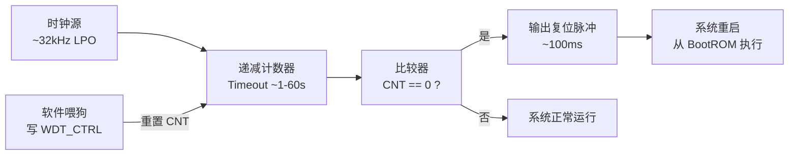
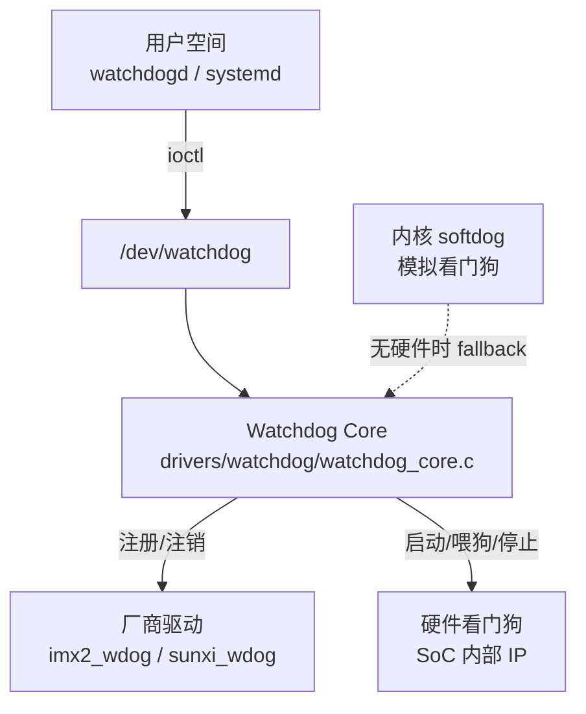
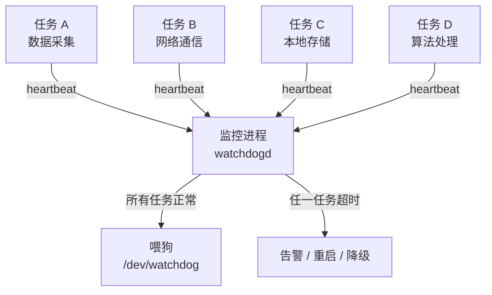
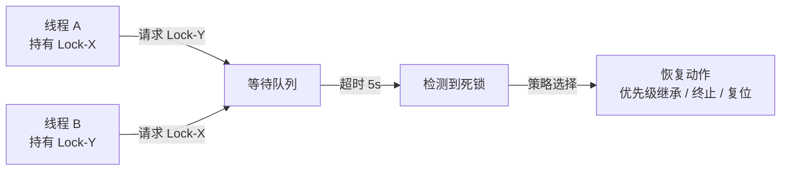

<span class="badge-i">[I]</span>

# 看门狗与心跳机制

<span class="red">嵌入式系统长期运行于无人值守环境，硬件故障、软件死锁、内存泄漏均可能导致系统挂死。看门狗（Watchdog）与心跳机制（Heartbeat）构成嵌入式系统的最后一道防线，前者在硬件层面强制复位，后者在软件层面实现故障感知与优雅恢复。</span>

<br>

---

## 为什么需要看门狗

<span class="red">通用计算机出现故障时用户可以手动重启，而嵌入式设备往往部署在远程、恶劣或无人环境，一次死机意味着业务中断、数据丢失甚至安全事故。</span>

### 嵌入式故障场景

| 故障类型 | 典型表现 | 检测难度 |
|---------|---------|---------|
| 软件死锁 | 任务循环等待互斥量，CPU 占用率归零 | 高 |
| 内存泄漏 | 可用内存持续下降，最终 OOM | 中 |
| 外设挂死 | DMA 传输超时，中断不再触发 | 高 |
| 电磁干扰 | 程序计数器跳转到非法地址 | 极高 |
| 温度漂移 | 晶振频率偏移导致时序错乱 | 极高 |

<span class="blue">关键结论：软件自检无法覆盖全部故障场景，必须引入独立于主程序的硬件监控机制。</span>

```c
// 伪代码：纯软件自检无法检测自身死锁
void main_loop() {
    while (1) {
        read_sensors();   // 若此处死锁，后续代码永不执行
        process_data();
        // 自检代码也在这里，同样无法执行
    }
}
```

<br>

---

## 硬件看门狗原理

<span class="red">硬件看门狗本质上是一个独立运行的递减计数器，由系统时钟或专用低频振荡器驱动，主程序必须在计数器归零前执行喂狗操作，否则看门狗输出复位信号强制重启系统。</span>

### 计数器工作模型



### 关键参数

| 参数 | 典型值 | 说明 |
|------|--------|------|
| 超时时间 | 1s ~ 60s | 需大于最坏情况任务周期 |
| 复位脉宽 | 10ms ~ 200ms | 确保 CPU 可靠复位 |
| 时钟源 | 内部 32kHz LPO | 独立于主时钟，主时钟停振仍可工作 |
| 窗口模式 | 最小+最大喂狗间隔 | 防止程序跑飞后意外喂狗 |

<span class="green">窗口看门狗（Window Watchdog）</span>要求喂狗发生在计数器值处于特定窗口区间内，过早或过晚均触发复位，可有效防止故障代码意外命中喂狗地址。<br>

<span class="blue">关键结论：超时时间必须覆盖系统最坏响应时间（如 Flash 擦除、大块 DMA），过短导致误复位，过长则故障发现延迟增大。</span>

<br>

---

## Linux 内核看门狗子系统

<span class="red">Linux 内核通过 Watchdog Core 框架统一管理各厂商的硬件看门狗驱动，用户空间通过字符设备 `/dev/watchdog` 或内核内置的 softdog 实现喂狗逻辑。</span>

### 内核架构



### 用户空间喂狗示例

```c
// watchdog_feed.c — 用户空间喂狗守护进程
#include <stdio.h>
#include <fcntl.h>
#include <unistd.h>
#include <linux/watchdog.h>

int main() {
    int fd = open("/dev/watchdog", O_WRONLY);
    if (fd < 0) { perror("open watchdog"); return 1; }

    // 设置超时 30 秒
    int timeout = 30;
    ioctl(fd, WDIOC_SETTIMEOUT, &timeout);

    while (1) {
        // 喂狗：向设备写入任意数据
        write(fd, "\0", 1);
        sleep(10);  // 10 秒喂一次，留有 3 倍裕量
    }
    // 优雅关闭：写 'V' 停止看门狗
    write(fd, "V", 1);
    close(fd);
    return 0;
}
```

<span class="orange"><strong>内核 nowayout 参数</strong></span>：若 `nowayout=1`，关闭 `/dev/watchdog` 不会停止看门狗，防止进程崩溃后系统失去保护。生产环境建议开启。<br>

<span class="blue">关键结论：`/dev/watchdog` 的默认超时通常偏保守（15-60s），需根据业务特性通过 `WDIOC_SETTIMEOUT` 精确配置。</span>

<br>

---

## 软件喂狗策略与多任务监控

<span class="red">单一进程喂狗无法区分是主任务正常还是故障任务被饿死，多任务系统需要分级监控：每个关键任务报告心跳，汇总进程统一喂狗。</span>

### 分级心跳架构



### 共享内存心跳表实现

```c
// heartbeat.h — 任务心跳共享内存协议
#ifndef HEARTBEAT_H
#define HEARTBEAT_H

#define HB_MAX_TASKS    8
#define HB_TIMEOUT_SEC  5

struct hb_entry {
    char name[16];          // 任务名称
    uint32_t seq;           // 递增序号
    uint64_t last_ts;       // 上次更新纳秒时间戳
    uint32_t state;         // 0=init 1=alive 2=dead
};

struct hb_table {
    uint32_t magic;         // 0x48425442 "HBTB"
    struct hb_entry tasks[HB_MAX_TASKS];
};

// 任务侧：周期性更新心跳
static inline void hb_beat(struct hb_entry *e) {
    e->seq++;
    e->last_ts = get_ns_monotonic();
    e->state = 1;
}

// 监控侧：扫描所有任务
static inline int hb_check_all(struct hb_table *tbl) {
    uint64_t now = get_ns_monotonic();
    for (int i = 0; i < HB_MAX_TASKS; i++) {
        if (tbl->tasks[i].state == 0) continue;  // 未注册
        uint64_t delta = now - tbl->tasks[i].last_ts;
        if (delta > HB_TIMEOUT_SEC * 1e9) return -1;  // 超时
    }
    return 0;  // 全部正常
}

#endif
```

<span class="orange"><strong>超时策略选择</strong></span>

| 策略 | 行为 | 适用场景 |
|------|------|---------|
| 立即复位 | 任一任务超时即触发看门狗 | 安全关键系统 |
| 告警降级 | 先尝试重启故障任务，连续 N 次失败再复位 | 高可用服务 |
| 分层复位 | 轻任务超时只杀进程，核心任务超时整系统复位 | 混合关键度系统 |

<span class="blue">关键结论：喂狗进程必须是系统中最高优先级的任务之一，避免被低优先级任务饿死导致误复位。</span>

<br>

---

## 死锁检测与自动恢复

<span class="red">死锁的根源是循环等待资源，检测死锁需要追踪锁的持有关系，嵌入式系统通常采用超时检测而非完整图算法，以平衡开销与准确性。</span>

### 互斥量超时检测模型



### 优先级继承协议

<span class="green">优先级继承（Priority Inheritance）</span>是解决优先级反转的标准方案：当高优先级线程等待低优先级线程持有的互斥量时，低优先级线程临时提升到高优先级，尽快释放锁。<br>

```c
// POSIX 互斥量启用优先级继承
pthread_mutexattr_t attr;
pthread_mutexattr_init(&attr);
pthread_mutexattr_setprotocol(&attr, PTHREAD_PRIO_INHERIT);
pthread_mutexattr_setrobust(&attr, PTHREAD_MUTEX_ROBUST);

pthread_mutex_t mutex;
pthread_mutex_init(&mutex, &attr);
```

<span class="orange"><strong>Robust 互斥量</strong></span>允许检测持有者线程崩溃的情况，下一个获取锁的线程会收到 `EOWNERDEAD` 错误，可执行恢复逻辑后标记锁为一致状态。<br>

<span class="blue">关键结论：RTOS（如 FreeRTOS、RT-Thread）通常内置优先级继承，Linux 需显式配置 `PTHREAD_PRIO_INHERIT`，且仅对实时调度策略（SCHED_FIFO/SCHED_RR）有效。</span>

<br>

---

## 历史演进

看门狗的概念最早出现在 1970 年代的工业控制系统中，当时以分立逻辑电路（555 定时器 + 计数器）实现，超时后输出硬复位信号。1980 年代随着单片机普及，Intel 8051 等 MCU 开始集成片上看门狗模块，但功能简单，仅支持固定超时。2000 年后，ARM SoC 看门狗演进为窗口模式、可编程超时、中断预警等高级特性，如 i.MX6 的 Watchdog 支持 16 位计数器与预分频器，超时可达数百秒。Linux 内核于 2002 年引入 Watchdog Core 框架，统一了此前各厂商杂乱的驱动接口，用户空间通过标准字符设备交互。2010 年后，随着物联网设备爆发，看门狗与 systemd 深度集成，`systemd-watchdog` 成为现代 Linux 发行版的标准配置。软件心跳机制则从早期简单的定时器喂狗，演进为多任务分级监控、故障预测（Predictive Maintenance）与云端健康上报的结合体。

<br>

---

## 本章小结

| 要点 | 内容 |
|------|------|
| 硬件看门狗 | 独立计数器，超时强制复位，窗口模式防意外喂狗 |
| Linux 子系统 | `/dev/watchdog` + Watchdog Core + 厂商驱动三层架构 |
| 软件喂狗策略 | 多任务分级心跳，共享内存表，超时策略可选 |
| 死锁恢复 | 优先级继承协议、Robust 互斥量、超时检测 |
| 配置原则 | 超时覆盖最坏响应时间，nowayout 生产环境必开 |

## 练习

1. 窗口看门狗与独立看门狗的核心区别是什么？为什么窗口模式能防止故障代码意外喂狗？
2. 在多任务系统中，若监控进程自身被高优先级任务饿死，会导致什么后果？如何从调度策略上避免？
3. 设计一个基于 Unix Domain Socket 的心跳协议，支持任务注册、心跳上报与状态查询，画出状态机并写出核心通信结构体。
