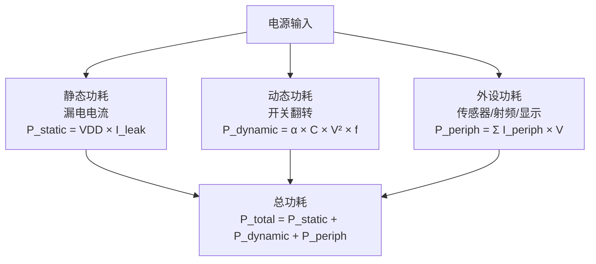
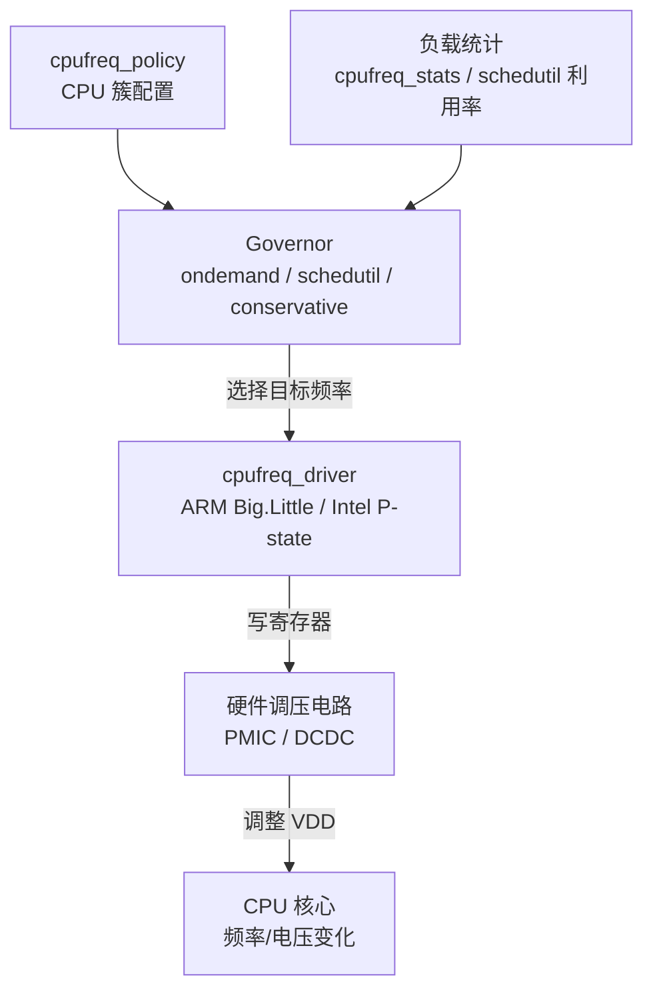
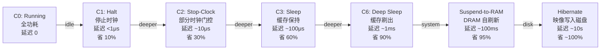
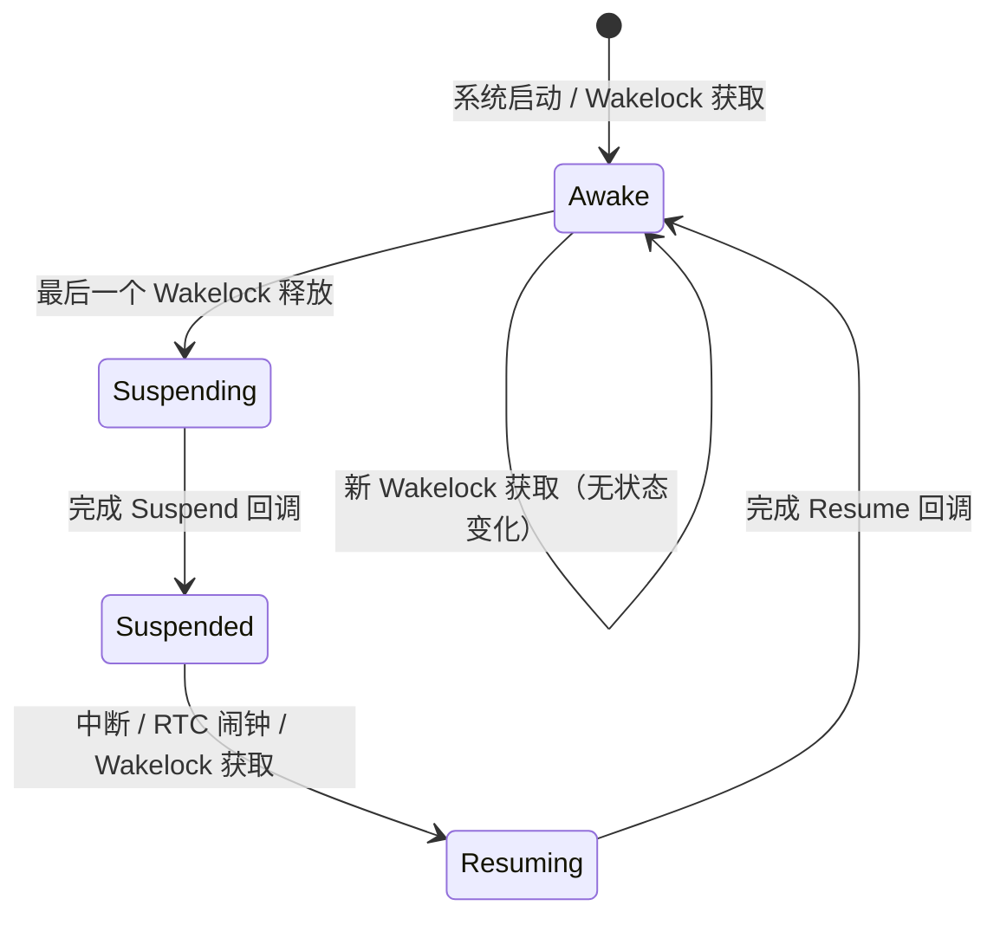

<span class="badge-i">[I]</span>

# 低功耗设计策略与实战

<span class="red">嵌入式设备常以电池或能量采集供电，功耗直接决定续航能力与散热设计。低功耗不仅是关闭外设那么简单，而是贯穿硬件选型、内核配置、应用架构与算法优化的系统工程，需要在响应速度与能耗之间找到动态平衡点。</span>

<br>

---

## 功耗来源与测量方法

<span class="red">系统功耗由静态漏电、动态开关功耗与外设能耗三部分构成，精确测量是优化的前提，没有数据驱动的功耗优化等于盲目试错。</span>

### 功耗构成模型



### 测量工具对比

| 工具 | 精度 | 采样率 | 适用场景 |
|------|------|--------|---------|
| 数字万用表 | 0.1% | 1-10Hz | 静态电流、休眠验证 |
| 示波器 + 电流探头 | 1% | MHz 级 | 瞬态电流、启动浪涌 |
| 专用功耗分析仪（N6705C / PPK2） | 0.025% | 200kHz | 全生命周期精细分析 |
| SoC 内置 PMU 计数器 | 8-12bit | 1kHz | 软件在线监控，无额外硬件 |

<span class="green">动态电压频率调节（DVFS）</span>的节能效果可通过公式量化：P_dynamic ∝ V² × f，频率减半且电压同比降低时，动态功耗降至 1/8。<br>

<span class="blue">关键结论：测量精度决定优化效果上限，建议在开发阶段即引入专用功耗分析仪建立基线数据。</span>

<br>

---

## DVFS：动态电压频率调节

<span class="red">DVFS 是 Linux 内核最成熟的功耗调控手段，通过 cpufreq  governor 根据负载动态调整 CPU 频率与电压，在性能需求低时降低能耗，在突发负载时快速拉升。</span>

### cpufreq 架构



### Governor 行为对比

| Governor | 策略 | 延迟 | 适用场景 |
|----------|------|------|---------|
| performance | 锁定最高频 | 零 | 基准测试、实时任务 |
| powersave | 锁定最低频 | 零 | 后台服务、无性能需求 |
| ondemand | 负载超阈值升频，逐级降频 | ~100ms | 通用桌面、服务器 |
| conservative | 负载超阈值逐级升频，逐级降频 | ~200ms | 笔记本、注重平滑 |
| schedutil | 直接利用调度器利用率信号 | ~5ms | 嵌入式、实时性要求高 |
| userspace | 用户空间控制 | 零 | 自定义策略、测试 |

```bash
# 查看可用 governor 与当前策略
$ cat /sys/devices/system/cpu/cpu0/cpufreq/scaling_available_governors
ondemand performance powersave
$ cat /sys/devices/system/cpu/cpu0/cpufreq/scaling_governor
ondemand

# 切换至 schedutil（推荐用于嵌入式）
$ echo schedutil | tee /sys/devices/system/cpu/cpu*/cpufreq/scaling_governor

# 查看频率转换统计
$ cat /sys/devices/system/cpu/cpu0/cpufreq/stats/time_in_state
```

<span class="orange"><strong>调度器利用率信号</strong></span>：schedutil 直接读取 CFS 的 `cpu_util` 指标，避免了传统 governor 的轮询开销，响应延迟从百毫秒级降至毫秒级。<br>

<span class="blue">关键结论：嵌入式 Linux 首选 schedutil，RT-Linux 或实时任务场景可结合 `cpufreq-set` 在任务起止时手动锁定频率。</span>

<br>

---

## 休眠策略：从 Idle 到 Deep Sleep

<span class="red">CPU 空闲时并非无事可做，Linux 内核提供多级 Idle 状态（C-state），从浅睡眠（C1，微秒级唤醒）到深睡眠（C3/C6，毫秒级唤醒但功耗降低一个数量级），SoC 还支持系统级挂起到内存（Suspend-to-RAM）与挂起到磁盘（Hibernate）。</span>

### C-state 层级



### cpuidle governor 配置

```bash
# 查看 CPU 支持的 C-state
$ cat /sys/devices/system/cpu/cpu0/cpuidle/state*/name
POLL
C1
C2
C3

# 查看驻留时间统计
$ cat /sys/devices/system/cpu/cpu0/cpuidle/state3/time
2847561000000

# 启用 menu governor（根据预期空闲时间预测最优 C-state）
$ echo menu | tee /sys/devices/system/cpu/cpuidle/current_driver_governor
```

<span class="orange"><strong>菜单 Governor 预测算法</strong></span>：menu governor 根据历史空闲模式与下一次定时器到期时间，预测本次空闲将持续多久，选择能完全覆盖该时长的最深 C-state，避免频繁进出浅睡眠的无效开销。<br>

<span class="blue">关键结论：中断密集的场景（如 1kHz 传感器采样）会频繁打断 C-state，此时应先在源头降低中断频率，而非盲目追求更深的 C-state。</span>

<br>

---

## Wakelock 与自动休眠

<span class="red">Android 时代的 Wakelock 机制被证明是移动设备功耗管理的关键抽象，它允许内核模块或用户进程显式声明"我需要保持唤醒"，当所有 Wakelock 释放后系统自动进入 Suspend。</span>

### Wakelock 状态机



### 内核 Wakelock 接口（Android 兼容层）

```c
// 内核模块获取/释放 wakelock
#include <linux/wakelock.h>

static struct wakelock my_wl;

void sensor_init(void) {
    wakelock_init(&my_wl, "sensor_wakeup");
}

void sensor_start_sampling(void) {
    wakelock_acquire(&my_wl);  // 禁止系统自动休眠
    enable_sensor_irq();
}

void sensor_stop_sampling(void) {
    disable_sensor_irq();
    wakelock_release(&my_wl);    // 允许系统评估是否休眠
}
```

### systemd 自动休眠（非 Android Linux）

```bash
# /etc/systemd/sleep.conf — 配置自动休眠策略
[Sleep]
SuspendState=mem      # 挂起到内存
HibernateState=disk # 挂起到磁盘
IdleAction=suspend    # 空闲时自动挂起
IdleActionSec=30min   # 空闲 30 分钟后触发
```

<span class="orange"><strong>休眠与实时性的矛盾</strong></span>：Suspend-to-RAM 的恢复延迟通常在 100ms 以上，对实时控制类嵌入式系统不可接受，此类系统应放弃自动休眠，改用 C-state + DVFS 策略。<br>

<span class="blue">关键结论：工业控制、车载电子等场景通常禁用自动休眠，仅在维护窗口或故障安全态进入深度睡眠。</span>

<br>

---

## 外设功耗管理与功耗 Profiling

<span class="red">CPU 功耗只是冰山一角，射频模块、显示屏、传感器、马达驱动往往是系统功耗的大头，外设功耗管理需要精细化到每个器件的开关时序与供电域隔离。</span>

### 外设功耗预算表

| 外设 | 活动功耗 | 待机功耗 | 开关延迟 | 优化策略 |
|------|---------|---------|---------|---------|
| WiFi 模组 | 200-400mA | 1-5mA | ~50ms | 批量传输 + 休眠间隔 |
| 4G/5G 模组 | 500-1000mA | 5-10mA | ~1s | eDRX/PSM 模式 |
| GPS | 30-50mA | 10μA | ~2s | 热启动缓存星历 |
| OLED 显示 | 20-80mA | 0 | ~10ms | 自动熄屏、局部刷新 |
| 温度传感器 | 1mA | 1μA | ~1ms | 按需唤醒单次采样 |

### 功耗 Profiling 脚本示例

```bash
#!/bin/bash
# power_profile.sh — 采集系统级功耗指标
# 需要 root 权限，配合 N6705C 或 PPK2 外部采样

LOG="power_$(date +%Y%m%d_%H%M%S).csv"
echo "timestamp,cpu_freq,cpu_load,mem_avail,wakelocks,gpu_freq,current_mA" > "$LOG"

while true; do
    TS=$(date +%s.%N)
    FREQ=$(cat /sys/devices/system/cpu/cpu0/cpufreq/scaling_cur_freq 2>/dev/null)
    LOAD=$(cat /proc/loadavg | awk '{print $1}')
    MEM=$(cat /proc/meminfo | grep MemAvailable | awk '{print $2}')
    WL=$(cat /sys/power/wakelock 2>/dev/null | wc -l)
    GPU=$(cat /sys/class/misc/mali0/device/clock 2>/dev/null)
    # current_mA 需从外部功耗分析仪串口读取
    CUR="N/A"
    echo "$TS,$FREQ,$LOAD,$MEM,$WL,$GPU,$CUR" >> "$LOG"
    sleep 1
done
```

<span class="green">Runtime PM（Runtime Power Management）</span>是 Linux 内核为每个设备提供的按需电源管理框架，设备在最后一次使用后自动挂起，下次访问时自动恢复。<br>

```bash
# 查看 USB 设备的 Runtime PM 状态
$ cat /sys/bus/usb/devices/1-1/power/runtime_status
suspended  # 或 active

# 强制允许自动挂起
$ echo auto > /sys/bus/usb/devices/1-1/power/control
```

<span class="blue">关键结论：外设功耗优化遵循"谁使用谁负责"原则，每个驱动应实现 `runtime_suspend` / `runtime_resume` 回调，由内核自动管理设备生命周期。</span>

<br>

---

## 历史演进

嵌入式低功耗设计的历史与电池技术演进密不可分。1990 年代的便携式设备（如 Palm PDA）依赖简单的 CPU 休眠指令与显示屏背光关闭，功耗优化手段极为粗糙。2000 年后，Intel 在笔记本处理器中引入 SpeedStep 技术，成为 DVFS 的先驱，ARM 紧随其后在 ARM11 系列中支持动态频率调节。2008 年 Android 1.0 引入 Wakelock 机制，解决了 Linux 原生电源管理与移动场景的错配问题，但该机制过于激进，导致大量"唤醒锁泄漏"问题。2012 年 Linux 3.5 内核合入 `autosleep` 与 `wakeups` 框架，试图统一 Android 与主线内核的电源管理语义。2015 年后，ARM 推出 big.LITTLE 架构与 DynamIQ 技术，将异构多核的功耗调度推向新高度，Little 核负责低负载，Big 核负责突发性能需求。2020 年至今，RISC-V 生态在功耗管理方面追赶 ARM，各厂商 SoC 开始集成精细化的电源域（Power Domain）与全局电源控制器（PDC），支持单核独立下电与亚阈值电压操作，嵌入式低功耗设计进入纳安级时代。

<br>

---

## 本章小结

| 要点 | 内容 |
|------|------|
| 功耗模型 | 静态漏电 + 动态开关 + 外设能耗，P_dynamic ∝ V² × f |
| DVFS | cpufreq governor 选 schedutil，实时场景可手动锁定 |
| 休眠层级 | C-state（Idle）→ Suspend-to-RAM → Hibernate，越深延迟越大 |
| Wakelock | 显式声明唤醒需求，全释放后自动 Suspend |
| 外设管理 | Runtime PM 按需挂起，功耗预算表指导设计 |
| Profiling | 外部分析仪建立基线，内核统计辅助在线监控 |

## 练习

1. 某 ARM SoC 在 1.2V/1GHz 下动态功耗为 800mW，若通过 DVFS 降至 0.9V/600MHz，理论动态功耗约为多少？说明计算过程。
2. 为什么中断密集型任务（如 1kHz 定时采样）会导致 cpuidle 效率下降？从 C-state 进出开销角度分析。
3. 设计一个基于 `sysfs` 的用户空间功耗调控接口，支持查询当前 C-state 驻留时间、切换 governor、设置目标频率上限，写出核心 `ioctl` 或 `sysfs` 属性设计。
